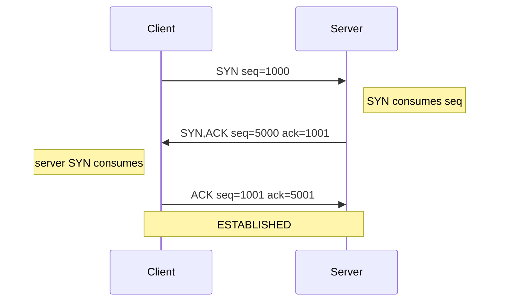
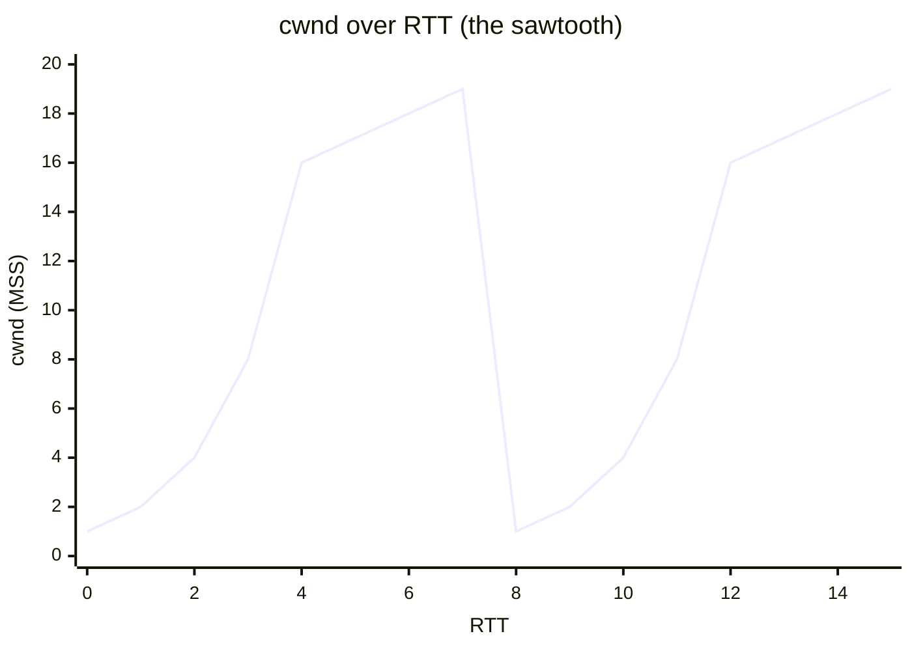
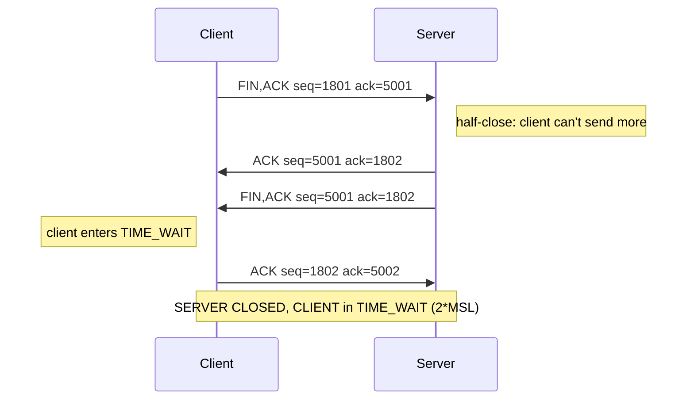

# TCP Handshake — Connection Establishment, Teardown, and Why Distributed Systems Can't Trust TCP Alone

> A *concept-as-a-bundle*. This guide is built entirely from numbers printed by
> [`tcp_handshake.py`](./tcp_handshake.py). Every figure sits under a
> `> From tcp_handshake.py Section X:` callout and can be re-audited by running
> `python3 tcp_handshake.py`. The interactive companion recomputes the same
> formulas in JS: [`tcp_handshake.html`](./tcp_handshake.html).
>
> **Companion files:** [`tcp_handshake.py`](./tcp_handshake.py) ·
> [`tcp_handshake_output.txt`](./tcp_handshake_output.txt) ·
> [`tcp_handshake.html`](./tcp_handshake.html)
>
> **See also:** 🔗 [RAFT.md](./RAFT.md) · [PAXOS.md](./PAXOS.md) ·
> [LAMPORT_TIMESTAMPS.md](./LAMPORT_TIMESTAMPS.md) · [CHAIN_REPLICATION.md](./CHAIN_REPLICATION.md)

---

## 0. The intuition — the registered-mail phone call

TCP is a **reliable, ordered, byte-stream** pipe between two processes. Picture
two offices exchanging numbered, registered envelopes over a courier network:

- **Handshake** — before any real mail, both offices exchange *"are you ready?"*
  notes and each picks a secret starting number (the **ISN**). Three segments
  (SYN, SYN-ACK, ACK) make sure both sides agree on those starting numbers, so a
  delayed envelope from a *previous* call cannot be mistaken for a new one.
- **Data** — every envelope carries a **sequence number**. The receiver signs
  (**ACKs**) for the next number it expects. Lost envelope? resend. Out of order?
  buffer + reorder.
- **Flow control** — the receiver stamps every ACK with how much free shelf
  space it has (the **advertised window, rwnd**). The sender never mails more
  than the receiver can shelf.
- **Congestion control** — the sender also keeps *its own* window (**cwnd**)
  sized by what the *network* can carry. Start tiny, double each round, then
  grow linearly; on any loss, halve the target and restart tiny. The sawtooth.
- **Teardown** — each side says **FIN** ("no more to send"), the other ACKs,
  then says its own FIN. The side that closes first lingers in **TIME_WAIT**
  (2×MSL) to catch straggling envelopes before reusing the port.

**The catch for distributed systems:** TCP's guarantees hold *only within one
living connection*. When a server crashes and a load balancer redirects you to a
*new* server, the connection is **reset (RST)** — in-flight requests evaporate,
and a blind retry can double-execute a non-idempotent operation. So real systems
layer application defenses on top (idempotency keys, logical clocks, consensus
logs). Trust TCP for the bytes; trust your protocol for the semantics.

### Glossary

| term | meaning |
|---|---|
| **segment** | one TCP packet: flags + seq + ack + window. |
| **seq** | byte-offset (from this side's ISN) of the *first* payload byte. |
| **ack** | "the next byte number I expect from *you*" — cumulative. |
| **ISN** | Initial Sequence Number. Random-ish start to disambiguate connections. |
| **SYN / FIN** | control flags; each **consumes one sequence number** despite carrying no payload. |
| **rwnd** | receiver-advertised free buffer (flow control). |
| **cwnd** | congestion window — the sender's network estimate. Send window = `min(rwnd, cwnd)`. |
| **ssthresh** | slow-start threshold. Below it: exponential; at/above: linear (AIMD). |
| **MSS** | Maximum Segment Size (payload bytes). Here 100, for clean arithmetic. |
| **MSL** | Maximum Segment Lifetime (~2 min). TIME_WAIT lasts 2×MSL. |

### The spec & lineage

- **RFC 793** (Postel, 1981) — the original TCP: handshake, state machine, seq
  numbers, the 4-way close + TIME_WAIT.
- **Jacobson 1988** — *"Congestion Avoidance and Control"*. Invents slow start +
  AIMD. The sawtooth is his.
- **RFC 5681** (Allman, 2009) — current congestion-control spec.
- **RFC 6298** (Allman, 2011) — the retransmission timeout (RTO).
- **RFC 1323** (Jacobson, 1992) — window scaling + timestamps (PAWS).
- **QUIC** (RFC 9000, 2021) — same reliability over UDP to dodge TCP head-of-line blocking.

---

## A. The 3-way handshake

> From tcp_handshake.py Section A:
> ```
> Worked numbers: ISN_client (ISN_C) = 1000, ISN_server (ISN_S) = 5000, MSS = 100.
>
> Step 1 - CLIENT sends SYN (I want to talk; my seq starts at ISN_C):
>     C->S SYN       seq=1000  win=400   // client picks ISN_C
>       SYN consumes seq #1000, so server's ACK will expect 1001.
>
> Step 2 - SERVER sends SYN-ACK (yes; MY seq starts at ISN_S; I expect your 1001):
>     S->C SYN,ACK   seq=5000  ack=1001  win=400
>       server's SYN consumes seq #5000, so client's ACK expects 5001.
>
> Step 3 - CLIENT sends ACK (I confirm your SYN; connection OPEN):
>     C->S ACK       seq=1001  ack=5001  win=400
>
> State after handshake:
>     client: seq_next = 1001   (= ISN_C + 1, the SYN byte was consumed)
>     server: seq_next = 5001   (= ISN_S + 1, the SYN byte was consumed)
> ```



### The core arithmetic (the gold check)

A SYN and a FIN each **consume one sequence number** even though they carry no
data — they occupy a byte slot. Pure data consumes `datalen` slots. A pure ACK
with no SYN/FIN/data consumes *none*, so it is never itself acked:

> From tcp_handshake.py Section A:
> ```
> [check] SYN acked with 1001 = ISN_C+1 = 1000+1;
>         server SYN acked with 5001 = ISN_S+1 = 5000+1:  OK
> ```

| segment | seq | consumes | receiver ACKs with |
|---|---|---|---|
| SYN | 1000 | 1 (the SYN flag) | **1001** |
| SYN-ACK | 5000 | 1 (the SYN flag) | **5001** |
| data (100 B) | 1001 | 100 | **1101** |
| FIN | 1101 | 1 (the FIN flag) | **1102** |

### Why three steps, not two?

Step 1 proves client→server works; step 2 proves **both** server→client *and*
that the server received the SYN; step 3 proves the client received the server's
SYN. Without step 3, the server could be talking to nobody (the client's SYN
could have been spoofed). Each direction is independently confirmed.

### Why random ISNs (not 0 every time)?

Imagine a stray segment from a *previous* connection (same 4-tuple) that wanders
in 60 s late. If every connection started at seq 0, that stale byte-stream would
land *exactly* on the new connection's sequence space and corrupt it. A fresh,
hard-to-guess ISN shifts the window so old segments fall outside it. Predictable
ISNs enabled the classic TCP sequence-number injection (Mitnick 1994); modern
stacks randomize them (RFC 6528).

---

## B. Sliding window flow control

> From tcp_handshake.py Section B:
> ```
> Worked: after handshake client_seq=1001, rwnd=400 bytes (4 segments of 100 B).
>
> Round 1 - SEND until the window is full (4 segments in flight):
>     C->S ACK  seq=1001  len=100   // segment 1
>     C->S ACK  seq=1101  len=100   // segment 2
>     C->S ACK  seq=1201  len=100   // segment 3
>     C->S ACK  seq=1301  len=100   // segment 4
>       in_flight = send_next - send_base = 1401 - 1001 = 400 bytes  (== rwnd, FULL)
>
> Round 2 - ACKs arrive one per segment; the window slides:
>   ACK ack=1101 -> send_base slides to 1101 -> send segment 5 at seq 1401
>   ACK ack=1201 -> send_base slides to 1201 -> send segment 6 at seq 1501
>   ACK ack=1301 -> send_base slides to 1301 -> send segment 7 at seq 1601
>   ACK ack=1401 -> send_base slides to 1401 -> send segment 8 at seq 1701
>
>       after 4 ACKs: send_base=1401, send_next=1801, in_flight=400
> ```

Flow control keeps a fast sender from drowning a slow receiver. The receiver
stamps every ACK with **rwnd** (its free buffer). The sender keeps a window of
un-acked bytes; it may not let that window exceed rwnd. As ACKs arrive, the
window **slides**: the left edge (`send_base`) jumps forward, opening room at the
right edge to send new bytes.

```
   send_base        send_next              send_base + rwnd (window right edge)
       |                |                              |
       v                v                              v
  ... [acked] |  1  2  3  4  |                     (cannot send past here)
              ^^^^^^^^^^^^^^
                in flight (<= rwnd)
```

The pipeline stays **full** — that is the whole point of the window: it keeps the
pipe stuffed instead of send-one-wait-one. If the receiver advertises **rwnd=0**
(buffer full), the sender must stop and send zero-window probes until the
receiver re-advertises space.

---

## C. Congestion control — the sawtooth

> From tcp_handshake.py Section C:
> ```
> Deterministic run: cwnd0=1, ssthresh0=16, loss injected at RTT 7.
>
> | RTT | cwnd | ssthresh | phase                  | event                    |
> |-----|------|----------|------------------------|--------------------------|
> | 0   | 1    | 16       | slow-start             | growth                   |
> | 1   | 2    | 16       | slow-start             | growth                   |
> | 2   | 4    | 16       | slow-start             | growth                   |
> | 3   | 8    | 16       | slow-start             | growth                   |
> | 4   | 16   | 16       | congestion-avoidance   | growth                   |
> | 5   | 17   | 16       | congestion-avoidance   | growth                   |
> | 6   | 18   | 16       | congestion-avoidance   | growth                   |
> | 7   | 19   | 9        | congestion-avoidance   | LOSS -> ssthresh=cwnd/2  |
> | 8   | 1    | 9        | slow-start             | growth                   |
> | 9   | 2    | 9        | slow-start             | growth                   |
> | 10  | 4    | 9        | slow-start             | growth                   |
> | 11  | 8    | 9        | slow-start             | growth                   |
> | 12  | 16   | 9        | congestion-avoidance   | growth                   |
> | 13  | 17   | 9        | congestion-avoidance   | growth                   |
> | 14  | 18   | 9        | congestion-avoidance   | growth                   |
> | 15  | 19   | 9        | congestion-avoidance   | growth                   |
>
> cwnd series (the sawtooth): [1, 2, 4, 8, 16, 17, 18, 19, 1, 2, 4, 8, 16, 17, 18, 19]
> ```

Flow control (Section B) protects the **receiver**. Congestion control protects
the **network**. The sender keeps a second window, `cwnd`, and probes based on
success or loss. The real send window is `min(rwnd, cwnd)`. Jacobson 1988 / RFC
5681 define the classic shape:

- **Slow start** — `cwnd` starts at 1 MSS and **doubles each RTT** (exponential).
  Bandwidth is probed fast.
- **Congestion avoidance (AIMD)** — once `cwnd >= ssthresh`, grow **linearly**
  (+1 MSS/RTT). Probe gently.
- **Loss (multiplicative decrease)** — `ssthresh = cwnd/2`; restart `cwnd = 1`.

Plot `cwnd` over RTTs and you get the famous **sawtooth**: sharp drops, slow climbs.



**Reading the trace:** RTTs 0-3 double (1→2→4→8). RTT 4 hits 16 == ssthresh and
switches to AIMD. RTTs 5-7 climb linearly (17→18→19); at RTT 7 a loss is detected
→ `ssthresh = 19//2 = 9`, and the next RTT restarts at cwnd=1 (the drop). RTTs
8-11 slow-start again; at RTT 11 cwnd=8 (< 9) doubles to 16, **overshooting**
ssthresh (discrete doubling can't land on 9 exactly). RTTs 13-15 climb back to 19.

> From tcp_handshake.py Section C:
> ```
> [check] pre-loss peak cwnd=19, post-loss ssthresh=9; cwnd series length 16:  OK
> ```

---

## D. The 4-way teardown + TIME_WAIT

> From tcp_handshake.py Section D:
> ```
> Step 1 - CLIENT sends FIN:
>     C->S FIN,ACK  seq=1801  ack=5001   // client: 'I have no more data'
>       FIN consumes seq #1801; server's ACK will expect 1802.
> Step 2 - SERVER sends ACK of FIN (half-close):
>     S->C ACK      seq=5001  ack=1802
> Step 3 - SERVER sends its FIN:
>     S->C FIN,ACK  seq=5001  ack=1802   // server: 'I have no more data either'
>       server's FIN consumes seq #5001; client's ACK expects 5002.
> Step 4 - CLIENT sends ACK of server FIN:
>     C->S ACK      seq=1802  ack=5002
>       SERVER is now CLOSED. CLIENT enters TIME_WAIT.
>
> TIME_WAIT: client lingers 240s (= 2 * MSL = 2 * 120s)
> ```

Closing is **not symmetric**: each direction closes independently (TCP is
full-duplex). The side done sending issues **FIN**; the other ACKs and *may keep
sending* (half-close). When both are done, four segments have crossed.



### Why TIME_WAIT, and why it exhausts ports

The side that sent the first final-ACK lingers in **TIME_WAIT** for **2×MSL** so
that (1) if its final ACK was lost, the peer retransmits FIN and it can re-ACK;
and (2) any wandering duplicate segment from this 4-tuple dies out *before* the
port is reused, so it cannot poison a new connection.

That lingering is what exhausts ports in load balancers:

> From tcp_handshake.py Section D:
> ```
> ephemeral ports ~= 28232; TIME_WAIT = 240s
> => max ~28232/240 = 117.6 new conn/s per src IP
> ```

A load balancer opening many short-lived connections keeps each closed one in
TIME_WAIT for 4 minutes. The ephemeral-port range is finite (~28232 on Linux,
32768–60999). Each live + TIME_WAIT 4-tuple holds one, capping new connections at
~118/s per source IP — the classic *"Cannot assign requested address"* under
load. Mitigations: `SO_REUSEADDR`/`SO_LINGER`, longer keep-alives, or connection
pools. This is a big reason HTTP/2 and connection pools exist: amortize the
handshake/teardown over many requests.

---

## E. Why distributed systems need more than TCP

> From tcp_handshake.py Section E:
> ```
> TCP guarantees ordered, reliable, non-duplicated delivery -- but ONLY
> *within a single living connection*. Real distributed systems fail over,
> multiplex logical streams, and must survive crashes. Three cracks:
> ```

TCP's guarantees are **per-connection**. Real distributed systems fail over,
multiplex logical streams, and must survive crashes. Three cracks:

### (1) Head-of-line blocking (within one connection)

TCP delivers a strictly ordered byte stream. If byte N is lost, bytes N+1, N+2, …
that *already arrived* are **held** in the kernel until N is retransmitted — even
if they belong to an independent logical request. HTTP/2 multiplexes many
streams over one TCP connection, so a loss on stream A stalls streams B, C, D
that have nothing to do with A. **QUIC** (RFC 9000) runs its own per-stream
reliability over UDP precisely to remove this coupling.

### (2) Connection reset during failover (between connections)

When a server crashes, a load balancer redirects the client to a *new* backend
over a *new* TCP connection. The old connection is torn down with an **RST** —
any request still in flight is lost, the app sees `ECONNRESET`. A naive retry
can then **double-execute** a non-idempotent operation:

> From tcp_handshake.py Section E:
> ```
> client -> node A: INCR counter (op_id=7) over TCP conn #1
> node A applies it (counter: 0 -> 1) then CRASHES before replying
> client times out, opens TCP conn #2 to node B (failover)
> client retries: INCR counter (op_id=7) over TCP conn #2
> node B applies it (counter: 1 -> 2)  <- DOUBLE INCREMENT!
> ```

The fix: an **idempotency key** (`op_id=7`). Node B records it was already done
(propagated via replication) and returns the cached result instead of
re-executing. `SET x=1` is idempotent (retry is a no-op); `INCR` /
`charge-$100` are **not**, and must carry a dedup key.

### (3) Consensus does not trust TCP ordering

Raft/Paxos do **not** rely on "whatever order TCP delivered the bytes" for
correctness. Each log entry carries its own **(term, index)**. If a leader's TCP
connection is reset and a follower reconnects, the `AppendEntries` RPC
re-specifies `(term=3, index=7, entry=…)`. The follower de-duplicates / truncates
by **index**, not by arrival order. TCP is just the transport; the protocol's
ordering is logical, application-level, and survives connection resets. 🔗
[RAFT.md](./RAFT.md) · [PAXOS.md](./PAXOS.md) · [LAMPORT_TIMESTAMPS.md](./LAMPORT_TIMESTAMPS.md).

---

## Gold check — the full lifecycle, recomputed

> From tcp_handshake.py Gold Check:
> ```
> Handshake:
>   SYN        ack_value = 1001   (= ISN_C + 1 = 1001)
>   SYN-ACK    ack_value = 5001   (= ISN_S + 1 = 5001)
>   client seq_next after open = 1001
>   server seq_next after open = 5001
>
> Data (4 segments x 100 bytes):
>   segment acks = [1101, 1201, 1301, 1401]
>   final client seq_next = 1401  (= 1001 + 400)
>   cumulative ACK the server sends back = 1401  (= last_seg.seq + len)
>
> Teardown:
>   client FIN seq = 1401 -> server ACK = 1402
>   server FIN seq = 5001 -> client ACK = 5002
>   TIME_WAIT      = 2 * MSL = 240 s
>
> Congestion sawtooth cwnd series:
>   [1, 2, 4, 8, 16, 17, 18, 19, 1, 2, 4, 8, 16, 17, 18, 19]
>   pre-loss peak cwnd = 19; post-loss ssthresh = 9
>
> GOLD scalars (pinned for a compact .html check):
>   isn_client            = 1000
>   isn_server            = 5000
>   ack_of_syn            = 1001        (ISN_C + 1)
>   ack_of_syn_ack        = 5001        (ISN_S + 1)
>   client_seq_after_open = 1001
>   server_seq_after_open = 5001
>   data_ack_after_4_segs = 1401       (last seq + len)
>   ack_of_client_fin     = 1402       (FIN consumes 1)
>   ack_of_server_fin     = 5002       (FIN consumes 1)
>   time_wait_seconds     = 240     (2 * MSL)
>   pre_loss_peak_cwnd    = 19
>   post_loss_ssthresh    = 9
>   ephemeral_ports       = 28232  (32768..60999)
>   port_rate_cap_per_sec = 117.6  (ephemeral / TIME_WAIT)
>
> [check] all seq/ack arithmetic reproduces from ISN_C/ISN_S/MSS, the
>         sawtooth is deterministic, and TIME_WAIT = 240s:  OK
> ```

The capstone verifies the **sequence/ack arithmetic across a connection's full
life** — handshake → data → teardown — plus the deterministic congestion
sawtooth and the TIME_WAIT / port-exhaustion math. Every value is recomputed by
[`tcp_handshake.html`](./tcp_handshake.html) from the identical constants
(`ISN_C=1000`, `ISN_S=5000`, `MSS=100`, `MSL=120`); the green `[check: OK]` badge
confirms the JS recompute matches the `.py` exactly.

The one formula that ties it all together:

> **next expected seq = last ack value = segment.seq + (1 if SYN or FIN) + datalen**

Trust TCP for the bytes. Trust your protocol for the semantics.
