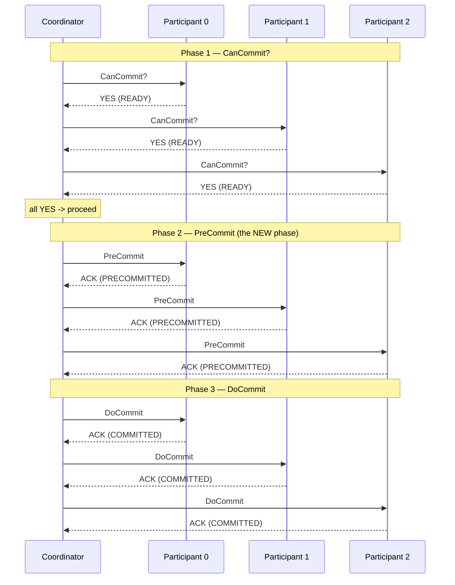
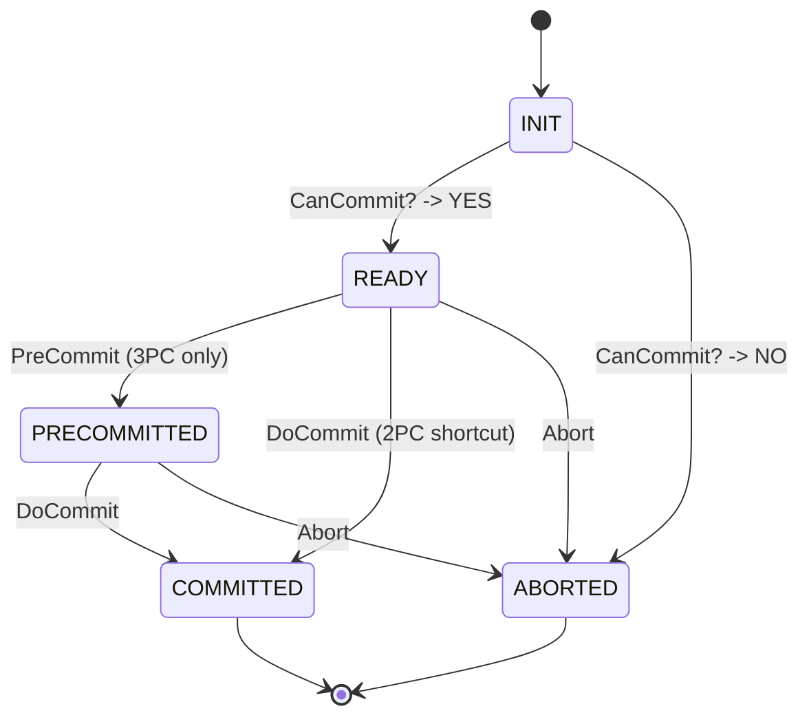
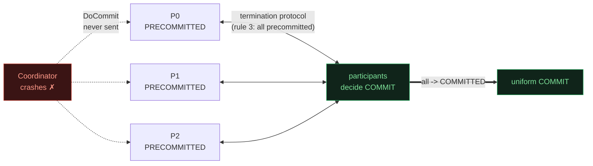

# Three-Phase Commit — Non-blocking Atomic Commit (Skeen 1981)

> A concept bundle for distributed systems. Every number below is printed by
> **`three_phase_commit.py`** (pure Python stdlib, run with
> `python3 three_phase_commit.py`) and recomputed live in
> **`three_phase_commit.html`**. This guide never hand-computes anything — it
> cites the `.py` output verbatim.
>
> 🔗 Interactive companion: `three_phase_commit.html` &nbsp;|&nbsp; Source of truth: `three_phase_commit.py`

---

## 0. The one-paragraph version

A distributed transaction spans several **participants**. To stay consistent,
at the end **either every participant commits or every participant aborts** —
no half-and-half. The **coordinator** runs the ceremony. **2PC** (Gray 1978)
does this in two phases but **blocks** if the coordinator crashes at the worst
moment. **3PC** (Skeen 1981) inserts a middle **PreCommit** phase so that, in a
**synchronous** network, participants can always finish without the coordinator.

- **Phase 1 — `CanCommit?`** — everyone votes `YES`/`NO`.
- **Phase 2 — `PreCommit`** — *"everyone voted YES; get ready."* A participant
  that receives PreCommit now **knows** the commit is unstoppable.
- **Phase 3 — `DoCommit`** — *"commit, for real."*

The whole point is the PreCommit gate: the coordinator sends PreCommit **only
after a unanimous YES**, so reaching `PRECOMMITTED` is a **certificate** that
everyone voted yes. When the coordinator then crashes, participants run a
**termination protocol**, examine everyone's state, and decide — no blocking.

| | 2PC | 3PC |
|---|---|---|
| **phases** | 2 (`CanCommit?`, `Commit`) | 3 (`CanCommit?`, `PreCommit`, `DoCommit`) |
| **round trips** | `2` | `3` (+1 latency) |
| **coordinator crash while participants READY** | **BLOCKS** | non-blocking (decides commit or abort) |
| **assumption** | crash-stop coordinator | crash-stop coordinator **+ synchronous network** |

> From `three_phase_commit.py` Section D (comparison table):
> ```text
> | protocol | phases | round trips | messages = sweeps*N | coordinator crash while READY |
> |----------|--------|-------------|---------------------|-----------------------------|
> | 2PC      | 2      | 2           | 4*N msgs       | BLOCKS (participant cannot decide) |
> | 3PC      | 3      | 3           | 6*N msgs       | NON-BLOCKING (PreCommit settles it) |
> ```

---

## 1. The wedding intuition & the three phases

Imagine a wedding that must be **unanimous**: either everyone says "I do" or the
whole thing is called off, and **no participant may end in a different state**
than the others. The coordinator is the officiant.



- **Phase 1 (CanCommit?)** — each participant votes. `YES` → state `READY`
  (uncertain, willing). `NO` → straight to `ABORTED`.
- **Phase 2 (PreCommit)** — sent **only after a unanimous YES**. Each `READY`
  participant → `PRECOMMITTED`. This is the **one transition 3PC adds over 2PC**.
- **Phase 3 (DoCommit)** — each `PRECOMMITTED` participant → `COMMITTED` (final).

The participant state machine:



The `READY → PRECOMMITTED` edge is everything. In **2PC** that edge does not
exist — a `READY` participant jumps straight to `COMMITTED`, which is precisely
why a coordinator crash while `READY` is fatal (Section 4).

---

## 2. Section A — the three phases in action (`3 participants, all YES`)

A clean commit with `N=3` participants. Read the trace as six vertical sweeps
(three phases × request+reply).

> From `three_phase_commit.py` Section A:
> ```text
>   Coordinator -> P0: CanCommit?
>   P0 -> Coordinator: YES  (P now READY)
>   Coordinator -> P1: CanCommit?
>   P1 -> Coordinator: YES  (P now READY)
>   Coordinator -> P2: CanCommit?
>   P2 -> Coordinator: YES  (P now READY)
>   Phase 1 result: 3/3 YES -> UNANIMOUS, proceed to PreCommit
>   Coordinator -> P0: PreCommit
>   P0 -> Coordinator: ACK  (P now PRECOMMITTED)
>   ... (P1, P2 likewise)
>   Phase 2 result: all PRECOMMITTED, proceed to DoCommit
>   Coordinator -> P0: DoCommit
>   P0 -> Coordinator: ACK  (P now COMMITTED)
>   ... (P1, P2 likewise)
>   Phase 3 result: all COMMITTED -> transaction committed
>
> Final states: P0=COMMITTED, P1=COMMITTED, P2=COMMITTED
> ```

**Cost vs 2PC.** 3PC adds the PreCommit round trip → **3 round trips** (2PC
needs 2). With `N=3`:

> ```text
>   3PC messages = 6*N = 18   round trips = 3
>   2PC messages   = 4*N = 12   round trips = 2
> ```

That extra round trip (+50% messages, +1 RT) is the **price** of the
non-blocking recovery shown next. 🔗 Step through all three phases live in
`three_phase_commit.html` Panel ①.

---

## 3. Section B — coordinator crash AFTER PreCommit → autonomous commit

The headline win. All participants vote YES, the coordinator delivers
**PreCommit** to everyone (all reach `PRECOMMITTED`), then **crashes before
`DoCommit`**. In 2PC this is the nightmare window; in 3PC the participants just
finish the job.

> From `three_phase_commit.py` Section B:
> ```text
>   *** COORDINATOR CRASHES after PreCommit (before sending DoCommit) ***
>
> States at crash: P0=PRECOMMITTED, P1=PRECOMMITTED, P2=PRECOMMITTED
> ...
>   termination protocol: pooling participant states:
>     P0: PRECOMMITTED
>     P1: PRECOMMITTED
>     P2: PRECOMMITTED
>   -> decision: COMMIT   (ALL PRECOMMITTED -> everyone voted YES -> commit safe)
>
> Final states: P0=COMMITTED, P1=COMMITTED, P2=COMMITTED
> ```

**Why this is safe.** A `PRECOMMITTED` participant holds a certificate: the
coordinator only sends PreCommit after **every** participant voted YES. So once
*any* participant is `PRECOMMITTED`, the commit was effectively decided —
`DoCommit` was just the public announcement. The termination rule that fires
here is **rule (3): all PRECOMMITTED → COMMIT**.



No participant blocks — they all reach `COMMITTED` **without the coordinator**.

---

## 4. Section C — coordinator crash BEFORE PreCommit → safe abort

Now the coordinator crashes **after Phase 1 but before PreCommit**. Every
participant is `READY` (voted YES, uncertain). None received the PreCommit
certificate.

> From `three_phase_commit.py` Section C:
> ```text
>   *** COORDINATOR CRASHES after Phase 1 (before sending PreCommit) ***
>
> States at crash: P0=READY, P1=READY, P2=READY
> ...
>   -> decision: ABORT   (some participant still READY (uncertain) ->
>                        cannot guarantee a unanimous YES -> abort to be safe)
>
> Final states: P0=ABORTED, P1=ABORTED, P2=ABORTED
> ```

**Why abort.** A `READY` participant **cannot** assume the commit will happen.
Maybe the coordinator crashed, or maybe it crashed *because* some **other**
participant voted NO and the coordinator was about to abort — a `READY`
participant has no way to tell. So the safe move is to abort. Termination rule
**(4): some participant still uncertain → ABORT**.

This is **still non-blocking** — nobody waits for the coordinator; they
*actively* decide ABORT. Contrast 2PC: a `READY` participant after this same
crash would **BLOCK**, because it cannot safely abort *or* commit. 3PC's
PreCommit phase is exactly what splits "uncertain" (`READY`) from "safe to
commit" (`PRECOMMITTED`), turning a block into a decision.

---

## 5. The termination protocol (Skeen 1981)

When the coordinator crashes, the surviving participants pool their states and
decide by these four rules — the heart of 3PC's non-blocking property:

| rule | participant states observed | decision | why |
|---|---|---|---|
| (1) | any `COMMITTED` | **COMMIT** | a final commit already happened |
| (2) | any `ABORTED` | **ABORT** | a final abort already happened |
| (3) | **all** `PRECOMMITTED` | **COMMIT** | everyone voted YES → commit was decided |
| (4) | otherwise (some `READY`) | **ABORT** | can't guarantee unanimous YES → play safe |

Rules (3) and (4) are the new machinery: PreCommit created a state (`PRECOMMITTED`)
that **proves** "everyone said yes", so the participants can resolve the
formerly-fatal `READY` ambiguity on their own — one way (commit) if they all
saw PreCommit, the other (abort) if any did not.

> The four crash points and their outcomes (from the GOLD CHECK):
> ```text
> (1) crash AFTER  PreCommit: decision=COMMIT  (all PRECOMMITTED -> rule 3)
> (2) crash BEFORE PreCommit: decision=ABORT   (all READY -> rule 4)
> (3) crash mid-DoCommit:     decision=COMMIT  (one COMMITTED -> rule 1)
> (4) P1 votes NO:            decision=ABORT   (coordinator aborts in Phase 1)
> ```

---

## 6. Section D — 2PC vs 3PC: the blocking window, quantified

Same transaction, coordinator crashes right after Phase 1, all participants
left `READY`:

> From `three_phase_commit.py` Section D:
> ```text
> DEMO (N=3, all vote YES): coordinator crashes right after Phase 1.
>   2PC path:
>     states after crash: P0=READY, P1=READY, P2=READY
>     can a participant decide COMMIT or ABORT on its own? NO -> BLOCK
>     (it does not know if a peer voted NO, or if the coordinator
>      already decided commit. It holds its locks and WAITS.)
>   3PC path:
>     states after crash: P0=READY, P1=READY, P2=READY
>     termination decision (without coordinator): ABORT
>     final states: P0=ABORTED, P1=ABORTED, P2=ABORTED
>     blocked? NO -- participants actively decided ABORT.
> ```

**Why 2PC blocks.** A 2PC participant in `READY` (voted YES, waiting for the
coordinator's Commit/Abort) is in a genuinely ambiguous spot: it does not know
whether a peer voted NO (forcing abort) or whether the coordinator already
decided commit. With no PreCommit phase, `READY` is indistinguishable from
"about to commit" and "about to abort", so it can do neither — it **holds its
locks and waits for the coordinator to recover**.

Message / round-trip scaling (commit path):

> ```text
> | N participants | 2PC msgs=4N | 2PC RT | 3PC msgs=6N | 3PC RT | 3PC latency overhead |
> |---------------|-------------|--------|-------------|--------|----------------------|
> | 1             | 4           | 2      | 6           | 3      | +2 msgs, +1 RT        |
> | 3             | 12          | 2      | 18          | 3      | +6 msgs, +1 RT        |
> | 5             | 20          | 2      | 30          | 3      | +10 msgs, +1 RT       |
> | 10            | 40          | 2      | 60          | 3      | +20 msgs, +1 RT       |
> ```

**The trade in one line:** 3PC pays 1 extra round trip (+50% messages) to
convert 2PC's blocking crash window into a participant-decided one.
🔗 Drag the `N` slider in `three_phase_commit.html` Panel ② to watch the bars.

---

## 7. Section E — why 3PC isn't used in practice (synchrony + FLP)

3PC's termination protocol rests on **one assumption**: a participant can
reliably tell *"the coordinator crashed"* from *"the coordinator is slow."* That
needs a **synchronous** network — bounded message delay **and** bounded
processor speed, so a timeout is *proof* of death. Real networks are
**asynchronous**: a "slow" coordinator may just be stuck behind GC or a network
hiccup.

The formal wall is the **FLP impossibility result**:

> Fischer, Lynch, Paterson (1985), *"Impossibility of Distributed Consensus with
> One Faulty Process"*, JACM — in a truly asynchronous network, **no** protocol
> can guarantee both safety **and** liveness if even one process may crash.

3PC buys non-blocking liveness by **assuming** synchrony. Drop that assumption
(the real world) and a timeout can fire while the coordinator is merely
delayed: two groups of participants then run the termination protocol on
stale/contradictory views and **split-brain** — one group commits, the other
aborts. Safety is gone. Add the +50% happy-path latency for a crash that rarely
happens, and the price/benefit is poor.

**What real systems use instead** (full table in the `.py` output):

| approach | idea | why it beats 3PC | used by |
|---|---|---|---|
| **Paxos Commit** (Gray & Lamport 2005) | run consensus (Paxos/Raft) to agree the commit decision | tolerates partial synchrony + leader failover; no split-brain | Spanner, CockroachDB (Raft), FoundationDB |
| **Saga** (Garcia-Molina & Salem 1987) | sequence of local sub-transactions with compensations | no distributed commit at all; sidesteps 2PC/3PC | microservices, event-driven workflows |
| **2PC + fast recovery** | accept blocking, engineer HA coordinator | simple; blocking window is rare and short | XA in RDBMS / message brokers |

**Bottom line.** 3PC is the canonical proof that *"add a phase, remove the
blocking window"* is possible **in principle**; FLP is the proof it is **not**
possible in practice. The lesson the field took: don't build commit on timeouts
alone — build it on **consensus** (Paxos/Raft). 🔗 See `PAXOS.md` / `RAFT.md`.

---

## 8. Gold check — safety + non-blocking, every crash → one uniform decision

The `.html` recomputes these in JavaScript from the **identical** protocol and
asserts they match the `.py` output. A green `check: OK` badge means the two
implementations agree.

> From `three_phase_commit.py` GOLD CHECK:
> ```text
> (1) crash AFTER  PreCommit: decision=COMMIT, agree=True, states=all COMMITTED
> (2) crash BEFORE PreCommit: decision=ABORT,  agree=True, states=all ABORTED
> (3) crash mid-DoCommit (P0 COMMITTED, rest PRECOMMITTED): decision=COMMIT, agree=True
> (4) P1 votes NO:            decision=ABORT,  agree=True, states=all ABORTED
> (5) crash before PreCommit (all READY): decision=ABORT, agree=True, states=all ABORTED
>
> SAFETY invariant (every crash -> single uniform final state): True
> NON-BLOCKING (termination always returns a decision, never waits): True
>
> GOLD scalars (pinned for three_phase_commit.html):
>   phases_2pc                         = 2
>   phases_3pc                         = 3
>   round_trips_2pc                    = 2
>   round_trips_3pc                    = 3
>   messages_2pc(N=3) = 4*N          = 12
>   messages_3pc(N=3) = 6*N          = 18
>   crash_after_precommit -> decision  = COMMIT
>   crash_before_precommit -> decision = ABORT
>   crash_mid_docommit -> decision     = COMMIT
>   all_crash_cases_uniform            = True
>   never_blocks                       = True
>
> [check] all gold identities reproduce from the protocol:  OK
> ```

The gold property — ***after any coordinator crash, all participants reach the
same final decision (all COMMITTED or all ABORTED) without blocking*** — holds
because PreCommit splits the formerly-ambiguous `READY` state into a
"safe-to-commit" certificate (`PRECOMMITTED`) and an "uncertain" remainder, and
the four termination rules cover every observable combination. Section 3 is the
worked instance of rule (3); Section 4 of rule (4).

---

## 9. References

- **Skeen (1981)** — *"Non-blocking Commit Protocols"*, ACM SIGMOD. The original
  3PC; the reference for the PreCommit phase and the termination protocol.
- **Gray (1978)** — *"Notes on Data Base Operating Systems"*, IBM Systems
  Journal. The original 2PC; the blocking window 3PC targets.
- **Fischer, Lynch, Paterson (1985)** — *"Impossibility of Distributed
  Consensus with One Faulty Process"*, JACM. FLP — why 3PC's synchronous
  assumption is fatal in the real (async) world.
- **Gray & Lamport (2005)** — *"Consensus on Transaction Commit"*, ACM TODS.
  Paxos Commit — the consensus-based replacement actually used in practice.
- **Garcia-Molina & Salem (1987)** — *"Sagas"*, ACM SIGMOD. Compensating
  transactions; sidesteps distributed commit entirely.
- **Bernstein, Hadzilacos, Goodman (1987)** — *Concurrency Control and Recovery
  in Database Systems*. The textbook treatment of commit + termination rules.
- **Kleppmann (2017)** — *Designing Data-Intensive Applications*, Ch. 9
  (Consistency & Consensus) and Ch. 7 (Transactions, distributed 2PC).

🔗 Back to `three_phase_commit.html` for the interactive message-flow stepper,
crash-point selector, and 2PC-vs-3PC comparison.
