# Two-Phase Commit (2PC) — Atomic Commit Across Shards

> A concept bundle for distributed systems. Every number and message-diagram row
> below is printed by **`two_phase_commit.py`** (pure Python stdlib, run with
> `python3 two_phase_commit.py`) and recomputed live in **`two_phase_commit.html`**.
> This guide never hand-computes anything — it cites the `.py` output verbatim.
>
> 🔗 Interactive companion: `two_phase_commit.html` &nbsp;|&nbsp; Source of truth: `two_phase_commit.py`
>
> **Scope.** This is the *distributed-systems* view of 2PC: the coordinator +
> participants are **shards** of a sharded database (or XA resource managers), and
> the focus is the **protocol shape**, the **blocking failure**, **participant
> recovery**, and the **2PC vs 3PC vs Saga** trade-off. For the database/WAL-
> engineering side (fsync-before-vote, presumed-abort bookkeeping) see
> `db/TWO_PHASE_COMMIT.md`. For *consensus on a value* see `PAXOS.md`; 2PC is
> *consensus on a commit decision*.

---

## 0. The one-paragraph version

A distributed transaction touches data on **several shards**. We want **atomicity**:
either **all** shards apply the change, or **none** does — never "two committed,
one rolled back." 2PC achieves this with a single **coordinator** that runs a
strict two-step handshake with every **participant**:

- **Phase 1 — PREPARE (the vote).** The coordinator asks each participant "can you
  commit?". A participant that can **durably locks in its work** (writes a PREPARE
  record to its WAL, fsyncs it) and answers **YES**. One that cannot answers **NO**.
- **Phase 2 — COMMIT or ABORT (the decision).** If **every** participant voted YES,
  the coordinator durably records a **COMMIT** decision (the single *global commit
  point*) and tells everyone COMMIT. If **even one** voted NO, it decides **ABORT**
  and tells everyone to release.

The defining weakness: the moment a participant answers YES it has **promised to
commit but does not yet know the decision**. If the coordinator **crashes** right
then, every prepared participant is **BLOCKED** — it cannot commit (maybe the
decision was abort) and cannot abort (maybe it was commit). Classic 2PC is a
**blocking** protocol. That is what **3PC** and **Saga** were invented to fix
(§5).

| | 2PC | 3PC | Saga |
|---|---|---|---|
| **phases** | PREPARE, COMMIT | CanCommit, PreCommit, DoCommit | n local txns + compensations |
| **atomic?** | global ACID | global ACID | NO — eventual, compensating |
| **blocking?** | YES (coord crash) | NO (crash, sync net) | NO (no global locks) |
| **survives partition?** | yes (safe, blocks) | NO — can lose safety | yes (by design) |

> From `two_phase_commit.py` Section E (the full comparison table):
> ```text
> | aspect             | 2PC                    | 3PC                       | Saga                       |
> |--------------------|------------------------|---------------------------|----------------------------|
> | phases / round-trips | 2 (PREPARE, COMMIT)    | 3 (CanCommit,PreCommit,DoCommit) | n local txns (+compensations) |
> | atomicity          | global ACID (all-or-nothing) | global ACID               | NO -- eventual, compensating |
> | blocking?          | YES (coord crash blocks) | NO (crash failures, sync net) | NO (no global locks)       |
> | survives partition? | yes (stays safe, blocks) | NO -- can lose safety     | yes (by design)            |
> | failure model      | crash + stable storage | crash + sync + clocks     | any (each step is local)   |
> | locks held         | for whole 2PC run      | for whole 3PC run         | only per local step        |
> | intermediate visible? | no                     | no                        | YES (each step commits)    |
> | latency            | 2 RTT + fsync          | 3 RTT + fsync             | n RTT, no cross-shard waits |
> | typical use        | XA, sharded DBs, MQ    | rare (partition risk)     | microservices, long flows  |
> | canonical paper    | Gray 1978              | Skeen 1981                | Garcia-Molina 1987         |
> ```

---

## 1. The travel-agent intuition & the two phases

Imagine booking a trip that needs **three airlines** (the shards) each to hold a
seat. Either **all three** confirm, or **none** does. A **travel agent** (the
coordinator) runs the handshake:

```mermaid
sequenceDiagram
  participant C as CLIENT
  participant CO as COORD (agent)
  participant S0 as S0 (shard)
  participant S1 as S1 (shard)
  participant S2 as S2 (shard)
  C->>CO: BEGIN tx
  rect rgb(20,32,46)
    Note over CO,S2: Phase 1 — PREPARE (the vote)
    CO->>S0: PREPARE(tx)
    S0->>CO: YES  (WAL <- PREPARE, durable)
    CO->>S1: PREPARE(tx)
    S1->>CO: YES  (WAL <- PREPARE, durable)
    CO->>S2: PREPARE(tx)
    S2->>CO: YES  (WAL <- PREPARE, durable)
  end
  Note over CO: all YES -> decide COMMIT (global commit point)
  rect rgb(28,40,28)
    Note over CO,S2: Phase 2 — COMMIT (the decision)
    CO->>S0: COMMIT(tx)
    S0->>CO: ACK
    CO->>S1: COMMIT(tx)
    S1->>CO: ACK
    CO->>S2: COMMIT(tx)
    S2->>CO: ACK
  end
```



- **A YES is a durable promise.** The participant writes (and fsyncs) a PREPARE
  record *before* answering YES, so the promise survives a crash. After YES it is
  **bound**: it may not give its seat to anyone else.
- **The global commit point is a single WAL append.** The instant the coordinator
  durably logs `DECISION=COMMIT`, the transaction *is* committed — even if some
  participants have not yet applied it locally. Before that append, abort is still
  possible; after it, commit is irrevocable.
- **One NO vetoes everything.** If any participant votes NO, the decision is ABORT
  for *all* participants — including those that voted YES (they release their locks).

> The **Participant** state machine (from `two_phase_commit.py`):
> ```
>   INIT -> PREPARED -> COMMITTED
>                 |------> ABORTED
> ```
> `recover()` rebuilds this state from the WAL on restart: last record COMMIT →
> COMMITTED; ABORT → ABORTED; PREPARE with no decision → **PREPARED (in-doubt)**.

---

## 2. Section A — happy path: PREPARE (all YES) → COMMIT → ACK

A transaction across 3 shards `S0, S1, S2`, all able to commit. The diagram is two
vertical sweeps: PREPARE down → YES up (Phase 1), then COMMIT down → ACK up (Phase 2).

> From `two_phase_commit.py` Section A:
> ```text
> | step | from          | to            | message            | WAL write / note                         |
> |------|---------------|---------------|--------------------|------------------------------------------|
> | 1    | CLIENT        | COORD         | BEGIN tx           | coordinator takes the distributed transaction |
> | 2    | COORD         | S0            | PREPARE(tx)        | can you commit?                          |
> | 3    | S0            | COORD         | YES                | S0 WAL <- PREPARE (durable promise)      |
> | 4    | COORD         | S1            | PREPARE(tx)        | can you commit?                          |
> | 5    | S1            | COORD         | YES                | S1 WAL <- PREPARE (durable promise)      |
> | 6    | COORD         | S2            | PREPARE(tx)        | can you commit?                          |
> | 7    | S2            | COORD         | YES                | S2 WAL <- PREPARE (durable promise)      |
> | 8    | COORD         | (decision)    | DECISION=COMMIT    | COORD WAL <- DECISION (global commit point) |
> | 9    | COORD         | S0            | COMMIT(tx)         | S0 WAL <- COMMIT; applies, releases locks |
> | 10   | S0            | COORD         | ACK                | S0 done                                  |
> | 11   | COORD         | S1            | COMMIT(tx)         | S1 WAL <- COMMIT; applies, releases locks |
> | 12   | S1            | COORD         | ACK                | S1 done                                  |
> | 13   | COORD         | S2            | COMMIT(tx)         | S2 WAL <- COMMIT; applies, releases locks |
> | 14   | S2            | COORD         | ACK                | S2 done                                  |
>
>   decision      = COMMIT
>   final states  = ['COMMITTED', 'COMMITTED', 'COMMITTED']
>
>   WAL snapshots after the run:
>   COORD WAL : ['DECISION=COMMIT']
>   S0     WAL : ['PREPARE', 'COMMIT']   state=COMMITTED
>   S1     WAL : ['PREPARE', 'COMMIT']   state=COMMITTED
>   S2     WAL : ['PREPARE', 'COMMIT']   state=COMMITTED
>
> [check] all 3 shards COMMITTED and decision == COMMIT?  OK
> ```

Step 8 is the **global commit point**: the coordinator's `DECISION=COMMIT` WAL
append. From that instant the transaction is committed; steps 9–14 are just the
participants durably applying the decision and acknowledging.

---

## 3. Section B — one participant votes NO → global ABORT

Same 3 shards, but `S1` cannot commit (a uniqueness constraint, say). A single NO
forces ABORT for **everyone**, including `S0` and `S2` which voted YES — they
wrote a durable PREPARE, so they must be explicitly told ABORT (their PREPARE is
superseded by the ABORT record). `S1` voted NO and wrote **nothing durable**, so
there was never a promise to unwind.

> From `two_phase_commit.py` Section B:
> ```text
> | step | from          | to            | message            | WAL write / note                         |
> |------|---------------|---------------|--------------------|------------------------------------------|
> | 1    | CLIENT        | COORD         | BEGIN tx           | coordinator takes the distributed transaction |
> | 2    | COORD         | S0            | PREPARE(tx)        | can you commit?                          |
> | 3    | S0            | COORD         | YES                | S0 WAL <- PREPARE (durable promise)      |
> | 4    | COORD         | S1            | PREPARE(tx)        | can you commit?                          |
> | 5    | S1            | COORD         | NO                 | S1 cannot commit (constraint violation)  |
> | 6    | COORD         | S2            | PREPARE(tx)        | can you commit?                          |
> | 7    | S2            | COORD         | YES                | S2 WAL <- PREPARE (durable promise)      |
> | 8    | COORD         | (decision)    | DECISION=ABORT     | COORD WAL <- DECISION (global abort point) |
> | 9    | COORD         | S0            | ABORT(tx)          | S0 WAL <- ABORT; releases locks          |
> | 10   | S0            | COORD         | ACK                | S0 done                                  |
> | 11   | COORD         | S1            | ABORT(tx)          | S1 WAL <- ABORT; releases locks          |
> | 12   | S1            | COORD         | ACK                | S1 done                                  |
> | 13   | COORD         | S2            | ABORT(tx)          | S2 WAL <- ABORT; releases locks          |
> | 14   | S2            | COORD         | ACK                | S2 done                                  |
>
>   decision      = ABORT
>   final states  = ['ABORTED', 'ABORTED', 'ABORTED']
>
> [check] all 3 shards ABORTED and decision == ABORT?  OK
> ```

---

## 4. Section C — the blocking failure: coordinator crash after PREPARE

This is the heart of 2PC's weakness. All three shards vote YES (so each is
PREPARED and holds locks). The coordinator collects the acks but **crashes before
writing `DECISION` to its WAL**. Now every shard is **in-doubt**: it promised to
commit (so it may not abort unilaterally), but it does not know the decision (so it
may not commit either). It can only **wait**, polling a dead coordinator — a
**liveness failure**. (Safety still holds: nobody committed, so there is no
disagreement.)

> From `two_phase_commit.py` Section C (crash → blocked → presumed-abort recovery):
> ```text
> | step | from          | to            | message            | WAL write / note                         |
> |------|---------------|---------------|--------------------|------------------------------------------|
> | 1    | CLIENT        | COORD         | BEGIN tx           | coordinator takes the distributed transaction |
> | 2    | COORD         | S0            | PREPARE(tx)        | can you commit?                          |
> | 3    | S0            | COORD         | YES                | S0 WAL <- PREPARE (durable promise)      |
> | 4    | COORD         | S1            | PREPARE(tx)        | can you commit?                          |
> | 5    | S1            | COORD         | YES                | S1 WAL <- PREPARE (durable promise)      |
> | 6    | COORD         | S2            | PREPARE(tx)        | can you commit?                          |
> | 7    | S2            | COORD         | YES                | S2 WAL <- PREPARE (durable promise)      |
> | 8    | COORD         | (crash)       | *CRASH*            | coordinator dies BEFORE writing DECISION to its WAL |
> | 9    | (note)        | (note)        | participants are PREPARED & hold locks; wait for decision | cannot commit nor abort unilaterally -> BLOCKED (in-doubt) |
> | 10   | S0            | COORD         | poll (tick 1)      | no response -- still in-doubt            |
> | 11   | S1            | COORD         | poll (tick 1)      | no response -- still in-doubt            |
> | 12   | S2            | COORD         | poll (tick 1)      | no response -- still in-doubt            |
> | ... (ticks 2 and 3 repeat, all silent) ...                                                  |
> | 19   | COORD         | (restart)     | *RESTART*          | coordinator reboots, replays its WAL     |
> | 20   | COORD         | (recovery)    | DECISION=ABORT     | presumed abort: no durable COMMIT -> ABORT is safe |
> | 21   | COORD         | S0            | ABORT(tx)          | S0 WAL <- ABORT; releases locks          |
> | 22   | S0            | COORD         | ACK                | aborted, unblocked                       |
> | 23-26| ... S1, S2 ABORT + ACK ...                                                          |
> >
>   decision                 = ABORT
>   final states (recovered) = ['ABORTED', 'ABORTED', 'ABORTED']
>   blocked                  = True
>   resolved_by_recovery     = True
> ```

**Presumed abort** is the rule that unblocks them: when the coordinator restarts and
finds **no durable DECISION** in its WAL, ABORT is *safe* — because a COMMIT
decision would have been logged *first*. So it decides ABORT and broadcasts it.
Without an external recovery mechanism, the shards would stay in-doubt forever:

> From `two_phase_commit.py` Section C (the no-recovery contrast):
> ```text
>   WITHOUT recovery the shards would stay in-doubt forever:
>     final states = ['PREPARED', 'PREPARED', 'PREPARED']   (all PREPARED -- blocked)
> ```

> **2PC is a *blocking* protocol.** A single coordinator failure can freeze every
> prepared participant. This is why 3PC exists. 🔗 §5.

---

## 5. Section D — participant recovery: PREPARE was durable

All three shards vote YES, but `S1` **crashes** right after writing its durable
PREPARE record (a power loss). The coordinator still decides COMMIT and commits
`S0, S2`. Later `S1` restarts: because it **fsync'd PREPARE before saying YES**,
the crash could not erase its promise. Its WAL replay shows PREPARE with no
decision → it is in-doubt → it asks the coordinator, learns COMMIT, and commits.
Atomicity is preserved: all three end COMMITTED.

> From `two_phase_commit.py` Section D:
> ```text
> | step | from          | to            | message            | WAL write / note                         |
> |------|---------------|---------------|--------------------|------------------------------------------|
> | 1    | CLIENT        | COORD         | BEGIN tx           | coordinator takes the distributed transaction |
> | 2    | COORD         | S0            | PREPARE(tx)        | can you commit?                          |
> | 3    | S0            | COORD         | YES                | S0 WAL <- PREPARE (durable promise)      |
> | 4    | COORD         | S1            | PREPARE(tx)        | can you commit?                          |
> | 5    | S1            | COORD         | YES                | S1 WAL <- PREPARE (durable promise)      |
> | 6    | S1            | (crash)       | *CRASH*            | S1 loses RAM; WAL (PREPARE) survives on disk |
> | 7    | COORD         | S2            | PREPARE(tx)        | can you commit?                          |
> | 8    | S2            | COORD         | YES                | S2 WAL <- PREPARE (durable promise)      |
> | 9    | COORD         | (decision)    | DECISION=COMMIT    | COORD WAL <- DECISION (global commit point) |
> | 10   | COORD         | S0            | COMMIT(tx)         | S0 WAL <- COMMIT; applies, releases locks |
> | 11   | S0            | COORD         | ACK                | S0 done                                  |
> | 12   | COORD         | S1            | COMMIT(tx)         | (participant down -- will recover later) |
> | 13   | COORD         | S2            | COMMIT(tx)         | S2 WAL <- COMMIT; applies, releases locks |
> | 14   | S2            | COORD         | ACK                | S2 done                                  |
> | 15   | S1            | (restart)     | *RESTART*          | S1 reboots, replays its WAL              |
> | 16   | S1            | (recovery)    | WAL replay -> state=PREPARED | PREPARE found, no decision -> in-doubt, ask coordinator |
> | 17   | S1            | COORD         | query decision     | S1 asks: did we commit or abort?         |
> | 18   | COORD         | S1            | DECISION=COMMIT    | COORD WAL has DECISION=COMMIT            |
> | 19   | S1            | (recovery)    | S1 WAL <- COMMIT   | applies the decision -> now COMMITTED    |
> | 20   | S1            | COORD         | ACK                | recovery complete                        |
>
>   decision      = COMMIT
>   final states  = ['COMMITTED', 'COMMITTED', 'COMMITTED']
>
>   WAL snapshots after recovery:
>   COORD WAL : ['DECISION=COMMIT']
>   S0     WAL : ['PREPARE', 'COMMIT']   state=COMMITTED
>   S1     WAL : ['PREPARE', 'COMMIT']   state=COMMITTED
>   S2     WAL : ['PREPARE', 'COMMIT']   state=COMMITTED
> ```

Contrast with a **NO** voter (§3): it wrote nothing durable, so a crash there is
harmless — there was never a promise to honour. Durability of the PREPARE record is
the entire reason participant recovery works.

---

## 6. Section E — 2PC vs 3PC vs Saga

2PC is correct but **blocking** and slow. Two alternatives address its weaknesses:

- **3PC (Skeen 1981)** adds a **PreCommit** phase so a coordinator crash no longer
  blocks (under a *synchronous* network and roughly-synchronised clocks). After
  everyone votes YES to `CanCommit`, the coordinator sends `PreCommit`; only once a
  quorum ACK `PreCommit` does it send `DoCommit`. If the coordinator crashes here,
  participants can **finish on their own**: if anyone got PreCommit → commit; if
  nobody did → abort. **No blocking.** But under a network **partition** this
  self-healing can *split decisions*, so 3PC is rarely deployed. The modern
  substitute is **Paxos-Commit** (Gray & Lamport 2006): make the *decision itself*
  fault-tolerant via consensus (a Paxos/Raft group per shard, as in Spanner) rather
  than adding a phase. 🔗 `PAXOS.md`, `RAFT.md`
- **Saga (Garcia-Molina & Salem 1987)** abandons global atomicity. A long
  transaction is a **sequence of local sub-transactions**, each with a
  **compensating** action. On failure you run compensations backwards. Eventually-
  consistent, no coordinator, no held locks — but **not atomic** (intermediate
  states are visible). Used by microservice orchestrators.

> From `two_phase_commit.py` Section E:
> ```text
>   round-trips: 2PC = 2, 3PC = 3, Saga(n=3) = 3 (but no global wait)
> [check] 3PC adds exactly one phase vs 2PC (3 - 2 = 1)?  OK
> ```

---

## 7. GOLD CHECK — atomicity: one unanimous decision

The defining correctness property of atomic commitment (**Uniform Agreement** in
Bernstein/Hadzilacos/Goodman terms): if the protocol **completes**, every
participant reaches the **same terminal decision** — all COMMIT or all ABORT. The
gold check runs five scenarios through the *same* `run_2pc` engine and asserts
unanimity in each. The blocked scenario is the honest exception: it is a **liveness**
failure (participants stuck PREPARED), **not** an atomicity violation — they are all
in the *same* non-terminal state, so there is still no disagreement.

> From `two_phase_commit.py` GOLD CHECK:
> ```text
>   happy path          : decision=COMMIT final=['COMMITTED', 'COMMITTED', 'COMMITTED']
>   one NO vote         : decision=ABORT  final=['ABORTED', 'ABORTED', 'ABORTED']
>   participant recovery: decision=COMMIT final=['COMMITTED', 'COMMITTED', 'COMMITTED']
>   coord crash+recover : decision=ABORT  final=['ABORTED', 'ABORTED', 'ABORTED'] (blocked=True, resolved=True)
>   coord crash (stuck) : decision=None   final=['PREPARED', 'PREPARED', 'PREPARED'] (liveness FAIL, safety OK)
>
>   [check] happy_path             unanimous decision? distinct=['COMMITTED'] -> OK
>   [check] one_no_vote            unanimous decision? distinct=['ABORTED'] -> OK
>   [check] participant_recovery   unanimous decision? distinct=['COMMITTED'] -> OK
>   [check] coord_crash_recovered  unanimous decision? distinct=['ABORTED'] -> OK
>   [check] coord_crash_blocked    unanimous decision? distinct=['PREPARED'] -> OK
>
> GOLD scalars (pinned for two_phase_commit.html):
>   happy_path_terminal             = ['COMMITTED', 'COMMITTED', 'COMMITTED']
>   no_vote_terminal                = ['ABORTED', 'ABORTED', 'ABORTED']
>   participant_recovery_terminal   = ['COMMITTED', 'COMMITTED', 'COMMITTED']
>   coord_crash_recovered_terminal  = ['ABORTED', 'ABORTED', 'ABORTED']
>   coord_crash_blocked_terminal    = ['PREPARED', 'PREPARED', 'PREPARED']
>   all_scenarios_unanimous         = True
>   round_trips_2pc                 = 2
>   round_trips_3pc                 = 3
>
> [check] all gold identities reproduce from the protocol:  OK
> ```

The companion **`two_phase_commit.html`** re-runs the *same* five scenarios in
JavaScript and re-derives these exact terminal-state arrays; the green `[check: OK]`
badge confirms the JS recompute matches `two_phase_commit.py` to the letter.

---

## 8. Sources & cross-references

- Gray, "Notes on Data Base Operating Systems", Springer LNCS 60, **1978** — seminal 2PC.
- Lampson & Sturgis, "Crash Recovery in a Distributed Data System", Xerox PARC TR, **1976/1979** — atomicity proof.
- Bernstein, Hadzilacos & Goodman, *Concurrency Control and Recovery in Database Systems*, **1987** — AC correctness criteria.
- X/Open, "Distributed Transaction Processing: The XA Specification", **1991** — the industry 2PC API.
- Skeen, "Nonblocking Commit Protocols", SIGMOD **1981** — 3PC.
- Garcia-Molina & Salem, "Sagas", SIGMOD **1987**.
- Gray & Lamport, "Consensus on Transaction Commit", ACM TOCS **2006** — Paxos-Commit.

🔗 Related bundles: `PAXOS.md` / `RAFT.md` (consensus on a *value*), `db/TWO_PHASE_COMMIT.md`
(database/WAL-engineering side), `db/WAL_CHECKPOINT.md` (write-ahead logging).
