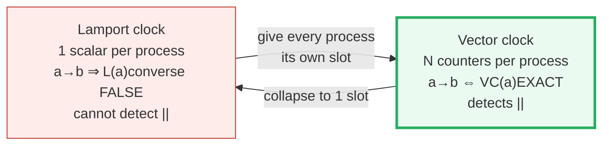
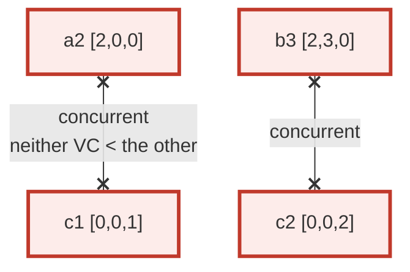
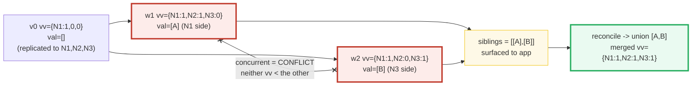
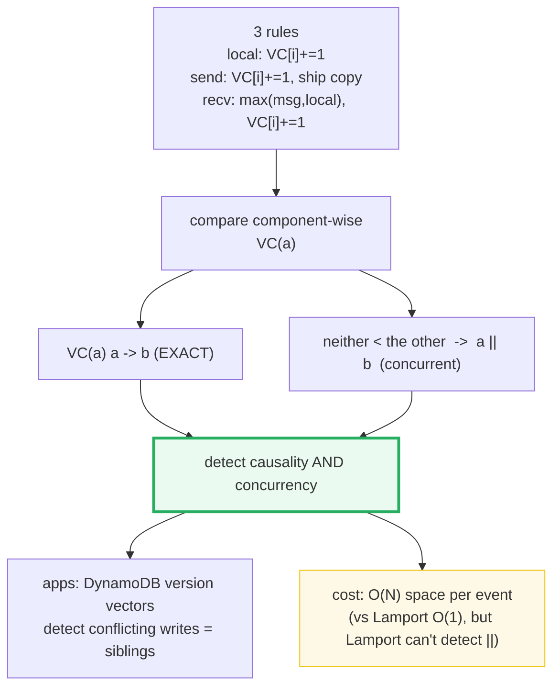

# Vector Clocks — A Visual, Worked-Example Guide

> **Companion code:** [`vector_clocks.py`](./vector_clocks.py). **Every number
> in this guide is printed by `python3 vector_clocks.py`** — change the code,
> re-run, re-paste. Nothing here is hand-computed.
>
> **Live animation:** [`vector_clocks.html`](./vector_clocks.html) — open in a
> browser. Click two events on the timelines to see their relationship (`a→b`,
> `b→a`, or `a || b` concurrent) with the component-by-component comparison.
>
> **Source material:** Lamport 1978 (time & clocks), Fidge 1988 & Mattern 1989
> (vector clocks), DeCandia et al. 2007 (Dynamo version vectors).

---

## 0. TL;DR — the shipping ledger

### Read this first — why a single counter is not enough

A **Lamport clock** is a single running counter per process. It tells you
"this was the k-th thing this process did". It orders events consistently with
causality — but it **throws away information**. If `L(a) < L(b)` you **cannot**
conclude `a` happened-before `b`: two events on different processes that never
communicated can still get ordered Lamport timestamps, and you cannot tell that
apart from real causality. Lamport guarantees only one direction:
`a → b  ⇒  L(a) < L(b)` — **not the converse**.

A **vector clock** fixes this. Each process keeps a small **ledger** with one
slot per process (N slots for N processes). Think of slot `i` as *"how many
events of process i have I heard about"*.



The three rules (applied in [§1](#1-the-three-rules--section-a-output)):

- **local event:** add a tally to MY OWN slot.
- **send:** add a tally to MY OWN slot, then **photocopy the whole ledger** and
  ship it with the message.
- **receive:** open the shipped ledger and take, slot by slot, the **larger**
  tally; then add one tally to MY OWN slot (this receive counts as my event).

Because every slot records causality from that process, two ledgers compare
**component by component** ([§2](#2-the-comparison-rule--section-b-output)):

```
VC(a) < VC(b)   <=>   (a[k] <= b[k] for ALL k)  AND  (a[k] < b[k] for SOME k)
                     -> a HAPPENED-BEFORE b   (a -> b)
neither a<b nor b<a   -> a and b are CONCURRENT (a || b)   <- the superpower
```

> **One-line definition:** A *vector clock* gives each process an N-length
> vector that characterizes **happens-before exactly**: `a → b ⇔ VC(a) < VC(b)`.
> This lets it **detect concurrency** — something Lamport's scalar clock cannot
> do — at the cost of O(N) space per event instead of O(1).

### Glossary (every term used below)

| Term | Plain meaning |
|---|---|
| **process** | one sequential participant. Here `P0, P1, P2` (N = 3) |
| **event** | something happening on one process (local / send / recv) |
| **vector clock (VC)** | an N-length array; slot `i` = count of `P_i` events "known" |
| **local rule** | on a local event, `VC[my_id] += 1` |
| **send rule** | on send, `VC[my_id] += 1`, then attach a COPY of `VC` |
| **receive rule** | on receive: `VC[k] = max(VC[k], msg[k])`, then `VC[my_id] += 1` |
| **happens-before (→)** | `a` causally affects `b`: program order, send→receive, or transitivity |
| **VC comparison (<)** | `VC(a) < VC(b)` iff `a[k] ≤ b[k] ∀k` and `a[k] < b[k]` for some `k` |
| **concurrent (‖)** | neither `a → b` nor `b → a`; detected by NOT `VC(a)<VC(b)` AND NOT `VC(b)<VC(a)` |
| **characterization** | the strong property `a → b ⇔ VC(a) < VC(b)` — VC represents happens-before EXACTLY |
| **version vector** | DynamoDB variant: increment on WRITE, merge (max) on read; detects conflicting writes |
| **Lamport clock** | a single scalar `L` per process; `a → b ⇒ L(a) < L(b)` but NOT the converse |

---

## 1. The three rules — Section A output

Three processes `P0, P1, P2`, each starting at `VC = [0, 0, 0]`. We trace 8
events and 2 messages, designed to contain **both a causal chain and concurrent
pairs** (so [§3](#3-concurrent-detection--section-c-output) has something to
detect).

> From `vector_clocks.py` **Section A** — the rules and the trace:
>
> ```
> local  : VC[my_id] += 1
> send   : VC[my_id] += 1 ; attach a COPY of the whole VC
> receive: VC[k] = max(VC[k], msg[k]) for all k ; then VC[my_id] += 1
> ```
>
> | step | event | proc | type | rule applied | vector clock |
> |---|---|---|---|---|---|
> | 1 | a1 | P0 | local | VC[my_id] += 1 | [1, 0, 0] |
> | 2 | a2 | P0 | send | VC[my_id] += 1 ; ship copy | [2, 0, 0] |
> | 3 | c1 | P2 | local | VC[my_id] += 1 | [0, 0, 1] |
> | 4 | b1 | P1 | recv | max(msg,local) ; VC[my_id] += 1 | [2, 1, 0] |
> | 5 | b2 | P1 | local | VC[my_id] += 1 | [2, 2, 0] |
> | 6 | b3 | P1 | send | VC[my_id] += 1 ; ship copy | [2, 3, 0] |
> | 7 | c2 | P2 | local | VC[my_id] += 1 | [0, 0, 2] |
> | 8 | c3 | P2 | recv | max(msg,local) ; VC[my_id] += 1 | [2, 3, 3] |
>
> **Messages shipped (the piggybacked vectors):**
> ```
> a2 (P0 -> P1): ships VC = [2, 0, 0]
> b3 (P1 -> P2): ships VC = [2, 3, 0]
> ```

```mermaid
graph LR
    A1["a1 P0<br/>[1,0,0]"] --> A2["a2 P0 send<br/>[2,0,0]"]
    A2 -->|msg [2,0,0]| B1["b1 P1 recv<br/>[2,1,0]"]
    B1 --> B2["b2 P1<br/>[2,2,0]"]
    B2 --> B3["b3 P1 send<br/>[2,3,0]"]
    B3 -->|msg [2,3,0]| C3["c3 P2 recv<br/>[2,3,3]"]
    C1["c1 P2<br/>[0,0,1]"] --> C2["c2 P2<br/>[0,0,2]"]
    C2 --> C3
    style A2 fill:#eaf2f8,stroke:#2980b9
    style B3 fill:#eaf2f8,stroke:#2980b9
    style C1 fill:#fef9e7,stroke:#f1c40f
    style C2 fill:#fef9e7,stroke:#f1c40f
```

> 🔗 **Key observations:** a send bumps the sender's own slot, and the receiver
> later takes the component-wise **max** with the shipped vector (see `b1`, `c3`).
> `b1 = max([0,0,0], [2,0,0])` then inc P1 = `[2,1,0]` — P1 now "knows" about
> both of P0's events. But `c1` and `c2` on P2 grew **without hearing** from
> P0/P1, so their slots 0,1 stay `0`. That missing knowledge is exactly what
> makes them **concurrent** (see [§3](#3-concurrent-detection--section-c-output)).

---

## 2. The comparison rule — Section B output

The comparison is **defined component by component** (it is NOT comparing the
vectors as numbers):

```
VC(a) < VC(b)   <=>   (a[k] <= b[k] for ALL k)  AND  (a[k] < b[k] for SOME k)
```

Read it as: *"b has heard about everything a heard about, and strictly more in
at least one slot"* → a is a causal **ancestor** of b (`a → b`).

> From `vector_clocks.py` **Section B** — three causal exemplars:
>
> ```
> Compare a1 = [1, 0, 0]  vs  a2 = [2, 0, 0]:     (same process, program order)
>    slot 0: 1<2 (strict) ; slot 1: 0=0 ; slot 2: 0=0
>    all<=? True ; some<? True  =>  VC(a1) < VC(a2)? True  ->  a1 -> a2
>
> Compare a2 = [2, 0, 0]  vs  b1 = [2, 1, 0]:     (send -> receive, cross process)
>    slot 0: 2=2 ; slot 1: 0<1 (strict) ; slot 2: 0=0
>    all<=? True ; some<? True  =>  VC(a2) < VC(b1)? True  ->  a2 -> b1
>
> Compare c1 = [0, 0, 1]  vs  c2 = [0, 0, 2]:     (same process, later)
>    slot 0: 0=0 ; slot 1: 0=0 ; slot 2: 1<2 (strict)
>    all<=? True ; some<? True  =>  VC(c1) < VC(c2)? True  ->  c1 -> c2
> ```
>
> ```
> [check] a1->a2, a2->b1, c1->c2 all classified CAUSAL by VC < : OK
> ```

> **The rule is strict:** a SINGLE slot with `a[k] > b[k]` sinks the whole
> comparison. That is why a process that "hasn't heard" of another can never be
> considered an ancestor of it — and that strictness is precisely what enables
> concurrency detection next.

---

## 3. Concurrent detection — Section C output

Two events are **concurrent** (`a ‖ b`) iff NEITHER `VC(a) < VC(b)` NOR
`VC(b) < VC(a)`. This is the thing Lamport clocks **cannot** do: tell causal
order apart from coincidental order. Vector clocks can, because each slot
encodes what the process has heard about.

> From `vector_clocks.py` **Section C** — three concurrent pairs:
>
> ```
> a2 = [2, 0, 0]   vs   c1 = [0, 0, 1]
>    VC(a2) < VC(c1)? False
>    VC(c1) < VC(a2)? False
>    slot 0: a2[0]=2 > c1[0]=0 -> blocks a2->c1
>    slot 2: c1[2]=1 > a2[2]=0 -> blocks c1->a2
>    => a2 || c1 (concurrent)? True
>
> b3 = [2, 3, 0]   vs   c2 = [0, 0, 2]
>    slot 0: b3[0]=2 > c2[0]=0 -> blocks b3->c2
>    slot 2: c2[2]=2 > b3[2]=0 -> blocks c2->b3
>    => b3 || c2 (concurrent)? True
>
> a2 = [2, 0, 0]   vs   c2 = [0, 0, 2]
>    => a2 || c2 (concurrent)? True
> ```
>
> ```
> [check] a2||c1, b3||c2, a2||c2 all classified CONCURRENT: OK
> ```



> **Physical meaning:** `a2` happened on P0, `c1` on P2, with **no message**
> between them. Neither process knows the other's event occurred. They are truly
> independent → concurrent. 🔗 [§4](#4-version-vectors-dynamodb--section-d-output)
> shows DynamoDB turns this into a **conflict** that must be surfaced.

---

## 4. Version vectors (DynamoDB) — Section D output

A **version vector** is the data-store variant of a vector clock. Differences:

- increment OWN node's counter **only on a WRITE** (not on every event);
- on a read/replication, **merge** by element-wise max (NO increment);
- the vector is attached to each stored **object version**.

Two versions of the same key are **siblings** (a conflict) iff their version
vectors are **concurrent**. Dynamo/Riak surface siblings to the app instead of
silently dropping one (DeCandia et al. 2007, Dynamo SOSP).

> From `vector_clocks.py` **Section D** — key `'cart'`, 3 replicas `N1,N2,N3`,
> partition isolates `N3`:
>
> ```
> t0  v0 : val = '[]'   vv = {N1:1, N2:0, N3:0}    # N1 writes, replicates to all
> t1  PARTITION. N1 updates -> w1 : val = '[A]'   vv = {N1:1, N2:1, N3:0}
>      N1 replicates w1 to N2 (reachable). N3 still holds v0.
> t2  N3 updates from stale v0 -> w2 : val = '[B]'   vv = {N1:1, N2:0, N3:1}
>      N3 cannot replicate w2 out (partitioned).
> t3  HEAL. N2 holds w1, N3 holds w2. Compare:
>      w1.vv = {N1:1, N2:1, N3:0}   (val [A])
>      w2.vv = {N1:1, N2:0, N3:1}   (val [B])
>      w1 < w2 ? False
>      w2 < w1 ? False
>      => concurrent (conflict)? True
>      siblings(cart) = ['[A]', '[B]']   # surfaced to the app, nothing dropped
>      merged vv = {N1:1, N2:1, N3:1}    # after reconciliation
> ```
>
> ```
> [check] w1||w2 concurrent -> surfaced as siblings; merge = {N1:1, N2:1, N3:1}: OK
> ```



> 🔗 Contrast with **last-write-wins** (LWW): LWW would silently keep whichever
> value has the newer wall-clock timestamp and **drop the other** — and clock
> skew can pick the *wrong* one. Version vectors never drop; they **surface**.
> See [NETWORK_PARTITIONS.md §4](./NETWORK_PARTITIONS.md) for the LWW vs vector
> vs CRDT comparison.

---

## 5. Lamport vs vector clocks — Section E output

Both assign timestamps to events, but they buy different things.

> From `vector_clocks.py` **Section E** — the concrete failure mode of Lamport,
> on the SAME scenario:
>
> ```
> a2 on P0 and c1 on P2 are CONCURRENT (Section C proved it). But:
>    L(a2) = 2   L(c1) = 1
>    VC(a2) = [2, 0, 0]   VC(c1) = [0, 0, 1]
>
> A naive reader sees L(c1)=1 < L(a2)=2 and wrongly infers c1 -> a2.
> Lamport only guarantees a->b => L(a)<L(b); the CONVERSE is FALSE, so you
> CANNOT classify a pair from Lamport timestamps alone.
> Vector clocks give the exact characterization a->b <=> VC(a)<VC(b), so
> the same pair is correctly shown as c1 || a2.
> ```
>
> | property | Lamport clock | Vector clock |
> |---|---|---|
> | state per process | 1 scalar (O(1)) | 3 counters (O(N)) |
> | message overhead | 1 integer | 3 integers |
> | `a → b ⇒ ts(a) < ts(b)` ? | yes | yes |
> | `ts(a) < ts(b) ⇒ a → b` ? | **NO** (converse false) | **YES** (exact) |
> | detects concurrency (`a ‖ b`) ? | **NO** | **YES** |
> | needs to know N (group size) ? | no | yes |
> | scales to huge N ? | trivially | cost grows with N |
> | typical use | event ordering, txn IDs | causality, conflict detection |
>
> ```
> [check] Lamport L(c1)<L(a2) mis-orders concurrent pair; vector fixes it: OK
> ```

> **Rule of thumb:** if you only need a **total order** consistent with
> causality, Lamport is cheap and enough. If you need to **detect** that two
> events are independent (conflict detection, causal consistency, debugging),
> you need a vector clock — or its sparse cousins: dotted version vectors,
> hybrid logical clocks (HLCs).

---

## 6. GOLD CHECK — VC classification matches happens-before, ALL pairs

The strongest statement about vector clocks is the **characterization theorem**:
`a → b ⇔ VC(a) < VC(b)` for *every* pair. The gold check verifies this against
the independently-built happens-before graph (program order + send→receive +
transitive closure), over **all 56 ordered pairs** of the 8 events.

> From `vector_clocks.py` **GOLD CHECK**:
>
> ```
> Events: 8 -> 56 ordered pairs checked.
>   causal pairs (a->b) classified correctly: 18
>   concurrent/incomparable classified correctly: 38
>   mismatches: 0
> ```
>
> **Spot check (named pairs):**
>
> | pair | graph (a→b)? | VC(a)<VC(b)? | match |
> |---|---|---|---|
> | a1 → a2 | True | True | ✓ |
> | a2 → b1 | True | True | ✓ |
> | b3 → c3 | True | True | ✓ |
> | c1 → c3 | True | True | ✓ |
> | a2 → c1 | False | False | ✓ (concurrent) |
> | b3 → c2 | False | False | ✓ (concurrent) |
>
> ```
> => [check] GOLD: all 56 pairs match happens-before: OK
> ```

Vector clocks represent happens-before **exactly**: every causal link AND every
concurrent pair is classified correctly. That is the property Lamport clocks
lack. The [`vector_clocks.html`](./vector_clocks.html) recomputes the VC rules,
the comparison, and the concurrency test **live in JS** on the same deterministic
inputs, and shows a gold `check: OK` badge when every pair matches.

---

## 7. Pitfalls & debugging checklist

| # | Mistake | Symptom | Fix |
|---|---|---|---|
| 1 | **Treating VC as a number** (lexicographic compare) | wrong causal order, missed concurrency | Compare **component by component**: all `≤` and some `<` — never lexicographic |
| 2 | **Forgetting to increment own slot on receive** | receiver's clock too small; loses the receive as an event | Receive = `max(msg, local)` THEN `VC[my_id] += 1` |
| 3 | **Incrementing on read in a version vector** | spurious conflicts / wrong siblings | Version vectors increment only on WRITE; reads merge (max), no increment |
| 4 | **Inferring causality from Lamport timestamps** | `L(a)<L(b)` read as `a→b` → false causal order | Lamport gives `a→b ⇒ L(a)<L(b)` only; use a vector clock for the converse |
| 5 | **Assuming clocks need clock sync (NTP)** | over-engineering, false confidence in wall time | Vector clocks are logical — they need NO synchronized physical clocks |
| 6 | **Using the full N-vector when N is huge** | O(N) per message blows up | Use sparse / dotted version vectors, or HLC (Hybrid Logical Clock) |
| 7 | **Auto-resolving concurrent versions silently** | data loss (one sibling clobbers the other) | Surface siblings (Dynamo/Riak); let the app reconcile, like LWW-on-skew danger |
| 8 | **Not piggybacking the FULL vector on send** | receiver can't reconstruct causality | Send always ships a COPY of the whole vector, not just the sender's slot |

---

## 8. Cheat sheet



- **Local rule:** `VC[my_id] += 1`.
- **Send rule:** `VC[my_id] += 1`, then piggyback a COPY of the whole VC.
- **Receive rule:** `VC[k] = max(VC[k], msg[k])` for all k, THEN `VC[my_id] += 1`.
- **Comparison:** `VC(a) < VC(b)` iff `a[k] ≤ b[k] ∀k` and `a[k] < b[k]` for some k.
- **Characterization:** `a → b ⇔ VC(a) < VC(b)` — exact, both directions. **The whole point.**
- **Concurrency:** `a ‖ b` iff neither `VC(a) < VC(b)` nor `VC(b) < VC(a)`.
- **Version vectors (Dynamo):** increment on write, merge (max) on read; concurrent versions = **siblings** surfaced to the app.
- **Lamport vs vector:** Lamport is `O(1)` but only one-way (`a→b ⇒ L(a)<L(b)`); vector is `O(N)` but exact (detects `‖`).
- **No clock sync needed:** vector clocks are *logical* clocks — no NTP, no physical time.
- **Gold check:** all 56 pairs of the 8-event scenario match the happens-before graph (18 causal + 38 concurrent, 0 mismatches).

---

## Sources

- **Happens-before & Lamport clocks** — Lamport. *Time, Clocks, and the Ordering
  of Events in a Distributed System.* CACM, 1978.
  - Verified claim: the scalar clock `L` satisfies `a → b ⇒ L(a) < L(b)`, and
    this implication is **not** reversible (Section E) — the motivation for
    vector clocks.
- **Vector clocks** — Fidge. *Timestamps in Message-Passing Systems.* 1988;
  Mattern. *Virtual Time and Global States of Distributed Systems.* 1989.
  (Independent, simultaneous discovery.)
  - Verified claims: local/send/receive rules; the characterization
    `a → b ⇔ VC(a) < VC(b)`; concurrency detection via incomparable vectors
    (Sections A, B, C, and the gold check).
- **Dynamo (version vectors)** — DeCandia et al. *Dynamo: Amazon's Highly
  Available Key-value Store.* SOSP 2007.
  - Verified claims: object versioning with version vectors; concurrent versions
  surfaced as siblings for application reconciliation (Section D).
- **Books** — Kleppmann, *Designing Data-Intensive Applications* (Ch. 9,
  "Consistency and Consensus", the causality / vector-clock section);
  Tanenbaum & Van Steen, *Distributed Systems* (Ch. 6, Synchronization).
- **Related** — 🔗 [NETWORK_PARTITIONS.md](./NETWORK_PARTITIONS.md) (vector
  clocks vs LWW vs CRDT for conflict resolution); 🔗 [CLOCK_SYNC_NTP.md]
  (physical vs logical clocks).
