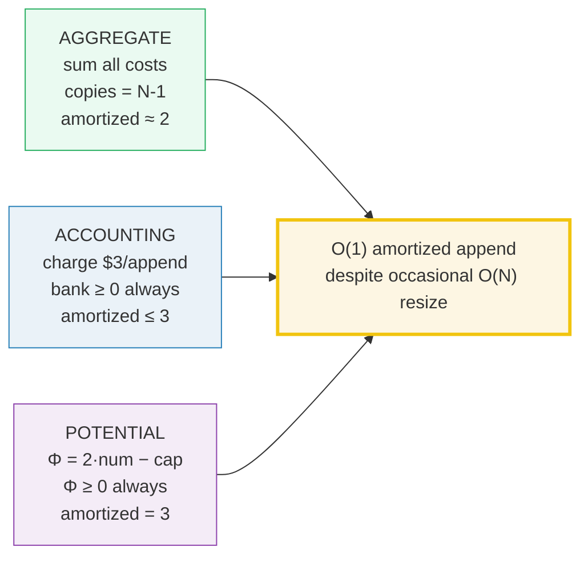
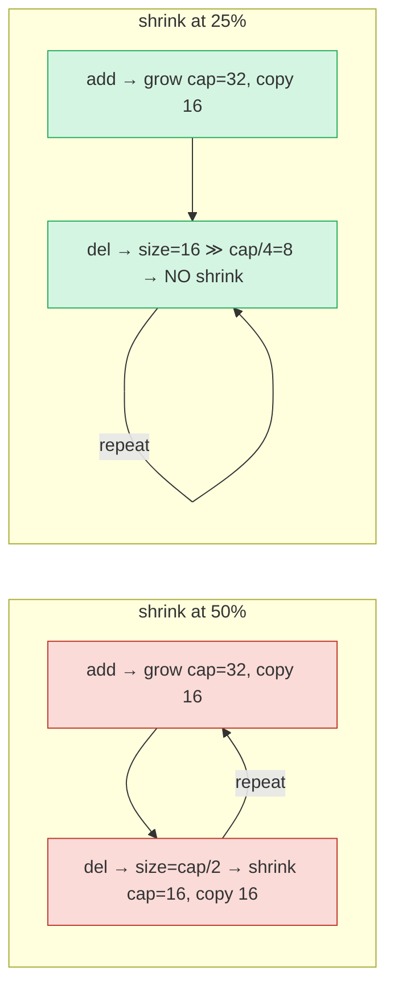

# Amortized Analysis of Dynamic Array Resizing — A Visual, Worked-Example Guide

> **Companion code:** [`amortized_resize.py`](./amortized_resize.py). **Every
> number in this guide is printed by `python3 amortized_resize.py`** — change
> the code, re-run, re-paste. Nothing here is hand-computed.
>
> **Live animation:** [`amortized_resize.html`](./amortized_resize.html) —
> open in a browser. Four panels step through doubling, the growth-factor dial,
> the accounting/potential proofs, and the shrink-threshold thrash, all
> gold-checked against the `.py`.
>
> **Source material:** CLRS ch.17 *Amortized Analysis* (§17.1 aggregate,
> §17.2 accounting, §17.3 potential, §17.4 dynamic tables); Sedgewick & Wayne
> §1.1 (resizing array). Also 🔗 [`BIG_O_COMPARISON.md`](./BIG_O_COMPARISON.md)
> for Big-O foundations and [`ARRAY_VS_LINKEDLIST.md`](./ARRAY_VS_LINKEDLIST.md)
> for the array-vs-list trade-off.

---

## 0. TL;DR — one expensive day, many cheap days, flat average

A dynamic array **doubles** its capacity whenever it fills up. A single resize
is **O(N)** (copy every element), but resizes are **exponentially rare** — so
the **average cost per append is O(1)**. "Amortized" = "averaged over a
sequence," not worst-case. Three independent proofs land on the same bound:

| Growth factor | Amortized ops/append | Max wasted space | Used by |
|---|---|---|---|
| **2.0×** (doubling) | **2** | 50% | Python `list`, many allocators |
| **1.5×** | 3 | 33% | Java `ArrayList`, C++ `std::vector` (some) |
| **1.25×** | 5 | 20% | space-conscious variants |

> **The one-line proof:** with factor *g*, resize copy costs form a geometric
> series `1 + g + g² + …` that sums to `≈ N/(g−1)`. A convergent series means
> total copy work is **O(N)**, i.e. **O(1) per append** — for *any* constant
> `g > 1`.

### Glossary

| Term | Plain meaning |
|---|---|
| **capacity** | how many slots are *allocated* right now |
| **size / num** | how many elements are *actually stored* |
| **full** | `size == capacity` — the trigger to grow |
| **resize** | allocate a new array of different capacity, copy elements over |
| **grow / shrink** | multiply capacity by *g* when full / halve it when too empty |
| **amortized cost** | total cost of a sequence ÷ number of ops. *Not* worst-case |
| **aggregate method** | sum all actual costs over N ops, divide by N (§17.1) |
| **accounting method** | pre-pay each op a flat fee into a "bank" that never goes negative (§17.2) |
| **potential method** | define Φ ≥ 0; amortized = actual + ΔΦ, which stays bounded (§17.3) |
| **thrashing** | add/remove at the resize boundary → every op resizes → O(N²); cured by hysteresis |

---

## A. The doubling strategy (aggregate method)

Start `capacity = 1`. Before each append, if the array is **full** (`size == cap`),
**double** the capacity and copy every element over; then write the new element.
The **aggregate method** simply adds up every cost and divides.

> From `amortized_resize.py` Section A:

| append# | size | capacity | resize? | copies | write | step cost |
|---------|------|----------|---------|--------|-------|-----------|
| 1       | 1    | 1        | no      | 0      | 1     | 1         |
| 2       | 2    | 2        | YES x2  | 1      | 1     | **2**     |
| 3       | 3    | 4        | YES x2  | 2      | 1     | **3**     |
| 4       | 4    | 4        | no      | 0      | 1     | 1         |
| 5       | 5    | 8        | YES x2  | 4      | 1     | **5**     |
| 6       | 6    | 8        | no      | 0      | 1     | 1         |
| 7       | 7    | 8        | no      | 0      | 1     | 1         |
| 8       | 8    | 8        | no      | 0      | 1     | 1         |
| 9       | 9    | 16       | YES x2  | 8      | 1     | **9**     |
| 10–16   | 10–16| 16       | no      | 0      | 1     | 1         |

```mermaid
gantt
    title Capacity staircase: 1 → 2 → 4 → 8 → 16 (resizes at append 2,3,5,9)
    dateFormat X
    axisFormat %s
    section capacity
    cap=1   :done, a1, 0, 1
    cap=2   :done, a2, 1, 2
    cap=4   :done, a3, 2, 4
    cap=8   :done, a4, after a3, 4
    cap=16  :done, a5, after a4, 5
```

- Capacity over time: `1, 2, 4, 4, 8, 8, 8, 8, 16, 16×8`.
- Resizes fire at append# **2, 3, 5, 9** → copy costs **1, 2, 4, 8**.

> From `amortized_resize.py` Section A:

> **Total copies = 1 + 2 + 4 + 8 = 15**  = `N − 1` (exact, because `N = 16` is a power of 2).
> **Total writes = 16.**  **Total ops = 15 + 16 = 31 = 2N − 1.**
> **Amortized = 31 / 16 = 1.9375 → 2.**  `[check] copies == N-1? OK ; total ops == 2N-1? OK`

The worst *single* step costs **8** (the append#9 copy of the full 8-slot
array). But only **4 of 16** steps resize, and resizes get **2× rarer** as the
array grows. Spread the rare pain over all 16 appends and the average is ~2 — a
constant, independent of N. **That is amortized O(1).** 🔗 See it animate in
[`amortized_resize.html`](./amortized_resize.html) panel ①.

---

## B. The accounting method (charge $3, watch the bank)

Charge a flat **$3** for *every* append: **$1** pays the immediate write,
**$2** is **banked** as credit to fund a future resize copy. Actual cost of an
append = `(copies if resize) + 1`. The proof: the **bank balance never goes
negative**.

> From `amortized_resize.py` Section B:

| append# | actual cost | charge | Δ bank | bank balance | note |
|---------|-------------|--------|--------|--------------|------|
| 1       | 1           | 3      | +2     | 2            | cheap: bank += $2 |
| 2       | 2           | 3      | +1     | 3            | RESIZE paid from credit |
| 3       | 3           | 3      | +0     | 3            | RESIZE paid from credit |
| 4       | 1           | 3      | +2     | 5            | cheap: bank += $2 |
| 5       | 5           | 3      | −2     | 3            | RESIZE paid from credit |
| 6       | 1           | 3      | +2     | 5            | cheap: bank += $2 |
| 7       | 1           | 3      | +2     | 7            | cheap: bank += $2 |
| 8       | 1           | 3      | +2     | 9            | cheap: bank += $2 |
| 9       | 9           | 3      | −6     | 3            | RESIZE paid from credit |
| 10–16   | 1           | 3      | +2     | 5…17         | cheap: bank += $2 |

> **Bank balance is ALWAYS ≥ 0 (minimum observed = $2).** `[check] min bank balance ($2) >= 0? OK`
> ⇒ the $3 charge fully funds every resize ⇒ **amortized cost ≤ 3 ⇒ O(1).**

**Why $3 is exactly enough:** right before a resize that copies *m* elements,
the *m/2* most-recently inserted elements each still hold their $2 of banked
credit = **$m** total — precisely the *m* copies owed. The older *m/2* elements'
credit already paid the *previous* resize, so the bank never runs dry. (The
leftover slack is why the minimum balance is $2, not $0.)

---

## C. The potential method (Φ = 2·num − capacity, amortized = 3)

Define the potential of a table state **Φ(D) = 2·num − capacity**, with
**Φ(empty) = 0**. The amortized cost of append *i* is then
**`â_i = actual_i + Φ_i − Φ_{i−1}`**. The proof has two parts: (1) **Φ ≥ 0**
always (so the bound is valid), and (2) **â_i ≤ 3** for every step.

> From `amortized_resize.py` Section C:

| append# | num | cap | Φ_prev | actual | Φ_curr | ΔΦ | â = actual+ΔΦ |
|---------|-----|-----|--------|--------|--------|----|---------------|
| 1       | 1   | 1   | 0      | 1      | 1      | +1 | **2**         |
| 2       | 2   | 2   | 1      | 2      | 2      | +1 | **3**         |
| 3       | 3   | 4   | 2      | 3      | 2      | +0 | **3**         |
| 4       | 4   | 4   | 2      | 1      | 4      | +2 | **3**         |
| 5       | 5   | 8   | 4      | 5      | 2      | −2 | **3**         |
| 6       | 6   | 8   | 2      | 1      | 4      | +2 | **3**         |
| 7       | 7   | 8   | 4      | 1      | 6      | +2 | **3**         |
| 8       | 8   | 8   | 6      | 1      | 8      | +2 | **3**         |
| 9       | 9   | 16  | 8      | 9      | 2      | −6 | **3**         |
| 10–16   | 10–16| 16  | 2…14   | 1      | 4…16   | +2 | **3**         |

> **Φ is ALWAYS ≥ 0 (minimum = 0, at the empty table). Every â_i ≤ 3.**
> `[check] Φ ≥ 0 (min 0)? OK ; â_i ≤ 3 (max 3)? OK`

The mechanism is beautiful — **two cases, both collapse to 3**:

- **Cheap step** (no resize): `actual = 1`, `ΔΦ = +2`  → `â = 3`.
- **Resize step** (copy *k*): `actual = k+1`, `ΔΦ = 2−k` → `â = 3`.
- (The very first append has `â = 2` because Φ(empty) = 0 rather than −1.)

A resize **spikes** the actual cost, but ΔΦ is large and **negative**, cancelling
the spike exactly. The potential "stored up" on cheap steps pays the bill on
resize steps:

> `Σ actual = Σ â − (Φ_N − Φ_0) ≤ 3N − Φ_N + Φ_0 ≤ 3N` ⇒ **O(1) amortized.**

🔗 Compare the two proofs side by side in [`amortized_resize.html`](./amortized_resize.html) panel ③.

---

## D. Growth factor — 2× vs 1.5× vs 1.25× (all still O(1))

Theory: copy work is a geometric series summing to `≈ N/(g−1)`, so amortized
ops/append = `1 + 1/(g−1) = g/(g−1)`. Just after a resize the array is `~1/g`
full, then grows to full, so fill ratio ranges `[1/g, 1.0]` and max wasted
space = `1 − 1/g`.

> From `amortized_resize.py` Section D (N = 1024 appends):

| factor g | resizes | total copies | total ops | amortized (sim) | amortized g/(g−1) | max waste | fill range |
|----------|---------|--------------|-----------|-----------------|-------------------|-----------|------------|
| 2.0      | 10      | 1023         | 2047      | 1.999           | 2.000             | 50.0%     | 0.500–1.000 |
| 1.5      | 16      | 2120         | 3144      | 3.070           | 3.000             | 33.3%     | 0.667–1.000 |
| 1.25     | 27      | 4402         | 5426      | 5.299           | 5.000             | 20.0%     | 0.800–1.000 |

`[check] simulated amortized within 0.5 of g/(g−1) for all factors? OK`

Read the table three ways:

- **Bigger g → fewer resizes, but more waste.** g=2.0 wastes up to 50% (half
  the array can sit empty); g=1.5 wastes 33%; g=1.25 only 20%.
- **Smaller g → higher amortized *constant*, but still a *constant*.** It is
  `g/(g−1)`, so **O(1) for any g > 1**.
- **Engineering sweet spot ≈ 1.5×–2×.** g=2.0 gives the lowest amortized
  constant and tidy low-bit pointer arithmetic; g=1.5 wastes less memory.
  Java `ArrayList`, C++ `std::vector`, and Python `list` all live here.

🔗 Slide the factor live in [`amortized_resize.html`](./amortized_resize.html) panel ②.

---

## E. Shrink threshold — halving at 25% cures the 50% thrash

Build the array to `size=16, cap=16`, then hammer it with **8 (add, del) pairs**
right at the full boundary — the worst case for thrashing.

> From `amortized_resize.py` Section E:

| shrink at | build copies | build resizes | alternating copies | alt resizes | total copies | total ops | verdict |
|-----------|--------------|---------------|--------------------|-------------|--------------|-----------|---------|
| 50% (cap/2) | 15         | 4             | **256**            | 16          | 271          | 303       | THRASH: O(N)/op |
| 25% (cap/4) | 15         | 4             | **16**             | 1           | 31           | 63        | SAFE: O(1)/op |

`[check] 50%: 256 alt copies + 8 shrinks (thrash)? OK`
`[check] 25%: 16 alt copies + 0 shrinks (safe)? OK`

**What happens at 50%:** `add` grows to `cap=32` (copy 16), then `del` brings
`size` back to `cap/2` so it **shrinks** to `cap=16` (copy 16). Every
(add, del) pair costs **32 copies**; 8 pairs = **256 copies**. Each op is O(N)
here, so N such ops cost **O(N²)**. This is **thrashing**.

**What happens at 25%:** the one `add` grows to `cap=32` (copy 16), but now
`cap/4 = 8`, and `del` only drops `size` to 16 — **way above 8**, so no shrink.
After that single grow, add/del oscillates between size 16 and 17 at `cap=32`
with **zero further resizes**. The 25% rule leaves a **hysteresis gap**
(25%…100%): a single add or del cannot cross *both* thresholds, so the table
never ping-pongs. CLRS §17.4 proves add+del are then **both O(1) amortized**.

🔗 Toggle the threshold in [`amortized_resize.html`](./amortized_resize.html) panel ④.

---

## F. Gold check — the values the HTML recomputes

The companion `.html` re-runs the *identical* `simulate_appends` / `simulate_dyn`
formulas in JavaScript and asserts them against these pinned values:

> From `amortized_resize.py` GOLD VALUES (N = 16, growth = 2.0):

| quantity | value |
|---|---|
| capacity trace | `[1, 2, 4, 4, 8, 8, 8, 8, 16, 16, 16, 16, 16, 16, 16, 16]` |
| copy cost trace | `[0, 1, 2, 0, 4, 0, 0, 0, 8, 0, 0, 0, 0, 0, 0, 0]` |
| resize steps | append# `[2, 3, 5, 9]` |
| **total copies** | **15** (= N−1) |
| total writes | 16 |
| **total ops** | **31** (= 2N−1) |
| amortized / append | 1.9375 (→ 2) |

`[check] GOLD reproduces from simulate_appends(16, 2.0)? OK`

The gold badge `check: OK` at the bottom of
[`amortized_resize.html`](./amortized_resize.html) confirms the in-browser
recompute matches `amortized_resize.py` exactly (`copies = 15`, `ops = 31`,
capacity trace identical).

---

## G. The bigger picture

- **Amortized ≠ worst-case.** A single `append` *can* be O(N). If you need a
  hard real-time guarantee (every op under a deadline), amortized bounds are
  not enough — you'd want a **predictable** structure. For almost everything
  else, the average is what matters, and it is O(1).
- **The geometric series is the whole story.** Any policy where the expensive
  event gets *exponentially rarer* (doubling, hash-table rehashing,
  union-by-rank in disjoint sets, splay trees) yields an O(1) or O(log N)
  amortized bound by the same argument. 🔗 [`BIG_O_COMPARISON.md`](./BIG_O_COMPARISON.md).
- **Hysteresis is a general engineering principle.** Separate the "grow" and
  "shrink" thresholds (here 100% vs 25%) so noise around a boundary cannot
  trigger a feedback loop. The same idea stabilizes thermostats, TCP windows,
  and garbage collectors.

> **Files in this bundle** (all derive from one ground-truth `.py`):
> [`amortized_resize.py`](./amortized_resize.py) ·
> [`amortized_resize_output.txt`](./amortized_resize_output.txt) ·
> [`amortized_resize.html`](./amortized_resize.html) · this guide.
