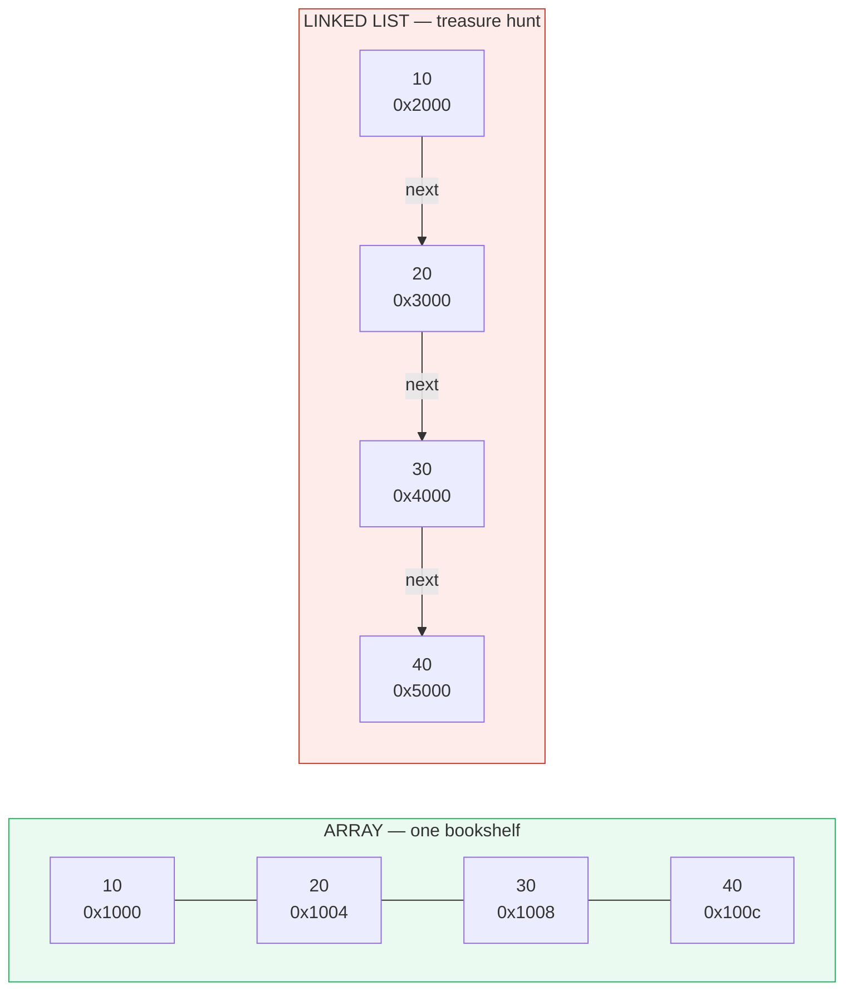
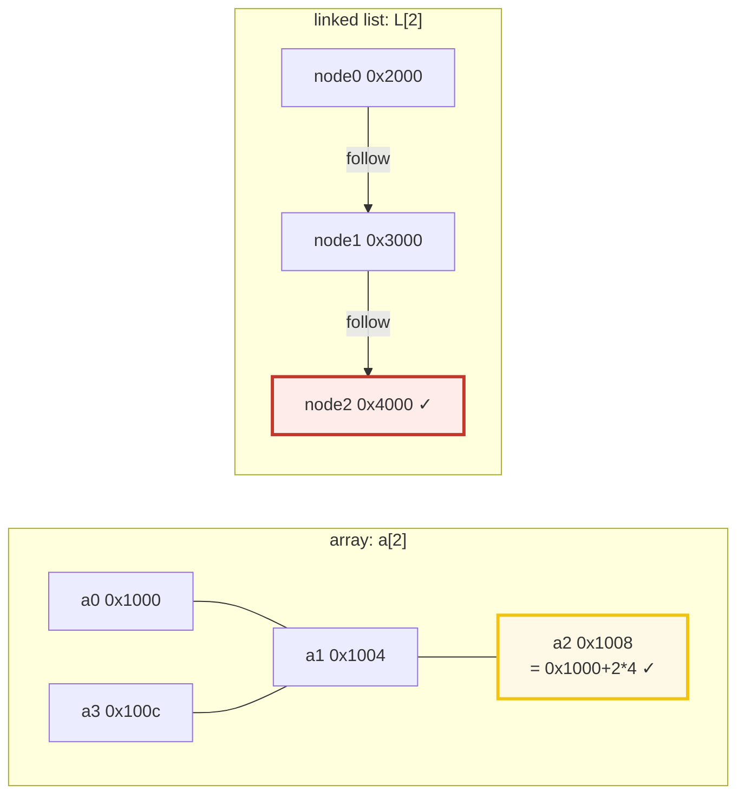
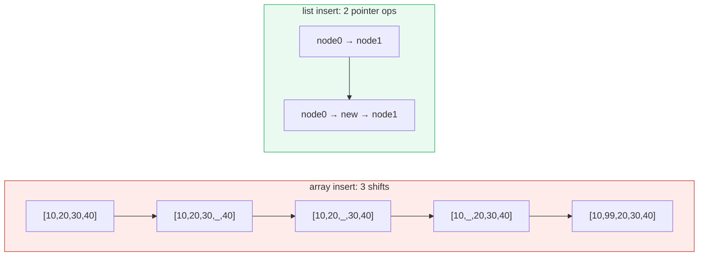
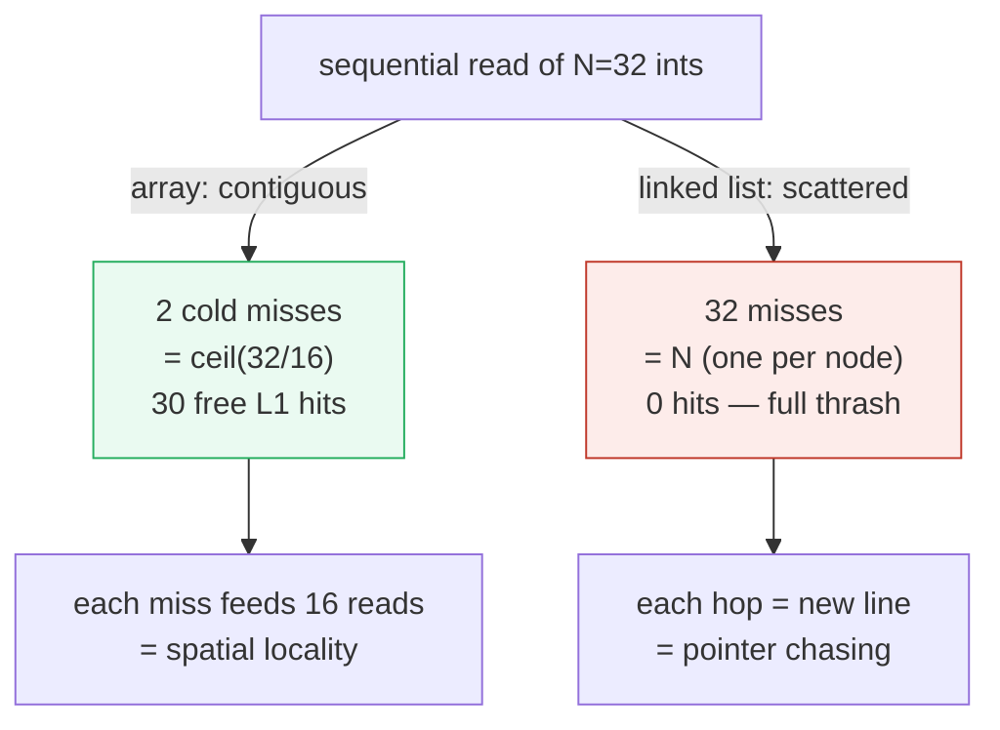

# Array vs Linked List — A Visual, Cache-Aware, Worked-Example Guide

> **Companion code:** [`array_vs_linkedlist.py`](./array_vs_linkedlist.py). **Every
> number in this guide is printed by `python3 array_vs_linkedlist.py`** — nothing
> is hand-computed.
>
> **Live animation:** [`array_vs_linkedlist.html`](./array_vs_linkedlist.html) —
> open in a browser. It recomputes the cache miss counts in JS from the
> *identical* formula and gold-checks against the `.py`.

---

## 0. TL;DR — the bookshelf vs the treasure hunt

> **The analogy (read this first):** An **array** is one long **bookshelf**:
> every book sits right next to the last, so you can jump straight to slot `i`.
> But inserting a book in the middle means sliding every later book one slot over.
> A **linked list** is a **treasure hunt**: each clue tells you where the next
> clue is, but the clues are hidden all over town. Finding clue `#i` means
> following the chain from `#0`. But inserting a new clue only rewrites two
> pointers — nothing else moves.

Big-O tells you the linked-list insert is **O(1)** and the array insert is
**O(N)**, so you might think the list wins for insert-heavy code. It usually
does **not**, because the CPU fetches memory a whole **cache line** (64 bytes =
16 ints) at a time. The bookshelf drags 16 books into the fast L1 cache on a
single grab (spatial locality); the treasure hunt pays a fresh ~100-cycle RAM
round-trip on **every** clue (pointer chasing). **The cache is the constant
that Big-O hides, and it dominates in practice.**



> One plain sentence each: **Array** = compute the address, touch one cell,
> O(1). **Linked list** = chase `i` pointers from the head, O(N), and every hop
> is a cache miss.

---

### Glossary (plain English — refer back any time)

| Term | Plain meaning |
|---|---|
| **element / item** | One value stored in the structure (here: a 4-byte C `int`). |
| **index `i`** | The position of an element, counting from 0. |
| **address** | Where a byte lives in (fake) memory; printed as `0x...`. |
| **contiguous** | Addresses back-to-back with no gaps. The array's defining property. |
| **node** | A linked-list cell: `[ value │ next-pointer ]`. |
| **next-pointer** | The address of the NEXT node (`0`/null for the tail). |
| **head / tail** | First / last node (tail's `next == null`). |
| **cache line** | The unit the CPU fetches from RAM. **64 bytes = 16 ints** here. |
| **cache hit / miss** | A fetch that finds / does NOT find the data already in L1. |
| **spatial locality** | Touching address `x` means you'll soon touch `x+4, x+8, ...`. Arrays have it; lists don't. |
| **pointer chasing** | Following `next` pointers to addresses you can't predict — the cache killer. |

---

## 1. The two structures, in memory (CLRS 10.1 & 10.2)

Both store the same four ints `[10, 20, 30, 40]`. The difference is entirely in
**where the bytes sit**. We model a C `int` as 4 bytes and a 64-bit pointer as
8 bytes (so a node = value 4B + next 8B, padded to **16B** for alignment).

> From `array_vs_linkedlist.py` **Section A**:
>
> ```
> ARRAY  — one contiguous block. address of cell i = base + i*INT_SIZE:
>   base = 0x1000
>   a[0] =  10  @ 0x1000   (next cell +4B = 0x1004)
>   a[1] =  20  @ 0x1004   (next cell +4B = 0x1008)
>   a[2] =  30  @ 0x1008   (next cell +4B = 0x100c)
>   a[3] =  40  @ 0x100c   (next cell +4B = 0x1010)
>   whole array spans 16 contiguous bytes [0x1000 .. 0x100f]. Zero gaps. Zero pointers.
>
> LINKED LIST — four NODES scattered across memory, glued by pointers:
>   node 0: value  10 @ 0x2000  |  next @ 0x2004 -> 0x3000
>   node 1: value  20 @ 0x3000  |  next @ 0x3004 -> 0x4000
>   node 2: value  30 @ 0x4000  |  next @ 0x4004 -> 0x5000
>   node 3: value  40 @ 0x5000  |  next @ 0x5004 -> NULL
>   head @ 0x2000  (points at node 0). Nodes are 0x3000-0x2000 = 4096B apart — NOT contiguous.
> ```

The key contrast is the **stride**:

| | Array cells | Linked-list node addrs |
|---|---|---|
| addresses | `0x1000 0x1004 0x1008 0x100c` | `0x2000 0x3000 0x4000 0x5000` |
| stride | **+4B** (touching) | **+4096B** (far apart) |
| pointers stored | **0** | **1 per node** (overhead = `PTR_SIZE × N`) |

The array's contiguity is the seed of every advantage that follows — access,
binary search, prefetching, and cache behavior all flow from "the bytes are in a
row."

---

## 2. Access: array O(1) vs linked list O(N)

Fetch the element at **index `i = 2`** (value 30) from each structure.

> From `array_vs_linkedlist.py` **Section B**:
>
> ```
> ARRAY  — compute the address arithmetically, touch ONE cell:
>   addr = base + i*INT_SIZE = 0x1000 + 2*4 = 0x1008
>   pointer follows: 0     arithmetic ops: 1 add + 1 mul
>   memory accesses: 1     => O(1)
>
> LINKED LIST — cannot compute a node address; CHASE pointers from head:
>   start at head @ 0x2000 (node 0)
>   follow next @ 0x2004 -> node 1 @ 0x3000   (pointer follow #1)
>   follow next @ 0x3004 -> node 2 @ 0x4000   (pointer follow #2)
>   pointer follows: 2   memory accesses: 3 (each follow reads a next pointer; +1 to read the value)
>   => O(N). To reach index i you ALWAYS do i pointer follows.
> ```

The array computes the address with one multiply-add (`base + i*4`) — it never
looks at neighbors. The linked list **cannot** compute a node address: each
node's location is recorded only inside the previous node, so you must walk the
chain. To reach index `i` you always pay `i` pointer follows.



> From `array_vs_linkedlist.py` **Section B** (access cost):
>
> | structure | cost | why |
> |---|---|---|
> | array | **O(1)** | address is computed: `base + i*size` |
> | linked list | **O(N)** worst | must chase `i` next-pointers from head |
>
> `[check] array fetches index 2 in 1 access; list needs 2 follows = 2 fetches: OK`

> 🔗 **Why binary search needs an array:** binary search jumps to the *middle*
> element, i.e. `a[N/2]`. That is a random access — O(1) on an array, O(N) on a
> list. So "binary search a sorted linked list" is O(N log N), *worse* than a
> plain linear scan. Random access is the precondition for divide-and-conquer.

---

## 3. Insert & delete: array shift O(N) vs linked list pointer swap O(1)

Insert a new value **99** at **index 1** of a 4-element structure.

> From `array_vs_linkedlist.py` **Section C**:
>
> ```
> ARRAY — make room by shifting every cell from idx..N-1 one slot RIGHT:
>   before: [10, 20, 30, 40]
>   shift cell 3 (40) right -> [10,20,30,_,40]   move #1
>   shift cell 2 (30) right -> [10,20,_,30,40]   move #2
>   shift cell 1 (20) right -> [10,_,20,30,40]   move #3
>   write 99 into slot 1    -> [10,99,20,30,40]
>   cells moved: 3  (right-to-left so we do not clobber)  => O(N)
>   worst case insert at front (idx=0): shift all N=4 cells.
>
> LINKED LIST — we ALREADY hold a pointer to node 0 (the predecessor).
>   before: node0(10) -> node1(20) -> node2(30) -> node3(40) -> NULL
>   step 1: new.next      = node0.next          (1 pointer read)
>   step 2: node0.next    = &new                (1 pointer write)
>   after:  node0(10) -> new(99) -> node1(20) -> node2(30) -> node3(40)
>   cells moved: 0   pointer ops: 2  => O(1)  (NO data ever shifts)
> ```



> **THE CATCH (CLRS 10.2):** the linked-list O(1) is only for insert/delete at a
> **known** node. Finding that node is the O(N) traversal from §2. So a
> "linked-list insert at index `i`" is **still O(N) end-to-end** unless you
> already hold the predecessor pointer. **Arrays pay at insert time; lists pay at
> search time.** Pick your poison — then add the cache effects from §4.

| operation (at index/pos `i`) | array | linked list (given predecessor) |
|---|---|---|
| insert | O(N) shift right | **O(1)** pointer swap |
| delete | O(N) shift left | **O(1)** pointer swap |

---

## 4. The cache: why arrays actually win (the heart of this guide)

Big-O counts **operations**, but a modern CPU spends most of its time waiting on
**memory**, not arithmetic. The CPU does not fetch one byte — it fetches a whole
**cache line** (64 bytes = 16 ints) into L1. Two consequences:

1. **Spatial locality (arrays):** reading `a[0]` silently loads `a[1]..a[15]`
   into L1. The next 15 reads are *free* L1 hits (~1 cycle each).
2. **Pointer chasing (linked lists):** node `i+1` lives in a *different* line
   from node `i`, so every hop is a fresh ~100-cycle RAM miss. The line you just
   loaded is useless for the next read.

We simulate an L1 with **64-byte lines, 8 lines, LRU eviction** and read all
**N = 32** elements of each structure:

> From `array_vs_linkedlist.py` **Section D**:
>
> ```
> Cache model: line_size=64B (16 ints/line), capacity=8 lines, LRU eviction.
>
> ARRAY addresses: 0x1000 .. 0x107c (contiguous, stride +4B).
>   line tags touched: [64, 65]
>   result: hits=30, misses=2  (= ceil(32/16) = 2 cold misses)
>   why: reading int 0 drags ints 1..15 into L1 for FREE (spatial locality). One miss feeds 16 reads.
>
> LINKED LIST node addresses: 0x10000, 0x10080, ... (scattered, stride +128B).
>   distinct line tags touched: 32 (one per node)
>   result: hits=0, misses=32  (= N = 32 — every node is a fresh miss)
>   why: node i+1 lives in a DIFFERENT line from node i. The line we just
>   loaded is useless for the next read. This is POINTER CHASING: each
>   hop pays a full RAM round-trip (~100x slower than an L1 hit).
> ```

| structure | cache hits | cache misses | misses / element |
|---|---|---|---|
| array | **30** | **2** | 0.062 |
| linked list | **0** | **32** | 1.000 |



**Why the numbers are what they are:**

- **Array misses = `ceil(N / 16)`.** A line holds 16 ints, so you pay one cold
  miss per line and then get 15 free. For N = 32 that is `ceil(32/16) = 2`.
- **Linked-list misses = `N`.** Each node is placed in its own line, so there is
  no reuse — every read is a miss. For N = 32 that is 32.

> From `array_vs_linkedlist.py` **Section D** (gold values, pinned for the .html):
>
> ```
> GOLD values (pinned for array_vs_linkedlist.html):
>   array       N=32: hits=30, misses=2
>   linked list N=32: hits=0, misses=32
> [check] array misses == ceil(N/16) == 2: OK
> [check] list  misses == N           == 32: OK
> ```

> 🔗 **The big lesson:** even a "cheap" O(1) linked-list hop can be **~100×**
> slower than an array access once the cache enters the picture. Big-O hides
> constants; the cache **is** the constant that dominates in practice. This is
> why `std::vector` beats `std::list` in nearly every C++ benchmark, and why
> Python's `list` (a dynamic array) is the default — there is no built-in linked
> list in the hot path.

---

## 5. The big-O table (+ the cache reality check)

> From `array_vs_linkedlist.py` **Section E**:
>
> | operation | array | linked list | notes |
> |---|---|---|---|
> | random access `a[i]` | **O(1)** | O(N) | array computes addr |
> | search (unsorted) | O(N) | O(N) | linear scan either way |
> | search (sorted) | **O(log N)** | O(N) | binary search needs O(1) random access → array |
> | insert at FRONT | O(N) | **O(1)** | array shifts all N |
> | insert at TAIL | O(1) amort* | O(N) or O(1)** | *dynamic array; **if you keep a tail ptr |
> | insert in MIDDLE | O(N) | **O(1)** | **given predecessor ptr |
> | delete at FRONT | O(N) | **O(1)** | mirror of insert |
> | delete in MIDDLE | O(N) | **O(1)** | **given predecessor ptr |
> | memory overhead | 0 extra | 1 ptr/node | list pays `PTR_SIZE*N` |
> | cache locality | **EXCELLENT** | POOR | the deciding factor |
> | prefetch friendly | **YES** | NO | HW prefetcher loves a constant stride |

### When to use which (engineer's cheat sheet)

> From `array_vs_linkedlist.py` **Section E**:
>
> ```
> * Need random access / binary search / indexing?         -> ARRAY.
> * Need to iterate over everything, in order?             -> ARRAY.
> * Need O(1) insert/delete at BOTH ends?                  -> ARRAY
>     (a deque / ring buffer beats a linked list here too).
> * Need O(1) splice of WHOLE sub-chains, unknown sizes,   -> LINKED LIST
>     and you already hold the node pointers?                 (rare).
> * Implementing an LRU cache / free list / adjacency list? -> LINKED LIST
>     (often combined with a hash map for O(1) node lookup).
> ```

### The punchline

> From `array_vs_linkedlist.py` **Section E**:
>
> ```
> THE PUNCHLINE: in modern code the linked list almost never wins on
> raw speed, because traversal cost is dominated by cache misses, not by
> instruction count. Big-O calls list insert O(1); the cache calls it
> ~32/2x = 16x the memory stalls of the array. Measure, do not assume.
> ```

The linked list's O(1) insert is real on paper. In hardware it is
**`32/2 = 16×`** the memory stalls of the array for the same traversal, because
every pointer follow is a cache miss. **Big-O is necessary but not sufficient —
measure the cache.**

---

## 6. Gold check (how the bundle stays honest)

Every number above is reproducible from one command:

```bash
python3 array_vs_linkedlist.py          # prints all sections + gold checks
python3 array_vs_linkedlist.py > array_vs_linkedlist_output.txt   # capture
```

The cache miss counts — **array = 2, linked list = 32** for N = 32 — are the
gold contract. The companion [`array_vs_linkedlist.html`](./array_vs_linkedlist.html)
re-runs the *same* LRU cache model in JavaScript on the *same* addresses and
shows a green `[check: OK]` badge when its numbers match. Change the model in
either file and the badge turns red — that is how the bundle stays in sync.

| quantity | value | source |
|---|---|---|
| array cache misses (N=32) | **2** | `ceil(32/16)`, Section D |
| linked-list cache misses (N=32) | **32** | `= N`, Section D |
| array access index 2 | **1** access | Section B |
| linked-list access index 2 | **2** follows | Section B |
| array middle insert (N=4, idx=1) | **3** shifts | Section C |
| linked-list middle insert | **2** pointer ops | Section C |

---

## Further reading

- **CLRS** *Introduction to Algorithms*, 3rd ed. — §10.1 (stacks/queues on
  arrays), §10.2 (linked lists). The authoritative complexity table.
- **Sedgewick & Wayne** *Algorithms*, 4th ed. — §1.3 (bags, queues, stacks),
  with the reservoir/bag visualizations.
- **Drepper, "What Every Programmer Should Know About Memory"** (2007) — the
  canonical reference for cache lines, spatial locality, and why pointer chasing
  is expensive.
- **Bjarne Stroustrup, "Why You Should Avoid Linked Lists"** (C++ talk/paper) —
  empirical `std::vector` vs `std::list` benchmarks where the array wins almost
  everywhere because of the cache effects simulated in §4.
