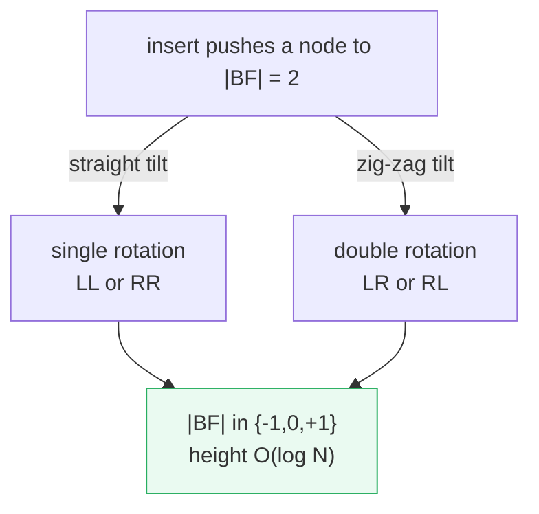
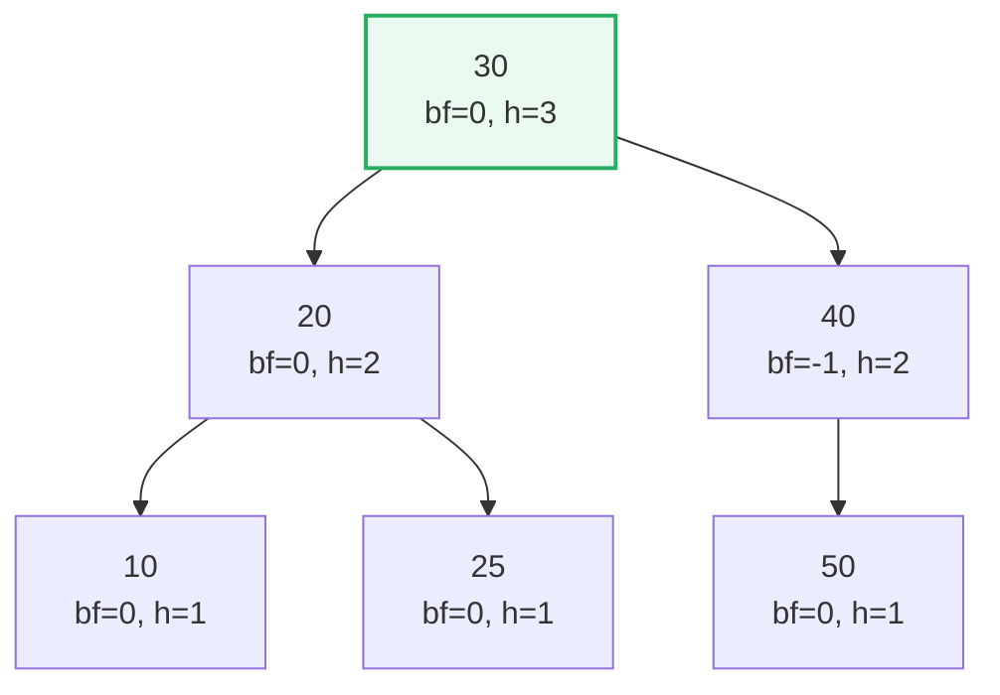
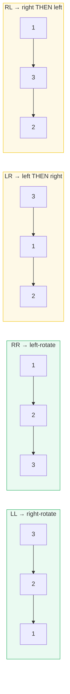
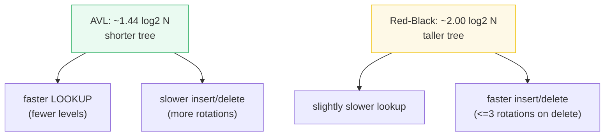

# AVL Tree — A Visual, Rotation-by-Rotation, Worked-Example Guide

> **Companion code:** [`avl_tree.py`](./avl_tree.py). **Every number and tree in
> this guide is printed by `python3 avl_tree.py`** — nothing is hand-computed.
>
> **Live animation:** [`avl_tree.html`](./avl_tree.html) — open in a browser.
> It rebuilds the AVL tree in JS from the *identical* rotations and gold-checks
> the balance factors against the `.py`.

---

## 0. TL;DR — the self-righting mobile

> **The analogy (read this first):** Picture a BST as a hanging **mobile**
> (sculpture): each node is a bar that must stay roughly level. A plain BST lets
> one side grow indefinitely, so the mobile tips over and a search degrades to
> **O(N)**. An **AVL tree** adds one rule that keeps every bar level: the
> **balance factor** = `height(left) - height(right)` must be in **{-1, 0, +1}**.
> The instant an insert or delete pushes a node to +2 or -2, a local **rotation**
> pulls it back level.

There are only **four** tilt patterns and one fix each — two single rotations
(LL, RR) and two double rotations (LR, RL). The result: height is always
**O(log N)**, so search/insert/delete are **O(log N) worst case**, not just on
average. AVL is the **most rigidly balanced** common tree (tighter than
Red-Black), which makes **lookup fastest** (shortest tree) at the cost of more
rotations on update.



> One plain sentence: an AVL tree is a BST that **never lets any node tilt more
> than one level** — insert/delete check balance factors up the path and apply a
> single/double rotation to restore level.

---

### Glossary (plain English — refer back any time)

| Term | Plain meaning |
|---|---|
| **BST** | Binary search tree: left subtree < node < right subtree. |
| **height(node)** | Number of NODES on the longest downward path to a null. A leaf = 1, empty = 0. |
| **balance factor** | `BF(node) = height(left) - height(right)`. Must be in **{-1, 0, +1}**. |
| **rotation** | A local pointer rewrite that swaps a node with its child to restore balance, preserving in-order order. |
| **LL / RR** | Single rotations: the tilt is a straight line (left-left or right-right). |
| **LR / RL** | Double rotations: the tilt is a zig-zag (rotate the child, then the parent). |
| **in-order invariant** | Rotations never change the sorted (in-order) sequence — only the shape. |

---

## 1. Insert `[10,20,30,40,50,25]` — watch the rotations fire

This is the canonical worked example (the classic AVL insert demo). We insert
six values in order and print the tree after each step. The first three
ascending values would make a plain BST a degenerate right-leaning chain; the
AVL tree keeps fighting back with rotations.

> From `avl_tree.py` **Section A**:
>
> ```
> --- insert 10 ---
>   (no rotation needed; balance factors all in {-1,0,+1})
> 10(bf=+0,h=1)
>
> --- insert 20 ---
>   (no rotation needed; balance factors all in {-1,0,+1})
>     20(bf=+0,h=1)
> 10(bf=-1,h=2)
>
> --- insert 30 ---
>   >> IMBALANCE at 10: RR case -> left-rotate
>     30(bf=+0,h=1)
> 20(bf=+0,h=2)
>     10(bf=+0,h=1)
>
> --- insert 40 ---
>   (no rotation needed; balance factors all in {-1,0,+1})
>         40(bf=+0,h=1)
>     30(bf=-1,h=2)
> 20(bf=-1,h=3)
>     10(bf=+0,h=1)
>
> --- insert 50 ---
>   >> IMBALANCE at 30: RR case -> left-rotate
>         50(bf=+0,h=1)
>     40(bf=+0,h=2)
>         30(bf=+0,h=1)
> 20(bf=-1,h=3)
>     10(bf=+0,h=1)
>
> --- insert 25 ---
>   >> IMBALANCE at 20: RL case -> right-rotate @right, then left-rotate
>         50(bf=+0,h=1)
>     40(bf=-1,h=2)
> 30(bf=+0,h=3)
>         25(bf=+0,h=1)
>     20(bf=+0,h=2)
>         10(bf=+0,h=1)
> ```

Three rotations fire, one per "tilt event":

| inserted | imbalance at | case | fix |
|---|---|---|---|
| 30 | 10 (BF = -2) | **RR** | one left-rotation |
| 50 | 30 (BF = -2) | **RR** | one left-rotation |
| 25 | 20 (BF = -2) | **RL** | right-rotate child, then left-rotate node |

The final tree (tilt your head LEFT to read the sideways print; right children
are drawn above, left below):



> From `avl_tree.py` **Section A** (final tree + traversal):
>
> ```
> Final AVL tree after inserting all of [10, 20, 30, 40, 50, 25] :
>         50(bf=+0,h=1)
>     40(bf=-1,h=2)
> 30(bf=+0,h=3)
>         25(bf=+0,h=1)
>     20(bf=+0,h=2)
>         10(bf=+0,h=1)
>
> In-order traversal (must stay sorted): [10, 20, 25, 30, 40, 50]
> ```

---

## 2. The four rotation cases (LL, RR, LR, RL)

Every AVL imbalance is one of exactly four shapes. A **single** rotation (LL, RR)
fixes a straight tilt; a **double** rotation (LR, RL) fixes a zig-zag.



- **LL (left-left):** the left child of a left-heavy node is itself left-heavy.
  Fix = **one right rotation** at the node.
- **RR (right-right):** the right child of a right-heavy node is itself
  right-heavy. Fix = **one left rotation** at the node.
- **LR (left-right):** the left child of a left-heavy node is right-heavy
  (zig-zag). Fix = **left-rotate the child, then right-rotate the node**.
- **RL (right-left):** the right child of a right-heavy node is left-heavy
  (zig-zag). Fix = **right-rotate the child, then left-rotate the node**.

> From `avl_tree.py` **Section B**:
>
> ```
> LL (left-left):  straight left tilt -> ONE right rotation
>   insert sequence: [3, 2, 1]
>     >> LL at 3: right-rotate
>   AFTER fix -> tree:
>     3(bf=+0,h=1)
> 2(bf=+0,h=2)
>     1(bf=+0,h=1)
>   in-order (unchanged by rotation): [1, 2, 3]   [check] balanced? True
>
> RR (right-right): straight right tilt -> ONE left rotation
>   insert sequence: [1, 2, 3]
>     >> RR at 1: left-rotate
>   (same balanced result)
>
> LR (left-right):  zig-zag in left subtree -> left THEN right
>   insert sequence: [3, 1, 2]
>     >> LR at 3: left-rotate @left, then right-rotate
>   (same balanced result)
>
> RL (right-left):  zig-zag in right subtree -> right THEN left
>   insert sequence: [1, 3, 2]
>     >> RL at 1: right-rotate @right, then left-rotate
>   (same balanced result)
> ```

All four cases end at the **same perfectly balanced 3-node tree** with root 2 —
the rotation just straightens the tilt. Crucially, the **in-order sequence is
unchanged by every rotation** (`[1, 2, 3]` before and after): rotations only
reshape, never reorder.

> 🔗 **Why a double rotation:** a zig-zag (LR/RL) cannot be fixed by one
> rotation because the child leans the *wrong* way. Rotating the child first
> straightens it into an LL/RR shape, which the second rotation then fixes.
> See `avl_tree.py` `rotate_right`/`rotate_left` for the pointer mechanics.

---

## 3. Balance factor tracking — the invariant, node by node

The AVL invariant is: **every node's balance factor is in {-1, 0, +1}**. We check
it for every node in the Section A tree:

> From `avl_tree.py` **Section C**:
>
> ```
> | val | balance factor | height | left child | right child |
> |-----|----------------|--------|------------|-------------|
> | 10  | +0              | 1      | -          | -           |
> | 20  | +0              | 2      | 10         | 25          |
> | 25  | +0              | 1      | -          | -           |
> | 30  | +0              | 3      | 20         | 40          |
> | 40  | -1              | 2      | -          | 50          |
> | 50  | +0              | 1      | -          | -           |
>
> all balance factors: [0, 0, 0, 0, -1, 0]
> each BF in {-1,0,+1}? True
> max |BF| = 1  (must be <= 1 for a valid AVL tree)
> ```

The tree leans right only at node 40 (it has a right child 50 but no left child),
giving BF = -1 — still within the legal range. Every other node is perfectly
balanced (BF = 0).

---

## 4. Delete + rebalance

A delete removes a node and then walks back up the recursion fixing heights and
checking balance factors — exactly like insert, **but** a delete can trigger a
rotation at **every** ancestor on the path (still O(log N)), whereas an insert
needs at most one.

> From `avl_tree.py` **Section D**:
>
> ```
> Build a tree from [10,20,30,40,50,25,5], then DELETE 50.
> Tree after insert [10,20,30,40,50,25,5]:
>         50(bf=+0,h=1)
>     40(bf=-1,h=2)
> 30(bf=+1,h=4)
>         25(bf=+0,h=1)
>     20(bf=+1,h=3)
>         10(bf=+1,h=2)
>             5(bf=+0,h=1)
>
> --- delete 50 ---
>   >> IMBALANCE at 30: LL case -> right-rotate (delete)
> Tree after delete + rebalance:
>         40(bf=+0,h=1)
>     30(bf=+0,h=2)
>         25(bf=+0,h=1)
> 20(bf=+0,h=3)
>     10(bf=+1,h=2)
>         5(bf=+0,h=1)
> in-order (still sorted, length-1): [5, 10, 20, 25, 30, 40]
>
> [check] balanced after delete? True   height = 3
> ```

Deleting the only right-side leaf (50) makes the root left-heavy by 2 → an LL
(right) rotation pulls it back level. The in-order sequence loses exactly the
deleted element and stays sorted.

---

## 5. AVL vs Red-Black (and the height bound)

An AVL tree with **N** nodes has height at most **1.4405·log₂(N+2) − 0.3277**
(the Knuth bound). For our N=6 tree:

> From `avl_tree.py` **Section E**:
>
> ```
> Our tree: N = 6 nodes, height = 3 (node-count).
> AVL height bound (Knuth):  h <= 1.4405*log2(N+2) - 0.3277
>   for N = 6:  bound = 1.4405*log2(8) - 0.3277 = 3.994
>   our height 3 <= 3.994?  True
> ```



> From `avl_tree.py` **Section E** (the trade-off table):
>
> | property | AVL tree | Red-Black tree |
> |---|---|---|
> | balance rule | \|BF\| <= 1 everywhere | no path is >2x another |
> | height bound | ~1.44 log₂ N | ~2.00 log₂ N |
> | rotations / insert | up to 2 (double) | at most 2 |
> | rotations / delete | O(log N) (cascade) | at most 3 |
> | lookup speed | **FASTER** (shorter tree) | slightly slower |
> | insert/delete speed | slower (more rotates) | **faster** (relaxed) |
> | use when | read-heavy workload | write-heavy / general |

**Bottom line:** AVL is the most rigidly balanced → shortest tree → fastest
lookup, but pays with more rotations on update. Red-Black relaxes the rule
(O(1) rotations on delete) so it is the default in most stdlibs (C++
`std::map`, Java `TreeMap`, the Linux CFS scheduler).

---

## 6. Gold check (how the bundle stays honest)

Every number above is reproducible from one command:

```bash
python3 avl_tree.py          # prints all sections + gold check
python3 avl_tree.py > avl_tree_output.txt   # capture
```

The **AVL invariant** — every balance factor in {-1,0,+1} — is the gold
contract. The companion [`avl_tree.html`](./avl_tree.html) re-runs the *same*
insert sequence and rotations in JavaScript and shows a green `[check: OK]`
badge when its balance factors match. Change the logic in either file and the
badge turns red.

> From `avl_tree.py` **GOLD CHECK**:
>
> ```
> node balance factors: {10: 0, 20: 0, 25: 0, 30: 0, 40: -1, 50: 0}
> every BF in {-1,0,+1}? True
> recursive invariant check? True
> tree height = 3
> GOLD (pinned for avl_tree.html): final tree in-order = [10, 20, 25, 30, 40, 50], height = 3, balanced = True
> [check] AVL invariant (all BF in {-1,0,+1}): OK
> ```

| quantity | value | source |
|---|---|---|
| final tree in-order | **[10, 20, 25, 30, 40, 50]** | Section A |
| tree height | **3** | Section C / gold |
| balance factors | `{10:0, 20:0, 25:0, 30:0, 40:-1, 50:0}` | Section C |
| rotations fired (insert) | **3** (RR, RR, RL) | Section A |
| height bound (N=6) | **3.994** | Section E |

---

## Further reading

- **Adelson-Velsky & Landis** (1962), "An algorithm for the organization of
  information," *Soviet Doklady* — the original AVL paper.
- **CLRS** *Introduction to Algorithms*, 3rd ed. — §13 (Red-Black Trees) for the
  balancing mindset and the comparison with AVL.
- **Knuth**, *The Art of Computer Programming* Vol. 3 — derives the AVL height
  bound **1.4405·log₂(N+2) − 0.3277**.
- **Sedgewick & Wayne** *Algorithms*, 4th ed. — §3.3 balanced search trees, with
  rotation visualizations.
