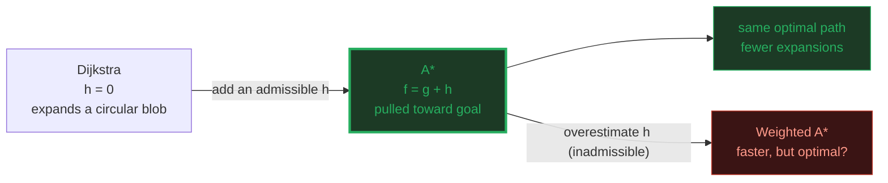
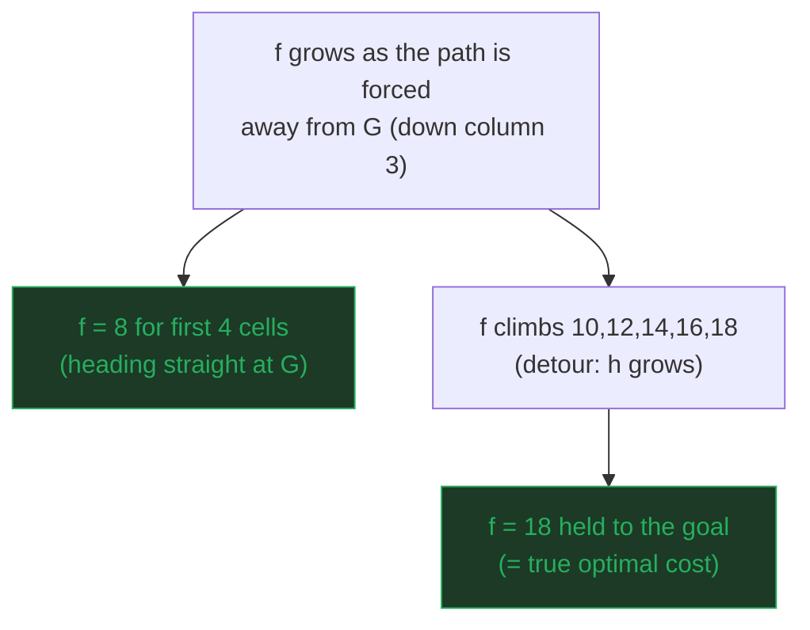
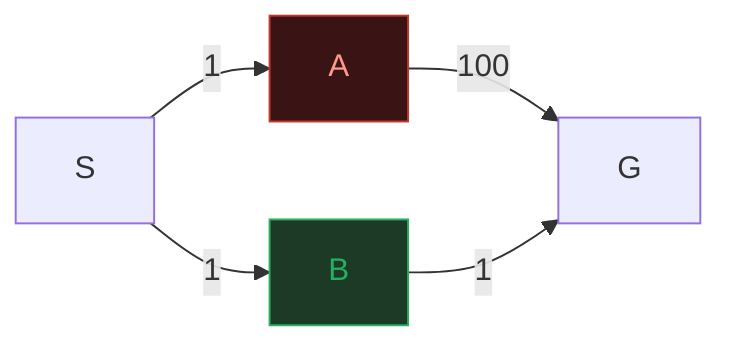

# A* Search — A Visual, Worked-Example Guide

> **Companion code:** [`a_star.py`](./a_star.py). **Every number, table, and
> trace in this guide is printed by `python3 a_star.py`** — nothing is
> hand-computed.
>
> **Live animation:** [`a_star.html`](./a_star.html) — open in a browser: the
> 7×9 grid with a wall detour, an A*-vs-Dijkstra exploration overlay, an
> admissibility toggle, and a gold check re-run in JavaScript.

---

## 0. TL;DR — the one idea

> **The "smell the goal" analogy (read this first):** Dijkstra expands outward
> from the source in concentric circles of equal *cost*, indifferent to where
> the goal is. A* gives the search a **nose**: at every node it scores
>
> &nbsp;&nbsp;&nbsp;&nbsp;**`f(n) = g(n) + h(n)`** &nbsp;(`g` = cost so far, `h` = estimated cost to goal)
>
> and always expands the open node with the smallest `f`. A good `h` *pulls*
> the search toward the goal, so A* reaches it after expanding far fewer
> nodes than Dijkstra — yet, **provided `h` never overestimates** (`h` is
> *admissible*), A* still returns an **optimal** path. **Dijkstra is exactly
> A* with `h = 0`.**

| | heuristic | optimality | expansions vs Dijkstra |
|---|---|---|---|
| **Dijkstra** | `h = 0` (no nose) | yes | baseline (most) |
| **A\* (admissible h)** | `0 ≤ h ≤ h*` | **yes** | **fewer** |
| A* (inadmissible h) | `h > h*` somewhere | **not guaranteed** | even fewer, but maybe wrong |



---

### Glossary (plain English — refer back any time)

| Term | Plain meaning |
|---|---|
| **source `S`, goal `G`** | The start and the target cell. |
| **`g(n)`** | Exact cost paid so far from `S` to `n` (sum of step costs). |
| **`h(n)`** | Heuristic — estimated cost from `n` to `G`. Here: Manhattan distance `|Δr| + |Δc|`. |
| **`h*(n)`** | The TRUE cheapest cost from `n` to `G` (unknown; `h` estimates it). |
| **`f(n) = g(n)+h(n)`** | A*'s priority key — "best guess at total path cost through `n`". |
| **admissible** | `h` never overestimates: `h(n) ≤ h*(n)` for all `n`. ⇒ A* **optimal**. |
| **consistent** | `h(n) ≤ cost(n,m) + h(m)` for every edge — a stronger condition ⇒ `f` never decreases, no reopening. Manhattan is consistent. |
| **expand / settle** | Pop the open node with smallest `f`, mark it closed, relax its neighbours. |
| **open set** | Discovered-but-unsettled nodes, ordered by `f` (a min-heap). |
| **Manhattan distance** | Grid distance ignoring obstacles: `|Δr| + |Δc|`. A perfect admissible heuristic for 4-connected unit-cost grids. |

---

## 1. The grid + A* expansion trace

A 7×9 grid. A vertical wall at **column 4, rows 0–4** blocks the direct
top-row route; the only gap is at the **bottom (rows 5–6)**. Start is the
top-left, goal the top-right: the Manhattan distance *looks* tiny (8) but the
real optimal path must detour all the way down to the gap and back up.

> From `a_star.py` Section A — the grid:

```
  S       #       G
          #        
          #        
          #        
          #        
                   
                   

Wall: column 4, rows 0-4. The only way across is the bottom gap (rows 5-6).
Manhattan(S, G) = |0-0| + |0-8| = 8  <- looks close, but a wall blocks the direct route.
```

> From `a_star.py` Section A — A* expansion order (`f` = `g` + `h`):

```
  | step | cell    | g  | h  | f  | on path? |
  |------|---------|----|----|----|----------|
  | 1    | (0, 0) | 0  | 8  | 8  | yes      |
  | 2    | (0, 1) | 1  | 7  | 8  | yes      |
  | 3    | (0, 2) | 2  | 6  | 8  | yes      |
  | 4    | (0, 3) | 3  | 5  | 8  | yes      |
  | 5    | (1, 3) | 4  | 6  | 10 | yes      |
  | 6    | (1, 2) | 3  | 7  | 10 |          |
  | 7    | (1, 1) | 2  | 8  | 10 |          |
  | 8    | (1, 0) | 1  | 9  | 10 |          |
  | ...                                                           |
  | 21   | (5, 3) | 8  | 10 | 18 | yes      |
  | 22   | (5, 4) | 9  | 9  | 18 | yes      |
  | 23   | (5, 5) | 10 | 8  | 18 | yes      |
  | 24   | (4, 5) | 11 | 7  | 18 | yes      |
  | ...                                                           |
  | 31   | (0, 8) | 18 | 0  | 18 | yes      |

  A* settles 31 cells, finds the goal at g = 18.
```



> **Cells are expanded in order of `f` (smallest first)**; ties are broken by
> preferring **higher `g`** (closer to the goal) — the standard A* tie-break
> that focuses the search. The optimal path (cost 18, 19 cells) threads right
> to column 3, **down** to the bottom gap, **across** at row 5, then **up**
> column 5 to the goal:

```
  Grid with the path (*) and every A*-expanded cell (.) overlaid:
  S * * * # * * * G
  . . . * # *      
  . . . * # *      
  . . . * # *      
  . . . * # *      
        * * *      
                   
```

---

## 2. The `f = g + h` formula — and the monotonic-`f` property

> From `a_star.py` Section B — `g`, `h`, `f` along the optimal path:

```
  | cell    | g (cost so far) | h (Manhattan to G) | f = g + h |
  |---------|-----------------|---------------------|-----------|
  | (0, 0) | 0               | 8                   | 8         |
  | (0, 1) | 1               | 7                   | 8         |
  | (0, 2) | 2               | 6                   | 8         |
  | (0, 3) | 3               | 5                   | 8         |
  | (1, 3) | 4               | 6                   | 10        |
  | (2, 3) | 5               | 7                   | 12        |
  | (3, 3) | 6               | 8                   | 14        |
  | (4, 3) | 7               | 9                   | 16        |
  | (5, 3) | 8               | 10                  | 18        |
  | (5, 4) | 9               | 9                   | 18        |
  | (5, 5) | 10              | 8                   | 18        |
  | (4, 5) | 11              | 7                   | 18        |
  | (0, 5) | 15              | 3                   | 18        |
  | (0, 8) | 18              | 0                   | 18        |

  [check] f non-decreasing along the optimal path?  YES
  [check] f non-decreasing along the EXPANSION order?  YES (consistent h => no reopen)
```

> **`f` is NOT constant on the path — it RISES.** The first four cells head
> straight toward `G` so `h` shrinks 1-for-1 with `g` and `f` stays 8. But the
> wall forces the path to detour **down** column 3, *away* from `G`: there `h`
> **grows** while `g` keeps growing, so `f` climbs 8 → 10 → 12 → 14 → 16 → 18.
> Once the path turns back toward `G`, `h` shrinks 1-for-1 again and `f` holds
> at **18 — the true optimal cost** — all the way to `G`. Because the heuristic
> is **consistent**, `f` never *decreases* as A* expands, so a closed node is
> never reopened.

---

## 3. Admissible vs inadmissible heuristic

**Admissible** (`h(n) ≤ h*(n)`, never overestimates) ⇒ A* is **optimal**.
**Inadmissible** (`h > h*` somewhere) ⇒ A* runs **faster** but may return a
**suboptimal** path.

> From `a_star.py` Section C — overestimating `h` on the grid (Weighted A*):

```
  | h multiplier | meaning            | A* cost | optimal? | cells expanded |
  |--------------|--------------------|---------|----------|----------------|
  | 1.0          | Manhattan          | 18      | yes      | 31             |
  | 2.0          | Weighted A* (2.0x) | 18      | yes      | 30             |
  | 3.0          | Weighted A* (3.0x) | 18      | yes      | 29             |
  | 5.0          | Weighted A* (5.0x) | 18      | yes      | 28             |
```

> On *this* grid the overestimate happens to stay optimal (only one good
> route), but it explores fewer cells and the optimality **guarantee** is gone.
> To prove inadmissibility can actually break optimality, here is a tiny
> weighted graph (optimal `S→B→G` = 2; the long route `S→A→G` = 101):

```
    S --1--> A --100--> G        (long route, total 101)
     \                       
      1                       
       v                      
        B -------1------> G    (short route, total 2)

  | heuristic           | h(A) | h(B) | A* cost to G | optimal (2)? |
  |---------------------|------|------|--------------|--------------|
  | admissible (=true)  | 100  | 1    | 2            | yes          |
  | inadmissible        | 0    | 200  | 101          | NO           |
```



> With `h(B)=200` (overestimate), A* settles `A` first, pops `G` via the long
> route (`f=101`) **before** ever expanding `B` (`f=1+200=201`) → returns
> **101, NOT 2**. **The rule:** drop admissibility and you trade OPTIMALITY for
> SPEED, knowingly.

---

## 4. A* vs Dijkstra — fewer nodes expanded

Run both from `S=(0,0)` to `G=(0,8)` on the same grid. Dijkstra is `h=0`, so
it has no nose and floods a roughly circular blob; A*'s Manhattan `h` biases
every decision toward `G`.

> From `a_star.py` Section D — head-to-head:

```
  | algorithm | heuristic        | cost | cells expanded | cells explored only by it |
  |-----------|------------------|------|----------------|---------------------------|
  | A*        | Manhattan (h>0)  | 18   | 31             | 0                         |
  | Dijkstra  | h = 0            | 18   | 58             | 27                        |

  [check] same optimal cost?       A*=18, Dijkstra=18 -> YES
  [check] A* expands fewer?         31 < 58 -> YES (27 fewer = 47% saving)
  [check] A* explored a SUBSET?     only-A* cells = 0 -> YES

What Dijkstra wastes (cells A* never needed to touch), shown as '.' :
  S       #       G
          #   . . .
          #   . . .
          #   . . .
          #   . . .
  . . .       . . .
  . . . . . . . . .
```

> **A* explored a strict SUBSET** of Dijkstra's cells (0 cells were unique to
> A*). Dijkstra (h=0) explores a big blob around `S`, including cells *below*
> and *away* from the goal that cannot lie on any useful path; A*'s heuristic
> skips them. **Same answer, ~half the work** (47% fewer expansions).

---

## 5. Why admissible `h` guarantees an optimal path

> **Theorem (Hart, Nilsson, Raphael 1968):** if `h` is **admissible**
> (`h(n) ≤ h*(n)` for all `n`), then when A* pops the goal `G` it has found an
> **optimal** path.

**Proof sketch (by the f-bound):**
- A* always pops the open node with smallest `f`. When `G` is popped,
  `f(G) = g(G) + h(G) = g(G) + 0 = g(G)`.
- For ANY other open node `n`, admissibility gives
  `f(n) = g(n) + h(n) ≤ g(n) + h*(n)` = (true cost of the best path through
  `n`). So `f(n)` is a **lower bound** on any path through `n`.
- Since `G` was popped first, `f(G) ≤ f(n)` for every open `n`, hence `g(G)` is
  ≤ the best achievable through any open node. **No cheaper path can exist.**

**Consistency** (a stronger condition) adds: `f` never decreases, so A* never
needs to **reopen** a closed node. Manhattan is consistent on unit-cost grids.

> From `a_star.py` Section E — numerical confirmation:

```
  A*        cost = 18    (admissible Manhattan h)
  Dijkstra  cost = 18    (h = 0, trivially admissible)
  brute-force min (BFS by cost) = 18
  [check] A* optimal?  A* == Dijkstra == 18 -> YES
```

> **Bottom line:** A* = Dijkstra + a heuristic. A good admissible `h` prunes
> the search (Section 4) WITHOUT sacrificing optimality (this section). That is
> why A* dominates pathfinding in games, maps, and robotics.

---

## 6. Complexity summary

| | A* (admissible h) | A* (h=0 = Dijkstra) |
|---|---|---|
| worst-case complexity | **O((V+E) log V)** | O((V+E) log V) |
| expansions | **≤ Dijkstra's** | most (baseline) |
| optimality | **yes** | yes |
| reopen closed nodes | no (if h consistent) | no |
| needs a good `h` | yes (else ≈ Dijkstra) | n/a |

> The single lever in A* is the **heuristic `h`**. `h=0` ⇒ Dijkstra. A tighter
> (but still admissible) `h` ⇒ fewer expansions, same optimal answer. An
> *inconsistent/inadmissible* `h` ⇒ speed, but correctness is on you. Reach for
> A* whenever you have a cheap lower-bound estimate of the remaining cost —
> Manhattan/Octile distance on grids, great-circle on maps, pattern databases
> in puzzles. 🔗 See **DIJKSTRA.md** for the `h=0` baseline this builds on.

---

### Reproducibility

Every trace and table above is printed verbatim by `python3 a_star.py` and
cross-checked at the end of that run against Dijkstra (the `h=0` special case):

> From `a_star.py` — the gold check:

```
  A*        : cost = 18, expansions = 31
  Dijkstra  : cost = 18, expansions = 58
  same optimal path cost (18)?  True
  A* expands fewer nodes?            True (31 < 58)

GOLD CHECK: OK - A* finds the SAME optimal path as Dijkstra (cost 18)
while expanding FEWER nodes (31 vs 58).
```

`a_star.html` re-runs **both** A* and Dijkstra in JavaScript with identical
logic on the same grid, and re-checks `cost = 18` and `31 < 58` — the green
`check: OK` badge confirms the page matches the `.py` exactly.
