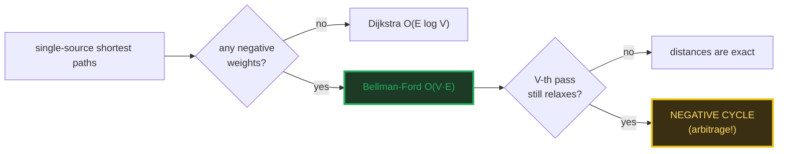
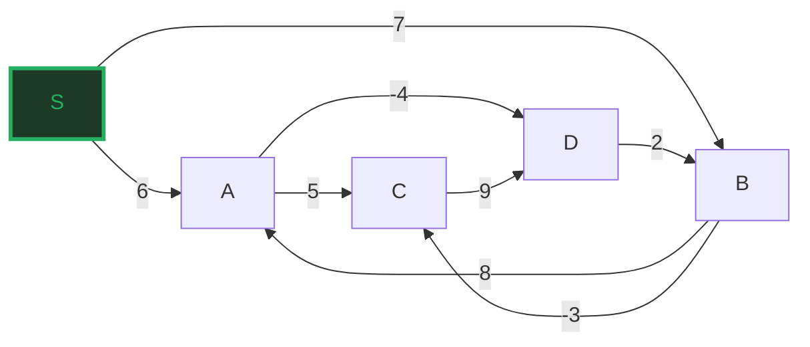
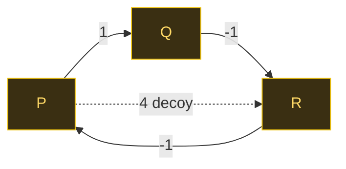
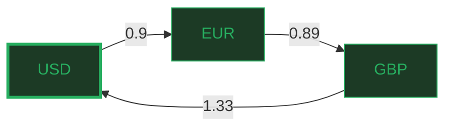

# Bellman-Ford — A Visual, Worked-Example Guide

> **Companion code:** [`bellman_ford.py`](./bellman_ford.py). **Every number
> and table in this guide is printed by `python3 bellman_ford.py`** — nothing is
> hand-computed.
>
> **Live animation:** [`bellman_ford.html`](./bellman_ford.html) — open in a
> browser: step through the V-1 relaxation passes, watch the V-th pass catch a
> negative cycle, and see a currency triangle produce an arbitrage.

---

## 0. TL;DR — the one idea

> **The "rumor that keeps getting better" analogy (read this first):** you want
> the cheapest route from a source to every vertex. Dijkstra settles the closest
> unvisited vertex and **never reconsiders it** — that only works when no edge
> can lower an already-settled vertex, i.e. **all weights ≥ 0**.
>
> Bellman-Ford is the patient, brute version: **relax every edge** (`if
> dist[u]+w < dist[v]: dist[v] = dist[u]+w`), **V−1 times**. Then run **one more
> pass** — if any edge still relaxes, a **negative cycle** exists.

| algorithm | time | negative weights | negative cycle | when to use |
|---|---|---|---|---|
| **Dijkstra** | **O(E log V)** | ✗ silently wrong | ✗ | all edges ≥ 0 |
| **Bellman-Ford** | **O(V·E)** | **✓ handled** | **✓ detected** | any negative weight |

The payoff: a profitable **currency arbitrage** is *exactly* a negative cycle in
the `−log(rate)` graph — Bellman-Ford finds free money.



---

### Glossary (plain English — refer back any time)

| Term | Plain meaning |
|---|---|
| **`V`**, **`E`** | Vertices and directed edges. The worked graph: V=5, E=8. |
| **relaxation** | The one move: try to improve `dist[v]` via `dist[u]+w(u,v)`. |
| **pass** | One sweep over ALL `E` edges (in a fixed order). |
| **`dist[v]`** | Best known cost source→v so far. 0 at source, +∞ elsewhere. |
| **predecessor** | The `u` that gave `dist[v]` its value; rebuilds the path tree. |
| **V−1 passes** | The completeness bound: any simple shortest path has ≤ V−1 edges. |
| **negative cycle** | A directed cycle with total weight < 0 → shortest paths undefined. |
| **detection** | A relaxation on the V-th pass ⟺ a reachable negative cycle. |
| **SPFA** | Queue-based Bellman-Ford: only re-examine vertices that just changed. |

---

## 1. Relaxation — V−1 passes on a graph with negative edges

The worked graph has negative edges (`A→D = −4`, `B→C = −3`) but **no negative
cycle** (every loop is ≥ 0), so shortest paths exist. V−1 = 4 passes guarantee
convergence.

> From `bellman_ford.py` Section A — the V−1 passes:

```
Edges (in relaxation order):
  S -> A  w = 6
  S -> B  w = 7
  A -> C  w = 5
  A -> D  w = -4
  B -> A  w = 8
  B -> C  w = -3
  C -> D  w = 9
  D -> B  w = 2

pass  distances after pass                            #relaxations  
--------------------------------------------------------------------
init  S=0  A=inf  B=inf  C=inf  D=inf                 -             
1     S=0  A=6  B=4  C=4  D=2                         6             
2     S=0  A=6  B=4  C=1  D=2                         1             
3     S=0  A=6  B=4  C=1  D=2                         0             
4     S=0  A=6  B=4  C=1  D=2                         0             
det.  S=0  A=6  B=4  C=1  D=2                         0 (no relax -> no neg cycle)

Shortest-path tree (source S = vertex 0):
  to    dist      path                    path cost   
  --------------------------------------------------
  S     0         S                       
  A     6         S -> A                  
  B     4         S -> A -> D -> B        
  C     1         S -> A -> D -> B -> C   
  D     2         S -> A -> D             

[check] final dist = [0, 6, 4, 1, 2] == [0, 6, 4, 1, 2]:  OK
[check] no relaxation on V-th (detection) pass:  OK
```



> **Read it column by column.** `dist[B]` starts at 7 then drops to 4 in pass 1
> (via `S→A→D→B = 6−4+2`); `dist[C]` drops from 4 to 1 in pass 2 (via `B→C` once
> `B` reached 4). After pass 2 nothing changes — the tree is complete. Passes 3
> and 4 are pure verification (zero relaxations).

---

## 2. Negative cycle detection — the V-th pass still relaxes

Now a graph *with* a negative cycle: `P→Q→R→P = 1 + (−1) + (−1) = −1 < 0`. Loop
it forever and the cost keeps dropping, so **shortest paths are undefined** —
Bellman-Ford's job is to *detect* this, not solve it.

> From `bellman_ford.py` Section B — the detection pass:

```
Edges:
  P -> Q  w = 1
  Q -> R  w = -1
  R -> P  w = -1   cycle P->Q->R->P = 1 - 1 - 1 = -1
  P -> R  w = 4

pass  distances after pass                    #relaxations  
----------------------------------------------------------
init  P=0  Q=inf  R=inf                       -
1     P=-1  Q=1  R=0                          3
2     P=-2  Q=0  R=-1                         3
det.  P=-2  Q=0  R=-1                         RELAXED!

On the V-th (detection) pass an edge STILL relaxed -> has_negative_cycle = True.

Recovered negative cycle: Q -> R -> P -> Q  (weight -1)
[check] negative cycle detected AND recovered:  OK
```



> **The signature of a negative cycle: distances that never converge.** Every
> pass drops them further (`P: −1 → −2 → …`). The V-th pass still relaxes an edge
> ⇒ detection fires. Standard recovery: walk predecessors V times from the
> relaxing vertex to land on the cycle, then collect it.

---

## 3. Currency arbitrage — a negative cycle is free money

An exchange rate `r(i,j)` = "units of `j` per 1 `i`". A trade loop is profitable
iff the **product** of rates > 1. The trick that maps this to Bellman-Ford:

> `weight(i,j) = −log(rate(i,j))`  ⇒  loop `weight_sum = −log(product)`  ⇒
> **`weight_sum < 0` ⟺ `product > 1` ⟺ ARBITRAGE.**

So a profitable trade loop is *exactly* a negative cycle in the `−log` graph.

> From `bellman_ford.py` Section C — rates, weights, and the arbitrage loop:

```
Exchange rate table (rate[i][j] = units of j per 1 i):

        USD     EUR     GBP     
  ------------------------------
  USD   1.00    0.90    0.75    
  EUR   1.11    1.00    0.89    
  GBP   1.33    1.12    1.00    

Sanity: every DIRECT round-trip (2-cycle) must be <= 1 or a single pair is
already an arbitrage. Here:
  USD->EUR->USD: 0.9 * 1.11 = 0.9990  (ok)
  USD->GBP->USD: 0.75 * 1.33 = 0.9975  (ok)
  EUR->GBP->EUR: 0.89 * 1.12 = 0.9968  (ok)

Edge weights w(i,j) = -ln(rate(i,j)):
  USD -> EUR   0.9     +0.105361   
  EUR -> USD   1.11    -0.104360   
  USD -> GBP   0.75    +0.287682   
  GBP -> USD   1.33    -0.285179   
  EUR -> GBP   0.89    +0.116534   
  GBP -> EUR   1.12    -0.113329   

pass  distances after pass (USD,EUR,GBP)          #relax  
----------------------------------------------------------
init  USD=0  EUR=inf  GBP=inf                     -
1     USD=0  EUR=0.105361  GBP=0.221894           3
2     USD=-0.063285  EUR=0.105361  GBP=0.221894   1
det.  USD=-0.063285  EUR=0.105361  GBP=0.221894   RELAXED!

has_negative_cycle = True  ->  an arbitrage loop exists.

Recovered arbitrage loop: USD -> EUR -> GBP -> USD
  loop weight sum = -0.063285  (< 0, as expected)
  rate product    = exp(-weight) = 1.06533  (> 1, profit!)

Concrete trade, starting with $1000 USD:
  start: 1000.00 USD
  USD -> EUR @ 0.9: 900.00 EUR
  EUR -> GBP @ 0.89: 801.00 GBP
  GBP -> USD @ 1.33: 1065.33 USD

  ended with 1065.33 USD  ->  profit = +65.33 USD (+6.53%) per $1000.

[check] rate product = 1.06533 > 1  <=>  negative cycle:  OK
[check] $1000 -> 1065.33 (factor 1.06533 == 1.06533):  OK
```



> **The arbitrage:** $1000 → 0.9 = €900 → 0.89 = £801 → 1.33 = **$1065.33**.
> No direct 2-cycle is profitable (each round-trips to ≤ 1), but the **3-cycle**
> `USD→EUR→GBP→USD` multiplies to `0.9 × 0.89 × 1.33 = 1.0653 > 1`. Bellman-Ford
> sees this as the negative cycle `weight = −0.0633`. This is *exactly* how
> real-time FX arbitrage scanners work.

---

## 4. Bellman-Ford vs Dijkstra — the gold check

On a **non-negative** graph both engines must give identical distances. This is
the gold check: `bellman_ford.html` re-runs both in JS and confirms they match.

> From `bellman_ford.py` Section D — head-to-head:

```
  to    Bellman-Ford    Dijkstra        match   
  --------------------------------------------
  S     0               0.0             OK
  A     7               7.0             OK
  B     3               3.0             OK
  C     9               9.0             OK
  D     14              14.0            OK

Complexity comparison:
  | algorithm     | time          | negative weights | negative cycle |
  |---------------|---------------|------------------|----------------|
  | Dijkstra      | O(E log V)    | NO (silently wrong)| NO          |
  | Bellman-Ford  | O(V*E)        | YES              | DETECTS       |

GOLD CHECK: OK - Bellman-Ford == Dijkstra == [0, 7, 3, 9, 14]
```

> **Why Dijkstra breaks on negatives:** it settles a vertex the first time it is
> popped from the priority queue and *never revisits it*. A later negative edge
> that would have lowered an already-settled vertex is missed — silently, with no
> error. Rule of thumb: **all edges ≥ 0 → Dijkstra; any negative edge →
> Bellman-Ford.**

---

## 5. SPFA — the queue optimization

Bellman-Ford re-sweeps *all* E edges every pass, even vertices whose `dist`
hasn't changed (so their outgoing edges can't relax). **SPFA** (Shortest Path
Faster Algorithm) keeps a queue of vertices whose `dist` just dropped and
relaxes only their outgoing edges.

> From `bellman_ford.py` Section E — edge-check counts on the Section A graph:

```
  | engine       | edge-checks | successful relaxes | final dist          |
  |--------------|-------------|--------------------|---------------------|
  | Bellman-Ford | 40          | (not tracked)      | [0, 6, 4, 1, 2] |
  | SPFA         | 11          | 7                  | [0, 6, 4, 1, 2] |

SPFA examined 11 edges to reach the SAME answer Bellman-Ford gets
after sweeping all 8 edges 5 times (40 checks) - a 3.6x reduction.

[check] SPFA dist == Bellman-Ford dist == [0, 6, 4, 1, 2]:  OK
```

> **3.6× fewer edge-checks, identical answer.** SPFA is still O(V·E) worst case
> (a pathological graph can re-queue a vertex O(V) times), but on typical and
> random graphs it approaches O(E). It is the default Bellman-Ford in most
> competitive-programming libraries.

---

## 6. Complexity summary

| operation | Bellman-Ford | Dijkstra |
|---|---|---|
| single-source, no neg cycle | **O(V·E)** | **O(E log V)** |
| negative weights | ✓ | ✗ |
| negative cycle detection | ✓ (V-th pass) | ✗ |
| SPFA average | ~O(E) | — |
| space | O(V) | O(V) |

> The single question that picks the engine: **"can any edge be negative?"** If
> no → Dijkstra (faster). If yes, or if you need cycle/arbitrage detection →
> Bellman-Ford (or SPFA).

---

### Reproducibility

Every table above is printed verbatim by `python3 bellman_ford.py` and
self-checked at the end of each section:

> From `bellman_ford.py` Section D — the gold check:

```
GOLD CHECK: OK - Bellman-Ford == Dijkstra == [0, 7, 3, 9, 14]
```

`bellman_ford.html` re-runs Bellman-Ford, Dijkstra, and the arbitrage reduction
in JavaScript with the identical formula, and re-checks these exact values — the
green `check: OK` badge confirms the page matches the `.py` exactly.
