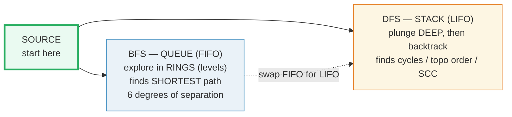
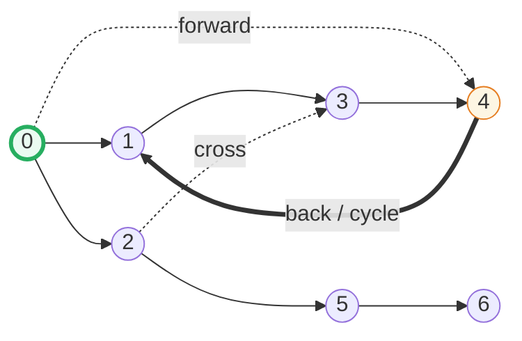
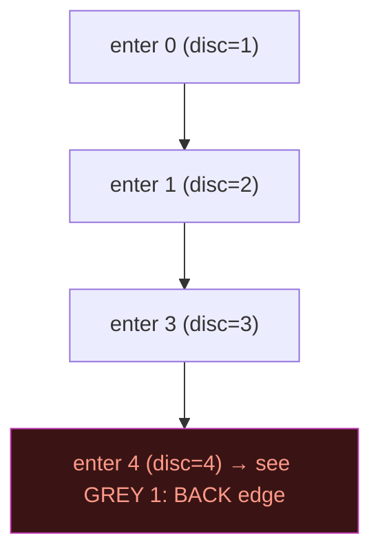

# BFS · DFS — A Visual, Worked-Example Guide

> **Companion code:** [`bfs_dfs.py`](./bfs_dfs.py). **Every number in this
> guide is printed by `python3 bfs_dfs.py`** — change the code, re-run,
> re-paste. Nothing here is hand-computed.
>
> **Live animation:** [`bfs_dfs.html`](./bfs_dfs.html) — open in a browser.
> Watch BFS ripple outward in rings and DFS plunge deep along one branch, then
> toggle between them. All numbers gold-check against the `.py`.
>
> **Source material:** CLRS ch.22 (Elementary Graph Algorithms) — BFS (22.2),
> DFS (22.3), topological sort (22.4), strongly-connected components (22.5);
> Sedgewick & Wayne ch.4.1 (undirected) and 4.2 (digraphs).

---

## 0. TL;DR — two ways to explore a maze, both O(V+E)

You start at a **source** node and want to reach every node in the graph. There
are exactly two strategies, and they answer **different questions**:



| | **BFS** (Breadth-First) | **DFS** (Depth-First) |
|---|---|---|
| **Data structure** | Queue (FIFO) — the *frontier* | Stack (LIFO) — recursion or explicit |
| **Explores** | level by level (rings of distance 0,1,2…) | one branch to the bottom, then backtrack |
| **Finds** | **shortest path** in unweighted graphs | cycles, topological order, SCC, components |
| **Time / space** | O(V + E) / O(V) | O(V + E) / O(V) |
| Section | [A](#a-bfs--queue), [C](#c-bfs-shortest-path) | [B](#b-dfs--stack), [D](#d-dfs-applications), [E](#e-edge-classification) |

> **One-line definition each:**
> - **BFS** = expand the *oldest* discovered node first (FIFO). New nodes join
>   the back of the queue; you always pull from the front. Result: nodes are
>   visited in **increasing distance** from the source.
> - **DFS** = expand the *newest* discovered node first (LIFO). Chase one path
>   as deep as possible before backing up. Result: a **forest** with discovery /
>   finish timestamps that reveal graph structure.

### Glossary

| Term | Plain meaning |
|---|---|
| **V, E** | vertices (nodes) and edges; both traversals run in **O(V + E)** |
| **adjacency list** | for each node, the list of nodes it points to (we iterate it in a fixed order) |
| **source** | the node we start from (here, node 0) |
| **frontier** (BFS) | the queue of nodes discovered but not yet explored |
| **color** (DFS) | WHITE = undiscovered · GREY = on the recursion stack · BLACK = finished |
| **discovery / finish time** | the step a node is entered / fully explored |
| **distance `d[v]`** | BFS: number of edges on the shortest source→v path |
| **parent `p[v]`** | the node that first discovered v; the parent chain *is* a shortest path |
| **back edge** | DFS edge to a GREY node (an ancestor) ⇒ a **cycle** |

---

## The one graph (7 nodes, directed)

All of Sections A, B, C, D(cycle) and E use this single directed graph `G`. It
is hand-picked so that **one DFS from node 0 exhibits all four edge classes**
(tree / back / forward / cross) **and contains a cycle**:



> From `bfs_dfs.py` — the adjacency list (fixed order ⇒ deterministic traversal):
> ```
>     0 -> [1, 4, 2]
>     1 -> [3]
>     2 -> [3, 5]
>     3 -> [4]
>     4 -> [1]
>     5 -> [6]
>     6 -> []
> ```

---

## A. BFS — Queue (FIFO)

BFS explores in **rings**: first all nodes 1 edge from the source, then all
nodes 2 edges out, then 3, … The queue holds the **frontier** — discovered but
not-yet-explored nodes. The key discipline: **mark a node visited when it is
*enqueued*** (not when dequeued), so each node enters the queue **at most once**.


> From `bfs_dfs.py` Section A — the frontier at each step:
> ```
>     start: enqueue 0                 frontier(front->back) = [0]
>     dequeue 0 -> visit               frontier(front->back) = []
>       enqueue neighbors of 0         frontier(front->back) = [1, 4, 2]
>     dequeue 1 -> visit               frontier(front->back) = [4, 2]
>       enqueue neighbors of 1         frontier(front->back) = [4, 2, 3]
>     dequeue 4 -> visit               frontier(front->back) = [2, 3]
>       enqueue neighbors of 4         frontier(front->back) = [2, 3]
>     dequeue 2 -> visit               frontier(front->back) = [3]
>       enqueue neighbors of 2         frontier(front->back) = [3, 5]
>     dequeue 3 -> visit               frontier(front->back) = [5]
>       enqueue neighbors of 3         frontier(front->back) = [5]
>     dequeue 5 -> visit               frontier(front->back) = []
>       enqueue neighbors of 5         frontier(front->back) = [6]
>     dequeue 6 -> visit               frontier(front->back) = []
>       enqueue neighbors of 6         frontier(front->back) = []
>   BFS visit order  : [0, 1, 4, 2, 3, 5, 6]
>   distance from 0  : d(0)=0, d(1)=1, d(2)=1, d(3)=2, d(4)=1, d(5)=2, d(6)=3
> [check] BFS order == [0, 1, 4, 2, 3, 5, 6]:  OK
> [check] d(6) == 3 (node 6 is 3 rings out):  OK
> ```

Read the trace: when we **dequeue 0** we **enqueue** its three unvisited
neighbors `[1, 4, 2]` (all become distance 1). The frontier then drains in
FIFO order — 1 (enqueues 3 at distance 2), then 4 (neighbor 1 already visited),
then 2 (enqueues 5 at distance 2), and so on. Nodes leave the queue in exactly
**non-decreasing distance order** — that is what makes BFS correct.

🔗 **Why this needs a Queue, not a Stack:** BFS's invariant is *"finish distance
d before starting distance d+1"*. A FIFO queue guarantees the oldest node (which
is at the smallest current distance) is expanded next. Swap in a stack and you
get DFS instead. (See [`STACK_QUEUE_DEQUE.md`](./STACK_QUEUE_DEQUE.md) §B for
the same BFS with the queue mechanics in the foreground.)

---

## B. DFS — Stack (LIFO)

DFS chases one branch as **deep** as possible, then backtracks. Each node gets
two timestamps: **discovery** (when entered, colored GREY) and **finish** (when
fully explored, colored BLACK). Implemented with recursion (the call stack) or
an explicit stack.



> From `bfs_dfs.py` Section B — the indented recursion trace (depth = nesting):
> ```
>     enter 0  (disc=1)   ...finish 0 (fin=14)
>       enter 1  (disc=2)   ...finish 1 (fin=7)
>         enter 3  (disc=3)   ...finish 3 (fin=6)
>           enter 4  (disc=4)   ...finish 4 (fin=5)
>       enter 2  (disc=8)   ...finish 2 (fin=13)
>         enter 5  (disc=9)   ...finish 5 (fin=12)
>           enter 6  (disc=10)   ...finish 6 (fin=11)
>   DFS discovery order : [0, 1, 3, 4, 2, 5, 6]
>   timestamps:
>     node :   0   1   2   3   4   5   6
>     disc :   1   2   8   3   4   9  10
>     fin  :  14   7  13   6   5  12  11
> ```

Watch the dive: `0 → 1 → 3 → 4`. At node 4 the only neighbor is 1, which is
**GREY** (still on the stack) — that is a **back edge**, signalling a cycle
(`1 → 3 → 4 → 1`). Only after exhausting that branch does DFS backtrack to 0 and
try the next neighbor, 2. Note finish times are nested like parentheses:
`fin(6)=11 < fin(5)=12 < fin(2)=13` — the deepest node finishes first.

### Recursive vs iterative — same preorder

Recursion is elegant but uses the C call stack (can overflow on a path graph of
~10⁴ nodes). The **iterative** version uses an explicit stack and is identical
provided you (1) mark a node visited when **popped**, and (2) push neighbors in
**reverse** so the first neighbor lands on top:

> From `bfs_dfs.py` Section B — iterative DFS (top of stack = right):
> ```
>     pop 0  stack(bottom->top) = []
>     pop 1  stack(bottom->top) = [2, 4]
>     pop 3  stack(bottom->top) = [2, 4]
>     pop 4  stack(bottom->top) = [2, 4]
>     pop 2  stack(bottom->top) = []
>     pop 5  stack(bottom->top) = []
>     pop 6  stack(bottom->top) = []
>   iterative DFS order : [0, 1, 3, 4, 2, 5, 6]
>   [check] recursive preorder == iterative preorder?  True
> [check] disc times == [1, 2, 8, 3, 4, 9, 10]:  OK
> ```

---

## C. BFS shortest path

Because BFS visits nodes in increasing distance, the **parent array** it builds
(`parent[v]` = the node that discovered v) is a **shortest-path tree**. To
recover the source→target path, walk `parent[]` backwards from the target, then
reverse.

> From `bfs_dfs.py` Section C:
> ```
>   parent[] : p(0)=None, p(1)=0, p(2)=0, p(3)=1, p(4)=0, p(5)=2, p(6)=5
>
>   reconstruct shortest path 0 -> 6:
>     follow parent[] from 6: 6 <- 5 <- 2 <- 0
>     reverse it -> [0, 2, 5, 6]
>     length = 3 edges  ==  d(6) = 3
>   [check] shortest path 0->6 == [0, 2, 5, 6]:  OK
>   [check] BFS shortest path is OPTIMAL (no shorter path exists):  OK
> ```

**Why this is optimal:** every node is first discovered from a node exactly one
edge closer to the source, so its recorded distance is a true minimum. Any
alternative path from 0 to 6 must traverse at least `d(6) = 3` edges — BFS proves
none shorter exists. (For **weighted** graphs this stops being true; use
**Dijkstra** instead. 🔗 weighted shortest paths are outside this bundle.)

---

## D. DFS applications

The same DFS machinery — colors and finish times — powers a family of structural
queries. Cycle detection, connected components, and topological sort are the
three classics.

### (a) Cycle detection — a back edge means a cycle

A **back edge** (to a GREY ancestor) is *equivalent* to the existence of a
cycle. So DFS detects cycles in O(V + E) by watching for any edge `u → v` where
`v` is currently GREY.

> From `bfs_dfs.py` Section D(a):
> ```
>     has_cycle(G) = True   back edge found: 4 -> 1
>     (4 -> 1: node 1 is an ancestor of 4 on the stack -> cycle 1 -> 3 -> 4 -> 1)
>     [check] cycle detected via back edge 4->1:  OK
> ```

### (b) Connected components

To find components, run DFS/BFS from **every unvisited node** — each launch
floods one whole component. (Here we view the graph as undirected.)

> From `bfs_dfs.py` Section D(b) — graph `G_cc`:
> ```
>     number of components = 3
>       component 0: [0, 1]
>       component 1: [2, 3]
>       component 2: [4]
>     [check] 3 connected components {0,1}, {2,3}, {4}:  OK
> ```

### (c) Topological sort — finish times in decreasing order

A topological ordering of a **DAG** lists every node before its dependents. CLRS
22.4: run DFS, then output nodes by **decreasing finish time**. (Requires a DAG
— a cycle makes any linear order contradictory, so the algorithm must refuse.)

> From `bfs_dfs.py` Section D(c) — graph `G_dag`:
> ```
>     finish times : fin(0)=6, fin(1)=3, fin(2)=5, fin(3)=2, fin(4)=4, fin(5)=1
>     topo order   : [0, 2, 4, 1, 3, 5]
>     validity check: for every edge u->v, topoPos(u) < topoPos(v)?  True
>     [check] topo order valid (all edges point forward):  OK
>     [check] topo_sort(cyclic G) correctly RAISES (no topo order):  OK
> ```

🔗 **The two graphs can't be the same:** cycle detection needs a cyclic graph;
topological sort needs a DAG. That tension *is* the lesson — topo sort's
precondition is "no cycle", and DFS detects exactly that.

---

## E. Edge classification

In a **directed** graph, DFS stamps every edge with one of four types, decided
by the color of `v` when edge `u → v` is explored:

| color of `v` | type | meaning |
|---|---|---|
| WHITE | **tree** | v undiscovered → part of the DFS forest |
| GREY | **back** | v is an ancestor on the stack ⇒ **cycle** |
| BLACK, `disc[u] < disc[v]` | **forward** | v is a non-tree descendant |
| BLACK, `disc[v] < disc[u]` | **cross** | v in a different / already-finished subtree |

> From `bfs_dfs.py` Section E — all 9 edges of `G` classified:
> ```
>     edge   type
>     --------------------
>     0 -> 1   tree
>     1 -> 3   tree
>     3 -> 4   tree
>     4 -> 1   back
>     0 -> 4   forward
>     0 -> 2   tree
>     2 -> 3   cross
>     2 -> 5   tree
>     5 -> 6   tree
>
>   counts: tree=6, back=1, forward=1, cross=1
> [check] edge counts == {'tree': 6, 'back': 1, 'forward': 1, 'cross': 1} (ALL FOUR types present):  OK
> ```

See each type land: `4 → 1` is **back** (1 is GREY). When DFS returns to node 0
and inspects `0 → 4`, node 4 is already BLACK and a *descendant* (discovered at
time 4, after 0) → **forward**. When node 2 inspects `2 → 3`, node 3 is BLACK
and was finished *before* 2 even started (`disc[3]=3 < disc[2]=8`) → **cross**.
The other six edges discover WHITE nodes → **tree**.

> **Undirected graphs have no forward or cross edges.** Every non-tree
> undirected edge becomes a **back** edge — because you can only reach an
> already-finished node through the ancestor you share. So the four-way
> classification is a *directed*-graph phenomenon.

---

## Sources

- **CLRS**, *Introduction to Algorithms*, 3rd ed., ch.22 (Elementary Graph
  Algorithms) — BFS (22.2), DFS (22.3), topological sort (22.4),
  strongly-connected components (22.5); edge classification in §22.3.
- **Sedgewick & Wayne**, *Algorithms*, 4th ed., ch.4.1 (undirected graphs) and
  ch.4.2 (digraphs) — the queue/stack frontier intuition and the
  recursive-vs-iterative DFS discussion.
- The 7-node graph `G` is constructed to exhibit all four DFS edge classes in a
  single traversal; the DAG `G_dag` mirrors the CLRS topological-sort example.
