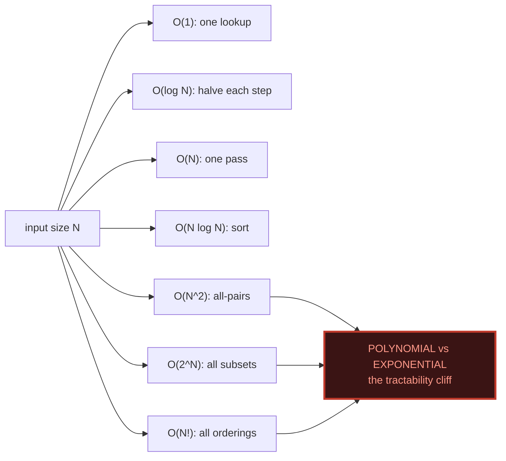
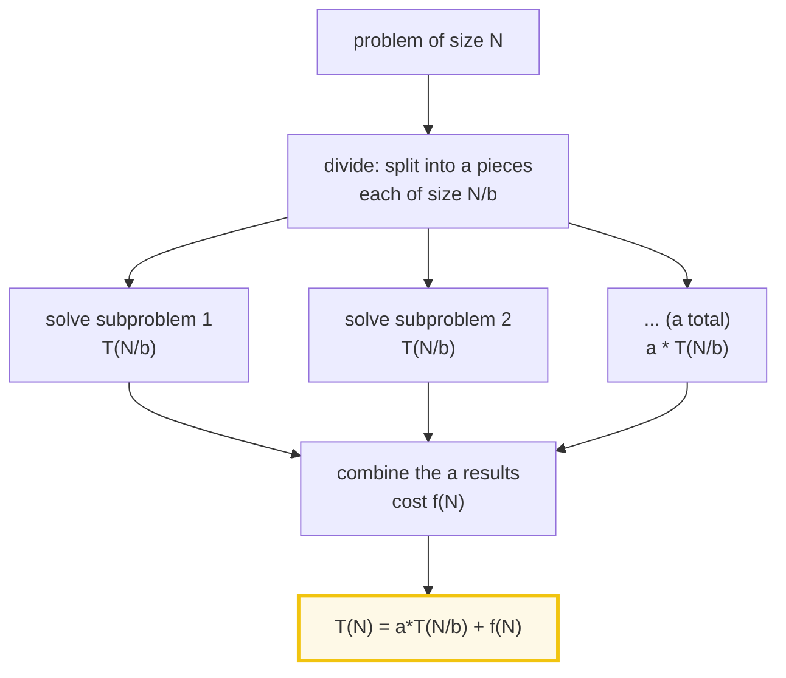
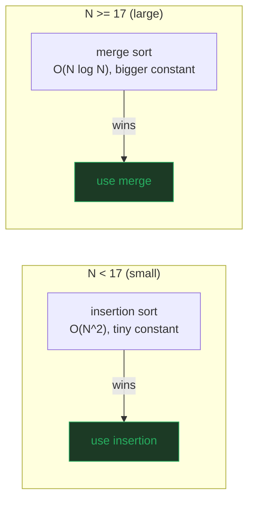

# Big-O Comparison — A Visual, Worked-Example Guide

> **Companion code:** [`big_o_comparison.py`](./big_o_comparison.py). **Every
> number in this guide is printed by `python3 big_o_comparison.py`** — nothing
> is hand-computed.
>
> **Live animation:** [`big_o_comparison.html`](./big_o_comparison.html) — open
> in a browser: log-scale growth chart, hover for exact values, and a live
> Master Theorem calculator.

---

## 0. TL;DR — the one idea

> **The shopping-list analogy (read this first):** Big-O is **not** about speed.
> It is about **how badly work blows up as the list grows**. If your list has
> `N` items:
> - **O(1)** — glance at the *first* item. List size is irrelevant.
> - **O(log N)** — find an item in a *sorted* list by halving it (binary search).
> - **O(N)** — scan the whole list once.
> - **O(N log N)** — *sort* the list (merge sort): N halving-passes.
> - **O(N²)** — compare *every* item to *every* other. Nested double loop.
> - **O(2^N)** — try *every subset* of the list. Doubles each item added.
> - **O(N!)** — try *every ordering* of the list (traveling salesman).

Hardware improves ~linearly, but **complexity classes scale differently**. An
O(N²) sort that runs in 1 second on 1,000 items takes **~28 hours on 100,000
items**; an O(N log N) sort does the same 100,000 items in **~0.02 seconds**.
Buying a faster computer never rescues a bad complexity class — only a better
algorithm does. **Big-O tells you which algorithm survives scale, and which one
collapses.**



One plain sentence per side of the cliff: **anything polynomial (a fixed power
of N) is eventually fine; anything exponential or factorial is eventually
impossible** — no matter the hardware.

---

### Glossary (plain English — refer back any time)

| Term | Plain meaning |
|---|---|
| **`N`** | The size of the input (items in the list). |
| **operation** | One unit of work (a comparison, a write). |
| **Big-O** | An *upper* bound on growth, ignoring constants and lower-order terms. "O(N²)" = "at most ~N² work, for large N". |
| **asymptotic** | "As N → ∞". Big-O only cares about large N. |
| **`log2(N)`** | How many times you can halve N before hitting 1. The binary-search/merge-sort workhorse. |
| **crossover** | The input size where one algorithm overtakes another, due to *constant factors* (see [§4](#4-the-practical-crossover--on%C2%B2-can-beat-on-log-n)). |
| **recurrence** | `T(N) = a·T(N/b) + f(N)` — how divide-and-conquer work is written. |
| **Master theorem** | A recipe to turn a recurrence into a closed-form Big-O. |
| **space complexity** | How much *extra* memory an algorithm needs beyond its input. |

---

## 1. The seven complexity classes — operations vs `N`

Every complexity class is **one line** in `growth()` in the `.py`. This table is
its direct output. The right two columns explode so fast that for large `N` we
show the value in scientific notation **with its exact digit count**.

> From `big_o_comparison.py` Section A — the growth table:

```
|       N |               O(1) |           O(log N) |               O(N) |         O(N log N) |             O(N^2) |             O(2^N) |              O(N!) |
|       1 |                  1 |               0.00 |                  1 |               0.00 |                  1 |                  2 |                  1 |
|      10 |                  1 |               3.32 |                 10 |              33.22 |                100 |              1,024 |          3,628,800 |
|     100 |                  1 |               6.64 |                100 |             664.39 |             10,000 | 1.267e30 (31 digits) | 9.332e157 (158 digits) |
|    1000 |                  1 |               9.97 |              1,000 |              9,966 |          1,000,000 | 1.071e301 (302 digits) | 4.023e2567 (2568 digits) |
|   10000 |                  1 |              13.29 |             10,000 |            132,877 |        100,000,000 | 1.995e3010 (3011 digits) | 2.846e35659 (35660 digits) |
|  100000 |                  1 |              16.61 |            100,000 |          1,660,964 | 1.000e10 (11 digits) | 9.990e30102 (30103 digits) | 2.824e456573 (456574 digits) |
```

> Read the bottom-right corner, `N=100000`: **O(2^N) = a number with 30,103
> digits; O(N!) = a number with 456,574 digits.** These are not "slow" — they
> are *impossible to compute at scale*, on any hardware. That is why
> "exponential" and "factorial" mark the border between *tractable* and
> *intractable* problems. 🔗 See [§2](#2-time-to-run-at-n1000--the-cliff-in-human-time)
> for what that means in wall-clock terms.

The shape of each curve on a **log scale** (what `big_o_comparison.html` plots):
`O(2^N)` becomes a **straight line** sloping up steeply; `O(N!)` becomes
**steeper still** (super-exponential); the polynomial ones flatten out near the
bottom. The log scale is the *only* way to see all seven on one chart.

---

## 2. Time-to-run at N=1000 — the cliff in human time

Fix `N = 1000` and pretend the machine does exactly **1 operation per
nanosecond** (a 1 GHz core, ~1 useful op/cycle). How long does each class take?

> From `big_o_comparison.py` Section B — wall-clock at N=1000, 1 op = 1 ns:

```
| complexity   |             operations | wall-clock (1 op = 1 ns)
| O(1)         |                      1 | 1.0 ns
| O(log N)     |                   9.97 | 10.0 ns
| O(N)         |                  1,000 | 1.00 us
| O(N log N)   |                  9,966 | 9.97 us
| O(N^2)       |              1,000,000 | 1.00 ms
| O(2^N)       | 1.071e301 (302 digits) | 10^301 ns  =  2.5e274 x age of universe
| O(N!)        | 4.023e2567 (2568 digits) | 10^2568 ns  =  9.2e2540 x age of universe
```

**The polynomial vs exponential gap is the most important cliff in all of
computer science.** At `N=1000`, every *polynomial* class finishes in under a
millisecond; the two *exponential* classes outlast the universe by hundreds of
orders of magnitude. O(N!) at N=1000 is a number whose **digit count (2568)
exceeds the number of atoms in the observable universe (≈10⁸⁰)**.

> 🔗 **Practical consequence:** if your algorithm is O(2^N) or O(N!), `N`
> realistically cannot exceed ~25–30 before it becomes hopeless. For N=1000 you
> *must* find a polynomial algorithm, or prove none exists (NP-completeness).

---

## 3. The Master Theorem — turning a recurrence into Big-O

Every **divide-and-conquer** algorithm has the *same* shape of recurrence:



> **`a`** = number of subproblems · **`b`** = shrink factor (each is 1/b the
> size) · **`f(N)`** = cost to *divide + combine* (outside the recursion).

Let **`p = log_b(a) = log(a)/log(b)`** — the *critical exponent*. Compare
`f(N)` against `N^p`:

> From `big_o_comparison.py` Section C — the three cases:

```
| case | condition on f(N)        | result T(N)        | who wins?        |
|  1   | f(N) = O(N^(p - eps))     | Theta(N^p)         | the LEAVES       |
|  2   | f(N) = Theta(N^p)         | Theta(N^p * log N) | BALANCED         |
|  3   | f(N) = Omega(N^(p + eps)) | Theta(f(N))        | the COMBINE step |
```

**Worked examples** (taking `f(N) = Θ(N^c)` for a clean power `c`):

> From `big_o_comparison.py` Section C — classic algorithms classified:

```
| algorithm        | a | b | f(N)=N^c | p=log_b(a) | case | T(N)               |
| binary search    | 1 | 2 | N^0       | 0.000      | Case 2 | Theta(log N)       |
| merge sort       | 2 | 2 | N^1       | 1.000      | Case 2 | Theta(N^1 log N)   |
| Karatsuba mult   | 3 | 2 | N^1       | 1.585      | Case 1 | Theta(N^1.585)     |
| Strassen matmul  | 7 | 2 | N^2       | 2.807      | Case 1 | Theta(N^2.8074)    |
| bad merge (N^2)  | 2 | 2 | N^2       | 1.000      | Case 3 | Theta(N^2)         |
```

How to read it:
- **Merge sort (a=2, b=2):** splits into 2 halves, does O(N) to merge.
  `p = log₂(2) = 1`, `f(N) = N = N¹` → **Case 2** (balanced) → **Θ(N log N)**.
- **Binary search (a=1, b=2):** keeps only **one** half (no branching), divide/
  combine is O(1). `p = log₂(1) = 0`, `f(N) = 1 = N⁰` → **Case 2** →
  `Θ(N⁰·log N) = Θ(log N)`.
- **Strassen (a=7, b=2):** 7 sub-multiplications of half size.
  `p = log₂(7) = 2.807`. `f(N) = N² < N^2.807` → **Case 1** (leaves dominate)
  → **N^2.807**. That `0.807` *under* the naive `N³` is Strassen's entire
  speedup. 🔗 The `.html` has a live calculator: dial `a`, `b`, `c` and watch
  the case + result update.

---

## 4. The practical crossover — O(N²) can beat O(N log N)

Big-O hides **constant factors**. Insertion sort is O(N²), but its inner loop is
tiny (one compare + one shift, cache-friendly, no calls). Merge sort is
O(N log N), but pays for recursion, temp-array allocation, and copies every
merge — so per-element it costs *more*.

> From `big_o_comparison.py` Section D — exact comparison counts (worst case =
> reverse-sorted input), merge weighted by a `4×` constant factor:

```
Cost model: t_ins(N)   = 1 * insertion_comps(N)
            t_merge(N) = 4 * merge_comps(N)

|   N |  insertion comps |    merge comps |        t_ins |      t_merge | winner
|  10 |               45 |             15 |           45 |           60 | insertion
|  14 |               91 |             25 |           91 |          100 | insertion
|  16 |              120 |             32 |          120 |          128 | insertion
|  17 |              136 |             33 |          136 |          132 | MERGE
|  20 |              190 |             40 |          190 |          160 | MERGE
|  50 |            1,225 |            133 |        1,225 |          532 | MERGE
|  60 |            1,770 |            172 |        1,770 |          688 | MERGE
```

> **CROSSOVER POINT: `N = 17`.** Below 17, the *O(N²)* insertion sort is faster
> than the *O(N log N)* merge sort, because its constant factor is ~4× smaller.
> At N=16 insertion wins (120 vs 128); at N=17 merge takes over (132 vs 136) and
> the gap only widens from there. This is exactly why real sort libraries —
> Python's **Timsort**, C++'s **introsort** — switch to insertion sort for small
> subarrays.



> 🔗 **Takeaway:** Big-O is an *asymptotic* statement. For small `N` the constant
> factor wins. Always measure; only trust the complexity class once `N` is
> comfortably past the crossover. See [§6](#6-which-algorithm-to-pick-at-which-scale).

---

## 5. Space complexity — time is only half the story

Space complexity is how much **extra** memory an algorithm needs beyond its
input. You can usually **trade space for time**.

> From `big_o_comparison.py` Section E — common algorithms:

```
| algorithm      | time (avg/worst) | space (auxiliary) | why?                      |
| O(1) access    | O(1)             | O(1)              | one index lookup          |
| binary search  | O(log N)         | O(1)              | iterative: no extra store |
| insertion sort | O(N^2)           | O(1)              | sorts IN PLACE            |
| heap sort      | O(N log N)       | O(1)              | sorts in place            |
| merge sort     | O(N log N)       | O(N)              | needs a temp buffer/move  |
| quicksort      | O(N log N)*      | O(log N)          | recursion stack (*N^2 wst)|
```

Two flavors of "space":
- **O(1) auxiliary (in-place):** insertion / heap sort. No array grows with `N`.
  Best when memory is tight (embedded, huge datasets). 🔗 Insertion sort's O(1)
  space is the other reason it wins small subarrays in [§4](#4-the-practical-crossover--on%C2%B2-can-beat-on-log-n).
- **O(N) auxiliary (out-of-place):** merge sort allocates a buffer as big as the
  input on every merge. Simpler to reason about, but **2× RAM**.
- **O(log N):** quicksort's recursion depth (balanced case).

> **Rule of thumb:** an O(N) auxiliary buffer (merge sort, hash tables) *buys* a
> better time complexity. The best algorithms (e.g. heapsort) give **O(1) space
> AND O(N log N) time**.

---

## 6. Which algorithm to pick at which scale

Tie it all together — a decision guide indexed by `N`:

| `N` range | What is tractable | What to use | Why |
|---|---|---|---|
| **N ≤ ~20** | *everything* (even O(2^N), O(N!)) | insertion sort; brute-force search | constants dominate; see [§4](#4-the-practical-crossover--on%C2%B2-can-beat-on-log-n) |
| **N ~ 10²–10⁴** | any polynomial | O(N log N) sort; O(N) scan | milliseconds; [§2](#2-time-to-run-at-n1000--the-cliff-in-human-time) |
| **N ~ 10⁵–10⁶** | O(N) / O(N log N) | hash tables, merge sort, FFT | sub-second |
| **N ~ 10⁷–10⁹** | O(N) only, ideally O(N) space | streaming, bit-parallel | RAM/bandwidth bound |
| **N ≥ ~30 with O(2^N)/O(N!)** | **nothing tractable** | find a polynomial reformulation | the cliff in [§2](#2-time-to-run-at-n1000--the-cliff-in-human-time) |

> The single question that picks an algorithm: **"how does N grow, and how big
> can it get?"** If `N` is bounded and tiny, use the simplest thing (constants
> win). If `N` is unbounded, you need the best complexity class you can find —
> and the Master Theorem ([§3](#3-the-master-theorem--turning-a-recurrence-into-big-o))
> tells you what a divide-and-conquer design will cost.

---

### Reproducibility

Every table above is printed verbatim by `python3 big_o_comparison.py` and
re-checked at the end of that run:

> From `big_o_comparison.py` Section E — the gold check:

```
GOLD CHECK: OK - all growth values and master cases reproduce
```

`big_o_comparison.html` re-runs `growth()` and `master_theorem()` **in
JavaScript** with the identical formulas, and re-checks the same pinned values —
the green `check: OK` badge confirms the page matches the `.py` exactly.
