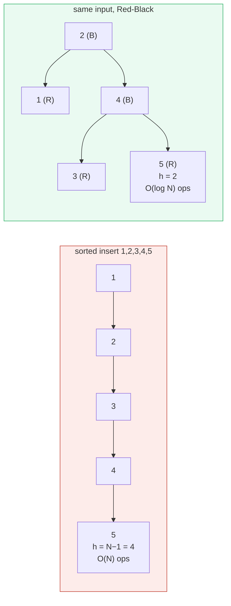
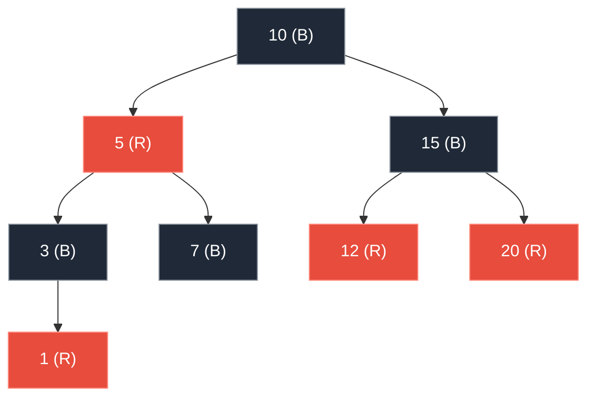
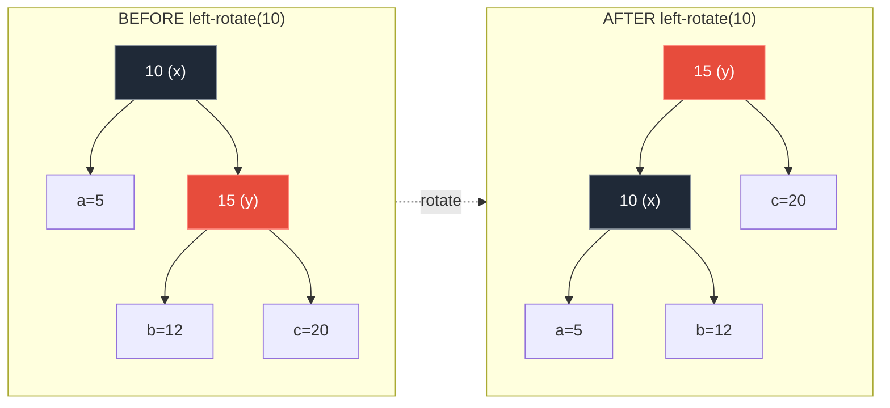
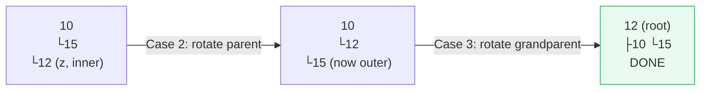
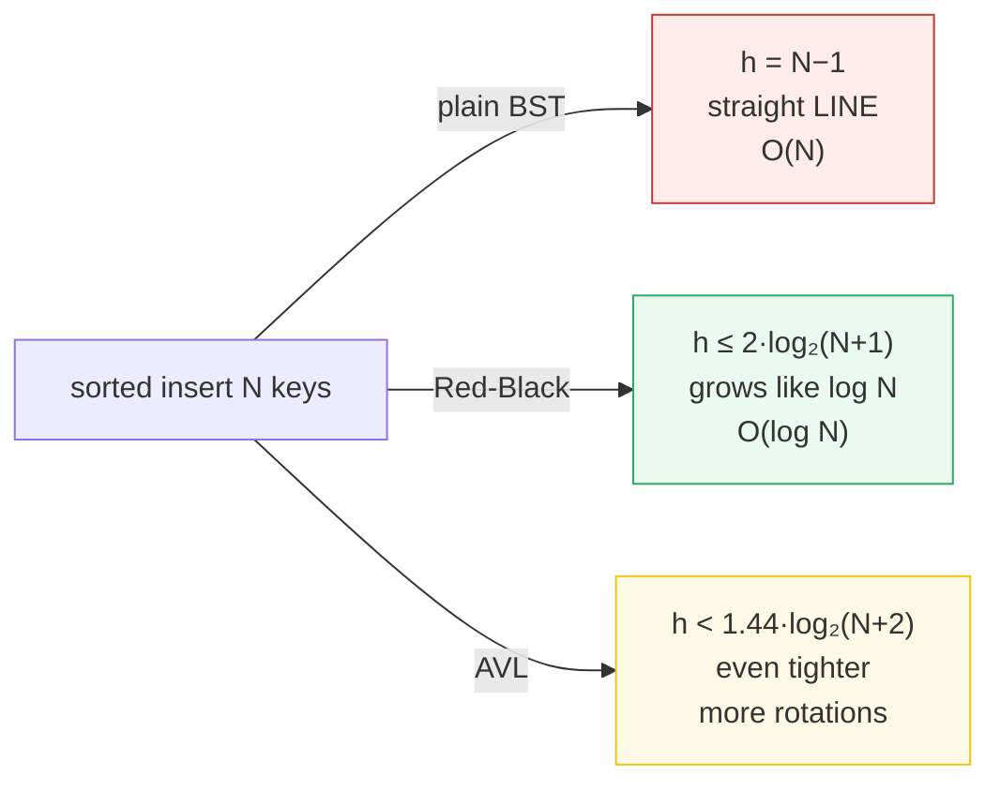

# BST → Red-Black Tree — A Visual, Invariant-Driven, Worked-Example Guide

> **Companion code:** [`bst_redblack.py`](./bst_redblack.py). **Every number and
> tree in this guide is printed by `python3 bst_redblack.py`** — nothing is
> hand-computed.
>
> **Live animation:** [`bst_redblack.html`](./bst_redblack.html) — open in a
> browser. It re-runs the *identical* CLRS insert/fixup in JS on the same input
> sequences and gold-checks its heights against the `.py`.

---

## 0. TL;DR — the library bookshelves, and the leaning tower

> **The analogy (read this first):** A **BST** is a row of **library bookshelves**
> ordered by call number: left shelves hold smaller numbers, right shelves bigger.
> To find a book you walk left/right at each shelf — `O(h)` comparisons, where `h`
> is the tree's height. Random inserts keep `h ≈ log N`. But hand the librarian
> books already **sorted** and she files each one to the right of the last: the
> shelves collapse into a single **leaning tower** (`1→2→3→4→5`), `h = N−1`, and
> every lookup walks the whole chain.
>
> A **Red-Black tree** (Guibas & Sedgewick 1978; CLRS Ch. 13) is a BST that heals
> its own shape. Each node wears a color; after every insert, cheap **color flips**
> and **rotations** restore four invariants that force the longest path to be ≤
> twice the shortest — pinning **`h ≤ 2·log₂(N+1)`** *no matter the insert order*.

Big-O calls BST insert `O(h)`. That is `O(log N)` on lucky input and **`O(N)` on
sorted input** — and sorted input is exactly what real data often is. The RB tree
removes the luck: `h` is bounded by `2·log₂(N+1)` unconditionally, so insert /
search / delete are **always `O(log N)`**.



> One plain sentence each: **BST** = shape is whatever the insert order made;
> sorted input ⇒ a linked list, `O(N)`. **Red-Black** = rotations + flips keep
> `h ≤ 2·log₂(N+1)` for any input, `O(log N)`.

---

### Glossary (plain English — refer back any time)

| Term | Plain meaning |
|---|---|
| **key** | The value stored at a node; it orders the tree (`left < node < right`). |
| **BST property** | For every node: all left-subtree keys `< node key <` all right-subtree keys. |
| **height `h`** | EDGES on the longest root-to-leaf path (CLRS). Single node `h=0`, empty `h=−1`. Operations cost `O(h)`. |
| **NIL / leaf** | A shared black sentinel "null" node. Every real leaf points at NIL. |
| **color** | RED or BLACK, painted on each node. The four RB invariants use it. |
| **black-height `bh`** | Black nodes on any root→NIL path. **Must be identical on every path** — the invariant that bounds height. |
| **rotation** | A local `O(1)` pointer rewiring (left or right) that moves a child up and a parent down, preserving BST order. |
| **color flip** | Repainting two children black and the parent red (or vice versa). |
| **fixup** | The post-insert dance (CLRS 13.3) of flips + rotations that restores the invariants. |

---

## 1. The plain BST: balanced input, then the leaning tower (CLRS 12.3)

Insert `[10, 5, 15, 3, 7, 12, 20, 1]` — roughly balanced — and the tree stays shallow.
Then insert the same *kind* of data already **sorted**, `[1, 2, 3, 4, 5]`, and every
key files to the right, collapsing the tree into a chain.

> From `bst_redblack.py` **Section A**:
>
> ```
> Insert [10, 5, 15, 3, 7, 12, 20, 1] into a plain BST. Arrives roughly balanced ->
>     │   ┌── 20
>     ┌── 15
>     │   └── 12
> ● 10
>         ┌── 7
>     └── 5
>         └── 3
>             └── 1
> height h = 3 (edges). Operations cost O(h) = O(3).
> Random-ish order -> the BST stays shallow. Good.
>
> Now insert the SAME KIND of data but already SORTED: [1, 2, 3, 4, 5].
> Every key files to the RIGHT of the last -> a single chain:
>     │   │   │   ┌── 5
>     │   │   ┌── 4
>     │   ┌── 3
>     ┌── 2
> ● 1
> height h = 4 = N-1 = 5-1. The 'tree' is a linked list.
> A lookup now walks the whole chain: O(h) collapsed to O(N).
> THIS is the BST's fatal flaw: shape depends on insert order, and the
> worst order (sorted) is the order real data often arrives in.
> ```

The contrast is the whole motivation for self-balancing trees:

| input order | shape | height `h` | operation cost |
|---|---|---|---|
| random / balanced `[10,5,15,3,7,…]` | bushy | `3` | `O(log N)` |
| **sorted** `[1,2,3,4,5]` | **a chain (leaning tower)** | **`4 = N−1`** | **`O(N)`** |

> `[check] sorted-insert height == N-1 == 4: OK`
> `[check] balanced-seq height == 3: OK`

> 🔗 **Why this matters in practice:** timestamps, auto-increment IDs, and any
> already-sorted stream produce exactly the worst case. A plain BST index would
> silently degrade to linear. That is why every production ordered map is *balanced*.

---

## 2. The Red-Black tree heals the same inputs (CLRS 13)

### The four invariants (the guarantee rests on these)

1. Every node is **RED** or **BLACK**.
2. The **root is BLACK**.
3. A **RED** node has only **BLACK** children (no two reds in a row).
4. **Every root→NIL path has the same number of black nodes** (the black-height). ← gold-checked

**Why those four pin the height (the key insight):** invariant 4 says every path has
`bh` black nodes. Invariant 3 says reds can't be consecutive, so along any path
blacks and reds alternate *at best* one-for-one. A path of `bh` black nodes is
therefore at most `2·bh` nodes long. The shortest path (all black) is `bh` nodes;
the longest is `≤ 2·bh`. With `N` internal nodes the shortest path satisfies
`bh ≤ log₂(N+1)`, giving **`h ≤ 2·log₂(N+1)`** (CLRS Lemma 13.1 + Theorem 13.1).

Insert the balanced sequence `[10, 5, 15, 3, 7, 12, 20, 1]` into an RB tree, tracing
every fixup:

> From `bst_redblack.py` **Section B**:
>
> ```
> insert  10: no fixup (parent was BLACK)  ->  invariants hold
> insert   5: no fixup (parent was BLACK)  ->  invariants hold
> insert  15: no fixup (parent was BLACK)  ->  invariants hold
> insert   3: [case1] recolor  ->  parent 5 & uncle 15 -> BLACK, grandparent 10 -> RED
> insert   7: no fixup (parent was BLACK)  ->  invariants hold
> insert  12: no fixup (parent was BLACK)  ->  invariants hold
> insert  20: no fixup (parent was BLACK)  ->  invariants hold
> insert   1: [case1] recolor  ->  parent 3 & uncle 7 -> BLACK, grandparent 5 -> RED
>
> Final Red-Black tree (R = red, B = black):
>     │   ┌── 20 (R)
>     ┌── 15 (B)
>     │   └── 12 (R)
> ● 10 (B)
>         ┌── 7 (B)
>     └── 5 (R)
>         └── 3 (B)
>             └── 1 (R)
>
> height h = 3  (bound 2*log2(N+1) = 2*log2(8) = 6.34)
> black-height bh = 3 (consistent across all paths: True)
> ```
> `[check] h <= 2*log2(N+1): 3 <= 6.34: OK`
> `[check] all RB invariants hold (root black, no red-red, bh consistent): OK`



### Now the same sorted input that crippled the plain BST

Insert `[1, 2, 3, 4, 5, 6, 7, 8]` (sorted) — the exact shape-killer:

> From `bst_redblack.py` **Section B** (sorted input, fixup trace):
>
> ```
>   insert 1: no fixup (parent BLACK)
>   insert 2: no fixup (parent BLACK)
>   insert 3: [case3] recolor+left-rotate(grandparent)  ->  parent 2 -> BLACK, grandparent 1 -> RED, left-rotate 1
>   insert 4: [case1] recolor  ->  parent 3 & uncle 1 -> BLACK, grandparent 2 -> RED
>   insert 5: [case3] recolor+left-rotate(grandparent)  ->  parent 4 -> BLACK, grandparent 3 -> RED, left-rotate 3
>   insert 6: [case1] recolor  ->  parent 5 & uncle 3 -> BLACK, grandparent 4 -> RED
>   insert 7: [case3] recolor+left-rotate(grandparent)  ->  parent 6 -> BLACK, grandparent 5 -> RED, left-rotate 5
>   insert 8: [case1] recolor  ->  parent 7 & uncle 5 -> BLACK, grandparent 6 -> RED
>   insert 8: [case3] recolor+left-rotate(grandparent)  ->  parent 4 -> BLACK, grandparent 2 -> RED, left-rotate 2
>
> Final RB tree from SORTED input (compare with the BST chain above):
>     │   │   ┌── 8 (R)
>     │   ┌── 7 (B)
>     ┌── 6 (R)
>     │   └── 5 (B)
> ● 4 (B)
>         ┌── 3 (B)
>     └── 2 (R)
>         └── 1 (B)
>
> N = 8, height h = 3, bound = 2*log2(8+1) = 6.34
> black-height bh = 3 (consistent: True)
> ```
> `[check] RB h (3) < BST chain h (7): OK`

The sorted input that built a **height-7 chain** in the plain BST gives a
**height-3** RB tree. Rotations and color flips absorbed every lean.

> 🔗 The `insert 8` trace shows Case 1 *then* Case 3 firing in one fixup — red
> bubbled up from the Case-1 recolor, then a rotation at the grandparent settled
> it. Case 1 can repeat up the tree; Cases 2–3 terminate the fixup with a rotation.

---

## 3. Rotations: the O(1) local rewiring (CLRS 13.2)

A rotation moves a child **up** and a parent **down** while preserving the BST
inorder order. Both flavors are exact mirrors. Left-rotate pulls `x`'s right child
`y` up; right-rotate pulls `x`'s left child `y` up.

> From `bst_redblack.py` **Section C**:
>
> ```
> BEFORE left_rotate(x=10):   subtrees a=5, b=12, c=20
>     │   ┌── 20 (B)
>     ┌── 15 (R)
>     │   └── 12 (B)
> ● 10 (B)
>     └── 5 (B)
>
> AFTER  left_rotate(x=10):  y=15 pulled up over x; x becomes 15's left;
> subtree b=12 moved from 15's left to 10's right. BST order preserved:
>     ┌── 20 (B)
> ● 15 (R)
>         ┌── 12 (B)
>     └── 10 (B)
>         └── 5 (B)
>   x.right = y.left(b);  y takes x's old parent slot;  y.left = x.
> ```
> ```
> BEFORE right_rotate(x=20):  subtrees a=12, b=17, c=25
>     ┌── 25 (B)
> ● 20 (B)
>         ┌── 17 (B)
>     └── 15 (R)
>         └── 12 (B)
>
> AFTER  right_rotate(x=20): y=15 pulled up over x; x becomes 15's right;
> subtree b=17 moved from 15's right to 20's left. BST order preserved:
>     │   ┌── 25 (B)
>     ┌── 20 (B)
>     │   └── 17 (B)
> ● 15 (R)
>     └── 12 (B)
>   x.left = y.right(b);  y takes x's old parent slot;  y.right = x.
> ```



The crucial property: **inorder keys are unchanged** (`[5,10,12,15,20]` before and
after). A rotation only bends geometry; it never breaks the ordering.

> From `bst_redblack.py` **Section C** (order preserved):
>
> ```
> inorder keys after left_rotate : [5, 10, 12, 15, 20]  (sorted -> BST ok)
> inorder keys after right_rotate: [12, 15, 17, 20, 25]  (sorted -> BST ok)
> ```
> `[check] rotations preserve BST inorder order: OK`

Each rotation is ~6 pointer assignments ⇒ `O(1)`. That cheapness is what makes it
the right tool for the per-insert fixup.

---

## 4. The three insert-fixup cases (CLRS 13.3)

After inserting a **RED** node, only its **RED parent** can violate invariant 3
(two reds in a row). Fixup looks at the **uncle** (the parent's sibling) to choose:

> From `bst_redblack.py` **Section D**:
>
> ```
>   Case 1  uncle RED            -> recolor parent+uncle BLACK,
>                                    grandparent RED; bubble problem up.
>   Case 2  uncle BLACK, INNER   -> rotate parent once -> becomes Case 3.
>   Case 3  uncle BLACK, OUTER   -> recolor + rotate grandparent. DONE.
> ```

**Case 1 — uncle RED → recolor** (`[10, 5, 15, 3]`): the new node's parent and
uncle are both red, so push red *up* a level:

> From `bst_redblack.py` **Section D** (Case 1):
>
> ```
> sequence: [10, 5, 15, 3]
>   insert 10: no fixup (parent BLACK)
>   insert 5: no fixup (parent BLACK)
>   insert 15: no fixup (parent BLACK)
>   insert 3: [case1] recolor  ->  parent 5 & uncle 15 -> BLACK, grandparent 10 -> RED
>   result:
>         ┌── 15 (B)
>     ● 10 (B)
>         └── 5 (B)
>             └── 3 (R)
> ```

**Case 3 — uncle BLACK, OUTER child → single rotate** (`[10, 15, 20]`): the new
node is a same-side grandchild; one rotation rebalances:

> From `bst_redblack.py` **Section D** (Case 3):
>
> ```
> sequence: [10, 15, 20]
>   insert 20: [case3] recolor+left-rotate(grandparent)  ->  parent 15 -> BLACK, grandparent 10 -> RED, left-rotate 10
>   result:
>         ┌── 20 (R)
>     ● 15 (B)
>         └── 10 (R)
> ```

**Case 2 — uncle BLACK, INNER child → double rotate** (`[10, 15, 12]`): the new
node is an opposite-side grandchild; rotate the parent first to reach the Case-3
shape, then rotate the grandparent:

> From `bst_redblack.py` **Section D** (Case 2 → Case 3):
>
> ```
> sequence: [10, 15, 12]
>   insert 12: [case2] right-rotate(parent)  ->  z=12 is left child of 15
>   insert 12: [case3] recolor+left-rotate(grandparent)  ->  parent 12 -> BLACK, grandparent 10 -> RED, left-rotate 10
>   result:
>         ┌── 15 (R)
>     ● 12 (B)
>         └── 10 (R)
> ```



> **Key fact:** Case 1 can repeat up the tree (it bubbles red up); Case 2 *never*
> stands alone — it always converts into Case 3; Case 3 ends the fixup. So every
> insert does **at most one rotation** (in Cases 2+3) plus `O(log N)` recolors
> (from Case 1).

---

## 5. Height comparison: BST vs RB vs AVL (the bound, gold-checked)

Feed each tree the **worst input (sorted)** and measure height vs `N`:

> From `bst_redblack.py` **Section E**:
>
> | N | BST h (=N−1) | RB h | RB bound 2·log₂(N+1) | AVL bound |
> |---|---|---|---|---|
> | 1 | 0 | 0 | 2.00 | 1.96 |
> | 2 | 1 | 1 | 3.17 | 2.55 |
> | 3 | 2 | 1 | 4.00 | 3.02 |
> | 4 | 3 | 2 | 4.64 | 3.40 |
> | 5 | 4 | 2 | 5.17 | 3.72 |
> | 8 | 7 | 3 | 6.34 | 4.46 |
> | 16 | 15 | 5 | 8.17 | 5.68 |
> | 32 | 31 | 7 | 10.09 | 7.00 |
> | 64 | 63 | 9 | 12.04 | 8.38 |



**Reading the table:** the BST column is a straight **line** (`h = N−1`, `O(N)`).
The RB column grows like **log N** and *always* stays under `2·log₂(N+1)`. AVL is
even tighter (`< 1.44·log₂(N+2)`) but pays with more rotations.

> From `bst_redblack.py` **Section E** (engineer's takeaway):
>
> ```
> WHY RB AND NOT AVL? Both are O(log N). AVL keeps height tighter so
> LOOKUPS are slightly faster; RB does fewer rotations so INSERTS and
> DELETES are cheaper and the rebalance is simpler. The tradeoff favors
> RB for write-heavy / general use -> that is why C++ std::map, Java
> TreeMap, Linux scheduler (CFS), and epoll all use Red-Black trees.
> ```

---

## 6. Gold check — black-height consistency (how the bundle stays honest)

Every number above is reproducible from one command:

```bash
python3 bst_redblack.py                      # prints all sections + gold checks
python3 bst_redblack.py > bst_redblack_output.txt   # capture
```

The contract is the **black-height consistency** invariant (number 4) on the
worst-case sorted input, plus the height bound. The companion
[`bst_redblack.html`](./bst_redblack.html) re-runs the *same* CLRS insert/fixup in
JavaScript on the same sequences and shows a green `[check: OK]` badge when its
heights and black-heights match. Change the algorithm in either file and the badge
turns red.

> From `bst_redblack.py` **GOLD CHECK**:
>
> ```
> Sorted insert N=32: every root->NIL path's black-node count = 5.
> distinct path counts = [5] (CONSISTENT)
>
> GOLD values (pinned for bst_redblack.html):
>   N=8  sorted: BST h=7, RB h=3, bh=3, bound=6.34
>   N=32 sorted: BST h=31, RB h=7, bh=5, bound=10.09
>   N=64 sorted: BST h=63, RB h=9, bh=6, bound=12.04
> ```
> `[check] RB black-height consistent across all paths (N=32): OK`
> `[check] RB h (7) <= 2log2(32+1) (10.09): OK`
> `[check] BST sorted h (31) == N-1: OK`

| quantity | value | source |
|---|---|---|
| BST height, sorted `[1..5]` | **4 = N−1** | Section A |
| RB height, balanced `[10,5,15,3,7,12,20,1]` | **3** | Section B |
| RB height, sorted `[1..8]` | **3** (vs BST chain **7**) | Section B |
| RB height, sorted N=32 | **7** (≤ 10.09) | Section E |
| RB black-height, sorted N=32 | **5** (consistent across all paths) | GOLD |
| RB height bound | **`h ≤ 2·log₂(N+1)`** (CLRS Thm 13.1) | asserted every N |
| AVL height bound | **`h < 1.44·log₂(N+2) − 0.328`** | Section E |
| rotations per insert | **≤ 1** (Cases 2+3) + O(log N) recolors (Case 1) | Section D |

---

## Further reading

- **CLRS** *Introduction to Algorithms*, 3rd ed. — Ch. 12 (BSTs), Ch. 13
  (Red-Black Trees). The authoritative source for the insert/fixup pseudocode,
  rotations (13.2), and the `h ≤ 2·log₂(N+1)` proof (Lemma 13.1, Theorem 13.1).
- **Guibas & Sedgewick, "A Dichromatic Framework for Balanced Trees"** (1978) —
  the original Red-Black tree paper that CLRS Ch. 13 formalizes.
- **Sedgewick & Wayne** *Algorithms*, 4th ed. — §3.3 (Balanced Search Trees),
  with the red-links / 2-3 tree intuition that makes the invariants click visually.
- **Adelson-Velsky & Landis (1962)** — AVL trees, the tighter bound
  (`h < 1.4405·log₂(N+2) − 0.3277`) used for the comparison in §5.
- **Ben Pfaff, "Introduction to the GNU libavl"** — a thorough, implementation
  -focused walkthrough of BST / AVL / RB / split-join, useful for the delete cases
  (not covered here; delete fixup adds a mirror set of four cases, CLRS 13.4).
