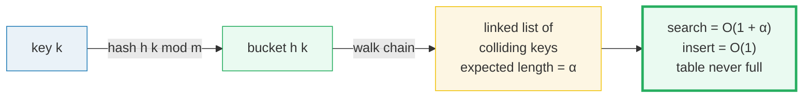
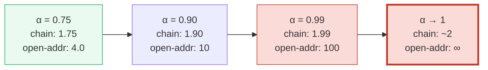

# Separate Chaining Hash Tables — A Visual, Worked-Example Guide

> **Companion code:** [`chaining.py`](./chaining.py). **Every number in this
> guide is printed by `python3 chaining.py`** — change the code, re-run,
> re-paste. Nothing here is hand-computed.
>
> **Live animation:** [`chaining.html`](./chaining.html) — open in a browser.
> Four panels step through building the chains, searching, the resize/rehash,
> and the chaining-vs-open-addressing comparison, all gold-checked against the
> `.py`.
>
> **Source material:** CLRS ch.11 *Hash Tables* (§11.2 chaining, §11.3 hash
> functions, §11.4 open addressing); Sedgewick & Wayne §3.4. Also 🔗
> [`AMORTIZED_RESIZE.md`](./AMORTIZED_RESIZE.md) for the doubling/rehash
> cost argument, [`BIG_O_COMPARISON.md`](./BIG_O_COMPARISON.md) for Big-O, and
> [`ARRAY_VS_LINKEDLIST.md`](./ARRAY_VS_LINKEDLIST.md) for the linked-list
> pointer-chasing trade-off.

---

## 0. TL;DR — a bucket is a list, so the table never fills up

In **separate chaining**, each of the `m` buckets holds a **linked list** (a
*chain*) of all keys that hashed there. A **collision** just prepends a node to
the chain. The table can hold any number of keys — a bucket never "fills up," it
just grows a longer list. Performance is governed by one knob, the **load factor
`α = n/m`**: search is **O(1 + α)**, because you hash to a bucket (`O(1)`) then
walk a chain whose expected length is `α`.

| Scheme | At collision | Search cost | Hard full point? | Used by |
|---|---|---|---|---|
| **Separate chaining** | prepend to bucket's list | O(1 + α) | **No** (lists grow) | Java `HashMap`, C++ `unordered_map` |
| **Open addressing** | probe next slot | ≤ 1/(1−α) → **∞** as α→1 | **Yes** (α = 1) | Python `dict`, Robin Hood, Cuckoo |

> **The one-line proof:** under simple uniform hashing each bucket's chain
> length is `Binomial(n, 1/m)` with **mean α** and **variance α(1−1/m)**. So the
> expected work to scan one chain is α, plus the O(1) hash ⇒ **Θ(1 + α)**
> (CLRS Thm 11.2). A modest α (≈0.75) keeps it a small constant.

### Glossary

| Term | Plain meaning |
|---|---|
| **m** | number of buckets (table size) |
| **n** | number of stored keys |
| **α (alpha)** | load factor = n/m — the dial of fullness |
| **h(k)** | hash of key k, in [0, m); here the **division method** `k mod m` (CLRS 11.3.1) |
| **bucket** | slot 0..m−1, holding the HEAD of a linked list (or empty) |
| **chain** | the linked list in a bucket; length = # colliding keys |
| **node** | one entry `{key, next}`; heap-allocated → a pointer to chase |
| **prepend** | insert a node at the head of its chain → O(1) |
| **rehash** | grow m (usually double), recompute h(k) for every key, rebuild chains |
| **balls-into-bins** | the probability model: n keys thrown uniformly into m buckets |

---

## A. Build the table — 8 buckets, 12 keys (α = 1.5)

Hash function: `h(k) = k mod m` (division method, CLRS 11.3.1). Insert the 12
keys into `m = 8` buckets **with no resize**, so `α = 12/8 = 1.5`. Each new key
is **prepended** to its bucket's chain (newest at the head).

> From `chaining.py` Section A:

| step | key | h(k)=k mod 8 | bucket | chain after insert |
|------|-----|--------------|--------|--------------------|
| 1    | 10  | 2            | 2      | [10] |
| 2    | 22  | 6            | 6      | [22] |
| 3    | 31  | 7            | 7      | [31] |
| 5    | 15  | 7            | 7      | [15, 31] |
| 6    | 28  | 4            | 4      | [28, 4] |
| 9    | 59  | 3            | 3      | [59] |
| 10   | 26  | 2            | 2      | [26, 10] |
| 11   | 43  | 3            | 3      | [43, 59] |
| 12   | 27  | 3            | 3      | [27, 43, 59] |

```mermaid
graph TD
    subgraph B0["bucket 0"]
        N88["88"]
    end
    subgraph B3["bucket 3  ← longest chain"]
        N27["27"] --> N43["43"] --> N59["59"]
    end
    subgraph B5["bucket 5"]
        E5["∅ empty"]
    end
    style B3 fill:#3a2f12,stroke:#f1c40f
    style B5 fill:#161b22,stroke:#8b949e
```

> From `chaining.py` Section A:
>
> **α = n/m = 12/8 = 1.5000.**  Chain lengths = `[1, 1, 2, 3, 2, 0, 1, 2]`.
> **Average = 1.5 (= α).**  Longest chain = 3 (bucket 3).  Empty buckets = 1 of 8.
> `[check] average chain length == α? OK ; sum of chain lengths == n? OK`

Even at α = 1.5, no chain exceeds 3 and one bucket is empty — the residues spread
roughly evenly. **The key property: chaining NEVER refuses an insert.** A bucket
just grows a longer chain. Contrast with open addressing, which is *full* (and
broken) at α = 1. 🔗 Watch the chains grow in [`chaining.html`](./chaining.html)
panel ①.

---

## B. Search — hash to the bucket, walk the chain

Search = (1) compute the bucket `h(k)`, (2) walk the chain comparing keys.
Cost = `1` (hash) + nodes walked. **Worst case = the whole chain.**

> From `chaining.py` Section B — successful searches:

| key | bucket h(k) | chain (head→tail) | position | comparisons |
|-----|-------------|-------------------|----------|-------------|
| 88  | 0           | [88]              | 1        | 1 |
| 59  | 3           | [27, 43, 59]      | 3        | **3** |
| 27  | 3           | [27, 43, 59]      | 1        | 1 |
| 10  | 2           | [26, 10]          | 2        | 2 |

> From `chaining.py` Section B — unsuccessful searches (walk the WHOLE chain):

| key | bucket h(k) | chain length | comparisons |
|-----|-------------|--------------|-------------|
| 35* | 3           | 3            | **3** |
| 5*  | 5           | 0 (empty)    | 0 |

> *(asterisked rows picked from the 12 measured absent keys; full table in the
> `.py` output.)*

> **α = 1.5.**  Average successful search = **1.50** comparisons (theory ≈ 1 + α/2 = 1.75).
> Average unsuccessful search = **1.42** (theory ≈ α = 1.5).
> **Worst case: an absent key hashing to bucket 3 costs 3 comparisons.**
> `[check] worst successful search (59) costs 3 == longest chain (3)? OK`

Best case: an absent key hashing to an empty bucket costs **0** comparisons.
⇒ **Search is Θ(1 + α)** (CLRS Thm 11.2): the chain walk is bounded by α on
average, so a small α keeps every operation fast. 🔗 Click a key and watch the
walk in [`chaining.html`](./chaining.html) panel ②.

---

## C. Resize + rehash — when α > 0.75, double m and rehash every key

Rule: **before** an insert, if `(n+1)/m > 0.75`, **double** `m` and rehash every
existing key (recompute `h(k) = k mod new_m`, rebuild all chains) *before*
inserting the new one. The rehash is O(n) on the day it fires, but rare — so
insert is **O(1) amortized** by the same geometric-series argument as array
doubling (🔗 [`AMORTIZED_RESIZE.md`](./AMORTIZED_RESIZE.md)).

> From `chaining.py` Section C:

| step | key | (n+1)/m | resize? | m after | α after |
|------|-----|---------|---------|---------|---------|
| 6    | 28  | 0.7500  | no      | 8       | 0.7500  |
| **7**  | **17**  | **0.8750**  | **YES x2 → 16** | **16** | **0.4375** |
| 12   | 27  | 0.7500  | no      | 16      | 0.7500  |

The resize fires **once**, at step 7: `(6+1)/8 = 0.875 > 0.75`, so `m` doubles
`8 → 16` and all 6 keys are rehashed:

> From `chaining.py` Section C — rehash detail:

| key | h = k mod 8 | → k mod 16 |
|-----|-------------|------------|
| 10  | 2           | 10 |
| 22  | 6           | 6 |
| 31  | 7           | **15** |
| 4   | 4           | 4 |
| 15  | 7           | **15** ← still collides with 31 |
| 28  | 4           | 12 |

> From `chaining.py` Section C:
>
> **Final: m = 16, n = 12, α = 0.7500.**  Chain lengths (m=16) =
> `[0,1,0,0,1,0,1,0,1,0,2,3,1,0,0,2]` (8 of 16 empty; bucket 11 still has a chain of 3).
> `[check] exactly 1 resize (n=6, m 8→16)? OK ; final α=0.75? OK`

Resizing cut α from 1.5 to 0.75. **Collisions still happen** (bucket 11 keeps a
chain of 3) — rehashing only *redistributes* keys; it never guarantees zero
collisions. But the average chain length is now 0.75 = α, so search stays fast.
🔗 Step through the resize in [`chaining.html`](./chaining.html) panel ③.

---

## D. Chaining vs open addressing — graceful vs catastrophic

Build a chaining table and a linear-probing table with the **same** 12 keys into
`m = 16` (α = 0.75) and measure:

> From `chaining.py` Section D — empirical (m = 16, α = 0.75):

| metric | chaining | linear probing |
|--------|----------|----------------|
| avg successful search   | 1.42 | 2.17 |
| avg unsuccessful search | 0.58 | 3.58 |
| worst successful search | 3    | **8** |
| worst unsuccessful      | 3    | **9** |

Open addressing suffers **primary clustering**: a run of occupied slots grows,
and every insert/search into the cluster walks the whole run. The theory makes
the asymptotic gap exact (CLRS 11.4, uniform hashing):

> From `chaining.py` Section D — theory as a function of α:

| α | chain unsucc 1+α | chain succ 1+α/2 | open-addr unsucc 1/(1−α) | open-addr succ (1/α)ln(1/(1−α)) |
|-------|------------------|------------------|--------------------------|---------------------------------|
| 0.50  | 1.500            | 1.250            | 2.000                    | 1.386 |
| **0.75**  | **1.750**            | **1.375**            | **4.000**                    | **1.848** |
| 0.90  | 1.900            | 1.450            | 10.000                   | 2.558 |
| 0.99  | 1.990            | 1.495            | **100.000**              | 4.652 |

`[check]` at α=0.75: chain=1.75, open-addr=4.0? OK`; chaining has no hard full
point; open addressing caps at n ≤ m.

At α = 0.75 chaining's unsuccessful search costs ~1.75 probes but open addressing
costs ~4. Push α to 0.99 and chaining is still ~1.99 while open addressing
**explodes to ~100**. Chaining degrades **linearly** (never catastrophic); open
addressing has a **vertical asymptote** at α = 1 (the table is *full*). That
asymmetry is the whole argument for chaining in production HashMaps. (Linear
probing is even worse than the uniform-hashing formula — Knuth's clustering
bound is `≈ ½(1 + 1/(1−α)²)`.) 🔗 See both curves plotted in
[`chaining.html`](./chaining.html) panel ④.

---

## E. Load factor analysis — balls-into-bins (avg chain = α)

Model: `n` keys (balls) thrown uniformly into `m` buckets (bins). Under simple
uniform hashing each bucket's chain length `Xⱼ ~ Binomial(n, 1/m)`.

> From `chaining.py` Section E — observed (Section A table, n=12, m=8):

| quantity | observed | theory |
|---|---|---|
| sample mean | 1.5000 | **E[X] = α = 1.5000** |
| sample variance | 0.7500 | Var[X] = α(1−1/m) = 1.3125 |
| empty buckets | 1 | E[empty] = m·(1−1/m)ⁿ = 1.6113 |
| longest chain | 3 | — |

> From `chaining.py` Section E — exact distribution of one bucket, `X ~ Binomial(12, 1/8)`:

| k | P(X=k) | P(X≥k) |
|---|--------|--------|
| 0 | 0.201417 | 1.000000 |
| 1 | 0.345287 | 0.798583 |
| 2 | 0.271297 | 0.453296 |
| 3 | 0.129189 | 0.181999 |
| 4 | 0.041525 | 0.052810 |
| 5 | 0.009491 | 0.011285 |
| 6 | 0.001582 | 0.001794 |
| 7 | 0.000194 | 0.000212 |
| ≥8 | ≈0 | ≈0 |

**P(chain ≥ 3) = 0.182, P(chain ≥ 4) = 0.053.** Long chains are possible but
**exponentially rare** — the binomial tail dies fast, so a well-chosen α keeps
chains short.

> From `chaining.py` Section E — max load (n = m balls into m bins):

| m | α | ln m / ln ln m | mean max chain (sim, 1000 trials) |
|-------|-------|----------------|-----------------------------------|
| 64    | 1.00  | 2.918          | 3.934 |
| 256   | 1.00  | 3.237          | 4.788 |
| 1024  | 1.00  | 3.580          | 5.500 |
| 4096  | 1.00  | 3.926          | 6.209 |

The max chain grows only **~logarithmically** — `Θ(ln m / ln ln m)` with high
probability — so even thousands of buckets keep the worst chain at 5–6. That is
why a modest α like 0.75 keeps worst-case search tiny. The asymptotic converges
slowly, so the sim runs a bit above the formula, but both stay flat as m grows.
`[check] sample mean chain length (1.5) == α (1.5)? OK`

🔗 See the binomial bars and the comparison curves in
[`chaining.html`](./chaining.html) panel ④.

---

## F. Gold check — the values the HTML recomputes

The companion `.html` re-runs the *identical* `buildChaining` / `searchChaining`
formulas in JavaScript and asserts them against these pinned values:

> From `chaining.py` GOLD VALUES:

| quantity | value |
|---|---|
| Section A chain lengths (m=8) | `[1, 1, 2, 3, 2, 0, 1, 2]` |
| average chain length | **1.5** (= α) |
| longest chain | 3 (bucket 3) |
| empty buckets | 1 |
| search 59 (tail of bucket 3) | **3** comparisons |
| Section C chain lengths (m=16) | `[0,1,0,0,1,0,1,0,1,0,2,3,1,0,0,2]` |
| resize fired | n=6, m 8→16 (exactly one) |
| theory @ α=0.75, chaining unsuccessful | **1.75** |
| theory @ α=0.75, open-addr unsuccessful | **4.0** |

`[check] GOLD reproduces from the implementations? OK`

The gold badge `check: OK` at the bottom of [`chaining.html`](./chaining.html)
confirms the in-browser recompute matches `chaining.py` exactly (lengths8, avg,
search(59)=3, the resize event, and the α=0.75 theory values).

---

## G. The bigger picture

- **α is the only knob.** Chaining's cost is `1 + α` everywhere. Keep α small
  (resize at 0.75) and every op is a small constant; let α grow and cost grows
  *linearly* — never the cliff open addressing hits at α → 1.
- **Never full is the design win.** Because a bucket is an unbounded list, a
  chaining table keeps accepting inserts at any α. This is why Java's `HashMap`
  and C++'s `unordered_map` chain: robustness under unbounded load beats the
  cache-friendliness of open addressing. (Python's `dict` chose open addressing
  anyway, paying for it with a very compact, pseudo-random hash to avoid
  clustering.)
- **The price: pointer chasing.** Each node is a heap allocation; walking a
  chain follows pointers through memory, which is **cache-unfriendly** compared
  to the contiguous array of open addressing. For small α this rarely matters
  (chains are 1–2 nodes); it bites only at very high α. 🔗
  [`ARRAY_VS_LINKEDLIST.md`](./ARRAY_VS_LINKEDLIST.md).
- **Rehash = array doubling in disguise.** The resize-rehash is the *same*
  geometric-series-amortization story as a dynamic array: rare O(n) days,
  O(1) amortized. 🔗 [`AMORTIZED_RESIZE.md`](./AMORTIZED_RESIZE.md).
- **Balls-into-bins is general.** The `Θ(ln m / ln ln m)` max-load result is the
  reason hashing "just works" — random spreading guarantees no bucket gets
  wildly long. The same math underlies load balancing and power-of-two-choices.

> **Files in this bundle** (all derive from one ground-truth `.py`):
> [`chaining.py`](./chaining.py) ·
> [`chaining_output.txt`](./chaining_output.txt) ·
> [`chaining.html`](./chaining.html) · this guide.
