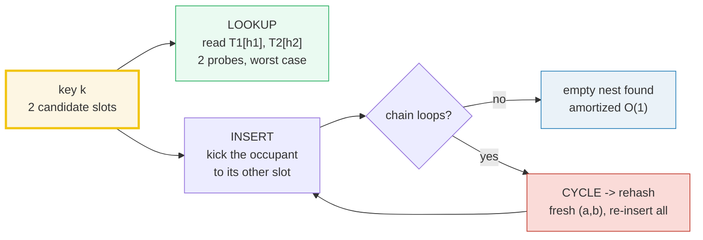
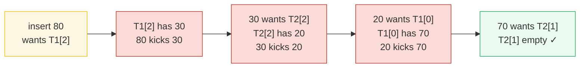
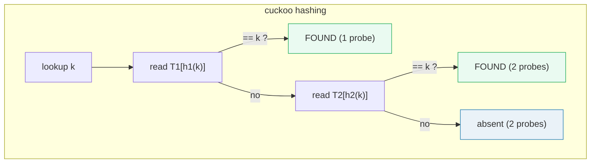
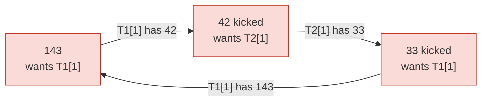
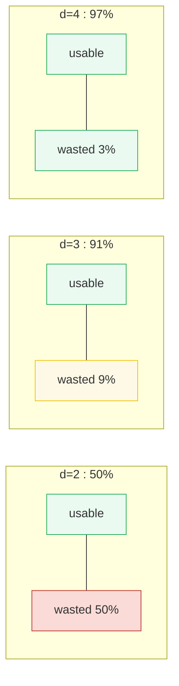

# Cuckoo Hashing — A Visual, Worked-Example Guide

> **Companion code:** [`cuckoo_hashing.py`](./cuckoo_hashing.py). **Every number
> in this guide is printed by `python3 cuckoo_hashing.py`** — change the code,
> re-run, re-paste. Nothing here is hand-computed.
>
> **Live animation:** [`cuckoo_hashing.html`](./cuckoo_hashing.html) — open in a
> browser. Four panels step through the kick-chain insert, the O(1) lookup, the
> 3-key cycle that triggers a rehash, and the d-ary load-factor dial, all
> gold-checked against the `.py`.
>
> **Source material:** Pagh & Rodler, *Cuckoo Hashing* (2001); Fotakis, Pagh,
> Sanders & Spirakis, *d-ary Cuckoo Hashing* (2005). CLRS §11.2–11.4 (hash
> tables, universal hashing, open addressing — the contrast). Also 🔗
> [`BIG_O_COMPARISON.md`](./BIG_O_COMPARISON.md) for the expected-vs-worst-case
> distinction and [`AMORTIZED_RESIZE.md`](./AMORTIZED_RESIZE.md) for the
> amortized-cost lens that cuckoo's rehashing shares.

---

## 0. TL;DR — two nests per bird, worst-case O(1) lookup

Every key has **exactly two** candidate slots: `T1[h1(k)]` and `T2[h2(k)]`. A
**lookup reads at most those two slots** — so it is **worst-case O(1)**, not
just expected O(1) like chaining or linear probing. To **insert**, try slot 1;
if occupied, **cuckoo-kick** the occupant to *its* other slot, recursively,
until somebody finds an empty nest. If the kicking **loops forever** (a cycle),
pick **new hash functions and rehash**.



| operation | cost | note |
|---|---|---|
| **lookup** | **worst case 2 probes → O(1)** | the whole point: never walks a chain |
| **insert** | amortized O(1) | usually 0 kicks; occasionally a chain; rarely a rehash |
| **delete** | O(1) | clear the one slot the key sits in; no tombstone |

| variant | nests per key | max load α | lookup probes |
|---|---|---|---|
| **2-cuckoo** (Pagh-Rodler) | 2 | **50%** | ≤ 2 |
| **3-cuckoo** | 3 | **91%** | ≤ 3 |
| **4-cuckoo** | 4 | **97%** | ≤ 4 |
| **5-cuckoo** | 5 | **99%** | ≤ 5 |

> **The one-line trade-off:** cuckoo hashing buys a *guaranteed* O(1) lookup by
> making insert do the hard work (kicking, occasionally rehashing). d-ary cuckoo
> raises the load ceiling toward 100% at the cost of *d* probes per lookup.

### Glossary

| Term | Plain meaning |
|---|---|
| **table T1, T2** | the two slot arrays; a key lives in exactly one slot of one table |
| **hash fn h1, h2** | map a key to a slot in T1 / T2; key k has two candidate positions |
| **nest / slot** | one cell of one table; holds 0 or 1 key |
| **kick / evict** | swap the new key into an occupied slot, re-home the displaced key to its OTHER slot |
| **eviction chain** | the cascade of kicks from one insert: k0 kicks k1 kicks k2 … |
| **cycle** | an eviction chain that revisits a slot → loops forever → detected by capping the chain at `MAX_KICKS` |
| **rehash** | pick fresh (a,b) for every hash function and re-insert all keys; the cure for a cycle |
| **MAX_KICKS** | chain-length cap; exceeding it ⇒ cycle ⇒ rehash |
| **load factor α** | `n / (d·m)` — fraction of slots occupied |
| **d-ary cuckoo** | d tables / d hashes; each key has d candidate nests; lookup checks ≤ d slots |
| **orientability** | a key set "orients" if every key gets a distinct one of its d slots; possible w.h.p. iff α < c(d) |

---

## A. Insert — kicks and displacement chains

Tables `T1, T2` of size `m = 8`. The hash family is **universal hashing**
(CLRS 11.3.3): `h_{a,b}(k) = ((a·k + b) mod 101) mod 8`, with `h1 = (5,1)` and
`h2 = (13,16)`. Insert tries `T1[h1(k)]` first; on a collision it cuckoo-kicks
the occupant to its other slot, recursively.

> From `cuckoo_hashing.py` Section A:

| key | h1(k) | h2(k) | kicks | eviction chain (placed evicts evicted@) |
|-----|-------|-------|-------|------------------------------------------|
| 10  | 3     | 5     | 0     | — |
| 20  | 0     | 2     | 0     | — |
| 30  | 2     | 2     | 0     | — |
| 40  | 4     | 7     | 0     | — |
| 50  | 1     | 4     | 0     | — |
| 60  | 3     | 1     | 1     | 60 kicks 10@T1[3] |
| 70  | 0     | 1     | 1     | 70 kicks 20@T1[0] |
| 80  | 2     | 6     | 3     | 80 kicks 30@T1[2] → 30 kicks 20@T2[2] → 20 kicks 70@T1[0] |

> From `cuckoo_hashing.py` Section A:

```
T1: [0]=20  [1]=50  [2]=80  [3]=60  [4]=40  [5]=.  [6]=.  [7]=.
T2: [0]=.  [1]=70  [2]=30  [3]=.  [4]=.  [5]=10  [6]=.  [7]=.
```

> **keys stored = 8, load factor = 8/16 = 0.500** (= the 2-cuckoo ceiling).
> **total kicks = 5, longest chain = 3.** `[check] all 8 keys findable in O(1)? OK`

The interesting insert is **key 80** — a 3-deep displacement chain:



One insert displaced **three** other keys — each kicked to its *other* slot. The
chain ends the moment an empty nest is found. Notice **no key is ever lost**:
every key always sits in one of its two candidate slots, which is exactly what
makes the next section work.

🔗 Watch the kick chain animate in [`cuckoo_hashing.html`](./cuckoo_hashing.html) panel ①.

---

## B. Lookup — check both slots, O(1) guaranteed

A cuckoo lookup reads **at most two slots**: `T1[h1(k)]`, then `T2[h2(k)]`. If
the key is in neither, it is **absent**. There is **never a chain to walk** —
unlike chaining (walk the bucket list) or linear probing (walk the cluster).

> From `cuckoo_hashing.py` Section B:

| key | probe T1[h1] | probe T2[h2] | result | probes |
|-----|--------------|--------------|--------|--------|
| 10  | T1[3]=60     | T2[5]=10     | FOUND in T2[5]  | 2 |
| 20  | T1[0]=20     | T2[2]=30     | FOUND in T1[0]  | 1 |
| 30  | T1[2]=80     | T2[2]=30     | FOUND in T2[2]  | 2 |
| 40  | T1[4]=40     | T2[7]=None   | FOUND in T1[4]  | 1 |
| 50  | T1[1]=50     | T2[4]=None   | FOUND in T1[1]  | 1 |
| 60  | T1[3]=60     | T2[1]=70     | FOUND in T1[3]  | 1 |
| 70  | T1[0]=20     | T2[1]=70     | FOUND in T2[1]  | 2 |
| 80  | T1[2]=80     | T2[6]=None   | FOUND in T1[2]  | 1 |
| **99** | T1[4]=40  | T2[3]=None   | **absent (not present)** | **2** |

> **Every lookup — hit or miss — used at most 2 probes.** `[check] worst-case probes == 2 (hit AND miss)? OK`



The decisive contrast: chaining and linear probing are **expected** O(1) but
**worst case O(N)** (a pathological adversary hashes every key into one bucket).
Cuckoo hashing's lookup is **worst-case 2 probes, always** — which is why it
lives in routers, Bloom-filter alternatives, and read-heavy caches where a slow
lookup is a deadline miss. The price is a harder insert (Sections A, D).

🔗 Click a key in [`cuckoo_hashing.html`](./cuckoo_hashing.html) panel ② to watch the two probes.

---

## C. Deletion — just clear the slot, O(1), no tombstones

To delete: do an O(1) lookup to find which of the two slots holds the key, then
set that slot to `None`. **No restructure, no rehash, and no tombstone** —
because a cuckoo lookup checks *exact* slots, an empty slot is simply empty
(there is no cluster that must be "terminated"). This is the opposite of linear
probing, where deletion must leave a tombstone (or re-insert the cluster) or
lookups stop early.

> From `cuckoo_hashing.py` Section C:

```
Before: lookup(30) -> FOUND in T2[2]
  T1: [0]=20  [1]=50  [2]=80  [3]=60  [4]=40  [5]=.  [6]=.  [7]=.
  T2: [0]=.  [1]=70  [2]=30  [3]=.  [4]=.  [5]=10  [6]=.  [7]=.

delete(30) -> slot T2[2] cleared
  T1: [0]=20  [1]=50  [2]=80  [3]=60  [4]=40  [5]=.  [6]=.  [7]=.
  T2: [0]=.  [1]=70  [2]=.   [3]=.  [4]=.  [5]=10  [6]=.  [7]=.

After:  lookup(30) -> absent (2 probes);  keys stored now = 7, load = 0.438
```

> `[check] delete is O(1) and key 30 now absent? OK`

Deleting never triggers a chain or a rehash — it touches only the **one** slot
the key occupies. Re-inserting the key later is a normal amortized-O(1) insert
that may kick, exactly like any other insert.

---

## D. Cycle detection — when the chain loops, rehash

An eviction chain can **loop**: key A kicks B kicks C kicks A … forever. Cuckoo
detects this by capping the chain at `MAX_KICKS`; when the cap is exceeded the
insertion is a **CYCLE**. The cure is to **REHASH**: pick fresh `(a,b)` for both
hashes and re-insert every key. Below is the smallest possible cycle.

**Three keys {33, 42, 143} all hash to the same slot pair (1,1)** under
`h1=(5,1), h2=(13,16)`. A slot-pair `{T1[1], T2[1]}` holds **at most 2 keys**
(one per slot); the third key aimed at it cannot be placed — its chain bounces
the three keys between `T1[1]` and `T2[1]` forever.

> From `cuckoo_hashing.py` Section D:

```
insert 33 -> T1[1]
insert 42 -> T1[1] occupied by 33; 33 kicked to T2[1] (empty). OK.

insert 143 -> eviction chain (no empty nest ever found):
   kick 1: 143 into T1[1], evicts 42
   kick 2: 42  into T2[1], evicts 33
   kick 3: 33  into T1[1], evicts 143
   kick 4: 143 into T2[1], evicts 42
   kick 5: 42  into T1[1], evicts 33
   kick 6: 33  into T2[1], evicts 143
   ... infinite loop: 143 -> 42 -> 33 -> 143 ...
CYCLE DETECTED: the chain ran past the 8-kick cap.
keys trapped in the loop: [143, 42, 33]  (period-2 ping-pong)
```



**REHASH** with fresh `(a,b) = (7,3),(7,5)`. The keys now scatter:

> From `cuckoo_hashing.py` Section D:

| key | h1′(k) | h2′(k) | after rehash |
|---|---|---|---|
| 33  | 0 | 2 | aims at a **different** pair than 42/143 |
| 42  | 7 | 1 | shares a pair only with 143 (2 keys → fits) |
| 143 | 7 | 1 | — |

```
insert 33  -> empty
insert 42  -> empty
insert 143 -> 143 kicks 42@T1[7]   (1 kick, then 42 finds T2[1] empty)
T1': [0]=33  [7]=143
T2': [1]=42
All three keys placed and findable. Cycle cured.
```

> `[check] cycle detected (>8 kicks)? OK ; rehash places all 3? OK`

The principle: a cycle means the **cuckoo graph** has too many edges jammed into
one connected component (here, 3 edges on a 2-slot component). Rehashing redraws
the graph with fresh edges, almost always breaking the jam — *provided the load
factor is below the threshold* (next section). Above the threshold, rehashing
itself can fail, which is why the load factor is the real limit.

🔗 Trigger the cycle and the rehash live in [`cuckoo_hashing.html`](./cuckoo_hashing.html) panel ③.

---

## E. Load factor — 2 tables top out at ~50%, d-ary reaches ~90%+

With only **2 nests** per key, the cuckoo graph tangles above ~50% full: cycles
multiply and the table must rehash constantly. Giving each key **d ≥ 2 nests**
(d hash functions / d tables) raises the ceiling toward 100% — at the cost of
**d probes per lookup** (still O(1)).

The **load threshold** `c(d)` is the maximum α at which a random instance is
still *placeable* (every key can be assigned a distinct one of its d slots).
Theory (Fotakis et al. 2005) plus a simulation:

> From `cuckoo_hashing.py` Section E:

| d (nests) | c(d) theory | c(d) simulated (mean of 8) | wasted slots = 1 − c(d) |
|-----------|-------------|----------------------------|---------------------|
| 2         | 0.500       | 0.537                      | 50.0% |
| 3         | 0.911       | 0.911                      | 8.9%  |
| 4         | 0.976       | 0.968                      | 2.4%  |
| 5         | 0.992       | 0.985                      | 0.8%  |

> `[check] simulated c(d) within 0.06 of theory for d=2..5? OK`



Read it as a **capacity dial**:

- **d = 2**: only 50% of slots usable → half the memory **wasted**. This is why
  plain 2-cuckoo is rare in production by itself.
- **d = 3**: jumps to **~91% usable**. The usual practical choice — only ~9%
  waste, and lookup is still just ≤ 3 probes.
- **d ≥ 4**: ~97%+, but each added nest costs one extra probe per lookup;
  diminishing returns.

The threshold **approaches 1** as d grows (each extra nest gives a key more
escape routes, so cycles become rare), but every nest adds a probe. **d = 3 is
the engineering sweet spot.** Contrast with open addressing (linear probing): it
loads to ~70% before clustering degrades it, but its lookup is only *expected*
O(1); cuckoo's lookup is *worst-case* O(1) at every load below `c(d)`.

🔗 Slide d and watch the load gauge in [`cuckoo_hashing.html`](./cuckoo_hashing.html) panel ④.

---

## F. Gold check — the values the HTML recomputes

The companion `.html` re-runs the *identical* `CuckooTable` logic in JavaScript
and asserts it against these pinned values:

> From `cuckoo_hashing.py` GOLD VALUES:

| quantity | value |
|---|---|
| keys | `[10, 20, 30, 40, 50, 60, 70, 80]` |
| per-key kicks | `[0, 0, 0, 0, 0, 1, 1, 3]` |
| **total kicks** | **5** |
| **longest chain** | **3** (key 80) |
| **T1** | `[20, 50, 80, 60, 40, None, None, None]` |
| **T2** | `[None, 70, 30, None, None, 10, None, None]` |
| keys stored / load | 8 / 0.500 |
| cycle keys | `[33, 42, 143]` → all map to pair (1,1) |
| **cycle detected** (3rd insert > MAX_KICKS=8) | **True** |
| rehash family | `(7,3),(7,5)` → per-key kicks `[0,0,1]`, all placed |
| rehashed T1 / T2 | `[33,_,_,_,_,_,_,143]` / `[_,42,_,_,_,_,_,_]` |

> **GOLD scalars: total_kicks = 5, max_chain = 3, cycle = True, rehash_kicks = 1.**
> `[check] GOLD reproduces from the CuckooTable class? OK`

The gold badge `check: OK` at the bottom of
[`cuckoo_hashing.html`](./cuckoo_hashing.html) confirms the in-browser recompute
matches `cuckoo_hashing.py` exactly (T1, T2, kick counts, cycle detection).

---

## G. The bigger picture

- **Worst-case O(1) lookup is the headline.** Every other hash table gives
  *expected* O(1) with a pathological O(N). Cuckoo guarantees ≤ 2 probes (≤ d
  for d-ary) by accepting a harder, occasionally-rehashing insert. Worth it when
  reads dominate and predictability matters (network forwarding tables, memcached
  alternatives, hardware caches).
- **The cuckoo graph is the whole story.** Keys are *edges* between their two
  slot-nodes; placeability is *orientability* of this graph. Cycles = graph
  components with more edges than nodes. The load threshold `c(d)` is where a
  random graph stops being orientable — the same 2-core math that underlies
  power-law random graphs. 🔗 [`BIG_O_COMPARISON.md`](./BIG_O_COMPARISON.md).
- **Rehashing is amortized O(1), just like resizing.** Cycles are rare below the
  threshold, so the occasional full rebuild spreads over many cheap inserts —
  the same geometric-series argument as dynamic-array doubling. 🔗
  [`AMORTIZED_RESIZE.md`](./AMORTIZED_RESIZE.md).
- **d-ary cuckoo is the practical form.** Pure 2-cuckoo wastes half the memory;
  real systems use d = 3–4 to hit ~91–97% load while keeping lookups to a
  handful of independent cache-line reads. Modern variants (e.g. *cuckoo filters*)
  extend the idea to approximate-membership / counting.

> **Files in this bundle** (all derive from one ground-truth `.py`):
> [`cuckoo_hashing.py`](./cuckoo_hashing.py) ·
> [`cuckoo_hashing_output.txt`](./cuckoo_hashing_output.txt) ·
> [`cuckoo_hashing.html`](./cuckoo_hashing.html) · this guide.
