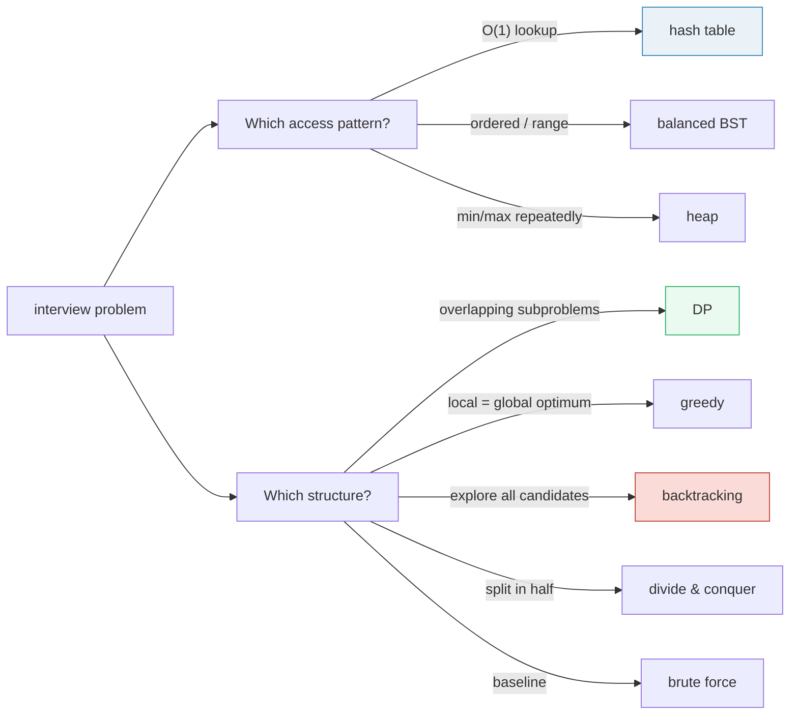

# Data Structures & Algorithms — A Visual Refresher Guide

> **Companion code:** [`data_structures_algos.py`](https://github.com/quanhua92/tutorials/blob/main/dsa/data_structures_algos.py).
> **Every number in this guide is printed by `python3 data_structures_algos.py`** — change
> the code, re-run, re-paste. Nothing here is hand-computed.
>
> **Live animation:** [`data_structures_algos.html`](https://github.com/quanhua92/tutorials/blob/main/dsa/data_structures_algos.html)
> — open in a browser. Click a data-structure row for its selection note, drag **N** on
> the Big-O growth chart, and pick an algorithm paradigm to watch its worked example run
> live — all gold-checked against the `.py`.
>
> **Source material:** CLRS *Introduction to Algorithms* (complexity, paradigms); Sedgewick
> & Wayne *Algorithms*; the [DSA discussion notes](https://github.com/quanhua92/interview-prep/blob/main/cs_fundamentals/data_structures_algos/discussion.md).
> Companion bundles: [`BIG_O_COMPARISON.md`](https://github.com/quanhua92/tutorials/blob/main/dsa/BIG_O_COMPARISON.md)
> (growth curves in depth), [`ARRAY_VS_LINKEDLIST.md`](https://github.com/quanhua92/tutorials/blob/main/dsa/ARRAY_VS_LINKEDLIST.md)
> (cache locality), [`DP_KNAPSACK_LCS.md`](https://github.com/quanhua92/tutorials/blob/main/dsa/DP_KNAPSACK_LCS.md) (DP table mechanics).

---

## 0. TL;DR — two decisions drive every DSA problem

Every interview question reduces to two choices, in this order:

1. **Which data structure holds the data?** — driven by the **access pattern** you need
   (O(1) membership → hash table; range queries → BST; repeated min/max → heap).
2. **Which algorithm paradigm transforms it?** — driven by the **problem structure**
   (overlapping subproblems → DP; locally-optimal-is-globally-optimal → greedy; explore all
   candidates → backtracking; split in half → divide & conquer; "just try everything" → brute force).

This guide is the cheat sheet for both: a data-structure complexity table, a Big-O growth
chart, the five paradigms, and one `[check]`-verified worked example per paradigm.



### Glossary

| Term | Plain meaning |
|---|---|
| **Big-O** | growth rate of work as N → ∞; constants drop, only the dominant term survives |
| **amortized** | worst case per op is bad, but averaged over a sequence it is cheap |
| **access** | read element by index/position (`array[5]`) |
| **search** | find whether a value is present |
| **balanced BST** | a search tree kept at height O(log N) via rotations (AVL, red-black) |
| **complete** | (heap) every level full except the last, filled left→right → fits in an array |
| **paradigm** | a strategy family for building algorithms (the five in Section C) |

---

## A. The data-structure operation complexity table

Pick the structure that supports the access pattern you need. The signature strengths:

> From `data_structures_algos.py` Section A — the table:

```
| Data Structure | Access   | Search   | Insert   | Delete   | Space    |
|----------------|----------|----------|----------|----------|----------|
| Array          | O(1)     | O(n)     | O(n)     | O(n)     | O(n)     |
| Linked List    | O(n)     | O(n)     | O(1)*    | O(1)*    | O(n)     |
| Hash Table     | O(N/A)   | O(1)avg  | O(1)avg  | O(1)avg  | O(n)     |
| BST (bal.)     | O(log n) | O(log n) | O(log n) | O(log n) | O(n)     |
| Heap           | O(1)^    | O(n)     | O(log n) | O(log n) | O(n)     |
| Graph (adj.)   | O(1)#    | O(V+E)   | O(1)     | O(V+E)   | O(V+E)   |
```

- `*` Linked list: O(1) insert/delete only at a **known node**; finding it is O(n).
- `^` Heap: O(1) peek of min/max **only**; arbitrary search is O(n).
- `#` Graph: O(1) vertex access; edge lookup is O(deg(v)).
- `avg` Hash table: O(1) *expected*; degrades to O(n) under collisions / high load factor.

> From `data_structures_algos.py` Section A — selection rule of thumb:
>
> O(1) membership → hash table · sorted/range → balanced BST · repeated min/max → heap ·
> prefix/autocomplete → trie · connected components → union-find · next-greater → monotonic
> stack · range sum + point update → Fenwick/segment tree · O(1) both-ends → deque.

**The common mistake:** using a Python `list` when a `deque` is needed. `list.pop(0)` is
**O(n)** (it shifts every element); `deque.popleft()` is **O(1)**. This is the #1 hidden
O(n²) in BFS code.

> `[check] table has 6 structures, Array first, BST balanced 4th? OK`

---

## B. The Big-O cheat sheet

Big-O = growth rate as N → ∞. Constants drop; only the dominant term survives. The table
runs fastest (top) to slowest (bottom):

> From `data_structures_algos.py` Section B:

| Class | Name | Example algorithms |
|---|---|---|
| **O(1)** | constant | hash lookup, array index, stack push/pop |
| **O(log n)** | logarithmic | binary search, balanced BST op, fast exponentiation |
| **O(n)** | linear | linear scan, BFS/DFS visit, single pass |
| **O(n log n)** | linearithmic | merge/heap sort, FFT, convex hull |
| **O(n²)** | quadratic | bubble/selection sort, two-sum brute force |
| **O(2ⁿ)** | exponential | naive recursive Fibonacci, all subsets |
| **O(n!)** | factorial | permutations, brute-force TSP |

**Growth at concrete N** (recomputed live in the `.html` chart):

| Class | N=10 | N=100 |
|---|---|---|
| O(1) | 1 | 1 |
| O(log n) | 3.32 | 6.64 |
| O(n) | 10 | 100 |
| O(n log n) | 33.22 | 664.39 |
| O(n²) | 100 | 10 000 |
| O(2ⁿ) | 1 024 | 1.268e30 |
| O(n!) | 3 628 800 | 9.333e157 |

**The tractability cliff:** at N=100, every class up to O(n²) finishes in well under a
millisecond (at 1 op/ns). O(2ⁿ) ≈ 1.27e30 ns ≈ 4e13 **years**; O(n!) ≈ 9.3e157 ns is
absurdly past the age of the universe. The jump from polynomial to exponential is the single
most important fact in DSA: **polynomial-time algorithms scale; exponential ones do not.**

**Master Theorem** (divide-and-conquer): `T(N) = a·T(N/b) + Θ(Nᶜ)`. Let p = log_b(a).

- `c < p` → **Case 1:** Θ(Nᵖ) — the leaves dominate. (Strassen: a=7,b=2,c=2 → Θ(N^2.807))
- `c = p` → **Case 2:** Θ(Nᵖ log N) — balanced. (merge sort: a=2,b=2,c=1 → N log N; binary search: a=1,b=2,c=0 → log N)
- `c > p` → **Case 3:** Θ(Nᶜ) — the combine step dominates.

> `[check] growth(1,100)=1, log(8)=3, n^2(100)=10000, 2^10=1024, 5!=120? OK`

---

## C. The five algorithm paradigms

A paradigm is a **strategy** for building an algorithm. Match the paradigm to the problem's
structure — recognized within 2 minutes via signal words.

| Paradigm | Typical | Idea |
|---|---|---|
| **Brute Force** | O(nᵏ) | Try EVERY candidate; check each. Always correct; often too slow. State as the interview BASELINE first, then optimize. |
| **Divide & Conquer** | O(n log n) | Split the input in half, solve each recursively, COMBINE the results. Shines when the combine step is cheap. |
| **Greedy** | O(n log n) | Make the locally optimal choice at each step; NEVER reconsider. Works ONLY when local ⇒ global optimum (provably). |
| **Dynamic Programming** | O(n·k) | Overlapping subproblems + optimal substructure. Solve each subproblem ONCE, memoize/tabulate. Turns exponential recursion polynomial. |
| **Backtracking** | O(2ⁿ) / O(n!) | Systematically explore ALL candidates; PRUNE a branch the moment it violates a constraint. DFS over the solution space. |

**Paradigm → signal words:**

| Paradigm | Signal words |
|---|---|
| Brute Force | "how many pairs/triples?", small N, baseline |
| Divide & Conquer | "split in half", "sorted", "balanced" |
| Greedy | "maximum/minimum", "schedule", "can you reach" |
| DP | "count the ways", "min cost", "longest/shortest" |
| Backtracking | "all possible", "generate every", "satisfies" |

**When greedy fails (the trap):** greedy gives no guarantee unless the *greedy-choice
property* holds. Counterexamples:

- **0/1 knapsack** is NOT greedy (best value-density first can leave unfillable space), but
  **fractional** knapsack IS (you can take part of an item).
- **Coin change** with US denominations {1,5,10,25} is greedy-solvable; {1,3,4} for amount 6
  is NOT — greedy picks 4+1+1 = 3 coins, but optimal is 3+3 = 2 coins.

> `[check] exactly 5 paradigms defined? OK`

---

## D. One worked example per paradigm (all `[check]`-verified)

Each example runs in `data_structures_algos.py` Section D AND is recomputed live in the
`.html` paradigm selector from identical logic.

### (1) Brute Force — two sum

```
nums = [2, 7, 11, 15], target = 9
scan all C(4,2)=6 pairs; stop at first match.
result: indices (0,1) since nums[0]+nums[1]=2+7=9  after 1 comparison(s)
```

Check every pair with a nested loop. O(n²) time, O(1) space. A hash map brings it down to
O(n) — the classic "trade space for time" move. State this brute force first in an interview.

`[check] (0,1) with 1 comparison? OK`

### (2) Divide & Conquer — merge sort

```
input  = [38, 27, 43, 3, 9, 82, 10]
output = [3, 9, 10, 27, 38, 43, 82]
comparisons performed = 14  (worst case ~ n·log2(n) = 19)
```

Split in half, recurse, then **merge** the two sorted halves in linear time. O(n log n)
guaranteed, O(n) space, and **stable** (equal keys keep their relative order). The merge
step's linearity is what makes it Case 2 of the Master Theorem.

`[check] sorted correctly, 14 comparisons? OK`

### (3) Greedy — activity selection

```
11 activities (start,finish) = [(1,4),(3,5),(0,6),(5,7),(3,9),(5,9),
                                (6,10),(8,11),(8,12),(2,14),(12,16)]
sort by finish, take each that starts after last chosen finish:
selected 4: [(1,4), (5,7), (8,11), (12,16)]
```

**Earliest-finish-first** is provably optimal here: the activity that finishes earliest
leaves the most room for everything after it. O(n log n) for the sort, O(1) extra space.
The greedy-choice property holds because finishing earlier never hurts.

`[check] 4 non-overlapping activities, no gaps violate? OK`

### (4) Dynamic Programming — 0/1 knapsack (classic CLRS)

```
weights = [1, 2, 3], values = [6, 10, 12], capacity = 5
dp table (4x6); dp[i][w] = best value using first i items at capacity w.
max value = 22; items taken (0-indexed) = [1, 2]
  -> weight 5 <= 5, value 22 == 22
```

`dp[i][w] = max(dp[i-1][w], dp[i-1][w-wᵢ] + vᵢ)` — either skip item *i* or take it (if it
fits). Trace back the table to recover *which* items. O(n·W) time and space. This is the
canonical example of overlapping subproblems: every `(items, capacity)` cell is reused.

`[check] value 22 via items [1,2]? OK`

### (5) Backtracking — N-queens

```
N=4: 2 distinct solutions  (backtracking with col/diag1/diag2 pruning)
N=8: 92 distinct solutions
```

Place queens row by row; maintain sets of occupied columns and both diagonals (`r-c`,
`r+c`); recurse; **undo** the placement on backtrack. The O(1) conflict check prunes the
O(n!) search space dramatically (8-queens visits a tiny fraction of 8! candidates).

`[check] N=4 → 2 solutions, N=8 → 92 solutions? OK`

---

## GOLD — values pinned for `data_structures_algos.html`

The standalone `.html` recomputes these in JS from the identical logic and asserts them via
the gold-check badge:

| Scalar | Value |
|---|---|
| `two_sum_bruteforce([2,7,11,15], 9)` | `(0, 1)`, 1 comparison |
| `merge_sort([38,27,43,3,9,82,10])` | `[3, 9, 10, 27, 38, 43, 82]`, 14 comparisons |
| `activity_selection(...)` | 4 activities |
| `knapsack_01([1,2,3],[6,10,12], 5)` | 22, items `[1, 2]` |
| `count_nqueens(4, 8)` | `(2, 92)` |
| `big_o_growth('O(2^n)', 10)` | 1024 |
| `big_o_growth('O(n!)', 5)` | 120 |
| `big_o_growth('O(n^2)', 100)` | 10 000 |

`[check] all GOLD values reproduce from source? OK`

The gold badge `check: OK` at the bottom of
[`data_structures_algos.html`](https://github.com/quanhua92/tutorials/blob/main/dsa/data_structures_algos.html)
confirms the in-browser recompute matches `data_structures_algos.py` exactly (two-sum indices,
merge-sort result, activity count, knapsack value, N-queens counts, and the Big-O growth scalars).

---

## E. The bigger picture

- **Access pattern drives the data structure.** Hash table for "is X here?", BST for
  "give me the range [lo,hi]", heap for "give me the next best", union-find for "are A and B
  connected". If you cannot tie a structure choice to a specific access pattern, you are
  guessing. 🔗 see [`CHAINING.md`](https://github.com/quanhua92/tutorials/blob/main/dsa/CHAINING.md)
  for the hash-table half and [`BST_REDBLACK.md`](https://github.com/quanhua92/tutorials/blob/main/dsa/BST_REDBLACK.md)
  for the balanced-tree half.
- **State the brute force first, then optimize through ONE targeted change.** Identify the
  redundant work in the brute force and name the structure that eliminates it: O(n²)→O(n) is
  a hash map; O(n)→O(log n) is binary search on a monotone space. The optimization is a
  *substitution*, not a rethink.
- **Polynomial vs exponential is the whole game.** Everything up to O(n²) scales; O(2ⁿ) and
  O(n!) do not. Backtracking/DP exist to drag an exponential brute force down into polynomial
  territory (via pruning and memoization respectively). 🔗 [`BIG_O_COMPARISON.md`](https://github.com/quanhua92/tutorials/blob/main/dsa/BIG_O_COMPARISON.md)
  for the growth curves in depth.
- **Greedy needs proof, DP needs the recurrence.** Greedy is only safe when the
  greedy-choice property holds (prove it or find a counterexample). DP needs you to (1) define
  `dp[i]`'s meaning, (2) write the recurrence, (3) nail the base case. 🔗 [`DP_KNAPSACK_LCS.md`](https://github.com/quanhua92/tutorials/blob/main/dsa/DP_KNAPSACK_LCS.md)
  and [`GREEDY.md`](https://github.com/quanhua92/tutorials/blob/main/dsa/GREEDY.md) for the deep dives.

> **Files in this bundle** (all derive from one ground-truth `.py`):
> [`data_structures_algos.py`](https://github.com/quanhua92/tutorials/blob/main/dsa/data_structures_algos.py) ·
> [`data_structures_algos_output.txt`](https://github.com/quanhua92/tutorials/blob/main/dsa/data_structures_algos_output.txt) ·
> [`data_structures_algos.html`](https://github.com/quanhua92/tutorials/blob/main/dsa/data_structures_algos.html) ·
> this guide [`DATA_STRUCTURES_ALGOS.md`](https://github.com/quanhua92/tutorials/blob/main/dsa/DATA_STRUCTURES_ALGOS.md).
