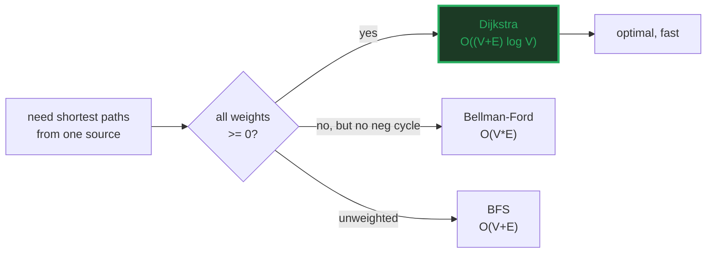
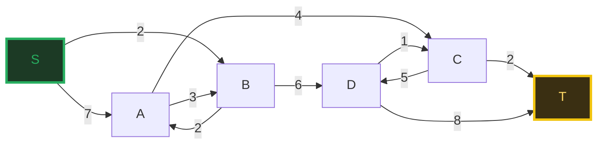
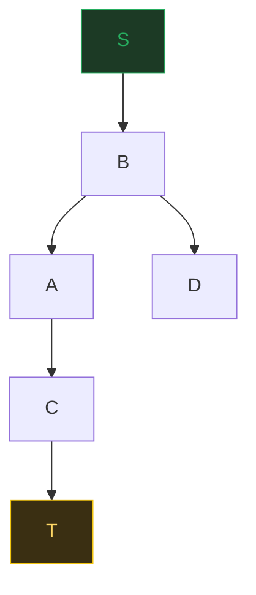
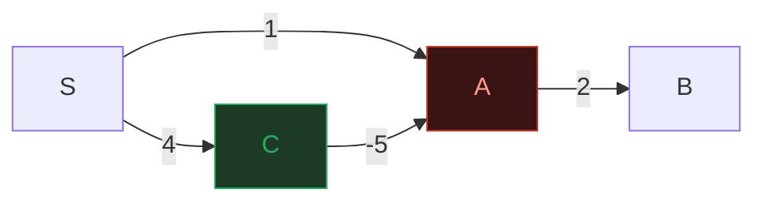

# Dijkstra's Shortest Path — A Visual, Worked-Example Guide

> **Companion code:** [`dijkstra.py`](./dijkstra.py). **Every number, table,
> and trace in this guide is printed by `python3 dijkstra.py`** — nothing is
> hand-computed.
>
> **Live animation:** [`dijkstra.html`](./dijkstra.html) — open in a browser:
> the weighted graph, a step-through of the min-heap extraction, the
> relaxation frontier, and a gold check re-run in JavaScript.

---

## 0. TL;DR — the one idea

> **The "campfire rumor" analogy (read this first):** you stand at a source
> node `S` and want the cheapest route to every other node in a weighted
> graph. Dijkstra keeps a "best known cost" `dist[v]` for each node (infinity
> except `dist[S] = 0`), then repeatedly:
> 1. **pulls** the unfinished node `u` with the smallest `dist[u]` out of a
>    min-priority-queue and **settles** it (its distance is now final);
> 2. **relaxes** each out-edge — `if dist[u] + w(u,v) < dist[v]: dist[v] = dist[u] + w(u,v)`.
>
> The min-pq means we always commit the *closest unfinished* node first. It
> works **iff all weights ≥ 0**: a later negative edge could undercut a node
> we already settled, breaking the greedy commitment.

| algorithm | weights | complexity | detects neg cycle |
|---|---|---|---|
| **BFS** | unweighted (=1) | O(V+E) | n/a |
| **Dijkstra** | **≥ 0** | **O((V+E) log V)** | no |
| Bellman-Ford | any (incl. negative) | O(V·E) | yes |



---

### Glossary (plain English — refer back any time)

| Term | Plain meaning |
|---|---|
| **source `S`** | The start node; `dist[S] = 0`. |
| **`dist[v]`** | Best known cost from `S` to `v` so far (an upper bound). |
| **settled** | A node whose `dist` is FINAL — popped from the pq, never reopened. Dijkstra commits a node the instant it is pulled. |
| **relaxation** | `if dist[u]+w(u,v) < dist[v]: dist[v] = dist[u]+w(u,v)`. Named because the "triangle inequality" constraint is being *tightened*. |
| **`pred[v]`** | Predecessor on the current best path to `v`; chains rebuild paths. |
| **`w(u,v)`** | Weight of edge `u→v`. Must be **≥ 0** for Dijkstra to be correct. |
| **min-pq / heap** | Priority queue ordered by `dist`; pop returns the smallest. Python `heapq` is a binary min-heap → push/pop are **O(log V)**. |
| **shortest-path tree (SPT)** | The tree formed by the `pred` pointers, rooted at `S`. |

---

## 1. The weighted graph + step-by-step relaxation

At each step we pop the unsettled node with the smallest `dist`, **settle** it
(dist is now permanent), then **relax** every out-edge.

> From `dijkstra.py` Section A — main graph, source `S`:

```
Main graph (directed, non-negative weights):
  S: S-[7]->A, S-[2]->B
  A: A-[3]->B, A-[4]->C
  B: B-[2]->A, B-[6]->D
  C: C-[5]->D, C-[2]->T
  D: D-[1]->C, D-[8]->T
  T: (no out-edges)

  STEP 1: pop (0,S)  ->  SETTLE S, dist[S] = 0  (final)
             relax S-[7]->A: 0+7=7 < inf  ->  dist[A] = 7  (push (7,A))
             relax S-[2]->B: 0+2=2 < inf  ->  dist[B] = 2  (push (2,B))
  STEP 2: pop (2,B)  ->  SETTLE B, dist[B] = 2  (final)
             relax B-[2]->A: 2+2=4 < 7  ->  dist[A] = 4  (push (4,A))
             relax B-[6]->D: 2+6=8 < inf  ->  dist[D] = 8  (push (8,D))
  STEP 3: pop (4,A)  ->  SETTLE A, dist[A] = 4  (final)
             relax A-[3]->B: B already SETTLED -> skip (greedy commitment)
             relax A-[4]->C: 4+4=8 < inf  ->  dist[C] = 8  (push (8,C))
           : pop (7,A)  ->  STALE entry (dist[A] already smaller), discard
  STEP 4: pop (8,C)  ->  SETTLE C, dist[C] = 8  (final)
             relax C-[5]->D: 8+5=13 >= 8  (no improvement)
             relax C-[2]->T: 8+2=10 < inf  ->  dist[T] = 10  (push (10,T))
  STEP 5: pop (8,D)  ->  SETTLE D, dist[D] = 8  (final)
             relax D-[1]->C: C already SETTLED -> skip (greedy commitment)
             relax D-[8]->T: 8+8=16 >= 10  (no improvement)
  STEP 6: pop (10,T)  ->  SETTLE T, dist[T] = 10  (final)

Final distances:
  dist = {S:0, A:4, B:2, C:8, D:8, T:10}
```



> **Notice `A` is settled at 4** even though edge `S→A` has weight 7: the
> cheaper two-hop route `S→B→A` (2+2=4) was found by relaxation **before** `A`
> settled. Relaxation never trusts the first edge it sees — it keeps the
> cheapest known route to each node. The two **STALE/skip** lines show the
> greedy commitment: once a node is settled, Dijkstra will not reopen it (the
> very assumption Section 4 shows breaking under negative weights).

---

## 2. The min-priority-queue — extract-min in O(log V)

The "extract-min" that picks the next node is the heart of Dijkstra. With a
**binary heap** (Python `heapq`), each push/pop is **O(log V)**, so the whole
run is **O((V+E) log V)**. Here is the *frontier* (sorted heap contents) after
each operation:

> From `dijkstra.py` Section B:

```
  op 1 POP (0,S)  -> SETTLE         frontier = (empty)
  op 2 PUSH (7,A) (relax S->A)   frontier = (7,A)
  op 3 PUSH (2,B) (relax S->B)   frontier = (2,B), (7,A)
  op 4 POP (2,B)  -> SETTLE         frontier = (7,A)
  op 5 PUSH (4,A) (relax B->A)   frontier = (4,A), (7,A)
  op 6 PUSH (8,D) (relax B->D)   frontier = (4,A), (7,A), (8,D)
  op 7 POP (4,A)  -> SETTLE         frontier = (7,A), (8,D)
  op 8 PUSH (8,C) (relax A->C)   frontier = (7,A), (8,C), (8,D)
  op 9 POP (7,A)  -> discard stale  frontier = (8,C), (8,D)
  op10 POP (8,C)  -> SETTLE         frontier = (8,D)
  op11 PUSH (10,T) (relax C->T)   frontier = (8,D), (10,T)
  op12 POP (8,D)  -> SETTLE         frontier = (10,T)
  op13 POP (10,T)  -> SETTLE         frontier = (empty)

  total pushes = 7 (1 initial + 6 successful relaxations)
  total pops   = 7 (6 settle + 1 stale discard)
```

> **Lazy deletion.** When `B→A` lowers `dist[A]` from 7 to 4, we push a *new*
> `(4,A)` but leave the stale `(7,A)` in the heap. We discover it is stale at
> **op 9** (popped value 7 > `dist[A]`=4) and discard it. This avoids the cost
> of a heap *decrease-key* operation — every edge causes ≤ 1 push, every node
> pops once (plus stale dups), giving **O((V+E) log V)**. A naive array-scan
> Dijkstra scans all `V` nodes to find each min → **O(V²)**; the heap wins
> once the graph is even slightly sparse (`E << V²`).

---

## 3. The shortest-path tree — reconstructed paths

After Dijkstra, the `pred[]` pointers form a **tree rooted at S**. Following
each node's `pred` chain back to `S` reconstructs a shortest path, whose total
edge-weight equals `dist[node]`.

> From `dijkstra.py` Section C:

```
  | node | dist | pred | shortest path        | edges               | total | check |
  |------|------|------|----------------------|---------------------|-------|-------|
  | S    | 0    | None | S                    | -                   | 0     | OK    |
  | A    | 4    | B    | S -> B -> A          | 2+2                 | 4     | OK    |
  | B    | 2    | S    | S -> B               | 2                   | 2     | OK    |
  | C    | 8    | A    | S -> B -> A -> C     | 2+2+4               | 8     | OK    |
  | D    | 8    | B    | S -> B -> D          | 2+6                 | 8     | OK    |
  | T    | 10   | C    | S -> B -> A -> C -> T | 2+2+4+2             | 10    | OK    |

[check] every reconstructed path's edge-weight sum == dist[v]:  OK

The SPT itself (parent -> children):
  S -> B
  A -> C
  B -> A, D
  C -> T
```



> **The `S→T` path is `S→B→A→C→T` (cost 10)**, cheaper than the "obvious"
> `S→A(7)→C(11)→T(13)` because going through `B` first makes `A` cost 4, not 7.
> The SPT edges are exactly the `pred` pointers; every node except `S` has
> exactly one parent.

---

## 4. Why negative edges break it — Dijkstra vs Bellman-Ford

Add one negative edge `C→A = -5`. Dijkstra settles `A=1` **before** it pops
`C` and sees the −5 edge, so it can never reopen `A`. Bellman-Ford has no
"settle" step — it relaxes *every* edge `V−1` times, so the −5 edge eventually
applies.

> From `dijkstra.py` Section D — negative graph `S→A(1), S→C(4), A→B(2), C→A(−5)`:

```
  | node | Dijkstra | Bellman-Ford (TRUE) | match? |
  |------|----------|---------------------|--------|
  | S    | 0        | 0                   | OK     |
  | A    | 1        | -1                  | WRONG  |
  | B    | 3        | 1                   | WRONG  |
  | C    | 4        | 4                   | OK     |

  [check] Dijkstra == Bellman-Ford on the negative graph?  FAIL

What went wrong - the greedy commitment, step by step:
  1. pop S(0), settle. Relax S->A=1, S->C=4.   frontier: (1,A),(4,C)
  2. pop A(1), SETTLE A=1. Relax A->B=3.        A is now PERMANENT.
  3. pop B(3), settle B=3. (no out-edges)
  4. pop C(4), settle C=4. Try C->A = 4+(-5) = -1 < 1 ... but A is ALREADY
     SETTLED, so strict Dijkstra SKIPS it. The true cost A=-1 is lost, and
     B (settled at 3, should be 1 via C->A->B) is wrong too.
```



> **The rule:** Dijkstra's correctness *proof* needs "every edge weight ≥ 0".
> The instant a negative edge exists, a node settled "too early" can never be
> reopened. Bellman-Ford trades the `O((V+E)log V)` speed for the ability to
> handle negatives by brute-forcing `V−1` relaxation sweeps — and it can
> additionally **detect** a reachable negative cycle (one more pass that still
> relaxes ⇒ a cycle exists).

---

## 5. BFS / Dijkstra / Bellman-Ford — three regimes

Same graph, three algorithms. BFS ignores weights (min #edges); Dijkstra and
Bellman-Ford both minimise total weight and **must agree** here since all
weights are ≥ 0.

> From `dijkstra.py` Section E:

```
  | node | BFS (edge count) | Dijkstra (weight) | Bellman-Ford (weight) | D==BF? |
  |------|------------------|-------------------|-----------------------|--------|
  | S    | 0                | 0                 | 0                     | OK     |
  | A    | 1                | 4                 | 4                     | OK     |
  | B    | 1                | 2                 | 2                     | OK     |
  | C    | 2                | 8                 | 8                     | OK     |
  | D    | 2                | 8                 | 8                     | OK     |
  | T    | 3                | 10                | 10                    | OK     |

Complexity & capability table:
  | algorithm     | weights allowed   | complexity       | detects neg cycle |
  |---------------|-------------------|------------------|-------------------|
  | BFS           | unweighted (=1)   | O(V+E)           | n/a               |
  | Dijkstra      | >= 0              | O((V+E) log V)   | no                |
  | Bellman-Ford  | any (incl. neg)   | O(V*E)           | yes               |
```

> **BFS gives `T = 3`** (`S→A→C→T` = 3 edges) but Dijkstra gives `T = 10`
> (cheapest by *weight* is `S→B→A→C→T`). **Fewest edges ≠ cheapest weight** —
> that is why Dijkstra exists. When all weights are 1, Dijkstra degenerates to
> BFS (the min-pq becomes a FIFO queue). Reach for BFS on unweighted graphs,
> Dijkstra whenever weights are non-negative (most maps, networks, games), and
> Bellman-Ford only when negative edges are possible (currency arbitrage,
> constraint systems).

---

## 6. Complexity summary

| operation | Dijkstra (binary heap) | Dijkstra (array) |
|---|---|---|
| single-source, all nodes | **O((V+E) log V)** | O(V²) |
| extract-min | O(log V) | O(V) |
| decrease-key / push | O(log V) | O(1) |
| negative edges | **not handled** | not handled |
| optimality (w ≥ 0) | **yes** | yes |

> The single question that picks the algorithm: **"are all weights ≥ 0?"** If
> yes → **Dijkstra** (fast, optimal). If negatives are possible → **Bellman-Ford**
> (slower, but correct and cycle-detecting). If the graph is unweighted → **BFS**
> (fastest). Dijkstra is the default for road networks, routing, and game
> pathfinding — and it is the special case `h = 0` of 🔗 **A\*** search.

---

### Reproducibility

Every trace and table above is printed verbatim by `python3 dijkstra.py` and
cross-checked at the end of that run against an independent engine:

> From `dijkstra.py` — the gold check:

```
  Dijkstra    dist = {S:0, A:4, B:2, C:8, D:8, T:10}
  BellmanFord dist = {S:0, A:4, B:2, C:8, D:8, T:10}
  dist[T] (headline) = 10

GOLD CHECK: OK - Dijkstra and Bellman-Ford agree on every node
```

`dijkstra.html` re-runs Dijkstra in JavaScript with the identical graph and
relaxation logic, and re-checks `dist[T] = 10` — the green `check: OK` badge
confirms the page matches the `.py` exactly. 🔗 See also **A_STAR.md** for the
heuristic-accelerated cousin.
