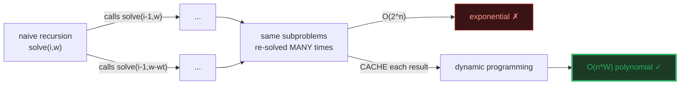
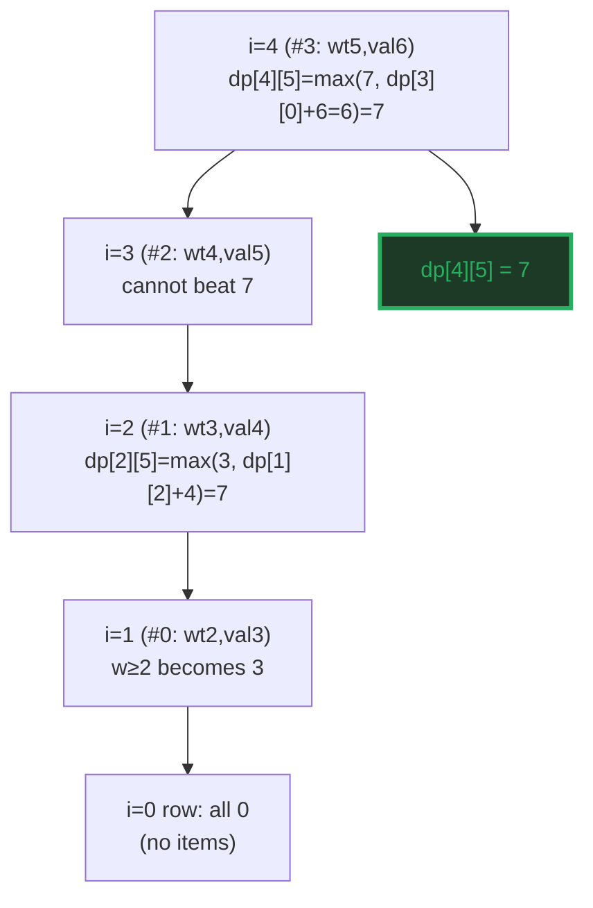
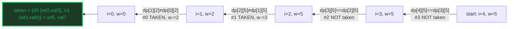
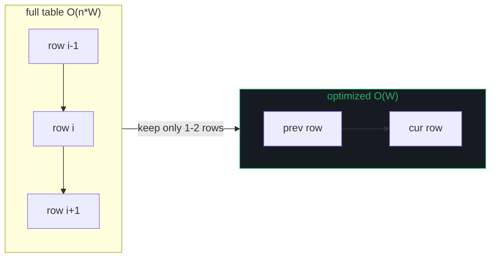
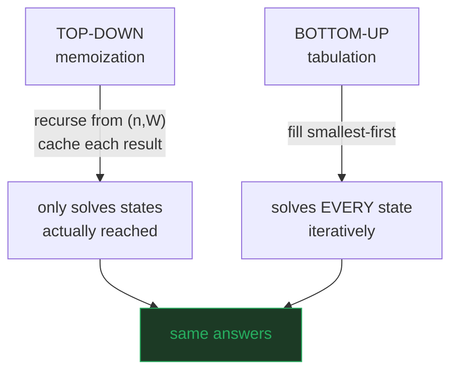
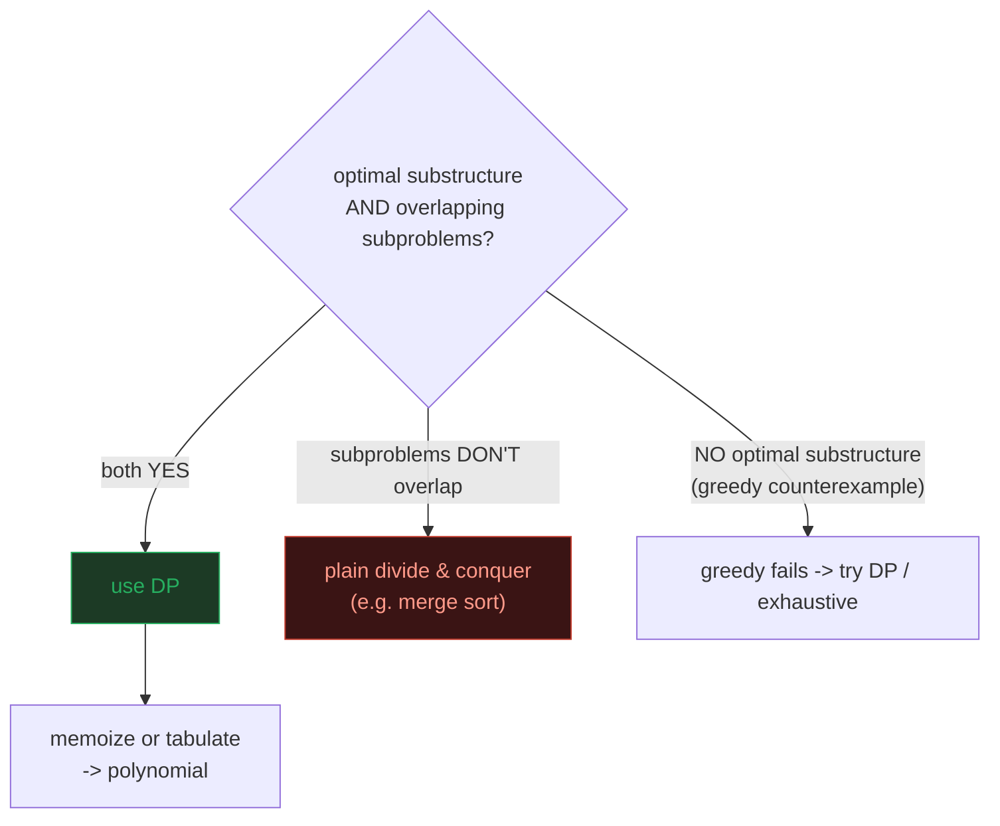

# Dynamic Programming — 0/1 Knapsack & LCS — A Visual, Worked-Example Guide

> **Companion code:** [`dp_knapsack_lcs.py`](./dp_knapsack_lcs.py). **Every
> number, dp table, and backtrack in this guide is printed by
> `python3 dp_knapsack_lcs.py`** — nothing is hand-computed.
>
> **Live animation:** [`dp_knapsack_lcs.html`](./dp_knapsack_lcs.html) — open in
> a browser: fill the knapsack and LCS tables cell-by-cell, drag the capacity,
> watch backtracking trace the chosen items / the common subsequence.

---

## 0. TL;DR — the one idea

> **The "stop recomputing the same subproblem" analogy (read this first):**
> Dynamic programming is the cure for a specific disease — a recursive solution
> that solves the **same** small subproblems **over and over**. Two symptoms
> must be present (CLRS §15.3); when both are, DP turns exponential time into
> polynomial:
> - **Optimal substructure** — the optimal answer to the whole is built from
>   optimal answers to smaller pieces.
> - **Overlapping subproblems** — the same subproblem is reached by many paths,
>   so a naive recursion re-solves it exponentially often.

| problem | subproblem | distinct subproblems | naive | **DP** |
|---|---|---|---|---|
| 0/1 knapsack | best value, first `i` items, cap `w` | `n · W` | O(2ⁿ) | **O(n·W)** |
| LCS | LCS of prefixes `X[..i]`, `Y[..j]` | `m · n` | O(2ᵐ⁺ⁿ) | **O(m·n)** |

A naive knapsack recursion is **O(2ⁿ)** (each item: take or skip → a binary tree
of depth `n`). With memoization the distinct subproblems shrink to **O(n·W)** —
at `n=40, W=5`, that is `2⁴⁰ ≈ 10¹²` calls versus `200`.



---

### Glossary (plain English — refer back any time)

| Term | Plain meaning |
|---|---|
| **`n`, `W`** | Knapsack: number of items (`n=4`) and weight capacity (`W=5`). |
| **`wt[i]`, `val[i]`** | Weight and value of item `i` (0-indexed). |
| **`dp[i][w]`** | Knapsack cell = max value using the **first `i` items** at capacity `w`. |
| **backtrack** | Re-walk a finished table from `dp[n][W]` to recover **which** items were taken. |
| **`m`, `n`** | LCS: lengths of the two strings `X` and `Y`. |
| **`dp[i][j]`** | LCS cell = length of the LCS of `X[0..i-1]` and `Y[0..j-1]`. |
| **match cell** | An LCS `dp[i][j]` where `X[i-1]==Y[j-1]`; recurrence adds 1 and jumps diagonally. |
| **space opt.** | Knapsack needs only the previous row → **O(W)**; LCS → **O(min(m,n))**. Loses backtracking. |
| **brute force** | Enumerate all subsets / subsequences, take the best. O(2ⁿ). Here, **gold reference only**. |

---

## 1. 0/1 Knapsack — build the table, backtrack the items

Each row `i` answers *"best value using the first `i` items"*; each column `w`
answers *"with capacity `w`"*. The recurrence looks at the previous row only —
that is what makes it DP.

> **Recurrence (CLRS 0-1 knapsack):**
> ```
> dp[i][w] = dp[i-1][w]                                  if wt[i] > w
> dp[i][w] = max(dp[i-1][w], dp[i-1][w-wt[i]] + val[i]) otherwise
> ```
> Row `i=0` (no items) is all zero. The answer is `dp[n][W]`.

> From `dp_knapsack_lcs.py` Section A — `wt=[2,3,4,5]`, `val=[3,4,5,6]`, `W=5`:

```
Full dp table (cell = best value for first i items, capacity w):
            w=0    w=1    w=2    w=3    w=4    w=5
    i=0       0      0      0      0      0      0
i=1(#0)       0      0      3      3      3      3
i=2(#1)       0      0      3      4      4      7
i=3(#2)       0      0      3      4      5      7
i=4(#3)       0      0      3      4      5      7

  dp[n][W] = dp[4][5] = 7   <- OPTIMAL VALUE

Brute force (all 2^4=16 subsets): best value = 7, items = (0, 1)
[check] dp[n][W] == brute-force value?  True  (7 == 7)
```



> **Reading row 2, column 5:** should we take item #1 (wt=3, val=4)? The cell is
> `max(dp[1][5], dp[1][5-3] + 4) = max(3, dp[1][2]+4) = max(3, 3+4) = 7`. The
> "take" branch reads `dp[1][2]` — the **previous row, two columns left**.

### Backtracking — which items were taken?

The value `7` alone is useless if you need the **set**. Backtrack from
`dp[n][W]`: if a cell differs from the one above it, item `i-1` was taken.

> From `dp_knapsack_lcs.py` Section A — backtracking `dp[4][5]`:

```
Backtrack from dp[4][5] to recover WHICH items: [0, 1]
  items taken = [0, 1]  -> total wt = 5, total val = 7
  (a cell changed between row i-1 and row i => item i-1 was taken)

[check] backtracked value 7 == dp[4][5] == brute:  OK
```



> **Items {#0, #1}**: wt 2+3 = 5 ≤ W, val 3+4 = **7**. The capacity is fully used.

---

## 2. LCS — the same idea on two strings

`dp[i][j]` = LCS length of `X[0..i-1]` and `Y[0..j-1]`. On a match, the LCS
grows diagonally; on a mismatch, it carries forward the best of dropping one
character from either side.

> **Recurrence (CLRS LCS):**
> ```
> dp[i][j] = dp[i-1][j-1] + 1            if X[i] == Y[j]   (match)
> dp[i][j] = max(dp[i-1][j], dp[i][j-1]) otherwise          (mismatch)
> ```
> Row/column 0 (empty prefix) is all zero. The answer is `dp[m][n]`.

> From `dp_knapsack_lcs.py` Section B — `X="ABCDGH"`, `Y="AEDFHR"`:

```
Full dp table (match cells are where the LCS grows diagonally):
          j=0 ε  j=1 A  j=2 E  j=3 D  j=4 F  j=5 H  j=6 R
  i=0 ε       0      0      0      0      0      0      0
  i=1 A       0      1      1      1      1      1      1
  i=2 B       0      1      1      1      1      1      1
  i=3 C       0      1      1      1      1      1      1
  i=4 D       0      1      1      2      2      2      2
  i=5 G       0      1      1      2      2      2      2
  i=6 H       0      1      1      2      2      3      3

  dp[m][n] = dp[6][6] = 3   <- LCS LENGTH

Brute force (all subsequences of the shorter string): best length = 3
[check] dp[m][n] == brute-force length?  True  (3 == 3)
```

> **The three diagonal jumps are the LCS:** `dp[1][1]` (A=A → 1), `dp[4][3]`
> (D=D → 2), `dp[6][5]` (H=H → 3). Each match adds 1 over the diagonal neighbor
> `dp[i-1][j-1]`; mismatches just propagate the running maximum.

### Backtracking — recovering "ADH"

Walk from `dp[m][n]`: on a match, take the char and go diagonal; else step
toward the larger neighbor (ties go up).

> From `dp_knapsack_lcs.py` Section B — backtracking `dp[6][6]`:

```
Backtrack from dp[6][6]: on a match go diagonal + take the char;
  else step toward the larger neighbor. Recovered LCS = "ADH"
[check] "ADH" is a subsequence of both X and Y, length 3:  OK
```



```mermaid
graph RL
    S["start: i=6, j=6<br/>H≠R → step left"] --> A["i=6, j=5"]
    A -->|"H==H ✓ take H<br/>go diagonal"| B["i=5, j=4"]
    B -->|"G≠F → step up"| C["i=4, j=4"]
    C -->|"D≠F → step left"| D["i=4, j=3"]
    D -->|"D==D ✓ take D<br/>go diagonal"| E["i=3, j=2"]
    E -->|"step up/around"| F["i=1, j=1"]
    F -->|"A==A ✓ take A<br/>go diagonal"| G["i=0, j=0"]
    G --> OUT["reversed H,D,A → LCS = ADH"]
    style OUT fill:#1c3a25,stroke:#27ae60,stroke-width:3px,color:#27ae60
```

> **"ADH"** is a subsequence of both `ABCDGH` (positions 1,4,6) and `AEDFHR`
> (positions 1,3,5). No common subsequence is longer — brute force confirms 3.

---

## 3. Space optimization — O(W) and O(min(m,n))

The recurrence reads **only the previous row**. So the whole table is never
needed — just two rows, or even one with care.

> From `dp_knapsack_lcs.py` Section C — space optimization:

```
Knapsack O(W): one array of size W+1 = 6, scanned right-to-left.
  final row dp[w] = [0, 0, 3, 4, 5, 7]
  dp[W] = 7  (vs full table dp[n][W] = 7)
[check] O(W) result 7 == 2-D result 7:  OK

LCS O(min(m,n)): two rows over the shorter string. X="ABCDGH" (len 6), Y="AEDFHR" (len 6).
  row length = min(m,n)+1 = 7; final cell = 3
[check] O(min(m,n)) result 3 == 2-D result 3:  OK
```



> **Why knapsack scans RIGHT-to-LEFT:** `dp[w]` on iteration `i` needs
> `dp[i-1][w-wt[i]]` — the **previous row, to the left**. Scanning left→right
> would overwrite that cell before the larger `w` reads it → an item could be
> taken **twice**. Right→left reads only cells still holding previous-row values.
>
> **Trade-off:** with only two rows you can read the answer but **cannot
> backtrack** (the path needs the full history). Use the full table when you must
> reconstruct the items / subsequence itself.

---

## 4. Top-down (memoization) vs bottom-up (tabulation)

Same recurrence, two evaluation orders. The answers are identical — the choice
is about convenience and constants.

> From `dp_knapsack_lcs.py` Section D — both orders agree:

```
  BOTTOM-UP (tabulation): solve smallest-first, fill a table iteratively.
    + no recursion depth limit   + great cache locality
    - solves EVERY subproblem even ones the answer never needs

  TOP-DOWN (memoization): recurse from the top; cache each result;
    never re-solves a subproblem.
    + only solves subproblems actually reached
    - recursion overhead / stack depth

  knapsack  bottom-up = 7, top-down = 7  -> match
  LCS       bottom-up = 3, top-down = 3  -> match

[check] both orders agree on knapsack (7) and LCS (3):  OK
```



> **Rule of thumb (CLRS §15.3):** top-down is easier to write and wastes no work
> on unreachable states; bottom-up is faster in practice and avoids deep
> recursion. For knapsack all `n·W` states are reachable, so both do exactly the
> same work — the choice is taste.

---

## 5. When to use DP — the two requirements

DP applies **only** when **both** properties hold. Check both before reaching for
a table:

> From `dp_knapsack_lcs.py` Section E — pattern recognition:

```
  1. OPTIMAL SUBSTRUCTURE: the optimal solution contains optimal
     solutions to subproblems.
       knapsack: best value with first i items = best of (skip item i)
         and (take item i + best of first i-1 at reduced capacity).
       LCS: if X[i]==Y[j], the LCS ends in that char + LCS of the
         prefixes; if not, it's the longer of dropping one char.

  2. OVERLAPPING SUBPROBLEMS: the same subproblem recurs along many
     paths, so a naive recursion re-solves it exponentially often.

| problem  | subproblem        | distinct subproblems | naive   | DP      |
|----------|-------------------|----------------------|---------|---------|
| knapsack | best(first i, cap)| n * W                | O(2^n)  | O(n*W)  |
| LCS      | LCS(X[..i],Y[..j])| m * n                | O(2^m+n)| O(m*n)  |

Anti-pattern: if subproblems do NOT overlap (e.g. merge sort, where
each half is solved once), memoization buys nothing -> plain D&C.
```



> **Anti-pattern:** if subproblems do **not** overlap (e.g. merge sort, where
> each half is solved once), memoization buys nothing → plain divide & conquer.
> And if there is **no** optimal substructure (a greedy choice painted you into a
> corner), DP cannot help either — that is the signal that a greedy algorithm is
> wrong and you need the full recurrence.

---

## 6. Complexity summary

| operation | knapsack | LCS |
|---|---|---|
| bottom-up | O(n·W) time, O(n·W) space | O(m·n) time, O(m·n) space |
| space-optimized | O(n·W) time, **O(W) space** | O(m·n) time, **O(min(m,n)) space** |
| top-down memo | O(n·W) time, O(n·W) space | O(m·n) time, O(m·n) space |
| backtrack (full table) | O(n) | O(m+n) |
| brute force (reference) | O(2ⁿ) | O(2ᵐ⁺ⁿ) |

> Knapsack's `O(n·W)` is **pseudo-polynomial**: `W` is a number, so the runtime
> grows with the *magnitude* of `W`, not the *length* of its representation.
> That is why 0/1 knapsack is **NP-hard** in the size of its input, yet fast in
> practice when `W` is modest.

---

### Reproducibility — the gold check

Every table and backtrack above is printed verbatim by
`python3 dp_knapsack_lcs.py`, which cross-checks every method against brute force
at the end of the run:

> From `dp_knapsack_lcs.py` Section E — the gold check:

```
GOLD CHECK - every method must agree with brute force:
  knapsack:
    2-D table   = 7
    1-D space   = 7
    top-down    = 7
    brute force = 7  (items (0, 1))
    -> OK
  LCS:
    2-D table   = 3
    1-D space   = 3
    top-down    = 3
    brute force = 3
    -> OK

GOLD CHECK: OK - knapsack=7, LCS="ADH" (len 3)
```

`dp_knapsack_lcs.html` re-runs **both** recurrences in JavaScript with the
identical formulas and inputs, and re-checks these exact values — the green
`check: OK` badge confirms the page matches the `.py` exactly.
