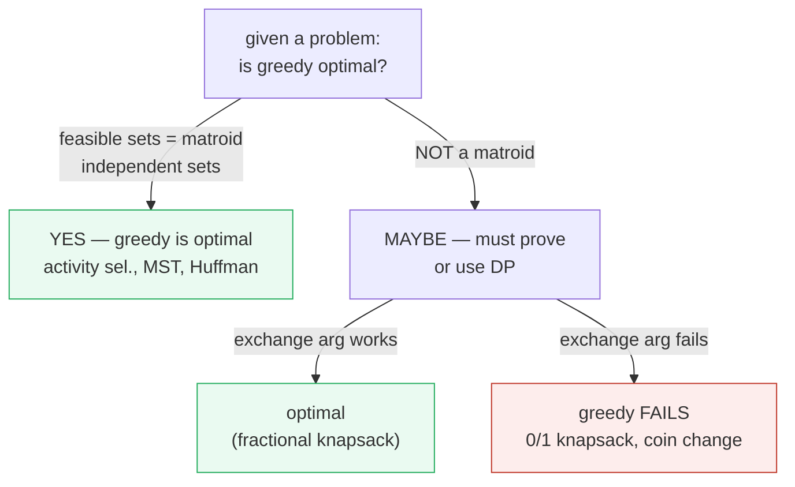
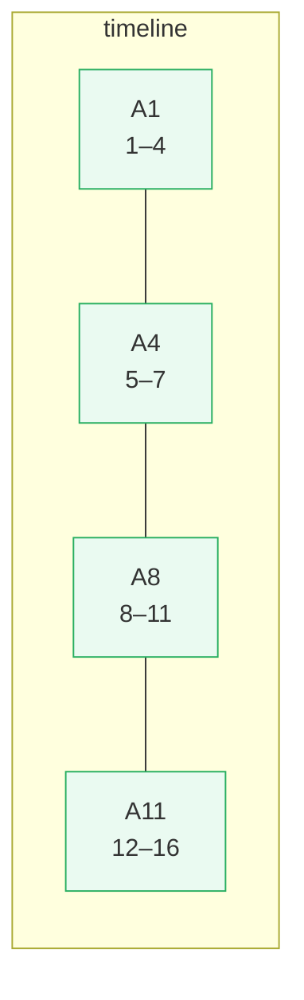
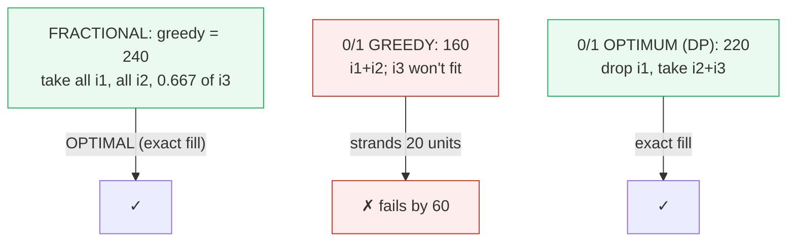
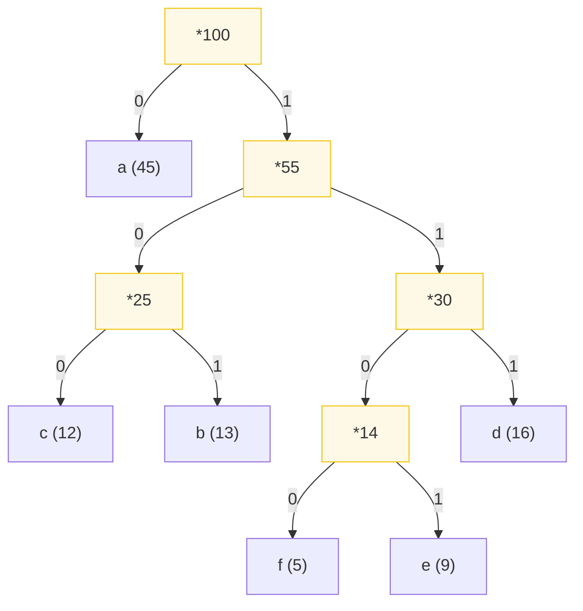
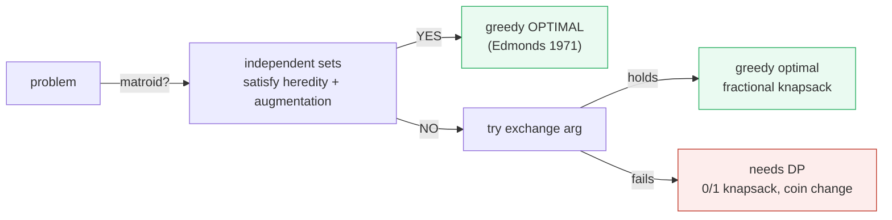

# Greedy Algorithms — A Visual, Worked-Example Guide (When Greedy Works & Fails)

> **Companion code:** [`greedy.py`](./greedy.py). **Every number and worked
> example in this guide is printed by `python3 greedy.py`** — nothing is
> hand-computed.
>
> **Live companion:** [`greedy.html`](./greedy.html) — open in a browser. It
> re-runs activity selection, the knapsack comparison, and Huffman in JS with
> the *identical* logic, and gold-checks the counts against the `.py`.

---

## 0. TL;DR — the always-grab-the-best-looking-bite rule

> **The intuition (read this first):** A **greedy** algorithm builds a solution
> one step at a time: at each step it makes the choice that looks best **right
> now** (locally optimal) and **never undoes it**. It does not look ahead and
> never backtracks.
>
> - **When it works:** the locally-best choices chain up into a **globally-best**
>   solution. Examples: activity selection, Huffman codes, fractional knapsack,
>   Dijkstra, Kruskal's MST.
> - **When it fails:** a choice that is best now paints you into a corner later,
>   so greedy is worse than optimal. Classic: **0/1 knapsack** and **coin
>   change** with weird denominations.

The whole question this bundle answers: **how do you know, for a given problem,
whether greedy is optimal?** Two answers, both demonstrated below:

1. An **exchange argument** — assume an optimum differs from greedy, *swap* a
   greedy choice in, show the result is no worse (Section 5).
2. **Matroid theory** (Edmonds 1971) — a problem whose feasible solutions are
   the independent sets of a matroid **always** has an optimal greedy solution.
   Activity selection and MST qualify; 0/1 knapsack does **not**.



> One plain sentence: greedy is optimal **iff** you can prove that swapping a
> greedy choice into any optimum never makes it worse — equivalently, iff the
> problem lives on a matroid.

---

### Glossary (plain English — refer back any time)

| Term | Plain meaning |
|---|---|
| **greedy choice** | The locally-best option taken at each step, never undone. |
| **feasible** | Satisfies all constraints (no two activities overlap; knapsack weight ≤ capacity). |
| **optimal** | No other feasible solution has a better objective value. |
| **exchange argument** | A proof: swap a greedy choice into an optimum and show the objective cannot get worse. |
| **matroid** | A set system `(S, independent_sets)` with heredity + augmentation. Greedy is optimal on every matroid. |
| **fractional knapsack** | You may take a *fraction* of an item → greedy by value/weight is optimal. |
| **0/1 knapsack** | Take ALL of an item or NONE → greedy by density is **not** optimal (needs DP). |
| **canonical coins** | A coin system (like US 25,10,5,1) where greedy gives the fewest coins. |

---

## 1. Activity selection — greedy that WORKS

The canonical greedy-that-is-optimal example (CLRS 16.1). Given a set of
activities each with a `(start, finish)` interval, pick the **largest**
mutually-compatible subset (no two overlap).

**Greedy rule:** sort by **finish time**, then repeatedly pick the next activity
whose `start ≥ last chosen finish`.

> From `greedy.py` **Section A** (activities + the greedy trace):
>
> ```
> | name | start | finish |
> |------|-------|--------|
> | A1   | 1     | 4      |
> | A2   | 3     | 5      |
> | A3   | 0     | 6      |
> | A4   | 5     | 7      |
> | A5   | 3     | 9      |
> | A6   | 5     | 9      |
> | A7   | 6     | 10     |
> | A8   | 8     | 11     |
> | A9   | 8     | 12     |
> | A10  | 2     | 14     |
> | A11  | 12    | 16     |
>
>   selections:
>     + A1 (s=1, f=4)   [start 1 >= last_finish -1]
>     + A4 (s=5, f=7)   [start 5 >= last_finish 4]
>     + A8 (s=8, f=11)   [start 8 >= last_finish 7]
>     + A11 (s=12, f=16)   [start 12 >= last_finish 11]
>
>   greedy picks 4 activities: ['A1', 'A4', 'A8', 'A11']
>   exhaustive optimum (try all 2^11 subsets) = 4
>   [check] greedy == optimum? True
> ```



Greedy picks **4** activities, and the brute-force search over all `2^11 = 2048`
subsets confirms **4 is the maximum**. Picking the earliest-finishing activity
each time leaves the most room for the rest — that is the entire insight, and
Section 5 proves it rigorously.

---

## 2. Fractional knapsack WORKS, 0/1 knapsack FAILS

The cleanest illustration of the greedy works/fails boundary: **the same three
items, two different rules.**

Items: `i1=(60,10)`, `i2=(100,20)`, `i3=(120,30)`, capacity `W=50`. Value/weight
densities: 6.00, 5.00, 4.00 (descending).

> From `greedy.py` **Section B**:
>
> ```
> --- (1) FRACTIONAL knapsack: greedy by value/weight is OPTIMAL ---
>   greedy takes: [('i1', 1.0), ('i2', 1.0), ('i3', 0.667)]
>   total value   = 240
>
> --- (2) 0/1 knapsack: greedy-by-DENSITY is NOT optimal ---
>   greedy-by-density takes ['i1', 'i2']: value = 160
>   DP optimum takes ['i2', 'i3']: value = 220
>
>   greedy value 160  vs  optimum 220
>   [check] greedy == optimum? False  (FALSE -> greedy FAILS by 60)
> ```



**Why greedy fails on 0/1:** taking the best-density item (i1) first strands 20
units of capacity — there's no way to fit the bulky-but-valuable i3 afterward.
The optimum **drops i1 entirely** to make room for i2+i3. Greedy has no
mechanism to "un-choose" i1, which is exactly why **0/1 knapsack needs dynamic
programming, not greed** (🔗 see `dp_knapsack_lcs.py`).

| variant | rule | greedy value | optimum | greedy optimal? |
|---|---|---|---|---|
| **fractional** | take fractions, sort by value/weight | **240** | 240 | ✅ yes |
| **0/1** | take all-or-nothing, sort by value/weight | 160 | **220** | ❌ no (fails by 60) |

---

## 3. Huffman coding — greedily merge the two smallest

Huffman coding (CLRS 16.3) builds the **optimal** binary prefix code by
repeatedly merging the two lowest-frequency nodes. Frequencies (from a
1000-char sample): `a:45, b:13, c:12, d:16, e:9, f:5`.

> From `greedy.py` **Section C** (the merge trace):
>
> ```
> merge steps:
>   step 1: merge f(5) + e(9) -> *14
>   step 2: merge c(12) + b(13) -> *25
>   step 3: merge *14(14) + d(16) -> *30
>   step 4: merge *25(25) + *30(30) -> *55
>   step 5: merge a(45) + *55(55) -> *100
> ```



> From `greedy.py` **Section C** (the code table):
>
> ```
> | char | freq | code | bits = freq x len |
> |------|------|------|------------------|
> | a    | 45   | 0    | 45               |
> | c    | 12   | 100  | 36               |
> | b    | 13   | 101  | 39               |
> | f    | 5    | 1100 | 20               |
> | e    | 9    | 1101 | 36               |
> | d    | 16   | 111  | 48               |
>
> weighted path length (total bits) = 224
> vs. fixed 3-bit code for 6 chars  = 300  (Huffman saves 76 bits)
> [check] Huffman WPL == 224 (CLRS value)? True
> [check] prefix-free? True  (no codeword is a prefix of another)
> ```

The most frequent character (`a`, 45) gets the shortest code (1 bit); the rarest
(`f`, 5) gets the longest (4 bits). The weighted path length is **224 bits**,
matching the CLRS textbook value and **saving 76 bits** vs. a fixed 3-bit code.
Huffman is provably optimal over **all** binary prefix codes (CLRS thm 16.4).

---

## 4. Coin change — greedy works for US coins, fails for [4,3,1]

Greedy coin change ("always take the largest coin that fits") is optimal **only**
for *canonical* coin systems. The US system `{25,10,5,1}` is canonical; an
arbitrary system like `{4,3,1}` is not.

> From `greedy.py` **Section D**:
>
> ```
> --- (1) US coins [25,10,5,1]: greedy is OPTIMAL (canonical system) ---
>   amount = 40, coins = [25, 10, 5, 1]
>   greedy : [25, 10, 5]  = 3 coins
>   optimum: [25, 10, 5] = 3 coins
>   [check] greedy == optimum? True
>
> --- (2) Arbitrary coins [4,3,1]: greedy FAILS on amount 6 ---
>   amount = 6, coins = [4, 3, 1]
>   greedy : [4, 1, 1]  = 3 coins   (4, then 1+1: 4+1+1=6)
>   optimum: [3, 3] = 2 coins   (3+3=6)
>   [check] greedy == optimum? False  (FALSE -> greedy uses 1 extra coin(s))
> ```

| coins | amount | greedy | optimum | greedy optimal? |
|---|---|---|---|---|
| `{25,10,5,1}` | 40 | `[25,10,5]` = 3 | 3 | ✅ yes |
| `{4,3,1}` | 6 | `[4,1,1]` = 3 | `[3,3]` = **2** | ❌ no (1 extra) |

**Why:** the largest coin (4) eats the budget, leaving 2 which only 1's can
fill. The optimum ignores the 4 entirely and uses two 3's. Greedy commits to the
4 immediately and cannot recover — exactly like 0/1 knapsack. General coin change
needs **DP**.

---

## 5. Exchange argument — how you PROVE greedy is optimal

The exchange argument is the standard proof technique for greedy optimality. In
four lines:

1. Let `G` be the greedy solution, `O` any optimal solution.
2. Suppose `O` differs from `G`; let `a_G` be the first greedy choice where they
   diverge, and `a_O` the choice `O` made instead.
3. **Swap:** replace `a_O` with `a_G` in `O`. Show the result is still feasible
   **and** its objective is no worse.
4. By induction over choices, `G` is optimal.

> From `greedy.py` **Section E** (applied to activity selection):
>
> ```
> Proof (exchange):
>   - Let O be any optimal set, and let x = the activity in O that
>     finishes earliest. Greedy picked f_min, so finish(f_min) <= finish(x).
>   - Replace x with f_min: f_min finishes no later than x did, so every
>     other activity in O (all start after finish(x)) is STILL compatible
>     with f_min. Feasible, same size -> still optimal.
>   - So there is an optimum containing f_min. Strip it off and repeat
>     on the remaining subproblem. By induction, greedy is optimal.
> ```

**Matroid view (Edmonds 1971):** a problem is greedily-solvable **iff** its
feasible solutions are the independent sets of a matroid. Activity selection,
MST (Kruskal), and scheduling on matroids all qualify; 0/1 knapsack and general
coin change do **not** — which is exactly why greedy fails on them in Sections 2
and 4.



---

## 6. Gold check (how the bundle stays honest)

Every number above is reproducible from one command:

```bash
python3 greedy.py          # prints all sections + gold check
python3 greedy.py > greedy_output.txt   # capture
```

The gold contract: **greedy activity-selection count == exhaustive optimum**,
verified by brute force over all `2^11` subsets. The companion
[`greedy.html`](./greedy.html) re-runs the same greedy logic in JavaScript and
shows a green `[check: OK]` badge when its selection matches.

> From `greedy.py` **GOLD CHECK**:
>
> ```
> greedy selection     : ['A1', 'A4', 'A8', 'A11']  (4 activities)
> exhaustive optimum   : 4 activities  (checked all 2^11 subsets)
> GOLD (pinned for greedy.html): greedy_count = 4, optimum = 4,
>   selected = ['A1', 'A4', 'A8', 'A11']
> [check] greedy == optimum? OK
> GOLD scalars: 0/1 greedy=160, 0/1 opt=220, fractional=240, huffman_wpl=224
> [check] 0/1 greedy FAILS (160 < 220)? True
> [check] fractional greedy == 240? True
> [check] Huffman WPL == 224? True
> ```

| quantity | value | source |
|---|---|---|
| activity-selection greedy count | **4** = `[A1, A4, A8, A11]` | Section 1 / gold |
| activity-selection exhaustive optimum | **4** | gold (2^11 subsets) |
| fractional knapsack greedy value | **240** (optimal) | Section 2 |
| 0/1 knapsack greedy value | **160** (fails) | Section 2 |
| 0/1 knapsack DP optimum | **220** | Section 2 |
| Huffman weighted path length | **224** bits (saves 76) | Section 3 |
| coin change `[4,3,1]` greedy / opt | **3 / 2** (fails by 1) | Section 4 |

---

## Further reading

- **CLRS**, *Introduction to Algorithms*, 3rd ed. — ch.16 (Greedy Algorithms):
  §16.1 activity selection, §16.2 knapsack, §16.3 Huffman, §16.4 matroids.
- **Edmonds** (1971), "Matroids and the greedy algorithm," *J. Res. NBS 69B* —
  the theorem that greedy is optimal **iff** the feasible sets form a matroid.
- **Huffman** (1952), "A Method for the Construction of Minimum-Redundancy
  Codes," *Proc. IRE* — the original paper.
- 🔗 `dp_knapsack_lcs.py` — the dynamic-programming fix for the 0/1 knapsack and
  LCS problems where greedy fails.
