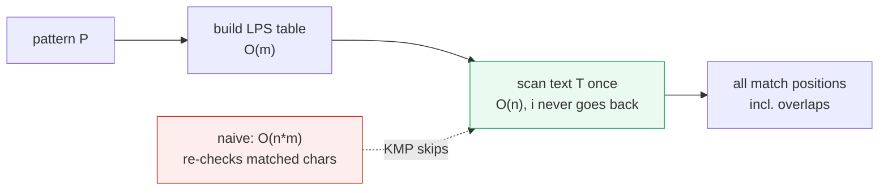
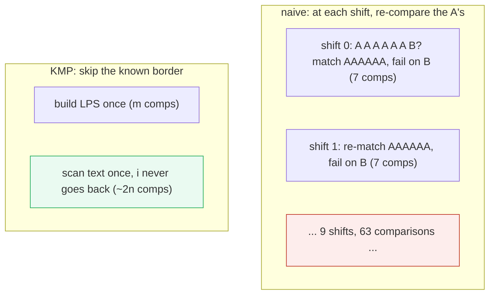
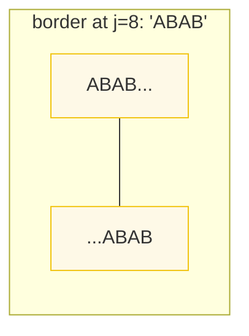
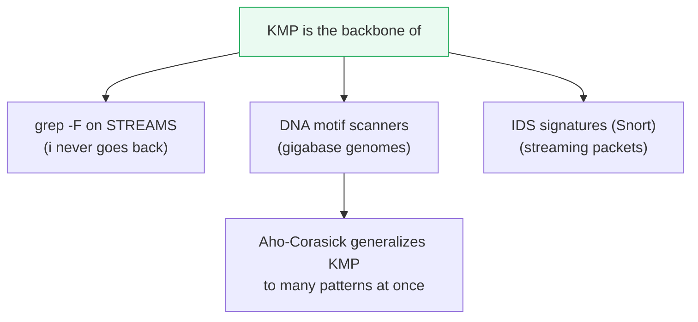

# KMP String Matching — A Visual, Failure-Function, Worked-Example Guide

> **Companion code:** [`kmp_string.py`](./kmp_string.py). **Every number and
> table in this guide is printed by `python3 kmp_string.py`** — nothing is
> hand-computed.
>
> **Live companion:** [`kmp_string.html`](./kmp_string.html) — open in a browser.
> It re-runs the LPS build and KMP search in JS with the *identical* logic, and
> gold-checks the match positions against the `.py`.

---

## 0. TL;DR — never re-read what you already know

> **The intuition (read this first):** When the naive matcher hits a **mismatch**
> after matching `k` characters, it throws away *all* of that work, shifts the
> pattern by one, and re-compares those same `k` characters. On a nasty input
> (long runs of `A`) this is **O(n·m)**. **KMP's insight:** those `k` matched
> characters are *known*. Somewhere inside the matched prefix there may be a
> shorter **prefix that is also a suffix** (a *border*). KMP shifts the pattern
> so that border lines up and **does not re-check it** — the text pointer never
> moves backwards.
>
> The amount you may safely skip is read off a precomputed table, the **failure
> function** (a.k.a. **LPS** — Longest Proper Prefix which is also a Suffix).

KMP cuts string search from **O(n·m)** worst case down to **O(n+m)** — `O(m)` to
build the LPS table, `O(n)` to scan the text. Because the text pointer never
goes backwards, KMP can search **streams too large to re-read** (grep on pipes,
DNA genomes, IDS signatures).



> One plain sentence: KMP precomputes, for every position in the pattern, how
> much of the already-matched prefix is *reusable* after a mismatch — so it never
> re-compares a text character.

---

### Glossary (plain English — refer back any time)

| Term | Plain meaning |
|---|---|
| **pattern** | The short string `P` (length `m`) we search for. |
| **text** | The long string `T` (length `n`) we search inside. |
| **naive match** | Try `P` at every position, compare char-by-char, shift by one on mismatch. O(n·m). |
| **failure function (LPS)** | `failure[j]` = length of the longest *proper* prefix of `P[0..j]` that is also a suffix of `P[0..j]`. |
| **border** | A string that is both a proper prefix and a suffix of `P[0..j]`. |
| **shift** | On a mismatch at index `j`, set `j = failure[j-1]`; the text pointer `i` does **not** move back. |

---

## 1. Naive matching — the O(n·m) worst case KMP kills

The classic worst case: a text of all `A`s and a pattern `A…AB`.

> From `kmp_string.py` **Section A**:
>
> ```
> text    = 'AAAAAAAAAAAAAAA'   (n = 15)
> pattern = 'AAAAAAB'   (m = 7)
>
> matches found : []
> comparisons   : 63
> upper bound   : (n-m+1)*m = (15-7+1)*7 = 63
> [check] comps <= (n-m+1)*m? True
> ```

Naive tries the pattern at each of the 9 starting positions; at each it matches
the six `A`s then fails on the `B`, shifts by one, and **re-compares all six
A's**. That redundant re-checking — `9 × 7 = 63` comparisons — is precisely what
KMP eliminates.



---

## 2. The LPS (failure function) for `ABABCABAB` — the CLRS example

`failure[j]` answers: *of the prefix `P[0..j]`, what is the longest proper prefix
that is also a suffix?* Building it is **O(m)** and is done once per pattern.

> From `kmp_string.py` **Section B**:
>
> ```
> pattern = 'ABABCABAB'  (length 9)
>
> | j | char | P[0..j]      | longest border | failure[j] |
> |---|------|--------------|----------------|------------|
> | 0 | A    | A            |                | 0          |
> | 1 | B    | AB           |                | 0          |
> | 2 | A    | ABA          | A              | 1          |
> | 3 | B    | ABAB         | AB             | 2          |
> | 4 | C    | ABABC        |                | 0          |
> | 5 | A    | ABABCA       | A              | 1          |
> | 6 | B    | ABABCAB      | AB             | 2          |
> | 7 | A    | ABABCABA     | ABA            | 3          |
> | 8 | B    | ABABCABAB    | ABAB           | 4          |
>
> LPS table = [0, 0, 1, 2, 0, 1, 2, 3, 4]
> [check] LPS == [0,0,1,2,0,1,2,3,4] (CLRS)? True
> ```

Reading the table: at `j=8`, `failure[8]=4` means the 9-char `ABABCABAB` has a
4-char border `ABAB`. On a mismatch after matching up to `j=8`, KMP jumps `j` to
`failure[7]=3` — it **already knows** `ABA` lines up, so it skips re-checking
them.



---

## 3. KMP matching — use LPS to skip comparisons

Search for `ABABCABAB` in `ABABDABACDABABCABAB`. KMP consults the LPS table on
every mismatch and **never moves the text pointer backwards**.

> From `kmp_string.py` **Section C**:
>
> ```
> text    = 'ABABDABACDABABCABAB'   (n = 19)
> pattern = 'ABABCABAB'   (m = 9)
>
> LPS table        : [0, 0, 1, 2, 0, 1, 2, 3, 4]
> KMP matches      : [10]
> KMP comparisons  : 23
> naive comparisons: 29
> savings          : naive 29 -> KMP 23 (21% fewer)
> [check] KMP comps <= 2*n = 38? True
> [check] KMP matches == naive matches? True
>
> Match positions visualised (pattern occurs at index 10):
>   text   : ABABDABACDABABCABAB
>   pattern:           ABABCABAB
> ```

```
index:   0  1  2  3  4  5  6  7  8  9  10 11 12 13 14 15 16 17 18
text :   A  B  A  B  D  A  B  A  C  D  A  B  A  B  C  A  B  A  B
                                          └──────── match ────────┘
pattern:                                A  B  A  B  C  A  B  A  B
```

The saving is modest on this small example (21%), but it **widens dramatically**
on the all-`A` worst cases — see Section 4.

---

## 4. Naive O(n·m) vs KMP O(n+m) — comparison-count head-to-head

Counting actual char comparisons on growing inputs makes the asymptotic gap
concrete.

> From `kmp_string.py` **Section D**:
>
> ```
> | text          | pattern       |  n |  m | naive comps | KMP comps | ratio naive/KMP |
> |---------------|---------------|----|----|-------------|-----------|------------------|
> | AAAAAAAAAA    | AAAAB         | 10 | 5  | 30          | 16        | 1.9              |
> | AAAAAAAAAA... | AAAAAAB       | 20 | 7  | 98          | 34        | 2.9              |
> | AAAAAAAAAA... | AAAAAAAAB     | 40 | 9  | 288         | 72        | 4.0              |
> | AAAAAAAAAA... | AAAAAAAAAAB   | 80 | 11 | 770         | 150       | 5.1              |
> | ABABDABACD... | ABABCABAB     | 19 | 9  | 29          | 23        | 1.3              |
> | AAAAAABAAA... | AAAAAAB       | 21 | 7  | 63          | 21        | 3.0              |
>
> Big-O summary:
>   naive preprocessing: O(1)   search: O(n*m) worst case
>   KMP   preprocessing: O(m)   search: O(n)   worst case  ->  O(n+m) total
> ```

| input size | naive (O(n·m)) | KMP (O(n+m)) | ratio |
|---|---|---|---|
| n=10, m=5 | 30 | 16 | 1.9× |
| n=80, m=11 | **770** | **150** | **5.1×** |

Naive comparisons grow like `n·m` (quadratic in the `A`-runs); KMP stays near
`2n` (linear). On the 80-char all-`A` text with an 11-char `A…B` pattern, naive
does ~770 comparisons while KMP does ~150 — a 5× saving that **keeps widening**
as the input grows.

---

## 5. Applications — grep and bioinformatics (DNA motif search)

Two domains where KMP's **linear, streamable, never-go-back** scan matters:

> From `kmp_string.py` **Section E**:
>
> ```
> --- (1) grep-style literal search ---
> text    = 'the cat sat on the mat that the cat liked'
> pattern = 'cat'
> KMP finds 2 occurrence(s) at index(es) [4, 32]
>
> --- (2) bioinformatics: find a DNA motif (overlapping matches) ---
> genome = 'GATATATGCATATACTT'
> motif  = 'ATAT'
> KMP finds motif at index(es) [1, 3, 9]  (3 sites, incl. overlaps)
> naive finds motif at index(es) [1, 3, 9]
> [check] KMP == naive (incl. overlaps)? True
> ```

Note the **overlapping** sites: `ATAT` occurs at indices 1, 3, 9 (the one at 1
overlaps the one at 3). KMP's failure-function fallback is exactly what lets it
catch overlaps without re-scanning.



- **grep -F on a stream:** the text pointer never goes back, so KMP can search
  data too large to hold in memory (pipes, log tails).
- **DNA motif scanners:** search gigabase genomes for exact motifs; the `O(n+m)`
  guarantee (vs `O(n·m)`) is the difference between minutes and hours.
- **Intrusion detection (Snort):** precomputes LPS-style tables for thousands of
  literal attack signatures and streams packets past them.

---

## 6. Gold check (how the bundle stays honest)

Every number above is reproducible from one command:

```bash
python3 kmp_string.py          # prints all sections + gold check
python3 kmp_string.py > kmp_string_output.txt   # capture
```

The gold contract: **KMP finds exactly the same matches as the naive matcher** —
including overlapping ones — verified across an 11-case battery (worst-case
`A`-runs, overlaps, no-match, full-match, single-char, empty text/pattern). The
companion [`kmp_string.html`](./kmp_string.html) re-runs the same LPS build and
KMP search in JavaScript and shows a green `[check: OK]` badge when its results
match.

> From `kmp_string.py` **GOLD CHECK**:
>
> ```
> text                   pattern     naive          KMP            match?
> ------------------------------------------------------------------------
> ABABDABACDABABCABAB    ABABCABAB   [10]           [10]           OK
> AAAAAABAAAAAABAAA...   AAAAAAB     [0, 7, 14]     [0, 7, 14]     OK
> ABABABAB               ABAB        [0, 2, 4]      [0, 2, 4]      OK
> GATATATGCATATACTT      ATAT        [1, 3, 9]      [1, 3, 9]      OK
> AAAAAAAAAA             AAAA        [0,1,2,3,4,5,6] [0,1,2,3,4,5,6] OK
> XYZXYZXYZ              XYZXYZ      [0, 3]         [0, 3]         OK
> HELLO WORLD            XYZ         []             []             OK
> ABCDEFG                ABCDEFG     [0]            [0]            OK
> AAAA                   A           [0, 1, 2, 3]   [0, 1, 2, 3]   OK
>                        AB          []             []             OK
> AB                                 [0, 1, 2]      [0, 1, 2]      OK
>
> GOLD (pinned for kmp_string.html):
>   LPS('ABABCABAB')         = [0, 0, 1, 2, 0, 1, 2, 3, 4]
>   KMP('ABABDABACDABABCABAB','ABABCABAB') = [10], comps = 23
> [check] KMP == naive on all 11 cases? OK
> ```

| quantity | value | source |
|---|---|---|
| LPS table for `ABABCABAB` | **[0,0,1,2,0,1,2,3,4]** | Section 2 / gold |
| KMP match `ABABCABAB` in text | **[10]** | Section 3 / gold |
| KMP comparisons on that search | **23** (≤ 2n=38) | Section 3 |
| worst-case ratio (n=80, m=11) | **5.1×** (770 → 150) | Section 4 |
| KMP == naive on 11-case battery | **all OK** | gold |

---

## Further reading

- **Knuth, Morris, Pratt** (1977), "Fast Pattern Matching in Strings," *SIAM J.
  Comput.* 6(2):323–350 — the original KMP paper.
- **CLRS**, *Introduction to Algorithms*, 3rd ed. — §32 (String Matching),
  §32.4 for the failure-function analysis.
- **Aho & Corasick** (1975), "Efficient string matching," — generalizes KMP to
  searching for *many* patterns simultaneously (the basis of `grep -F` on
  dictionaries and IDS rule engines).
- **Sedgewick & Wayne**, *Algorithms*, 4th ed. — §5.3 substring search, with
  KMP state-machine diagrams.
