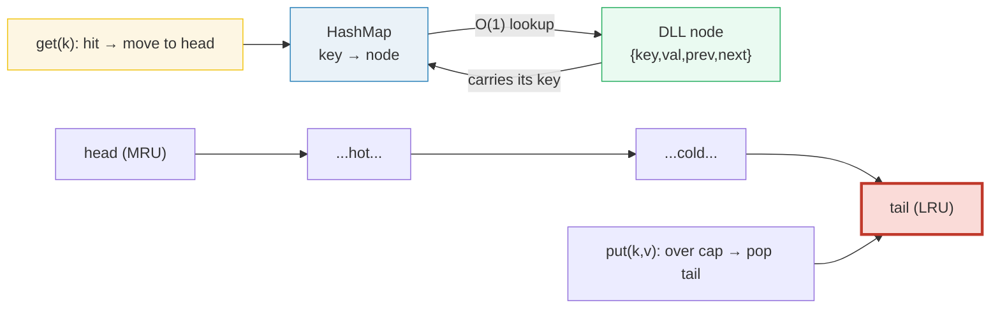
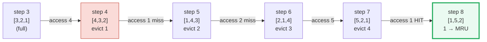
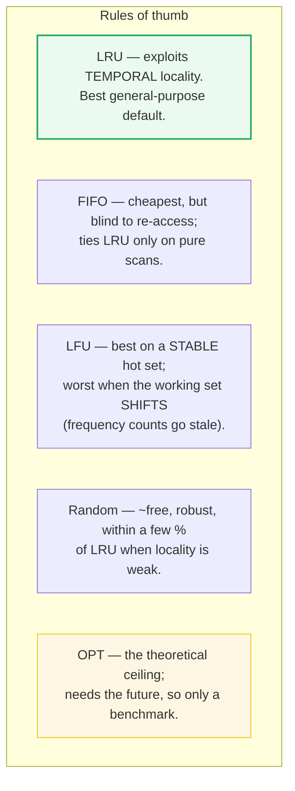

# LRU Cache (HashMap + Doubly Linked List) — A Visual, Worked-Example Guide

> **Companion code:** [`lru_cache.py`](./lru_cache.py). **Every number in this
> guide is printed by `python3 lru_cache.py`** — change the code, re-run,
> re-paste. Nothing here is hand-computed.
>
> **Live animation:** [`lru_cache.html`](./lru_cache.html) — open in a browser.
> Step through the access trace, watch the doubly linked list reorder and the
> tail get evicted, slide the capacity, and compare LRU/FIFO/LFU/Random hit
> rates — all gold-checked against the `.py`.
>
> **Source material:** CLRS *Introduction to Algorithms* (doubly-linked lists &
> hash tables, ch.10/11); Sedgewick & Wayne §3.4; Tanenbaum/Bos *Modern
> Operating Systems* (page replacement). Also 🔗 [`CHAINING.md`](./CHAINING.md)
> for the hash-table half, [`ARRAY_VS_LINKEDLIST.md`](./ARRAY_VS_LINKEDLIST.md)
> for the linked-list half, and [`AMORTIZED_RESIZE.md`](./AMORTIZED_RESIZE.md)
> for cost analysis.

---

## 0. TL;DR — two structures cross-referenced, so both halves are O(1)

An **LRU cache** holds at most `C` items and, when it must make room, evicts the
**L**east **R**ecently **U**sed one. To make `get` and `put` **both O(1)** it
keeps **two data structures pointing at each other**: a **HashMap** (`key →
node`) for O(1) "is it here?" lookup, and a **doubly linked list** (MRU at head
→ LRU at tail) for O(1) "who is coldest?" eviction. Each half supplies the O(1)
operation the other cannot do alone.



| Operation | Work done | Cost |
|---|---|---|
| **`get(k)`** hit | HashMap lookup + move node to head (6 pointer writes) | **O(1)** |
| **`get(k)`** miss | HashMap lookup → return −1 | **O(1)** |
| **`put(k,v)`** new | add node at head; if `len > C`, pop tail + delete map entry | **O(1)** |
| **`put(k,v)`** update | update value + move to head | **O(1)** |
| **space** | `C` list nodes + `C` map entries + 2 sentinels | **O(C)** |

> **The one-line proof of O(1):** the HashMap gives O(1) *find* (a dict probe),
> and because every node stores **both** `prev` and `next`, unlinking/relinking
> it is a **fixed 6 pointer writes** — no scan. The two sentinels (dummy head &
> tail) guarantee every real node has non-None neighbors, killing all edge cases.

### Glossary

| Term | Plain meaning |
|---|---|
| **capacity C** | max items the cache holds (the "desk" size); fixed at construction |
| **hit / miss** | requested key is / is not in the cache |
| **node** | one entry `{key, value, prev, next}` in the doubly linked list |
| **head** | the MOST-recently-used end; new/touched items go *after* it |
| **tail** | the LEAST-recently-used end; evictions cut the node *before* it |
| **sentinel** | a dummy head/tail node (holds no data) that removes all `None` edge cases |
| **recency** | a node's position in the DLL encodes *when* it was last used |
| **move-to-head** | unlink a node and re-insert after head → marks it MRU |
| **evict** | remove the tail node (the LRU victim) to make room on a miss |
| **locality** | "recently used ⇒ soon reused" — the assumption LRU exploits |

---

## A. The data structure — HashMap cross-referenced with a DLL

The cache is **two structures pointing at each other**: a HashMap (`key → node`,
the O(1) lookup half) and a doubly linked list (`head ↔ MRU … LRU ↔ tail`, the
O(1) recency half). The list uses **two sentinels** so the unlink/relink code is
just 4 fixed pointer writes with **no `None` checks**.

> From `lru_cache.py` Section A — layout:

```
   head <-> [3] <-> [2] <-> [1] <-> tail
     ^                            ^
     new/touched nodes            evictions cut HERE
     go in AFTER head             (the least recently used node)
```

> From `lru_cache.py` Section A:
>
> Built `cache(cap=3)` via `put(1),put(2),put(3)`: state (MRU→LRU) = `[3, 2, 1]`.
> `len(map)=3`; `head.next.key=3` (MRU); `tail.prev.key=1` (LRU).
> **`map[2] → node(key=2); node.prev.key=3, node.next.key=1`** — the map points
> at list nodes, and each node's `prev`/`next` let you walk in O(1) per step.

**Why BOTH halves?** A HashMap alone cannot answer *"who is least recent?"* (a
dict has no order of use). A DLL alone cannot answer *"is key k present?"* in
O(1) (you'd scan the list). Each half supplies the O(1) operation the other
lacks. The node carries its own key so an eviction can delete the matching map
entry in O(1) too. 🔗 The HashMap half is a plain hash table — see
[`CHAINING.md`](./CHAINING.md); the list half is a doubly linked list — see
[`ARRAY_VS_LINKEDLIST.md`](./ARRAY_VS_LINKEDLIST.md).

> From `lru_cache.py` Section A:
>
> **KEY FORMULAS:** `get(k): O(1) = map.get + (on hit) _move_to_head (6 pointer
> writes)`; `put(k,v): O(1) = map[k]=n + _add_head + (if over cap) _pop_tail +
> del map`; `space: O(C)`.
> `[check] state==[3,2,1], head.next==3 (MRU), tail.prev==1 (LRU)? OK`
> `[check] map[2].prev==3, map[2].next==1 (DLL neighbors wired)? OK`

---

## B. `get(key)` — HashMap lookup, then move-to-head on a hit

`get(k)` does two things, both O(1): **(1) LOOKUP** `node = map.get(k)` — an O(1)
hash-table probe; `node is None ⇔ miss`. **(2)** on a **hit only**, **REFRESH
RECENCY** `_move_to_head(node)` = `_remove` (2 pointer writes) + `_add_head`
(4 writes) = **6 writes total**, no scan.

> From `lru_cache.py` Section B — start state `[3, 2, 1]` (cap=3):

| case | call | what happens | state after |
|---|---|---|---|
| **HIT** | `get(1)` | `map.get(1)→node`; `_move_to_head` lifts the LRU/tail node 1 to MRU | `[1, 3, 2]` |
| **MISS** | `get(99)` | `map.get(99)→None`; return −1 immediately; state **unchanged** | `[1, 3, 2]` |

> `[check] get(1) returned 1 and state is now [1,3,2]? OK`
> `[check] get(99) returned -1 and state unchanged [1,3,2]? OK`

**The subtle point:** a hit is *not* free of side effects — it **reorders the
list**. That reordering *is* the recency bookkeeping, done eagerly so the LRU
victim is always sitting at the tail ready to evict in O(1). A miss does
nothing: you cannot "use" something that is not there. 🔗 Click a key and watch
the node jump to the head in [`lru_cache.html`](./lru_cache.html) panel ②.

---

## C. `put(key, value)` — add at head; evict tail if over capacity

`put` has three cases, all O(1):

> From `lru_cache.py` Section C — start empty, cap=3:

| case | call | preconditions | action | evicted | state after |
|---|---|---|---|---|---|
| **1 fresh, room** | `put(1,'a')` | key absent, size<C | create node, `map[1]=n`, `_add_head` | None | `[1]` |
| **2 update** | `put(2,'B')` | key present (cache full `[3,2,1]`) | update value, `_move_to_head` | None | `[2, 3, 1]` |
| **3 fresh, over cap** | `put(4,'d')` | key absent, size==C | `_add_head`; size would be 4>3 → `_pop_tail` cuts LRU=1; `del map[1]` | **1** | `[4, 2, 3]` |

> `[check] CASE 3 evicted the LRU (1), state [4,2,3], 1 gone from map? OK`
> `[check] eviction log == [1], size == cap == 3? OK`

**The eviction rule in one line:** when an *insert* would exceed capacity,
remove the node immediately before the tail sentinel (the LRU). Because hits and
updates keep moving touched nodes to the head, the tail always holds the single
coldest item — so picking the victim is O(1), **not a scan**. That is the whole
reason the DLL exists. Note case 2: an **update never evicts**, even when full —
it only refreshes recency. 🔗 Step the inserts and watch the tail fall off in
[`lru_cache.html`](./lru_cache.html) panel ③.

---

## D. Access-sequence trace — `[1,2,3,4,1,2,5,1]`, cap=3 (the GOLD trace)

Apply the access stream `[1,2,3,4,1,2,5,1]` to an LRU cache of capacity 3.
**Access semantics:** a HIT refreshes recency (move to head); a MISS inserts at
head and, if over capacity, evicts the tail. State shown MRU → LRU.

> From `lru_cache.py` Section D:

| step | access | result | evicted | cache state (MRU→LRU) |
|------|--------|--------|---------|------------------------|
| 1    | 1      | miss   | −       | `[1]` |
| 2    | 2      | miss   | −       | `[2, 1]` |
| 3    | 3      | miss   | −       | `[3, 2, 1]` |
| 4    | 4      | miss   | **1**   | `[4, 3, 2]` |
| 5    | 1      | miss   | **2**   | `[1, 4, 3]` |
| 6    | 2      | miss   | **3**   | `[2, 1, 4]` |
| 7    | 5      | miss   | **4**   | `[5, 2, 1]` |
| 8    | 1      | **HIT** | −      | `[1, 5, 2]` |



> From `lru_cache.py` Section D:
>
> **Summary over 8 accesses:** hits = **1** (step 8); misses = **7**;
> **hit rate = 1/8 = 0.1250 (12.5%)**; **evictions = `[1, 2, 3, 4]`**
> (first-evicted → last-evicted); **final cache (MRU→LRU) = `[1, 5, 2]`**.
> `[check] hits=1, misses=7, evictions=[1,2,3,4], final=[1,5,2]? OK`
> `[check] per-step states match the pinned 8-state sequence? OK`

**Read the trace:** the cache *thrashes*. After it fills at step 3, every
subsequent distinct key evicts the LRU. Only step 8 is a hit — by then key 1
(re-inserted at step 5) is still resident, so it refreshes to MRU. This
cyclic-ish stream is **LRU's known weak spot**: when the working set (here 4
distinct keys) just exceeds capacity (3), LRU evicts the very key the stream is
about to revisit. 🔗 Step through every access in
[`lru_cache.html`](./lru_cache.html) panel ①.

---

## E. LRU vs FIFO vs LFU vs Random (and OPT) on three workloads

Same `access()` contract for every policy (hit → refresh/record; miss → insert +
evict per the policy's rule). Three workloads: **W1 CYCLIC** (the gold stream,
cap=3), **W2 UNIFORM** (300 uniform-random draws from keys 1..8, cap=4, no
locality), **W3 LOCALITY** (300 draws, 70% from hot set `{1,2,3}`, cap=4).

> From `lru_cache.py` Section E — W1 CYCLIC (n=8, cap=3):

| policy | hits | hit rate | evictions |
|--------|------|----------|-----------|
| **LRU** | 1 | 0.1250 | 4 |
| FIFO | 1 | 0.1250 | 4 |
| LFU | 1 | 0.1250 | 4 |
| Random | 1 | 0.1250 | 4 |
| OPT | 3 | 0.3750 | 2 |

All four real policies **tie** on this stream: the only hit (access 1 at step 8)
lands for everyone, and every miss evicts once. There is no locality to exploit
— the working set (4 keys) just exceeds cap (3).

> From `lru_cache.py` Section E — W2 UNIFORM (n=300, cap=4):

| policy | hits | hit rate | evictions |
|--------|------|----------|-----------|
| **LRU** | 142 | 0.4733 | 154 |
| FIFO | 146 | 0.4867 | 150 |
| LFU | 154 | 0.5133 | 142 |
| Random | 145 | 0.4833 | 151 |
| OPT | 206 | 0.6867 | 90 |

With **no locality**, recency/frequency carry ~no signal: LRU, FIFO, LFU and
Random all **cluster near `cap/universe = 4/8 = 50%`**. Random is within a hair
of LRU. OPT still edges them out because even uniform streams have accidental
near-future repeats it can see.

> From `lru_cache.py` Section E — W3 LOCALITY (n=300, cap=4):

| policy | hits | hit rate | evictions |
|--------|------|----------|-----------|
| **LRU** | 226 | 0.7533 | 70 |
| FIFO | 216 | 0.7200 | 80 |
| LFU | 251 | 0.8367 | 45 |
| Random | 218 | 0.7267 | 78 |
| OPT | 255 | 0.8500 | 41 |

Strong locality (a 3-key hot set that fits in cap=4) lets recency/frequency
identify the hot keys: **LRU and LFU pull well ahead of FIFO and Random**. FIFO
loses because it ignores re-access recency; Random sometimes evicts a hot key by
bad luck. (Here LFU edges LRU because the hot set is *stable* — see the rules of
thumb below for when that flips.)

> `[check] W1 LRU row == ('LRU',1,4)? OK`
> `[check] W3 LRU(226) & LFU(251) > Random(218); LRU > FIFO(216)? OK`



**The OPT vs LRU gap is the "price of not knowing the future."** On W3 LRU sits
**9.7 pp** below OPT; on W1 (thrashing) it is **25 pp** below. Belady's OPT
evicts the key used *farthest in the future* — unimplementable in a real cache,
but it is the benchmark every practical policy is measured against. 🔗 Slide the
workload and capacity and watch the bars reorder in [`lru_cache.html`](./lru_cache.html) panel ④.

---

## F. LRU in the wild — `functools.lru_cache` and Redis

The HashMap+DLL LRU is not just a textbook exercise; it ships in the standard
library and in the most popular cache servers.

**(1) Python `functools.lru_cache` — per-process memoization.** Decorate a
function and calls are cached; under the hood it is the same dict + doubly-linked
list LRU (CPython's C implementation keeps an ordered structure evicted
least-recently-used).

> From `lru_cache.py` Section F — calls `(2,3,4,2,5,2)` with `maxsize=3`:
>
> `functools.lru_cache cache_info(): hits=2 misses=4 maxsize=3 cursize=3`
> `[check] hits=2, misses=4, cursize=3? OK`

The trace: `2` miss, `3` miss, `4` miss, `2` hit, `5` miss (evicts LRU=`3`),
`2` hit → **hits=2, misses=4**. The underlying cache evicts least-recently-used,
exactly the structure in Sections A–C.

**(2) Redis `maxmemory-policy=allkeys-lru`.** When Redis hits `maxmemory`, with
this policy it evicts the *approximately*-LRU key among all keys. Redis uses
**sampled LRU** for speed: it picks the LRU among a **random sample of ~5 keys**,
not a global DLL — a speed/accuracy trade-off. The *idea* is identical to this
bundle: evict the key used longest ago.

```
CONFIG SET maxmemory 256mb
CONFIG SET maxmemory-policy allkeys-lru
```

**(3) Why approximations?** A *true* global LRU DLL update on every access costs
shared-state contention in a multi-threaded server. Production systems (Redis
sampled-LRU, Memcached, CPU pseudo-LRU) trade a small hit-rate loss for large
throughput/scalability gains. The HashMap+DLL here is the **single-threaded gold
reference** they approximate.

---

## G. Gold check — the values the HTML recomputes

The companion `.html` re-runs the *identical* `LRUCache` operations in JavaScript
and asserts them against these pinned values:

> From `lru_cache.py` GOLD VALUES:

| quantity | value |
|---|---|
| per-step states (MRU→LRU) | `[[1],[2,1],[3,2,1],[4,3,2],[1,4,3],[2,1,4],[5,2,1],[1,5,2]]` |
| final cache (MRU→LRU) | **`[1, 5, 2]`** |
| eviction order | **`[1, 2, 3, 4]`** |
| hits / misses | **1 / 7** |
| hit rate | **0.1250** (1/8) |
| W3 LOCALITY LRU hits (cap=4) | **226** (0.7533) |

`[check] GOLD reproduces from LRUCache? OK`

The gold badge `check: OK` at the bottom of [`lru_cache.html`](./lru_cache.html)
confirms the in-browser recompute matches `lru_cache.py` exactly (the 8-state
trace, the `[1,2,3,4]` eviction order, the `[1,5,2]` final state, and the
locality-workload hit counts).

---

## H. The bigger picture

- **Two structures, each covering the other's blind spot.** HashMap = O(1) find;
  DLL = O(1) "coldest?" The cross-references (map→node, node.key→map) make every
  path O(1). This *compose two simple structures into one fast one* pattern
  recurs everywhere (🔗 [`CHAINING.md`](./CHAINING.md) does the same with
  buckets+lists; ordered maps do it with a hash + a tree).
- **Recency is maintained *eagerly*.** Every hit/put reorders the list *now*, so
  the victim is always pre-positioned at the tail. The alternative — scanning for
  the LRU at eviction time — is O(C), which is exactly what the DLL avoids.
- **Sentinels kill edge cases.** The dummy head & tail mean `_remove`/`_add_head`
  never check for `None`. This is the standard CLRS doubly-linked-list idiom; it
  is why the pointer code is 4 writes, not 4 writes + a forest of `if`s.
- **LRU is only as good as locality.** On a working set that *fits*, LRU is near
  OPT; when the working set *just exceeds* capacity, LRU thrashes (Section D).
  When locality is absent, LRU ≈ Random (Section E W2). Choose the policy to
  match the workload's locality. 🔗 [`BIG_O_COMPARISON.md`](./BIG_O_COMPARISON.md)
  for the amortized-cost framing.
- **Production approximates it.** `functools.lru_cache` runs the exact structure
  here; Redis/Memcached/CPU caches run *sampled/pseudo* LRU to avoid per-access
  contention. The HashMap+DLL is the single-threaded reference they trade off
  against.

> **Files in this bundle** (all derive from one ground-truth `.py`):
> [`lru_cache.py`](./lru_cache.py) ·
> [`lru_cache_output.txt`](./lru_cache_output.txt) ·
> [`lru_cache.html`](./lru_cache.html) · this guide.
