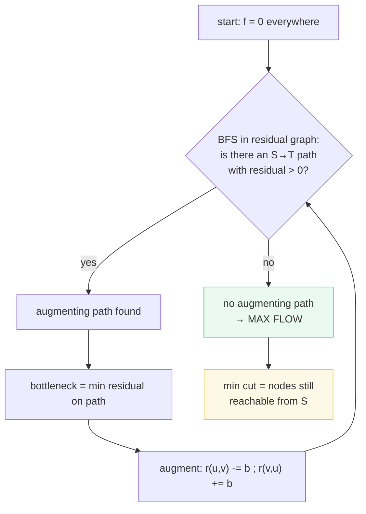
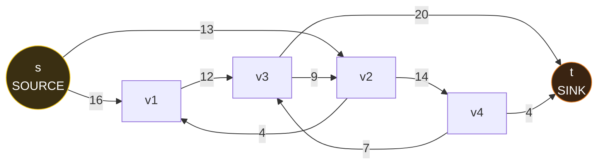
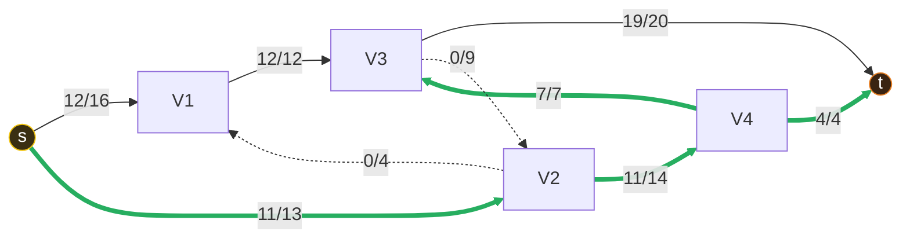
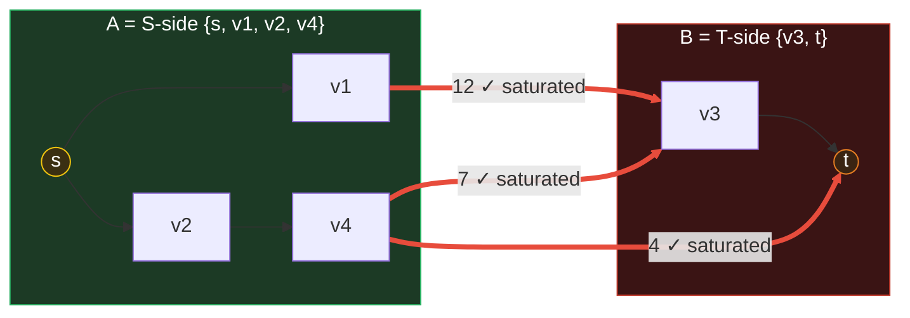
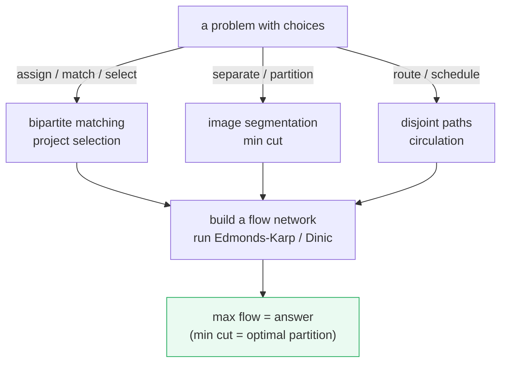

# Maximum Flow — A Visual, Path-by-Path, Worked-Example Guide

> **Companion code:** [`max_flow.py`](./max_flow.py). **Every number, augmenting
> path, residual, and cut in this guide is printed by `python3 max_flow.py`** —
> nothing is hand-computed.
>
> **Live animation:** [`max_flow.html`](./max_flow.html) — open in a browser.
> It re-runs Edmonds-Karp in JS from the *identical* network and gold-checks
> the augmenting paths, flows, and min-cut against the `.py`.

---

## 0. TL;DR — the plumbing of a saturated pipe network

> **The analogy (read this first):** Imagine a network of **pipes** carrying
> water from a **spring** (the source **S**) to a **drain** (the sink **T**).
> Each pipe has a maximum throughput (its **capacity**). Water is incompressible,
> so at every junction the flow **in** must equal the flow **out** (flow
> conservation). The question: what is the **most** water you can push from S
> to T? That maximum is the **max flow**.

The **Ford-Fulkerson method** finds it by repeatedly pushing more flow along an
**augmenting path** in the **residual graph** until none exists. **Edmonds-Karp**
is the variant that picks each path by **BFS** (shortest, in edges), turning the
method into a clean **O(V·E²)** algorithm. The deep result that makes it all
hang together is the **max-flow min-cut theorem**: the max flow equals the
capacity of the minimum cut separating S from T.



> One plain sentence: max flow is found by **saturating** the network one
> bottleneck at a time on residual paths — and the total you pushed is exactly
> the capacity of the **tightest cut** between S and T.

---

### Glossary (plain English — refer back any time)

| Term | Plain meaning |
|---|---|
| **source S / sink T** | The two special nodes. S produces flow, T consumes it. No conservation at either. |
| **capacity c(u,v)** | The hard upper bound on flow through edge (u,v) (the pipe width). |
| **flow f(u,v)** | Current flow on edge (u,v). Constraint: `0 ≤ f ≤ c`. |
| **skew symmetry** | `f(u,v) = −f(v,u)`. Flow one way is "anti-flow" the other — bookkeeping for a uniform conservation law. |
| **conservation** | For every node except S, T: `sum_in(v) = sum_out(v)`. |
| **residual r(u,v)** | How much MORE flow can be pushed on (u,v): forward `r(u,v) = c(u,v) − f(u,v)`; reverse `r(v,u) = f(u,v)` (undo room). |
| **residual graph** | The network redrawn using only residual capacities. The algorithm searches HERE, never on raw capacities. |
| **augmenting path** | An S→T path in the residual graph where every edge has `r > 0`. |
| **bottleneck** | The smallest residual along an augmenting path — how much we can push this round. |
| **augment** | Push the bottleneck along the path: subtract forward residuals, add reverse residuals. |
| **cut** | A partition of nodes into (A, B) with S ∈ A and T ∈ B. |
| **capacity of a cut** | Sum of capacities of edges going A→B (forward only). |
| **min cut** | The cut with the smallest capacity. Equals the max flow. |

---

## 1. The flow network — source, sink, capacities (initial state)

This is the canonical **CLRS** network (Fig 26.1 / 26.6): 6 nodes, 9 directed
edges. Each edge carries a **capacity** (the pipe width). Flow starts at 0.

> From `max_flow.py` **Section A**:
>
> ```
> Nodes: s, v1, v2, v3, v4, t
> Source S = s   Sink T = t
>
> Each directed edge has a CAPACITY (the pipe width). Flow starts at 0:
>
> | edge      | capacity | flow | residual forward |
> |-----------|----------|------|------------------|
> |   s->v1  |       16 |    0 |               16 |
> |   s->v2  |       13 |    0 |               13 |
> |  v1->v3  |       12 |    0 |               12 |
> |  v2->v1  |        4 |    0 |                4 |
> |  v2->v4  |       14 |    0 |               14 |
> |  v3->v2  |        9 |    0 |                9 |
> |  v3->t   |       20 |    0 |               20 |
> |  v4->v3  |        7 |    0 |                7 |
> |  v4->t   |        4 |    0 |                4 |
> ```



A **loose upper bound** on any flow is the min of "capacity leaving S" and
"capacity entering T":

> From `max_flow.py` **Section A**:
>
> ```
> sum c(S,*) = 29   (S->v1:16 + S->v2:13)
> sum c(*,T) = 24   (v3->T:20 + v4->T:4)
> loose upper bound = min(29,24) = 24; the real max flow is smaller (it is 23, found below).
> ```

That bound (24) is **not tight** — internal bottlenecks (the v4→t pipe of 4, the
v1→v3 pipe of 12) choke the flow below it. The algorithm below finds the true
maximum: **23**.

---

## 2. Edmonds-Karp — BFS augmenting path, augment, repeat

**Ford-Fulkerson** is a *method*, not an algorithm — it needs a rule for picking
each augmenting path. **Edmonds-Karp** picks the **shortest** path (by BFS, in
number of edges). That single choice guarantees termination in **O(V·E²)** and
avoids the degenerate cases where plain Ford-Fulkerson can run very long.

The **residual update** on each path edge `(u,v)` is the heart of the method:

> `r(u,v) -= b` (less room forward) and `r(v,u) += b` (more room to **undo**
> later). The reverse residual is how the method can later *cancel* flow that
> turned out to be a bad idea, converging to the true optimum.

Three augmentations suffice for this network:

> From `max_flow.py` **Section B+C**:
>
> ```
> --- iteration 1 ---
>   BFS shortest augmenting path: s -> v1 -> v3 -> t
>   bottleneck = min residual on path = 12
>   push 12; running total |f| = 12
>
> --- iteration 2 ---
>   BFS shortest augmenting path: s -> v2 -> v4 -> t
>   bottleneck = min residual on path = 4
>   push 4; running total |f| = 16
>
> --- iteration 3 ---
>   BFS shortest augmenting path: s -> v2 -> v4 -> v3 -> t
>   bottleneck = min residual on path = 7
>   push 7; running total |f| = 23
>
> After 3 augmentations, BFS finds no S->T path with
> residual > 0. Algorithm TERMINATES. Max flow = 23.
> ```



> 🔗 **Why iteration 3 routes through v4→v3 (a "backward" looking hop):** after
> iterations 1–2 the direct pipes v1→v3 and v4→t are nearly/fully saturated.
> The 3rd BFS finds `s→v2→v4→v3→t` because the residual `v4→v3` (7) is still
> open. Notice this pushes 7 units that, downstream, **cancel** the earlier
> `v1→v3` traffic via the `v3→v2` reverse room — no hand-tuning needed, the
> residual graph rediscovers the optimum automatically.

### The residual update, edge by edge

For each round, the bottleneck `b` is subtracted from forward residuals and
added to reverse residuals along the path:

> From `max_flow.py` **Section B+C** (residual edges with `r > 0` after each
> push; reverse residuals are the **undo room**):
>
> ```
> after iter 1 (push 12 on s->v1->v3->t):
>      s -> v1  : r=4    v1 -> s  : r=12 (undo)    v3 -> v1 : r=12 (undo)   t -> v3 : r=12 (undo)
>      s -> v2  : r=13   v1->v3 saturated          v3 -> t  : r=8
>
> after iter 2 (push 4 on s->v2->v4->t):
>      s -> v2  : r=9    v2 -> s  : r=4  (undo)    v4 -> v2 : r=4  (undo)   t -> v4 : r=4 (undo)
>      v2 -> v4 : r=10   v4->t saturated
>
> after iter 3 (push 7 on s->v2->v4->v3->t):
>      s -> v2  : r=2    v2 -> s  : r=11 (undo)    v4 -> v2 : r=11 (undo)   v3 -> v4 : r=7 (undo)   t -> v3 : r=19 (undo)
>      v2 -> v4 : r=3    v3 -> t  : r=1            v4->v3 saturated
> ```

The reverse residuals (purple, dashed in the `.html`) are the bookkeeping that
lets a later augmenting path "push back" against an earlier one. The forward
residuals shrink toward 0 as pipes saturate.

---

## 3. Final flow per edge + conservation (gold-check)

At termination the actual flow on every edge is recovered as
`f(u,v) = capacity − residual_forward`. Every internal node must satisfy flow
conservation (sum in = sum out); the source's out-flow and the sink's in-flow
must both equal the max-flow value.

> From `max_flow.py` **Section D**:
>
> ```
> Max flow |f*| = 23
>
> | edge      | capacity | flow | residual forward |
> |-----------|----------|------|------------------|
> |   s->v1  |       16 |   12 |                4 |
> |   s->v2  |       13 |   11 |                2 |
> |  v1->v3  |       12 |   12 |                0 |
> |  v2->v1  |        4 |    0 |                4 |
> |  v2->v4  |       14 |   11 |                3 |
> |  v3->v2  |        9 |    0 |                9 |
> |  v3->t   |       20 |   19 |                1 |
> |  v4->v3  |        7 |    7 |                0 |
> |  v4->t   |        4 |    4 |                0 |
>
> Flow conservation (sum_in == sum_out) at every internal node:
> | node | flow IN                 | flow OUT               | balanced? |
> |------|-------------------------|------------------------|-----------|
> | v1   | s:12 + v2:0 = 12        | v3:12 = 12             | True      |
> | v2   | s:11 + v3:0 = 11        | v1:0 + v4:11 = 11      | True      |
> | v3   | v1:12 + v4:7 = 19       | v2:0 + t:19 = 19       | True      |
> | v4   | v2:11 = 11              | v3:7 + t:4 = 11        | True      |
>
> flow leaving S = 23
> flow entering T = 23
> GOLD: total flow = sum leaving source = sum entering sink = 23
> [check] value(f) consistent everywhere? True
> ```

Note `v1→v3` (12/12), `v4→v3` (7/7), and `v4→t` (4/4) are all **saturated**
— these are exactly the min-cut edges (Section 4). The edges `v2→v1` and
`v3→v2` carry **0** flow; they exist only as structural capacity the algorithm
chose not to use.

---

## 4. Max-flow = min-cut (the central theorem)

At termination, BFS from **S** in the residual graph reaches exactly the **S-side**
of the minimum cut. The edges crossing A→B are all **saturated** (if one had
residual > 0, BFS would have crossed it into B — contradiction). Their capacity
sum equals the max flow. This is the **max-flow min-cut theorem**
(Ford-Fulkerson 1956): **|f\*| = capacity(min cut)**.

> From `max_flow.py` **Section E**:
>
> ```
> S-side (reachable from s in residual graph): ['s', 'v1', 'v2', 'v4']
> T-side (the rest):                                   ['t', 'v3']
>
> Cut edges (forward edges from A to B) - all SATURATED:
> | edge      | capacity | flow | (flow == capacity) |
> |-----------|----------|------|--------------------|
> |  v1->v3  |       12 |   12 | True               |
> |  v4->v3  |        7 |    7 | True               |
> |  v4->t   |        4 |    4 | True               |
>
> capacity(min cut) = 12 + 7 + 4 = 23
> max flow |f*|      = 23
> GOLD: |f*| == capacity(min cut)?  True  (23 == 23)
> [check] max-flow min-cut theorem holds? OK
> ```



> 🔗 **Why this partition and not another:** the cut `{s,v1,v2,v4} | {v3,t}` has
> capacity **23** — exactly the max flow. Any other S-T cut has larger capacity
> (e.g. `{s} | rest` = 29, `{s,v1,v2} | rest` = 12+14 = 26). The min cut is the
> network's true **bottleneck**, and the theorem says the max flow *is* that
> bottleneck's capacity.

---

## 5. Applications — what max-flow actually solves

Max-flow is a **Swiss-army knife**: many problems are *solved* by building a flow
network and running Edmonds-Karp / Dinic on it. The unifying trick is to model
**"choices" as a cut** — the min cut picks the cheapest consistent partition,
and the max flow proves it is optimal.

> From `max_flow.py` **Section F**:
>
> | problem | how it maps to max-flow |
> |---|---|
> | **bipartite matching** | super-source → all L-nodes (cap 1), all R-nodes → super-sink (cap 1); max flow = max matching. (Konig: = min vertex cover.) |
> | **disjoint paths** | unit capacities; max flow = max edge-disjoint S→T paths (Menger's theorem). |
> | **project selection** | open-pit mining / max closure in a dependency DAG → min cut. (Picard 1976.) |
> | **image segmentation** | foreground/background: pixels → S (fg) or T (bg); capacities from pixel similarity; min cut = optimal boundary. (Boykov-Kolmogorov 2004.) |
> | **baseball elimination** | can team X still win? saturate the remaining games via flow; if max flow fills all game nodes, X is alive. (Schwartz 1966.) |
> | **circulation / demands** | add edge T→S with cap ∞; lower bounds via node demands; feasibility via a super-source. |



---

## 6. Gold check (how the bundle stays honest)

Every number above is reproducible from one command:

```bash
python3 max_flow.py          # prints all sections + gold check
python3 max_flow.py > max_flow_output.txt   # capture
```

The **gold contract** is that the flow value is consistent everywhere:
**|f| = sum of flows leaving the source = sum of flows entering the sink =
capacity of the min cut = 23**, achieved in exactly **3** augmenting paths. The
companion [`max_flow.html`](./max_flow.html) re-runs Edmonds-Karp in JavaScript
on the *same* network and shows a green `[check: OK]` badge when its paths,
flows, and cut match.

> From `max_flow.py` **GOLD CHECK**:
>
> ```
> augmenting paths (Edmonds-Karp order):
>   s -> v1 -> v3 -> t   bottleneck 12
>   s -> v2 -> v4 -> t   bottleneck 4
>   s -> v2 -> v4 -> v3 -> t   bottleneck 7
>
> num augmentations       = 3
> |f| (running total)     = 23
> sum flow leaving source = 23
> sum flow entering sink  = 23
> min cut S-side          = ['s', 'v1', 'v2', 'v4']
> capacity(min cut)       = 23
> final flow per edge     = {'s->v1': 12, 's->v2': 11, 'v1->v3': 12, 'v2->v1': 0, 'v2->v4': 11, 'v3->v2': 0, 'v3->t': 19, 'v4->v3': 7, 'v4->t': 4}
>
> GOLD (pinned for max_flow.html):
>   max_flow=23, num_paths=3, min_cut_A_side=['s', 'v1', 'v2', 'v4'], cut_capacity=23
> [check] |f| = sum_out(S) = sum_in(T) = cap(min cut) = 23? OK
> ```

| quantity | value | source |
|---|---|---|
| max flow \|f\*| | **23** | Section D / gold |
| number of augmenting paths | **3** | Section B+C / gold |
| augmenting paths | `s→v1→v3→t` (12), `s→v2→v4→t` (4), `s→v2→v4→v3→t` (7) | Section B+C |
| min cut (A-side) | **{s, v1, v2, v4}** | Section E / gold |
| min cut capacity | **23** (= 12 + 7 + 4) | Section E / gold |
| cut edges (all saturated) | v1→v3 (12), v4→v3 (7), v4→t (4) | Section E |
| flow leaving S | **23** | Section D |
| flow entering T | **23** | Section D |
| Edmonds-Karp complexity | **O(V·E²)** | CLRS 26.2 |

---

## Further reading

- **CLRS** *Introduction to Algorithms*, 3rd ed., ch. 26 — maximum flow, the
  Ford-Fulkerson method, Edmonds-Karp, and the max-flow min-cut theorem. The
  network in this bundle is CLRS Figure 26.1 / 26.6.
- **Ford & Fulkerson** (1956), "Maximal flow through a network," *Canadian J.
  Math.* 8 — the original method and the max-flow min-cut theorem.
- **Edmonds & Karp** (1972), "Theoretical improvements in algorithmic
  efficiency for network flow problems," *JACM* 19(2) — the BFS shortest-path
  heuristic giving O(V·E²).
- **Dinic** (1970) — level graphs + blocking flows, O(V²·E); the basis of modern
  max-flow solvers.
- **Boykov & Kolmogorov** (2004), "An experimental comparison of min-cut/max-flow
  algorithms for vision in energy minimization," *IEEE PAMI* — image
  segmentation via min cut.
