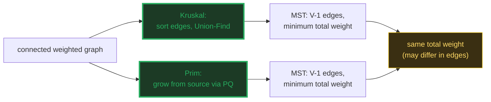
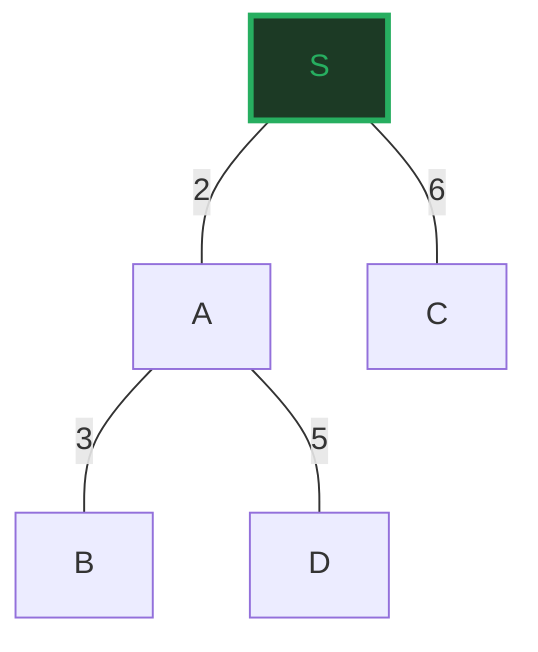
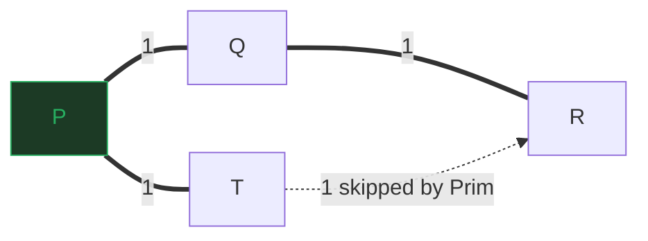

# Minimum Spanning Tree — Kruskal & Prim: A Visual, Worked-Example Guide

> **Companion code:** [`mst_kruskal_prim.py`](./mst_kruskal_prim.py). **Every
> number and table in this guide is printed by `python3 mst_kruskal_prim.py`** —
> nothing is hand-computed.
>
> **Live animation:** [`mst_kruskal_prim.html`](./mst_kruskal_prim.html) — open in
> a browser: step through Kruskal's edge-sorting and Prim's growth on the same
> graph, watch a tie-graph split into two valid MSTs, and see the cut property.

---

## 0. TL;DR — the one idea

> **The "wire up every city" analogy (read this first):** you have V cities and a
> cost to lay cable between each pair. You want every city reachable from every
> other (one connected network) for the **least total cable**. That minimal
> network is the **Minimum Spanning Tree (MST)**: it spans all V vertices, has
> exactly **V−1 edges**, and no cycle.
>
> Two ways to grow it, both provably optimal via the **cut property**: *the
> lightest edge crossing any cut belongs to some MST.*

| algorithm | strategy | time | flavor |
|---|---|---|---|
| **Kruskal** | sort all edges; add cheapest unless it forms a cycle (Union-Find) | **O(E log V)** | edge-centric; builds a forest |
| **Prim** | grow from a source; always add the cheapest edge to a new vertex | **O(E log V)** | vertex-centric; grows one blob |



---

### Glossary (plain English — refer back any time)

| Term | Plain meaning |
|---|---|
| **`V`**, **`E`** | Vertices and undirected edges. Worked graph: V=5, E=7. |
| **spanning tree** | Edges connecting all V vertices with no cycle → always **V−1 edges**. |
| **MST** | The spanning tree with minimum total edge weight. |
| **cut** | A partition of vertices into two non-empty sets (S, V−S). |
| **cut property** | The lightest edge crossing ANY cut is in SOME MST — proves both algorithms correct. |
| **cycle property** | The heaviest edge on any cycle is in NO MST — Kruskal's skip rule. |
| **Union-Find** | Disjoint-set forest: `find`/`union` in ~O(1). Kruskal uses it to test "would this edge close a cycle?". |
| **forest** | Kruskal starts as V singleton trees; each accepted edge merges two of them. |

---

## 1. Kruskal — sort edges, Union-Find cycle check

Sort all edges by weight; scan in order and **ADD** the edge unless its endpoints
are already in the same Union-Find component (which would mean a cycle). The
forest of components merges until it is one tree.

> From `mst_kruskal_prim.py` Section A — the build trace:

```
Step 1 - sort all edges by weight (ascending):
  S-A    w = 2
  A-B    w = 3
  A-D    w = 5
  S-C    w = 6
  B-D    w = 7
  A-C    w = 8
  C-D    w = 9

Step 2 - scan in order; ADD the edge iff its endpoints are in DIFFERENT
Union-Find components (otherwise it would close a cycle). Components after
each decision:

  #  edge    w    decision              components after                        
  ----------------------------------------------------------------------------
  1  S-A     2    ADD                   {S,A}  {B}  {C}  {D}                    
  2  A-B     3    ADD                   {S,A,B}  {C}  {D}                       
  3  A-D     5    ADD                   {S,A,B,D}  {C}                          
  4  S-C     6    ADD                   {S,A,B,C,D}                             
  5  B-D     7    skip (tree complete)  {S,A,B,C,D}                             
  6  A-C     8    skip (tree complete)  {S,A,B,C,D}                             
  7  C-D     9    skip (tree complete)  {S,A,B,C,D}                             

MST edges (4 = V-1):
  S-A    w = 2
  A-B    w = 3
  A-D    w = 5
  S-C    w = 6

  total weight = 16.0

[check] MST has V-1 = 4 edges, no cycle, total = 16.0:  OK
```



> **Three edges skipped (B-D, A-C, C-D):** each would have joined two vertices
> already in the same component — a cycle. Union-Find's `find()` detected that in
> near-O(1) (inverse-Ackermann) per check. Notice the **components merge** row by
> row: 4 singletons → `{S,A}` → `{S,A,B}` → `{S,A,B,D}` → one set of all five.

---

## 2. Prim — grow from a source via a priority queue

Start at S. Repeatedly add the **cheapest edge crossing the cut (tree | rest)**,
tracked by a min-priority-queue of frontier edges. The tree grows one vertex per
accepted edge.

> From `mst_kruskal_prim.py` Section B — the growth trace:

```
  step popped edge   w    decision                total   
  ------------------------------------------------------
  1    S-A           2    ADD A to tree           2.0     
  2    A-B           3    ADD B to tree           5.0     
  3    A-D           5    ADD D to tree           10.0    
  4    S-C           6    ADD C to tree           16.0    

MST edges (4 = V-1):
  S-A    w = 2
  A-B    w = 3
  A-D    w = 5
  S-C    w = 6

  total weight = 16.0

[check] Prim MST has V-1 = 4 edges, total = 16.0:  OK
```

> **Each step pops the globally-lightest edge whose endpoint is NEW.** Stale
> entries (a vertex pushed with a heavier weight before a lighter path was found)
> are discarded when popped. On this graph Prim picks the **same four edges** as
> Kruskal — but that is not guaranteed in general (next section).

---

## 3. Kruskal vs Prim on the same graph — identical weight, may differ in edges

> From `mst_kruskal_prim.py` Section C — the head-to-head:

```
Main graph (S,A,B,C,D):

  | algorithm | total weight | # edges | edge set identical? |
  |-----------|--------------|---------|---------------------|
  | Kruskal   | 16.0         | 4       | yes                 |
  | Prim      | 16.0         | 4       |

  -> same total weight? YES (16.0)
  -> identical edges?   YES
```

On this graph they coincide. But on a graph with **tied weights**, the two
strategies can legitimately pick **different edge sets of equal total weight**:

> From `mst_kruskal_prim.py` Section C — the tie graph (a 4-cycle, all weight 1):

```
Now a TIE graph: a 4-cycle (P,Q,R,T) where every edge has weight 1.
Any 3 of the 4 edges form an MST of weight 3 - so Kruskal and Prim can
legitimately pick DIFFERENT edge sets:

  | algorithm | edges chosen        | total |
  |-----------|---------------------|-------|
  | Kruskal   | P-Q, Q-R, R-T       | 3.0   |
  | Prim      | P-Q, Q-R, P-T       | 3.0   |

  same total weight? True    identical edges? False
  Kruskal-only edge: R-T
  Prim-only edge:    P-T
  Both are weight 1, so swapping them keeps the total at 3 - BOTH are
  valid MSTs. This is why we say 'identical weight, may differ in edges'.

[check] tie graph:  Kruskal total == Prim total == 3 (different edges):  OK
```



> **Kruskal picks R-T, Prim picks P-T — both weight 3.** Kruskal processes edges
> globally in input order, so after P-Q and Q-R it adds R-T. Prim grows from P:
> after P and Q it finds T cheapest *from P*, adding P-T. Different edges, same
> optimal total. Both are valid MSTs.

---

## 4. The cut property — why both algorithms are optimal

> **THE CUT PROPERTY:** for ANY cut (S, V−S) of the graph, the **lightest edge
> crossing it** belongs to SOME minimum spanning tree.

This single theorem proves BOTH algorithms correct:
- **Kruskal** accepts edge (u,v) across the cut "component(u) | rest"; processed
  cheapest-first, it is the lightest such edge → safe to add.
- **Prim** adds the lightest edge leaving the current tree (cut "tree | rest").

> From `mst_kruskal_prim.py` Section D — a concrete cut on the main graph:

```
Concrete cut on the main graph: {S,A} | {B,C,D}

Crossing edges (one endpoint inside, one outside):
  S-C    w = 6
  A-B    w = 3
  A-C    w = 8
  A-D    w = 5

Lightest crossing edge = A-B (w = 3).
Is it in the MST? True  <- the cut property guarantees it.

Another cut {S} | {A,B,C,D}: crossing = ['S-A(w=2)', 'S-C(w=6)']
Lightest = S-A (w = 2), also in the MST.

[check] lightest crossing edge of each cut is in the MST:  OK
```

> The cut property has a symmetric twin — the **cycle property**: the *heaviest*
> edge on any cycle is in **no** MST (removing it keeps the graph connected and
> only lowers the total). Kruskal's cycle-skip is exactly this applied greedily.

---

## 5. Applications — network design & clustering

> From `mst_kruskal_prim.py` Section E — Kruskal stopped early = clustering:

```
APPLICATION 2 - single-linkage clustering. Run Kruskal but STOP after
V - k accepted edges: you get k connected components = k clusters, where no
two clusters can be merged more cheaply. This is 'maximum spacing' k-clustering.

Kruskal stopped at V-2 = 3 edges -> 2 clusters:
  cluster: {S, A, B, D}
  cluster: {C}

The NEXT edge Kruskal would add is S-C (w = 6) - the distance
(min edge between clusters) between the two clusters. Maximum-spacing
clustering maximizes this minimum inter-cluster distance.
```

**Two killer applications:**
1. **Network design** — the MST is literally the minimum-cost way to wire up a
   set of points: power grids, fiber backbones, pipe networks, PCB routing.
2. **Single-linkage clustering** — run Kruskal but stop after V−k edges → k
   clusters with **maximum spacing** (the cheapest merge you refused is as large
   as possible). This is why Kruskal's edge-centric design is favored for
   clustering: you get the full merge dendrogram for free.

---

## 6. Complexity summary

| algorithm | time | space | strengths |
|---|---|---|---|
| **Kruskal** | **O(E log V)** | O(V + E) | edge-centric; clustering for free; easy to reason about |
| **Prim (heap)** | **O(E log V)** | O(V + E) | vertex-centric; naturally incremental; one priority queue |
| **Prim (matrix)** | O(V²) | O(V²) | best for dense graphs (E ≈ V²) |

> **Same O(E log V), different feel.** Reach for Kruskal when you want the sorted
> edge list, cycle reasoning, or clustering. Reach for Prim when the graph is
> dense, you want incremental growth, or you need a single priority queue.

---

### Reproducibility

Every table above is printed verbatim by `python3 mst_kruskal_prim.py` and
self-checked at the end of each section:

> From `mst_kruskal_prim.py` Section E — the gold check:

```
GOLD CHECK on the main graph (S,A,B,C,D):
  Kruskal total = 16.0
  Prim    total = 16.0
  -> both = V-1 = 4 edges, same total weight: OK

GOLD CHECK: OK - Kruskal total (16.0) == Prim total (16.0)
```

`mst_kruskal_prim.html` re-runs **both** algorithms in JavaScript on the same
graphs (including the tie graph), and re-checks these exact totals — the green
`check: OK` badge confirms the page matches the `.py` exactly.
