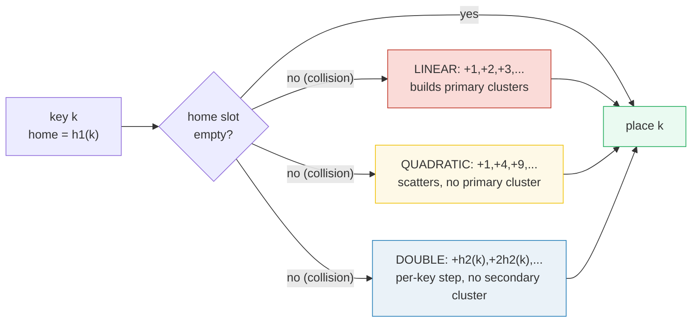
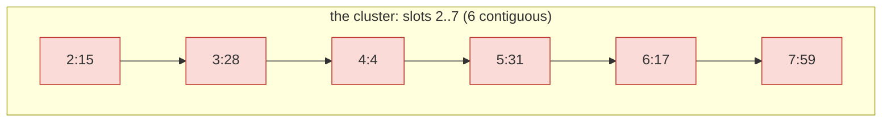
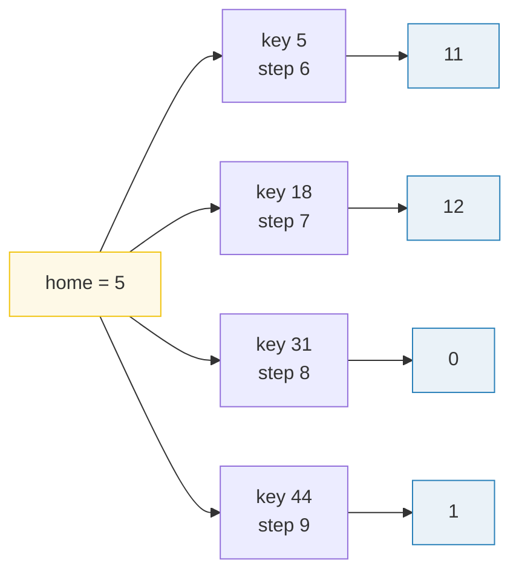

# Open Addressing Hash Tables — A Visual, Worked-Example Guide

> **Companion code:** [`open_addressing.py`](./open_addressing.py). **Every
> number in this guide is printed by `python3 open_addressing.py`** — change
> the code, re-run, re-paste. Nothing here is hand-computed.
>
> **Live animation:** [`open_addressing.html`](./open_addressing.html) — open
> in a browser. Step through inserts with collision probing, slide the load
> factor, compare the three probe strategies, all gold-checked against the `.py`.
>
> **Source material:** CLRS ch.11 *Hash Tables*, §11.4 *Open Addressing*
> (11.4.1 linear probing, 11.4.2 quadratic probing, 11.4.3 double hashing,
> Theorem 11.6 the uniform-hashing probe bound); Sedgewick & Wayne §3.4.
> Also 🔗 [`BIG_O_COMPARISON.md`](./BIG_O_COMPARISON.md) for Big-O foundations.

---

## 0. TL;DR — one coat per hook, walk the row on a collision

In **open addressing** every key lives *directly in the table* — no linked
lists, no "buckets of coats." When a key's **home slot** `h₁(k)` is taken, you
**probe** down a sequence of slots until you find an empty one. The strategy
that generates the sequence decides everything:



The whole cost story is the **load factor α = n/m** (keys per slot). Open
addressing *requires* α < 1, and under the idealized **uniform hashing**
assumption the expected probes are:

| query | expected probes (uniform hashing) | at α = 0.75 | at α = 0.90 |
|---|---|---|---|
| **unsuccessful** search | **1 / (1 − α)** | **4.0** | 10.0 |
| **successful** search | **(1/α) · ln(1/(1−α))** | **1.85** | 2.56 |

> **The one-line lesson:** the formula is *exact only for uniform hashing*.
> Of real strategies, **double hashing tracks it best, linear probing is worst**
> (it welds keys into long contiguous "primary clusters"). Keep **α ≤ 0.75**
> by resizing (rehashing) before it bites.

### Glossary

| Term | Plain meaning |
|---|---|
| **m** | number of slots ("hooks"). Prime preferred (helps quadratic/double reach every slot) |
| **n** | number of stored keys ("coats") |
| **α (alpha)** | load factor = n/m. Must stay < 1; resize before ~0.75 |
| **home slot** | `h₁(k)` — the first slot tried |
| **probe** | one slot examination. Probe count = the cost |
| **probe sequence** | the ordered slots tried: home, then +step, +2·step, … |
| **collision** | home slot holds a *different* key → must probe |
| **primary cluster** | a long *contiguous* run of occupied slots (linear probing's disease) |
| **secondary cluster** | all keys with the *same home* share one probe sequence (quadratic still has it) |
| **tombstone** | a "DELETED" slot left on removal so search keeps probing past it; reused on insert |
| **uniform hashing** | ideal: each key's probe sequence is a uniform random permutation. Real strategies only approximate it |

---

## A. Linear probing — insert / search / delete (with tombstones), α ≈ 0.75

Home slot `h₁(k) = k mod m`, with prime `m = 13`. On collision, probe
`home, home+1, home+2, …` until an EMPTY slot. Deletion is **lazy**: mark the
slot a tombstone (`~~`) so search keeps probing through it.

> From `open_addressing.py` Section A:

| step | key | h1(k) | probe sequence | lands | probes | note |
|------|------|-------|-----------------------|-------|--------|------|
| 1 | 10 | 10 | 10 | 10 | 1 | home free |
| 2 | 22 | 9 | 9 | 9 | 1 | home free |
| 3 | 31 | 5 | 5 | 5 | 1 | home free |
| 4 | 4 | 4 | 4 | 4 | 1 | home free |
| 5 | 15 | 2 | 2 | 2 | 1 | home free |
| 6 | 28 | 2 | 2 → 3 | 3 | 2 | collision |
| 7 | 17 | 4 | 4 → 5 → 6 | 6 | **3** | collision |
| 8 | 88 | 10 | 10 → 11 | 11 | 2 | collision |
| 9 | 59 | 7 | 7 | 7 | 1 | home free |
| 10 | 36 | 10 | 10 → 11 → 12 | 12 | **3** | collision |

```
slot :    0    1    2    3    4    5    6    7    8    9   10   11   12
key  :  --   --   15   28    4   31   17   59   --   22   10   88   36
```

- **Total probes to build = 16** (avg 1.60 per insert). α = 10/13 = 0.769.



**Searches.** Finding key 36 re-walks its insert sequence (`10 → 11 → 12`,
3 probes — a *successful* search costs exactly what the insert cost). A *miss*
for key 8 stops at once because slot 8 is EMPTY. `[check] build probes == 16? OK`

**Delete with tombstones.** Remove 31 (slot 5 → `~~`). Search 17 still works:
`4 → 5(~~, keep going) → 6(FOUND)` = 3 probes — the tombstone must NOT stop the
search or 17 would vanish. Then insert 44 (home 5): it probes
`5(~~, remember) → 6 → 7 → 8(EMPTY, stop)` = 4 probes, then **fills the
tombstone at slot 5**. Tombstones keep search correct *and* let a later insert
reclaim the dead slot instead of fragmenting the row.
`[check] 17 still at slot 6 after delete? OK ; 44 reuses tomb at slot 5 after 4 probes? OK`

🔗 Step through these inserts live in [`open_addressing.html`](./open_addressing.html) panel ①.

---

## B. Primary clustering — linear probing builds a wall

Insert 6 keys that **all hash to slot 5** (`18, 31, 44, 57, 70, 83`; each is
`5 mod 13`). Linear probing packs them **contiguously**: 5, 6, 7, 8, 9, 10.

> From `open_addressing.py` Section B:

| insert# | key | home | probes | walks through | lands |
|---------|-----|------|--------|----------------------|-------|
| 1 | 18 | 5 | 1 | 5 | 5 |
| 2 | 31 | 5 | 2 | 5 → 6 | 6 |
| 3 | 44 | 5 | 3 | 5 → 6 → 7 | 7 |
| 4 | 57 | 5 | 4 | 5 → 6 → 7 → 8 | 8 |
| 5 | 70 | 5 | 5 | 5 → 6 → 7 → 8 → 9 | 9 |
| 6 | 83 | 5 | **6** | 5 → 6 → 7 → 8 → 9 → 10 | 10 |

> **Total probes = 1+2+3+4+5+6 = 21** (vs 6 if there were no clustering!).
> Slots 5..10 are now a contiguous block of 6 — a **primary cluster**. `[check] 6 clustered inserts == 21 probes? OK`

**The tax** — now insert a NEW key whose home sits *inside* the cluster:

> key **6** (home = 6) walks `6 → 7 → 8 → 9 → 10 → 11` → **6 probes**, paying for
> the entire run it never asked to join. `[check] victim pays 6 probes? OK`

This is primary clustering in one sentence: *two clusters that touch merge into
one bigger cluster, and the longer the run, the more likely the next insertion
lands inside it and extends it further.* It is a positive feedback loop.

---

## C. Quadratic probing — scatter keys, dodge the cluster

Same 6 keys, but probe with `h(k, i) = (home + i²) mod m`. The keys now
**scatter** instead of stacking contiguously, so no primary cluster forms:

> From `open_addressing.py` Section C:

| insert# | key | probe sequence (i² steps) | lands | probes |
|---------|-----|-----------------------------------|-------|--------|
| 1 | 18 | 5 | 5 | 1 |
| 2 | 31 | 5 → 6 | 6 | 2 |
| 3 | 44 | 5 → 6 → 9 | 9 | 3 |
| 4 | 57 | 5 → 6 → 9 → 1 | 1 | 4 |
| 5 | 70 | 5 → 6 → 9 → 1 → 8 | 8 | 5 |
| 6 | 83 | 5 → 6 → 9 → 1 → 8 → 4 | 4 | 6 |

> **Occupied slots = {1, 4, 5, 6, 8, 9}** — scattered, not contiguous.
> `[check] keys scatter to {1,4,5,6,8,9} (not contiguous)? OK`

**The same victim, now cheap.** Key 6 (home 6) probes `6 → 7(EMPTY)` → **2
probes**, vs **6** for linear probing. The cluster doesn't contiguously block
slot 7, so `home + 1²` is free. `[check] quadratic victim pays 2 probes (vs 6 linear)? OK`

**The catch — secondary clustering.** The probe *counts* are still 1,2,3,4,5,6
(identical to Section B): every key with the *same home* follows the *same*
i² sequence, so they queue on one shared path. Quadratic kills **primary**
clustering but keeps **secondary** clustering. (With prime `m`, the first
`m/2` quadratic probes are distinct, so it always finds a slot while α < ½.)

---

## D. Double hashing — a per-key step kills secondary clustering too

Take 4 keys that share home `h₁ = 5`, but differ in the second hash
`h₂(k) = 1 + (k mod (m−1)) = 1 + (k mod 12)`. Because each key's **step**
differs, their probe sequences **diverge** after the home slot:

> From `open_addressing.py` Section D:

| key | h1 | h2 = step | probe sequence | lands | probes |
|-----|----|-----------|-----------------------|-------|--------|
| 5 | 5 | 6 | 5 | 5 | 1 |
| 18 | 5 | 7 | 5 → 12 | 12 | 2 |
| 31 | 5 | 8 | 5 → 0 | 0 | 2 |
| 44 | 5 | 9 | 5 → 1 | 1 | 2 |

> **Total probes = 7** (1+2+2+2), vs **10** for linear *and* **10** for
> quadratic on the same 4 colliding keys (1+2+3+4). `[check] double hashing == 7 probes (vs linear 10, quadratic 10)? OK`



**Why it works:** same home, different steps → each colliding key jumps to a
*different* second slot, so there is no shared queue. `gcd(h₂, m) = 1` for
prime `m` and `h₂ ∈ [1, m−1]`, so the sequence visits **every** slot before
repeating — double hashing approximates uniform hashing most closely.

---

## E. The probe-count formula — and which strategy actually hits it

**Uniform-hashing bound (CLRS Theorem 11.6)** — exact only under the idealized
assumption that each key's probe sequence is a uniform random permutation:

```
unsuccessful search:   1 / (1 − α)
successful   search:   (1/α) · ln( 1 / (1 − α) )
```

Linear probing has its **own** (tighter, *worse*) cost model:

```
unsuccessful:   ½ (1 + 1/(1−α)²)        successful:   ½ (1 + 1/(1−α))
```

> From `open_addressing.py` Section E (m = 1009, deterministic LCG keys):

**UNSUCCESSFUL search** — mean probes (lower is better):

| α | formula 1/(1−α) | linear ½(1+…) | linear (sim) | quadratic (sim) | double (sim) |
|-------|----------------|-------------------|--------------|-----------------|--------------|
| 0.10 | 1.111 | 1.117 | 1.109 | 1.099 | 1.119 |
| 0.25 | 1.333 | 1.389 | 1.372 | 1.316 | 1.300 |
| 0.50 | 2.000 | 2.500 | 2.273 | 2.099 | 1.873 |
| **0.75** | **4.000** | 8.500 | 7.399 | 4.215 | **3.704** |
| 0.90 | 10.000 | 50.500 | 33.607 | 11.151 | 9.722 |

**SUCCESSFUL search** — mean probes:

| α | formula (1/α)ln… | linear ½(1+…) | linear (sim) | quadratic (sim) | double (sim) |
|-------|-------------------|-------------------|--------------|-----------------|--------------|
| 0.10 | 1.054 | 1.056 | 1.069 | 1.069 | 1.079 |
| 0.25 | 1.151 | 1.167 | 1.221 | 1.213 | 1.206 |
| 0.50 | 1.386 | 1.500 | 1.503 | 1.430 | 1.418 |
| **0.75** | **1.848** | 2.500 | 2.501 | 1.955 | **1.950** |
| 0.90 | 2.558 | 5.500 | 4.627 | 2.794 | 2.471 |

**How to read it:**

- **Double hashing tracks the uniform-hashing formula** closely at every α — at
  α = 0.75 it is within **7.4%** (unsuccessful) and **5.5%** (successful). It is
  the best real approximation to uniform hashing.
- **Linear probing overshoots**, and its overshoot blows up as α → 1
  (`1/(1−α)²`): primary clustering makes it the worst.
- **Quadratic sits between the two**: no primary cluster, but secondary
  clustering keeps it above double hashing on unsuccessful searches.

> **GOLD at α = 0.75** (the canonical resize threshold):
> formula unsuccessful = **4.0** exactly; formula successful = **1.848392**;
> double-hashing (sim) = 3.704 / 1.950.
> `[check] 1/(1−0.75)==4.0 exact? OK ; double hashing within 12% of formula? OK ; clustering order linear(7.4) > quad(4.2) > double(3.7)? OK`

🔗 Slide α and watch all four curves diverge in [`open_addressing.html`](./open_addressing.html) panel ②.

---

## F. Gold check — the values the HTML recomputes

The companion `.html` re-runs the *identical* hashing and LCG formulas in
JavaScript and asserts them against these pinned values:

> From `open_addressing.py` GOLD VALUES (α = 0.75, m = 13 worked example):

| quantity | value |
|---|---|
| formula unsuccessful `1/(1−α)` | **4.000000** |
| formula successful `(1/α)ln(1/(1−α))` | **1.848392** |
| linear unsuccessful `½(1+1/(1−α)²)` | 8.500000 |
| linear successful `½(1+1/(1−α))` | 2.500000 |
| build probes (10 inserts, m = 13) | **16** |
| search 36 → slot 12 | 3 probes |
| search 8 (miss) → slot 8 EMPTY | 1 probe |
| 6 clustered inserts (linear) | **21** probes |
| victim key 6 | linear **6**, quadratic **2** probes |
| 4 double-hash keys | double **7** probes |

`[check] GOLD reproduces from the reference functions? OK`

The gold badge `check: OK` at the bottom of
[`open_addressing.html`](./open_addressing.html) confirms the in-browser
recompute matches `open_addressing.py` exactly (`1/(1−0.75) = 4.0`, build
probes = 16, cluster = 21, the 6-vs-2 victim contrast).

---

## G. The bigger picture

- **α is everything.** Open addressing is `O(1)` expected *only while α stays
  bounded away from 1*. The standard engineering rule is **resize (rehash) when
  α ≥ 0.75** — rehashing to ~2× a prime `m` is itself amortized O(1) by the same
  geometric-series argument as dynamic arrays. 🔗 [`AMORTIZED_RESIZE.md`](./AMORTIZED_RESIZE.md).
- **Clustering is the enemy.** Primary clustering (linear) and secondary
  clustering (quadratic) are why real probe counts exceed the uniform-hashing
  formula. **Double hashing** is the practical answer: cheap, no special-case
  math, and it tracks the ideal bound.
- **Cache vs. quality.** Linear probing *looks* worst on probe count, but its
  +1 access pattern is the most **cache-friendly** (contiguous memory). For
  small, in-cache tables linear probing can *win* in wall-clock time despite
  more probes — the formula counts probes, not nanoseconds.
- **Tombstones accumulate.** Lazy deletion keeps search correct, but a
  workload of many deletes then inserts leaves the table full of tombstones and
  α effectively rises. Production tables periodically **rehash without
  tombstones** (or rehash on delete when tombstone density crosses a threshold).

> **Files in this bundle** (all derive from one ground-truth `.py`):
> [`open_addressing.py`](./open_addressing.py) ·
> [`open_addressing_output.txt`](./open_addressing_output.txt) ·
> [`open_addressing.html`](./open_addressing.html) · this guide.
