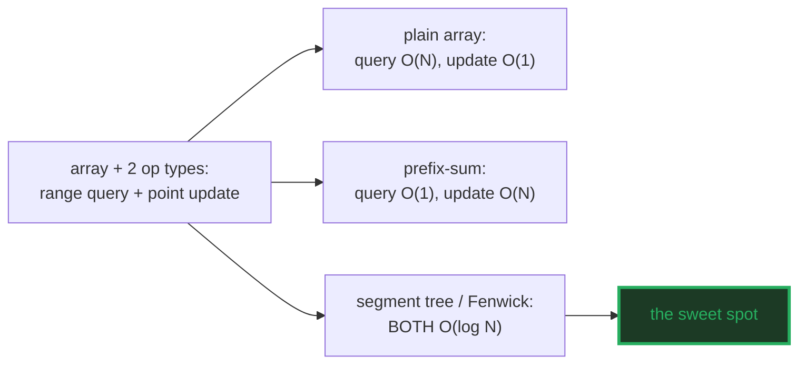
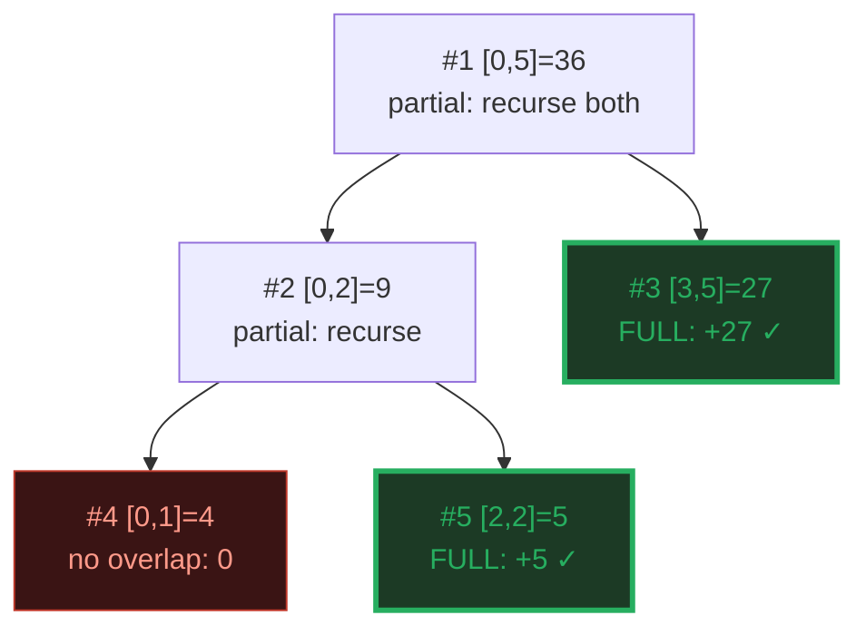
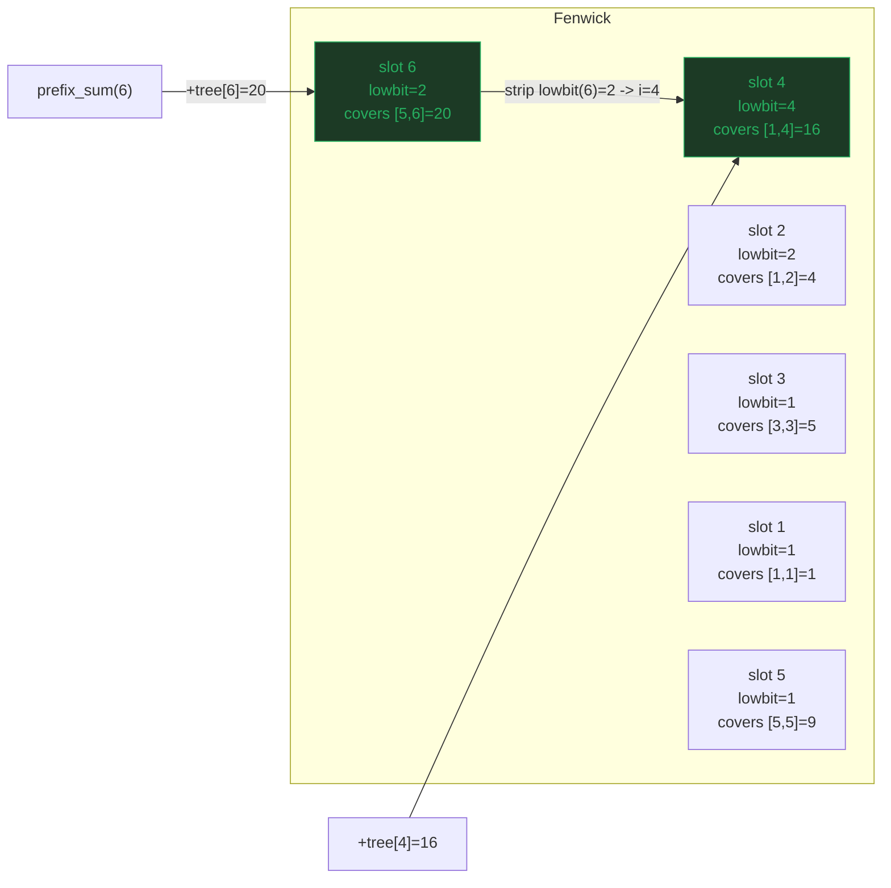
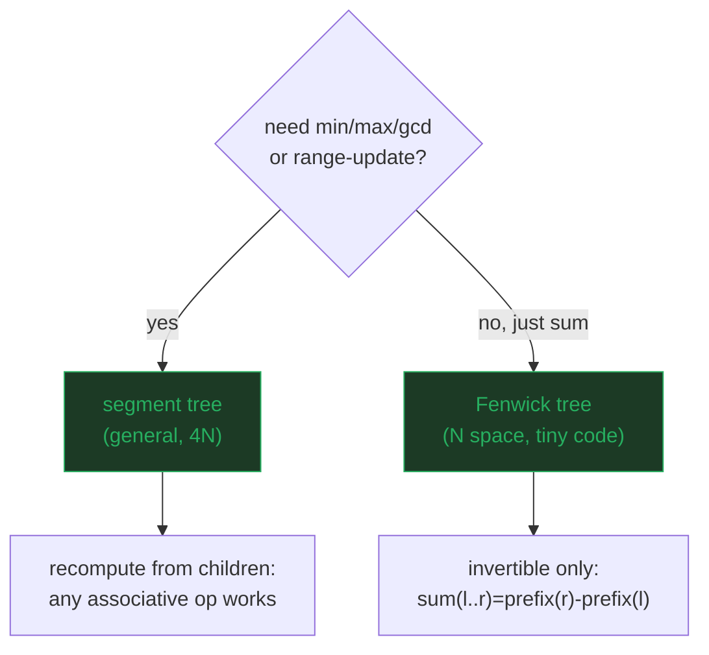

# Segment Tree & Fenwick Tree — A Visual, Worked-Example Guide

> **Companion code:** [`segment_tree.py`](./segment_tree.py). **Every number
> and tree in this guide is printed by `python3 segment_tree.py`** — nothing is
> hand-computed.
>
> **Live animation:** [`segment_tree.html`](./segment_tree.html) — open in a
> browser: a segment tree over `[1,3,5,7,9,11]` with range-query highlighting,
> update propagation, and a side-by-side Fenwick comparison.

---

## 0. TL;DR — the one idea

> **The "running scoreboard" analogy (read this first):** you have an array and
> you keep asking **two** kinds of question:
> - "what is the **sum** (or min/max) from index `l` to `r`?" *(a range query)*
> - "I just changed `arr[i]` to `v`" *(a point update)*
>
> A plain array answers update in **O(1)** but a range sum in **O(N)** (scan).
> A prefix-sum array answers range sum in **O(1)** but an update in **O(N)**
> (rebuild). Neither is good when **both** happen. The segment tree and the
> Fenwick tree are the two structures that make **both operations O(log N)**.

| structure | range query | point update | space | query types |
|---|---|---|---|---|
| plain array | **O(N)** ✗ | O(1) | N | any |
| prefix-sum array | O(1) | **O(N)** ✗ | N | sum only |
| **segment tree** | **O(log N)** | **O(log N)** | 4N | sum, min, max, any |
| **Fenwick tree (BIT)** | **O(log N)** | **O(log N)** | N | sum (invertible) only |

Range-query + point-update is the most common pattern in competitive
programming and in real systems (running stats over time windows, stock
candles, telemetry rollups). At `N = 10^6`, an O(log N) operation is **~20
steps** — the difference between instant and a full table scan.



---

### Glossary (plain English — refer back any time)

| Term | Plain meaning |
|---|---|
| **`N`** | Length of the underlying array (here 6). |
| **segment** | A contiguous range `[lo, hi]` of array indices. |
| **node** | One slot in the tree; stores the query answer (sum) over ONE segment. |
| **leaf** | A node covering a single index `[i,i]`; holds `arr[i]`. |
| **range query** | "answer for `[l,r]`?" — merge the O(log N) maximal segments tiling `[l,r]`. |
| **point update** | "set `arr[i]=v`" — recompute every node whose segment contains `i` (O(log N)). |
| **lowbit(i)** | `i & -i` — the value of the lowest set bit. Fenwick slot `i` covers the `lowbit(i)` elements ending at `i`. |
| **prefix sum** | Sum of `arr[0..k]`; the Fenwick primitive. `sum(l..r) = prefix(r) - prefix(l-1)`. |
| **invertible** | A query splittable/combining by `+/-`. Sum is; **min/max are not** — hence the Fenwick limit. |

---

## 1. Build the segment tree — segments at every level

Each node stores the **sum** over its segment. The root covers the whole array;
each internal node splits at `mid = (lo+hi)//2` into a LEFT child `[lo,mid]`
and a RIGHT child `[mid+1,hi]`. Leaves are single elements.

> From `segment_tree.py` Section A — build from `[1,3,5,7,9,11]`:

```
arr = [1, 3, 5, 7, 9, 11]   (N = 6, 0-indexed)

Tree by level (root at level 0; #node = its 1-indexed array slot):
  level 0:  [0,5]=36 (#1)
  level 1:  [0,2]=9 (#2)   [3,5]=27 (#3)
  level 2:  [0,1]=4 (#4)   [2,2]=5 (#5)   [3,4]=16 (#6)   [5,5]=11 (#7)
  level 3:  [0,0]=1 (#8)   [1,1]=3 (#9)   [3,3]=7 (#12)   [4,4]=9 (#13)

  tree[1] (root) = sum[0,5] = 36   (matches brute-force sum(arr) = 36)
  backing array size = 4*N = 24 (safe bound for any N).

Build cost = O(N): each of the ~2N nodes is visited once.

[check] every leaf node == arr[i]:  OK
```



```mermaid
graph TD
    N1["#1 [0,5]=36"] --> N2["#2 [0,2]=9"]
    N1 --> N3["#3 [3,5]=27"]
    N2 --> N4["#4 [0,1]=4"]
    N2 --> N5["#5 [2,2]=5"]
    N3 --> N6["#6 [3,4]=16"]
    N3 --> N7["#7 [5,5]=11"]
    N4 --> N8["#8 [0,0]=1"]
    N4 --> N9["#9 [1,1]=3"]
    N6 --> N12["#12 [3,3]=7"]
    N6 --> N13["#13 [4,4]=9"]
    style N1 fill:#161b22,stroke:#f1c40f,stroke-width:2px,color:#f1c40f
    style N5 fill:#1c3a25,stroke:#27ae60
    style N7 fill:#1c3a25,stroke:#27ae60
    style N8 fill:#1c3a25,stroke:#27ae60
    style N9 fill:#1c3a25,stroke:#27ae60
    style N12 fill:#1c3a25,stroke:#27ae60
    style N13 fill:#1c3a25,stroke:#27ae60
```

> **4N memory:** the tree is stored in a flat array of size `4*N` (a safe bound
> for any `N`). 1-indexed: children of slot `i` are `2i` and `2i+1`. Build is
> **O(N)** — each of the ~2N nodes is visited once.

---

## 2. Range query — tiling `[l,r]` with maximal segments

The query does **not** scan `[2,5]`. It tiles it with the **fewest maximal
segments** already stored in the tree, and sums those. The recursion visits
O(log N) nodes and returns early on fully-covered segments.

> From `segment_tree.py` Section B — range sum `[2,5]`:

```
query sum[2,5] = arr[2..5] = [5, 7, 9, 11]
  brute force (scan) = 32

  visit #1   seg=[0,5]  partial -> recurse
  visit #2   seg=[0,2]  partial -> recurse
  visit #4   seg=[0,1]  no overlap -> 0
  visit #5   seg=[2,2]  FULL segment -> 5
  visit #3   seg=[3,5]  FULL segment -> 27

  answer = 32   (== brute force 32: True)

Only 2 FULL segments were summed (not 4 elements):
  the tree returns precomputed block sums, so the work is O(log N).

[check] range_sum(2,5) == brute-force:  OK
```



> **2 segments, not 4 elements.** The query returns the precomputed block sums
> `[3,5]=27` and `[2,2]=5`, skipping the scan entirely. The work is O(log N)
> regardless of how wide `[l,r]` is.

---

## 3. Point update — propagate up one root-to-leaf path

Setting `arr[3]=6` walks from leaf 3 **up** to the root, recomputing every
ancestor's sum. Only the nodes whose segment **contains** index 3 change.

> From `segment_tree.py` Section C — point update `arr[3]=6`:

```
Before: arr = [1, 3, 5, 7, 9, 11], tree[1] (root sum) = 36

Set arr[3] = 6 (was 7). Then walk from leaf 3 UP to the root, recomputing every ancestor's sum.

Visited nodes (leaf first, root last), with before/after values:
  #1   seg=[0,5]    updated to 35
  #3   seg=[3,5]    updated to 26
  #6   seg=[3,4]    updated to 15
  #12  seg=[3,3]    updated to 6

After:  arr = [1, 3, 5, 6, 9, 11], tree[1] (root sum) = 35
  delta at leaf #3 = 6 - 7 = -1; this propagated up 4 nodes = O(log N).

[check] tree[1] == sum(arr) == 35 after update:  OK
```



```mermaid
graph TD
    N1["#1 [0,5]: 36 -> 35"] --> N3["#3 [3,5]: 27 -> 26"]
    N3 --> N6["#6 [3,4]: 16 -> 15"]
    N6 --> N12["#12 [3,3]: 7 -> 6  (leaf)"]
    style N12 fill:#3a2f12,stroke:#f1c40f,stroke-width:3px,color:#ffd966
    style N6 fill:#1c3a25,stroke:#27ae60
    style N3 fill:#1c3a25,stroke:#27ae60
    style N1 fill:#1c3a25,stroke:#27ae60
```

> **4 nodes touched = O(log N).** The update walks one root-to-leaf path
> (depth = ⌈log₂ N⌉), recomputing each node from its two children. A prefix-sum
> array would have to rebuild **all** suffixes — O(N).

---

## 4. Fenwick tree — the `i & -i` bit trick

A Fenwick tree stores prefix sums in **N** slots (not 4N). The trick: **slot
`i` covers the last `lowbit(i) = i & -i` elements ending at `i`.** Two's
complement makes `i & -i` isolate the lowest set bit in one instruction.

> From `segment_tree.py` Section D — the lowbit table:

```
lowbit table for i = 1..N:
  | i (dec) | i (bin) | -i (bin)  | lowbit = i & -i | covers elements   |
  |---------|---------|-----------|-----------------|------------------|
  | 1       | 001 | 111 | 1               | [1, 1] (1-indexed) |
  | 2       | 010 | 110 | 2               | [1, 2] (1-indexed) |
  | 3       | 011 | 101 | 1               | [3, 3] (1-indexed) |
  | 4       | 100 | 100 | 4               | [1, 4] (1-indexed) |
  | 5       | 101 | 011 | 1               | [5, 5] (1-indexed) |
  | 6       | 110 | 010 | 2               | [5, 6] (1-indexed) |
```

> From `segment_tree.py` Section D — the Fenwick tree for `[1,3,5,7,9,11]`:

```
  | slot i | lowbit(i) | covers        | tree[i] | elements summed     |
  |--------|-----------|---------------|---------|---------------------|
  | 1      | 1         | [1, 1]       | 1       | [1] |
  | 2      | 2         | [1, 2]       | 4       | [1, 3] |
  | 3      | 1         | [3, 3]       | 5       | [5] |
  | 4      | 4         | [1, 4]       | 16      | [1, 3, 5, 7] |
  | 5      | 1         | [5, 5]       | 9       | [9] |
  | 6      | 2         | [5, 6]       | 20      | [9, 11] |

prefix_sum(k) = sum arr[1..k]. Peel off lowbit(k) each step:
  prefix_sum(0) = 0                      = 0    (brute = 0)
  prefix_sum(1) = tree[1]                = 1    (brute = 1)
  prefix_sum(2) = tree[2]                = 4    (brute = 4)
  prefix_sum(3) = tree[3] + tree[2]      = 9    (brute = 9)
  prefix_sum(4) = tree[4]                = 16   (brute = 16)
  prefix_sum(5) = tree[5] + tree[4]      = 25   (brute = 25)
  prefix_sum(6) = tree[6] + tree[4]      = 36   (brute = 36)

range_sum(2,5) = prefix_sum(6) - prefix_sum(2) = 36 - 4 = 32
[check] Fenwick range_sum(2,5) == brute force:  OK
```



> **prefix_sum(6) = tree[6] + tree[4] = 20 + 16 = 36.** Each step strips off
> `lowbit(i)` — a single `i -= i & -i` — so the walk is O(log N) steps with
> zero recursion. The whole data structure is one array and two one-line loops.

---

## 5. Segment tree vs Fenwick — when to use which

Both give O(log N) range-sum + O(log N) point-update. The differences decide
which to reach for:

> From `segment_tree.py` Section E — head-to-head:

```
| property          | segment tree          | Fenwick tree (BIT)       |
|-------------------|-----------------------|---------------------------|
| memory            | 4*N                   | N (half the constants)    |
| query types       | sum, min, max, ANY    | only INVERTIBLE (sum)     |
| code complexity   | ~30 lines, recursive  | ~10 lines, 1 loop         |
| range UPDATE      | yes (with lazy prop.) | only point (range needs 2)|
| constants         | larger (recursion)    | tiny (bit ops + 1 array)  |
| learning curve    | intuitive tree        | the i & -i trick is subtle|

Verification on the worked array arr = [1,3,5,7,9,11]:

  | query            | segment tree | Fenwick  | brute force | match |
  |------------------|--------------|----------|-------------|-------|
  | range_sum(0,5)   | 36           | 36       | 36          | OK    |
  | range_sum(2,5)   | 32           | 32       | 32          | OK    |
  | range_sum(1,3)   | 15           | 15       | 15          | OK    |
  | range_sum(4,4)   | 9            | 9        | 9           | OK    |

Why Fenwick CANNOT do min/max: min(a, b) has no inverse. You cannot
'subtract' a min when an element updates, so prefix-min cannot be peeled
off by lowbit. The segment tree recomputes each node from its children,
so it works for ANY associative combine (min, max, gcd, ...).

After point update arr[3]=6:
  segment tree total = 35, Fenwick prefix_sum(N) = 35
  [check] both agree on new total = 35:  OK
```



> **Why Fenwick can't do min/max:** `min(a,b)` has no inverse — you cannot
> "subtract" a min when an element updates, so prefix-min cannot be peeled by
> lowbit. The segment tree recomputes each node **from its children**, so it
> works for **any associative combine** (min, max, gcd, …). Reach for the
> segment tree when you need generality; reach for Fenwick when you need the
> smallest, fastest sum engine.

---

## 6. Complexity summary

| operation | segment tree | Fenwick tree |
|---|---|---|
| build | O(N) | O(N log N) *(O(N) with a clever build)* |
| range query | O(log N) | O(log N) |
| point update | O(log N) | O(log N) |
| range update | O(log N) *(with lazy)* | O(log N) *(two BITs)* |
| space | 4N | N |
| query types | **any associative** | **invertible only (sum)** |

> The single question that picks the structure: **"is my query invertible?"**
> If yes (sum) and memory/code size matter → **Fenwick**. If you need min/max,
> gcd, or range updates → **segment tree** (with lazy propagation for range
> updates).

---

### Reproducibility

Every tree and table above is printed verbatim by `python3 segment_tree.py` and
re-checked at the end of that run:

> From `segment_tree.py` Section E — the gold check:

```
  | query            | segment tree | Fenwick  | brute force | match |
  | range_sum(0,5)   | 36           | 36       | 36          | OK    |
  | range_sum(2,5)   | 32           | 32       | 32          | OK    |
  | range_sum(1,3)   | 15           | 15       | 15          | OK    |
  | range_sum(4,4)   | 9            | 9        | 9           | OK    |

GOLD CHECK: OK - all range queries match brute force
```

`segment_tree.html` re-runs **both** trees in JavaScript with the identical
build/query/update logic, and re-checks these exact values — the green
`check: OK` badge confirms the page matches the `.py` exactly.
