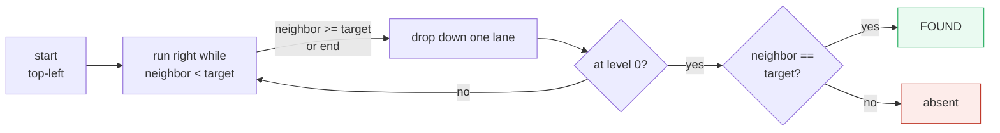
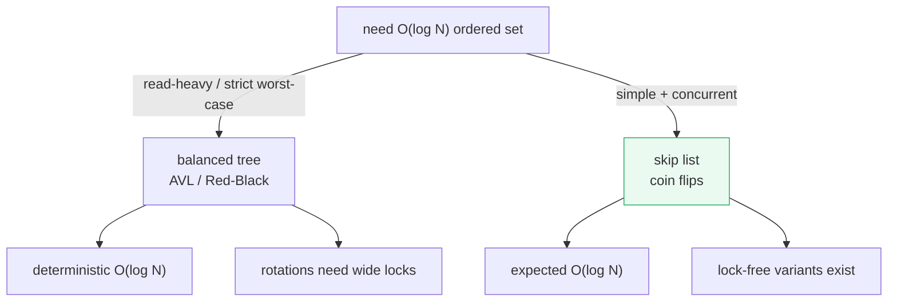

# Skip List — A Visual, Lane-by-Lane, Worked-Example Guide

> **Companion code:** [`skip_list.py`](./skip_list.py). **Every number and level
> in this guide is printed by `python3 skip_list.py`** — nothing is hand-computed.
>
> **Live animation:** [`skip_list.html`](./skip_list.html) — open in a browser.
> It rebuilds the skip list in JS from the *identical* seeded coin flips and
> gold-checks the search-path lengths against the `.py`.

---

## 0. TL;DR — the express lanes over a sorted queue

> **The analogy (read this first):** Imagine a **sorted queue** of people in one
> long line (the bottom-level linked list). To find person #500 you'd walk past
> 499 others — slow. So we build **express lanes** above the line: each express
> lane keeps roughly **half** the people (chosen by a coin flip), letting you
> skip big gaps. Stand on the top express lane, run right until you're about to
> overshoot, then **drop down** one lane and run again. Each lane halves the
> remaining distance → **O(log N) hops**.

A skip list is a **probabilistic** alternative to a balanced tree. It gets the
**same expected O(log N)** search/insert/delete as an AVL/Red-Black tree, but
with nothing but **coin flips and pointer rewires** — no rotations, no
recoloring, no balance factors. That simplicity (and its concurrency-friendliness)
is why **Redis** uses skip lists for sorted sets (ZSET), and LevelDB/RocksDB use
them for memtables.



> One plain sentence: a skip list is a stack of sorted linked lists where each
> lane is a random ~half of the lane below — search starts at the top and
> **drops down** whenever it would overshoot, visiting **~log₂N** nodes.

---

### Glossary (plain English — refer back any time)

| Term | Plain meaning |
|---|---|
| **node** | A cell holding a value + a list of forward pointers, one per level it appears on. |
| **level** | A horizontal linked list. Level 0 has ALL elements; higher levels are sparser "express lanes". |
| **forward[i]** | The next node on lane i (the "right" pointer on lane i). |
| **header** | A sentinel node at the far left whose forward pointers start every lane. Searching starts at the header's top lane. |
| **coin flip** | On insert, flip a biased coin (prob p of heads). Keep flipping while heads: the number of heads = the node's level. |
| **promotion** | "This element made it onto lane k" = it got k heads in a row. |
| **p** | The promotion probability. p=0.5 halves each lane (the classic choice). |

---

## 1. Build from `[3,6,7,9,12,17,19,21,25,26]` — show all levels

This is the canonical worked example (the classic Pugh skip list figure). We
insert ten values with a **seeded RNG (seed=42, p=0.5)** so every coin flip is
deterministic and the `.html` can replicate it byte-for-byte.

> From `skip_list.py` **Section A**:
>
> ```
> levels: 0..4 (highest occupied lane = 4)
>   L4: 12 -> NULL
>   L3:  6 -> 12 -> NULL
>   L2:  6 -> 12 -> 17 -> NULL
>   L1:  6 -> 12 -> 17 -> 21 -> 26 -> NULL
>   L0:  3 ->  6 ->  7 ->  9 -> 12 -> 17 -> 19 -> 21 -> 25 -> 26 -> NULL
>   (bottom lane L0 holds ALL elements; higher lanes skip elements)
>
> Each element's top lane (promotion via coin flips):
> | val | top level |
> |-----|-----------|
> | 3   | 0         |
> | 6   | 3         |
> | 7   | 0         |
> | 9   | 0         |
> | 12  | 4         |
> | 17  | 2         |
> | 19  | 0         |
> | 21  | 1         |
> | 25  | 0         |
> | 26  | 1         |
> ```



```mermaid
graph LR
    H["header"] --> L4_12["12"] --> L3_12
    H --> L3_6["6"] --> L3_12["12"]
    H --> L2_6["6"] --> L2_12["12"] --> L2_17["17"]
    H --> L1_6["6"] --> L1_12["12"] --> L1_17["17"] --> L1_21["21"] --> L1_26["26"]
    H --> L0_3["3"] --> L0_6["6"] --> L0_7["7"] --> L0_9["9"] --> L0_12["12"] --> L0_17["17"] --> L0_19["19"] --> L0_21["21"] --> L0_25["25"] --> L0_26["26"]
    style H fill:#161b22,stroke:#8b949e
    style L4_12 fill:#fef9e7,stroke:#f1c40f
    style L3_6 fill:#fef9e7,stroke:#f1c40f
```

Each lane is a **subsequence** of the lane below. Element **12** got 4 heads in a
row (top level 4); element **6** got 3 (top level 3). These promoted elements are
the "express stops" that let a search skip big gaps.

---

## 2. Search — start top-left, step right while smaller, else drop down

The whole algorithm in three lines: start at the header's top lane; if the
neighbor is smaller than the target, **step right**; otherwise **drop down**. At
level 0 the neighbor is either the target (found) or past it (absent).

> From `skip_list.py` **Section B**:
>
> ```
> | target | found | forward hops | <= 2*log2(N)=8? |
> |--------|-------|--------------|-----------------|
> | 3      | True  | 0            | True             |
> | 6      | True  | 1            | True             |
> | 7      | True  | 1            | True             |
> | 9      | True  | 2            | True             |
> | 12     | True  | 3            | True             |
> | 17     | True  | 1            | True             |
> | 19     | True  | 2            | True             |
> | 21     | True  | 3            | True             |
> | 25     | True  | 3            | True             |
> | 26     | True  | 4            | True             |
>
> N = 10, bound = 2*ceil(log2(10)) = 8
> [check] every search path <= 8 hops? True
> ```

A **forward hop** is one step right on some lane. The worst case is **4 hops**
(for value 26), against a bound of `2·log₂(10) = 8` — comfortably within, because
each express lane roughly halves the remaining distance.

> From `skip_list.py` **Section B** (a detailed trace, target = 19):
>
> ```
> Trace one search in detail (target = 19):
>   start at header, top lane = L4
>     L4: step right -> 12
>     drop down to L3  (1 right step(s) on L4)
>     drop down to L2  (no right step on L3)
>     L2: step right -> 17
>     drop down to L1  (1 right step(s) on L2)
>     drop down to L0  (no right step on L1)
>     L0 neighbor = 19 -> FOUND 19
>     total forward hops = 2
> ```

> 🔗 **Why express lanes halve the distance:** on lane k, a node's neighbor is
> ~2^k positions away on the bottom lane (each coin flip skips with probability
> p). So after one hop on the top lane you've cleared a big chunk; dropping down
> narrows the granularity. This is exactly the binary-search intuition, but
> encoded as a **random** linked structure instead of an array.

---

## 3. Insert with coin-flip promotion

To insert, first do a search to find the splice point on each lane, then **flip
coins** to decide the new node's top level, and splice it into lanes 0..level.
Each coin flip is independent, so promotion is purely probabilistic — no
rebalancing cascade like in an AVL tree.

> From `skip_list.py` **Section C** (insert 15):
>
> ```
> coin flips for the new node 15 (stop at first tails):
>   flip #1: random=0.6981 -> tails
>   => top level = 0  (the node appears on lanes 0..0)
>
> Skip list after inserting 15:
>   L4: 12 -> NULL
>   L3:  6 -> 12 -> NULL
>   L2:  6 -> 12 -> 15 -> 17 -> NULL
>   L1:  6 -> 12 -> 15 -> 17 -> 21 -> 26 -> NULL
>   L0:  3 ->  6 ->  7 ->  9 -> 12 -> 15 -> 17 -> 19 -> 21 -> 25 -> 26 -> NULL
>
> in-order (bottom lane, must be sorted): [3, 6, 7, 9, 12, 15, 17, 19, 21, 25, 26]
> [check] bottom lane still sorted? True
> ```

Here the first flip was tails (0.6981 ≥ 0.5), so node 15 only lands on the bottom
lane (level 0) — it becomes a regular "non-express" stop. Had the flips gone
HEADS, HEADS, tails, it would have been promoted to level 2 and spliced into
lanes 0, 1, and 2.

---

## 4. Expected height = log_{1/p}(N)

The highest occupied lane is ~log_{1/p}(N). Each lane keeps fraction p of the
lane below, so after k lanes ~N·p^k nodes remain; the list runs out of nodes
around `k = log_{1/p}(N)`. For p=0.5 that is **log₂N**.

> From `skip_list.py` **Section D**:
>
> ```
> | N      | log2(N) (expected height, p=0.5) |
> |--------|-----------------------------------|
> | 16     | 4.00                          |
> | 64     | 6.00                          |
> | 256    | 8.00                          |
> | 1024   | 10.00                         |
> | 4096   | 12.00                         |
> | 65536  | 16.00                         |
>
> Empirical check (N=1024, 2000 builds, p=0.5):
>   average highest lane = 10.25
>   theory log2(1024)     = 10.00
> [check] avg height within +/-1 of log2(N)? True
> ```

Empirically, the average highest lane over **2000** random builds at N=1024 is
**10.25**, right on top of the theoretical **log₂1024 = 10**. This is why the
classic p=0.5 gives a list of height ~log₂N — directly analogous to a balanced
tree's height, but achieved by coin flips.

---

## 5. Skip list vs balanced tree

A skip list trades a **probabilistic** (not worst-case) bound for dramatically
simpler code and easy concurrency. There are no rotations to coordinate across
threads — each insert/delete only rewires a few local pointers.



> From `skip_list.py` **Section E**:
>
> | property | skip list | balanced tree (AVL/RB) |
> |---|---|---|
> | balance mechanism | coin flips (probabilistic) | rotations/recolor |
> | search (expected) | **O(log N)** | O(log N) |
> | search (worst) | O(N) (rare) | **O(log N) guaranteed** |
> | insert / delete | O(log N) expected | **O(log N) guaranteed** |
> | implementation | **SIMPLER** (pointer rewires) | fiddly rotations |
> | concurrency | **lock-free variants exist** | rotations need wide locks |
> | memory overhead | ~1/(1-p) ptrs/node | 2-3 ptrs + color/height |
> | order guarantees | probabilistic | deterministic |

**Real-world users:** Redis (ZSET sorted sets), LevelDB/RocksDB (memtables),
Apache Lucene, MemSQL. They pick the skip list for its simplicity and
concurrency-friendliness, accepting a probabilistic (not worst-case) guarantee
in exchange.

---

## 6. Gold check (how the bundle stays honest)

Every number above is reproducible from one command:

```bash
python3 skip_list.py          # prints all sections + gold check
python3 skip_list.py > skip_list_output.txt   # capture
```

The **search-path bound** — every forward-hop path ≤ 2·log₂(N) — is the gold
contract. The companion [`skip_list.html`](./skip_list.html) rebuilds the *same*
skip list from the *same* seeded coin flips in JavaScript and shows a green
`[check: OK]` badge when its path lengths match.

> From `skip_list.py` **GOLD CHECK**:
>
> ```
> canonical list (seed=42): N = 10, bound = 2*ceil(log2(10)) = 8
> forward-hop search paths: {3: 0, 6: 1, 7: 1, 9: 2, 12: 3, 17: 1, 19: 2, 21: 3, 25: 3, 26: 4}
> worst-case path = 4 hops (for value 26)
> GOLD (pinned for skip_list.html): N=10, bound=8, worst_path=4, all_within_bound=True
> [check] every search path <= 2*log(N) = 8 hops: OK
> ```

| quantity | value | source |
|---|---|---|
| N (canonical list) | **10** | Section A |
| highest lane | **4** | Section A |
| forward-hop paths | `{3:0, 6:1, 7:1, 9:2, 12:3, 17:1, 19:2, 21:3, 25:3, 26:4}` | Section B / gold |
| worst-case search path | **4 hops** (value 26) | gold |
| bound (2·log₂N) | **8** | gold |
| expected height (N=1024) | **10.25** empirical vs 10.00 theory | Section D |

---

## Further reading

- **William Pugh** (1990), "Skip lists: a probabilistic alternative to balanced
  trees," *Communications of the ACM* 33(6) — the original paper.
- **CLRS** *Introduction to Algorithms*, 3rd ed. — probabilistic analysis
  background for the O(log N) expected bounds.
- **Redis** `t_zset.c` — the skip list backs the ZSET (sorted set) data type.
- **LevelDB / RocksDB** — skip list memtable implementation, including the
  lock-free concurrent variant.
