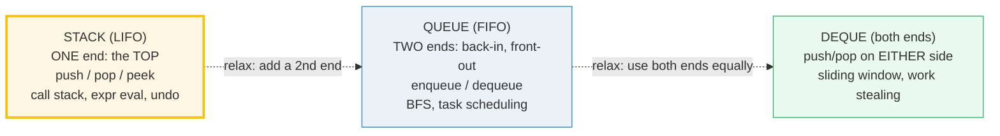
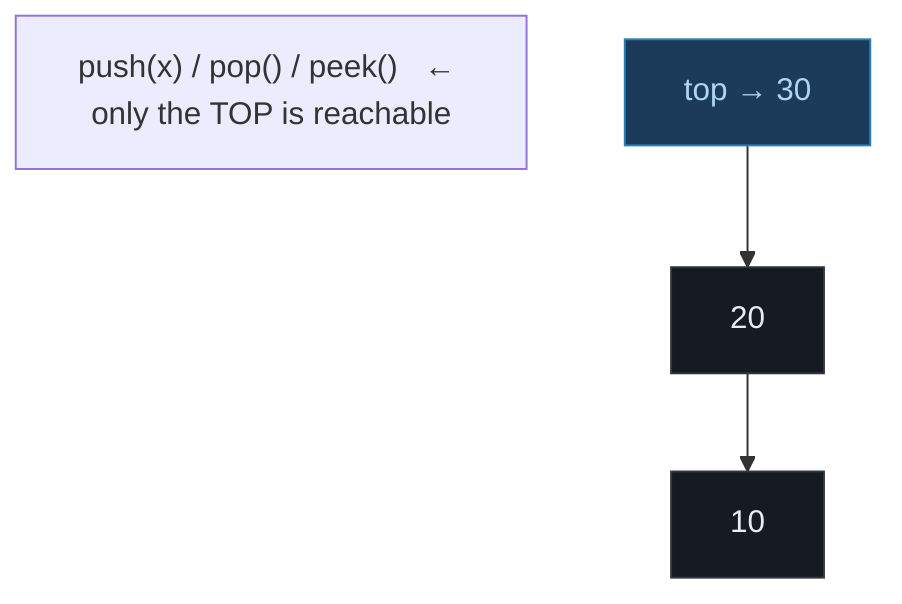
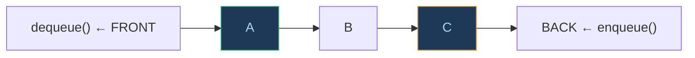
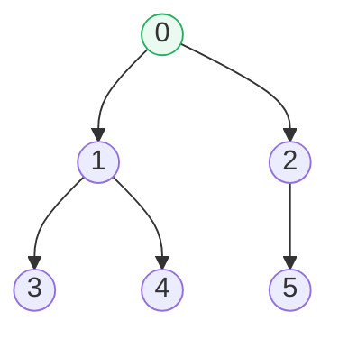

# Stack · Queue · Deque — A Visual, Worked-Example Guide

> **Companion code:** [`stack_queue_deque.py`](./stack_queue_deque.py). **Every
> number in this guide is printed by `python3 stack_queue_deque.py`** — change
> the code, re-run, re-paste. Nothing here is hand-computed.
>
> **Live animation:** [`stack_queue_deque.html`](./stack_queue_deque.html) —
> open in a browser. Three panels step through each algorithm live and
> gold-check against the `.py`.
>
> **Source material:** CLRS ch.10 (Elementary Data Structures), Sedgewick &
> Wayne ch.1.3 (Stacks and Queues) and ch.1.4 (resizing-array analysis).

---

## 0. TL;DR — three containers, three access disciplines

Three linear ADTs that differ only in **which end(s) you may touch**:



Each one exists because a **famous algorithm needs exactly that access rule**:

| ADT | Discipline | The algorithm that needs it | Section |
|---|---|---|---|
| **Stack** | LIFO — one end | operator-precedence expression evaluation (two-stack) | [A](#a-stack--lifo) |
| **Queue** | FIFO — back in / front out | Breadth-First Search (FIFO frontier) | [B](#b-queue--fifo) |
| **Queue** | FIFO, true O(1) | fixed-capacity producer/consumer (circular buffer) | [C](#c-circular-buffer-queue) |
| **Deque** | both ends | sliding-window maximum (monotonic deque) | [D](#d-deque--both-ends) |

> **One-line definition each:**
> - **Stack** = push/pop only at the **top** (LIFO). Last in, first out.
> - **Queue** = enqueue at the **back**, dequeue at the **front** (FIFO). First in, first out.
> - **Deque** = push/pop at **either end**. The general case; stack and queue are its restrictions.

### Glossary

| Term | Plain meaning |
|---|---|
| **LIFO / FIFO** | Last-In-First-Out / First-In-First-Out — which end exits |
| **top** | the only accessible end of a Stack |
| **front / back** | the two ends of a Queue. `enqueue` = back, `dequeue` = front |
| **peek** | look at an end **without** removing it |
| **amortized O(1)** | most ops are O(1); occasionally one is O(n) (a resize) but the average stays O(1) |
| **circular buffer** | a fixed array used as a queue via `head`/`tail` indices that wrap mod capacity |
| **monotonic deque** | a deque kept strictly decreasing, so the front is always the window max in O(1) |

---

## A. Stack (LIFO)

A stack has **one access point: the top**. `push` adds on top, `pop` removes
from top. The most recent element is the first to leave.



> From `stack_queue_deque.py` Section A (push/pop/peek demo):
> ```
>   after push (top -> bottom): [10]
>   after push (top -> bottom): [10, 20]
>   after push (top -> bottom): [10, 20, 30]
>   peek() -> 30   (top, not removed)
>   pop()  -> 30
>   pop()  -> 20
>   after two pops (top -> bottom): [10]
> ```

### Application: operator-precedence expression evaluation (two stacks)

**Dijkstra's two-stack algorithm** evaluates `3 + 4 * 2` with precedence using
**two stacks**: `VALUES` (numbers) and `OPS` (operators). The rule is the whole
trick:

> When an operator `o` arrives, **first fire every stacked operator whose
> precedence is ≥ `o`'s** (this enforces left-associativity *and* precedence),
> then push `o`.

Because `*` (precedence 2) outranks `+` (precedence 1), `4 * 2` is computed
**before** the `+` is applied — without any grammar, just two stacks.

> From `stack_queue_deque.py` Section A — the trace of `3 + 4 * 2`:
> ```
>     read     3  | values=[3]  ops=[]
>     read   '+'  | values=[3]  ops=['+']
>     read     4  | values=[3, 4]  ops=['+']
>     read   '*'  | values=[3, 4]  ops=['+', '*']      ← '*' does NOT fire '+'
>     read     2  | values=[3, 4, 2]  ops=['+', '*']
>     flush op    | values=[3, 8]  ops=['+']            ← 4 * 2 = 8
>     flush op    | values=[11]  ops=[]                 ← 3 + 8 = 11
>   result = 11    (== 3 + (4 * 2) = 3 + 8 = 11)
> [check] '3 + 4 * 2' == 11:  OK
> ```

Parentheses override precedence by pushing `(` and flushing until `(` on `)`:

> From `stack_queue_deque.py` Section A:
> ```
>   result = 14    (== (3 + 4) * 2 = 7 * 2 = 14)
> [check] '( 3 + 4 ) * 2' == 14:  OK
> ```

🔗 **Why this needs a Stack, not a Queue:** evaluation is *inside-out* — the
most recently pushed sub-expression must be reduced first. That is the
definition of LIFO. A FIFO queue would evaluate sub-expressions in the wrong
order. This is also exactly how **function-call recursion** works: the call
stack pops the most recent frame first.

---

## B. Queue (FIFO)

A queue has **two access points**: the **back** (enqueue) and the **front**
(dequeue). First in, first out.



> From `stack_queue_deque.py` Section B:
> ```
>   after enqueue (front -> back): ['A']
>   after enqueue (front -> back): ['A', 'B']
>   after enqueue (front -> back): ['A', 'B', 'C']
>   peek()    -> A   (front, not removed)
>   dequeue() -> A
>   dequeue() -> B
>   after two dequeues (front -> back): ['C']
> ```

### Application: Breadth-First Search (the queue *is* the frontier)

In BFS the queue holds the **frontier**: nodes discovered but not yet
explored. Dequeue one node to **visit**, enqueue its unvisited neighbors.
FIFO order is what makes BFS visit nodes **in distance order** (level by
level) — a stack here would give you DFS instead.

The 6-node graph:



> From `stack_queue_deque.py` Section B — the frontier at each step:
> ```
>     start: enqueue 0                 frontier(front->back) = [0]
>     dequeue 0 -> visit               frontier(front->back) = []
>       enqueue neighbors of 0         frontier(front->back) = [1, 2]
>     dequeue 1 -> visit               frontier(front->back) = [2]
>       enqueue neighbors of 1         frontier(front->back) = [2, 3, 4]
>     dequeue 2 -> visit               frontier(front->back) = [3, 4]
>       enqueue neighbors of 2         frontier(front->back) = [3, 4, 5]
>     dequeue 3 -> visit               frontier(front->back) = [4, 5]
>       enqueue neighbors of 3         frontier(front->back) = [4, 5]
>     dequeue 4 -> visit               frontier(front->back) = [5]
>       enqueue neighbors of 4         frontier(front->back) = [5]
>     dequeue 5 -> visit               frontier(front->back) = []
>       enqueue neighbors of 5         frontier(front->back) = []
>   BFS visit order: [0, 1, 2, 3, 4, 5]
> [check] BFS visit order == [0, 1, 2, 3, 4, 5]:  OK
> ```

🔗 **Why this needs a Queue, not a Stack:** BFS explores in **insertion order**
(first discovered = first visited). That is the definition of FIFO. Other
queue applications: **task scheduling** (fair, in-arrival-order dispatch) and
**producer–consumer** pipelines (bounded buffer between threads).

---

## C. Circular-buffer queue

The naive queue above uses `pop(0)` to dequeue, which is **O(n)** — every
remaining element must shift down. For a hot path like a producer/consumer
buffer this is unacceptable. The fix is a **fixed array + two indices** (`head`
and `tail`) that wrap modulo capacity:

```
index = (index + 1) % capacity
```

Neither enqueue nor dequeue ever moves data, so **both are true O(1)**. The
price is a hard capacity bound and the need to distinguish full from empty
(we track `count`).

```
index :  0   1   2   3            (capacity C = 4)
buf   : [E] [F] [C] [D]
              ^head   ^tail? ...
count = 4   → logical FIFO order: C, D, E, F   (follow head mod C)
```

> From `stack_queue_deque.py` Section C — wrap-around trace (capacity 4):
> ```
>     init                               buf=[None,None,None,None] head=0 tail=0 count=0 logical=[]
>     enqueue A                          buf=['A',None,None,None] head=0 tail=1 count=1 logical=['A']
>     enqueue B                          buf=['A','B',None,None] head=0 tail=2 count=2 logical=['A','B']
>     enqueue C                          buf=['A','B','C',None] head=0 tail=3 count=3 logical=['A','B','C']
>     enqueue D                          buf=['A','B','C','D'] head=0 tail=0 count=4 logical=['A','B','C','D']
>     ^ buffer is now FULL (count == capacity).
>     dequeue() -> A   (A leaves; head advances, NO shift)
>     after dequeue A                    buf=[None,'B','C','D'] head=1 tail=0 count=3 logical=['B','C','D']
>     dequeue() -> B   (B leaves)
>     after dequeue B                    buf=[None,None,'C','D'] head=2 tail=0 count=2 logical=['C','D']
>     Now tail has wrapped to index 0. Enqueuing writes there:
>     enqueue E  <- tail wrapped to 0    buf=['E',None,'C','D'] head=2 tail=1 count=3 logical=['C','D','E']
>     enqueue F  <- tail wrapped to 1    buf=['E','F','C','D'] head=2 tail=2 count=4 logical=['C','D','E','F']
>   logical FIFO order (following head mod cap) = [C, D, E, F]
> [check] circular logical order == [C, D, E, F]:  OK
> ```

> **The classic bug:** `head == tail` is ambiguous — it means both "empty" and
> "full". Resolving it by tracking `count` (as above) or by wasting one slot is
> the single most common circular-buffer interview question.

---

## D. Deque (both ends)

A deque (double-ended queue) admits `push`/`pop` on **both ends** — front and
back. It is the general case: restrict it to one end and you get a **stack**;
restrict the front to pop-only and the back to push-only and you get a
**queue**.

> From `stack_queue_deque.py` Section D:
> ```
>   push_back 2 (front -> back): [2]
>   push_back 5 (front -> back): [2, 5]
>   push_front 1 (front -> back): [1, 2, 5]
>   pop_front() -> 1   pop_back() -> 5
>   after both pops (front -> back): [2]
> ```

### Application: sliding-window maximum (monotonic deque)

The problem: for every length-`k` window of an array, output the window's max.
Naive is O(n·k); the **monotonic-deque** method is **O(n)**.

The deque stores **indices**, kept so that `nums[deque]` is **strictly
decreasing**. Therefore `deque.front()` is *always* the index of the current
window's max. For each new element:

1. **Evict** the front if its index fell out of the window `[i-k+1 .. i]`.
2. **Pop the back** while its value ≤ the new value (those can never be a
   future max — the new, larger, more-recent value dominates them).
3. **Push** the new index at the back.
4. Once `i ≥ k-1`, **emit** `nums[front]`.

Each index enters and leaves the deque **at most once**, so the total work is
O(n).

> From `stack_queue_deque.py` Section D — `nums=[1,3,-1,-3,5,3,6,7]`, `k=3`:
> ```
>    i    x            window      deque(indices)   max
>    0   +1            [1]                 [0]
>    1   +3            [1, 3]              [1]
>    2   -1        [1, 3, -1]           [1, 2]      +3
>    3   -3       [3, -1, -3]        [1, 2, 3]      +3
>    4   +5       [-1, -3, 5]             [4]        +5
>    5   +3        [-3, 5, 3]          [4, 5]        +5
>    6   +6         [5, 3, 6]             [6]        +6
>    7   +7         [3, 6, 7]             [7]        +7
>   result = [3, 3, 5, 5, 6, 7]
> [check] sliding-window max == [3, 3, 5, 5, 6, 7]:  OK
> ```

Watch step `i=4` (`x=5`): the new value is bigger than *everything* in the
deque, so the back-pop loop empties it entirely — `[1,2,3]` → `[4]`. Those
evicted indices can never be a max again, because `5` is larger *and* more
recent. That dominance argument is what makes the algorithm correct *and*
linear.

🔗 **Other deque applications:** **work-stealing schedulers** (each worker has
a deque it pops from one end while thieves steal from the other — the Chase-Lev
deque), and **palindrome checking** (peel matching characters off both ends).

---

## E. Array vs linked-list implementations

The same ADT can be backed by a **dynamic array** or a **linked list**. The
trade-off is **amortized vs guaranteed O(1)** plus **cache behavior**:

| Backing | push / enqueue | pop / dequeue | resize spike? | Cache | Per-node overhead |
|---|---|---|---|---|---|
| **array** | amortized O(1) | O(1) | yes (rare) | **friendly** (contiguous) | 0 |
| **linked list** | **guaranteed O(1)** | O(1) | never | unfriendly (pointer chase) | 1–2 pointers |

> **Amortized O(1):** a single array `push` may trigger a resize that copies
> all `n` elements (O(n)), but with the **doubling strategy** this happens so
> rarely that the *average* cost over `n` pushes is still O(1):

> From `stack_queue_deque.py` Section E — doubling cost analysis:
> ```
>   pushes 1..n: total work = n (the pushes) + (1+2+4+...+n) (the copies)
>   for n = 16: resize copies = 1 + 2 + 4 + 8 = 15, which is < 2n.
>   So total = O(n) -> O(1) amortized.
> [check] resize copies (15) < 2n (32):  OK
> ```

**Gold cross-check — both backings agree.** Evaluating the same expression
with an array-backed Stack and a linked-list Stack must yield the native Python
result. This proves the two implementations are interchangeable for the ADT's
contract:

> From `stack_queue_deque.py` Section E:
> ```
>   Gold cross-check: evaluate '3 + 4 * 2 - 5' three ways
>     array-backed  Stack : 6
>     linked-list   Stack : 6
>     Python native expr  : 6
>   [check] all three agree (6)?  True
> ```

### Complexity cheat-sheet (all verified in the `.py`)

| Structure | push/enqueue | pop/dequeue | peek | space |
|---|---|---|---|---|
| Stack (array) | amortized O(1) | O(1) | O(1) | O(n) |
| Stack (linked list) | O(1) | O(1) | O(1) | O(n) + ptrs |
| Queue (array shift) | O(1) | **O(n)** — bad | O(1) | O(n) |
| Queue (circular) | O(1) | O(1) | O(1) | O(capacity) |
| Queue (linked list) | O(1) | O(1) | O(1) | O(n) + ptrs |
| Deque (array-grow) | amortized O(1) | O(1) | O(1) | O(n) |
| Deque (linked list) | O(1) | O(1) | O(1) | O(n) + 2 ptrs |

> **Practical note:** Python's `collections.deque` is a doubly-linked **block
> array** (fixed-size chunks linked together) — it gets O(1) on both ends
> *without* the per-element pointer overhead of a plain linked list, and with
> much better cache locality. That hybrid is the production answer to the
> table above.

---

## Sources

- **CLRS**, *Introduction to Algorithms*, 3rd ed., ch.10 (Elementary Data
  Structures) — stacks, queues, linked lists, and the array-based
  implementations.
- **Sedgewick & Wayne**, *Algorithms*, 4th ed., ch.1.3 (Stacks and Queues) —
  the two-stack expression-evaluation algorithm and resizing-array analysis —
  and ch.1.4 for the amortized O(1) proof of array doubling.
- The deque sliding-window-maximum technique is folklore; see LeetCode 239 and
  the Chase-Lev work-stealing deque (Le, Pop, Cohen & Nardelli, 2009).
