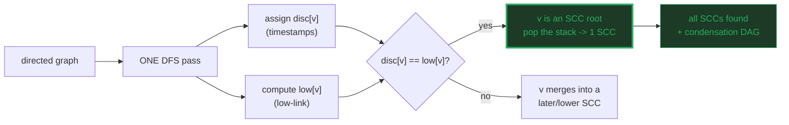
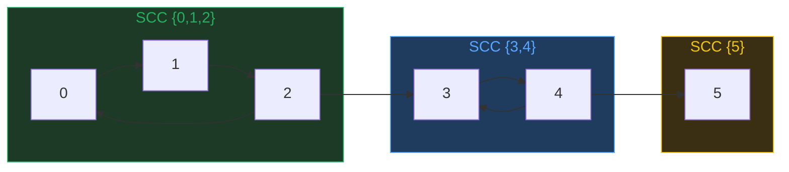
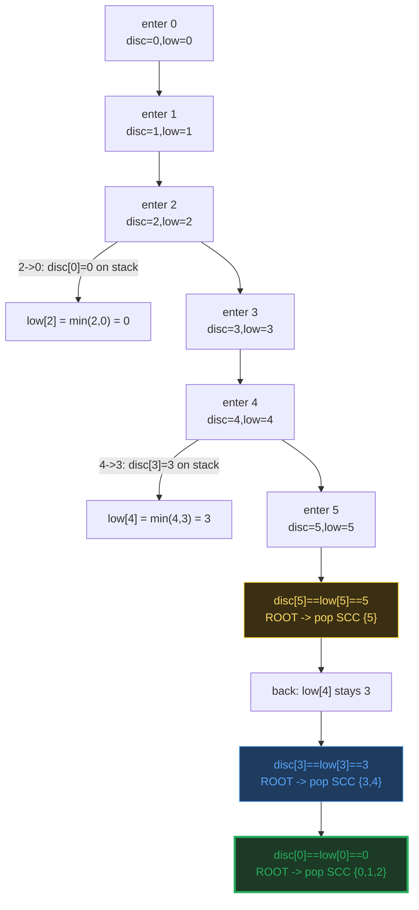
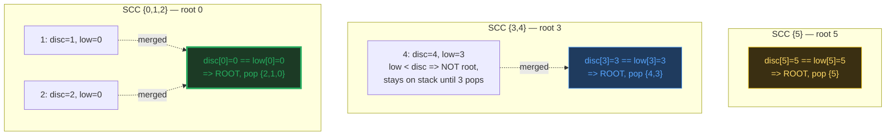
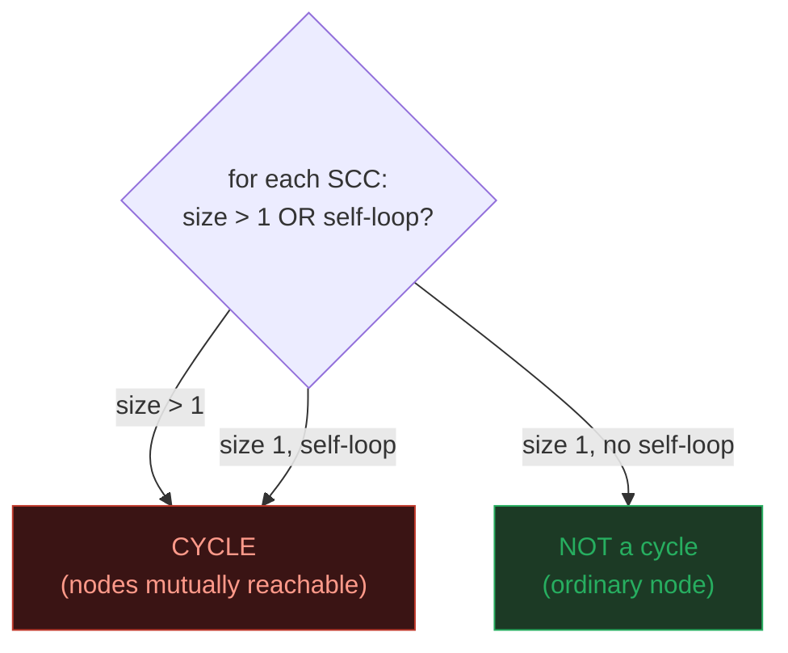
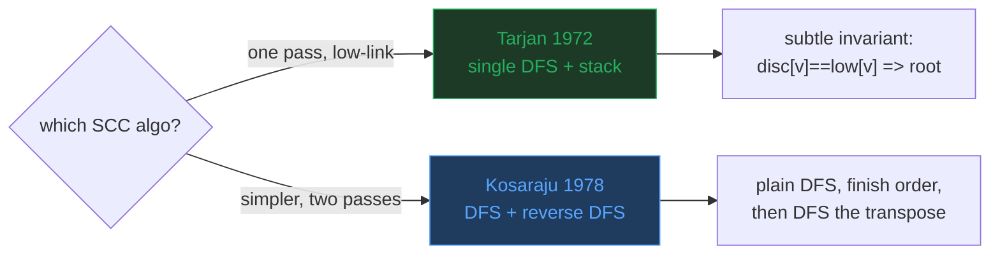

# Tarjan's SCC — A Visual, Worked-Example Guide

> **Companion code:** [`tarjan_scc.py`](./tarjan_scc.py). **Every number,
> discovery time, and low-link value in this guide is printed by `python3
> tarjan_scc.py`** — nothing is hand-computed.
>
> **Live animation:** [`tarjan_scc.html`](./tarjan_scc.html) — open in a
> browser: the 6-node graph with Tarjan's DFS stepping, the `disc == low` SCC
> pop, cycle highlighting, and a Tarjan-vs-Kosaraju-vs-Floyd comparison.

---

## 0. TL;DR — the one idea

> **The "mutual reachability clique" analogy (read this first):** in a directed
> graph, two nodes `u` and `v` are **strongly connected** if you can walk
> `u -> ... -> v` AND `v -> ... -> u`. Strong connectivity partitions the nodes
> into **Strongly Connected Components** (SCCs). Tarjan finds them all in a
> SINGLE DFS pass using two numbers per node: a **discovery time** and a
> **low-link value**.
>
> - **low-link `low[v]`:** the smallest discovery time reachable from `v` by
>   following tree edges and at most ONE edge back to a node still on the stack.
> - **the SCC root test:** `v` roots an SCC ⟺ `disc[v] == low[v]`. Pop the
>   stack down to `v` — that is exactly one SCC.

| concept | meaning | cost |
|---|---|---|
| **SCC** | a maximal set of mutually-reachable nodes | — |
| **disc[v]** | discovery time (DFS timestamp) of `v` | O(1) per node |
| **low[v]** | earliest disc reachable from `v`'s subtree + one stack edge | O(V+E) total |
| **root test** | `disc[v] == low[v]` ⟹ `v` is an SCC root → pop | O(1) per root |
| **condensation** | shrink each SCC to one node → always a DAG | — |

SCCs are the fundamental structure of any directed graph. The **condensation**
(shrink each SCC to one node) is always a DAG — and a DAG is exactly what you
need for topological sort, dependency resolution, and cycle analysis. So "find
the SCCs" is step zero of almost every directed-graph algorithm. Tarjan does it
in ONE DFS pass and **O(V+E)** — optimal.



---

### Glossary (plain English — refer back any time)

| Term | Plain meaning |
|---|---|
| **SCC** | A maximal set of nodes where every node reaches every other. |
| **condensation** | The graph obtained by shrinking each SCC to one node. Always a DAG. |
| **disc[v]** | Discovery time (timestamp) of `v` in the DFS forest. |
| **low[v]** | The lowest discovery time reachable from `v` via tree edges + at most one edge to a node ON THE STACK. If `low[v] == disc[v]`, v roots an SCC. |
| **stack** | The "current DFS frontier" — nodes whose SCC is not yet finalized. A node leaves only when its SCC is popped. |
| **on_stack[v]** | Boolean: is `v` currently on the stack? Only on-stack neighbours update low-link. |
| **back edge** | `u -> w` where `w` is an ANCESTOR of `u` (w on stack). |
| **cross edge** | `u -> w` where `w` is in a different subtree but still on the stack. |
| **self-loop** | An edge `v -> v`. A single node with a self-loop IS an SCC of size 1 that IS a cycle. |
| **cycle** | Any SCC of size > 1, OR a singleton SCC with a self-loop. |

---

## 1. Run Tarjan — discovery times and low-link values

The worked graph has **6 nodes, 3 SCCs**. The condensation is a clean chain:
`{0,1,2} -> {3,4} -> {5}`.

> From `tarjan_scc.py` Section A — the worked graph:

```
Nodes: [0, 1, 2, 3, 4, 5]   (V = 6)
Edges (7):
    0 -> 1
    1 -> 2
    2 -> 0      <- closes SCC {0,1,2}
    2 -> 3      <- bridge to next SCC
    3 -> 4
    4 -> 3      <- closes SCC {3,4}
    4 -> 5      <- bridge to next SCC
Adjacency list (sorted for determinism):
    adj[0] = [1]
    adj[1] = [2]
    adj[2] = [0, 3]
    adj[3] = [4]
    adj[4] = [3, 5]
    adj[5] = []
```



> From `tarjan_scc.py` Section A — the Tarjan DFS trace:

```
DFS trace (events in order; outer loop visits 0..5):
    enter 0: disc[0]=0, low[0]=0, stack=[0]
    tree-edge 0->1: recurse into 1
    enter 1: disc[1]=1, low[1]=1, stack=[0, 1]
    tree-edge 1->2: recurse into 2
    enter 2: disc[2]=2, low[2]=2, stack=[0, 1, 2]
    back/cross 2->0: disc[0]=0 on stack, low[2]=0
    tree-edge 2->3: recurse into 3
    enter 3: disc[3]=3, low[3]=3, stack=[0, 1, 2, 3]
    tree-edge 3->4: recurse into 4
    enter 4: disc[4]=4, low[4]=4, stack=[0, 1, 2, 3, 4]
    back/cross 4->3: disc[3]=3 on stack, low[4]=3
    tree-edge 4->5: recurse into 5
    enter 5: disc[5]=5, low[5]=5, stack=[0, 1, 2, 3, 4, 5]
    *** SCC root 5: disc[5]=5 == low[5]=5 -> pop SCC [5]
    back in 4: low[4]=3  (min with low[5]=5)
    back in 3: low[3]=3  (min with low[4]=3)
    *** SCC root 3: disc[3]=3 == low[3]=3 -> pop SCC [3, 4]
    back in 2: low[2]=0  (min with low[3]=3)
    back in 1: low[1]=0  (min with low[2]=0)
    back in 0: low[0]=0  (min with low[1]=0)
    *** SCC root 0: disc[0]=0 == low[0]=0 -> pop SCC [0, 1, 2]

Discovery times disc: [0, 1, 2, 3, 4, 5]
Low-link values low:  [0, 0, 0, 3, 3, 5]
SCCs found (in finalize order, = reverse condensation topo order):
    SCC #1: [5]   (root = 5, disc[5]=5 == low[5]=5)
    SCC #2: [3, 4]   (root = 3, disc[3]=3 == low[3]=3)
    SCC #3: [0, 1, 2]   (root = 0, disc[0]=0 == low[0]=0)
```



> **The stack is the whole trick.** DFS descends `0 -> 1 -> 2 -> 3 -> 4 -> 5`,
> pushing every node onto the stack. When it reaches the **deepest** node (5,
> no outgoing edges), `disc[5] == low[5] == 5`, so 5 is an SCC root → pop `{5}`.
> Then unwinding: 4's low stays 3 (it can reach 3, still on the stack), and at
> 3 we hit `disc[3] == low[3] == 3` → pop `{3, 4}`. Finally at 0:
> `disc[0] == low[0] == 0` → pop `{0, 1, 2}`. Tarjan emits SCCs in **REVERSE**
> topological order of the condensation (deepest first).

---

## 2. The SCC root test — `disc[v] == low[v]` ⟹ pop

A node `v` is the ROOT of an SCC exactly when its discovery time equals its
low-link value: `disc[v] == low[v]`.

> From `tarjan_scc.py` Section B — the root table:

```
  | node | disc | low | disc==low? | role               |
  |------|------|-----|------------|--------------------|
  | 0    | 0    | 0   | YES        | SCC ROOT -> pop    |
  | 1    | 1    | 0   | no         | merged into a later SCC |
  | 2    | 2    | 0   | no         | merged into a later SCC |
  | 3    | 3    | 3   | YES        | SCC ROOT -> pop    |
  | 4    | 4    | 3   | no         | merged into a later SCC |
  | 5    | 5    | 5   | YES        | SCC ROOT -> pop    |

  SCC #1 [5]: root = 5 (disc=5, low=5). Members: 5(disc=5,low=5)
  SCC #2 [3, 4]: root = 3 (disc=3, low=3). Members: 3(disc=3,low=3), 4(disc=4,low=3)
  SCC #3 [0, 1, 2]: root = 0 (disc=0, low=0). Members: 0(disc=0,low=0), 1(disc=1,low=0), 2(disc=2,low=0)
```



> **WHY `disc == low` means root.** `low[v]` is the earliest discovery time
> reachable from `v`'s subtree via tree edges + one stack edge. If
> `low[v] > disc[v]`, some node reachable from `v` can reach an EARLIER node
> still on the stack — so `v` is NOT the top of a closed mutual-reachability
> clique; the SCC root is higher up (its low was pulled down by a back/cross
> edge). Only when `low[v] == disc[v]` has the clique "closed" at `v`, and
> everything from `v` to the top of the stack is one SCC. **Pop it.**
>
> **Note node 5:** `disc=5 == low=5` but it is a SINGLETON with no self-loop,
> so it is an SCC of size 1 that is **NOT a cycle** (Section 3).

---

## 3. Cycle detection — any SCC of size > 1 (or a self-loop)

A directed CYCLE exists iff some SCC has size > 1, OR a size-1 SCC has a
self-loop. Tarjan finds all cycles implicitly: each non-trivial SCC IS a cycle
(its nodes are mutually reachable).

> From `tarjan_scc.py` Section C — cycle classification:

```
Self-loops in the graph: none

  | SCC          | size | self-loop? | is a cycle? |
  |--------------|------|------------|-------------|
  | [5]          | 1    | no         | no          |
  | [3, 4]       | 2    | no         | YES         |
  | [0, 1, 2]    | 3    | no         | YES         |

Cycles found: [[3, 4], [0, 1, 2]]
```



> **Two cycles, one clean node.** SCC `{0,1,2}` (size 3) and SCC `{3,4}` (size
> 2) are cycles; SCC `{5}` is a singleton with NO self-loop, so it is NOT a
> cycle. This is why SCCs are the gold-standard cycle detector: it finds ALL
> cycles (including interlocking ones) and groups the nodes that participate in
> them, in **O(V+E)** — one DFS pass. Compare with the topo-sort cycle detector
> (🔗 [TOPOLOGICAL_SORT.md](./TOPOLOGICAL_SORT.md) §3), which only says "a cycle
> exists" without telling you *which* nodes are in it.

---

## 4. Tarjan vs Kosaraju — one DFS vs two

Both are **O(V+E)**. The difference is the NUMBER of DFS passes and whether you
must transpose the graph:

> From `tarjan_scc.py` Section D — head-to-head:

```
| aspect          | Tarjan                       | Kosaraju                   |
|-----------------|------------------------------|-----------------------------|
| DFS passes      | ONE                          | TWO                        |
| graph transpose | not needed                   | YES (build reverse graph)  |
| key structure   | low-link[] + one stack       | finish-time stack + rev DFS|
| root test       | disc[v] == low[v]            | each rev-DFS tree = 1 SCC  |
| SCC emit order  | reverse condensation topo    | condensation topo order    |
| conceptually    | subtle (low-link invariant)  | simpler (two plain DFSs)   |
| constants       | slightly fewer passes        | two full traversals        |
| year            | Tarjan 1972                  | Kosaraju 1978 / Sharir 1981|

Tarjan SCCs:   [[0, 1, 2], [3, 4], [5]]
Kosaraju SCCs: [[0, 1, 2], [3, 4], [5]]

[check] Tarjan == Kosaraju on this graph: OK
Brute-force (Floyd): [[0, 1, 2], [3, 4], [5]]
[check] all three agree: OK
```



> **Same answer, different routes.** Tarjan does it in ONE DFS with the
> low-link invariant; Kosaraju does TWO plain DFSs (one on G, one on the
> transpose in decreasing finish order) — conceptually simpler but with more
> bookkeeping. Both are O(V+E). Tarjan's subtle invariant (`disc == low`) is
> the price of the single pass; Kosaraju trades that subtlety for an extra
> traversal + a transposed graph.

---

## 5. Applications + complexity summary

> From `tarjan_scc.py` Section E — where SCCs live:

```
  - Deadlock detection: a cycle in a wait-for graph = deadlock.
    SCCs of size > 1 are exactly the deadlocked process sets.
  - Package / module dependency cycles: an SCC in the import graph
    is a circular dependency - usually a build error. Python, Rust
    (cargo), and JS bundlers all run an SCC check.
  - Compiler optimization: find loops in a control-flow graph
    (natural loops are SCCs of the CFG) for register allocation.
  - 2-SAT: a 2-SAT formula is satisfiable iff no variable and its
    negation share an SCC in the implication graph (Aspvall 1979).
  - Web / social graph: find 'communities' (SCCs of mutual links)
    and rank pages (the condensation DAG feeds PageRank).
  - Model checking: detect liveness/reachability cycles.

Worked example - module imports (3 packages, circular deps inside 2):
  SCC #1 [5] = ['util']  <- clean (no cycle)
  SCC #2 [3, 4] = ['db', 'orm']  <- CIRCULAR DEP (cycle)
  SCC #3 [0, 1, 2] = ['auth', 'session', 'crypto']  <- CIRCULAR DEP (cycle)
```

| operation | Tarjan | Kosaraju |
|---|---|---|
| find all SCCs | **O(V+E)** (one DFS) | O(V+E) (two DFS) |
| space | O(V) (disc + low + stack) | O(V) (finish stack + transpose) |
| graph transpose | not needed | required |
| cycle detect | O(V+E) (SCC size > 1) | O(V+E) |
| SCC emit order | reverse condensation topo | condensation topo |
| best for | single-pass, low constants | teaching / simpler reasoning |

> The single question that picks the method: **"do you want one subtle pass or
> two simple ones?"** Tarjan (one pass) is the production choice; Kosaraju (two
> passes) is the teaching choice. **Both are optimal O(V+E).**

---

### Reproducibility

Every discovery time, low-link value, and SCC above is printed verbatim by
`python3 tarjan_scc.py` and cross-checked against a brute-force Floyd-Warshall
reachability computation at the end of that run:

> From `tarjan_scc.py` Section E — the gold check:

```
GOLD CHECK - Tarjan vs brute-force Floyd-Warshall reachability:
  Tarjan SCCs:          [[0, 1, 2], [3, 4], [5]]
  Brute-force SCCs:     [[0, 1, 2], [3, 4], [5]]
  match: OK

GOLD CHECK: OK - Tarjan SCCs match brute-force reachability
```

`tarjan_scc.html` re-runs Tarjan in JavaScript with the identical DFS + low-link
logic, and re-checks these exact SCCs against the Floyd-Warshall brute force —
the green `check: OK` badge confirms the page matches the `.py` exactly.
