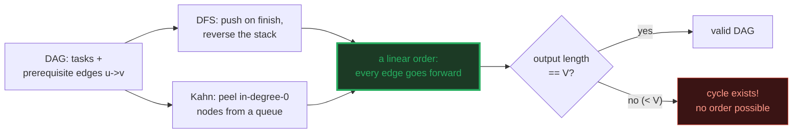
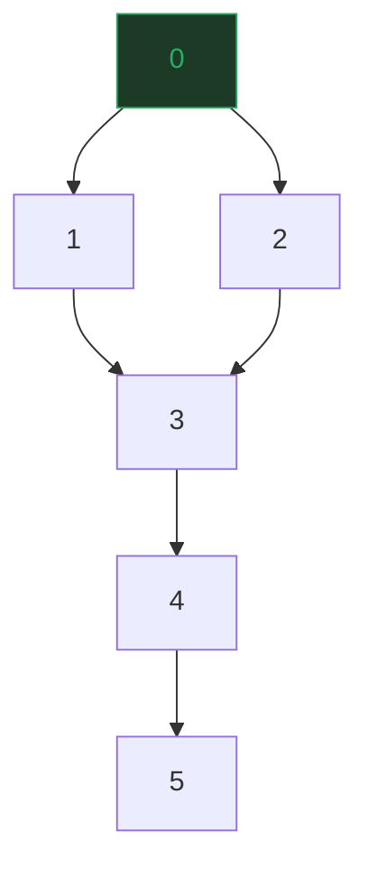
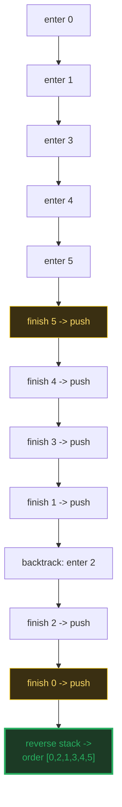
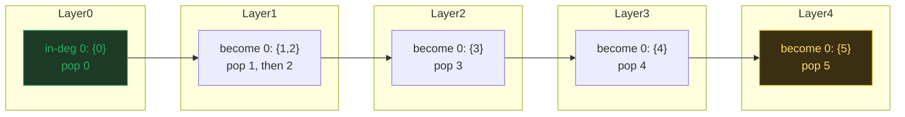
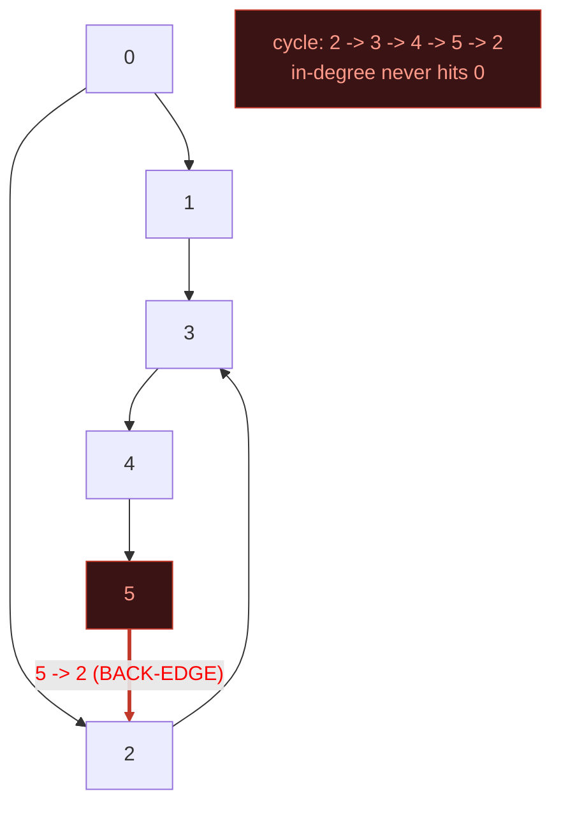
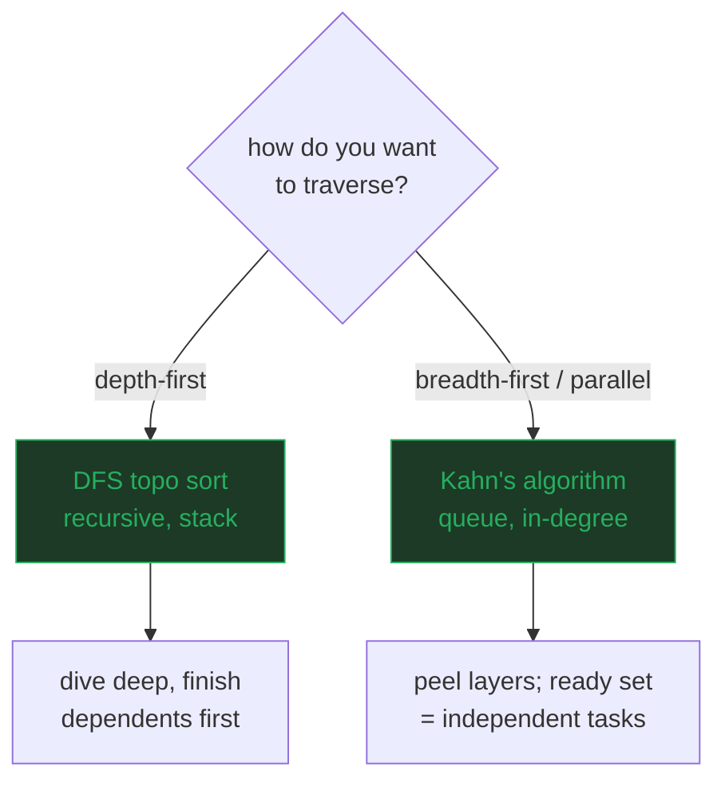

# Topological Sort — A Visual, Worked-Example Guide

> **Companion code:** [`topological_sort.py`](./topological_sort.py). **Every
> number and trace in this guide is printed by `python3 topological_sort.py`**
> — nothing is hand-computed.
>
> **Live animation:** [`topological_sort.html`](./topological_sort.html) — open
> in a browser: the 6-node DAG with DFS post-order stepping, Kahn's in-degree
> peeling, a cycle-detection toggle, and a head-to-head of the two methods.

---

## 0. TL;DR — the one idea

> **The "build pipeline" analogy (read this first):** you have a set of TASKS
> with PREREQUISITES — "task `v` cannot start until task `u` finishes" (an edge
> `u -> v`). You need a LINEAR ORDER that respects every prerequisite. That
> linear order is a **topological sort**.
>
> - **DFS topo sort:** run DFS; each time you FINISH a node (post-order), push
>   it onto a stack. Reverse the stack = topo order.
> - **Kahn's algorithm:** count IN-DEGREE per node; repeatedly pluck a node
>   with in-degree 0, "remove" it, repeat. A BFS driven by a queue of ready
>   nodes.

| method | core idea | traversal | cycle detect | time |
|---|---|---|---|---|
| **DFS topo sort** | finish-time stack reversal | DFS (recursive) | GRAY back-edge | O(V+E) |
| **Kahn's algorithm** | peel in-degree-0 nodes | BFS (queue) | `\|output\| < V` | O(V+E) |

Topological sort is the engine behind every "do things in dependency order"
system: Make/Gradle/Cargo builds, course prerequisites, pip/npm dependency
resolution, CPU instruction scheduling, spreadsheet recalculation, dataflow
pipelines. At its core it is just **"linearise a DAG."**



---

### Glossary (plain English — refer back any time)

| Term | Plain meaning |
|---|---|
| **`DAG`** | Directed acyclic graph. "Acyclic" = no directed cycle, which is exactly what makes a topo order EXIST. |
| **edge `u -> v`** | "u must come before v." u is a prerequisite of v. |
| **topo order** | A permutation of the V nodes such that for EVERY edge `u->v`, u appears before v. |
| **in-degree(v)** | Number of edges pointing INTO v = unmet prerequisites of v. `0` = "ready to run now." |
| **DFS finish (post-order)** | The moment we have explored ALL descendants of a node and are about to return from its recursive call. |
| **stack** | Where DFS pushes nodes on finish. Reversing it yields the topo order (last-finished = first in order). |
| **queue (Kahn)** | Holds all currently in-degree-0 nodes. Any pop order is valid (a DAG can have MANY valid topo orders). |
| **cycle** | A directed loop. If one exists, NO topo order is possible. Kahn detects it: fewer than V nodes get output. |

---

## 1. DFS topological sort — post-order reversal

Each node is pushed onto a stack when DFS **finishes** it (post-order), then the
stack is reversed. DFS finishes a node only after finishing all nodes that
depend on it (its descendants), so "finished last" = "has no unmet
prerequisites" = should come FIRST.

> From `topological_sort.py` Section A — the worked DAG:

```
Nodes: [0, 1, 2, 3, 4, 5]   (V = 6)
Edges (6):
    0 -> 1    (0 must come before 1)
    0 -> 2    (0 must come before 2)
    1 -> 3    (1 must come before 3)
    2 -> 3    (2 must come before 3)
    3 -> 4    (3 must come before 4)
    4 -> 5    (4 must come before 5)
Adjacency list (sorted for determinism):
    adj[0] = [1, 2]
    adj[1] = [3]
    adj[2] = [3]
    adj[3] = [4]
    adj[4] = [5]
    adj[5] = []
```



> From `topological_sort.py` Section A — the DFS trace:

```
DFS trace (events in order, outer loop over nodes 0..5):
    node 0: enter
    node 1: enter
    node 3: enter
    node 4: enter
    node 5: enter
    node 5: finish -> push
    node 4: finish -> push
    node 3: finish -> push
    node 1: finish -> push
    node 2: enter
    node 2: finish -> push
    node 0: finish -> push

Stack after all finishes (top = last pushed):  [5, 4, 3, 1, 2, 0]
Reversed  -> topological order:                 [0, 2, 1, 3, 4, 5]

[check] DFS order is a valid topological order: OK
```



> **Deep dive, then backtrack.** DFS dives all the way down `0 -> 1 -> 3 -> 4
> -> 5`, finishing 5 first (it has no dependents), then unwinds. Only after
> finishing the whole `0`-subtree does it visit 2. That depth-first flavour is
> why the DFS order is `[0, 2, 1, ...]` while Kahn (breadth-first) gives `[0,
> 1, 2, ...]`. **Both are valid** — a DAG can have many valid topo orders.

---

## 2. Kahn's algorithm — peeling in-degree-0 nodes

Count how many edges point into each node (its in-degree). Repeatedly pluck a
node with in-degree 0 (no unmet prerequisites), "remove" it (decrement its
neighbours), and repeat. A queue of ready nodes drives a BFS.

> From `topological_sort.py` Section B — in-degrees + the peel:

```
Step 1 - compute in-degrees:
  | node | in-degree | incoming edges        |
  |------|-----------|-----------------------|
  | 0    | 0         | []                     |
  | 1    | 1         | ['0']                  |
  | 2    | 1         | ['0']                  |
  | 3    | 2         | ['1', '2']             |
  | 4    | 1         | ['3']                  |
  | 5    | 1         | ['4']                  |

Initial queue (in-degree == 0): [0]

Step 2 - repeatedly pop a 0-in-degree node, output it, decrement
its neighbours (the queue drives the BFS):

    pop 0, output it, decrement [1, 2]  -> [1, 2] now ready
    pop 1, output it, decrement [3]
    pop 2, output it, decrement [3]  -> [3] now ready
    pop 3, output it, decrement [4]  -> [4] now ready
    pop 4, output it, decrement [5]  -> [5] now ready
    pop 5, output it, decrement []

Kahn's topological order: [0, 1, 2, 3, 4, 5]
[check] Kahn order is a valid topological order: OK
```



> **Breadth-first peeling.** Node 0 is the only node with no prerequisites, so
> it goes first. Removing it drops the in-degree of 1 and 2 to 0 (both become
> "ready"), so Kahn emits them next — layer by layer. This **breadth-first**
> flavour is what makes Kahn the natural choice for **parallel builds**: every
> node in the queue at the same moment is independent and can run concurrently.

---

## 3. Cycle detection — `|output| < V` ⇒ cycle

A topological order EXISTS iff the graph is a DAG. If we add a back-edge that
closes a directed cycle, neither algorithm can place all V nodes: DFS never
"finishes" the cycle, and Kahn's queue empties before everything is peeled.

> From `topological_sort.py` Section C — DAG + back-edge `5 -> 2`:

```
Cyclic graph = DAG + back-edge 5 -> 2 (closes 2->3->4->5->2):
    adj[5] = [2]

Kahn on the cyclic graph:
    pop 0, output it, decrement [1, 2]
    pop 1, output it, decrement [3]

Kahn output = [0, 1]   (length 2 < V = 6)
Remaining nodes (stuck in the cycle, never reach in-degree 0):
    [2, 3, 4, 5]

[check] cycle detected (|output| < V)? YES - cycle exists

DFS back-edge events: [(3, 'back-edge (cycle!)')]
```



> **`|output| = 2 < V = 6` ⟹ cycle.** Nodes `{2, 3, 4, 5}` form a directed
> loop, so every one of them always has an unmet prerequisite — their
> in-degrees never drop to 0, and Kahn's queue empties early. DFS detects the
> same cycle via a **GRAY back-edge**: when DFS reaches 3 and sees 2 already on
> the recursion stack (GRAY), it has found a back-edge → cycle. **Both methods
> agree.**

---

## 4. DFS vs Kahn — same goal, different mechanics

Both produce a VALID topological order in **O(V+E)** time, but via opposite
mechanics:

> From `topological_sort.py` Section D — head-to-head:

```
| aspect        | DFS topo sort                | Kahn's algorithm            |
|---------------|------------------------------|------------------------------|
| core idea     | finish-time stack reversal   | peel in-degree-0 nodes      |
| traversal     | DFS (recursive)              | BFS (queue, iterative)      |
| key structure | recursion stack + result stk | in-degree[] + FIFO queue    |
| cycle detect  | GRAY back-edge in recursion  | output length < V           |
| stack depth   | O(V) recursion               | O(1) - no recursion         |
| order flavour | tends to go DEEP first       | tends to go BREADTH first   |
| parallelism   | hard (single DFS path)       | NATURAL: all 0-indeg nodes  |
|               |                              | are independent -> parallel |

DFS  order: [0, 2, 1, 3, 4, 5]
Kahn order: [0, 1, 2, 3, 4, 5]

[check] both orders valid: OK
```



> **Why they differ.** DFS dives deep (`0 -> 1 -> 3 -> 4 -> 5`) before
> backtracking to 2, producing `[0, 2, 1, 3, 4, 5]`. Kahn peels layer by layer
> (0, then 1 and 2 become ready, then 3, ...), producing `[0, 1, 2, 3, 4, 5]`.
> **Both are valid** — a DAG can have many valid topological orders. The choice
> is about *style*: recursion vs iteration, depth vs breadth, and whether you
> want the **independent-ready set** (Kahn) for parallelism.

---

## 5. Applications + complexity summary

> From `topological_sort.py` Section E — where topological sort lives:

```
  - Build systems (Make, Gradle, Cargo, Bazel, npm): compile targets
    in dependency order; Kahn's independent 0-in-degree set is the
    basis for PARALLEL builds.
  - Course prerequisites: a valid semester-by-semester plan is a
    topological order of courses (edge: 'X is a prereq of Y').
  - Package managers (pip, apt, brew): resolve install order; a
    dependency CYCLE is a hard error (|output| < V).
  - Task scheduling / dataflow (Airflow, Spark, spreadsheets):
    compute stages once all inputs are ready.
  - Circuit layout / Verilog: signal propagation order.
  - Git commit history (DAG of commits): linearised history.

Worked example - course prerequisites (6 courses, diamond at 1,2->3):
  prereqs: 0->{1,2}, 1->3, 2->3, 3->4, 4->5

  A valid semester plan (Kahn order):
    ['Algorithms', 'OS', 'Networks', 'Distributed Sys', 'Cloud', 'Capstone']
  as indices: [0, 1, 2, 3, 4, 5]
```

| operation | DFS topo sort | Kahn's algorithm |
|---|---|---|
| build / setup | O(V+E) | O(V+E) (in-degree pass) |
| produce order | O(V+E) (one DFS) | O(V+E) (queue drain) |
| cycle detect | O(V+E) (GRAY back-edge) | O(V+E) (`\|output\| < V`) |
| space | O(V) (recursion + stack) | O(V) (in-degree + queue) |
| parallelism | hard | **natural** (ready set) |

> The single question that picks the method: **"do I want the independent-ready
> set for parallelism?"** If yes → **Kahn** (its queue IS the schedulable set).
> If you just need any valid order or a recursion-friendly form → **DFS topo
> sort**.

---

### Reproducibility

Every trace and order above is printed verbatim by `python3 topological_sort.py`
and re-checked at the end of that run:

> From `topological_sort.py` Section E — the gold check:

```
GOLD CHECK - re-verify both algorithms produce valid orders:
  DFS  order [0, 2, 1, 3, 4, 5]: valid = True
  Kahn order [0, 1, 2, 3, 4, 5]: valid = True
  both place all 6 nodes: True

GOLD CHECK: OK - both orders valid, all edges go forward
```

`topological_sort.html` re-runs **both** algorithms in JavaScript with the
identical DFS + Kahn logic, and re-checks these exact orders against the edge
set — the green `check: OK` badge confirms the page matches the `.py` exactly.
