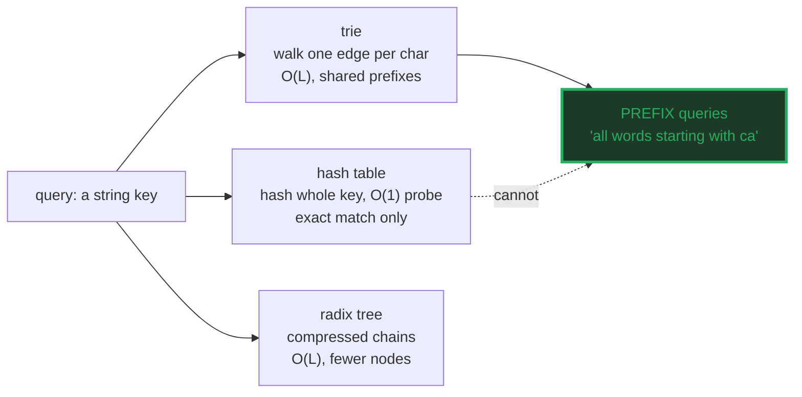
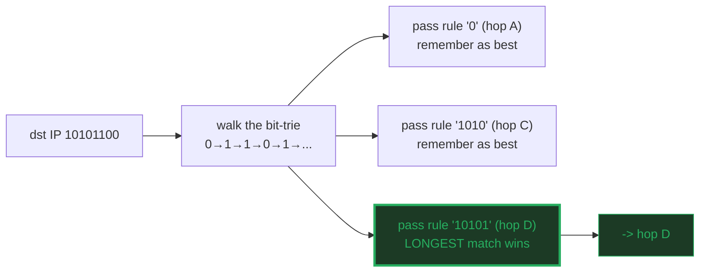

# Trie (Prefix Tree) — A Visual, Worked-Example Guide

> **Companion code:** [`trie.py`](./trie.py). **Every number and tree in this
> guide is printed by `python3 trie.py`** — nothing is hand-computed.
>
> **Live animation:** [`trie.html`](./trie.html) — open in a browser: a
> character-edge trie you can search and prefix-query, with the walk path
> highlighted and a radix-tree compression toggle.

---

## 0. TL;DR — the one idea

> **The "autocomplete dictionary" analogy (read this first):** a trie is a tree
> where every **edge is one character of a key**, and the **path from the root
> to a node spells out a key**. To look up a word you walk down one edge per
> character — you never scan the whole dictionary.
> - **Hash table** — hash the *whole* key, then O(1) bucket probe. Great for
>   exact match; useless for "all words starting with `ca`".
> - **Trie** — walk one edge per character. Lookup is **O(L)** where `L` = key
>   length, *independent of how many keys are stored*. The tree *is* the shared
>   prefixes, so a prefix query is nearly free.
> - **Radix tree** — a trie with single-child chains **compressed** into one
>   edge labelled by a whole substring (`"ca"`, `"dog"`). Same O(L) lookup, far
>   fewer nodes — this is what IP routers actually use.

Tries exist because **keys share structure**. A hash table treats every key as
an opaque blob; a trie treats the key as a **sequence** and shares the common
parts. That is why **autocomplete, IP longest-prefix-match, and DNS resolution
are all tries under the hood** — they all ask "what keys extend this prefix?"



---

### Glossary (plain English — refer back any time)

| Term | Plain meaning |
|---|---|
| **root** | The empty-string node. Every key starts here. |
| **edge** | A labelled arrow node → child. Label = 1 char (trie) or a substring (radix). |
| **node** | A point in the tree. An `end` node means "a complete key terminates here". |
| **path** | The sequence of edge labels root → node = the string that node represents. |
| **`end` flag** | "a complete key ends here". Distinct from "has children" — both `car` and `card` are keys. |
| **prefix query** | "every key starting with `P`": walk to `P`'s node, harvest its subtree. |
| **`L`** | Key length (number of characters). Trie work is O(L), NOT O(#keys). |
| **radix tree** | a.k.a. Patricia trie. Single-child chains collapsed into one edge. |

---

## 1. Insert and the tree shape

Insert walks from the root, creating one node per character, and marks the last
node `end`. Using the key set `["cat","car","card","care","dog"]`:

> From `trie.py` Section A — insert + the full standard trie (`*` = key ends):

```
insert("cat")  -> O(L=3)
insert("car")  -> O(L=3)
insert("card")  -> O(L=4)
insert("care")  -> O(L=4)
insert("dog")  -> O(L=3)

The full standard trie (one node per character; `*` = key ends here):
└─ (root)
   ├─ "c"
   │  └─ "a"
   │     ├─ "r" *
   │     │  ├─ "d" *
   │     │  └─ "e" *
   │     └─ "t" *
   └─ "d"
   └─ "o"
      └─ "g" *

Node count = 10 (incl. root). Edges = 9.
Sum of key lengths = 17; nodes <= that because of SHARING.
  Shared prefix 'ca' (cat, car, card, care) collapses 2 chars x 4 words
  = 8 char-slots into just 2 nodes (c, a). That is the whole win.
  Without sharing we would need 17 nodes; we use 10.
```



```mermaid
graph TD
    R((root)) -->|c| C
    C -->|a| A
    A -->|r| R2["r * (car)"]
    A -->|t| T["t * (cat)"]
    R2 -->|d| D2["d * (card)"]
    R2 -->|e| E["e * (care)"]
    R -->|d| D3
    D3 -->|o| O
    O -->|g| G["g * (dog)"]
    style R fill:#161b22,stroke:#8b949e
    style T fill:#1c3a25,stroke:#27ae60
    style R2 fill:#1c3a25,stroke:#27ae60
    style D2 fill:#1c3a25,stroke:#27ae60
    style E fill:#1c3a25,stroke:#27ae60
    style G fill:#1c3a25,stroke:#27ae60
```

> **Why 10 nodes, not 17?** The four words `cat, car, card, care` all share the
> `ca` prefix, so the `c` and `a` nodes are built **once** and reused. That
> sharing is the entire reason tries beat a flat key set. 🔗 See [§4](#4-space--naive-trie-vs-radix-tree-compression)
> for how much further a radix tree compresses this.

---

## 2. Search — O(L), same asymptotic class as a hash table

Looking up `"card"` walks one edge per character, then checks the `end` flag:

> From `trie.py` Section B — search `"card"`:

```
Lookup "card" in the trie: walk one edge per character.

  (root)
  --"c"--> node
  --"a"--> node
  --"r"--> node
  --"d"--> node

  steps (edge walks) = 4 = L = len("card") = 4
  node.end = True  ->  "card" is PRESENT

Negative case search("cab"): False (walks c,a, then finds no "b" child -> None, still O(L=3)).

Compare with a HASH TABLE (Python dict):
  hash table: must hash the WHOLE key first (O(L) to read all chars),
              then O(1) bucket probe. Total = O(L) too.
  trie      : O(L) with NO hashing, and the walk SHARED with prefix work.
  => For EXACT lookup both are O(L). The trie's edge is PREFIX queries,
     which a hash table simply cannot do without scanning every key.

[check] dict["card"] == trie.search("card") == True:  OK
```

| operation | trie | hash table |
|---|---|---|
| exact search | **O(L)** walk | **O(L)** hash + O(1) probe |
| misses | O(L) (stops at the missing edge) | O(L) (must still hash) |
| prefix query | **O(L + M)** ✓ | **O(K·L)** — scan every key ✗ |

> **The key insight:** for *exact* lookup, a trie and a hash table are the same
> complexity class (both O(L)). The trie wins not on exact lookup but on the
> **prefix query** — the operation a hash table literally cannot do without
> enumerating every key. That is why it owns autocomplete. 🔗 See [§3](#3-prefix-search--the-operation-a-hash-table-cannot-do).

---

## 3. Prefix search — the operation a hash table cannot do

`starts_with("ca")` walks to the `"ca"` node, then harvests every `end` node in
its subtree (depth-first):

> From `trie.py` Section C — prefix search `"ca"`:

```
starts_with("ca"): walk to the "ca" node, then harvest
every `end` node in its subtree (depth-first).

  walk "ca" -> node reached: True

  matches = ['car', 'card', 'care', 'cat']
  (brute-force [w for w in WORDS if w.startswith("ca")] = ['car', 'card', 'care', 'cat'])

  cost = O(L=2) to reach the node + O(M=4) to harvest
  = O(L + M). A hash table would need O(K*L) to scan all K keys.

Other prefixes:
  starts_with("c") = ['car', 'card', 'care', 'cat']
  starts_with("car") = ['car', 'card', 'care']
  starts_with("do") = ['dog']
  starts_with("x") = []
```



```mermaid
graph TD
    R((root)) -->|c| C
    C -->|a| A["a  ◀ prefix node"]
    A -->|r| R2
    A -->|t| T
    R2["r"] -->|d| D2
    R2 -->|e| E
    style A fill:#3a2f12,stroke:#f1c40f,stroke-width:3px,color:#ffd966
    style R2 fill:#1c3a25,stroke:#27ae60
    style T fill:#1c3a25,stroke:#27ae60
    style D2 fill:#1c3a25,stroke:#27ae60
    style E fill:#1c3a25,stroke:#27ae60
```

> **Cost: O(L + M)** — `L` to reach the prefix node, `M` to collect matches. A
> hash table would pay **O(K·L)** (scan all `K` keys, each of length up to `L`).
> On a 100k-word dictionary with `L ≈ 8`, that is the difference between ~10
> steps and ~800k.

---

## 4. Space — naive trie vs radix tree compression

A standard trie wastes nodes on **single-child chains**. `"dog"` has no siblings
anywhere along `d→o→g`, so those 3 chars live in 3 separate nodes. A **radix
tree** (Patricia trie) collapses any maximal chain of single-child nodes into
ONE edge labelled by the whole substring.

> From `trie.py` Section D — radix tree (edges carry substrings; `*` = key ends):

```
Radix tree (same keys; edges now carry substrings; `*` = key ends):
└─ (root)
   ├─ "ca"
   │  ├─ "t" *
   │  └─ "r" *
   │     ├─ "d" *
   │     └─ "e" *
   └─ "dog" *

| structure     | nodes | edges | note                          |
|---------------|-------|-------|-------------------------------|
| standard trie | 10    | 9     | one node per character        |
| radix tree    | 7     | 6     | single-child chains compressed|

The chain d->o->g (3 trie nodes) collapses to one edge "dog".
Both still O(L) lookup; radix just touches fewer pointers. This is
why IP routers and the Linux page cache use COMPRESSED tries: the
node count (and thus cache misses) drops sharply on sparse keys.

[check] trie.search == radix_search for all keys + a miss:  OK
```



```mermaid
graph TD
    R((root)) -->|"ca"| A
    A -->|"t"| T["t * (cat)"]
    A -->|"r"| R2["r * (car)"]
    R2 -->|"d"| D2["d * (card)"]
    R2 -->|"e"| E["e * (care)"]
    R -->|"dog"| G["dog *"]
    style R fill:#161b22,stroke:#8b949e
    style T fill:#1c3a25,stroke:#27ae60
    style R2 fill:#1c3a25,stroke:#27ae60
    style D2 fill:#1c3a25,stroke:#27ae60
    style E fill:#1c3a25,stroke:#27ae60
    style G fill:#1c3a25,stroke:#27ae60
```

> The chain `d→o→g` (3 trie nodes) collapses to **one edge `"dog"`**. Both stay
> O(L) lookup; the radix tree just touches **fewer pointers** — 7 nodes vs 10.
> On sparse, long keys (IP prefixes, file paths) the compression is dramatic,
> which is exactly why IP routers and the Linux page cache use compressed
> tries. 🔗 The `.html` toggles between the two structures live.

---

## 5. Applications — autocomplete and IP longest-prefix match

### Autocomplete

The user types a prefix; return every completion. This is just `starts_with`:

> From `trie.py` Section E — autocomplete over an 8-word corpus:

```
corpus = ['cat', 'car', 'card', 'care', 'careful', 'dog', 'do', 'dot']

  autocomplete("ca") -> ['car', 'card', 'care', 'careful', 'cat']
  autocomplete("car") -> ['car', 'card', 'care', 'careful']
  autocomplete("care") -> ['care', 'careful']
  autocomplete("do") -> ['do', 'dog', 'dot']
  autocomplete((empty = all)) -> ['car', 'card', 'care', 'careful', 'cat', 'do', 'dog', 'dot']
```

### IP routing — longest prefix match

A router holds prefix → next-hop rules. For a destination IP it picks the rule
with the **longest matching prefix**. A trie over the address bits walks one bit
at a time, remembering the last `end` (rule) node it passed:

> From `trie.py` Section E — bit-trie longest-prefix match:

```
  dst=10101100  longest matching prefix =    10101  ->  hop D (10101/5 = nets 168..175)
  dst=10101001  longest matching prefix =    10101  ->  hop D (10101/5 = nets 168..175)
  dst=00110011  longest matching prefix =        0  ->  hop A (0/1     = everything starting 0)
  dst=10101     longest matching prefix =    10101  ->  hop D (10101/5 = nets 168..175)
```



> **DNS** uses the same idea: a name like `api.example.com` is walked from the
> TLD down, so the resolver can answer `example.com` records for any subdomain
> without storing each one explicitly.

---

## 6. Complexity summary

| operation | standard trie | radix tree | hash table |
|---|---|---|---|
| insert | O(L) | O(L) | O(L) |
| exact search | O(L) | O(L) | O(L) |
| prefix query | O(L + M) | O(L + M) | O(K·L) ✗ |
| space (nodes) | ≤ Σ key lengths | « trie | O(K·L) |
| best for | autocomplete, prefix work | sparse keys (IP, paths) | exact match only |

> The single question that picks the structure: **"do I need prefix queries?"**
> If yes → trie (or radix tree if keys are long/sparse). If you only ever do
> exact match and never prefix work → a hash table is simpler and equal cost.

---

### Reproducibility

Every tree and table above is printed verbatim by `python3 trie.py` and
re-checked at the end of that run:

> From `trie.py` Section E — the gold check:

```
  [OK] starts_with("ca"  ) = ['car', 'card', 'care', 'careful', 'cat']
  [OK] starts_with("car" ) = ['car', 'card', 'care', 'careful']
  [OK] starts_with("care") = ['care', 'careful']
  [OK] starts_with("do"  ) = ['do', 'dog', 'dot']
  [OK] starts_with(""    ) = ['car', 'card', 'care', 'careful', 'cat', 'do', 'dog', 'dot']

GOLD CHECK: OK - all prefix queries match brute force
```

`trie.html` re-runs `starts_with()` **in JavaScript** on the 5-word tree
(`cat, car, card, care, dog`) shown in [§1](#1-insert-and-the-tree-shape),
and re-checks the same prefix lists — the green `check: OK` badge confirms the
page matches the `.py` exactly.
