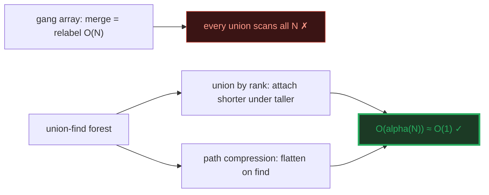
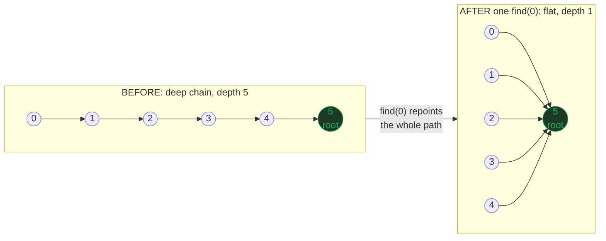
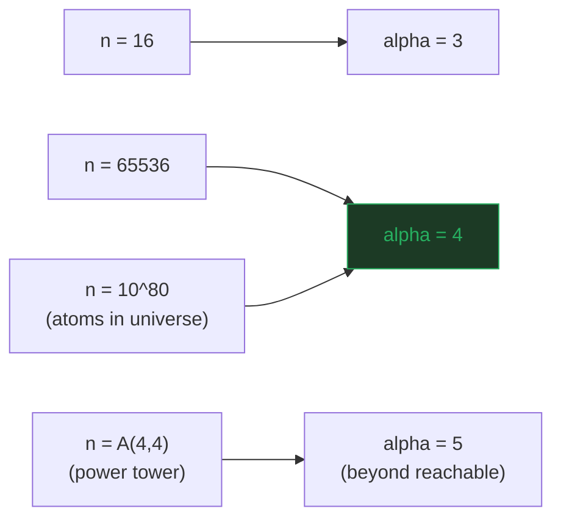
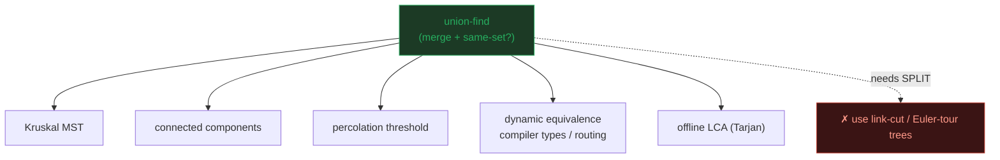

# Union-Find (Disjoint Set Union) — A Visual, Worked-Example Guide

> **Companion code:** [`union_find.py`](./union_find.py). **Every parent array,
> rank array, forest, and MST weight in this guide is printed by
> `python3 union_find.py`** — nothing is hand-computed.
>
> **Live animation:** [`union_find.html`](./union_find.html) — open in a browser:
> watch unions merge the trees, run Kruskal's MST with live cycle detection,
> and see path compression flatten a deep chain to depth 1.

---

## 0. TL;DR — the one idea

> **The "who's in your gang?" analogy (read this first):** you have `N` people
> and a stream of statements "*person A and person B are in the same gang*."
> Two questions recur: **"are X and Y in the same gang?"** (a connectivity
> query) and **"merge gang(A) and gang(B)"** (a union). Union-Find represents
> each gang as a **tree** pointing up to a representative "root", then uses two
> tricks to keep every operation essentially **O(1)**:
> - **Path compression** — on `find`, repoint every node on the path straight at
>   the root (the tree flattens; future finds are shorter).
> - **Union by rank** — when merging, attach the **shorter** tree under the
>   **taller** one's root, so heights stay logarithmic.

| operation | naive (`gang[x]` array) | union-find (both tricks) |
|---|---|---|
| `find` / connected? | O(1) | **O(α(N))** ≈ O(1) |
| `union` / merge | **O(N)** ✗ (relabel all) | **O(α(N))** ≈ O(1) |
| space | O(N) | O(N) |

With both tricks, the amortized cost per operation is **O(α(N))** — the inverse
Ackermann function — which is **≤ 4** for every `N` anyone will ever store. In
practice: **O(1)**. That is what makes union-find the engine behind Kruskal's
MST, dynamic connectivity, and percolation.



---

### Glossary (plain English — refer back any time)

| Term | Plain meaning |
|---|---|
| **`N`** | Number of elements (here 8 for the demo, 6 for the MST graph). |
| **`parent[x]`** | `x`'s parent in its tree; the root's parent is **itself**. |
| **`root(x)`** | The representative element of `x`'s set (the tree root). |
| **`make_set`** | Each element starts as its own singleton tree (`root = self`). |
| **`find(x)`** | Walk parent pointers up to the root; with compression, repoint the path. |
| **`union(a,b)`** | Link `root(a)` under `root(b)`, choosing the link by **rank**. |
| **`rank[x]`** | An upper bound on subtree height; only roots' ranks change. |
| **path compression** | `find` flattens the path `x→…→root` into `x→root` for every node visited. |
| **inverse Ackermann α(N)** | The amortized bound with both tricks; ≤ 4 for all practical `N`. |
| **Kruskal's MST** | Sort edges by weight; add an edge iff its endpoints are in **different** sets. |

---

## 1. Basic operations — make_set, find, union by rank

Every element begins as its own root (`parent[x]=x`, `rank[x]=0`). Each `union`
links one root under the other, picking the parent by **rank** so the tree never
gets taller than necessary.

> From `union_find.py` Section A — 8 elements, union schedule:

```
make_set 0..7: every element is its own root, 8 singleton sets.
  parent = [0, 1, 2, 3, 4, 5, 6, 7]
  rank   = [0, 0, 0, 0, 0, 0, 0, 0]

Apply a sequence of unions (each merges two sets by rank):

  | step | union  | merged? | reason                          |
  |------|--------|---------|---------------------------------|
  | 1    | (0,1)  | yes     | root(0)=0, root(1)=1 -> linked  | sets 8->7 |
  | 2    | (2,3)  | yes     | root(2)=2, root(3)=3 -> linked  | sets 7->6 |
  | 3    | (4,5)  | yes     | root(4)=4, root(5)=5 -> linked  | sets 6->5 |
  | 4    | (6,7)  | yes     | root(6)=6, root(7)=7 -> linked  | sets 5->4 |
  | 5    | (1,2)  | yes     | root(1)=0, root(2)=2 -> linked  | sets 4->3 |
  | 6    | (5,6)  | yes     | root(5)=4, root(6)=6 -> linked  | sets 3->2 |
```

> From `union_find.py` Section A — the forest after all 6 unions:

```
  After all 6 unions:
    parent = [0, 0, 0, 2, 4, 4, 4, 6]
    rank   = [2, 0, 1, 0, 2, 0, 1, 0]
    forest (root -> children chains):
      root 0:
        0
          1
          2
            3
      root 4:
        4
          5
          6
            7
  number of disjoint sets = 2
```



```mermaid
graph TD
    R0(("root 0<br/>rank 2")) --> N1((1))
    R0 --> N2((2))
    N2 --> N3((3))
    R4(("root 4<br/>rank 2")) --> N5((5))
    R4 --> N6((6))
    N6 --> N7((7))
    style R0 fill:#1c3a25,stroke:#27ae60,color:#27ae60
    style R4 fill:#1c3a25,stroke:#27ae60,color:#27ae60
    style N3 fill:#161b22,stroke:#8b949e
    style N7 fill:#161b22,stroke:#8b949e
```

> **Reading `rank`:** the two merges that grew rank happened at steps 1 and 2
> (rank 0 + rank 0 → rank 1), then steps 5 and 6 (rank 1 + rank 1 → rank 2).
> **Only equal-rank merges increase height** — that is the union-by-rank
> invariant keeping trees shallow.

### Connectivity — `find(x) == find(y)`

Two elements are connected iff their roots match. A `find` that would join them
is a **cycle** and is rejected (this is exactly what Kruskal exploits).

> From `union_find.py` Section A — queries + the gold components:

```
  | query        | find(a) | find(b) | same set? |
  |--------------|---------|---------|-----------|
  | find(0)==find(3)? |   0     |   0     | YES       |
  | find(4)==find(7)? |   4     |   4     | YES       |
  | find(0)==find(7)? |   0     |   4     | no        |
  | find(0)==find(4)? |   0     |   4     | no        |
  | find(1)==find(6)? |   0     |   4     | no        |

  connected components: {0: [0, 1, 2, 3], 4: [4, 5, 6, 7]}
[check] components match expected {[0,1,2,3],[4,5,6,7]}:  OK
```

---

## 2. Kruskal's MST — union-find as a cycle detector

Sort edges by weight; add an edge iff its endpoints are in **different** sets.
An edge joining two vertices already in one set would form a **cycle** → skip.
Union-find answers "same set?" in ~O(1), so the whole MST is **O(E log E)**
(dominated by the sort).

> From `union_find.py` Section B — 6 vertices, 9 edges:

```
Kruskal: sort edges by weight; add an edge iff its endpoints are in
DIFFERENT sets (union-find answers 'same set?' in ~O(1)). An edge
joining two vertices already in one set would form a CYCLE -> skip.

  | # | edge    | weight | find(u) find(v) | action       |
  |---|---------|--------|------------------|--------------|
  | 1 | (0,2)   | 1      | 0       2       | ADD to MST   |
  | 2 | (1,2)   | 2      | 1       0       | ADD to MST   |
  | 3 | (1,3)   | 3      | 0       3       | ADD to MST   |
  | 4 | (0,1)   | 4      | 0       0       | skip (cycle) |
  | 4 | (2,3)   | 5      | 0       0       | skip (cycle) |
  | 4 | (3,4)   | 6      | 0       4       | ADD to MST   |
  | 5 | (4,5)   | 7      | 0       5       | ADD to MST   |
  | 6 | (2,4)   | 8      | 0       0       | skip (cycle) |
  | 6 | (3,5)   | 9      | 0       0       | skip (cycle) |

  MST edges (5 = |V|-1 = 5): [(0, 2), (1, 2), (1, 3), (3, 4), (4, 5)]
  MST total weight = 1 + 2 + 3 + 6 + 7 = 19
[check] 5 == |V|-1 == 5 and the MST spans all vertices:  OK
```



```mermaid
graph TD
    V0((0)) -- "1" --- V2((2))
    V1((1)) -- "2" --- V2
    V1 -- "3" --- V3((3))
    V3 -- "6" --- V4((4))
    V4 -- "7" --- V5((5))
    V0 -. "4 (cycle)" .- V1
    V2 -. "5 (cycle)" .- V3
    V2 -. "8 (cycle)" .- V4
    V3 -. "9 (cycle)" .- V5
    style V0 fill:#1c3a25,stroke:#27ae60
    style V2 fill:#1c3a25,stroke:#27ae60
    style V3 fill:#1c3a25,stroke:#27ae60
    style V4 fill:#1c3a25,stroke:#27ae60
    style V5 fill:#1c3a25,stroke:#27ae60
```

> **3 edges skipped as cycles:** `(0,1)`, `(2,3)`, `(2,4)`, `(3,5)` all had both
> endpoints already in the same set, so adding them would close a loop. The MST
> is the **5 cheapest edges that don't form a cycle** — total weight **19**.

---

## 3. Path compression — flatten a deep chain to depth 1

Without the two tricks, naive unions can build a **degenerate chain** where
`find` on a leaf walks the whole depth every time. Path compression turns one
expensive `find` into permanent speed: it repoints every node on the path
straight at the root.

> From `union_find.py` Section C — the worst-case chain, before and after:

```
Naive unions [(0,1),(1,2),(2,3),(3,4),(4,5)] -> each attaches the
current root under the next, producing a degenerate CHAIN:

  BEFORE path compression:  parent = [1, 2, 3, 4, 5, 5]
  tree shape:  0 -> 1 -> 2 -> 3 -> 4 -> 5 (root=5, depth 5)
  find(0) must climb 5 parent pointers every single time.

  find(0) visited 6 nodes (the whole chain): [0, 1, 2, 3, 4, 5]

--- same chain, now with PATH COMPRESSION (the real find) ---

  build identical chain: parent = [1, 2, 3, 4, 5, 5]
  find(0) walked: [0, 1, 2, 3, 4, 5]  -> root = 5
  AFTER path compression: parent = [5, 5, 5, 5, 5, 5]
  every node on the path now points DIRECTLY at the root (5):
  tree shape:  0,1,2,3,4 all -> 5 (root=5, depth 1)
  a second find(0) now visits just 2 nodes (0 and root).
```



> **The amortized argument:** the first `find` pays to walk 5 hops, but the
> flattening it does makes **every future** `find` on those nodes O(1). You never
> pay for that path again — the cost is spread across all operations, which is
> what gives the amortized O(α(N)) bound.

### Union by rank keeps it shallow from the start

Path compression **reacts** to deep trees; union by rank **prevents** them. With
rank, the same 5 merges never build a chain — the tree stays balanced.

> From `union_find.py` Section C — union by rank on the same merges:

```
--- contrast: the same 5 merges with UNION BY RANK never go deep ---

  union-by-rank merges: parent = [0, 0, 0, 0, 0, 0]
                       rank   = [1, 0, 0, 0, 0, 0]
  balanced tree (height bounded by log2(N)):
    parent = [0, 0, 0, 0, 0, 0]
    rank   = [1, 0, 0, 0, 0, 0]
    forest (root -> children chains):
      root 0:
        0
          1
          2
          3
          4
          5
```

> **Union by rank bounds height ≤ ⌊log₂ N⌋** even *before* any compression: a
> subtree's rank only grows when two equal-rank trees merge, which can happen at
> most log₂ N times along any root-to-leaf path. Together, the two tricks give
> the O(α(N)) bound.

---

## 4. Amortized O(α(N)) — the inverse Ackermann bound

With **both** tricks, Tarjan (1975) proved every operation costs O(α(N))
**amortized**, where α is the inverse Ackermann function. α grows so slowly it is
effectively a constant for every N the universe can hold.

> From `union_find.py` Section D — the Ackermann table and its inverse:

```
Ackermann A(m,n) (the forward function) - note the explosion:

  | m\n |   0    1    2    3    4 |
  |-----|--------------------------|
  |  0  |    1    2    3    4    5 |
  |  1  |    2    3    4    5    6 |
  |  2  |    3    5    7    9   11 |
  |  3  |    5   13   29   61  125 |

A(4,2) already has ~20,000 digits. The inverse walks this the OTHER
way: alpha(n) = smallest k with A(k,k) >= n.

  | n                       | alpha(n) | note                             |
  |-------------------------|----------|----------------------------------|
  | 1                       | 0        | 1 element                        |
  | 2                       | 1        | 2 elements                       |
  | 4                       | 2        | small input                      |
  | 16                      | 3        | tiny input                       |
  | 65536                   | 4        | medium input                     |
  | 2^64                    | 4        | ~atoms on Earth                  |
  | 10^80                   | 4        | ~atoms in universe               |

So alpha(n) <= 4 for every N anyone will ever store. In practice
union-find operations are O(1).

[check] alpha(10^80) == 4  (atoms in the universe):  True
```



> **So α(N) ≤ 4 for every N anyone will ever store.** The "amortized" caveat: a
> single `find` may pay to flatten a long path, but that flattening makes every
> **future** `find` cheaper — the cost is spread out, never paid twice. That is
> the whole reason a near-O(1) bound is possible at all.

---

## 5. Applications — when to reach for union-find

Union-find is the engine whenever you **merge groups** and ask "same group?" —
but only merges; it **cannot split** a set.

> From `union_find.py` Section E — applications:

```
  * Kruskal's MST      : cycle detection while adding cheapest edges.
  * Connected components: flood a graph with edges, count the sets left.
  * Percolation        : does a path of open sites top->bottom exist?
                         (Sedgewick & Wayne's canonical example.)
  * Dynamic equivalence : 'these identifiers refer to the same thing'
                         - compiler type unification, network routing.
  * Offline LCA / Tarjan: lowest-common-ancestor batches via DSU.

Limitation: union-find only MERGES - it cannot SPLIT a set. For
splits (dynamic connectivity with deletions) you need a heavier
structure (link-cut trees, Euler-tour trees).
```



> **Limitation:** union-find only **merges** — it cannot **split** a set. For
> deletions (dynamic connectivity with edge removal) you need a heavier
> structure: link-cut trees or Euler-tour trees.

---

## 6. Complexity summary

| operation | cost |
|---|---|
| `make_set` | O(1) |
| `find` (with compression) | O(α(N)) amortized |
| `union` (2 finds + link) | O(α(N)) amortized |
| `connected` | O(α(N)) amortized |
| space | O(N) |
| Kruskal's MST | O(E log E) *(dominated by sort)* |
| max tree height (rank only) | ≤ ⌊log₂ N⌋ |

> The single invariant that makes it all work: **union by rank bounds height
> logarithmically; path compression flattens the rest.** Either trick alone gives
> O(log N); **both** give O(α(N)).

---

### Reproducibility — the gold check

Every forest, union table, and MST weight above is printed verbatim by
`python3 union_find.py`, which verifies the final component structure at the end
of the run:

> From `union_find.py` Section E — the gold check:

```
GOLD CHECK: 8 elements, union schedule [(0, 1), (2, 3), (1, 2), (4, 5), (6, 7), (5, 6), (0, 7)]

  final parent = [0, 0, 0, 0, 0, 0, 0, 0]
  components   = {0: [0, 1, 2, 3, 4, 5, 6, 7]}
[check] after all unions, find(x) groups = [(0, 1, 2, 3, 4, 5, 6, 7)]
        expected = [(0, 1, 2, 3, 4, 5, 6, 7)]
        -> OK
[check] connected(0,7)=True, connected(2,5)=True: OK
```

`union_find.html` re-runs the **same** unions and Kruskal in JavaScript with the
identical make_set / find / union logic, and re-checks these exact values — the
green `check: OK` badge confirms the page matches the `.py` exactly.
