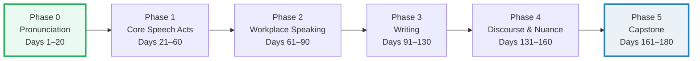

# CURRICULUM.md — The Day-by-Day Fluency Map

> **6-month paced · 180 days · ~2 days per bundle · 90 bundles · Sunday
> integration days.** This is the learner's checklist and progress tracker for
> the whole `english/` fluency program. Tick a box when you can **produce** the
> bundle's chunks (say them or write them), not merely recognize them.

| | |
|---|---|
| **Cadence** | 90 bundles × 2 days = 180 days (~6 months at one bundle every two days). |
| **Sunday cadence** | Every 7th day is an **integration day** — no new bundle. Review the week + record one ~10-min conversation simulation that combines the week's functions. |
| **Accent** | Both **US and UK** varieties are used; the variety is **flagged per chunk** inside each bundle's corpus and practice player. |
| **Audience** | A Vietnamese L1 learner targeting confident functional fluency in ~90 high-frequency speaking + writing scenarios ("80% native"). |

> Companion docs: [`README.md`](./README.md) (mindset + roadmap) ·
> [`HOW_TO_RESEARCH.md`](./HOW_TO_RESEARCH.md) (the builder workflow for every
> bundle). The bundle you practice is always `{name}.html`; the `.md` and
> `_corpus.md` are references for the curious.

---

## How to read this

Each bundle spans **2 days**. The split keeps the daily dose to ~20 min and
forces **output every day** (you only "know" what you can say or write).

| Day | Focus | What you do |
|---|---|---|
| **Day 1 — Input** | Read + Shadow | Read the bundle guide (`{NAME}.md`, ~5 min). Open the player (`{name}.html`) and **shadow** the key chunks + the dialog aloud (~7 min). |
| **Day 2 — Output** | Produce + Review | **Produce**: speak a variant (record yourself) *or* write 3–5 sentences using the chunks (~8 min). Then self-review against the model answer / cheat sheet. |

> A bundle is "done" (tick the box) only after **Day 2 production** — not after
> reading. Reading is necessary; it is not fluency.

### Daily ritual reminder (~20–25 min total)

> **READ · 5 min** — the bundle guide.
> **SHADOW · 7 min** — drill the key chunks + dialog aloud.
> **PRODUCE · 8 min** — speak (record a variant) **or** write (3–5 sentences).
>
> **Every 7th day = integration day** — no new bundle; review the week and do
> one ~10-min self-recorded conversation simulation that stitches the week's
> functions together. (See [`README.md`](./README.md) §"Daily ritual".)

### Accent note

Every chunk in every bundle is tagged **US** or **UK** (and occasionally both).
IPA is pulled from the matching variety's dictionary (Cambridge / Oxford /
Merriam-Webster). Pick **one** variety as your default and stay consistent — but
train your ear on both, because you will hear both in real conversation.

---

## The 6 phases at a glance

| Phase | Folder | Days | Bundles | Theme |
|---|---|---|---|---|
| 0 | `pronunciation/` | 1–20 | 10 | The sound system — fix the Vietnamese L1 intelligibility issues first. |
| 1 | `speech_acts/` | 21–60 | 20 | The core things you do with language: greet, thank, apologize, agree, … |
| 2 | `workplace/` | 61–90 | 15 | Speaking at work: meetings, updates, feedback, interviews. |
| 3 | `writing/` | 91–130 | 20 | Writing that ships: emails, reports, IM, CVs, proposals. |
| 4 | `discourse/` | 131–160 | 15 | The glue: idioms, phrasal verbs, hedging, storytelling, fillers. |
| 5 | `capstone/` | 161–180 | 10 | Integration under pressure: impromptu talks, debates, simulations. |
| | **Total** | **1–180** | **90** | |

---

## Phase 0 — Pronunciation (folder `pronunciation/`, Days 1–20, 10 bundles)

> **Goal:** fix the #1 Vietnamese → English intelligibility issues first. Every
> downstream phase depends on being understood without repetition.

| # | Day | stem | title | one-liner |
|---|---|---|---|---|
| 01 | 1–2 | `final_consonants` | Final Consonants & Endings | Fix the #1 Vietnamese intelligibility issue: dropped finals + `-s`/`-ed`. |
| 02 | 3–4 | `th_sounds` | The "th" Sounds /θ/ /ð/ | Tongue-between-teeth; stop substituting /t/ /d/ /z/. |
| 03 | 5–6 | `consonant_clusters` | Consonant Clusters | No inserted vowel ("gro-serry"); keep clusters tight. |
| 04 | 7–8 | `vowel_length` | Long vs Short Vowels | sheep/ship, pull/pool — length changes meaning. |
| 05 | 9–10 | `word_stress` | Word Stress | 2-syllable rules; noun vs verb (REcord/reCORD). |
| 06 | 11–12 | `sentence_stress` | Sentence Stress & Weak Forms | The rhythm: content words strong, grammar words weak. |
| 07 | 13–14 | `linking` | Linking & Connected Speech | Consonant–vowel and consonant–consonant linking. |
| 08 | 15–16 | `reductions` | Reductions | gonna, wanna, "Whaddya", "d'ya". |
| 09 | 17–18 | `intonation` | Intonation | Rising/falling; focus stress changes meaning. |
| 10 | 19–20 | `thought_groups` | Thought Groups & Pausing | Chunk speech into meaning units; breathe between. |

**Progress:**

- [x] **01** `final_consonants` — Final Consonants & Endings *(Days 1–2)*
- [x] **02** `th_sounds` — The "th" Sounds /θ/ /ð/ *(Days 3–4)*
- [x] **03** `consonant_clusters` — Consonant Clusters *(Days 5–6)*
- [x] **04** `vowel_length` — Long vs Short Vowels *(Days 7–8)*
- [x] **05** `word_stress` — Word Stress *(Days 9–10)*
- [x] **06** `sentence_stress` — Sentence Stress & Weak Forms *(Days 11–12)*
- [x] **07** `linking` — Linking & Connected Speech *(Days 13–14)*
- [x] **08** `reductions` — Reductions *(Days 15–16)*
- [x] **09** `intonation` — Intonation *(Days 17–18)*
- [x] **10** `thought_groups` — Thought Groups & Pausing *(Days 19–20)*

---

## Phase 1 — Core Speech Acts (folder `speech_acts/`, Days 21–60, 20 bundles)

> **Goal:** own the high-frequency things you *do* with language in everyday
> talk — the social + conversational engine.

| # | Day | stem | title | one-liner |
|---|---|---|---|---|
| 11 | 21–22 | `greetings_intros` | Greetings & Introductions | Casual + formal openings; "How's it going?" vs "Pleased to meet you." |
| 12 | 23–24 | `small_talk` | Small Talk | Weather, weekend, plans — the social lubricant. |
| 13 | 25–26 | `thanking` | Thanking & Responding | "That's so kind" / "No worries" / "Anytime." |
| 14 | 27–28 | `apologizing` | Apologizing & Responding | "My bad" → "I apologize for"; graceful acceptance. |
| 15 | 29–30 | `requesting_offering` | Requesting & Offering | Polite requests ("Could you…?") and offers ("Shall I…?"). |
| 16 | 31–32 | `agreeing_disagreeing` | Agreeing & Disagreeing (casual) | "Exactly!" / "Not sure I agree, actually." |
| 17 | 33–34 | `interrupting` | Interrupting & Holding the Floor | "Sorry to interrupt…" / "If I could just finish." |
| 18 | 35–36 | `checking_understanding` | Checking & Confirming | "Does that make sense?" / "So you're saying…" |
| 19 | 37–38 | `clarifying` | Asking for Clarification | "Sorry, I didn't catch that." / "What do you mean by…?" |
| 20 | 39–40 | `opinions_hedged` | Giving Hedged Opinions | "I'd say…" / "Correct me if I'm wrong, but…" |
| 21 | 41–42 | `topic_transitions` | Transitioning Topics | "Speaking of…" / "That reminds me…" / "Anyway." |
| 22 | 43–44 | `closings` | Closing Conversations | "I should let you go." / "Let's catch up soon." |
| 23 | 45–46 | `advising` | Giving Advice & Suggestions | "You might want to…" / "Have you tried…?" |
| 24 | 47–48 | `sympathy` | Sympathy & Concern | "I'm so sorry to hear that." / "That sounds rough." |
| 25 | 49–50 | `anecdotes` | Telling Anecdotes (past narrative) | Past tenses + "So then…" / "The funny thing is…" |
| 26 | 51–52 | `describing_processes` | Describing Processes / How-to | "First you…, then…, make sure to…" |
| 27 | 53–54 | `scheduling` | Making Plans & Scheduling | "Does Tuesday work?" / "Can we push it to 3?" |
| 28 | 55–56 | `preferences` | Expressing Preference | "I'd rather…" / "I prefer X to Y." |
| 29 | 57–58 | `complaining_politely` | Complaining Politely | "I'm afraid there's an issue with…" |
| 30 | 59–60 | `phone_video` | Phone & Video Call Openings/Closings | "Hi, it's X." / "I think we lost them." |

**Progress:**

- [x] **11** `greetings_intros` — Greetings & Introductions *(Days 21–22)*
- [x] **12** `small_talk` — Small Talk *(Days 23–24)*
- [x] **13** `thanking` — Thanking & Responding *(Days 25–26)*
- [x] **14** `apologizing` — Apologizing & Responding *(Days 27–28)*
- [x] **15** `requesting_offering` — Requesting & Offering *(Days 29–30)*
- [x] **16** `agreeing_disagreeing` — Agreeing & Disagreeing (casual) *(Days 31–32)*
- [x] **17** `interrupting` — Interrupting & Holding the Floor *(Days 33–34)*
- [x] **18** `checking_understanding` — Checking & Confirming *(Days 35–36)*
- [x] **19** `clarifying` — Asking for Clarification *(Days 37–38)*
- [x] **20** `opinions_hedged` — Giving Hedged Opinions *(Days 39–40)*
- [x] **21** `topic_transitions` — Transitioning Topics *(Days 41–42)*
- [x] **22** `closings` — Closing Conversations *(Days 43–44)*
- [x] **23** `advising` — Giving Advice & Suggestions *(Days 45–46)*
- [x] **24** `sympathy` — Sympathy & Concern *(Days 47–48)*
- [x] **25** `anecdotes` — Telling Anecdotes (past narrative) *(Days 49–50)*
- [x] **26** `describing_processes` — Describing Processes / How-to *(Days 51–52)*
- [x] **27** `scheduling` — Making Plans & Scheduling *(Days 53–54)*
- [x] **28** `preferences` — Expressing Preference *(Days 55–56)*
- [x] **29** `complaining_politely` — Complaining Politely *(Days 57–58)*
- [x] **30** `phone_video` — Phone & Video Call Openings/Closings *(Days 59–60)*

---

## Phase 2 — Workplace Speaking (folder `workplace/`, Days 61–90, 15 bundles)

> **Goal:** speak fluidly and diplomatically at work — meetings, updates,
> feedback, interviews, and the call-specific phrases of remote work.

| # | Day | stem | title | one-liner |
|---|---|---|---|---|
| 31 | 61–62 | `meeting_openings` | Meeting Openings | "Thanks everyone for joining." / "Let's get started." |
| 32 | 63–64 | `contributing` | Contributing in Meetings | "I'd like to add…" / "Building on what X said." |
| 33 | 65–66 | `diplomatic_disagreement` | Diplomatic Disagreement | "I see your point, however…" / "I wonder if we could…" |
| 34 | 67–68 | `status_updates` | Status Updates & Standups | "Quick update on my side…" / "Blocked on…" |
| 35 | 69–70 | `short_presentations` | Short Presentations | Signposting: "First…, next…, finally…" |
| 36 | 71–72 | `feedback_giving` | Giving Feedback | SBI: "When you…, the impact was…; could you…" |
| 37 | 73–74 | `feedback_receiving` | Receiving Feedback | "Thanks for the feedback; I'll work on that." |
| 38 | 75–76 | `negotiating` | Negotiating | "If you can do X, we could agree to Y." |
| 39 | 77–78 | `interviews_behavioral` | Behavioral Interview Q&A | STAR: Situation, Task, Action, Result. |
| 40 | 79–80 | `networking` | Networking Small Talk | "What brings you here?" / "What do you do?" |
| 41 | 81–82 | `cross_cultural_clarifying` | Cross-Cultural Clarification | Checking meaning politely across accents/cultures. |
| 42 | 83–84 | `video_call_specifics` | Video-Call Specifics | "You're on mute." / "You're frozen." / "Can everyone see?" |
| 43 | 85–86 | `explaining_simply` | Explaining Technical Concepts Simply | "Think of it like…" / analogy-first explanations. |
| 44 | 87–88 | `handling_questions` | Handling Q&A | "That's a great question." / "Let me come back to that." |
| 45 | 89–90 | `delegating_instructions` | Delegating & Giving Instructions | "Could you own X by Y?" — clear, kind, accountable. |

**Progress:**

- [x] **31** `meeting_openings` — Meeting Openings *(Days 61–62)*
- [x] **32** `contributing` — Contributing in Meetings *(Days 63–64)*
- [x] **33** `diplomatic_disagreement` — Diplomatic Disagreement *(Days 65–66)*
- [x] **34** `status_updates` — Status Updates & Standups *(Days 67–68)*
- [x] **35** `short_presentations` — Short Presentations *(Days 69–70)*
- [x] **36** `feedback_giving` — Giving Feedback *(Days 71–72)*
- [x] **37** `feedback_receiving` — Receiving Feedback *(Days 73–74)*
- [x] **38** `negotiating` — Negotiating *(Days 75–76)*
- [x] **39** `interviews_behavioral` — Behavioral Interview Q&A *(Days 77–78)*
- [x] **40** `networking` — Networking Small Talk *(Days 79–80)*
- [x] **41** `cross_cultural_clarifying` — Cross-Cultural Clarification *(Days 81–82)*
- [x] **42** `video_call_specifics` — Video-Call Specifics *(Days 83–84)*
- [x] **43** `explaining_simply` — Explaining Technical Concepts Simply *(Days 85–86)*
- [x] **44** `handling_questions` — Handling Q&A *(Days 87–88)*
- [x] **45** `delegating_instructions` — Delegating & Giving Instructions *(Days 89–90)*

---

## Phase 3 — Writing (folder `writing/`, Days 91–130, 20 bundles)

> **Goal:** write the messages that ship at work — emails, reports, IM, CVs,
> proposals — and learn to edit for concision, tone, and impact.

| # | Day | stem | title | one-liner |
|---|---|---|---|---|
| 46 | 91–92 | `email_anatomy` | Email Anatomy | Subject line + open + close; the "BLUF" principle. |
| 47 | 93–94 | `formal_casual_register` | Formal vs Casual Register | "I hope this finds you well" vs "Hey, quick one." |
| 48 | 95–96 | `requests_reminders` | Requests & Reminders | "Just a gentle nudge on…" / "Could you… by Friday?" |
| 49 | 97–98 | `apology_emails` | Apology Emails | "I apologize for the delay; here's what happened." |
| 50 | 99–100 | `bad_news_messages` | Bad-News / Sensitive Messages | Buffer → reason → bad news → constructive close. |
| 51 | 101–102 | `meeting_followups` | Meeting Notes & Follow-ups | "As discussed, actions: A (owner) by (date)." |
| 52 | 103–104 | `status_reports` | Status Reports | RAG status, progress, risks, next steps. |
| 53 | 105–106 | `im_slack_style` | IM / Slack Style | Short, scannable, thread-aware, emoji-as-tone. |
| 54 | 107–108 | `linkedin_posts` | LinkedIn / Professional Posts | Hook → value → CTA; professional voice. |
| 55 | 109–110 | `cover_letters` | Cover Letters | "I'm excited to apply because…" + evidence. |
| 56 | 111–112 | `cv_bullets` | CV / Résumé Bullets | Action verbs + metrics: "Led X, resulting in Y%." |
| 57 | 113–114 | `client_messages` | Customer / Client Messages | Empathy first, then solution; professional warmth. |
| 58 | 115–116 | `invitations_thankyous` | Invitations & Thank-You Notes | Warm, specific, timely. |
| 59 | 117–118 | `proposals` | Persuasive Writing / Proposals | Problem → solution → benefits → ask. |
| 60 | 119–120 | `editing_concision` | Editing: Concision & Active Voice | Cut filler; subject-verb-object power. |
| 61 | 121–122 | `editing_hedging` | Editing: Hedging & Tone | Soften without weakening; confidence calibration. |
| 62 | 123–124 | `requests_to_boss` | Upward Requests (to manager) | Frame as benefit + options + clear ask. |
| 63 | 125–126 | `out_of_office_auto` | Out-of-Office & Auto-Replies | Clear dates, coverage, alternative contact. |
| 64 | 127–128 | `complaints_written` | Written Complaints / Disputes | Firm, factual, solution-oriented; no emotion-leak. |
| 65 | 129–130 | `summaries` | Summaries & Executive Briefs | Bottom line up front; 3 bullets max. |

**Progress:**

- [x] **46** `email_anatomy` — Email Anatomy *(Days 91–92)*
- [x] **47** `formal_casual_register` — Formal vs Casual Register *(Days 93–94)*
- [x] **48** `requests_reminders` — Requests & Reminders *(Days 95–96)*
- [x] **49** `apology_emails` — Apology Emails *(Days 97–98)*
- [x] **50** `bad_news_messages` — Bad-News / Sensitive Messages *(Days 99–100)*
- [x] **51** `meeting_followups` — Meeting Notes & Follow-ups *(Days 101–102)*
- [x] **52** `status_reports` — Status Reports *(Days 103–104)*
- [x] **53** `im_slack_style` — IM / Slack Style *(Days 105–106)*
- [x] **54** `linkedin_posts` — LinkedIn / Professional Posts *(Days 107–108)*
- [x] **55** `cover_letters` — Cover Letters *(Days 109–110)*
- [x] **56** `cv_bullets` — CV / Résumé Bullets *(Days 111–112)*
- [x] **57** `client_messages` — Customer / Client Messages *(Days 113–114)*
- [x] **58** `invitations_thankyous` — Invitations & Thank-You Notes *(Days 115–116)*
- [x] **59** `proposals` — Persuasive Writing / Proposals *(Days 117–118)*
- [x] **60** `editing_concision` — Editing: Concision & Active Voice *(Days 119–120)*
- [x] **61** `editing_hedging` — Editing: Hedging & Tone *(Days 121–122)*
- [x] **62** `requests_to_boss` — Upward Requests (to manager) *(Days 123–124)*
- [x] **63** `out_of_office_auto` — Out-of-Office & Auto-Replies *(Days 125–126)*
- [x] **64** `complaints_written` — Written Complaints / Disputes *(Days 127–128)*
- [x] **65** `summaries` — Summaries & Executive Briefs *(Days 129–130)*

---

## Phase 4 — Discourse & Nuance (folder `discourse/`, Days 131–160, 15 bundles)

> **Goal:** sound natural, not just correct — the glue (idioms, phrasal verbs,
> hedging, fillers, storytelling) that turns accurate sentences into flowing talk.

| # | Day | stem | title | one-liner |
|---|---|---|---|---|
| 66 | 131–132 | `hedging_vagueness` | Hedging & Vagueness | "kind of", "a bit", "ish", "around" — softening. |
| 67 | 133–134 | `humor_sarcasm` | Light Humor & Sarcasm | Deadpan delivery; knowing when not to. |
| 68 | 135–136 | `politeness_strategies` | Politeness Strategies | Negative/positive face; indirectness as respect. |
| 69 | 137–138 | `frequency_idioms` | Top-Frequency Idioms | Only the idioms in the top ~200 (no obscure ones). |
| 70 | 139–140 | `phrasal_verbs_work` | Phrasal Verbs: Work | "follow up", "roll out", "push back", "reach out". |
| 71 | 141–142 | `phrasal_verbs_social` | Phrasal Verbs: Social | "hang out", "catch up", "drop by", "chip in". |
| 72 | 143–144 | `collocations` | Collocations | make/do, strong/heavy, take/bring — what sounds right. |
| 73 | 145–146 | `register_switching` | Register Switching | Same idea, three formality levels. |
| 74 | 147–148 | `storytelling_structure` | Storytelling Structures | Setting → tension → turn → payoff. |
| 75 | 149–150 | `discourse_markers` | Discourse Markers | "well", "so", "I mean", "you know", "right". |
| 76 | 151–152 | `fluency_fillers` | Fluency Fillers / Buying Time | "Let me think", "How should I put it". |
| 77 | 153–154 | `vague_language` | Vague Language | "stuff", "things", "and so on" — natural vagueness. |
| 78 | 155–156 | `emphasis_cleft` | Emphasis & Cleft Sentences | "It was X that…", "What I mean is…". |
| 79 | 157–158 | `conditionals_spoken` | Conditionals in Spoken English | Real/unreal; "If I were you…", "I'd have…". |
| 80 | 159–160 | `narrative_tenses` | Narrative Tenses | Past simple + past continuous + past perfect. |

**Progress:**

- [x] **66** `hedging_vagueness` — Hedging & Vagueness *(Days 131–132)*
- [x] **67** `humor_sarcasm` — Light Humor & Sarcasm *(Days 133–134)*
- [x] **68** `politeness_strategies` — Politeness Strategies *(Days 135–136)*
- [x] **69** `frequency_idioms` — Top-Frequency Idioms *(Days 137–138)*
- [x] **70** `phrasal_verbs_work` — Phrasal Verbs: Work *(Days 139–140)*
- [x] **71** `phrasal_verbs_social` — Phrasal Verbs: Social *(Days 141–142)*
- [x] **72** `collocations` — Collocations *(Days 143–144)*
- [x] **73** `register_switching` — Register Switching *(Days 145–146)*
- [x] **74** `storytelling_structure` — Storytelling Structures *(Days 147–148)*
- [x] **75** `discourse_markers` — Discourse Markers *(Days 149–150)*
- [x] **76** `fluency_fillers` — Fluency Fillers / Buying Time *(Days 151–152)*
- [x] **77** `vague_language` — Vague Language *(Days 153–154)*
- [x] **78** `emphasis_cleft` — Emphasis & Cleft Sentences *(Days 155–156)*
- [x] **79** `conditionals_spoken` — Conditionals in Spoken English *(Days 157–158)*
- [x] **80** `narrative_tenses` — Narrative Tenses *(Days 159–160)*

---

## Phase 5 — Capstone (folder `capstone/`, Days 161–180, 10 bundles)

> **Goal:** integrate everything under pressure — impromptu talks, debates, live
> feedback, full simulations, and a final review that sets your maintenance plan.

| # | Day | stem | title | one-liner |
|---|---|---|---|---|
| 81 | 161–162 | `impromptu_talks` | 60-Second Impromptu Talks | Structure a coherent answer in seconds. |
| 82 | 163–164 | `debating` | Debating a Viewpoint | Claim → evidence → rebuttal, calmly. |
| 83 | 165–166 | `live_feedback` | Giving Live Feedback | Real-time, specific, actionable, kind. |
| 84 | 167–168 | `handling_misunderstood` | Handling Being Misunderstood | "Let me put it another way." |
| 85 | 169–170 | `speaking_under_pressure` | Speaking Under Pressure | Composure under tough questions / interviews. |
| 86 | 171–172 | `timed_writing` | Writing Under Time | Outline fast; draft; polish last 10%. |
| 87 | 173–174 | `self_correction` | Self-Correction Strategies | "Sorry, what I meant was…" — fix without freezing. |
| 88 | 175–176 | `sustained_monologue` | Sustained 5-Min Monologue | Coherence, signposting, stamina. |
| 89 | 177–178 | `conversation_simulations` | Full Conversation Simulations | Multi-function, multi-turn, unscripted. |
| 90 | 179–180 | `integration_review` | Integration & Review | Re-drill weak spots; celebrate; plan maintenance. |

**Progress:**

- [x] **81** `impromptu_talks` — 60-Second Impromptu Talks *(Days 161–162)*
- [x] **82** `debating` — Debating a Viewpoint *(Days 163–164)*
- [x] **83** `live_feedback` — Giving Live Feedback *(Days 165–166)*
- [x] **84** `handling_misunderstood` — Handling Being Misunderstood *(Days 167–168)*
- [x] **85** `speaking_under_pressure` — Speaking Under Pressure *(Days 169–170)*
- [x] **86** `timed_writing` — Writing Under Time *(Days 171–172)*
- [x] **87** `self_correction` — Self-Correction Strategies *(Days 173–174)*
- [x] **88** `sustained_monologue` — Sustained 5-Min Monologue *(Days 175–176)*
- [x] **89** `conversation_simulations` — Full Conversation Simulations *(Days 177–178)*
- [x] **90** `integration_review` — Integration & Review *(Days 179–180)*

---

## Weekly cadence — integration days

The 180 days are not 180 new things. **Every 7th day is an integration day** with
**no new bundle**:

- **Review** the week's bundles (re-shadow the chunks that felt slow).
- **Record one ~10-minute conversation simulation** that combines the week's
  functions into a single, unscripted flow (both roles, or with a partner).
- Listen back, note one thing to drill next week.

This is where isolated chunks become **fluency** — the ability to chain speech
acts in real time. Do not skip integration days to "go faster"; they are the
whole point.

---

## How to use this tracker

1. **Open the dashboard** ([`index.html`](./index.html)) and pick today's bundle,
   or follow this file in order.
2. **Day 1:** READ the guide + SHADOW the chunks/dialog (see the daily ritual box).
3. **Day 2:** PRODUCE (speak or write) + self-review. If you can produce the
   chunks without the model, **tick the box** here and mark the bundle finished
   in the player (it syncs via shared `localStorage`).
4. **Every 7th day:** integration day — no new box to tick; record the simulation.
5. **Phase end:** skim the phase's boxes; re-open any you ticked but feel shaky on.

> Bundles ship **incrementally** — some dashboard links may be inactive until the
> bundle's worker has produced the triple (`{name}_corpus.md` · `{NAME}.md` ·
> `{name}.html`). See [`HOW_TO_RESEARCH.md`](./HOW_TO_RESEARCH.md) for the build
> workflow.

---

## Next steps

- New here? Start with [`README.md`](./README.md) for the mindset and the honest
  definition of "80% native".
- Building a bundle? Read [`HOW_TO_RESEARCH.md`](./HOW_TO_RESEARCH.md) — the one
  rule is that **every example is a real, cited attestation**.
- Ready to practice? Open [`index.html`](./index.html) and begin with
  Phase 0, bundle **01** `final_consonants`.

**Totals:** 10 + 20 + 15 + 20 + 15 + 10 = **90 bundles** · 90 × 2 days = **180 days**.
