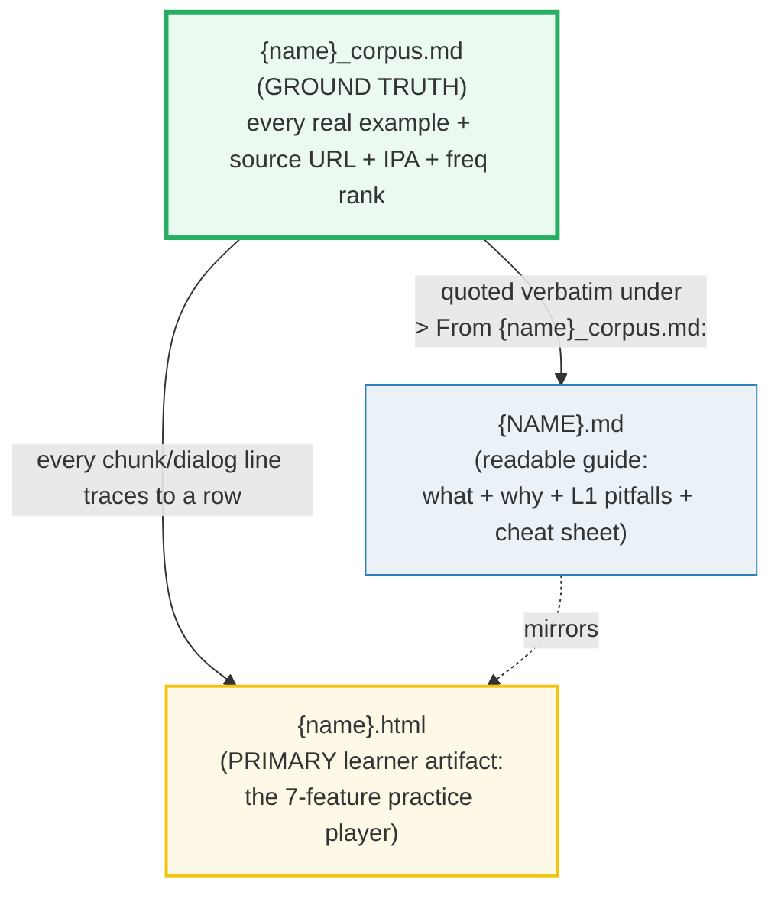
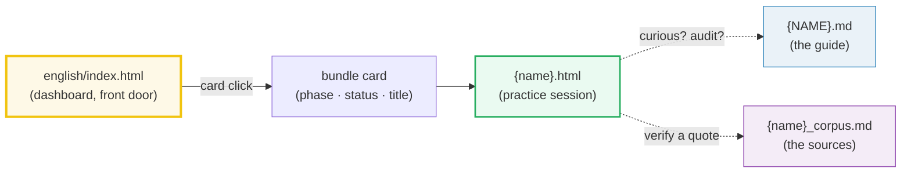
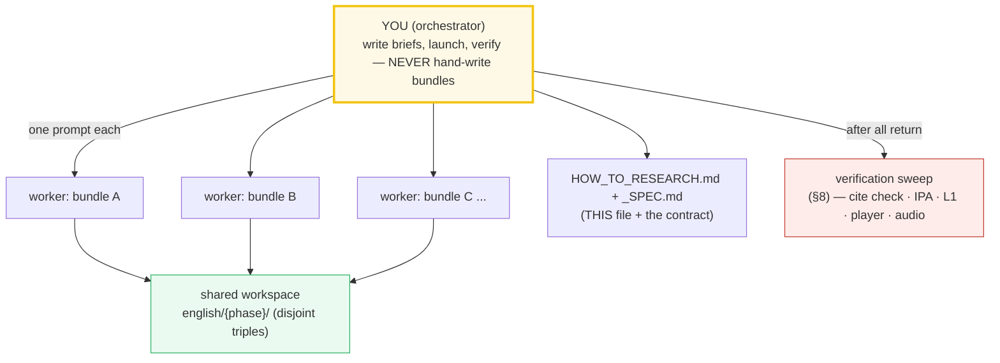
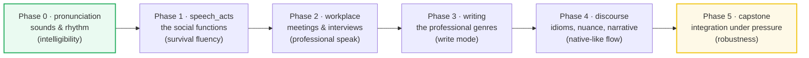

# HOW_TO_RESEARCH — The "Concept-as-a-Bundle" Workflow (English 80/20)

> A note from the build team to future builders: **how the `english/` folder is
> organized, why, and how to extend it.** Each concept is a **triple** — a corpus
> of real attestations, a readable guide, and an interactive practice player.
> Nothing is invented; every English line is a cited, real native utterance.
>
> **The north-star goal:** a Vietnamese-L1 learner who walks every bundle
> start-to-finish reaches **functional fluency** in ~90 high-frequency speaking
> and writing scenarios — they retrieve native-like **chunks** (not word-by-word
> translation), are understood without repetition, switch register, and write the
> common professional messages. The Pareto 20→80 in action.
>
> **The golden rule of building:** you (the orchestrator) **never write or edit a
> bundle file by hand.** Every bundle is produced by a **subagent** (one worker
> per bundle). Your job is to write tight worker briefs, launch them in parallel,
> and run the verification sweep. This is the `../python/` delegation discipline,
> applied here to **language acquisition** instead of code.
>
> **The law of the land:** [`./_SPEC.md`](./_SPEC.md) — read it before touching
> anything. This file is the operational manual; the spec is the contract. When
> the two seem to conflict, the spec wins.
>
> Sister folder: [`../python/HOW_TO_RESEARCH.md`](../python/HOW_TO_RESEARCH.md) —
> the same ground-truth discipline applied to the Python language. This folder
> applies it to **English for a Vietnamese L1 learner** (90 bundles, 6 phases).

---

## 0. The one rule (of a bundle)

> **Every English example that appears in a `.md` or `.html` is a real, cited
> attestation recorded in `{name}_corpus.md`. Nothing is invented.**

If a chunk, dialog line, sentence, IPA transcription, or frequency rank appears
in the guide or the player, it was mined from a real native source (Cambridge,
Oxford, COCA, YouGlish, etc.) and lives in the corpus with a URL. This is the
discipline that keeps the folder trustworthy as it scales to 90 bundles — and
it is the **opposite** of the "sounds native to me" instinct that poisons most
learner materials.



Three files, **one stem**, **one source of truth** (the corpus). The `.html` is
what the learner opens first; the `.md` and `_corpus.md` are references for the
curious and for auditors.

---

## 1. The directory layout

```
english/
├── _SPEC.md                       ← the coordinator contract (read FIRST)
├── HOW_TO_RESEARCH.md             ← you are here (builder-facing meta-workflow)
├── README.md                      ← learner-facing front matter (mindset + roadmap)
├── CURRICULUM.md                  ← the day-by-day map (90 bundles × 180 days)
├── index.html                     ← the dashboard (front door) — built later
│
├── pronunciation/                 ← Phase 0 · Days 1–20 · 10 bundles
│   ├── final_consonants_corpus.md   ─┐
│   ├── FINAL_CONSONANTS.md           │ one bundle triple
│   └── final_consonants.html         ─┘
│   ├── th_sounds_corpus.md         ─┐
│   ├── TH_SOUNDS.md                  │ another bundle (cross-ref 🔗)
│   └── th_sounds.html               ─┘
│   └── ...
│
├── speech_acts/                   ← Phase 1 · Days 21–60 · 20 bundles
├── workplace/                     ← Phase 2 · Days 61–90 · 15 bundles
├── writing/                       ← Phase 3 · Days 91–130 · 20 bundles
├── discourse/                     ← Phase 4 · Days 131–160 · 15 bundles
└── capstone/                      ← Phase 5 · Days 161–180 · 10 bundles
```

A **concept bundle** = `{name}_corpus.md` + `{NAME}.md` + `{name}.html`, all
sharing one stem, living in the phase subfolder dictated by spec §9.

**Naming convention:**
- `_corpus.md` / `.html` → `lower_snake_case` (e.g. `final_consonants.html`).
- Guide `.md` → `UPPER_SNAKE_CASE` (e.g. `FINAL_CONSONANTS.md`).
- Phase subfolder names are **fixed** by spec §9: `pronunciation/`,
  `speech_acts/`, `workplace/`, `writing/`, `discourse/`, `capstone/`. Do not
  rename, merge, or invent phases.

**Phase summary (verbatim from spec §9):**

| Phase | Folder | Days | Bundles | Theme |
|---|---|---|---|---|
| 0 | `pronunciation/` | 1–20 | 10 | The sounds & rhythm that make you intelligible. |
| 1 | `speech_acts/` | 21–60 | 20 | The high-frequency social functions. |
| 2 | `workplace/` | 61–90 | 15 | Meeting/presentation/interview fluency. |
| 3 | `writing/` | 91–130 | 20 | The professional written genres. |
| 4 | `discourse/` | 131–160 | 15 | Idioms, phrasal verbs, nuance, narrative. |
| 5 | `capstone/` | 161–180 | 10 | Integration under pressure. |

**Totals:** 10 + 20 + 15 + 20 + 15 + 10 = **90 bundles**; 90 × 2 days =
**180 days**.

---

## 2. The three roles of each file

| File | Role | Hard rules |
|---|---|---|
| **`{name}_corpus.md`** | **Ground truth.** Every real example with source (Cambridge/Oxford URL, COCA sentence + ref, YouGlish clip), IPA, frequency rank, accent flag (US/UK). | Every line cited. **No invented sentences.** IPA pulled from a real dictionary. Frequency from wordfrequency.info / COCA spoken sub-corpus where relevant. |
| **`{NAME}.md`** | **Readable guide (reference).** What + why + **L1 pitfalls table (Vietnamese → English)** + a ≤8-chunk cheat sheet. | Quotes corpus verbatim under `> From {name}_corpus.md:` callouts. Explains the function, the register range, and — crucially — the L1 traps. Ends with `## Sources`. |
| **`{name}.html`** | **PRIMARY learner artifact (what the reader opens first).** The interactive practice player. | Every chunk/dialog line traces to the corpus. Self-contained (one file, no build). Uses the **verbatim Tailwind v4 browser CDN head + `@theme` palette** from spec §5. All 7 player features present. Audio is YouGlish/YouTube links — **no audio files bundled**. |

**Reader flow (from spec §4):**



The `.html` is **primary**. The `.md` and `_corpus.md` are **references** — they
exist for the learner who wants the "why" or for the auditor who wants proof.
Design the `.html` to be usable without ever opening the `.md`.

---

## 3. The "expert depth" requirement

A phrasebook stops at "here's how you say *hello*." This folder's bar is higher.
**Every `{NAME}.md` a worker produces must answer three layers:**

1. **What** — the function/chunk/set, with real native examples quoted verbatim
   from the corpus. The survival chunks a learner needs *today*.
2. **Why** — the pragmatic, phonological, or grammatical mechanism beneath it:
   why "I'm afraid there's an issue with…" softens a complaint; why "gonna"
   isn't lazy speech, it's the rhythm of English; why Vietnamese learners drop
   the final `-s` and what that costs them.
3. **L1 pitfalls that separate intermediates from the fluent** — the
   Vietnamese→English interference traps specific to this concept. This is the
   "expert payoff."

### 3.1 The L1 pitfalls table (non-negotiable)

Each `{NAME}.md` **ends** with a **Vietnamese → English pitfalls table**. This
is the analog of python's expert gotchas, and it is the single feature that
makes this folder *specific* to a Vietnamese learner rather than generic.
Seed rows the docs may cite (from spec §6 — workers extend, never replace):

| Vietnamese trap | English fix |
|---|---|
| Drops final consonants ("wen" for "went") | Drill final C + `-ed` / `-s`; exaggerate, then relax. |
| No tense marking → "Yesterday I go" | Enforce past morphology; drill time-adverb + past chunk. |
| Omitted articles → "She is teacher" | Drill `a/an/the` defaults; the "first mention = a, second = the" rule. |
| Pro-drop → "Is good" | Supply subject + copula; "It's good." |
| /θ/ → /t/, /ð/ → /z/ (th→t/d/z) | Tongue-between-teeth drill; minimal pairs `think`/`tink`, `this`/`dis`. |
| No plural marking | Enforce `-s` plurals; "two book**s**", not "two book". |
| Question word order missing | Auxiliary-first inversion; "Where **do** you…?", not "Where you…?". |

> If a worker ships a `.md` with no L1 pitfalls table, **re-spawn it.** A generic
> English guide with no L1 awareness is a failure of the spec, not a stylistic
> choice.

### 3.2 Real attestation (no "sounds native to me")

Every English line in the `.md` and `.html` is a row in `_corpus.md` with a
clickable source. The corpus is the audit trail. Acceptable sources (spec §10):
Cambridge, Oxford Learner's, Collins, Merriam-Webster, Macmillan; COCA / BNC
sentences with refs; YouGlish clips with timestamps; Forvo pronunciations;
Manchester Academic Phrasebank for writing bundles. **Invented examples are a
violation of the one rule (§0).**

### 3.3 The 7 practice-player features (spec §5)

Every `{name}.html` ships all seven — zero dependencies except the Tailwind v4
browser CDN, fully self-contained:

1. **Survival-chunk deck** — ≤8 flip cards (English ↔ meaning + IPA + real
   example), self-rate "knew it / didn't" → spaced practice persisted in
   `localStorage`.
2. **Real audio per chunk** — ▶ opens a YouGlish/YouTube clip at the moment
   (native audio; **no audio files bundled**).
3. **Dialog role-play** — pick Person A or B (the other side hides so *you*
   play it), step through line-by-line, click a line → see its chunks + hear it.
4. **Shadowing lane** — tap-to-record (`MediaRecorder`, **local only, no
   upload**) + playback to self-compare.
5. **Writing task** — textarea prompt + reveal-model-answer toggle + copy.
6. **L1 pitfalls table + cheat sheet** (static, mirrors the `.md`).
7. **Mark-finished** syncs with the dashboard via a shared `localStorage` key.

> A player missing any of the 7 is not a bundle — it's a draft. Re-spawn.

---

## 4. The golden rule: orchestrator + workers (you never edit by hand)



- **You (the orchestrator) do NOT write bundle content.** You: (a) fill in the
  worker prompt template (§5) with a per-concept brief, (b) launch workers **in
  parallel** — one `Task` call per bundle, all in one message, (c) run the
  verification sweep (§8), (d) re-spawn any worker that failed verification.
- **Each worker owns exactly ONE bundle** (its `_corpus.md` + `.md` + `.html`)
  and is told to follow this guide and the spec to the letter. It is forbidden
  from touching any other bundle's files, `index.html`, `README.md`,
  `CURRICULUM.md`, `HOW_TO_RESEARCH.md`, or `_SPEC.md`.
- **The workspace is shared** (`english/{phase}/`), but file ownership is
  disjoint, so parallel writes are safe.
- **No "just do it by hand" exception.** Even a single bundle goes through a
  worker. Fresh context per bundle is the whole point — bundle #90 stays as
  rigorous as bundle #1 because no single context has to hold all of them.

> Why no manual path? When you build many bundles in one session, context fills
> up, the L1 awareness drifts toward generic English, and later bundles get
> sloppy on citation. A worker gets a *fresh* context every time. Your judgment
> lives in the 5-minute brief, not the 50-minute hand-write.

---

## 5. The standard worker prompt (copy this, fill the blanks)

Every worker gets this preamble verbatim, then a per-concept "brief". This is
the single most important artifact in this guide — get it right and the bundles
come back uniform.

```text
You are building ONE "concept bundle" for the English 80/20 fluency repo. Work
ENTIRELY inside /Volumes/data/workspace/tutorials/english/{PHASE}/ (the phase
subfolder named in your brief). Do NOT touch any file that is not part of your
assigned bundle, and do NOT edit index.html, README.md, CURRICULUM.md,
HOW_TO_RESEARCH.md, or _SPEC.md.

=== STEP 0: ABSORB THE WORKFLOW (mandatory, do first, in order) ===
1. Read /Volumes/data/workspace/tutorials/english/_SPEC.md IN FULL — it is the
   contract. Then read
   /Volumes/data/workspace/tutorials/english/HOW_TO_RESEARCH.md IN FULL — it is
   the law. The bundle = {name}_corpus.md (ground truth, every example cited) +
   {NAME}.md (readable guide with the L1 pitfalls table) + {name}.html (PRIMARY
   learner artifact: the 7-feature practice player). The .html is what the
   learner opens first.
2. Study the canonical model bundle(s) and COPY THEIR STYLE EXACTLY:
   {MODEL_BUNDLES}   # e.g. pronunciation/final_consonants_* (Phase 0 onward)
   Match: the corpus row format (English | meaning | IPA | source URL | freq |
   accent); the "> From {name}_corpus.md:" verbatim callouts + mermaid + L1
   pitfalls table + ≤8-chunk cheat sheet in the .md; the 7 player features and
   the shared @theme palette in the .html.

=== STEP 1: MINE THE AUTHORITATIVE SOURCES ===
Read these and record REAL native attestations (with URLs) into the corpus —
no paraphrases, no "sounds native to me":
{CITE_SOURCES}   # e.g. "Cambridge dict entry for 'gonna'; COCA spoken for
                 #        'I was wondering if'; YouGlish 'kind of' top clips;
                 #        Manchester Academic Phrasebank 'Hedging' section"

=== STEP 2: FACT-CHECK VIA WEB (mandatory, do NOT skip) ===
For every chunk, IPA transcription, frequency claim, and pragmatic note:
web-search ≥2 authoritative sources (a learner's dictionary + COCA/YouGlish,
or two dictionaries). Verify the EXACT IPA in a real dictionary — never
transcribe from memory. Verify every URL actually resolves to the attested
example before pasting it. Record every URL in the corpus and in a
"## Sources" section at the bottom of {NAME}.md.
NEVER guess an IPA symbol or invent a sentence. If you cannot verify a chunk
in a real source, search until you can, or flag it explicitly in your final
report. Start your searches at: {WEB_ANCHORS}

=== HARD RULES ===
- NEVER invent an example. Every English line in .md/.html is a row in
  _corpus.md with a clickable source URL.
- IPA comes from a real learner's dictionary (Cambridge / Oxford / Collins /
  Macmillan / Merriam-Webster). Transcribe verbatim, including stress marks
  and US/UK variants. Flag accent per chunk.
- The .md MUST end with a Vietnamese → English L1 pitfalls table (see spec §6
  for seed rows) AND a ≤8-chunk cheat sheet.
- The .html is the PRIMARY artifact. Use the VERBATIM Tailwind v4 browser CDN
  head + @theme palette below. Implement all 7 player features (spec §5):
  (1) survival-chunk deck ≤8 flip cards with localStorage spaced practice,
  (2) real audio per chunk via YouGlish/YouTube links (NO bundled audio),
  (3) dialog role-play with hide-the-other-side,
  (4) shadowing lane with MediaRecorder (local only, no upload),
  (5) writing task with reveal-model-answer toggle,
  (6) L1 pitfalls table + cheat sheet (static, mirrors the .md),
  (7) mark-finished syncing via shared localStorage key.
- Self-contained: one .html file, no build step, no external JS/CSS except the
  Tailwind CDN script in the head.
- ≤8 survival chunks per bundle — the Pareto 20→80. Curate ruthlessly.

=== THE VERBATIM .html HEAD (paste as-is, change only the {Title}) ===
<!doctype html>
<html lang="en">
<head>
<meta charset="UTF-8" />
<meta name="viewport" content="width=device-width, initial-scale=1.0" />
<title>{Title} — English 80/20</title>
<script src="https://cdn.jsdelivr.net/npm/@tailwindcss/browser@4"></script>
<style type="text/tailwindcss">
  @theme {
    --color-bg:#0d1117; --color-panel:#161b22; --color-panel2:#0a0e14;
    --color-ink:#e6edf3; --color-muted:#8b949e; --color-border:#30363d;
    --color-grid:#21262d;
    --color-green:#27ae60; --color-teal:#2dd4bf; --color-blue:#58a6ff;
    --color-purple:#b9a9e8; --color-orange:#e67e22; --color-red:#c0392b;
    --color-amber:#f59e0b;
  }
</style>
</head>
<body class="bg-bg text-ink">
  <!-- the 7 features go here -->
</body>
</html>
Utilities you get from the @theme: bg-bg, text-ink, text-muted, border-border,
text-green, bg-panel, bg-panel2, text-teal, text-blue, text-purple, text-orange,
text-red, text-amber. Match the look of the model bundles.

=== DELIVERABLES (exact paths) ===
- /Volumes/data/workspace/tutorials/english/{PHASE}/{name}_corpus.md
- /Volumes/data/workspace/tutorials/english/{PHASE}/{NAME}.md
- /Volumes/data/workspace/tutorials/english/{PHASE}/{name}.html

{name}_corpus.md MUST contain: a row per attested example with columns
[English chunk | meaning | IPA | source URL | frequency rank | accent (US/UK)].
Every row cited. No invented sentences.

{NAME}.md MUST contain: what the function is + why it matters pragmatically;
"> From {name}_corpus.md:" verbatim quote blocks; a mermaid diagram where it
aids understanding; the Vietnamese → English L1 pitfalls table; a ≤8-chunk
cheat sheet; 🔗 cross-references to sibling bundles; and a "## Sources" section
with URLs.

{name}.html MUST contain: the verbatim head above; all 7 player features; every
chunk/dialog line traceable to a corpus row; mark-finished using the shared
localStorage key.

=== VERIFICATION (do ALL of these, then report) ===
1. Open {name}.html in a browser (or grep for the 7 feature hooks) — Tailwind
   styles load (dark bg, ink text), all 7 features present, every ▶ link is a
   real YouGlish/YouTube URL that resolves.
2. Every example in {NAME}.md and {name}.html has a matching row in
   {name}_corpus.md with a source URL.
3. Every IPA in the corpus matches a real dictionary entry (spot-check 3).
4. The L1 pitfalls table is present and Vietnam-specific (not generic ESL).
5. The cheat sheet has ≤8 chunks.

=== REPORT BACK (your final message) ===
- The 3 file paths created.
- How many corpus rows you mined, and from how many distinct sources.
- The 7 player features: confirm each is present (one line each).
- Web sources used (list URLs).
- Any chunk, IPA, or claim you could NOT verify in ≥2 sources (do not hide it).

=== YOUR CONCEPT BRIEF ===
Bundle stem: {name} / {NAME}
Phase: {PHASE_N} — folder {PHASE}/ — Days {DAY_RANGE} — bundle #{NUM}
Title: {TITLE}  (use the exact title from spec §9)
One-liner: {ONELINER}  (use the exact one-liner from spec §9)
Model bundles to copy style from: {MODEL_BUNDLES}
Cite sources (mine these first): {CITE_SOURCES}
Web anchors for fact-check: {WEB_ANCHORS}
Anchor chunks/concepts (verify in ≥2 sources, record in corpus, feature in
player): {ANCHOR_CONCEPTS}
Suggested .md sections: {SECTION_LIST}
Suggested mermaid in .md: {MERMAID_IDEAS}
A pinned real example the corpus MUST contain (so you and I can sanity-check
the attestation is real, not invented):
  {PINNED_REAL_EXAMPLE}   # e.g. "Cambridge entry for 'gonna' /ˈɡʌnə/ US —
                          #        url; and a COCA spoken hit for
                          #        'I was wondering if...' with the ref."
L1 pitfalls to seed the table (extend, don't replace): {L1_SEED_ROWS}
```

The `{BLANK}` fields are the only thing that changes between workers. Everything
else is constant — that's what keeps the bundles uniform.

> **Bootstrap note (Phase 0 only):** the very first bundle has no model to copy.
  Give it a richer brief (spell out the corpus row format, the callout style,
  the pitfalls-table columns, and a sketch of the 7-feature `.html` layout),
  then designate it the style anchor for all later workers by putting its path
  in `{MODEL_BUNDLES}`.

---

## 6. Filling the brief — the per-concept fields

For each concept you delegate, you (orchestrator) fill in:

| Field | What to put |
|---|---|
| `{PHASE}` / `{PHASE_N}` / `{DAY_RANGE}` / `{NUM}` | From spec §9 — verbatim. e.g. `pronunciation/` / Phase 0 / Days 1–2 / bundle #01. Never invent a phase or renumber. |
| `{TITLE}` / `{ONELINER}` | The exact title and one-liner from spec §9. These are locked; do not paraphrase. |
| `{MODEL_BUNDLES}` | 1–2 already-shipped bundles to copy style from (Phase 0's first bundle onward). |
| `{CITE_SOURCES}` | Real source refs: `dictionary.cambridge.org/dictionary/english/...`, `oxfordlearnersdictionaries.com/...`, `corpus.byu.edu/coca/`, `youglish.com/...`, `phrasebank.manchester.ac.uk/...`. |
| `{WEB_ANCHORS}` | Search phrases + canonical URLs, e.g. "Cambridge 'gonna' IPA US/UK; YouGlish 'I was wondering if' top 3 clips". |
| `{ANCHOR_CONCEPTS}` | The exact chunks/functions to verify & feature, e.g. "the weak form of 'can' /kən/ vs strong /kæn/; 'How's it going?' /ˌhaʊz_ɪt_ˈɡəʊɪŋ/; the rising intonation on a checking question." |
| `{SECTION_LIST}` | Suggested teachable points (A: the function + when to use it, B: the chunks with real examples, C: pronunciation/delivery notes, D: L1 pitfalls + contrast). |
| `{MERMAID_IDEAS}` | Where a diagram helps — register ladder, dialog turn map, intonation contour, genre skeleton. |
| `{PINNED_REAL_EXAMPLE}` | A concrete attested example the corpus MUST contain (chunk + IPA + source URL), so you and the worker can sanity-check the attestation is real, not invented. |
| `{L1_SEED_ROWS}` | 2–4 Vietnam-specific pitfalls to seed the table (the worker extends with concept-specific rows). Pull from spec §6 and the concept. |

**Rule of thumb:** spend 5 minutes on the brief. A lazy brief → a lazy bundle →
a learner who sounds like a phrasebook. The brief is where your judgment as
orchestrator actually lives.

---

## 7. Coordination rules (keep the swarm safe)

1. **Disjoint file ownership.** Each worker writes only its 3 files in its phase
   subfolder. State the exact paths in the prompt and forbid edits elsewhere.
   This makes parallel writes safe in the shared `english/` tree.
2. **No shared-file edits.** `index.html`, `README.md`, `CURRICULUM.md`,
   `HOW_TO_RESEARCH.md`, and `_SPEC.md` are **read-only to workers.** Dashboard
   links and curriculum checkboxes are wired by the orchestrator between batches,
   never by a worker mid-swarm.
3. **Launch in parallel.** Send all worker `Task` calls in ONE message.
   Independent file ownership = safe concurrency = max throughput. A full phase
   (10–20 bundles) can swarm at once.
4. **One concept per worker.** Never let a worker build two bundles — context
   splits and both degrade. A huge concept is still one worker with a richer
   brief, never two bundles in one prompt.

> Cross-phase dependencies (e.g. `workplace/diplomatic_disagreement` leaning on
> `speech_acts/agreeing_disagreeing`) are handled by **cross-references (§9)**,
> not by a worker editing another bundle. Link, don't touch.

---

## 8. The verification sweep (do this after ALL workers return)

Workers self-verify, but you independently re-check the whole batch. Run this
sweep; it catches silent failures (a worker that reported OK but shipped an
invented example or a broken audio link):

```bash
cd /Volumes/data/workspace/tutorials/english
for triplet in {BUNDLE_STEMS_FOR_THIS_BATCH}; do
  # triplet is "phase/stem", e.g. "pronunciation/final_consonants"
  phase="${triplet%%/*}"
  name="${triplet#*/}"
  upper="$(echo "$name" | tr '[:lower:]' '[:upper:]')"
  echo "===== $phase/$name ====="
  corpus="$phase/${name}_corpus.md"
  md="$phase/${upper}.md"
  html="$phase/${name}.html"

  # 1. All three files exist and are non-empty.
  for f in "$corpus" "$md" "$html"; do
    test -s "$f" && echo "  $f: present" || echo "  $f: MISSING/EMPTY"
  done

  # 2. Every example shown in the learner-facing .md/.html must be cited in
  #    the corpus. Pull the block-quoted chunks under the
  #    "> From {name}_corpus.md:" callouts in the guide and any double-quoted
  #    text in the player, then confirm each appears verbatim in the corpus
  #    (crude but catches the worst orphans).
  shown=$( { grep -A1 '^> From .*_corpus\.md:' "$md" | grep '^>' | grep -v '^> From';
            grep -oE '"[^"]+"' "$html"; } \
          | sed 's/^> *//; s/"//g; s/^ *//; s/ *$//' | grep -v '^$' | head -20 )
  for ex in $shown; do
    grep -q "$ex" "$corpus" && echo "  corpus row OK: $ex" \
      || echo "  ORPHAN (not in corpus): $ex"
  done

  # 3. IPA present (look for the IPA column / /ˈ.../ patterns) and sourced.
  ipa_count=$(grep -cE '/[^/]+/' "$corpus")
  url_count=$(grep -cE 'https?://' "$corpus")
  echo "  corpus: $ipa_count IPA tokens, $url_count source URLs"

  # 4. L1 pitfalls table present in the .md (Vietnam-specific).
  grep -qiE '(Vietnamese|L1|pitfall)' "$md" \
    && echo "  .md: L1 pitfalls present" \
    || echo "  .md: L1 pitfalls MISSING (re-spawn)"

  # 5. .html uses the verbatim Tailwind head + @theme, and has the 7 hooks.
  grep -q 'cdn.jsdelivr.net/npm/@tailwindcss/browser@4' "$html" \
    && echo "  .html: Tailwind CDN head OK" \
    || echo "  .html: Tailwind head MISSING (re-spawn)"
  grep -q '@theme' "$html" && echo "  .html: @theme palette OK" \
    || echo "  .html: @theme MISSING (re-spawn)"
  for hook in 'localStorage' 'MediaRecorder' 'YouGlish|youtube|youtu\.be' \
              'flip|card' 'role' 'textarea|writing' 'finished|complete' \
              'pitfall|cheat'; do
    grep -qiE "$hook" "$html" && echo "  .html feature OK: $hook" \
      || echo "  .html feature MISSING: $hook"
  done

  # 6. ## Sources section at the bottom of the .md.
  grep -q '^## Sources' "$md" && echo "  .md: ## Sources OK" \
    || echo "  .md: ## Sources MISSING (re-spawn)"
done
```

Then spot-check by hand: open 2–3 `.html` files in a browser, confirm the dark
palette renders, click a ▶ and confirm the YouGlish/YouTube clip opens at the
right moment, open 2–3 `_corpus.md` files and click 2 source URLs each to
confirm they resolve to the attested example.

**Re-spawn failures.** Any bundle that fails the sweep: re-launch ONE worker for
just that bundle, paste its prior output + the failing check as context, and
ask it to fix only the failure. Don't rewrite from scratch unless the whole
bundle is wrong (e.g. everything is invented).

---

## 9. Cross-referencing conventions

The whole point is **contrast to build fluency**. A learner who sees
`speech_acts/diplomatic_disagreement` after `speech_acts/agreeing_disagreeing`
should feel the register climb. Tell workers to be explicit:

- 🔗 marker in a `.md` = a cross-reference to a related bundle (use a relative
  path within `english/`, e.g. `../speech_acts/AGREEING_DISAGREEING.md`).
- Always state *why* the link matters in one line, e.g.
  "🔗 [LINKING](../pronunciation/LINKING.md) — the weak form of 'can' only
  sounds natural once you're linking consonant-to-vowel across word boundaries."
- The `.html` may surface the same link as a "Related practice" card at the
  bottom, so the learner can chain sessions.

### The phase spine (the fluency arc)



**Read the spine left-to-right as the build order, too.** Phase 0 first
(intelligibility unlocks everything), then the social functions, then the
workplace layer on top of those, then writing as the mode-switch, then nuance
to polish, then capstone to stress-test. A learner who jumps to Phase 4 with
shaky finals will sound broken no matter how many idioms they know — the spine
isn't arbitrary.

---

## 10. Tooling & sources

### 10.1 What workers cite (spec §10)

- **Dictionaries (IPA + meaning + examples):** Cambridge, Oxford Learner's,
  Collins, Merriam-Webster, Macmillan. Default to a learner's dictionary for IPA
  — general dictionaries underdocument spoken forms.
- **Corpora (real sentences + frequency):** COCA / BNC at english-corpora.org;
  wordfrequency.info (spoken sub-corpus for frequency ranks).
- **Audio (real native clips):** YouGlish (the workhorse — clips at the moment
  the chunk is spoken), Forvo (pronunciations by real speakers).
- **Writing (genre models):** Manchester Academic Phrasebank for academic /
  hedging; business-email corpora for workplace writing bundles.
- **Accent:** flag US/UK per chunk; the default dictionary follows the accent.
  Where US and UK differ meaningfully (e.g. `schedule`, `can't`, weak forms),
  give both.

### 10.2 Build tooling

- **Tailwind v4 browser CDN** is the *only* front-end dependency. No build step,
  no npm, no bundler. The `<script src="https://cdn.jsdelivr.net/npm/@tailwindcss/browser@4">`
  tag in the head is the whole toolchain.
- **No back-end.** Persistence is `localStorage` only. Audio is hotlinked from
  YouGlish/YouTube — **never download and bundle audio files.** Recordings from
  the shadowing lane stay local (`MediaRecorder` → blob URL), never uploaded.
- **No lint step is required** for `.html`/`.md` the way `ruff` is for python —
  but workers should still open the `.html` in a browser to confirm it renders.

### 10.3 The offline caveat (must appear in README, workers must know)

> **Pages need internet to style.** The Tailwind Play CDN is **dev-only** per
> Tailwind's own docs — it compiles classes in-browser at load time. Offline,
> the `.html` files render as unstyled HTML. The chunks, dialogs, and features
> are all still there (the DOM is complete), but the dark palette and layout
> vanish. For offline practice, a learner would need a built Tailwind CSS file
> swapped in — out of scope for this pass. Audio links (YouGlish/YouTube)
> obviously also require internet.

State this plainly in the README and accept it as a trade-off for zero-build
portability.

---

## 11. Common failure modes (and the fix)

| Worker symptom | Cause | Fix |
|---|---|---|
| `corpus: MISSING/EMPTY` | worker skipped Step 1 | re-spawn, make mining mandatory before any writing |
| `corpus: 0 source URLs` | worker invented examples | re-spawn, this violates §0; insist on ≥2 sources per chunk |
| `ORPHAN (not in corpus)` lines | worker hand-typed examples into `.md`/`.html` | re-spawn, emphasize "every line traces to a corpus row" |
| `corpus: 0 IPA tokens` | worker skipped transcription | re-spawn, IPA from a real dictionary is non-negotiable |
| `.md: L1 pitfalls MISSING` | worker wrote a generic ESL guide | re-spawn, cite §3.1 (the "expert payoff") + spec §6 |
| `.html: Tailwind head MISSING` | worker used a different CDN or inline CSS | re-spawn, paste the verbatim head from §5 |
| `.html feature MISSING: MediaRecorder` (etc.) | worker shipped a partial player | re-spawn, list the missing features only |
| Audio ▶ link 404s / wrong timestamp | worker guessed a YouGlish URL | re-spawn, every clip must be opened and verified |
| No `## Sources` in `.md` | worker skipped Step 2 web check | re-spawn, make Step 2 non-optional |
| Cheat sheet has 15 chunks | worker couldn't curate | re-spawn, enforce ≤8 (Pareto 20→80); name the survival set |
| Worker edited `index.html` / `README.md` | brief's "do NOT touch" clause was loose | restore from git; tighten the clause in the next brief |
| Vietnamese pitfalls are generic ESL ("listen more") | worker didn't target L1 interference | re-spawn with concrete seed rows in `{L1_SEED_ROWS}` |

---

## 12. The batch-run checklist (orchestrator's pre-flight & post-swarm)

**Before launching a swarm:**
- [ ] The phase subfolder exists (`english/{phase}/`); spec §9 names match.
- [ ] Each worker's 3 file paths are disjoint from every other worker's.
- [ ] Each brief has `{TITLE}` + `{ONELINER}` copied verbatim from spec §9.
- [ ] Each brief has `{CITE_SOURCES}`, `{WEB_ANCHORS}`, `{ANCHOR_CONCEPTS}`.
- [ ] Each brief has a concrete `{PINNED_REAL_EXAMPLE}` (a real chunk + IPA +
      URL the corpus must contain) so attestation is sanity-checkable.
- [ ] Each brief has `{L1_SEED_ROWS}` (≥2 Vietnam-specific pitfalls).
- [ ] For Phase 0, the first bundle is designated the style anchor.
- [ ] The verbatim Tailwind head + `@theme` snippet (§5) is in every prompt.
- [ ] You have the verification sweep script (§8) ready, with the batch's stems.

**After the swarm returns:**
- [ ] Verification sweep green for all bundles (all 3 files present + non-empty;
      corpus has IPA + URLs; `.md` has L1 pitfalls + `## Sources`; `.html` has
      the Tailwind head + `@theme` + all 7 feature hooks).
- [ ] Spot-checked 2–3 corpus source URLs — they resolve to the attested example.
- [ ] Spot-checked 2–3 `.html` files in a browser — palette renders, a ▶ clip
      opens at the right moment, the shadowing recorder works.
- [ ] Re-spawned any failures (one worker per failure, fix-only scope).
- [ ] Ticked the boxes in [`CURRICULUM.md`](./CURRICULUM.md) for the shipped
      bundles.
- [ ] Wired the new bundle cards into [`index.html`](./index.html) (dashboard
      links go live as each bundle ships — this is the orchestrator's job, never
      a worker's).

---

## 13. Why this produces fluency (not just knowledge)

- **The corpus makes it falsifiable.** Every chunk is a real native utterance
  with a clickable source — not "trust me, natives say this." A learner (or
  auditor) can verify any line in seconds. This kills the phrasebook-poisoning
  habit of inventing "sounds native" examples.
- **The triple forces the right practice loop.** The `.html` is built for
  *output* — flip cards, role-play, shadowing, writing tasks — not passive
  reading. The `.md` is the "why"; the corpus is the "proof"; the player is
  the "do." That loop, repeated daily for 180 days, is what moves chunks from
  conscious recall to automatic retrieval.
- **The L1 pitfalls table makes it Vietnamese-specific.** Generic ESL material
  ignores the interference patterns that actually break a Vietnamese learner's
  intelligibility — dropped finals, missing tense, pro-drop, th→t/d/z. Naming
  those traps in every bundle is what turns "English practice" into "English
  practice *for me*."
- **The 7-feature player makes daily dose survivable.** 20 minutes of flip +
  shadow + produce, with self-rating and spaced practice in `localStorage`,
  beats a two-hour weekly cram. The cadence is the curriculum.
- **Subagent delegation keeps depth uniform.** Bundle #90 is as deeply sourced
  and as L1-aware as bundle #1, because each gets fresh context and the same
  constant preamble. No single writing session has to hold the whole arc.
- **Cross-references force the big picture.** Linking `pronunciation/linking`
  to `speech_acts/small_talk` weak forms, and small-talk weak forms to
  `discourse/fluency_fillers`, and fillers to `capstone/speaking_under_pressure`
  — that chain *is* fluency. The chunks stop being islands and start being a
  system the learner can deploy under load.

---

## 14. Where to start

Open [`CURRICULUM.md`](./CURRICULUM.md) for the full day-by-day map (90 bundles,
6 phases, 180 days). Then launch the **Phase 0 swarm** (one worker per bundle,
all in one message — 10 bundles for `pronunciation/`), designating
`final_consonants` as the style anchor. Run the verification sweep (§8) when
they return, wire the cards into `index.html`, tick the curriculum boxes, and
move to Phase 1.
