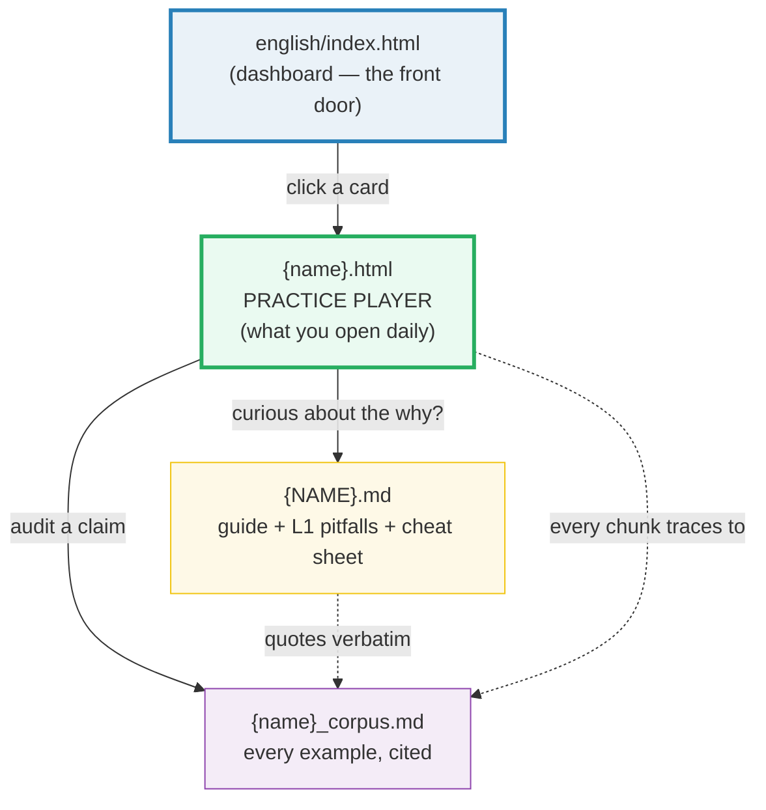
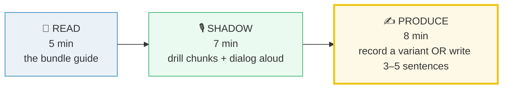

# English, the 80/20 Way — From Vietnamese L1 to Functional Fluency

> **20 minutes a day. 180 days. ~90 high-frequency scenarios.** This repo is a
> speaking- and writing-first fluency lab built for the **Vietnamese L1** learner.
> No grammar encyclopaedia, no rare vocabulary — just the **20% of English that
> carries ~85–90% of real conversation**, drilled until it leaves your mouth
> without translation.

---

## 🟢 Start here

**Open [`./index.html`](./index.html) in your browser.** That dashboard is the
front door of the whole repo. Pick a card → open a bundle → practice.

> **The `.html` is what you practice with. The `.md` and `_corpus.md` are references.**
>
| File you see in a bundle | What it is | When you open it |
|---|---|---|
| `{name}.html` | **The practice player** — your daily workout. | **Every day. This is the artifact.** |
| `{NAME}.md` | The readable guide: what + why + L1 pitfalls + cheat sheet. | When you want the *why* behind a chunk. |
| `{name}_corpus.md` | Ground truth: every real native example + source URL + IPA. | For the curious, or to audit a claim. |

You will live inside the `.html`. The other two files exist so that **nothing you
say is invented** — every line you drill traces back to a real native utterance
(Cambridge, COCA, YouGlish, …).

> ⚠️ **Honest note — the dashboard fills in over time.** Bundles ship
> **incrementally**; a card's link only goes live once that bundle is built. If a
> card is greyed out, it is coming soon. See the
> [“Bundles ship incrementally”](#honest-notes) section below.

---

## What “80% native” actually means

We say it plainly, because overpromising fluency is the oldest scam in language
learning. **“80% native” is functional, structural fluency in the high-frequency
zones — not a flawless native accent.** Concretely, after 180 days you can:

- Handle **~90 common scenarios** fluidly, using native-like **chunks** (not
  word-by-word translation from Vietnamese).
- Be **intelligible without repetition** — a native listener understands you the
  first time, even if your accent is still Vietnamese.
- **Switch register** (casual ↔ professional) and **mode** (speak ↔ write) on
  demand.
- Produce the **~2,000 most-frequent spoken word families**, the **~50 speech
  acts** that organise daily talk, and the **~10 pronunciation fixes** that
  unblock Vietnamese-speaker intelligibility.

That ~2,000 + ~50 + ~10 is the Pareto core. It covers an estimated **85–90% of
real conversation**. The last 10–15% — accent refinement, rare idioms, literary
register — is a lifetime project, and it is **out of scope** here on purpose.

---

## The six mindset principles (why this works)

These six ideas decide *what we drill and what we ignore*. If a lesson violates
one of them, it doesn’t belong in this repo.

| # | Principle | What it means in practice |
|---|---|---|
| 1 | **Pareto 20→80** | Attack the high-frequency zones. Ignore rare grammar, exotic idioms, anything a native speaker uses less than once a week. |
| 2 | **Chunks, not words** | Fluency = retrieving multi-word patterns (*“How’s it going?”, “I was wondering if…”, “Let’s circle back”*). We never drill single words in isolation. |
| 3 | **Output only counts** | You only “know” what you can **say** or **write** under time pressure. Every single day you produce — record yourself, or write 3–5 sentences. Reading is not enough. |
| 4 | **Real attestation** | Every example is a **cited** native utterance (dictionary / corpus / YouGlish). No invented “this sounds native to me” sentences — ever. |
| 5 | **L1-aware** | Every pitfall targets a real **Vietnamese → English** interference: dropped final consonants, missing tense, pro-drop, /θ/→/t/. This is where Vietnamese learners actually lose points. |
| 6 | **Daily dose beats binge** | 20 min/day × 180 days beats 6 hours on Sunday. Spaced retrieval is the mechanism; the `.html` player schedules it for you. |

---

## The bundle model — `.html`-first

A **bundle** is the smallest unit of practice. It is a **triple** of files that
share one stem (e.g. `greetings_intros`) and live together in a phase subfolder:

| File | Role | Hard rule |
|---|---|---|
| `{name}_corpus.md` | **Ground truth.** Every real example + source URL + IPA + frequency rank. | Every line cited. **No invented sentences.** |
| `{NAME}.md` | **Readable guide (reference).** What + why + the Vietnamese→English pitfalls table + a ≤8-chunk cheat sheet. | Quotes the corpus verbatim under `> From {name}_corpus.md:` callouts. |
| `{name}.html` | **Primary learner artifact.** The interactive practice player you open every day. | Every chunk/dialog line traces back to the corpus. |

> **The one rule of this repo:** *every example that appears in a `.md` or `.html`
> is a real, **cited** attestation recorded in `{name}_corpus.md`.* Nothing is
> invented. If you can’t find a native source for a sentence, it doesn’t go in.



**Read the diagram left-to-right:** you start at the dashboard, you *practice*
inside the `.html`, and the `.md` / `_corpus.md` are the reference layer that
makes the practice trustworthy.

---

## The 6-phase roadmap (180 days, 90 bundles)

One phase = one subfolder = one cluster of skills. Each bundle is **2 days** of
paced work. Day ranges, counts, and stems below are **canonical** — every doc in
this repo uses these exact values.

| Phase | Folder | Days | Bundles | Theme |
|---|---|---|---|---|
| **0 — Pronunciation** | `pronunciation/` | 1–20 | 10 | Fix the sounds that block intelligibility for Vietnamese L1: final consonants, /θ/ /ð/, clusters, vowel length, stress, linking, reductions, intonation, thought groups. |
| **1 — Core Speech Acts** | `speech_acts/` | 21–60 | 20 | The daily conversational functions: greet, thank, apologise, request, agree/disagree, interrupt, clarify, close, schedule, phone. |
| **2 — Workplace Speaking** | `workplace/` | 61–90 | 15 | Meetings, status updates, short presentations, SBI feedback, STAR interviews, negotiating, networking, video-call specifics. |
| **3 — Writing** | `writing/` | 91–130 | 20 | Email anatomy, register, requests, apologies, bad-news, follow-ups, IM/Slack, LinkedIn, cover letters, CV bullets, editing, complaints. |
| **4 — Discourse & Nuance** | `discourse/` | 131–160 | 15 | Hedging, humour, politeness, top-frequency idioms, phrasal verbs, collocations, register switching, storytelling, discourse markers, fillers. |
| **5 — Capstone** | `capstone/` | 161–180 | 10 | Integration under pressure: impromptu talks, debating, live feedback, speaking under pressure, timed writing, sustained monologue, full simulations. |
| **Total** | 6 subfolders | **1–180** | **90** | Speaking- and writing-first functional fluency. |

> Want the **day-by-day map** with every bundle’s title and one-liner? Open
> [`./CURRICULUM.md`](./CURRICULUM.md). It doubles as a progress tracker
> (`- [ ]` checkboxes per bundle).

---

## The daily ritual (~20–25 min)

This is the **20% effort** that produces the 80% result. Do it every day, in
this order, inside the bundle’s `.html` player:



1. **READ (5 min)** — skim the bundle guide (`{NAME}.md`) for the *what* and the
   Vietnamese→English pitfalls.
2. **SHADOW (7 min)** — drill the ≤8 survival chunks **and** the dialog aloud,
   with the YouGlish clips open. Mimic rhythm, not just words.
3. **PRODUCE (8 min)** — **speak** (record a variant of the dialog with your own
   details, via the player’s tap-to-record) **or** **write** (3–5 sentences using
   the chunks). This is the step that builds fluency. Skip it and you’re
   memorising, not learning.

> 🗓️ **Every 7th day = Sunday integration.** No new bundle. Instead, run **one
> ~10-minute conversation simulation** that combines the week’s functions
> (self-recorded). This is where isolated chunks start to chain into real speech.
> The `.html` player for that week’s last bundle has a simulation lane for this.

---

## How to use this repo

1. **Open [`./index.html`](./index.html)** in any modern browser. This is your
   dashboard — bookmark it.
2. **Start at Phase 0, Bundle 01** (`pronunciation/final_consonants`). Do **not**
   skip pronunciation even if you “already know some English” — it is the #1
   intelligibility lever for Vietnamese L1 and unblocks everything after it.
3. **Spend 2 days per bundle.** Day 1: READ + SHADOW. Day 2: PRODUCE (speak or
   write) + review yesterday's recording.
4. **Mark each bundle finished** via the button inside its `.html` — it syncs to
   the dashboard through shared `localStorage`, so your progress persists between
   sessions on the same browser.
5. **Every 7th day, run the integration simulation** instead of opening a new
   bundle.
6. **Follow the phase order.** Each phase assumes the previous one’s chunks are
   already semi-automated. Jumping ahead to Workplace before Core Speech Acts
   will feel hollow.
7. **Track the full 180 days** in [`./CURRICULUM.md`](./CURRICULUM.md) — tick a
   box every time you mark a bundle finished.

---

## Folder layout

```
english/
├── README.md            ← you are here (mindset + roadmap)
├── HOW_TO_RESEARCH.md   ← builder law: how every bundle is produced (subagents)
├── CURRICULUM.md        ← day-by-day map of all 90 bundles (progress tracker)
├── _SPEC.md             ← internal coordinator spec (not learner-facing)
├── index.html           ← the dashboard (front door — open this first)
│
├── pronunciation/       ← Phase 0 · Days 1–20   · 10 bundles
│   ├── final_consonants_corpus.md
│   ├── FINAL_CONSONANTS.md
│   ├── final_consonants.html
│   ├── th_sounds_corpus.md
│   ├── TH_SOUNDS.md
│   ├── th_sounds.html
│   └── …
│
├── speech_acts/         ← Phase 1 · Days 21–60  · 20 bundles
├── workplace/           ← Phase 2 · Days 61–90  · 15 bundles
├── writing/             ← Phase 3 · Days 91–130 · 20 bundles
├── discourse/           ← Phase 4 · Days 131–160· 15 bundles
└── capstone/            ← Phase 5 · Days 161–180· 10 bundles
```

Inside any phase subfolder, **one bundle = three files sharing a stem**:
`{name}_corpus.md` (ground truth) · `{NAME}.md` (guide) · `{name}.html`
(the player you practice with).

---

## For builders

If you are **building** bundles (not learning from them), the law lives in
[`./HOW_TO_RESEARCH.md`](./HOW_TO_RESEARCH.md). It encodes:

- The **one rule** (every example cited; nothing invented).
- The **triple-per-bundle** model and each file’s hard rules.
- The **worker prompt template** + the mandatory Tailwind v4 head + shared
  `@theme` dark palette every `.html` must use verbatim.
- The **verification sweep** every bundle must pass before it ships.

> **The golden rule of building:** the coordinator **never hand-writes a bundle.**
> Every bundle is produced by a subagent (one worker per bundle), launched in
> parallel, then verified. Fresh context per bundle keeps bundle #90 as rigorous
> as bundle #01.

---

## Honest notes

A few things we will not pretend:

- **Bundles ship incrementally.** This repo is built bundle-by-bundle by
  subagents. The dashboard (`index.html`) is the front door, but **a card’s link
  only goes live once that bundle is built.** If a card is greyed out, the bundle
  is queued, not missing — check back, or track progress in
  [`./CURRICULUM.md`](./CURRICULUM.md).
- **The `.html` player needs internet.** Styling uses the **Tailwind v4 browser
  CDN** (`cdn.jsdelivr.net/npm/@tailwindcss/browser@4`), and audio clips stream
  from **YouGlish/YouTube**. Per Tailwind’s own docs, the Play CDN is a
  **dev-only** convenience — fine for a personal learning repo on a connected
  machine, but **pages will render unstyled offline** and audio links will be
  dead. No audio files are bundled; everything is streamed from the cited native
  source.
- **Accent is flagged per chunk (US/UK),** not chosen globally. Real native usage
  varies; the corpus records which variety each example is.
- **This is not a grammar course.** We teach the chunks and speech acts that
  carry daily conversation. Deep grammar study is a different (and much slower)
  path — take it after, not instead of, this one.

---

## Next steps

- **Learner?** Open [`./index.html`](./index.html) → Phase 0 → Bundle 01.
- **Want the full day map?** [`./CURRICULUM.md`](./CURRICULUM.md).
- **Building a bundle?** [`./HOW_TO_RESEARCH.md`](./HOW_TO_RESEARCH.md).

> **Sources & further reading:** authoritative references used across this repo
> — Cambridge, Oxford Learner’s, Collins, Merriam-Webster, Macmillan;
> COCA / BNC (english-corpora.org) and wordfrequency.info (spoken sub-corpus);
> YouGlish and Forvo for audio; the Manchester Academic Phrasebank for writing.
> These are the corpora every `{name}_corpus.md` cites from.
