# Full Conversation Simulations

> **Phase 5 · capstone · bundle #89 · Days 177–178.**
> *Multi-function, multi-turn, unscripted.*
>
> 🔗 This is the **integration capstone** — the stress test that chains
> everything you have built into **one unscripted, multi-turn conversation**. It
> is **not** a new function. It is the **GLUE**: the conversation-management
> moves that join the prior functions in real time. It leans directly on:
> [GREETINGS & INTROS](../speech_acts/GREETINGS_INTROS.md) (the opening),
> [SMALL TALK](../speech_acts/SMALL_TALK.md) (the warm-up),
> [TOPIC TRANSITIONS](../speech_acts/TOPIC_TRANSITIONS.md) (*"Speaking of…"* /
> *"Anyway"*), [OPINIONS HEDGED](../speech_acts/OPINIONS_HEDGED.md),
> [DIPLOMATIC DISAGREEMENT](../workplace/DIPLOMATIC_DISAGREEMENT.md), and
> [CLOSINGS](../speech_acts/CLOSINGS.md). You know each one in isolation — now
> you **chain them**.

---

## Why this bundle exists (read this first)

A Vietnamese learner can often perform **one** function in isolation — open a
conversation, *or* make small talk, *or* give an opinion, *or* close politely.
The collapse happens **between** functions. Two minutes into a real
conversation, the partner's last turn does not match any pre-memorised script,
and the learner **freezes**: no opener ready, no transition loaded, no close in
reach. The failure mode is never "I don't know the words." It is one of three
**integration failures**:

1. **Dead air between functions** — the small talk ends and the learner has no
   *move* to launch the next topic, so the conversation stalls into silence.
2. **Abrupt topic jumps** — no *"Speaking of…"* bridge, so the partner cannot
   tell whether the new topic is related or random; it feels disjointed.
3. **No exit strategy** — the learner wants to leave but has no pre-close
   (*"It was great talking to you"*), so they either ghost abruptly or trap
   themselves in a conversation they cannot end.

The fix is not "be more confident." The fix is **a small set of management
moves** — the glue chunks — that signal to the partner what comes next, so the
speaker always has a *next move* loaded. That is this bundle. Teaching English
with Oxford (OUP), *Teaching Conversation*, names the competency outright:
*"strategies for **opening, developing and closing** conversation and for
**introducing and changing topics**."*

---

## 1. The conversation arc — seven moves, one thread

A multi-turn conversation is **one arc** you manage with audible moves. The
listener cannot see your outline, so every transition must be **announced**.
Each move below is a corpus attestation, and together they cover the whole arc:

```mermaid
flowchart LR
    OPEN["OPEN<br/>So, what brings you here?"] --> ELICIT["ELICIT<br/>So, tell me about…"]
    ELICIT --> LINK["LINK<br/>Speaking of… / That reminds me…"]
    LINK --> SHIFT["SHIFT<br/>By the way…"]
    SHIFT --> REDIRECT["REDIRECT<br/>Let me ask you this…"]
    REDIRECT --> RETURN["RETURN<br/>Anyway…"]
    RETURN --> CLOSE["CLOSE<br/>It was great talking to you"]
    style OPEN fill:#dcfce7,stroke:#27ae60,stroke-width:2px
    style ELICIT fill:#dcfce7,stroke:#27ae60,stroke-width:2px
    style LINK fill:#dbeafe,stroke:#58a6ff,stroke-width:2px
    style SHIFT fill:#dbeafe,stroke:#58a6ff,stroke-width:2px
    style REDIRECT fill:#f3e8ff,stroke:#b9a9e8,stroke-width:2px
    style RETURN fill:#fef3c7,stroke:#f59e0b,stroke-width:2px
    style CLOSE fill:#fef3c7,stroke:#f59e0b,stroke-width:2px
```

- **OPEN** — launches the exchange (*"So, what brings you here?"*).
- **ELICIT** — hands the floor over and names the topic (*"So, tell me about…"*).
- **LINK** — bridges to a related topic by naming the association (*"Speaking
  of…" / "That reminds me…"*).
- **SHIFT** — flags an unrelated side point (*"By the way…"*).
- **REDIRECT** — takes the wheel back toward your question (*"Let me ask you
  this…"*).
- **RETURN** — closes a side trip and comes home (*"Anyway…"*).
- **CLOSE** — signals the end and leaves a warm impression (*"It was great
  talking to you"*).

You do **not** fire all seven every conversation. But the speaker who has all
seven loaded never freezes — there is always a next move.

---

## 2. OPEN + ELICIT — launch and hand over the floor

The first two moves are a pair: **OPEN** breaks the ice, **ELICIT** immediately
gives the partner a topic to run with. The Oxford English Dictionary gives
`what brings you here?` a dedicated entry: *"for what reason have you come?",
"why are you here?" — now often used as a greeting or rhetorical question."*
Conversation Analysis treats *"Tell me about…"* as the canonical
**story-initiation** move — Cambridge's *Language in Society* publishes the
study *"Tell me about when you were hitchhiking: the organization of story
initiation."*

> From `conversation_simulations_corpus.md`:
>
> | chunk | what it does |
> |---|---|
> | **So, what brings you here?** | /səʊ wɒt ˈbrɪŋz juː ˈhɪə/ UK · /soʊ wɑːt ˈbrɪŋz juː ˈhɪr/ US — OPEN, the icebreaker (OED dedicated entry). |
> | **So, tell me about…** | /soʊ ˈtel miː əˈbaʊt/ — ELICIT, hands the floor over and names the topic (CA story-initiation). |

> **The Vietnamese trap:** learners often **open and then stop**, waiting for
> the partner to drive, because Vietnamese conversational openings are more
> relationship-led and less topic-launching. The fix: always pair the open with
> an eliciting question — *"So, what brings you here? … So, tell me about your
> work."* The elicitation is the engine.

🔗 This pairs with [GREETINGS & INTROS](../speech_acts/GREETINGS_INTROS.md)
(the greeting) and [SMALL TALK](../speech_acts/SMALL_TALK.md) (the warm-up
content).

---

## 3. LINK + SHIFT — change the topic without losing the thread

The partner is talking; you want to move. **LINK** when the new topic is
**related** (*"Speaking of…" / "That reminds me…"*) — you name the association,
so the change feels cohesive. **SHIFT** when it is unrelated (*"By the way…"*)
— you flag the boundary, so the partner is not left guessing. Both are
topic-orienting discourse markers (Fraser, 2009).

> From `conversation_simulations_corpus.md`:
>
> - **Speaking of…** /ˈspiːkɪŋ əv/ — LINK, names the shared anchor word
>   (Cambridge idiom: "related to the subject being discussed").
> - **That reminds me…** /ðæt rɪˈmaɪndz miː/ — LINK, names the triggered
>   association (Oxford *remind*: "**That** reminds me, I must get some cash.").
> - **By the way…** /baɪ ðə ˈweɪ/ — SHIFT, the lightest side-point marker
>   (Cambridge idiom, A2).

> **The Vietnamese trap:** learners **jump topics with no bridge** — "The
> weather is nice. I bought a new phone." — because Vietnamese topic-chains by
> association need no signpost. The fix: always deploy a marker **before** the
> new topic. Related → *"Speaking of…"*; unrelated → *"By the way…"*. 🔗 See
> [TOPIC TRANSITIONS](../speech_acts/TOPIC_TRANSITIONS.md) for the full family.

---

## 4. REDIRECT + RETURN — take the wheel, then come home

Two moves most Vietnamese learners never acquire. **REDIRECT** (*"Let me ask
you this…"*) is a **self-authorizing** pre-sequence (Schegloff, 1980; Cambridge
*Language in Society*, *"Self-authorizing action: On let me X"*) — it announces
*"I'm about to ask something, give it weight,"* so you can steer the talk toward
your question. **RETURN** (*"Anyway…"*) closes a side trip and resumes the main
thread.

> From `conversation_simulations_corpus.md`:
>
> - **Let me ask you this…** /ˌlet mi ˈɑːsk juː ˈðɪs/ UK · /ˌlet mi ˈæsk juː
>   ˈðɪs/ US — REDIRECT, flags a weighted question is coming (CA
>   self-authorizing move).
> - **Anyway…** /ˈeniweɪ/ — RETURN, closes a side trip / resumes the main
>   thread (Cambridge "Anyway as a discourse marker": "return to an earlier
>   subject").

> **The Vietnamese trap:** learners either **wait passively** for the partner to
> ask, or **interrupt bluntly**. *"Let me ask you this"* is the polite way to
> take the wheel. And after a digression, learners often **start a fresh topic**
> instead of returning — drill *"Anyway"* + the parked topic as your **return
> ticket**.

🔗 This extends [TOPIC TRANSITIONS](../speech_acts/TOPIC_TRANSITIONS.md) into
the multi-turn, unscripted setting.

---

## 5. CLOSE — end without ghosting or trapping yourself

The conversation must end. Schegloff (1986) shows closings are **ritualised but
still require interactional work**: you cannot just walk away. The
**appreciative pre-close** — *"It was great talking to you"* — is the standard
move that licenses the goodbye. Cambridge *talk* /tɔːk/ UK · /tɑːk/ US (silent
L).

> From `conversation_simulations_corpus.md`:
>
> | chunk | what it does |
> |---|---|
> | **It was great talking to you** | /ɪt wəz ˌɡreɪt ˈtɔːkɪŋ tə juː/ UK · /ɪt wəz ˌɡreɪt ˈtɑːkɪŋ tə juː/ US — CLOSE, the warm pre-leave that signals the end. |

> **The Vietnamese trap:** learners either **ghost** (go silent and drift off)
> or **trap themselves** (want to leave but have no exit line, so they stay too
> long). The fix: load the pre-close. *"It was great talking to you, but I
> should get going"* gives both speakers a graceful exit. 🔗 See
> [CLOSINGS](../speech_acts/CLOSINGS.md).

---

## 6. A worked multi-turn simulation (chaining five functions)

Here is the full arc on a sample setting — a networking event — so you can see
**all the moves chained** across six turns. Every bold management move is a
corpus row above; the function each turn performs is labelled.

> From `conversation_simulations_corpus.md` (the pinned model conversation):
>
> - **Turn 1 (A · OPEN):** *So, what brings you here? I don't think we've met.*
> - **Turn 2 (B · ELICIT / small talk):** *So, tell me about your work — you
>   said you're in design?*
> - **Turn 3 (A · LINK + opinion):** *Speaking of design, I actually think
>   remote work makes teams more creative.*
> - **Turn 4 (B · diplomatic disagree):** *I see your point, but I'd say
>   in-person sparks better ideas.*
> - **Turn 5 (A · REDIRECT + RETURN):** *Anyway, let me ask you this — do you
>   miss the office at all?*
> - **Turn 6 (B · CLOSE):** *It was great talking to you, but I should get
>   going.*

Read across the six turns, the conversation moves through **five functions**
(open → small talk → opinion → diplomatic disagree → close) joined by four
**management moves** (ELICIT, LINK, REDIRECT/RETURN). That is the integration
this bundle trains: **combine, don't isolate.**

🔗 The opinion+disagree moves trace to [OPINIONS HEDGED](../speech_acts/OPINIONS_HEDGED.md)
and [DIPLOMATIC DISAGREEMENT](../workplace/DIPLOMATIC_DISAGREEMENT.md).

---

## 7. Cheat sheet — the ≤8 survival chunks

The Pareto set. Drill these eight until each management move fires automatically
and you always have a next move loaded. (Every row is a corpus attestation
above.)

| # | Chunk | IPA | Move & why it's here |
|---|---|---|---|
| 1 | **So, what brings you here?** | /soʊ wɑːt ˈbrɪŋz juː ˈhɪr/ | OPEN — the icebreaker (OED dedicated entry) |
| 2 | **So, tell me about…** | /soʊ ˈtel miː əˈbaʊt/ | ELICIT — hand the floor over, name the topic |
| 3 | **Speaking of…** | /ˈspiːkɪŋ əv/ | LINK — bridge to a related topic (Cambridge idiom) |
| 4 | **That reminds me…** | /ðæt rɪˈmaɪndz miː/ | LINK — name the triggered association (Oxford) |
| 5 | **By the way…** | /baɪ ðə ˈweɪ/ | SHIFT — the lightest side-point marker |
| 6 | **Let me ask you this…** | /ˌlet mi ˈæsk juː ˈðɪs/ | REDIRECT — steer toward your question (CA) |
| 7 | **Anyway…** | /ˈeniweɪ/ | RETURN — close the side trip, come home |
| 8 | **It was great talking to you** | /ɪt wəz ˌɡreɪt ˈtɑːkɪŋ tə juː/ | CLOSE — the warm pre-leave |

> Open [`conversation_simulations.html`](./conversation_simulations.html) to
> drill these as flip cards, hear native clips, play the **multi-turn role-play
> (both sides, every turn's function labelled)**, shadow, and map your own
> 6-turn conversation.

---

## 8. Vietnamese → English L1 pitfalls table

The "expert payoff." These are the specific interference traps a Vietnamese
speaker hits when **chaining functions in real time** — extend, don't replace,
the seed rows from the spec.

| Vietnamese trap (what you do) | English fix (what to do instead) |
|---|---|
| **Knows functions in isolation but freezes between them** — can open, *or* small-talk, *or* close, but cannot chain them across minutes | Drill the **management moves** as the glue. After every function, load the next move: open → *"tell me about…"* → *"speaking of…"* → *"anyway"* → close. The move is the bridge. |
| **Opens and then stops** — waits passively for the partner to drive, because VN openings are relationship-led, not topic-launching | Always pair the open with an **eliciting question**: *"So, what brings you here? … So, tell me about your work."* The elicitation is the engine. 🔗 [SMALL TALK](../speech_acts/SMALL_TALK.md) |
| **Jumps topics with no bridge** — "The weather is nice. I bought a new phone." — because VN topic-chains by association need no signpost | Always deploy a marker **before** the new topic. Related → <code class="text-green">Speaking of…</code> / <code class="text-green">That reminds me…</code>; unrelated → <code class="text-blue">By the way…</code>. 🔗 [TOPIC TRANSITIONS](../speech_acts/TOPIC_TRANSITIONS.md) |
| **Waits passively or interrupts bluntly** — no polite way to take the wheel mid-conversation | Use <code class="text-purple">Let me ask you this…</code> as the **self-authorizing redirect**. It flags a weighted question is coming, so you steer without being rude. |
| **Starts a fresh topic after a digression** instead of returning — loses the main thread | Drill <code class="text-amber">Anyway</code> + the parked topic as your **return ticket**. After every side trip, plan the *"Anyway"* that brings you home. |
| **Ghosts or traps themselves at the end** — wants to leave but has no exit line | Load the **pre-close**: *"It was great talking to you, but I should get going."* Gives both speakers a graceful exit. 🔗 [CLOSINGS](../speech_acts/CLOSINGS.md) |
| **Translates word-by-word in real time** — slow, halting, loses the thread mid-turn; freezes when the partner's reply isn't pre-memorised | Retrieve **chunks**, not words. *"So, what brings you here?"* is one unit, not six words you assemble. Drill the 8 chunks until they fire as blocks under load. 🔗 [FLUENCY FILLERS](../discourse/FLUENCY_FILLERS.md) |
| **Pro-drop / omitted subject** → *"Bring you here?"* instead of *"What brings you here?"* | Supply the subject + auxiliary. English demands *"What brings…"* / *"It was great talking…"* — the subject is load-bearing. |
| **Drops the final consonant** in *"brings"* /brɪŋz/ → "bring", *"tell"* /tel/ → "te", *"remind"* /rɪˈmaɪnd/ → "remin" | Release every final: /ŋz/ on *brings*, /l/ on *tell*, /d/ on *remind*. A dropped final kills the management move the partner is tracking. 🔗 [FINAL CONSONANTS](../pronunciation/FINAL_CONSONANTS.md) |
| **Wrong stress on "anyway"** → "any-WAY", mapping VN even-syllable rhythm onto English | Stress the **first** syllable: **ANY**way /ˈeniweɪ/. The marker only works with native stress. 🔗 [SENTENCE STRESS](../pronunciation/SENTENCE_STRESS.md) |
| **No turn-management awareness** — treats conversation as monologue; never hands the floor, never signals a topic boundary | Conversations are **managed turns + topics + repair**, not solo speech. Name every move out loud until it is automatic. This is the whole point of the bundle. |

---

## How to practise this bundle (the daily 20 min)

1. **READ** (5 min) — this guide, §1–§6.
2. **SHADOW** (7 min) — open `conversation_simulations.html`, drill the 8 flip
   cards + the **multi-turn role-play aloud** (play BOTH sides across the six
   functions), exaggerating every management move, then relaxing.
3. **PRODUCE** (8 min) — the writing task: **map a 6-turn conversation across 4
   functions** (open → small talk → opinion+disagree → close), labelling each
   turn's function. Then deliver it aloud, role-playing both sides, unscripted —
   checking you never freeze between functions.

---

## Sources

- Oxford English Dictionary — *bring* (verb), dedicated entry `what brings you
  here?: "for what reason have you come?", "why are you here?" — now often used
  as a greeting or rhetorical question":
  https://www.oed.com/dictionary/bring_v
- Cambridge Advanced Learner's Dictionary — *bring* (prints *"What brings you
  here?"*), *talk* /tɔːk/ UK · /tɑːk/ US, *tell*, *ask* /ɑːsk/ UK · /æsk/ US,
  *anyway* (UK/US /ˈen.i.weɪ/ + the "Anyway as a discourse marker" grammar
  section), *speaking of someone/something* (idiom), *by the way* (idiom, A2):
  https://dictionary.cambridge.org/dictionary/english/{word_or_phrase}
- Oxford Advanced Learner's Dictionary — *remind* (prints "**That** reminds me,
  I must get some cash.") /rɪˈmaɪnd/; *anyway* (B1):
  https://www.oxfordlearnersdictionaries.com/definition/english/{word}
- Cambridge University Press, *Language in Society* — *"Self-authorizing
  action: On let me X in English social interaction"* (Schegloff 1980; analyses
  *"let me ask you this"*):
  https://www.cambridge.org/core/journals/language-in-society/article/selfauthorizing-action-on-let-me-x-in-english-social-interaction/902CF0632767F3D3A6CFEF28CD6AB844
- Cambridge University Press, *Language in Society* — *"Tell me about when you
  were hitchhiking: the organization of story initiation"* (*"Tell me about…"*
  as story-initiation / elicitation):
  https://www.cambridge.org/core/journals/language-in-society/article/tell-me-about-when-you-were-hitchhiking-the-organization-of-story-initiation-by-australian-and-japanese-speakers/008A55709710F37F153678B6DFCD22AB
- Schegloff, E. A. (1986), openings & closings as ritualised speech acts — cited
  in *"Openings and closings in human-human versus human-spoken dialogue"*
  (Language Learning & Technology):
  https://www.lltjournal.org/item/10125-73571/
- Teaching English with Oxford (OUP), *Teaching Conversation* — "strategies for
  opening, developing and closing conversation and for introducing and changing
  topics":
  https://teachingenglishwithoxford.oup.com/2014/01/16/teaching-conversation/
- Fraser, B. (2009), *An approach to discourse markers* (topic-management
  markers): https://www.researchgate.net/publication/245296163_An_approach_to_discourse_markers
- Academic English UK, *British vs American English* (confirms `ask` /ɑːsk/ →
  /æsk/): https://academic-englishuk.com/wp-content/uploads/2025/06/British-vrs-Ameriican-English-EXAMPLE-AEUK.pdf
- Native audio: YouGlish — https://youglish.com/pronounce/{chunk}/english/us?
- Frequency methodology: wordfrequency.info (spoken sub-corpus) — https://www.wordfrequency.info/
