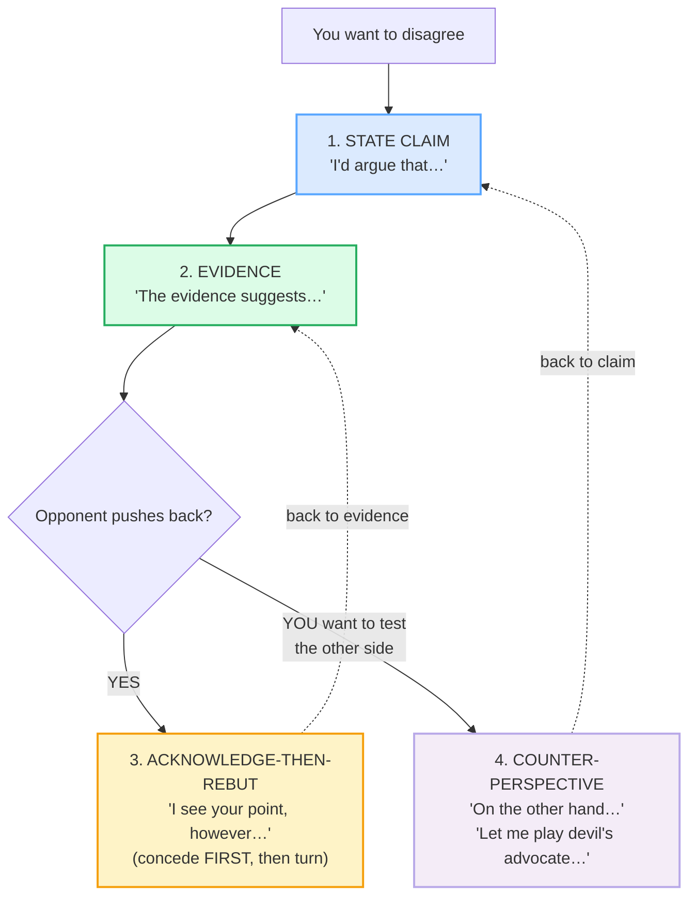

# Debating a Viewpoint

> **Phase 5 · capstone · bundle #82 · Days 163–164.**
> *Claim → evidence → rebuttal, calmly.*
>
> 🔗 This capstone integrates two earlier bundles: [AGREEING & DISAGREEING](../speech_acts/AGREEING_DISAGREEING.md) (the casual "Not sure I agree, actually" register) and [DIPLOMATIC DISAGREEMENT](../workplace/DIPLOMATIC_DISAGREEMENT.md) (the workplace "I see your point, however…" register). Debating is those moves **wired into a structure** — claim, evidence, rebuttal — delivered impersonally.

---

## Why this is a capstone bundle (read this first)

By Day 163 you can *agree*, *disagree diplomatically*, *hedge*, and *give evidence*. A debate is all of those **chained into one arc** under a single rule that most Vietnamese learners never internalise:

> **In English, you attack the *idea*, never the *person*. A debate is impersonal, structured, and calm.**

Vietnamese conversational culture treats open disagreement as a *face risk*. The choice is usually **avoid the debate** (giữ hòa khí, "keep the harmony") **or escalate emotionally** (raise the voice, make it personal: "Anh sai rồi", "You're wrong"). Both fail in an English-language meeting, interview, or seminar. English has built a third path: the **structured, low-affect debate** — *I'd argue that… → The evidence suggests… → I see your point, however…* — where the two sides can disagree fiercely about the *content* while remaining entirely civil about the *people*.

This bundle is the integration drill for that third path.

---

## 1. The four-move debate arc

A calm English debate runs on exactly four moves. Memorise the **shape**, not just the words — the shape is what keeps the temperature down.

| Move | Job | The chunk family |
|---|---|---|
| **1. State the claim** | Plant your flag, civilly. | *I'd argue that…* · *My main point is…* · *My position is…* |
| **2. Support with evidence** | Hand the floor to the data. | *The evidence suggests…* · *For example…* · *Research shows…* |
| **3. Acknowledge-then-rebut** | Concede something, *then* turn. | *I see your point, however…* · *That's true, but…* · *I grant you that, and yet…* |
| **4. Counter-perspective** | Show the other side (steelman or test your own). | *On the other hand…* · *Let me play devil's advocate…* · *Let me push back a little…* |

The non-negotiable habit is **move 3 before move 4**: never jump straight to *On the other hand* without first showing you heard the other side. Skipping the acknowledgement reads as combative in English even when the words are mild.

---

## 2. State the claim (move 1)

Lead with a **stance verb**, not a bare "I think". "I think" is weak and invites "well, that's just your opinion"; "I'd argue that" signals *I have a defensible position*.

> From `debating_corpus.md`:
>
> - **I'd argue that…** /aɪd ˈɑːɡjuː ðæt/ UK · /aɪd ˈɑːrɡjuː ðæt/ US — the canonical academic-civil stance opener (Manchester Academic Phrasebank: "In this paper, I argue that…").
> - **My main point is…** /maɪ meɪn ˈpɔɪnt ɪz/ — Oxford: "We have three main points of concern."
> - **My position is…** /maɪ pəˈzɪʃn ɪz/ — flags "here is where I stand."

> From `debating_corpus.md` — the **pinned** claim opener:
>
> > **I'd argue that…** — /aɪd ˈɑːɡjuː ðæt/ UK · /aɪd ˈɑːrɡjuː ðæt/ US
> > (Cambridge *argue* /ˈɑːɡjuː/–/ˈɑːrɡjuː/ + Manchester Phrasebank "I argue that…")

The contraction **I'd** (not "I would") is the native rhythm — drilling the full form sounds stiff. The /d/ of *I'd* links straight into the vowel of *argue* (/aɪ**d‿ˈɑː**ɡjuː/), so the two words feel like one beat.

---

## 3. Support with evidence (move 2)

A claim without a *because* is an assertion. In English you are expected to **show your work** — name the evidence the same turn you make the claim.

> From `debating_corpus.md`:
>
> - **The evidence suggests…** /ðə ˈevɪdəns səˈdʒests/ — Cambridge *evidence* entry itself carries "all the evidence suggests otherwise"; the *suggest* entry carries "all the evidence suggests (that) he's guilty."
> - **For example…** /fɔː(r) ɪɡˈzɑːmpl/ — the single most frequent evidence-introducer in spoken English.
> - **Research shows…** /rɪˈsɜːtʃ ʃəʊz/ UK · /ˈriːsɜːrtʃ ʃoʊz/ US
> - **The data indicates…** /ðə ˈdeɪtə ˈɪndɪkeɪts/

> **Why hedge the verb?** Note *suggests*, *indicates* — never *proves*. English academic register **hedges the strength of evidence** (🔗 [HEDGING & VAGUENESS](../discourse/HEDGING_VAGUENESS.md)). "Research *proves*" sounds arrogant and is almost always wrong; "research *suggests*" sounds measured and is almost always right.

---

## 4. Acknowledge-then-rebut (move 3 — the pivot)

This is the move that separates a calm debater from an aggressive one. The rule:

> **Concede something first, *then* turn.** Never lead the rebuttal with "No" or "But you're wrong".

> From `debating_corpus.md`:
>
> - **I see your point, however…** /aɪ siː jɔː(r) ˈpɔɪnt haʊˈevə(r)/ — the canonical polite-disagreement frame (Brown & Abeywickrama, *Language Assessment*, 2019). Oxford *point*: "I take your point" = I understand and accept what you're saying.
> - **That's true, but…** /ðæts ˈtruː bʌt/ — a shorter, warmer concession.
> - **I grant you that, and yet…** /aɪ ɡrɑːnt juː ðæt ənd jet/ UK · /aɪ ɡrænt juː ðæt ənd jet/ US — Oxford *grant*: "I grant you (that) it looks good, but it's not exactly practical."

> From `debating_corpus.md` — the **pinned** rebuttal opener:
>
> > **I see your point, however…** — /aɪ siː jɔː(r) ˈpɔɪnt haʊˈevə(r)/
> > (Oxford "I take your point" + Brown & Abeywickrama 2019 canonical frame)

The comma before *however* is load-bearing: it is the **physical pause** where you signal "I heard you" before you pivot. Rush past it and the concession vanishes — you sound like you're just waiting to talk.

---

## 5. Counter-perspective (move 4)

Introduce the opposing view — either to **steelman** it (show you understand the strongest version) or to **test your own** argument with *devil's advocate*.

> From `debating_corpus.md`:
>
> - **On the other hand…** /ɒn ði ˈʌðə(r) hænd/ UK · /ɑːn ði ˈʌðər hænd/ US — the standard contrastive discourse marker.
> - **Let me play devil's advocate…** /let miː pleɪ ˌdevlz ˈædvəkət/ — Oxford: "a person who expresses an opinion that they do not really hold in order to encourage a discussion"; example "the interviewer will need to play devil's advocate in order to get a discussion going."
> - **Let me push back a little…** /let miː pʊʃ bæk ə ˈlɪtl/ — the modern workplace frame for *I respectfully disagree* (Cambridge *push back* phrasal verb).

**Devil's advocate** is a powerful diplomatic tool: it lets you argue the opposite *without committing to it*. "Let me play devil's advocate" tells the room "I'm testing the idea, not attacking you" — which is exactly the impersonal stance an English-language debate demands.

---

## 6. The structural noun

The whole arc has one name, and it is a C1 word worth owning:

> From `debating_corpus.md`:
>
> - **rebuttal** /rɪˈbʌtl/ — Oxford: "the act of saying or proving that a statement or criticism is false; synonym *refutation*." Example: "The accusations met with a firm rebuttal."

The /tl/ cluster at the end (/rɪˈbʌ**tl**/) is exactly the kind of final cluster Vietnamese has no slot for — drill it tight, no trailing schwa ("rebutta-luh"). 🔗 [FINAL CONSONANTS](../pronunciation/FINAL_CONSONANTS.md).

---

## 7. Cheat sheet — the ≤8 survival chunks

The Pareto set. Drill these eight aloud until the **arc** (claim → evidence → rebut → counter) is automatic. (Every row is a corpus attestation above.)

| # | Chunk | IPA | Move |
|---|---|---|---|
| 1 | **I'd argue that…** | /aɪd ˈɑːɡjuː ðæt/ UK · /aɪd ˈɑːrɡjuː ðæt/ US | 1 claim |
| 2 | **My main point is…** | /maɪ meɪn ˈpɔɪnt ɪz/ | 1 claim |
| 3 | **The evidence suggests…** | /ðə ˈevɪdəns səˈdʒests/ | 2 evidence |
| 4 | **For example…** | /fɔː(r) ɪɡˈzɑːmpl/ UK · /fɔːr ɪɡˈzæmpl/ US | 2 evidence |
| 5 | **I see your point, however…** | /aɪ siː jɔː(r) ˈpɔɪnt haʊˈevə(r)/ | 3 rebut |
| 6 | **That's true, but…** | /ðæts ˈtruː bʌt/ | 3 rebut |
| 7 | **On the other hand…** | /ɒn ði ˈʌðə(r) hænd/ UK · /ɑːn ði ˈʌðər hænd/ US | 4 counter |
| 8 | **Let me play devil's advocate…** | /let miː pleɪ ˌdevlz ˈædvəkət/ | 4 counter |

> Open [`debating.html`](./debating.html) to drill these as flip cards, hear native clips, play the debate role-play, shadow, and write a position.

---

## 8. Vietnamese → English L1 pitfalls table

The "expert payoff." These are the specific interference traps a Vietnamese speaker hits when debating in English — extend, don't replace, the seed rows from the spec.

| Vietnamese trap (what you do) | English fix (what to do instead) |
|---|---|
| **Avoids debate entirely** to keep harmony (giữ hòa khí, tránh mất lòng) OR **escalates emotionally** (raises voice, makes it personal) | Use the **structured four-move arc** — claim → evidence → rebut → counter. The structure *is* the calm. Debate the **idea**, never the person. |
| **States opinion with no evidence** — "I think it's bad, full stop." (Vietnamese relies on assertion + the relationship to carry weight.) | Always attach a *because*: **claim + "The evidence suggests…" / "For example…"** in the same turn. An assertion without evidence reads as weak in English. |
| **Leads the rebuttal with "No" / "But you're wrong"** — goes straight to the counter, skipping the concession | **Acknowledge-then-rebut**: lead with **"I see your point, however…"** or **"That's true, but…"**. The concession protects the relationship; the *however* does the disagreement. |
| **Over-direct disagreement** — "You are wrong", "That's stupid", "I disagree" (bare) | Soften with the pivot frame or **"Let me push back a little…"**. Bare "I disagree" sounds aggressive; 🔗 [DIPLOMATIC DISAGREEMENT](../workplace/DIPLOMATIC_DISAGREEMENT.md). |
| **Takes disagreement personally** — face culture reads "I see your point, however" as a *rejection of you*, not of your *idea* | Reframe: in English, **"however" attacks the argument, not the speaker.** Practise receiving *however* neutrally — it is a turn in the debate, not a loss of face. |
| **Doesn't steelman / never uses "devil's advocate"** — argues only from one locked position | Use **"Let me play devil's advocate…"** to test the opposite *without committing*. It signals intellectual honesty and keeps the debate impersonal. |
| **Hedges the claim but **over-claims** the evidence** — "I *think* X" (weak) then "research *proves*" (too strong) | Invert it: **strong stance verb for the claim** (*I'd argue that…*), **hedged verb for the evidence** (*suggests / indicates*, never *proves*). 🔗 [HEDGING & VAGUENESS](../discourse/HEDGING_VAGUENESS.md). |
| **Drops finals on the load-bearing words** — "poin" for *point* /pɔɪnt/, "argumen" for *argument*, "eviden" for *evidence* /ˈevɪdəns/, "rebutta-luh" for *rebuttal* /rɪˈbʌtl/ | Release every final consonant — the /t/ in *point*, the /s/ in *evidence*, the /tl/ cluster in *rebuttal*. A dropped final on the *pivot word* ("I see your poin") collapses the move. 🔗 [FINAL CONSONANTS](../pronunciation/FINAL_CONSONANTS.md). |
| **Pro-drop / missing subject** — "Think is good" instead of "I'd argue that it's good" | Supply the subject + stance verb: **"I'd argue that…"**. English debates need an explicit *I* owning the claim. |
| **Rushes past the comma before *however*** — "I see your point however" as one run-on, so the concession disappears | Honour the **comma pause**: *I see your point* [beat] *however…*. The pause is the audible "I heard you". |

---

## How to practise this bundle (the daily 20 min)

1. **READ** (5 min) — this guide, §1–§5. Memorise the **four-move shape**.
2. **SHADOW** (7 min) — open `debating.html`, drill the 8 flip cards + the
   debate role-play **aloud**, exaggerating the comma pause before *however*.
3. **PRODUCE** (8 min) — the writing task: write a debate position (one claim +
   evidence + one rebuttal of the opposing view). Read it aloud, recording
   yourself; check the arc is intact and the tone stays impersonal.

---

## Sources

- Cambridge Advanced Learner's Dictionary — https://dictionary.cambridge.org/dictionary/english/{word} (entries for *argue, evidence, suggest, research, data, true, however, position, for example, on the other hand, push back*)
- Oxford Advanced Learner's Dictionary — https://www.oxfordlearnersdictionaries.com/definition/english/{word} (entries for *point, grant, devil's advocate, rebuttal*)
- Manchester Academic Phrasebank, *Introducing work* & *Being critical* — https://www.phrasebank.manchester.ac.uk/introducing-work/ , https://www.phrasebank.manchester.ac.uk/being-critical/ (attests "I argue that…", "contests the claim that…", "reviews the evidence…")
- Brown, H. D. & Abeywickrama, P. *Language Assessment* (Pearson, 2019) — the "I see your point; however…" polite-disagreement frame.
- Cambridge *English Phrasal Verbs in Use* (Advanced) — *push back*.
- Native audio: YouGlish — https://youglish.com/pronounce/{chunk}/english/us?
- Frequency methodology: wordfrequency.info (spoken sub-corpus) — https://www.wordfrequency.info/
