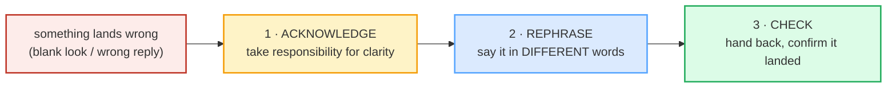

# Handling Being Misunderstood

> **Phase 5 · capstone · bundle #84 · Days 167–168.**
> *"Let me put it another way."*
>
> 🔗 This is a **capstone** bundle — it integrates everything before it. The
> repair moves here lean on [CLARIFYING](../speech_acts/CLARIFYING.md) (asking
> for clarification when *you're* lost) and
> [CROSS-CULTURAL CLARIFICATION](../workplace/CROSS_CULTURAL_CLARIFYING.md)
> (repairing meaning across accents), then add the reverse skill: repairing
> meaning when **you** were the one misunderstood. A sibling capstone,
> [SELF-CORRECTION STRATEGIES](./SELF_CORRECTION.md) (bundle #87), drills the
> faster "Sorry, what I meant was…" fix for slips; this one trains the full
> three-move **repair sequence**.

---

## Why this is a capstone (read this first)

Every learner who has spoken English in a real conversation has been
misunderstood. The instinct that decides whether the conversation survives is
**not** vocabulary or grammar — it is **what you do in the next two seconds**.
Two failure responses are universal; the fluent response is a learned move.

| The freeze | The repeat-louder | **The repair** |
|---|---|---|
| You go silent, blush, feel your English "failed." | You say the **same words** louder and slower, as if the listener were hard of hearing. | You **acknowledge** it, **rephrase** in different words, and **check** it landed. |

The third column is what this bundle trains. It is a **three-move sequence**, and
like any sequence it can be drilled as chunks until it runs automatically under
pressure. That automaticity is the whole point of Phase 5.

The **discipline at the heart of it**: **rephrase, don't repeat louder.** Repeating
the same words louder signals "you didn't understand me" — it blames the listener.
Rephrasing signals "I can make this clearer" — it owns the clarity. That single
reframe is what separates an intermediate who freezes from a fluent speaker who
repairs smoothly.

---

## 1. Move 1 — Notice + acknowledge (own the clarity)

The repair opens the instant you sense the misunderstanding. The native move is
**self-blame framing**: *"I didn't make myself clear"*, not *"you didn't listen"*.

> From `handling_misunderstood_corpus.md`:
>
> - **That's not quite what I meant** — /ðæts nɒt kwaɪt wɒt aɪ ment/ — "you
>   understood me slightly wrong."
> - **Sorry, I didn't make myself clear** — /ˈsɒri aɪ ˈdɪdnt meɪk maɪˈself klɪə/
>   UK · /ˈsɑːri ... klɪr/ US — "I accept that I was unclear (not your fault)."
> - **I don't think that came across** — /aɪ dəʊnt θɪŋk ðæt keɪm əˈkrɒs/ UK ·
>   /... əˈkrɔːs/ US — "my message didn't reach you the way I intended."

**Why it matters pragmatically:** the acknowledgement buys two things at once —
it signals "I noticed we're off track" *and* it keeps the listener's face intact.
Blaming the listener ("No, you're not getting it") closes the channel; owning the
clarity ("Sorry, I didn't make myself clear") reopens it.

---

## 2. Move 2 — Rephrase (the discipline)  ⭐

This is the move most learners skip. The instinct is to **repeat** — the same
sentence, slower, louder. That almost never works, because if the words were
ambiguous the first time, they're still ambiguous at a higher volume. The fix is
to **change the words**.

> From `handling_misunderstood_corpus.md` (the pinned anchors ⭐ the corpus must
> contain verbatim):
>
> - ⭐ **Let me put it another way** — /let mi pʊt ɪt əˈnʌðə weɪ/ UK ·
>   /let mi pʊt ɪt əˈnʌðər weɪ/ US — "I'll express this differently." Attested as
>   a rephrasing **gambit** in the *Oxford English Grammar Course — Advanced*
>   (Swan) and the University of Babylon gambits reference.
> - ⭐ **What I'm trying to say is…** — /wɒt aɪm ˈtraɪɪŋ tə seɪ ɪz/ UK ·
>   /wɑːt ... seɪ ɪz/ US — "the point I want to make is…" Attested in the same
>   gambits list (paired with the line above) and in communication-repair
>   references.
> - **Let me rephrase that** — /let mi ˌriːˈfreɪz ðæt/ — "let me say it again in
>   clearer words."
> - **To clarify…** — /tə ˈklærəfaɪ/ — "to make this clearer" (slightly formal;
>   strong in meetings/email).
> - **In other words…** — /ɪn ˈʌðə wɜːdz/ UK · /ɪn ˈʌðər wɜːrdz/ US — "stated
>   differently."

**The mechanism:** *"What I'm trying to say is…"* is a **wh-cleft** — it
front-loads the fact that a point is coming, which gives the listener a beat to
re-orient and gives *you* a beat to find better words. It is functionally a
**fluency filler that doubles as a rephrase** (🔗 see
[FLUENCY FILLERS](../discourse/FLUENCY_FILLERS.md) and
[EMPHASIS & CLEFT SENTENCES](../discourse/EMPHASIS_CLEFT.md)).

---

## 3. Move 3 — Check understanding (close the loop)

A repair that ends on the rephrase is only two-thirds done. The third move hands
the turn back and **confirms** the new version landed — so you don't walk away
from a misunderstanding you only half-fixed.

> From `handling_misunderstood_corpus.md`:
>
> - **Does that make more sense?** — /dʌz ðæt meɪk mɔː sens/ UK · /... mɔːr sens/
>   US — "is the new version clearer than before?"
> - **Is that clearer?** — /ɪz ðæt ˈklɪərə/ UK · /ɪz ðæt ˈklɪrər/ US — "is the
>   point clearer now?"
> - **Does that make sense now?** — /dʌz ðæt meɪk sens naʊ/ — "do you follow me at
>   this point?"

**Rising or falling?** These check-questions are typically asked with a **rising**
intonation — they're genuine questions inviting a yes/no, not rhetorical. (🔗 see
[INTONATION](../pronunciation/INTONATION.md).)

---

## 4. The full sequence in one breath

The capstone goal is to run all three moves **in one turn**, smoothly, without
freezing between them. The role-play in
[`handling_misunderstood.html`](./handling_misunderstood.html) drills exactly this
arc:

> acknowledge → rephrase → check

| Turn | Move | Line |
|---|---|---|
| Listener reacts wrong | — | "So you want to drop quality to hit the deadline?" |
| You | **Acknowledge** | *"That's not quite what I meant."* |
| You | **Rephrase** | *"Let me put it another way…"* / *"What I'm trying to say is…"* |
| Listener | — | "Oh — a phased rollout?" |
| You (or listener) | **Check** | *"Does that make more sense?"* |

---

## 5. Cheat sheet — the ≤8 survival chunks

The Pareto set. These eight let you run the whole repair sequence. (Every row is
a corpus attestation above.)

| # | Chunk | IPA | Move |
|---|---|---|---|
| 1 | **That's not quite what I meant** | /ðæts nɒt kwaɪt wɒt aɪ ment/ | acknowledge |
| 2 | **Sorry, I didn't make myself clear** | /ˈsɒri aɪ ˈdɪdnt meɪk maɪˈself klɪə/ | acknowledge |
| 3 | **Let me put it another way** ⭐ | /let mi pʊt ɪt əˈnʌðə weɪ/ | rephrase |
| 4 | **Let me rephrase that** | /let mi ˌriːˈfreɪz ðæt/ | rephrase |
| 5 | **What I'm trying to say is…** ⭐ | /wɒt aɪm ˈtraɪɪŋ tə seɪ ɪz/ | rephrase |
| 6 | **To clarify…** | /tə ˈklærəfaɪ/ | rephrase |
| 7 | **Does that make more sense?** | /dʌz ðæt meɪk mɔː sens/ | check |
| 8 | **Is that clearer?** | /ɪz ðæt ˈklɪərə/ | check |

> Open [`handling_misunderstood.html`](./handling_misunderstood.html) to drill
> these as flip cards, hear native clips, play the role-play, shadow, and write.

---

## 6. Vietnamese → English L1 pitfalls table

The "expert payoff." These are the specific interference traps a Vietnamese
speaker hits when **being misunderstood** — extend, don't replace, the seed rows
from the spec.

| Vietnamese trap (what you do) | English fix (what to do instead) |
|---|---|
| **Vietnamese face (thể diện) → when misunderstood, you FREEZE or go silent**, treating it as a personal failure of your English. | Treat it as **normal communication repair**, not a verdict on you. Open with *"Sorry, I didn't make myself clear"* — owning the clarity is a *confident* move, not an apology for being bad. |
| **Repeat the SAME words louder/slower** ("nói to hơn"), as if the listener were deaf. | **Rephrase in different words.** The ambiguity was in the *words*, not the volume. Reach for *"Let me put it another way…"*. |
| **Blame the listener** — *"Anh không hiểu à?"* / "You don't understand?" (rude in English; closes the channel). | **Self-blame framing**: *"I didn't make myself clear"*, *"That's not quite what I meant."* It keeps the listener's face and reopens the turn. |
| **Drops final consonants** so the rephrase is misunderstood *again* — *"clia"* for *clear*, *"sen"* for *sense*, *"men"* for *meant*. | Re-release every final: *clear* /klɪə/, *sense* /sens/, *meant* /ment/, *another way* /əˈnʌðə weɪ/. A rephrase that's mumbled at the end just starts the loop over. 🔗 [FINAL CONSONANTS](../pronunciation/FINAL_CONSONANTS.md). |
| **Stress-free Vietnamese rhythm** flattens the rephrase, so *"What I'm TRYING to say"* has no peak → listener can't locate the key word. | Put the **stress on the content word** (*try*, *mean*, *clear*) and weaken the grammar glue (*I'm, to, is*). The peak tells the listener where the new information is. 🔗 [SENTENCE STRESS](../pronunciation/SENTENCE_STRESS.md). |
| **Shame spiral → switches to Vietnamese** or gives up the point ("không sao, để sau"). | Stay in English and finish the **three-move sequence**. *"What I'm trying to say is…"* then *"Does that make more sense?"* — the loop *is* fluency, not a sign you lack it. |
| **Asks no check-question** (assumes the rephrase landed) and walks away from a half-fix. | Always close with a **check**: *"Does that make more sense?"* / *"Is that clearer?"* It costs two seconds and catches the misunderstanding before it compounds. |

---

## How to practise this bundle (the daily 20 min)

1. **READ** (5 min) — this guide, §1–§4.
2. **SHADOW** (7 min) — open `handling_misunderstood.html`, drill the 8 flip cards
   + the role-play **aloud**, running the full acknowledge → rephrase → check arc.
3. **PRODUCE** (8 min) — the writing task: write a repair sequence (acknowledge +
   rephrase + check-understanding) for a moment **you** were misunderstood.
   Read it aloud, recording yourself; check every final consonant is audible and
   the stress lands on the content word.

---

## Sources

- Cambridge Advanced Learner's Dictionary — https://dictionary.cambridge.org/dictionary/english/{word} (entries for *meant, clear, come across, try, word, sense, make sense*); rephrase pronunciation https://dictionary.cambridge.org/us/pronunciation/english/rephrase (rephrase US/ˌriːˈfreɪz/, UK/ˌriːˈfreɪz/).
- Oxford Advanced Learner's Dictionary — https://www.oxfordlearnersdictionaries.com/definition/english/clarify (clarify /ˈklærəfaɪ/, example *"She asked him to clarify what he meant"*); https://www.oxfordlearnersdictionaries.com/definition/english/rephrase; https://www.oxfordlearnersdictionaries.com/definition/english/another.
- Collins English Dictionary — https://www.collinsdictionary.com/us/dictionary/english/rephrase (rephrase /riːˈfreɪz/).
- Britannica Dictionary (audio) — rephrase /riˈfreɪz/.
- Swan, M. *Oxford English Grammar Course — Advanced* (OUP), "gambits" chapter — attests **"Let me put it another way"** as a rephrasing gambit (mirrored at https://www.seaproti.org/wp-content/uploads/2025/09/Oxford-English-grammar-course-Advanced.pdf and https://anyflip.com/iaxx/nbth/basic).
- University of Babylon humanities ref (gambits list) — attests **"Let me put it another way"** + **"What I'm trying to say is…"** as a rephrasing pair — https://www.uobabylon.edu.iq/publications/humanities_edition19/humanities_ed19_1.doc
- Keller, E. "Gambits in a New Light" (ResearchGate) — https://www.researchgate.net/publication/269793500
- "How to Recover and Keep Going After Making a Mistake" (English with Kim) — attests *"What I'm trying to say is…"*, *"Let me rephrase that"* — https://englishwithkim.com/recover-keep-going-mistakes/
- Ringer, J. "Being Heard: 6 Strategies for Getting Your Point Across" — https://www.judyringer.com/resources/articles/being-heard-6-strategies-for-getting-your-point-across.php
- Native audio: YouGlish — https://youglish.com/pronounce/{url-encoded chunk}/english/us? (phrase URLs verified HTTP 200 on 2026-06-24).
- Frequency methodology: wordfrequency.info (spoken sub-corpus) — https://www.wordfrequency.info/
