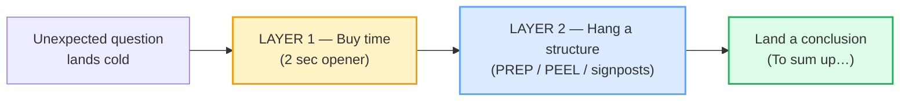

# 60-Second Impromptu Talks

> **Phase 5 · capstone · bundle #81 · Days 161–162.**
> *Structure a coherent answer in seconds.*
>
> 🔗 This is the **first capstone bundle** — it stress-tests everything you have
> built. It leans directly on:
> [HANDLING QUESTIONS](../workplace/HANDLING_QUESTIONS.md) (the *"That's a great
> question"* buy-time move) and
> [FLUENCY FILLERS](../discourse/FLUENCY_FILLERS.md) (the *"Let me think"*
> stalling family). Here you combine them into a **complete impromptu answer** —
> buy time, hang a structure on it, and land a conclusion — in 60 seconds flat.

---

## Why this is the capstone opener (read this first)

Across Phases 0–4 you drilled the **pieces**: pronunciation that makes you
intelligible, speech acts that let you function socially, workplace moves that
let you contribute in meetings, writing genres that let you communicate
professionally, and discourse nuance that makes you sound native-like. This
bundle asks the only question that matters: **can you assemble all of it, cold,
with zero preparation, in real time?**

That is what *impromptu* means — Oxford Learner's Dictionary defines it as
**"done without preparation or planning."** The fear is real: a Vietnamese
learner hit with an unexpected English question typically does one of two
things, both fatal:

1. **Freezes** — dead silence, the "face" (*thể diện*) instinct of not wanting
   to sound wrong.
2. **Rambles** — a stream of half-sentences with no structure, hoping one will
   stick.

The fix is not "be braver" or "know more words." The fix is a **portable
framework plus a buy-time opener** — two things you rehearse *now* so that, when
the question lands, your mouth deploys them on autopilot. That is the whole
bundle.

---

## 1. The two layers of an impromptu answer

A coherent 60-second impromptu answer is two layers stacked:

- **Layer 1 — Buy time.** The question hits; you do **not** start answering
  immediately. You drop a 2-second opener that buys planning time *and* signals
  composure. Silence says "stuck"; `um` says "lost"; a **phrase** says "I'm
  composing an answer."
- **Layer 2 — Hang a structure.** While the opener buys time, you slot in a
  pre-rehearsed **skeleton** (PREP or PEEL) and signpost each move so the
  listener can follow: *"First… second… finally…"*.

Do these two layers and you sound **prepared when you are not** — which is the
entire point of impromptu skill.

---

## 2. Layer 1 — the buy-time openers

These are the "composure" chunks. Each buys ~2 seconds of cognitive planning
while telling the listener "I heard you and I'm composing an answer."

> From `impromptu_talks_corpus.md`:
>
> | chunk | what it does |
> |---|---|
> | **That's a great question** | /ˌðæts ə ˌɡreɪt ˈkwestʃən/ — validates the asker; a stalling compliment. Cambridge's *question* entry prints *"That's a good question." = I don't know the answer.* |
> | **Let me think** | /ˌlet mi ˈθɪŋk/ — gains a moment before answering. Cambridge, *let's see*: *"The last time I spoke to her was, now let me think, three weeks ago."* |
> | **Off the top of my head** | /ɒf ðə ˈtɒp əv maɪ ˈhed/ — "from memory, without checking." Merriam-Webster glosses it as **"in an impromptu manner."** |

🔗 These are the direct descendants of [FLUENCY FILLERS](../discourse/FLUENCY_FILLERS.md)
("Let me think", "How should I put it") and [HANDLING QUESTIONS](../workplace/HANDLING_QUESTIONS.md)
("That's a great question"). The capstone layer combines them into the opening
second of a full answer.

> **The Vietnamese trap:** confronted cold, a Vietnamese learner often produces
> **dead silence** (face-saving) or jumps straight into a halting, word-by-word
> translation. Neither works. A rehearsed buy-time phrase is the trained
> alternative — it sounds *more* fluent than silence, because it shows you are
> in control of the floor.

---

## 3. Layer 2 — the portable structure frameworks

While the opener buys you 2 seconds, you slot in a **pre-rehearsed skeleton**.
Two frameworks dominate impromptu speaking; both are confirmed in multiple
independent references:

### PREP — Point, Reason, Example, Point

The single most-cited impromptu framework. Lumen Learning (*Business
Communication Skills for Managers* §11.3) gives the verbatim breakdown, and
Beverly Landais cites Toastmasters International:

> From `impromptu_talks_corpus.md` (PREP, attested in Lumen Learning +
> Toastmasters):
>
> - **P** = Point — state your opinion on the topic.
> - **R** = Reason — give your reason for that view.
> - **E** = Example — give one concrete fact or personal experience.
> - **P** = Point — restate your main point to land it.

> *"PREP stands for Point, Reason, Example, Point. This method is recommended by
> Toastmasters International as probably the easiest one to learn and use."*
> — Beverly Landais, citing Toastmasters International.

### PEEL — Point, Evidence, Explain, Link

Originally a writing framework, carried into spoken answers. Studiosity and
Staffordshire University define it identically:

> From `impromptu_talks_corpus.md` (PEEL, attested in Studiosity + Staffordshire):
>
> - **P** = Point — make your claim.
> - **E** = Evidence — give supporting data or an example.
> - **E** = Explain — explain how the evidence proves the point.
> - **L** = Link — tie it back to the question / your main point.

### The signposts — "First…, second…, finally…"

The frameworks are *invisible* to the listener unless you **signpost** them.
These three words are the audible spine of any structured answer:

> From `impromptu_talks_corpus.md`:
>
> - **Let me start with…** /ˌlet mi ˈstɑːt wɪð/ — launches point 1.
> - **There are a couple of points** /ˌðeər ə ə ˈkʌpəl əv ˈpɔɪnts/ — previews the map.
> - **First…, second…, finally…** /ˈfɜːst… ˈsekənd… ˈfaɪnəli/ — the three-step frame.

> **The Vietnamese trap:** Vietnamese learners tend to **ramble
> unstructured** — a stream of clauses with no *"First / Second / Finally"*,
> because Vietnamese discourse does not enumerate in the same rigid way. The
> listener cannot tell where one point ends and the next begins. The fix is to
> rehearse the signposts until they are automatic: every impromptu answer
> **announces** its shape.

🔗 This extends [SHORT PRESENTATIONS](../workplace/SHORT_PRESENTATIONS.md)
("Signposting: First…, next…, finally…") from the prepared-talk setting into the
unprepared one.

---

## 4. Land the conclusion — close in one line

An impromptu answer that trails off sounds unfinished. A **concluding signpost**
tells the listener "this is the takeaway" and lets you restate your point in one
breath:

> From `impromptu_talks_corpus.md`:
>
> - **To sum up…** /tə ˌsʌm ˈʌp/ — Cambridge, *sum up*: *"I'd just like to sum
>   up by saying that it's been a tremendous pleasure to work with you."*
> - **So that's my take** /ˌsoʊ ðæts maɪ ˈteɪk/ — informal conclude.
> - **In short** /ɪn ˈʃɔːt/ — brief conclude.

---

## 5. Personalize or choose — the human angle

Two final chunks let you turn a generic answer into a *memorable* one by adding
a personal stake or forcing a decision:

> From `impromptu_talks_corpus.md`:
>
> - **On a personal level…** /ɒn ə ˈpɜːsənəl ˈlevəl/ — pivots from the general
>   to your own experience. Cambridge, *personal*: *"My personal opinion/view
>   is that…"*
> - **If I had to choose…** /ɪf aɪ hæd tə ˈtʃuːz/ — forces a clear choice
>   instead of a hedge. Listed in IELTS Advantage's Band 7–9 phrase set.

---

## 6. A worked PREP answer (60 seconds, end to end)

Here is the full skeleton on a sample topic — *"Should meetings be shorter?"*
— so you can see all four moves chained. Every line is a corpus row (§E).

> From `impromptu_talks_corpus.md` (PREP on "Should meetings be shorter?"):
>
> - **P** — *In my view, meetings should be shorter.*
> - **R** — *The main reason is that long meetings drain focus.*
> - **E** — *For example, my team cut meetings to 30 minutes.*
> - **P** — *So, shorter meetings generally work better.*

Read aloud at a calm pace, that is ~15 seconds — leaving room for the buy-time
opener (*"That's a great question. Off the top of my head…"*) and the conclude
(*"To sum up…"*). Total: under 60 seconds, fully structured, zero preparation.

---

## 7. Cheat sheet — the ≤8 survival chunks

The Pareto set. Drill these eight until the framework is automatic — the moment
a question lands, your mouth runs the opener → signpost → conclude arc without
thinking. (Every row is a corpus attestation above.)

| # | Chunk | IPA | Why it's here |
|---|---|---|---|
| 1 | **That's a great question** | /ˌðæts ə ˌɡreɪt ˈkwestʃən/ | buy-time opener — validate + stall (Cambridge-attested) |
| 2 | **Off the top of my head** | /ɒf ðə ˈtɒp əv maɪ ˈhed/ | buy-time hedge — "from memory" (MW: "in an impromptu manner") |
| 3 | **Let me start with…** | /ˌlet mi ˈstɑːt wɪð/ | signpost — launches point 1 |
| 4 | **There are a couple of points** | /ˌðeər ə ə ˈkʌpəl əv ˈpɔɪnts/ | previews the map (multi-point answer) |
| 5 | **First…, second…, finally…** | /ˈfɜːst… ˈsekənd… ˈfaɪnəli/ | the three-step signpost frame (PREP spine) |
| 6 | **To sum up…** | /tə ˌsʌm ˈʌp/ | conclude — restate the takeaway |
| 7 | **On a personal level…** | /ɒn ə ˈpɜːsənəl ˈlevəl/ | pivot to your own experience |
| 8 | **If I had to choose…** | /ɪf aɪ hæd tə ˈtʃuːz/ | force a clear choice, not a hedge |

> Open [`impromptu_talks.html`](./impromptu_talks.html) to drill these as flip
> cards, hear native clips, play the impromptu Q&A role-play, shadow, and write
> your own PREP answer.

---

## 8. Vietnamese → English L1 pitfalls table

The "expert payoff." These are the specific interference traps a Vietnamese
speaker hits when asked to speak impromptu — extend, don't replace, the seed
rows from the spec.

| Vietnamese trap (what you do) | English fix (what to do instead) |
|---|---|
| **Freezes in dead silence** when asked cold — the face-saving (*thể diện*) instinct of not wanting to sound wrong | Deploy a **rehearsed buy-time phrase** instantly: *"That's a great question. Let me think…"* A phrase sounds *more* fluent than silence — it shows you control the floor. 🔗 [FLUENCY FILLERS](../discourse/FLUENCY_FILLERS.md) |
| **Rambles unstructured** — a stream of clauses with no *"First / Second / Finally"*, because Vietnamese discourse does not enumerate rigidly | Rehearse the **signpost frame**: every impromptu answer announces its shape. *"There are a couple of points. First… second… finally…"* The listener must be able to map your structure. |
| **Translates word-by-word** from Vietnamese in real time — slow, halting, disfluent | Retrieve **chunks**, not words. *"That's a great question"* is one unit, not six words you assemble. Drill the 8 cheat-sheet chunks until they fire as single blocks. |
| **Pro-drop / omitted subject** → *"Is good question"* instead of *"That's a great question"* | Supply the subject + copula. English demands *"That's…"* — the dummy subject is load-bearing here. 🔗 Phase 0 finals drill. |
| **Drops the question acknowledgement entirely** — jumps straight into a hesitant answer | Always **acknowledge before you answer**: *"That's a great question"* buys ~2 seconds *and* signals respect. Skipping it sounds blunt. 🔗 [HANDLING QUESTIONS](../workplace/HANDLING_QUESTIONS.md) |
| **Over-apologizes** — *"Sorry, my English is bad"* instead of structuring the answer | Never apologize for your English. Replace the apology with the structure: buy-time opener → PREP → conclude. Confidence comes from the framework, not the grammar. |
| **Starts with a blunt "Yes/No"** then cannot expand | Use **"If I had to choose…"** or **"On a personal level…"** to buy a frame before committing. The frame is where the answer lives. |
| **No concluding signpost** — the answer trails off into "…so, yeah" | Land it: **"To sum up…"** or **"So that's my take."** A one-line conclude tells the listener the answer is finished and restates the point. |
| **/θ/ → /t/, /ð/ → /z/** in *"think"* /θɪŋk/ → "tink", *"that's"* /ðæts/ → "zat" | Tongue-between-teeth for /θ ð/. These two sounds appear in the very first chunk (*"That's… think"*). 🔗 [TH SOUNDS](../pronunciation/TH_SOUNDS.md) |
| **Drops the final consonant** in *"great"* /ɡreɪt/ → "gray", *"first"* /fɜːst/ → "firs" | Release every final: /t/ on *"great"*, *"first"*, *"that's"*; /k/ on *"think"*. A dropped final flips meaning or kills the signpost. 🔗 [FINAL CONSONANTS](../pronunciation/FINAL_CONSONANTS.md) |

---

## How to practise this bundle (the daily 20 min)

1. **READ** (5 min) — this guide, §1–§6.
2. **SHADOW** (7 min) — open `impromptu_talks.html`, drill the 8 flip cards +
   the Q&A role-play **aloud**, running the opener → signpost → conclude arc on
   each turn.
3. **PRODUCE** (8 min) — the writing task: structure a 60-second impromptu
   answer using **PREP (Point-Reason-Example-Point)** on a random topic. Read it
   aloud, timing yourself; check you hit all four moves under 60 seconds.

---

## Sources

- Cambridge Advanced Learner's Dictionary — *question* (prints *"That's a good
  question." = I don't know the answer.*): https://dictionary.cambridge.org/dictionary/english/question
- Cambridge — *let's see* ("also let me see/think"): https://dictionary.cambridge.org/us/dictionary/english/let-s-see
- Cambridge — *sum up* (B2; *"I'd just like to sum up by saying…"*): https://dictionary.cambridge.org/dictionary/english/sum-up
- Cambridge — *personal* /ˈpɜː.sən.əl/ UK · /ˈpɝː.sən.əl/ US: https://dictionary.cambridge.org/dictionary/english/personal
- Cambridge — *choose*, *start*, *couple*, *first*, *second*, *finally*, *take*, *short*: https://dictionary.cambridge.org/dictionary/english/{word}
- Oxford Advanced Learner's Dictionary — *impromptu* ("done without preparation or planning"): https://www.oxfordlearnersdictionaries.com/definition/english/impromptu
- Merriam-Webster — *off the top of one's head* ("in an impromptu manner"): https://www.merriam-webster.com/dictionary/off%20the%20top%20of%20one%27s%20head
- Lumen Learning, *Business Communication Skills for Managers* §11.3 "Impromptu Speech" (PREP verbatim): https://courses.lumenlearning.com/suny-oswego-businesscommunicationmgrs2/chapter/11-3-impromptu-speech/
- Beverly Landais, "Tips to PREP for effective communication" (cites Toastmasters International): https://www.beverlylandais.co.uk/blog/tips-to-prep-for-effective-communication
- Winning Presentations, "Impromptu Speaking: 4 Steps to Sound Prepared on the Spot": https://winningpresentations.com/impromptu-speaking/
- Studiosity, "How to structure paragraphs using the PEEL method": https://www.studiosity.com/blog/how-to-structure-paragraphs-using-the-peel-method
- Staffordshire University LibGuide, "Academic writing: PEEL Paragraphs": https://libguides.staffs.ac.uk/academic_writing/PEEL
- IELTS Advantage, *100 Essential Words and Phrases for Band 7–9*: https://www.ieltsadvantage.com/wp-content/uploads/2025/11/100-Essential-Words-and-Phrases-for-Band-7-9-Success-2.pdf
- Native audio: YouGlish — https://youglish.com/pronounce/{chunk}/english/us?
- Frequency methodology: wordfrequency.info (spoken sub-corpus) — https://www.wordfrequency.info/
