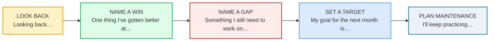
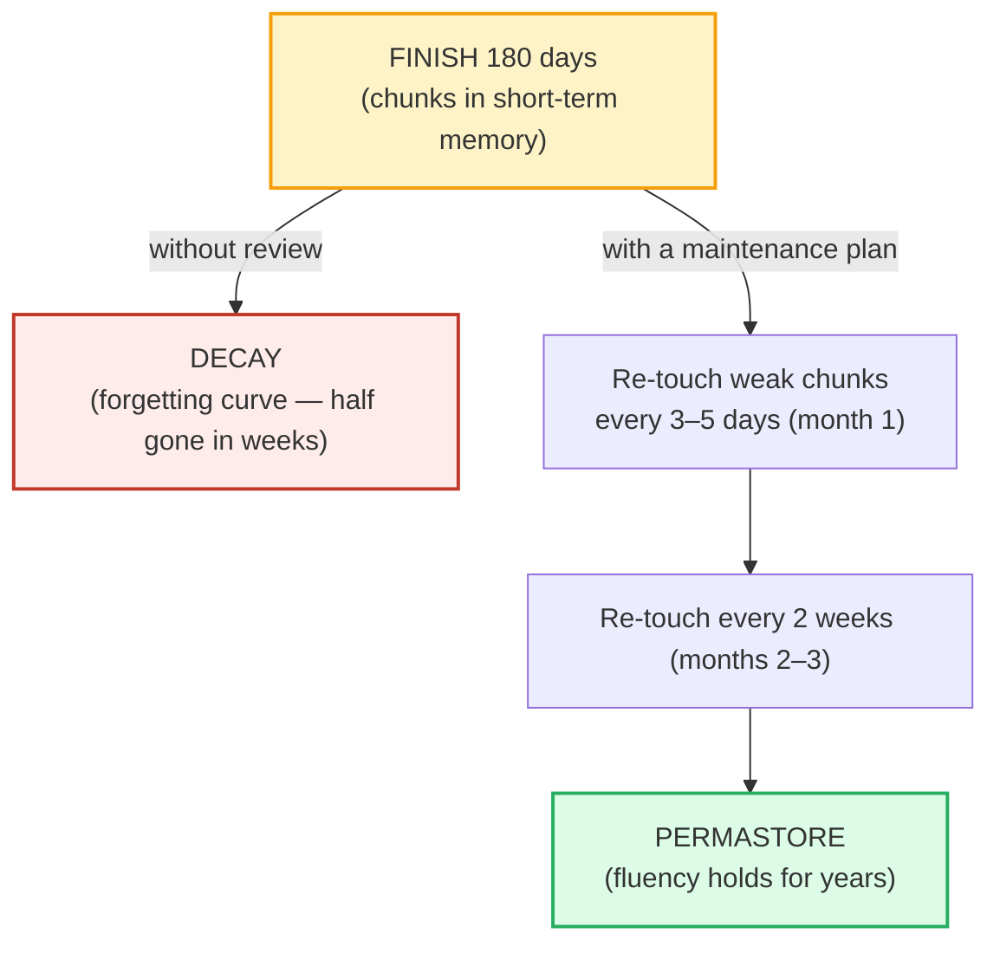

# Integration & Review

> **Phase 5 · capstone · bundle #90 · Days 179–180.**
> *Re-drill weak spots; celebrate; plan maintenance.*
>
> 🔗 This is the **FINAL bundle** — the capstone that ties the whole 180-day arc
> together. It is not a new skill; it is the **review of everything**. It leans
> on:
> [FINAL CONSONANTS](../pronunciation/FINAL_CONSONANTS.md) (the #1 weak spot to
> re-drill first), [IMPROMPTU TALKS](./IMPROMPTU_TALKS.md) (the *"That's a great
> question"* buy-time you reuse when a self-assessment question is hard),
> [SUSTAINED MONOLOGUE](./SUSTAINED_MONOLOGUE.md) (the *"To recap… / In
> conclusion…"* family you reuse to summarise 180 days), and the **whole phase
> spine** from pronunciation through discourse. Its job: turn 180 days of practice
> into a **maintenance plan** so fluency does not decay.

---

## Why this bundle exists (read this first)

You finished 90 bundles. Now the real question: **will you still be fluent in
three months?** Fluency is **use-it-or-lose-it**. Ebbinghaus's forgetting curve
(1885) showed that without re-exposure, memory decays *fast* — most of what you
drilled in Phase 0 is half-gone in weeks if you never touch it again. The learner
who walks 180 days and then stops loses it. The learner who runs **one honest
self-assessment + one maintenance plan** keeps it.

The trap specific to Vietnamese learners is not laziness — it is **face**. Many
Vietnamese learners **skip self-assessment** because they do not want to confront
weaknesses in front of themselves, or they swing the other way and become
**over-harsh** ("My English is terrible"), which kills confidence and motivation.
Both are failures. English self-assessment is **honest, structured, and
forward-looking**: name a win, name a gap, set a goal, plan the re-drill. This
bundle teaches the chunks that run that conversation — with yourself or a coach.

---

## 1. The self-assessment arc (look back → look forward)

A 180-day review is **not** a vague "how did it go?" It is a five-move arc, and
each move has a native chunk:

- **Look back** — open the review. Cast your mind over the 180 days before you
  judge. *"Looking back…"* is the frame.
- **Name a win** — state at least one concrete improvement. *"One thing I've
  gotten better at…"* (US; UK *"One thing I've got better at…"*) or *"I've noticed
  improvement in…"*
- **Name a gap** — state at least one concrete weakness as a **fixable area**, not
  a shame. *"Something I still need to work on…"* / *"An area I want to focus
  on…"*
- **Set a target** — one concrete goal for the next month. *"My goal for the next
  month is…"*
- **Plan maintenance** — commit to re-touching the chunks so they do not decay.
  *"I'll keep practicing…"* / *"Next I want to tackle…"*

🔗 This arc is the **spoken capstone** of the whole curriculum. The *"look back"*
move borrows the reflective register; the *"name a win / name a gap"* move is the
grown-up version of [GIVING FEEDBACK](../workplace/FEEDBACK_GIVING.md) (SBI:
specific, not vague) turned on yourself; the *"plan maintenance"* move is where
the forgetting curve gets beaten.

---

## 2. Layer 1 — look back (open the review)

The opening move. Collins COBUILD (*look back*) defines the phrasal verb: *"If you
look back, you think about things that happened in the past,"* and prints the
attested example *"Looking back, I am staggered how easily it was all arranged."*

> From `integration_review_corpus.md`:
>
> | chunk | what it does |
> |---|---|
> | **Looking back…** | /ˈlʊkɪŋ ˈbæk/ — opens the reflection. Collins COBUILD: *"Looking back, I am staggered how easily it was all arranged."* |
> | **Looking back on the last six months…** | /ˈlʊkɪŋ ˈbæk ɑːn ðə ˈlæst sɪks ˈmʌnθs/ — scopes the review to the 180-day arc. Oxford: *"to look back on your childhood."* |

> **The Vietnamese trap:** learners often **skip the "look back" frame** and jump
> straight to "I need to improve X" — because Vietnamese self-criticism tends to go
> straight to the flaw. The English convention is to **open with reflection first**,
> then name the win, then the gap. The frame (*"Looking back…"*) signals "I am
> about to assess myself honestly," which builds credibility with a coach or
> interviewer.

---

## 3. Layer 2 — name a win (what I've gotten better at)

After looking back, name **at least one concrete improvement**. Not vague ("my
English is better") but specific and tied to a chunk you drilled. Oxford
(*improvement*) defines *"the act of making something better"* and prints the
phrases *"an area for improvement"* and *"room for improvement."* Cambridge
(*better*) glosses *get better* = "to improve."

> From `integration_review_corpus.md`:
>
> - **One thing I've gotten better at…** /ˌwʌn ˈθɪŋ aɪv ˈɡɑːtn ˈbetər ət/ — names
>   one concrete win (US present perfect). Cambridge, *better*: *get better* =
>   "to improve." *(UK: "One thing I've got better at…")*
> - **I've noticed improvement in…** /aɪv ˈnoʊtɪst ɪmˈpruːvmənt ɪn/ — observes a
>   specific area of progress. Oxford, *improvement*: *"There is a need for
>   continuous improvement in performance."*
> - **There's still room for improvement** — the balanced caveat: progress made,
>   but more to go. Oxford lists *"room for improvement"* verbatim.

> **The Vietnamese trap:** learners are **either too humble** ("Nothing, my
> English is still bad" — false and demoralising) or **too vague** ("My English is
> better" — uncheckable). The fix: name **one specific, chunk-level win** — e.g.
> *"One thing I've gotten better at is releasing my final consonants."* That is
> honest, specific, and forward-looking.

---

## 4. Layer 3 — name a gap (what I still need to work on)

The honest self-assessment then names **at least one concrete weakness** — not as
shame but as a **named target** you can re-drill. Oxford (*work on*) defines the
sense: *"work on something = to try hard to improve or achieve something,"* and
prints *"You need to work on your pronunciation a bit more."* Oxford (*focus*)
defines *"focus on"* = "to give a lot of attention to one particular thing."

> From `integration_review_corpus.md`:
>
> - **Something I still need to work on…** /ˈsʌmθɪŋ aɪ stɪl ˈniːd tə ˈwɜːrk ˈɑːn/
>   — names one specific weak spot to re-drill. Oxford, *work on*: *"You need to
>   work on your pronunciation a bit more."*
> - **An area I want to focus on…** /ən ˈeriə aɪ ˈwɑːnt tə ˈfoʊkəs ɑːn/ — targets a
>   specific zone for the next month. Oxford, *focus*: *"focus on = to give a lot
>   of attention to one particular thing."*

> **The Vietnamese trap (face):** many learners **cannot name a weakness honestly**
> — either they dodge it ("I'm okay at everything") or collapse into over-harsh
> self-flagellation ("I'm terrible"). The English convention is the **balanced,
> specific gap**: *"Something I still need to work on is my past tenses under
> pressure."* One named weakness is a target; a wall of self-criticism is
> paralysis. 🔗 Use the dashboard's `localStorage` self-ratings to find the actual
> weak chunks — the data removes the face problem.

---

## 5. Layer 4 — look forward (set a goal + plan maintenance)

The self-assessment closes by **looking forward**: one concrete goal, plus a
maintenance commitment that beats the forgetting curve. Oxford (*goal*) defines
*"something that you hope to achieve"* and prints *"You need to set yourself some
long-term goals."* Cambridge (*keep*) glosses *"keep doing something = to continue
doing something,"* and Cambridge (*practice*) prints *"I need to practise my
French."*

> From `integration_review_corpus.md`:
>
> - **My goal for the next month is…** /maɪ ɡoʊl fər ðə ˈnekst mʌnθ ɪz/ — states
>   one concrete target. Oxford, *goal*: *"You need to set yourself some long-term
>   goals."*
> - **I'll keep practicing…** /aɪl ˈkiːp ˈpræktɪsɪŋ/ — the maintenance commitment.
>   Cambridge, *keep*: *"keep doing something = to continue doing something"*;
>   Cambridge, *practice*: *"I need to practise my French."*
> - **Next I want to tackle…** /ˈnekst aɪ ˈwɑːnt tə ˈtækl/ — names the next
>   challenge. Cambridge, *tackle*: *"to try to deal with something."*

---

## 6. The maintenance plan (beating the forgetting curve)

This is the bundle's payoff: **a maintenance plan so fluency does not decay.** The
science is settled and old:

- **The forgetting curve (Ebbinghaus, 1885).** Without re-exposure, memory decays
  rapidly at first, then flattens. Most of what you drilled is half-gone in weeks
  if you never touch it again. The cure is **spaced re-exposure** — revisiting
  each chunk at increasing intervals.
- **The spacing effect (Cepeda et al., 2006).** The optimal review gap is roughly
  **10–20% of the retention interval**: to remember something for a month, review
  it again after ~3–5 days; to remember it for a year, review after ~5–7 weeks.
  Cramming or massed review does *not* work as well as spaced review.
- **Permastore (Bahrick, 1984).** Spaced re-exposure over years can move material
  into long-term "permastore" — retention measured in decades. That is the goal of
  a maintenance plan.

**A concrete maintenance plan for the next month:**

1. **Find your weak chunks.** Open the dashboard — the flip-card self-ratings in
   `localStorage` already mark every chunk you rated "didn't." Those are your
   re-drill list.
2. **Re-drill 2 weak bundles per week.** Open their `.html`, re-run the flip deck +
   shadowing lane, re-rate. Aim for "knew it" on every card.
3. **Spaced re-exposure.** Week 1: review the weak chunks. Week 2: review them
   again + 1 new weak bundle. Week 3–4: lengthen the gap. This is the spacing
   effect in action.
4. **Use it or lose it.** Fluency is output. Speak or write for 10 minutes a day —
   even a self-recorded monologue — so the chunks stay in the retrieval path, not
   just the recognition path.

🔗 The dashboard's `localStorage` self-ratings are the **data layer** under this
plan: they turn "what am I weak at?" from a face-laden guess into a checklist.

---

## 7. Cheat sheet — the ≤8 survival chunks

The Pareto set. Drill these eight until the look-back → win → gap → goal →
maintenance arc fires automatically. (Every row is a corpus attestation above.)

| # | Chunk | IPA | Why it's here |
|---|---|---|---|
| 1 | **Looking back…** | /ˈlʊkɪŋ ˈbæk/ | reflection opener (Collins COBUILD) |
| 2 | **One thing I've gotten better at…** | /ˌwʌn ˈθɪŋ aɪv ˈɡɑːtn ˈbetər ət/ | names a concrete win (Cambridge *better*) |
| 3 | **I've noticed improvement in…** | /aɪv ˈnoʊtɪst ɪmˈpruːvmənt ɪn/ | observes progress (Oxford *improvement*) |
| 4 | **Something I still need to work on…** | /ˈsʌmθɪŋ aɪ stɪl ˈniːd tə ˈwɜːrk ˈɑːn/ | names a concrete gap (Oxford *work on*) |
| 5 | **An area I want to focus on…** | /ən ˈeriə aɪ ˈwɑːnt tə ˈfoʊkəs ɑːn/ | targets a zone (Oxford *focus*) |
| 6 | **My goal for the next month is…** | /maɪ ɡoʊl fər ðə ˈnekst mʌnθ ɪz/ | states the next-month target (Oxford *goal*) |
| 7 | **I'll keep practicing…** | /aɪl ˈkiːp ˈpræktɪsɪŋ/ | maintenance commitment (Cambridge *keep* + *practice*) |
| 8 | **Next I want to tackle…** | /ˈnekst aɪ ˈwɑːnt tə ˈtækl/ | names the next challenge (Cambridge *tackle*) |

> Open [`integration_review.html`](./integration_review.html) to drill these as
> flip cards, hear native clips, play the coach↔learner reflection role-play,
> shadow, and write your 180-day self-assessment.

---

## 8. Vietnamese → English L1 pitfalls table

The "expert payoff." These are the specific interference traps a Vietnamese
speaker hits in self-assessment and maintenance planning — extend, don't replace,
the seed rows from the spec.

| Vietnamese trap (what you do) | English fix (what to do instead) |
|---|---|
| **Skips self-assessment entirely** (face: does not want to confront weaknesses) → never finds the weak chunks → they decay | Run the **five-move arc** every week: *"Looking back… → One thing I've gotten better at… → Something I still need to work on… → My goal… → I'll keep practicing…"*. Use the dashboard self-ratings so the data, not your ego, names the gaps. |
| **Over-harsh self-assessment** ("My English is terrible") → loses confidence, quits | English self-assessment is **balanced and specific**: always pair a win with a gap (*"One thing I've gotten better at is X. Something I still need to work on is Y."*). One named weakness is a target; a wall of criticism is paralysis. |
| **Vague self-assessment** ("I need to improve my English") — no specific area, so no specific drill | Name a **chunk-level** area: *"An area I want to focus on is my final consonants."* Vague goals produce vague practice; specific goals produce specific re-drills. 🔗 [FINAL CONSONANTS](../pronunciation/FINAL_CONSONANTS.md) |
| **No present perfect** → "I get better" instead of "I've gotten better at…" | Vietnamese has **no perfect tenses**. The self-assessment win needs the **present perfect** (*"I've gotten / I've noticed"*) — it signals "a change that happened and still holds now." |
| **No maintenance plan** — finishes 180 days and stops → fluency decays (forgetting curve) | Always close with a **forward plan**: *"My goal for the next month is… I'll keep practicing…"*. Spaced re-exposure (re-touch weak chunks every few days, then lengthen the gap) moves chunks to permastore. |
| **"Practice" vs "practise"** confusion — spells the verb wrong (UK) | US: both noun and verb are **"practice"**. UK: the verb is **"practise"**, the noun is **"practice."** Cambridge: *"I need to practise my French"* (UK verb). Pick one variety and stay consistent. |
| **Pro-drop** → *"Want to focus on…"* instead of *"An area I want to focus on…"* | Supply the subject. English reflection demands *"I've…" / "I want…" / "I'll…" — the subject is load-bearing and signals ownership of the assessment. |
| **Drops the final consonant** in *"improvement"* /ɪmˈpruːvmənt/ → "improvemen", *"month"* /mʌnθ/ → "mon", *"goal"* /ɡoʊl/ → "go" | Release every final: the /t/ on *improvement*, the /θ/ on *month*, the /l/ on *goal*. A dropped final in a self-assessment undercuts the very intelligibility you are reviewing. 🔗 [FINAL CONSONANTS](../pronunciation/FINAL_CONSONANTS.md) |
| **Translates the reflection word-by-word** from Vietnamese — slow, halting, loses the thread | Retrieve **chunks**, not words. *"Looking back, one thing I've gotten better at…"* is one block, not ten words you assemble. Drill the 8 cheat-sheet chunks until they fire as units. 🔗 [IMPROMPTU TALKS](./IMPROMPTU_TALKS.md) |
| **Cannot name a weakness in front of a coach** (face/deference) → answers "everything is okay" | The English convention is **honest, specific, forward-looking**. *"Something I still need to work on is my past tenses under pressure"* is professional and credible — it shows self-awareness, not failure. |

---

## How to practise this bundle (the daily 20 min)

1. **READ** (5 min) — this guide, §1–§6.
2. **SHADOW** (7 min) — open `integration_review.html`, drill the 8 flip cards +
   the coach↔learner reflection role-play **aloud**, running the look-back → win →
   gap → goal → maintenance arc.
3. **PRODUCE** (8 min) — the writing task: **write your 180-day self-assessment**
   (what improved / what's still weak / your maintenance plan for the next month).
   Then read it aloud, recording yourself; check the arc is complete and every
   final consonant is audible.

---

## Sources

- Collins COBUILD Advanced Learner's Dictionary — *look back* ("If you look back,
  you think about things that happened in the past." — *"Looking back, I am
  staggered how easily it was all arranged."*):
  https://www.collinsdictionary.com/dictionary/english/look-back
- Oxford Advanced Learner's Dictionary — *look back*, *improvement* ("room for
  improvement"), *work on* ("You need to work on your pronunciation"), *focus*
  ("focus on"), *goal* ("set yourself some long-term goals"):
  https://www.oxfordlearnersdictionaries.com/definition/english/{word}
- Cambridge Advanced Learner's Dictionary — *better* (*get better* = "to
  improve"), *keep* ("keep doing something"), *practice/practise* ("I need to
  practise my French"), *tackle* ("to try to deal with something"), *get* (US
  *gotten*): https://dictionary.cambridge.org/dictionary/english/{word}
- Ebbinghaus, H. (1885/1913). *Memory: A Contribution to Experimental Psychology*
  — the forgetting curve: https://psychclassics.yorku.ca/Ebbinghaus/index.htm
- Cepeda, N. J., Pashler, H., Vul, E., Wixted, J. T., & Rohrer, D. (2006).
  Distributed practice in verbal recall tasks: A review and quantitative
  synthesis. *Psychological Bulletin*, 132(3), 354–380:
  https://doi.org/10.1037/0033-2909.132.3.354
- Bahrick, H. P. (1984). Semantic memory content in permastore. *Journal of
  Experimental Psychology: General*, 113(1), 1–29.
- The Learning Scientists, *Spaced Practice*:
  https://www.learningscientists.org/spaced-practice
- Gwern Branwen, *Spaced Repetition for Efficient Learning*:
  https://www.gwern.net/Spaced-repetition
- Native audio: YouGlish — https://youglish.com/pronounce/{chunk}/english/us?
- Frequency methodology: wordfrequency.info (spoken sub-corpus) —
  https://www.wordfrequency.info/
