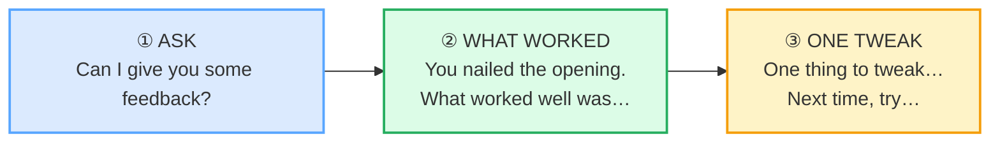

# Giving Live Feedback

> **Phase 5 · capstone · bundle #83 · Days 165–166.**
> *Real-time, specific, actionable, kind.*
>
> 🔗 This is the **spoken, real-time twin** of
> [FEEDBACK GIVING](../workplace/FEEDBACK_GIVING.md) (bundle #36, the *written*
> SBI version). #36 teaches the formal **SBI™** frame — `When you…, the impact
> was…` — for a scheduled 1:1 or a written review. **THIS** bundle teaches the
> **live micro-feedback** you deliver in the moment: right after a dry-run, in
> the corridor, during a rehearsal break. The phrases are shorter, faster, and
> built to be said aloud under time pressure. If #36 is the *report*, this is the
> *conversation*.

---

## Why this is the capstone feedback bundle (read this first)

By Day 165 you can write a feedback email and run an SBI 1:1. The skill you have
*not* stress-tested is the **30-second live debrief** — the moment a colleague
finishes a practice talk, looks at you, and asks *"how was that?"* You have
seconds, the other person's face is right there, and the wrong phrase either
demolishes them or wastes the moment.

Vietnamese L1 makes this the **hardest** capstone. The cultural default in a
face-saving workplace is binary: **avoid the critical feedback entirely** ("it
was fine"), or — if you must — deliver it **bluntly with no preamble** ("your
slides too long"). English live feedback runs on a third path you have to learn:
**ask permission → name one specific thing that worked → offer one forward
tweak.** Three moves, kind, immediate, specific. This bundle drills exactly that
arc as speakable chunks.

---

## 1. The four principles (and why they matter spoken)

Live feedback is not a smaller version of written feedback — it has its own
rules, because the listener is *right there* and can't re-read:

| Principle | What it means spoken | The phrase that does it |
|---|---|---|
| **REAL-TIME** | Deliver it in the moment or right after — not "I'll email you tomorrow." Memory fades; the recording is in the room. | *"Can I give you some quick feedback?"* (now) |
| **SPECIFIC** | Name the *one* thing, not "good job." Vague praise = no signal. | *"What worked well was your opening line."* |
| **ACTIONABLE** | Point forward to something they can *do*, not a trait they *are*. | *"Next time, try pausing after the stat."* |
| **KIND** | Lead with permission and with what worked; the tweak is small and bounded. | *"One quick thing…" → one tweak, then stop.* |

> From `live_feedback_corpus.md` (the four anchors, verbatim):
>
> - **Ask:** *Can I give you some feedback?* · *One quick thing…*
> - **What worked:** *What worked well was…* · *You nailed…* · *I loved how you…*
> - **One tweak:** *One thing to tweak…* · *Next time, try…* · *Watch this part…* · *Be careful with…*

🔗 The SBI™ *Situation–Behavior–Impact* logic still powers step ② (the praise is
on an **observable behavior**, not a trait) — see
[FEEDBACK GIVING §2](../workplace/FEEDBACK_GIVING.md). Live feedback is SBI **in
fast-forward**, with permission bolted on the front.

---

## 2. Step ① — ask permission (the move Vietnamese learners skip)

In English-speaking workplaces, jumping straight into criticism feels like an
ambush. The fix is one line that hands the listener control of the moment. This
is a documented politeness strategy: Viktor Cessan notes *"One way to get
permission is to simply ask 'May I offer you some feedback?'"*, and *From Insult
to Respect* argues you ask *"before providing criticism."* It costs two seconds
and it is the single biggest difference between feedback that lands and feedback
that wounds.

> From `live_feedback_corpus.md`:
>
> | Can I give you some feedback? | One quick thing… |
> |---|---|
> | /kæn aɪ ɡɪv juː səm ˈfiːdbæk/ UK · /kæn aɪ ɡɪv ju səm ˈfiːdbæk/ US | /wʌn kwɪk θɪŋ/ |
>
> *"One quick thing…"* is the **light, low-stakes** opener — it signals this will
> be short and bounded, so the listener's guard stays down. Use it when the
> feedback really *is* one line.

**Why this is hard for Vietnamese L1:** in a face-saving culture, you either say
nothing (harmony preserved, moment wasted) or — pushed to speak — you skip the
preamble and go straight to the criticism, which reads as blunt. Neither is the
English live-feedback move. The permission ask is the missing middle.

---

## 3. Step ② — name one specific thing that worked (never "good job")

After permission, **before** any tweak, name one specific thing that worked.
Vague praise (*"good job"*) carries zero information — the listener learns
nothing and suspects you're being polite. Cambridge documents `nail` (verb,
SUCCEED sense) as informal *"to do something successfully: She nailed her
audition… You totally nailed it!"* — the perfect real-time specific-praise word.

> From `live_feedback_corpus.md`:
>
> | What worked well was… | You nailed… | I loved how you… |
> |---|---|---|
> | /wɒt wɜːkt wel wəz/ UK · /wɑːt wɜːrkt wel wəz/ US | /juː neɪld/ UK · /ju neɪld/ US | /aɪ lʌvd haʊ juː/ UK · /aɪ lʌvd haʊ ju/ US |
>
> - **What worked well was…** → completes with the *specific* thing ("…your
>   opening line").
> - **You nailed…** → the *specific part* ("…the Q&A.").
> - **I loved how you…** → the specific *way* ("…handled that tough question.").

**The Vietnamese trap:** learners default to a translated *"good"* / *"tốt"* —
generic and unspecific. The English move is to **point at the exact thing**: the
opening, the transition, the answer to question 3. Specificity is what makes it
feedback, not flattery.

---

## 4. Step ③ — offer one forward tweak (specific + actionable + bounded)

Now — and only now — the tweak. **One**, specific, actionable, forward-looking.
`Next time, try…` is the imperative forward-move (a faster, more direct sibling
of #36's hedged `Next time, you might want to…`). `One thing to tweak…` frames
the adjustment as small (Cambridge `tweak` = "to change something slightly").
`Watch this part…` / `Be careful with…` are the **in-the-moment** pointers you
use *during* a dry-run, pointing at the specific moment in the recording.

> From `live_feedback_corpus.md`:
>
> - **One thing to tweak…** /wʌn θɪŋ tə twiːk/ — names the one adjustment.
> - **Next time, try…** /nekst ˈtaɪm traɪ/ — the forward imperative (pinned).
> - **Watch this part…** /wɒtʃ ðɪs pɑːt/ UK · /wɑːtʃ ðɪs pɑːrt/ US — point at the moment.
> - **Be careful with…** /biː ˈkeəfl wɪð/ UK · /bi ˈkerfl wɪθ/ US — a gentle caution.

**Then stop.** The cardinal live-feedback error is the "and another thing… and
another thing…" pile-up. One tweak, said well, is a gift. Five tweaks said live
is an attack. If you have more, that's what the written SBI follow-up (🔗 #36) is
for.

---

## 5. The real-time arc — putting it together

The capstone skill is producing the **whole three-part arc** fluently in under
30 seconds. Drill it as one chain:

> From `live_feedback_corpus.md` (the pinned anchors chained):
>
> 1. **"Can I give you some feedback?"** /kæn aɪ ɡɪv juː səm ˈfiːdbæk/
> 2. **"What worked well was your opening."** /wɒt wɜːkt wel wəz jɔː ˈəʊpnɪŋ/
> 3. **"Next time, try pausing after the headline."** /nekst ˈtaɪm traɪ ˈpɔːzɪŋ ˈɑːftə ðə ˈhedlaɪn/

Practice saying this chain aloud until it's one breath, not three searched-for
sentences. That automaticity — chunk retrieval, not translation — is the
capstone bar. The role-play in `live_feedback.html` is built to drill exactly
this: you play one side, in real time, line by line.

---

## 6. Cheat sheet — the ≤8 survival chunks

The Pareto set. Drill these eight aloud until the whole arc rolls out in one
breath. (Every row is a corpus attestation above.)

| # | Chunk | IPA | Why it's here |
|---|---|---|---|
| 1 | **Can I give you some feedback?** | /kæn aɪ ɡɪv juː səm ˈfiːdbæk/ | the permission opener — the move VN learners skip |
| 2 | **One quick thing…** | /wʌn kwɪk θɪŋ/ | light, low-stakes; signals "this will be short" |
| 3 | **What worked well was…** | /wɒt wɜːkt wel wəz/ UK · /wɑːt wɜːrkt wel wəz/ US | specific praise opener — never "good job" |
| 4 | **You nailed…** | /juː neɪld/ UK · /ju neɪld/ US | informal "you did it perfectly" — specific part |
| 5 | **I loved how you…** | /aɪ lʌvd haʊ juː/ UK · /aɪ lʌvd haʊ ju/ US | compliment the specific *way* something was done |
| 6 | **One thing to tweak…** | /wʌn θɪŋ tə twiːk/ | name one small adjustment — `tweak` = slight change |
| 7 | **Next time, try…** | /nekst ˈtaɪm traɪ/ | the forward imperative tweak (pinned) |
| 8 | **Watch this part…** | /wɒtʃ ðɪs pɑːt/ UK · /wɑːtʃ ðɪs pɑːrt/ US | in-the-moment pointer at one specific moment |

> Open [`live_feedback.html`](./live_feedback.html) to drill these as flip
> cards, hear native clips, play the real-time role-play, shadow, and write the
> three-part script.

---

## 7. Vietnamese → English L1 pitfalls table

The "expert payoff." Live, real-time feedback is where Vietnamese face culture
and English directness collide hardest. These are the specific interference traps
— extend, don't replace, the seed rows from the spec.

| Vietnamese trap (what you do) | English fix (what to do instead) |
|---|---|
| **Avoids live critical feedback entirely** — "it was fine," "good" (harmony over signal) | Deliver it, but **ask permission first** (*Can I give you some feedback?*) — the ask redresses face so the content can be honest. |
| **Skips the preamble and goes blunt** when finally pushed — "your slides too long," no softener | Use the three-part arc: **ask → what worked → one tweak.** The "what worked" step is not optional padding; it's what makes the tweak land. |
| **Vague praise** — *"good job"* / *"tốt"* (translated, unspecific) | Be **specific**: *"What worked well was your opening line."* Name the exact thing, or it isn't feedback. |
| **Delivers feedback days late** (writes it in an email next week) | Make it **real-time**: in the moment or right after. The value of live feedback *is* the immediacy — email is #36's job. |
| **Piles up the tweaks** — *"and your slides, and your voice, and your timing…"* live | **One tweak, then stop.** `One thing to tweak…` is singular on purpose. More = an attack, not a gift. |
| **Fear of offending a senior live** → says nothing, or over-hedges to the point of meaning nothing | The permission ask solves the senior case too: *"Can I share some quick feedback?"* gives them the choice to say no, which lowers your risk and theirs. |
| **"You should…"** as the suggestion (sounds like an order in English) | Use the **forward hedge**: *"Next time, try…"* / *"One thing to tweak…"* — imperative-but-bounded, not a command. |
| **Drops the final consonants on the key feedback words** — "nee" for *need*, "twi" for *tweak*, "neil" for *nailed* | Release every final: *twea**k*** /twiːk/, *nai**led*** /neɪld/, *watche**d*** /wɒtʃt/. A dropped final on *"try"* /traɪ/ or *"part"* /pɑːt/ flips the word. 🔗 [FINAL CONSONANTS](../pronunciation/FINAL_CONSONANTS.md). |
| **No past-tense marking on the praise** — "You *nail* it" (present, not past) | Enforce the past: *"You **nailed** it"* /neɪld/, *"I **loved** how you…"* /lʌvd/. The performance is over → past tense. 🔗 [FINAL CONSONANTS §3](../pronunciation/FINAL_CONSONANTS.md). |

---

## How to practise this bundle (the daily 20 min)

1. **READ** (5 min) — this guide, §1–§5.
2. **SHADOW** (7 min) — open `live_feedback.html`, drill the 8 flip cards +
   the **real-time role-play** aloud. Say the whole three-part arc (ask → what
   worked → one tweak) in one breath, five times.
3. **PRODUCE** (8 min) — the writing task: write a **3-part live-feedback
   script** (permission + what-worked + one-tweak) for a real recent
   presentation you saw. Then say it aloud to yourself, recording; check the arc
   lands in under 30 seconds.

---

## Sources

- Cambridge Advanced Learner's Dictionary, `nailed` — https://dictionary.cambridge.org/us/dictionary/english/nailed (documents `nail verb (SUCCEED) [T] informal — *to do something successfully: She nailed her audition… You totally nailed it!*, IPA /neɪl/)
- Cambridge Advanced Learner's Dictionary — https://dictionary.cambridge.org/dictionary/english/{word} (entries: *can, give, you, some, feedback, share, quick, thing, work, well, be, love, how, one, tweak, next, time, try, watch, this, part, careful, with*)
- Viktor Cessan, "7 Things To Think About When It Comes To Feedback" (permission ask verbatim) — https://www.viktorcessan.com/7-things-to-think-about-when-it-comes-to-feedback/
- *From Insult to Respect*, "Before Providing Criticism, First Ask For Permission?" — https://www.frominsulttorespect.com/2018/07/01/before-providing-criticism-first-ask-for-permission/
- Stride, "The Secret to Giving Great Feedback: Ask, Don't Tell" — https://www.stride.build/blog/the-secret-to-giving-great-feedback-ask-dont-tell
- ICF (International Coaching Federation), "How to Give Effective & Objective Feedback" — https://coachingfederation.org/blog/delivering-effective-feedback/
- Center for Creative Leadership, SBI™ model (the written-twin framework) — https://www.ccl.org/articles/leading-effectively-articles/sbi-feedback-model-a-quick-win-to-improve-talent-conversations-development/
- One IBC, "What Is the Work Culture Like in Vietnam?" (*"Public criticism is usually avoided; Feedback is often given subtly or privately"*) — https://www.oneibc.com/en-vn/faqs/what-is-the-work-culture-like-in-vietnam
- ResearchGate, "How Do the Vietnamese Lose Face?" — https://www.researchgate.net/publication/266203301
- Brown, P. & Levinson, S. *Politeness: Some Universals in Language Usage* (CUP, 1987) — face-threatening acts.
- Sibling bundle: [`../workplace/feedback_giving_corpus.md`](../workplace/feedback_giving_corpus.md) (bundle #36, the written SBI version).
- Native audio: YouGlish — https://youglish.com/pronounce/{chunk}/english/us? (all clips verified HTTP 200 on 2026-06-24).
- Frequency methodology: wordfrequency.info (spoken sub-corpus) — https://www.wordfrequency.info/
