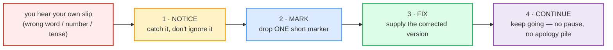

# Self-Correction Strategies

> **Phase 5 · capstone · bundle #87 · Days 173–174.**
> *"'Sorry, what I meant was…" — fix without freezing.*
>
> 🔗 This is a **capstone** bundle — it integrates everything before it. The fast
> self-repair moves here lean on
> [HANDLING BEING MISUNDERSTOOD](./HANDLING_MISUNDERSTOOD.md) (the full three-move
> repair *sequence* when a listener reacts wrong) and
> [FLUENCY FILLERS](../discourse/FLUENCY_FILLERS.md) (the "buying time" chunks
> that buy you the beat to find the fix), then add the fastest skill of all:
> catching **your own** slip and fixing it **in the same breath**. Where
> `handling_misunderstood` trains the slow, deliberate repair, this one trains
> the reflex.

---

## Why this is a capstone (read this first)

Every learner who has spoken English in a real conversation has heard their own
mistake *as it left their mouth* — the wrong word, the wrong number, the verb
tense that slipped. The instinct that decides whether the conversation stumbles
or flows is **not** grammar or vocabulary — it is **what you do in the next half
second**. Three failure responses are nearly universal among Vietnamese L1
learners; the fluent response is a learned, tiny reflex.

| The freeze | The over-apologize | **The self-repair** |
|---|---|---|
| You stop mid-sentence, blush, go silent, mentally replay the error, and the conversation stalls. | You pile on *"sorry, sorry, sorry, my English is bad"* — drawing attention to the slip and turning one word into a five-second event. | You drop **one** short marker (*"Sorry, what I meant was…"*), supply the fix, and **keep going** — often in under a second. |

The third column is what this bundle trains. It is not a sequence — it is a
**single reflex**: notice → mark → fix → continue, ideally without breaking
eye contact or the flow of the sentence.

> **The single fact that changes everything:** natives self-correct **constantly**.
> Schegloff, Jefferson & Sacks (1977) — the foundational study of repair in
> conversation — call self-correction the **preferred** organization of repair:
> speakers overwhelmingly fix their own slips rather than wait to be corrected,
> and they do it so smoothly the listener barely registers it. Self-correction is
> not a sign your English failed. It is a sign you speak English the way natives
> do. The goal of this bundle is to make the reflex **as quick and light as a
> native's**.

The **discipline at the heart of it**: **fix SMOOTHLY with one marker, then move
on.** Do **not** freeze. Do **not** over-apologize. One marker + the fix + the
next word. That single rhythm is what separates an intermediate who freezes from
a fluent speaker who sounds unbothered by their own slips.

---

## 1. The quick correction markers (the smooth, native move)  ⭐

These are the highest-frequency self-repair moves in native speech. Each is
**one short chunk** that buys you the beat to supply the corrected version. The
two **pinned** anchors (⭐) are the ones every learner should have on instant
recall.

> From `self_correction_corpus.md` (the pinned anchors ⭐ the corpus must contain
> verbatim):
>
> - ⭐ **Sorry, what I meant was…** — /ˈsɒri wɒt aɪ ment wɒz/ UK ·
>   /ˈsɑːri wɑːt aɪ ment wɑːz/ US — "let me give you the version I actually
>   intended." The smooth mid-sentence fix.
> - ⭐ **Or rather…** — /ɔː ˈrɑːðə/ UK · /ɔːr ˈræðər/ US — "to be more precise /
>   to correct that." A one-word pivot. **Cambridge Grammar attests it verbatim
>   for self-correction**: *"We use or rather to correct ourselves: He commanded
>   and I obeyed, or rather, I pretended to."*
> - **I mean…** — /aɪ miːn/ — "what I really mean is…" The lightest marker; a
>   native speech habit, not a confession.
> - **Actually, let me rephrase** — /ˈæktʃuəli let mi ˌriːˈfreɪz/ — "in fact,
>   let me say it in clearer words."
> - **To put it differently…** — /tə pʊt ɪt ˈdɪfrəntli/ UK · /tə pʊt ɪt
>   ˈdɪfərəntli/ US — "stated in other words."

**Why *Or rather* is the most native-sounding fix:** it is **short** (two
syllables), it presupposes the listener was already following, and it signals
"the next words are the precise version" without any apology at all. A learner
who reaches for *"Or rather, early June"* after *"I'm seeing him in May"* sounds
indistinguishable from a native. *"Sorry, sorry, I mean June, my mistake, sorry"*
sounds exactly like a learner who has not done this bundle.

---

## 2. The restart (when the sentence has gone off the rails)

Sometimes the slip is too tangled for a quick patch — you've said three wrong
words and back-tracking each one is messier than starting fresh. The native move
is a **clean restart**: one brief marker, then a fresh sentence. The discipline
is identical: **do not freeze, do not narrate the failure** (*"oh no, that was
all wrong, I'm so bad at this"*). Just re-enter.

> From `self_correction_corpus.md`:
>
> - **Wait, let me start over** — /weɪt let mi stɑːt ˈəʊvə/ UK · /weɪt let mi
>   stɑːrt ˈoʊvər/ US — "let me abandon that and begin again."
> - **Let me try that again** — /let mi traɪ ðæt əˈɡen/ — "let me have another
>   go at that."

**The *Wait* is the brake, not an apology.** Note that *Wait* here is not *"wait
for me, I'm slow"* — it is the native **self-interruption** particle, the verbal
equivalent of hitting the reset button mid-thought. You say it crisply and move
straight into the restart. No *"sorry, my brain stopped, haha, anyway…"*.

---

## 3. Acknowledge a slip (own the mistake, lightly)

When the slip is a **fact or word error** — the wrong number, the wrong name, the
wrong date — the native move is to **name it briefly** and substitute the
correct version. This is not a confession of incompetence; it is the normal
rhythm of speech. *"Sorry, I misspoke — it was Tuesday, not Wednesday"* is what
native speakers, including senior executives and news anchors, say daily.

> From `self_correction_corpus.md`:
>
> - **Sorry, I misspoke** — /ˈsɒri aɪ ˌmɪsˈspəʊk/ UK · /ˈsɑːri aɪ ˌmɪsˈspoʊk/
>   US — "apologies — that was the wrong word/fact."
> - **Well, more accurately…** — /wel mɔː ˈækjərətli/ UK · /wel mɔːr ˈækjɚətli/
>   US — "to state it more precisely…"

**One acknowledgement, then the fix — never a stack.** The cardinal error is the
**apology pile**: *"Sorry. Sorry, I'm sorry. My English is bad. Sorry."* Each
extra *sorry* makes the slip bigger and the silence longer. The native norm is
exactly **one** acknowledgement word (*Sorry* / *Well* / *Actually*) and then
the corrected content. 🔗 See [APOLOGIZING](../speech_acts/APOLOGIZING.md) for the
register difference between a quick *"sorry"* repair and a real apology.

---

## 4. The reflex in one breath

The capstone goal is to run **notice → mark → fix → continue** in a single,
unbroken flow — under a second, without freezing. The role-play in
[`self_correction.html`](./self_correction.html) drills exactly this arc as it
occurs in real native speech:

| Slip | Marker | Fix | Continue |
|---|---|---|---|
| "…by Friday…" (wrong date) | *"Wait,"* | *"let me start over — the draft is Friday, the final is next Wednesday."* | (keep talking) |
| "…the marketing team…" (wrong team) | *"Sorry, what I meant was…"* | "…design does the layout." | (keep talking) |
| "…in May…" (wrong month) | *"Or rather…"* | "early June." | (keep talking) |
| "…four hundred…" (wrong number) | *"Well, more accurately…"* | "four-twenty." | (keep talking) |

The whole point: the listener should not have time to register that anything went
wrong. That is what "fix without freezing" means.

---

## 5. Cheat sheet — the ≤8 survival chunks

The Pareto set. These eight let you run the whole self-repair reflex. (Every row
is a corpus attestation above.)

| # | Chunk | IPA | Move |
|---|---|---|---|
| 1 | **Sorry, what I meant was…** ⭐ | /ˈsɒri wɒt aɪ ment wɒz/ | quick fix |
| 2 | **Or rather…** ⭐ | /ɔː ˈrɑːðə/ UK · /ɔːr ˈræðər/ US | quick fix |
| 3 | **I mean…** | /aɪ miːn/ | quick fix |
| 4 | **Actually, let me rephrase** | /ˈæktʃuəli let mi ˌriːˈfreɪz/ | quick fix |
| 5 | **To put it differently…** | /tə pʊt ɪt ˈdɪfrəntli/ | quick fix |
| 6 | **Wait, let me start over** | /weɪt let mi stɑːt ˈəʊvə/ | restart |
| 7 | **Sorry, I misspoke** | /ˈsɒri aɪ ˌmɪsˈspəʊk/ | acknowledge slip |
| 8 | **Well, more accurately…** | /wel mɔː ˈækjərətli/ | acknowledge slip |

> Open [`self_correction.html`](./self_correction.html) to drill these as flip
> cards, hear native clips, play the role-play, shadow, and write.

---

## 6. Vietnamese → English L1 pitfalls table

The "expert payoff." These are the specific interference traps a Vietnamese
speaker hits when **self-correcting** — extend, don't replace, the seed rows
from the spec.

| Vietnamese trap (what you do) | English fix (what to do instead) |
|---|---|
| **Perfectionism / fear-of-error (sợ sai)** → on noticing your own slip you **FREEZE**, go silent, mentally translate the fix, and the conversation stalls. | Self-correction is **normal native behavior**, not failure (Schegloff et al. 1977). Catch → drop **one** marker (*"Sorry, what I meant was…"*) → fix → keep going. Aim for under a second. |
| **Over-apologize** — *"sorry, sorry, sorry, my English is bad"* — stacking three or four *sorry*s, which turns one wrong word into a five-second event and signals low confidence. | **Exactly one** acknowledgement word, then the fix. *"Sorry, I misspoke — Tuesday, not Wednesday."* The apology pile is the error; the slip is not. 🔗 [APOLOGIZING](../speech_acts/APOLOGIZING.md). |
| **Switches to Vietnamese or gives up** ("ôi nói sai rồi, thôi để sau") the moment a slip happens, breaking the English flow entirely. | Stay in English and finish the **notice → mark → fix → continue** cycle in one breath. The flow *is* fluency; breaking out of it is what actually costs you. |
| **Doesn't realize natives self-correct constantly** → treats every slip as evidence of a broken English, so each one chips away at confidence. | Watch any native interview or meeting: slips + self-repairs happen every few sentences. *"I mean…"*, *"or rather…"*, *"actually…"* are native habits, not learner crutches. Reach for *Or rather…* — it sounds fully native. |
| **Drops final consonants on the FIX** so the corrected version is misunderstood *again* — *"men"* for *meant*, *"ova"* for *over*, *"spok"* for *spoke*. | Re-release every final on the corrected word: *meant* /ment/, *over* /ˈəʊvə/, *misspoke* /ˌmɪsˈspəʊk/. A fix that's mumbled at the end just starts the loop over. 🔗 [FINAL CONSONANTS](../pronunciation/FINAL_CONSONANTS.md). |
| **No stress on the marker** → *"or rather"* comes out flat /ɔː ˈrɑːðə/ with no peak, so the listener misses the correction signal entirely. | Stress the marker's **content word** (*RAther*, *MEANT*, *start OVer*) and keep the grammar glue weak (*let me* → /lemi/, *to* → /tə/). The peak tells the listener "here comes the fix." 🔗 [SENTENCE STRESS](../pronunciation/SENTENCE_STRESS.md). |
| **Narrates the failure instead of fixing it** — *"oh no, that's wrong, I said it wrong, my brain stopped, haha…"* — which is longer than the slip itself. | Skip the narration. The native norm is **marker + fix**, full stop. *"Wait, let me start over — "* then the fresh sentence. No commentary on the error. |
| **PANIC-restarts the whole answer from zero** when only one word was wrong, wasting the good part of the sentence. | Use a **targeted fix** (*"what I meant was…"*, *"or rather…"*) for a single slip; reserve the **full restart** (*"let me start over"*) for when the sentence is genuinely tangled. Match the repair size to the slip size. 🔗 [HANDLING BEING MISUNDERSTOOD](./HANDLING_MISUNDERSTOOD.md). |

---

## How to practise this bundle (the daily 20 min)

1. **READ** (5 min) — this guide, §1–§4.
2. **SHADOW** (7 min) — open `self_correction.html`, drill the 8 flip cards +
   the role-play **aloud**, running the full notice → mark → fix → continue arc
   in a single breath. Exaggerate the one-marker discipline: one *sorry*/*or
   rather*/*wait*, then straight into the fix.
3. **PRODUCE** (8 min) — the writing task: take a sentence with a slip (the
   player gives you one) and write a smooth self-repair sequence — one marker +
   the corrected version. Read it aloud, recording yourself; check there is
   exactly **one** acknowledgement and that the fix follows immediately.

---

## Sources

- Cambridge Advanced Learner's Dictionary — https://dictionary.cambridge.org/dictionary/english/{word} (entries for *mean/meant, actually, rather, try, start/start over, over, different/differently, accurate, misspeak*); the Cambridge grammar page https://dictionary.cambridge.org/us/grammar/british-grammar/rather — the **"Or rather"** subsection attests it verbatim for self-correction (*"We use or rather to correct ourselves"*).
- Cambridge entry for *actually* https://dictionary.cambridge.org/dictionary/english/actually — sense "SAYING NO" attests it as a correction marker (*"Actually, Gavin, it was Tuesday of last week, not Wednesday."*); IPA UK/US /ˈæk.tʃu.ə.li/.
- Cambridge entry for *accurate* https://dictionary.cambridge.org/dictionary/english/accurate — UK /ˈæk.jə.rət/, US /ˈæk.jɚ.ət/ → adverb *accurately*.
- Cambridge entry for *misspeak* https://dictionary.cambridge.org/dictionary/english/misspeak — UK/US /ˌmɪsˈspiːk/, past *misspoke* /ˌmɪsˈspəʊk/–/ˌmɪsˈspoʊk/.
- Cambridge entry for *start over* https://dictionary.cambridge.org/dictionary/english/start-over — "to begin to do something again from the beginning."
- Oxford Advanced Learner's Dictionary — https://www.oxfordlearnersdictionaries.com/definition/english/misspeak (misspeak /ˌmɪsˈspiːk/); https://www.oxfordlearnersdictionaries.com/definition/english/rephrase (rephrase /ˌriːˈfreɪz/).
- Collins English Dictionary — https://www.collinsdictionary.com/dictionary/english/rephrase (rephrase /riːˈfreɪz/); https://www.collinsdictionary.com/us/dictionary/english/misspeak (misspeak /ˌmɪsˈspiːk/).
- Britannica Dictionary (audio) — rephrase /riˈfreɪz/.
- Schegloff, E. A., Jefferson, G., & Sacks, H. (1977). "The Preference for Self-Correction in the Organization of Repair in Conversation." *Language*, 53(2), 361–382 — self-repair is the preferred organization of repair — https://www.cambridge.org/core/journals/language/article/preference-for-selfcorrection-in-the-organization-of-repair-in-conversation/5549B861FDE7180B75FA5C382821875E (PDF mirror: https://icar.cnrs.fr/ecole_thematique/tranal_i/documents/org_seq/scheSacksJeff77_repair.pdf).
- Levelt, W. J. M. (1989). *Speaking: From Intention to Articulation*. MIT Press — the psycholinguistic self-repair model; attests *I mean*, *or rather* as self-repair markers.
- Swan, M. *Oxford English Grammar Course — Advanced* (OUP), "gambits" chapter — attests **"Or rather…"** as a self-repair/rephrasing gambit (mirrored at https://www.seaproti.org/wp-content/uploads/2025/09/Oxford-English-grammar-course-Advanced.pdf).
- University of Babylon humanities ref (gambits list) — attests **"Or rather…"** + **"To put it differently…"** as correction gambits — https://www.uobabylon.edu.iq/publications/humanities_edition19/humanities_ed19_1.doc
- Keller, E. "Gambits in a New Light" (ResearchGate) — https://www.researchgate.net/publication/269793500
- "How to Recover and Keep Going After Making a Mistake" (English with Kim) — attests *"Sorry, what I meant was…"*, *"Let me try that again"*, *"Let me start over"* — https://englishwithkim.com/recover-keep-going-mistakes/
- Native audio: YouGlish — https://youglish.com/pronounce/{url-encoded chunk}/english/us? (phrase URLs verified HTTP 200 on 2026-06-24).
- Frequency methodology: wordfrequency.info (spoken sub-corpus) — https://www.wordfrequency.info/
