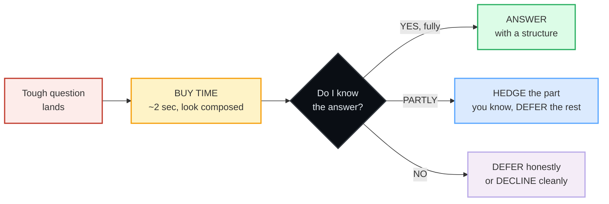

# Speaking Under Pressure

> **Phase 5 · capstone · bundle #85 · Days 169–170.**
> *Composure under tough questions / interviews.*
>
> 🔗 This is a **capstone** bundle — it stress-tests the whole chain under load.
> It leans on [HANDLING Q&A](../workplace/HANDLING_QUESTIONS.md) (the defer arc:
> *"Let me come back to that"*), [FLUENCY FILLERS](../discourse/FLUENCY_FILLERS.md)
> (the buy-time openers: *"Let me think"*), and [IMPROMPTU TALKS](./IMPROMPTU_TALKS.md)
> (the PREP structure). This bundle adds the one layer those don't: **what to do
> when you genuinely don't know the answer — honestly, under pressure.**

---

## Why this bundle exists (read this first)

Every bundle before this one assumed you *have* the answer and just need to shape
it. An interview does not play by that rule. The interviewer will ask you for a
number you don't have, a prediction you can't make, or a topic you've never
touched — on purpose, to see what you do under load. **What you do in those 2
seconds is what they are actually scoring.**

The Vietnamese L1 instinct under that pressure is the **face-saving trap**:
*thể diện* (face) says *never look incompetent*, so the body does one of two
things — **freeze** (silence, panic, a blank stare) or **bluff** (blurt a guessed
answer and pray). Both read as weakness in English. The English-speaking
professional norm inverts both: a **composed, honest deferral** is read as
*confident and trustworthy*, not weak. That paradox — *composed honesty beats a
panicked bluff* — is the entire point of this bundle.

This single reframe — **buy time calmly, then defer honestly** — does more for
your interview performance than any amount of memorised answers, because it is
the move that handles the question you *didn't* prepare for.

---

## 1. The composure arc: the 4-step reflex under a tough question

When a hard question lands, fluent speakers run a fixed arc — they never improvise
from a blank. The arc has four beats, and you can rehearse all four in advance:

The buy-time beat is **non-negotiable** — it is the move that separates the
composed speaker from the panicked one. The American Psychological Association's
composure guidance names the mechanism: a slow breath "destresses your brain,
calms it down and brings you back to a state of logical thinking." A 2-second
pause + a buy-time opener does not look like ignorance; it looks like thought.

---

## 2. Buy time calmly (the openers that buy ~2 seconds)

The reflex: **do not freeze and do not blurt.** Drop a buy-time opener that
buys planning time while signalling "I am composing an answer, not panicking."

> From `speaking_under_pressure_corpus.md`:
>
> - **That's a fair question** /ˌðæts ə ˈfeə ˈkwestʃən/ UK · /ˌðæts ə ˈfer ˈkwestʃən/ US
>   — validates the question as reasonable; a composed stall.
> - **Let me take a moment** /ˌlet mi ˈteɪk ə ˈməʊmənt/ UK · /ˌlet mi ˈteɪk ə ˈmoʊmənt/ US
>   — asks for a second to compose the answer; signals control.
> - **Give me a second to think** /ˌɡɪv mi ə ˈsekənd tə ˈθɪŋk/ — informal buy-time.

> *fair* (B1, "treating someone in a way that is right or reasonable") attests the
> collocate — Cambridge prints *"a fair (= reasonable) deal"*, *"fair comment"*.
> The *"Let me…"* frame is the same construction Cambridge attests in *let me
> see* / *let me think*. 🔗 See [FLUENCY FILLERS](../discourse/FLUENCY_FILLERS.md)
> for the full buying-time set; here you deploy them **under load**.

**The Vietnamese trap:** silence feels like failure, so learners either fill the
gap with *"uhm… uhm…"* or rush a guessed answer. A clean *"That's a fair
question. Let me take a moment."* fills the silence **deliberately** — it sounds
composed, not ignorant.

---

## 3. Handle not-knowing honestly (the paradox: honesty is strength)

This is the layer this capstone adds to the chain. When you genuinely don't have
the answer, **the bluff is the trap**. A guessed number you get wrong is far
worse than an honest "I don't have that figure, but here's how I'd find it." The
fluent move is **composed deferral**: name the limit of what you know, then
promise the verified answer.

> From `speaking_under_pressure_corpus.md`:
>
> - **I don't have the exact figure, but…** /aɪ ˌdəʊnt həv ði ɪɡˈzækt ˈfɪɡə, bʌt/ UK
>   · /aɪ ˌdoʊnt həv ði ɪɡˈzækt ˈfɪɡjər, bʌt/ US — honest partial-answer: name the
>   gap, then give what you *do* know.
> - **I'd need to verify that** /aɪd ˈniːd tə ˈverɪfaɪ ðæt/ UK · /aɪd ˈniːd tə ˈverəfaɪ ðæt/ US
>   — honest full-deferral: you will not guess; you will check.
> - **I want to make sure I give you an accurate answer** — frames the deferral as
>   care for accuracy, not ignorance.

> Cambridge confirms every word: *figure* = "the symbol for a number", *verify* =
> "to make certain that something is correct", *accurate* = "correct, exact, and
> without any mistakes." The "admit the gap, then defer" move is the taught
> response in interview references: say what you don't know, then explain how
> you'd find it.

**The Vietnamese trap:** *"Tôi không biết"* said bluntly, or a faked number.
Both cost you. The fix is the *"…, but"* pivot — *"I don't have the exact
figure, but"* lets you give the **shape** of the answer (a range, a method, a
next step) without inventing the number. That shape is what they're actually
testing.

---

## 4. Defer / redirect (park it, or hand off cleanly)

When the question is genuinely unanswerable now — speculation, or outside your
knowledge — **redirect with composure**: park it for later, decline to guess, or
name the boundary of your expertise and pivot to what you *can* offer.

> From `speaking_under_pressure_corpus.md`:
>
> - **Let me come back to that** /ˌlet mi ˌkʌm ˈbæk tə ðæt/ — parks the question
>   for later in the session. 🔗 Attested in [HANDLING Q&A](../workplace/HANDLING_QUESTIONS.md).
> - **I'd rather not speculate** /aɪd ˈrɑːðə nɒt ˈspekjəleɪt/ UK · /aɪd ˈræðər nɑːt ˈspekjəleɪt/ US
>   — declines to guess. Cambridge's own *speculate* example is *"A spokesperson
>   declined to speculate on the cause of the train crash."* — exactly this move.
> - **That's outside my area, but…** /ˌðæts ˌaʊtˈsaɪd maɪ ˈeəriə, bʌt/ UK · /ˌðæts ˌaʊtˈsaɪd maɪ ˈeriə, bʌt/ US
>   — names the boundary, then pivots.

> The *"…, but"* on the end of a boundary statement is what saves it from sounding
> evasive. *"That's outside my area"* alone sounds like a brush-off; *"That's
> outside my area, but I'm a fast learner"* turns it into a strength.

---

## 5. The composure techniques (slow down, breathe, use a structure, don't blurt)

The chunks above only work if your **body** is composed. Under stress the
Vietnamese learner's pronunciation collapses (finals get dropped, sentences run
together) and the answer comes out as one rushed, unstructured blob. Four
techniques hold it together:

| Technique | What it does | The chunk that buys it |
|---|---|---|
| **Slow down** | A slower pace keeps finals audible and sentences intact under load | *"Let me take a moment"* |
| **Breathe** (APA: "deep belly breathing") | Resets the brain to logical thinking before you speak | the 2-second pause before the opener |
| **Use a structure** | Buy-time → give what you know → defer the rest (the §1 arc) | *"First…, and I'd need to verify…"* |
| **Don't blurt** | A composed 2-second pause beats a panicked guess | *"That's a fair question…"* |

🔗 Slow-down under stress is a **final-consonant** problem — see
[FINAL CONSONANTS](../pronunciation/FINAL_CONSONANTS.md). Nerves make you drop
the endings you drilled in Phase 0; the fix is to consciously slow the first
sentence after a tough question.

---

## 6. Cheat sheet — the ≤8 survival chunks

The Pareto set. Drill these eight until the reflex is automatic: a tough question
lands → you reach for one of these instead of freezing or guessing. (Every row is
a corpus attestation above.)

| # | Chunk | IPA | Why it's here |
|---|---|---|---|
| 1 | **That's a fair question** | /ˌðæts ə ˈfeə ˈkwestʃən/ UK · /ˌðæts ə ˈfer ˈkwestʃən/ US | the composed stall — buy ~2 sec, look thoughtful |
| 2 | **Let me take a moment** | /ˌlet mi ˈteɪk ə ˈməʊmənt/ UK · /ˌlet mi ˈteɪk ə ˈmoʊmənt/ US | asks for a second; signals control, not ignorance |
| 3 | **Give me a second to think** | /ˌɡɪv mi ə ˈsekənd tə ˈθɪŋk/ | informal buy-time under load |
| 4 | **I don't have the exact figure, but…** | /aɪ ˌdəʊnt həv ði ɪɡˈzækt ˈfɪɡə, bʌt/ UK · /aɪ ˌdoʊnt həv ði ɪɡˈzækt ˈfɪɡjər, bʌt/ US | honest partial-answer — name the gap, pivot to what you know |
| 5 | **I'd need to verify that** | /aɪd ˈniːd tə ˈverɪfaɪ ðæt/ UK · /aɪd ˈniːd tə ˈverəfaɪ ðæt/ US | honest full-deferral — I'll check, not guess |
| 6 | **Let me come back to that** | /ˌlet mi ˌkʌm ˈbæk tə ðæt/ | park it for later (🔗 Handling Q&A) |
| 7 | **I'd rather not speculate** | /aɪd ˈrɑːðə nɒt ˈspekjəleɪt/ UK · /aɪd ˈræðər nɑːt ˈspekjəleɪt/ US | decline to guess — Cambridge attests the exact move |
| 8 | **That's outside my area, but…** | /ˌðæts ˌaʊtˈsaɪd maɪ ˈeəriə, bʌt/ UK · /ˌðæts ˌaʊtˈsaɪd maɪ ˈeriə, bʌt/ US | name the boundary, then pivot |

> Open [`speaking_under_pressure.html`](./speaking_under_pressure.html) to drill
> these as flip cards, play the high-pressure interview role-play, shadow, and
> write a composed deferral.

---

## 7. Vietnamese → English L1 pitfalls table

The "expert payoff." These are the specific interference traps a Vietnamese
speaker hits when a tough question lands — the face-saving instinct is the root
cause of nearly all of them. Extend, don't replace, the seed rows from the spec.

| Vietnamese trap (what you do) | English fix (what to do instead) |
|---|---|
| **Face-saving → PANIC or freeze** under a tough question (fear of looking incompetent / mất thể diện) | Run the §1 arc: a 2-second pause + *"That's a fair question"* looks **composed**, not ignorant. Silence with a filler beat is strength, not weakness. |
| **Bluffs a guessed answer** to avoid admitting "I don't know" (the risky move — caught out = credibility gone) | **Honest deferral:** *"I don't have the exact figure, but…"* / *"I'd need to verify that."* Composed honesty beats a panicked bluff — it reads as trustworthy, not weak. |
| **"Tôi không biết" translated bluntly → "I don't know"** (sounds abrupt / dismissive / like giving up) | Soften into a deferral: never the bare *"I don't know"* — always *"I don't have the exact figure, but…"* or *"Let me come back to that."* |
| **Fills silence with *"uhm… uhm…"*** or a rushed, unstructured answer because silence feels like failure | Fill it **deliberately**: *"Let me take a moment"* / *"Give me a second to think."* A named pause is composed; an *"uhm"* trail is panic. |
| **Over-apologises → "I'm so sorry, I don't know"** (apology leaks weakness; you did nothing wrong) | Defer **confidently**, no apology: *"I'd need to verify that"* / *"Let me come back to that."* Not knowing is normal; apologising for it is not. |
| **Answer in one rushed, unstructured sentence** under load (no signpost, runs together) | **Use a structure:** buy-time → give what you know → defer the rest. *"That's a fair question. I don't have the exact figure, but I can tell you…"* |
| **Pronunciation collapses under stress** — finals dropped, sentences blurred (nerves undo Phase 0 drills) | **Slow down** the first sentence after a tough question. Breathe. Consciously release every final consonant — see 🔗 [FINAL CONSONANTS](../pronunciation/FINAL_CONSONANTS.md). |
| **Avoids the boundary statement** ("That's outside my area") because naming a limit feels like failure | Name the limit, then pivot: *"That's outside my area, but I'm a fast learner."* The *"…, but"* turns the boundary into a strength. |

---

## How to practise this bundle (the daily 20 min)

1. **READ** (5 min) — this guide, §1–§5.
2. **SHADOW** (7 min) — open `speaking_under_pressure.html`, drill the 8 flip
   cards **aloud**, then play the interview role-play (be the candidate — the
   interviewer's lines hide). Say each deferral with a **2-second composed
   pause** before it.
3. **PRODUCE** (8 min) — the writing task: write a composed deferral to a tough
   question you can't answer (buy time + honest deferral). Read it aloud,
   recording yourself; check the pause is there and the finals are audible.

---

## Sources

- Cambridge Advanced Learner's Dictionary —
  https://dictionary.cambridge.org/dictionary/english/{word}
  (entries for *fair_1, question, moment, take, second_1, think, give, figure,
  exact, verify, accurate, answer, come-back, speculate, area, outside, rather,
  need, sure*)
  - *fair* UK /feər/ US /fer/ (B1, attests *"fair question / fair comment"*):
    https://dictionary.cambridge.org/dictionary/english/fair_1
  - *figure* (number symbol): https://dictionary.cambridge.org/dictionary/english/figure
  - *verify* UK /ˈverɪfaɪ/ US /ˈverəfaɪ/ (C1): https://dictionary.cambridge.org/dictionary/english/verify
  - *accurate* UK /ˈækjərət/ US /ˈækjərət/ (B1): https://dictionary.cambridge.org/dictionary/english/accurate
  - *speculate* UK /ˈspekjəleɪt/ US /ˈspekjəleɪt/ (C2; example *"declined to
    speculate on the cause of the train crash"*):
    https://dictionary.cambridge.org/dictionary/english/speculate
  - *come back* (phrasal verb): https://dictionary.cambridge.org/dictionary/english/come-back
  - *area*: https://dictionary.cambridge.org/dictionary/english/area
- American Psychological Association, "Maintaining composure during interviews"
  (composure technique: deep belly breathing → "calm it down and come back to a
  state of logical thinking"):
  https://www.apa.org/education-career/job-search/maintain-composure-interviews
- Yardstick, "Behavioral Interview Questions for Composure":
  https://yardstick.team/interview-questions/composure
- Sibling bundles (cross-referenced): `workplace/handling_questions_corpus.md`
  (the defer arc), `discourse/fluency_fillers_corpus.md` (buy-time openers),
  `capstone/impromptu_talks_corpus.md` (the PREP structure).
- Vietnamese L1 pragmatics: face-saving (*thể diện*) as the default driver of
  bluffing / freezing under pressure (see
  `workplace/handling_questions_corpus.md` "L1 pragmatics").
- Native audio: YouGlish — https://youglish.com/pronounce/{chunk}/english/us?
- Frequency methodology: wordfrequency.info (spoken sub-corpus) —
  https://www.wordfrequency.info/
