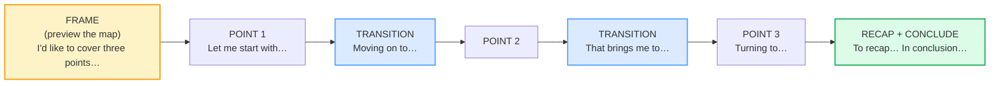

# Sustained 5-Min Monologue

> **Phase 5 · capstone · bundle #88 · Days 175–176.**
> *Coherence, signposting, stamina.*
>
> 🔗 This is the **stamina capstone** — it stretches everything you have built
> from a single turn or a 60-second answer into a **sustained 5-minute talk**. It
> leans directly on:
> [SHORT PRESENTATIONS](../workplace/SHORT_PRESENTATIONS.md) (the *"First…,
> next…, finally…"* signposting family), [STORYTELLING STRUCTURES](../discourse/STORYTELLING_STRUCTURE.md)
> (the narrative arc you can borrow for stamina), and
> [THOUGHT GROUPS](../pronunciation/THOUGHT_GROUPS.md) (the pausing / chunking
> that is the delivery layer under every signpost). It extends
> [IMPROMPTU TALKS](./IMPROMPTU_TALKS.md) from 60 seconds to 5 minutes — same
> skeleton, added **stamina**.

---

## Why this bundle exists (read this first)

A 60-second impromptu answer (bundle #81) is one skeleton deployed once. A
**sustained 5-minute monologue** is the same skeleton deployed **three times in a
row without losing the thread** — and that is where most Vietnamese learners
collapse. The failure mode is never "I don't know the words." It is one of three
stamina failures:

1. **Ramble** — points bleed into each other with no *"Moving on to…"*, so after
   90 seconds neither the speaker nor the listener knows which point they are on.
2. **Run dry** — the speaker front-loads everything into point 1 and has nothing
   left for points 2 and 3, so the talk dies at the two-minute mark.
3. **Speed up** — panic about time left compresses the delivery, finals get
   dropped, thought groups vanish, and intelligibility collapses exactly when the
   listener most needs the signposts.

The fix is not "be more confident." The fix is **explicit signposting the listener
can follow, plus pacing and pausing you control on purpose.** That is this bundle.

---

## 1. The three layers of a sustained monologue

A coherent 5-minute talk is three layers stacked — and the **signposting is the
load-bearing layer**, because the listener cannot see your paragraph breaks:

- **Frame** — the first 20 seconds. You give the listener the *map*: *"I'd like
  to cover three points…"* Once the audience has the shape, every later point
  slots into a pre-announced slot instead of arriving as a surprise.
- **Signpost transitions** — between every point. This is where Vietnamese
  learners fail most: they jump points with no bridge, so the listener loses the
  thread. *"Moving on to…"* / *"That brings me to…"* / *"Turning to…"* are the
  audible bridges.
- **Recap + conclude** — the last 30 seconds. *"To recap…"* restates the three
  points so they stick; *"In conclusion…"* lands the takeaway.

🔗 This is the **grown-up version** of [SHORT PRESENTATIONS](../workplace/SHORT_PRESENTATIONS.md)
signposting: the same *"First…, next…, finally…"* family, but held for five
minutes instead of two. And it is the **stamina version** of [IMPROMPTU TALKS](./IMPROMPTU_TALKS.md):
the PREP/PEEL skeleton, repeated three times under load.

---

## 2. Layer 1 — frame the talk (give the map)

The framing move previews the structure in the first 20 seconds. EAP Foundation
(*Language for presentations*) names this the "give the structure" function;
VirtualSpeech (*Speech transitions*) calls it the "presentation outline." Do it
and the listener can follow; skip it and every later point lands as a surprise.

> From `sustained_monologue_corpus.md`:
>
> | chunk | what it does |
> |---|---|
> | **I'd like to cover three points…** | /aɪd ˈlaɪk tə ˈkʌvər θriː ˈpɔɪnts/ — previews the 3-point map. Oxford, *cover*: *"to include something; to deal with something" — The lectures covered a lot of ground."* |
> | **Today I'll walk you through…** | /təˈdeɪ aɪl ˈwɔːk juː θruː/ — promises a guided sequence. Cambridge, *walk through*: "to slowly and carefully explain or show someone how to do something." |
> | **I'll break this into three parts** | /aɪl ˈbreɪk ðɪs ˈɪntuː θriː ˈpɑːrts/ — announces the skeleton. EAP Foundation: *"This talk is divided into four main parts."* |

> **The Vietnamese trap:** Vietnamese learners often **skip the frame entirely**
> and dive into point 1, because Vietnamese discourse does not front-load a
> roadmap the same way. The listener then cannot tell where they are in the talk.
> The fix: always preview the shape first — *"I'd like to cover three points…"*

---

## 3. Layer 2 — signpost transitions (the audible spine)

This is the load-bearing layer. The listener **cannot see paragraph breaks** in
speech, so the speaker must *announce* every transition. Newcastle University
Academic Skills Kit (*Signposting*) puts *"Moving on to…"* and *"Turning now
to…"* under "Transitioning between points" — *"Helps readers identify where they
are in the writing's overall structure."* EAP Foundation gives *"This leads/
brings me to my next point, which is…"*

> From `sustained_monologue_corpus.md`:
>
> - **Let me start with…** /ˌlet mi ˈstɑːrt wɪð/ — launches point 1.
> - **Moving on to…** /ˈmuːvɪŋ ˈɑːn tuː/ — shifts to the next section. Newcastle:
>   *"Moving on to…"*
> - **That brings me to…** /ˌðæt ˈbrɪŋz miː tuː/ — chains from the previous
>   point. EAP Foundation: *"This leads/brings me to my next point."*
> - **Turning to…** /ˈtɜːrnɪŋ tuː/ — pivots to a new sub-topic. Newcastle:
>   *"Turning now to…"*

> **The Vietnamese trap:** learners **jump between points with no transition** —
> point 1 ends and point 2 begins with no bridge, so the listener loses the
> thread after 90 seconds. The fix: rehearse one transition per gap. Every time
> you finish a point, your mouth fires a *"Moving on to…"* before the next point
> starts. That single habit is the difference between a coherent talk and a
> ramble.

🔗 This extends [SHORT PRESENTATIONS](../workplace/SHORT_PRESENTATIONS.md)
(*"First…, next…, finally…"*) from the short-talk setting into the sustained one.

---

## 4. Layer 3 — recap + conclude (close the loop)

A 5-minute talk that trails off into *"…so, yeah"* sounds unfinished and
unmemorable. The **recap** restates the points so they stick; the **conclusion**
lands the takeaway. Oxford, *recap* /ˈriːkæp/, prints *"Let me just recap the main
points."* Oxford, *conclusion*, glosses *"In conclusion (= finally), I would like
to thank…"*

> From `sustained_monologue_corpus.md`:
>
> - **To recap…** /tə ˈriːkæp/ — restates the points covered. Oxford, *recap*:
>   *"Let me just recap the main points."*
> - **So to summarize…** /ˌsoʊ tə ˈsʌməraɪz/ — packages the takeaway. Oxford,
>   *summarize*: *"To summarize, the main conclusions are as follows…"*
> - **In conclusion…** /ɪn kənˈkluːʒn/ — signals the final statement. Oxford,
>   *conclusion*: *"In conclusion, I would like to thank you all for your hard
>   work."*
> - **That covers everything I wanted to say** — the explicit close that marks
>   the talk finished (built on *cover* = "to include/deal with").

---

## 5. Stamina technique — pacing, pausing, and the back-reference

Holding a talk for five minutes is a **physical** skill as much as a verbal one.
Three stamina techniques keep the thread alive:

1. **Explicit signposting** (§§2–4) — the framework above. The skeleton does the
   memory work for you: you never "run out of things to say" because the next
   signpost tells you what comes next.
2. **Pacing — do not speed up.** Panic about time compresses delivery, drops
   finals, and collapses intelligibility. A calm pace with audible finals
   signals control. 🔗 [THOUGHT GROUPS](../pronunciation/THOUGHT_GROUPS.md).
3. **Pausing in thought groups.** Pause *between* points (after each signpost),
   never *inside* a chunk. The pause is where you breathe and plan the next
   point — and the listener uses it to process. A signpost + a beat of silence
   is more coherent than a fast, breathless run-on.

The **back-reference** is a fourth stamina weapon: *"As I mentioned earlier…"*
lets you reuse material you already said — buying cognitive recovery time and
binding the talk together. Newcastle, *Signposting*, lists *"As indicated
earlier,…"* under "Referring backward."

> From `sustained_monologue_corpus.md`:
>
> - **As I mentioned earlier…** /əz aɪ ˈmenʃnd ˈɜːrliər/ — links back to an
>   earlier point; buys recovery time and binds the talk.

---

## 6. A worked 5-minute monologue (frame → 3 points → recap → conclude)

Here is the full skeleton on a sample topic — *"How to give effective feedback"* —
so you can see all the moves chained. Every signpost is a corpus row above.

> From `sustained_monologue_corpus.md`:
>
> - **Frame:** *I'd like to cover three points — why feedback matters, how to
>   structure it, and what to avoid.*
> - **Point 1:** *Let me start with why it matters. Feedback is the cheapest way
>   to improve performance…*
> - **Transition:** *Moving on to how to structure it. The SBI model —
>   Situation, Behaviour, Impact — works because…*
> - **Point 2 → 3:** *That brings me to what to avoid. Turning to common
>   mistakes, the biggest one is vague criticism. As I mentioned earlier,
>   specificity is what makes feedback stick.*
> - **Recap + conclude:** *To recap: feedback matters, structure it with SBI,
>   and avoid vagueness. In conclusion, good feedback is specific, timely, and
>   kind. That covers everything I wanted to say.*

Read aloud at a calm pace with a beat after each signpost, that is ~5 minutes —
fully structured, no rambling, no running dry, no speeding up.

---

## 7. Cheat sheet — the ≤8 survival chunks

The Pareto set. Drill these eight until the frame → signpost → recap → conclude
arc fires automatically and you can hold it for five minutes without losing the
thread. (Every row is a corpus attestation above.)

| # | Chunk | IPA | Why it's here |
|---|---|---|---|
| 1 | **I'd like to cover three points…** | /aɪd ˈlaɪk tə ˈkʌvər θriː ˈpɔɪnts/ | frame — preview the 3-point map (Oxford *cover*) |
| 2 | **Let me start with…** | /ˌlet mi ˈstɑːrt wɪð/ | signpost — launches point 1 |
| 3 | **Moving on to…** | /ˈmuːvɪŋ ˈɑːn tuː/ | signpost — shift to next section (Newcastle) |
| 4 | **That brings me to…** | /ˌðæt ˈbrɪŋz miː tuː/ | signpost — chain from prev point (EAP) |
| 5 | **As I mentioned earlier…** | /əz aɪ ˈmenʃnd ˈɜːrliər/ | stamina — back-reference (Newcastle) |
| 6 | **To recap…** | /tə ˈriːkæp/ | recap — restate the points (Oxford) |
| 7 | **So to summarize…** | /ˌsoʊ tə ˈsʌməraɪz/ | conclude — package the takeaway (Oxford) |
| 8 | **In conclusion…** | /ɪn kənˈkluːʒn/ | conclude — signal the final statement (Oxford) |

> Open [`sustained_monologue.html`](./sustained_monologue.html) to drill these as
> flip cards, hear native clips, play the monologue role-play, shadow, and write
> your own signposted talk outline.

---

## 8. Vietnamese → English L1 pitfalls table

The "expert payoff." These are the specific interference traps a Vietnamese
speaker hits in a sustained monologue — extend, don't replace, the seed rows
from the spec.

| Vietnamese trap (what you do) | English fix (what to do instead) |
|---|---|
| **Skips the frame entirely** — dives into point 1 with no *"I'd like to cover three points…"*, because Vietnamese discourse does not front-load a roadmap | Always **preview the map first**: *"I'd like to cover three points…"* The frame is 20 seconds that saves the listener for 5 minutes. |
| **Jumps between points with no transition** — point 1 ends and point 2 begins with no bridge; the listener loses the thread after 90 seconds | Fire a **signpost before every point**: *"Moving on to…" / That brings me to…" / Turning to…"*. Rehearse one transition per gap until automatic. 🔗 [SHORT PRESENTATIONS](../workplace/SHORT_PRESENTATIONS.md) |
| **Rambles and runs dry** — front-loads everything into point 1, has nothing left for points 2–3, so the talk dies at 2 minutes | **Budget one idea per point.** The frame (*"three points"*) forces you to spread material. If you finish point 1 in 90 seconds, you have 3.5 minutes left — that's the design, not a failure. |
| **Speeds up nervously as time runs out** — finals get dropped, thought groups vanish, intelligibility collapses exactly when the listener needs the signposts | **Do not speed up.** A calm pace with audible finals signals control. Pause *between* points (after each signpost), never inside a chunk. 🔗 [THOUGHT GROUPS](../pronunciation/THOUGHT_GROUPS.md) |
| **No concluding signpost** — the talk trails off into *"…so, yeah"* | Land it: **"To recap…"** then **"In conclusion…"** then **"That covers everything I wanted to say."** A one-line close tells the listener the talk is finished. |
| **Translates word-by-word** from Vietnamese in real time — slow, halting, loses the thread mid-sentence | Retrieve **chunks**, not words. *"I'd like to cover three points"* is one unit, not six words you assemble. Drill the 8 cheat-sheet chunks until they fire as blocks. 🔗 [IMPROMPTU TALKS](./IMPROMPTU_TALKS.md) |
| **Pro-drop / omitted subject** → *"Want to cover three points"* instead of *"I'd like to cover three points…"* | Supply the subject + modal. English demands *"I'd like to…"* — the subject is load-bearing in a monologue. |
| **Drops the final consonant** in *"point"* /pɔɪnt/ → "poin", *"start"* /stɑːrt/ → "star", *"conclusion"* /kənˈkluːʒn/ → "conclu-zhun" | Release every final: /t/ on *point*, *start*; the /n/ on *conclusion*. A dropped final kills the signpost the listener is tracking. 🔗 [FINAL CONSONANTS](../pronunciation/FINAL_CONSONANTS.md) |
| **No pausing between thought groups** — runs everything together, breathless | Pause **between** points (after the signpost), not inside. The pause is where you breathe, plan the next point, and let the listener process. |
| **Borrows no narrative stamina** — treats the talk as a list, not a story | A sustained monologue can borrow the **story arc** (setting → tension → turn → payoff) for stamina and engagement. 🔗 [STORYTELLING STRUCTURES](../discourse/STORYTELLING_STRUCTURE.md) |

---

## How to practise this bundle (the daily 20 min)

1. **READ** (5 min) — this guide, §1–§6.
2. **SHADOW** (7 min) — open `sustained_monologue.html`, drill the 8 flip cards
   + the monologue role-play **aloud**, running the frame → signpost → recap →
   conclude arc on each pass.
3. **PRODUCE** (8 min) — the writing task: write the **signposted outline of a
   5-minute talk** (frame + 3 signposted points + recap/conclusion) on a random
   topic. Then deliver it aloud, timing yourself; check you hold it for ~5
   minutes without rambling, running dry, or speeding up.

---

## Sources

- Oxford Advanced Learner's Dictionary — *recap* /ˈriːkæp/ (prints *"Let me just
  recap the main points."*): https://www.oxfordlearnersdictionaries.com/definition/english/recap
- Oxford — *conclusion* ("In conclusion (= finally), I would like to thank…"):
  https://www.oxfordlearnersdictionaries.com/definition/english/conclusion
- Oxford — *summarize* ("To summarize, the main conclusions are as follows…"):
  https://www.oxfordlearnersdictionaries.com/definition/english/summarize
- Oxford — *cover_1* ("to include something; to deal with something"):
  https://www.oxfordlearnersdictionaries.com/definition/english/cover_1
- Cambridge Advanced Learner's Dictionary — *start*, *walk*, *through*, *move*,
  *turn*, *bring*, *mention*, *point*, *break*, *part*:
  https://dictionary.cambridge.org/dictionary/english/{word}
- EAP Foundation, *Language for presentations* (give-structure / transitions /
  summing-up / concluding functions): https://www.eapfoundation.com/speaking/presentations/language/
- VirtualSpeech, *Speech transitions: words and phrases to connect your ideas*:
  https://virtualspeech.com/blog/speech-transitions-words-phrases
- Newcastle University Academic Skills Kit, *Signposting* (transitioning /
  referring backward / summary functions):
  https://www.ncl.ac.uk/academic-skills-kit/writing/academic-writing/signposting/
- Whatcom College CMST220, *Public Speaking: Bridging Ideas for a Seamless
  Presentation*: https://textbooks.whatcom.edu/cmst220/chapter/transitions/
- Native audio: YouGlish — https://youglish.com/pronounce/{chunk}/english/us?
- Frequency methodology: wordfrequency.info (spoken sub-corpus) — https://www.wordfrequency.info/
