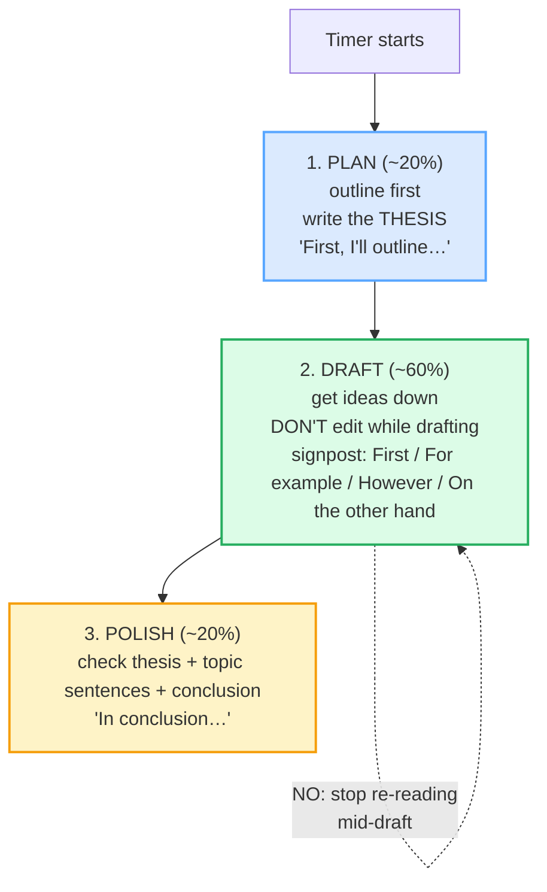

# Writing Under Time

> **Phase 5 · capstone · bundle #86 · Days 171–172.**
> *Outline fast; draft; polish last 10%.*
>
> 🔗 This capstone integrates two earlier bundles: [SUMMARIES & EXECUTIVE BRIEFS](../writing/SUMMARIES.md) (the conclusion is a 2–3 sentence summary, bottom-line up front) and [EDITING: CONCISION & ACTIVE VOICE](../writing/EDITING_CONCISION.md) (the polish stage is concision + active voice applied to a draft). Timed writing is those two skills **chained to a clock** — plan → draft → polish as three separate stages. 🔗 It also leans on [DEBATING](./DEBATING.md): the signposts that structure a timed essay (*However…*, *On the other hand…*, *In conclusion…*) are the same discourse markers that structure a spoken debate.

---

## Why this is a capstone bundle (read this first)

By Day 171 you can write emails, proposals, and polished messages. A *timed*
essay is a different beast: an IELTS Task 2, an SAT essay, an exam answer, a
cover letter drafted in 30 minutes. The constraint is the **clock**, and the
clock is what most Vietnamese learners lose to — not for lack of English, but
for lack of a **method**.

Two failure modes dominate, and both are L1/cultural rather than linguistic:

1. **Write with no plan.** Start the moment the timer starts, "to save time."
   Halfway through, both body paragraphs are making the same point, there is no
   thesis, and the conclusion is never written because the clock runs out. The
   essay rambles and dies unfinished.
2. **Edit sentence-by-sentence while drafting.** Write a sentence, cross it out,
   rewrite it, polish the adjective, fix the comma — and after 30 minutes have
   one perfect paragraph and no essay. Over-editing *is* running out of time.

The fix is a single rule most Vietnamese learners never internalise:

> **Treat plan, draft, and polish as three separate stages, kept apart by a
> clock. Outline first; draft fast without editing; polish only the last 10%.**

English timed-writing methodology (IELTS, SAT, academic-exam coaching) is
unanimous on this three-stage split. This bundle is the integration drill for
it.

---

## 1. The three-stage time-box

A timed essay is not free writing. It is **three jobs done in sequence, each
given a fixed slice of the clock**. The Pareto split is roughly **20% plan /
60% draft / 20% polish** — and the stages must *not* bleed into each other.

| Stage | Time (~) | Job | The one rule |
|---|---|---|---|
| **1. PLAN** | ~20% | Outline (intro / 2–3 main points / conclusion) + write the **thesis** first. | Produce structure, not sentences. |
| **2. DRAFT** | ~60% | Get ideas down fast. Signpost as you go. | **DON'T edit while drafting.** |
| **3. POLISH** | ~20% | Check thesis, topic sentences, conclusion; fix small errors only. | Improve, don't rewrite. |

> From `timed_writing_corpus.md` — the time-box, attested in two IELTS sources:
>
> - **IELTS Advantage:** Stage 1 *Thinking/Plan* 5–10 min · Stage 2 *Writing/Draft* 25–30 min · Stage 3 *Checking* 5 min. "Planning is not a waste of time — it's an investment that saves you time."
> - **BandWriteCoach:** "5 minutes plan, 30 minutes write, 5 minutes check. Skip none of the three."

The single hardest habit is the **draft stage rule**: do not re-read, do not
cross out, do not polish an adjective while the draft is unfinished. A rough
draft on time beats a polished paragraph with no essay.

---

## 2. The plan stage — outline first, thesis first (move 1)

The first ~20% produces **two things and only two**: a skeleton outline and a
one-sentence thesis. IELTS and SAT sources converge — an essay with a thesis
writes itself; an essay started "to save planning time" rambles.

> From `timed_writing_corpus.md`:
>
> - **First, I'll outline…** /fɜːst aɪl ˈaʊtlaɪn/ UK · /fɜːrst aɪl ˈaʊtlaɪn/ US — Oxford *outline*: "a description of the main facts or points"; example "You should draw up a plan or **outline** for the essay."
> - **My main argument is…** /maɪ meɪn ˈɑːɡjəmənt ɪz/ UK · /maɪ meɪn ˈɑːrɡjəmənt ɪz/ US — Cambridge *argument*: "a reason or set of reasons you use to persuade." This *is* the thesis.

> **Why "write the thesis first"?** BandWriteCoach: "write a one-sentence thesis in the last [planning] minute." The thesis is the spine every topic sentence must point back to — if you draft without one, the paragraphs drift. Spending 60 seconds on the thesis saves 6 minutes of rewrites.

**The outline skeleton** (the 2–3 main points): IELTS Advantage frames the body
as **Topic Sentence → Explanation → Example**. So a 2-minute outline is just:
*Point 1 (because X, for example Y) · Point 2 (because Z, for example W) ·
Conclusion.* Five lines on scratch paper is enough — the plan is functional,
not pretty.

---

## 3. The draft stage — signpost while you write (move 2)

The middle ~60% is pure **forward motion**: get the ideas down without editing.
The trick to a coherent draft under the clock is **signposting** — marking each
move with a discourse marker so the thread never breaks.

> From `timed_writing_corpus.md`:
>
> - **For example…** /fɔː(r) ɪɡˈzɑːmpl/ UK · /fɔːr ɪɡˈzæmpl/ US — Cambridge: introduces an instance/evidence. (🔗 [DEBATING](./DEBATING.md) move 2.)
> - **On the other hand…** /ɒn ði ˈʌðə(r) hænd/ UK · /ɑːn ði ˈʌðər hænd/ US — Cambridge: introduces a contrasting/opposing point.
> - **However…** /haʊˈevə(r)/ UK · /haʊˈevər/ US — Cambridge: the pivot/contrast adverb.

> **The draft rule (attested):** BandWriteCoach — the plan is "five lines on
> scratch paper," then draft. IELTS Advantage — the body paragraph spine is
> **Topic Sentence → Explanation → Example**, which is exactly *My main
> argument is… → For example…*. The signposts are the load-bearing connectors
> that keep that spine visible while you write fast.

**Signpost while writing** = *First…, Next…, However…, On the other hand…,
In conclusion…*. These are not decoration; they are the structure the examiner
(or any reader) follows. A timed essay with no signposts reads as a wall of
unconnected sentences — and loses the Coherence band outright.

---

## 4. The conclusion + polish stage — close it, then fix only the last 10% (move 3)

Two things happen in the final ~20%: **write the conclusion** (if not yet
written) and **polish**. Timed-writing sources are unanimous that a missing or
rushed conclusion is the single most expensive error.

> From `timed_writing_corpus.md`:
>
> - **In conclusion…** /ɪn kənˈkluː.ʒn/ UK · /ɪn kənˈkluː.ʒn/ US — Cambridge *conclusion* + the fixed phrase **in conclusion** (B2, "finally"): "In conclusion, I would like to thank our guest speaker."
> - **To sum up…** /tə ˌsʌm ˈʌp/ — Cambridge *sum up*: "to describe or express the important facts about something."

> From `timed_writing_corpus.md` — the **pinned** conclusion opener:
>
> > **In conclusion…** — /ɪn kənˈkluː.ʒn/ UK · /ɪn kənˈkluː.ʒn/ US
> > (Cambridge *conclusion* /kənˈkluː.ʒən/ + the B2 phrase **in conclusion**;
> > BandWriteCoach attests the under-pressure recovery move "In conclusion,
> > [restate position].")

> **Why a conclusion is non-negotiable:** BandWriteCoach — "an essay without [a
> conclusion] cannot score above Band 5 for Task Response." The recovery rule:
> if you reach the end with no conclusion, **stop the body mid-sentence and
> write two conclusion sentences** ("In conclusion, [restate position]. [One
> supporting reason]."). A weak ending you finished beats a strong ending you
> never wrote.

**The polish rule:** fix what you can fix in seconds. Check the **thesis**
(still matches the body?), the **topic sentences** (each paragraph opens with
one?), the **conclusion** (no new ideas?). Then hunt your personal error
hotspots — for a Vietnamese learner that is usually articles (`a/an/the`),
plural `-s`, and tense. 🔗 [EDITING: CONCISION](../writing/EDITING_CONCISION.md).
Do **not** rewrite whole sentences in polish — five minutes of editing recovers
more marks than five minutes of extra writing produces.

> **Note:** signposts like *In conclusion…* and *However…* are **spoken and
> read, not only written** — they open talks, debates, and presentations too.
> That is why the IPA matters here: a conclusion you can't pronounce can't be
> delivered. 🔗 [SHORT PRESENTATIONS](../workplace/SHORT_PRESENTATIONS.md).

---

## 5. Cheat sheet — the ≤8 survival chunks

The Pareto set. Drill these eight until the **plan→draft→polish** arc plus the
signposts are automatic. (Every row is a corpus attestation above.)

| # | Chunk | IPA | Stage / role |
|---|---|---|---|
| 1 | **First, I'll outline…** | /fɜːst aɪl ˈaʊtlaɪn/ UK · /fɜːrst aɪl ˈaʊtlaɪn/ US | 1 plan — outline |
| 2 | **My main argument is…** | /maɪ meɪn ˈɑːɡjəmənt ɪz/ UK · /maɪ meɪn ˈɑːrɡjəmənt ɪz/ US | 1 plan — thesis |
| 3 | **For example…** | /fɔː(r) ɪɡˈzɑːmpl/ UK · /fɔːr ɪɡˈzæmpl/ US | 2 draft — evidence |
| 4 | **On the other hand…** | /ɒn ði ˈʌðə(r) hænd/ UK · /ɑːn ði ˈʌðər hænd/ US | 2 draft — counter |
| 5 | **However…** | /haʊˈevə(r)/ UK · /haʊˈevər/ US | 2 draft — pivot |
| 6 | **In conclusion…** | /ɪn kənˈkluː.ʒn/ UK · /ɪn kənˈkluː.ʒn/ US | 3 close — PINNED |
| 7 | **To sum up…** | /tə ˌsʌm ˈʌp/ | 3 close — variant |
| 8 | **outline → thesis → draft → polish** | /ˈaʊtlaɪn/ · /ˈθiːsɪs/ · /drɑːft/–/dræft/ · /ˈpɒlɪʃ/–/ˈpɑːlɪʃ/ | the method |

> Open [`timed_writing.html`](./timed_writing.html) to drill these as flip
> cards, hear native clips, play the think-aloud role-play, shadow, and **write
> a timed mini-essay through all three stages** (the writing task is this
> bundle's primary practice).

---

## 6. Vietnamese → English L1 pitfalls table

The "expert payoff." These are the specific interference traps a Vietnamese
speaker hits when writing under time — extend, don't replace, the seed rows
from the spec.

| Vietnamese trap (what you do) | English fix (what to do instead) |
|---|---|
| **Writes with no plan** — starts immediately "to save time," then rambles, repeats points, and runs out of clock before the conclusion | **Plan ~20% first.** Outline (intro / 2–3 points / conclusion) + write the **thesis** before any sentences. IELTS Advantage: "Planning is not a waste of time — it's an investment." |
| **Edits sentence-by-sentence WHILE drafting** — writes a sentence, crosses it out, polishes the adjective; 30 min later = one paragraph, no essay | **Don't edit while drafting.** The draft stage is forward motion only. Keep a rough draft on time; leave all correction to the polish stage. A rough draft beats a polished fragment. |
| **Neglects the outline AND the conclusion** — Vietnamese exam culture often rewards length/content over structure, so both ends get sacrificed to the body | Protect the **outline** and the **conclusion** above all. BandWriteCoach: "an essay without a conclusion cannot score above Band 5." If time runs out, stop the body and write the conclusion first. |
| **No signposts** — writes a wall of unconnected sentences; the reader can't follow the turn from point to counterpoint | **Signpost while writing:** *First… / For example… / However… / On the other hand… / In conclusion…*. The signposts *are* the coherence. 🔗 [DEBATING](./DEBATING.md). |
| **No thesis** — drifts into "I will discuss both sides" with no position; the essay has no spine | Write the **one-sentence thesis first** (*My main argument is…*) and make every topic sentence point back to it. |
| **Over-polishes the introduction, under-writes the body** — spends 10 min on a "hook" / "In today's modern world" filler, then has no time for developed points | Skip the hook. IELTS Advantage: paraphrase the prompt + state the thesis in 2–3 sentences, then move on. The intro is ~5% of the marks. |
| **Adds new ideas in the conclusion** — "In conclusion, and also I predict that in the future…" | The conclusion **restates the thesis and summarises the reasons — no new ideas.** 🔗 [SUMMARIES](../writing/SUMMARIES.md). |
| **Missing articles / plural -s / tense in the rush** — "people sleeps fewer hours," "I will discuss about" | Leave these for the **polish stage**: know your personal hotspots (articles, `-s`, tense) and hunt only those in the last minutes. 🔗 [FINAL CONSONANTS](../pronunciation/FINAL_CONSONANTS.md). |
| **Pro-drop / missing subject under pressure** — "Is good idea to…" instead of "It is a good idea to…" / "My argument is…" | Supply the subject + copula even when rushed: **"It is…" / "My main argument is…"**. English needs an explicit subject owning every claim. |
| **Can't pronounce the signposts when reading the essay aloud** — "In conclusio," "On the othe hand" | The signposts are spoken too. Release every final: *conclu**sion*** /kənˈkluː.ʒn/, *othe**r*** /ˈʌðə(r)/, *howeve**r*** /haʊˈevə(r)/. 🔗 [FINAL CONSONANTS](../pronunciation/FINAL_CONSONANTS.md). |

---

## How to practise this bundle (the daily 20 min)

1. **READ** (5 min) — this guide, §1–§4. Memorise the **plan→draft→polish**
   shape and the "don't edit while drafting" rule.
2. **SHADOW** (7 min) — open `timed_writing.html`, drill the 8 flip cards + the
   think-aloud role-play **aloud** — say the signposts as you would write them.
3. **PRODUCE** (8 min) — the **writing task** (primary): set a timer, write a
   timed mini-essay through all three stages (outline → draft → polish) on a
   prompt; show all three stages. Read it aloud, recording yourself; check the
   thesis, the signposts, and the conclusion are intact.

---

## Sources

- Cambridge Advanced Learner's Dictionary — https://dictionary.cambridge.org/dictionary/english/{word} (entries for *conclusion, in conclusion, sum up, argument, however, for example, on the other hand, draft, polish*)
- Oxford Advanced Learner's Dictionary — https://www.oxfordlearnersdictionaries.com/definition/english/{word} (entries for *outline, thesis*)
- Manchester Academic Phrasebank — https://www.phrasebank.manchester.ac.uk/ (attests *In conclusion…*, *To sum up…*, *For example…*, *On the other hand…*, *However…* as the discourse markers that structure an academic text.)
- Cambridge Grammar, *Discourse markers* — https://dictionary.cambridge.org/us/grammar/british-grammar/discourse-markers-so-right-okay (lists *in conclusion*, *on the one hand*, *in sum* among the logical-chain markers.)
- IELTS Advantage, "The Only IELTS Writing Task 2 Strategy You Need" — https://www.ieltsadvantage.com/ielts-writing-task-2-strategy/ (the three-stage process: Plan 5–10 min / Draft 25–30 min / Check 5 min; "Planning is an investment"; Topic Sentence → Explanation → Example; the "In conclusion…" closer.)
- BandWriteCoach, "IELTS Writing Time Management: How to Use Your 60 Minutes" — https://bandwritecoach.com/blog/ielts-writing-time-management-60-minutes (attests "5 minutes plan, 30 minutes write, 5 minutes check"; "an essay without a conclusion cannot score above Band 5"; the recovery move "In conclusion, [restate position].")
- Native audio: YouGlish — https://youglish.com/pronounce/{chunk}/english/us?
- Frequency methodology: wordfrequency.info (spoken sub-corpus) — https://www.wordfrequency.info/
