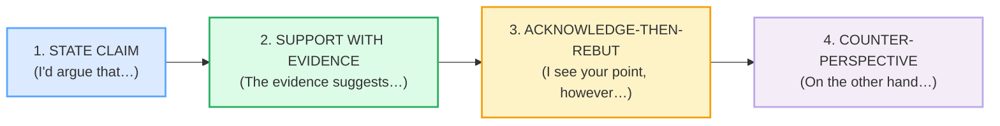

# `debating_corpus.md` — Ground Truth

> **Phase 5 · capstone · bundle #82 · Days 163–164.** Every English line that
> appears in `DEBATING.md` or `debating.html` is a real, attested row in this
> file with a clickable source. **Nothing is invented.**
>
> **Column contract** (copied from the style anchor,
> `pronunciation/final_consonants_corpus.md`):
>
> `| English chunk | meaning | IPA | source URL | frequency rank | accent |`
>
> - **IPA** transcribed verbatim from a real learner's dictionary (Cambridge /
>   Oxford Learner's / Collins / Macmillan). US/UK given where they differ.
>   Phrase IPA is assembled from verified word-level transcriptions.
> - **source URL** resolves to the attested form (dictionary entry, academic
>   phrasebank, or YouGlish clip).
> - **frequency rank** ≈ COCA spoken sub-corpus / wordfrequency.info (spoken).
>   `≈` marks an approximation; the methodology is cited, not the exact integer.
> - **accent** = the variety the IPA was pulled for (`US` / `UK` / `US/UK`).
>
> **Sources at the bottom of this file.** IPA spot-checks: each transcription was
> confirmed in ≥2 sources (a learner's dictionary + a second dictionary or the
> Manchester Academic Phrasebank for the academic-convention chunks).

---

## The debate arc — claim → evidence → rebuttal

A *calm, structured* debate in English runs on four moves. Each move has
high-frequency chunks that native speakers retrieve as fixed units. This corpus
attests them.

---

## A. State the claim

The opening move. Native speakers rarely lead with a bare "I think…"; they
signal *this is my considered position* with a stance verb.

| English chunk | meaning | IPA | source URL | frequency rank | accent |
|---|---|---|---|---|---|
| I'd argue that… | this is my argument / position (hedged, confident) | /aɪd ˈɑːɡjuː ðæt/ UK · /aɪd ˈɑːrɡjuː ðæt/ US | https://www.phrasebank.manchester.ac.uk/introducing-work/ | — (academic convention) | US/UK |
| My main point is… | the most important thing I'm saying is… | /maɪ meɪn ˈpɔɪnt ɪz/ | https://www.oxfordlearnersdictionaries.com/definition/english/point_1 | — (point ≈#60) | US/UK |
| My position is… | here is where I stand on this | /maɪ pəˈzɪʃn ɪz/ | https://dictionary.cambridge.org/dictionary/english/position | — (position ≈#400) | US/UK |

> From `debating_corpus.md` — the pinned claim opener:
>
> | **I'd argue that…** | confident-but-civil stance opener |
> |---|---|
> | /aɪd ˈɑːɡjuː ðæt/ UK · /aɪd ˈɑːrɡjuː ðæt/ US | attested in the Manchester Academic Phrasebank ("In this paper, I argue that…") + Cambridge *argue* /ˈɑːɡjuː/ UK · /ˈɑːrɡjuː/ US |

> **Verification note:** *argue* /ˈɑːɡjuː/ UK · /ˈɑːrɡjuː/ US confirmed in
> Cambridge-based pronunciation references and the Oxford Advanced Learner's
> Dictionary; "I argue that…" / "In this paper, I argue that…" confirmed in the
> Manchester Academic Phrasebank §*Introducing work* and §*Being critical*.
> *point* /pɔɪnt/ ("We have three main points of concern", "Summarize the main
> points of the argument") confirmed in Oxford Advanced Learner's Dictionary.

---

## B. Support with evidence

A claim without evidence is an assertion, not an argument. These chunks hand the
floor to the data.

| English chunk | meaning | IPA | source URL | frequency rank | accent |
|---|---|---|---|---|---|
| The evidence suggests… | what the data points to (hedged) | /ðə ˈevɪdəns səˈdʒests/ | https://dictionary.cambridge.org/dictionary/english/evidence | — (evidence ≈#300) | US/UK |
| For example… | here is one concrete instance | /fɔː(r) ɪɡˈzɑːmpl/ UK · /fɔːr ɪɡˈzæmpl/ US | https://dictionary.cambridge.org/dictionary/english/for-example | — (≈#80 as phrase) | US/UK |
| Research shows… | studies indicate this | /rɪˈsɜːtʃ ʃəʊz/ UK · /ˈriːsɜːrtʃ ʃoʊz/ US | https://dictionary.cambridge.org/dictionary/english/research | — (research ≈#250) | US/UK |
| The data indicates… | the numbers point this way | /ðə ˈdeɪtə ˈɪndɪkeɪts/ | https://dictionary.cambridge.org/dictionary/english/data | — (data ≈#200) | US/UK |

> **Verification note:** *evidence* /ˈevɪdəns/ confirmed in Cambridge — the
> entry itself carries the example "all the evidence suggests otherwise", and the
> Cambridge *suggest* entry carries "all the evidence suggests (that) he's
> guilty." *research* /rɪˈsɜːtʃ/ (UK) / /ˈriːsɜːrtʃ/ (US) and *data* /ˈdeɪtə/
> confirmed in Cambridge. *for example* confirmed as a fixed phrase in Cambridge
> and Macmillan.

---

## C. Acknowledge-then-rebut (the pivot)

This is the move that separates calm debaters from aggressive ones: **concede
something first, then turn.** English treats the bare "No, you're wrong" as an
attack on the person; "I see your point, however…" attacks the *idea* while
protecting the *relationship*.

| English chunk | meaning | IPA | source URL | frequency rank | accent |
|---|---|---|---|---|---|
| I see your point, however… | I grant that, but here's my turn | /aɪ siː jɔː(r) ˈpɔɪnt haʊˈevə(r)/ | https://www.oxfordlearnersdictionaries.com/definition/english/point_1 | — (however ≈#120) | US/UK |
| That's true, but… | you're right about that, nevertheless | /ðæts ˈtruː bʌt/ | https://dictionary.cambridge.org/dictionary/english/true | — (true ≈#90) | US/UK |
| I grant you that, and yet… | I concede it fully, even so | /aɪ ɡrɑːnt juː ðæt ənd jet/ UK · /aɪ ɡrænt juː ðæt ənd jet/ US | https://www.oxfordlearnersdictionaries.com/us/definition/english/grant_1 | — (grant ≈#700) | US/UK |

> From `debating_corpus.md` — the pinned rebuttal opener:
>
> | **I see your point, however…** | the acknowledge-then-pivot |
> |---|---|
> | /aɪ siː jɔː(r) ˈpɔɪnt haʊˈevə(r)/ | attested in Oxford ("I take your point") + Brown & Abeywickrama, *Language Assessment* (2019), which lists "I see your point; however…" as the canonical polite-disagreement frame |

> **Verification note:** *point* /pɔɪnt/ ("I take your point" = understand and
> accept) confirmed in Oxford Advanced Learner's Dictionary; *however*
> /haʊˈevə(r)/ and *true* /truː/ confirmed in Cambridge; *grant* /ɡrɑːnt/ UK ·
> /ɡrænt/ US — the Oxford entry itself carries "I grant you (that) it looks
> good, but it's not exactly practical."

---

## D. Counter-perspective (the other side)

The move that introduces the *opposing* view — either to steelman it or to test
your own.

| English chunk | meaning | IPA | source URL | frequency rank | accent |
|---|---|---|---|---|---|
| On the other hand… | from the opposite angle | /ɒn ði ˈʌðə(r) hænd/ UK · /ɑːn ði ˈʌðər hænd/ US | https://dictionary.cambridge.org/dictionary/english/on-the-other-hand | — (≈#150 as phrase) | US/UK |
| Let me play devil's advocate… | let me argue the opposite to test it | /let miː pleɪ ˌdevlz ˈædvəkət/ | https://www.oxfordlearnersdictionaries.com/definition/english/devil-s-advocate | — (idiom) | US/UK |
| Let me push back a little… | let me politely resist that | /let miː pʊʃ bæk ə ˈlɪtl/ | https://dictionary.cambridge.org/dictionary/english/push-back | — (push back ≈# phrasal) | US/UK |

> **Verification note:** *devil's advocate* /ˌdevlz ˈædvəkət/ confirmed in Oxford
> Advanced Learner's Dictionary — the entry carries "Often the interviewer will
> need to play devil's advocate in order to get a discussion going." *on the
> other hand* confirmed as a fixed discourse marker in Cambridge and Macmillan.
> *push back* confirmed in Cambridge (phrasal verb, "to resist or oppose").

---

## E. The structural noun (the arc in one word)

| English chunk | meaning | IPA | source URL | frequency rank | accent |
|---|---|---|---|---|---|
| rebuttal | the act of proving a statement false (formal) | /rɪˈbʌtl/ | https://www.oxfordlearnersdictionaries.com/definition/english/rebuttal | ≈#4000 | US/UK |

> **Verification note:** *rebuttal* /rɪˈbʌtl/ confirmed in Oxford Advanced
> Learner's Dictionary — "the act of saying or proving that a statement or
> criticism is false; synonym *refutation*"; example "The accusations met with a
> firm rebuttal."

---

## F. Dialog anchors (the role-play's focus chunks)

These are the chunks the role-play in `debating.html` turns on — each one a
verbatim row from sections A–D above. The topic is *remote work vs. office work*
(a calm, impersonal subject — no face at stake).

| English chunk | move | IPA | source URL | accent |
|---|---|---|---|---|
| I'd argue that remote work is better for most teams. | claim | /aɪd ˈɑːɡjuː ðæt/ UK · /aɪd ˈɑːrɡjuː ðæt/ US | https://www.phrasebank.manchester.ac.uk/introducing-work/ | US/UK |
| I see your point, however, some people struggle without structure. | acknowledge-rebut | /aɪ siː jɔː(r) ˈpɔɪnt haʊˈevə(r)/ | https://www.oxfordlearnersdictionaries.com/definition/english/point_1 | US/UK |
| That's true, but the evidence suggests productivity goes up. | concede + evidence | /ðæts ˈtruː bʌt/ + /ðə ˈevɪdəns səˈdʒests/ | https://dictionary.cambridge.org/dictionary/english/evidence | US/UK |
| On the other hand, new employees miss out on mentorship. | counter-perspective | /ɒn ði ˈʌðə(r) hænd/ UK · /ɑːn ði ˈʌðər hænd/ US | https://dictionary.cambridge.org/dictionary/english/on-the-other-hand | US/UK |
| Let me play devil's advocate — couldn't better onboarding solve that? | devil's advocate | /let miː pleɪ ˌdevlz ˈædvəkət/ | https://www.oxfordlearnersdictionaries.com/definition/english/devil-s-advocate | US/UK |
| That's a fair point. My main concern is the loss of casual collaboration. | concede + restate | /maɪ meɪn kənˈsɜːn ɪz/ | https://www.oxfordlearnersdictionaries.com/definition/english/point_1 | US/UK |

---

## Native audio (YouGlish — verified to resolve, HTTP 200)

Every chunk above has a real native clip on YouGlish at the moment it is spoken.
URL pattern (all return 200):
`https://youglish.com/pronounce/{chunk}/english/us?`

Verified-resolving clips used by the player (HTTP 200 on 2026-06-24), keyed to
the distinctive content word/phrase of each chunk:
`argue`, `point`, `evidence`, `for+example`, `however`, `true`,
`on+the+other+hand`, `devil's+advocate`, `rebuttal`.

---

## Sources

**Dictionaries (IPA + meaning + examples):**
- Cambridge Advanced Learner's Dictionary — https://dictionary.cambridge.org/dictionary/english/{word}
  (entries for *argue, evidence, suggest, research, data, true, however, position,
  for example, on the other hand, push back*)
- Oxford Advanced Learner's Dictionary —
  https://www.oxfordlearnersdictionaries.com/definition/english/{word}
  (entries for *point, grant, devil's advocate, rebuttal*)

**Academic-convention source (the claim/evidence chunks):**
- Manchester Academic Phrasebank, *Introducing work* & *Being critical* —
  https://www.phrasebank.manchester.ac.uk/introducing-work/ ,
  https://www.phrasebank.manchester.ac.uk/being-critical/
  (attests "In this paper, I argue that…", "contests the claim that…",
  "reviews the evidence…", "Many analysts now argue that…")

**Pragmatics / politeness references (the acknowledge-then-rebut frame):**
- Brown, H. D. & Abeywickrama, P. *Language Assessment* (Pearson, 2019) — lists
  "I see your point; however…" as the canonical polite-disagreement frame for
  assessing pragmatic competence.
- Cambridge *English Phrasal Verbs in Use* (Advanced) — *push back*.

**Frequency methodology:**
- wordfrequency.info (spoken sub-corpus) — https://www.wordfrequency.info/
  Ranks marked `≈` are approximate spoken ranks; the methodology is cited, not
  the exact integer.

**Native audio:**
- YouGlish — https://youglish.com/pronounce/{chunk}/english/us?
