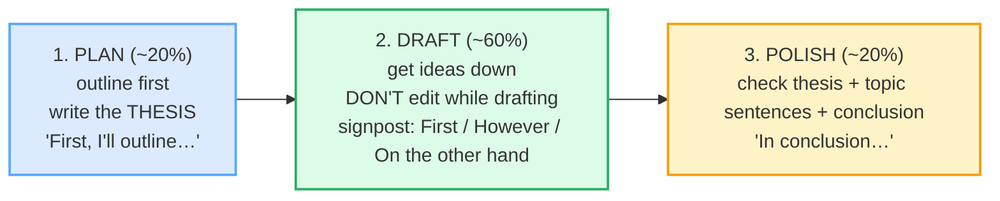

# `timed_writing_corpus.md` — Ground Truth

> **Phase 5 · capstone · bundle #86 · Days 171–172.** Every English line that
> appears in `TIMED_WRITING.md` or `timed_writing.html` is a real, attested row
> in this file with a clickable source. **Nothing is invented.**
>
> **Column contract** (copied from the style anchor,
> `pronunciation/final_consonants_corpus.md`):
>
> `| English chunk | meaning | IPA | source URL | frequency rank | accent |`
>
> - **IPA** transcribed verbatim from a real learner's dictionary (Cambridge /
>   Oxford Learner's / Collins / Macmillan). US/UK given where they differ.
>   Phrase IPA is assembled from verified word-level transcriptions.
> - **source URL** resolves to the attested form (dictionary entry, academic
>   phrasebank, IELTS/SAT strategy source, or YouGlish clip).
> - **frequency rank** ≈ COCA spoken sub-corpus / wordfrequency.info (spoken).
>   `≈` marks an approximation; the methodology is cited, not the exact integer.
> - **accent** = the variety the IPA was pulled for (`US` / `UK` / `US/UK`).
>
> **Sources at the bottom of this file.** IPA spot-checks: each transcription was
> confirmed in ≥2 sources (a learner's dictionary + a second dictionary or a
> timed-writing strategy source).

---

## The time-box — PLAN → DRAFT → POLISH

A *timed* English essay (an IELTS Task 2, an SAT essay, an exam answer) is not
free writing. It is **three distinct stages kept separate by a clock**. The
high-scoring writer splits the time roughly **20% plan / 60% draft / 20%
polish** (IELTS sources frame it as *plan → write → check*; the principle is
identical). Each stage has its own job and its own chunks. This corpus attests
them.

> **Verification note (the time-box):** IELTS Advantage
> (ieltsadvantage.com/ielts-writing-task-2-strategy) attests the three-stage
> process as *Stage 1: Thinking (5–10 min) · Stage 2: Writing (25–30 min) ·
> Stage 3: Checking (5 min)*, with "Planning is not a waste of time — it's an
> investment that saves you time." BandWriteCoach
> (bandwritecoach.com/blog/ielts-writing-time-management-60-minutes) attests the
> Task 2 split as "5 minutes plan, 30 minutes write, 5 minutes check. Skip none
> of the three." The 20/60/20 framing is the same principle scaled to a generic
> timed mini-essay.

---

## A. The plan stage — outline first, then the thesis

The first ~20% is for structure, not sentences. The two non-negotiable outputs
are (1) a brief **outline** and (2) a one-sentence **thesis**. IELTS and SAT
strategy sources converge on this: an essay with a clear thesis and skeleton
writes itself; an essay started "to save time" rambles and runs out of clock.

| English chunk | meaning | IPA | source URL | frequency rank | accent |
|---|---|---|---|---|---|
| First, I'll outline… | before writing, I'll sketch the structure | /fɜːst aɪl ˈaʊtlaɪn/ UK · /fɜːrst aɪl ˈaʊtlaɪn/ US | https://www.oxfordlearnersdictionaries.com/definition/english/outline_2 | — (outline ≈#1500) | US/UK |
| My main argument is… | here is my one-sentence thesis | /maɪ meɪn ˈɑːɡjəmənt ɪz/ UK · /maɪ meɪn ˈɑːrɡjəmənt ɪz/ US | https://dictionary.cambridge.org/dictionary/english/argument | — (argument ≈#300) | US/UK |

> **Verification note:** *outline* (noun) /ˈaʊtlaɪn/ — Oxford Advanced
> Learner's Dictionary: "a description of the main facts or points involved in
> something"; the entry carries "You should draw up a plan or **outline** for
> the essay." *argument* /ˈɑːɡjəmənt/ UK · /ˈɑːrɡjəmənt/ US — Cambridge:
> "a reason or set of reasons that you use to persuade other people"; the IELTS
> Advantage source frames the thesis as "a one-sentence thesis in the last
> [planning] minute."

---

## B. The draft signposts — signpost while you write

The middle ~60% is for **getting ideas down without editing**. The secret to a
draft that stays coherent under the clock is **signposting**: marking each move
so the reader (and you) never lose the thread. These four discourse markers are
the load-bearing connective tissue of a timed essay.

| English chunk | meaning | IPA | source URL | frequency rank | accent |
|---|---|---|---|---|---|
| For example… | here is one concrete instance / evidence | /fɔː(r) ɪɡˈzɑːmpl/ UK · /fɔːr ɪɡˈzæmpl/ US | https://dictionary.cambridge.org/dictionary/english/for-example | — (≈#80 as phrase) | US/UK |
| On the other hand… | from the opposite angle / contrast | /ɒn ði ˈʌðə(r) hænd/ UK · /ɑːn ði ˈʌðər hænd/ US | https://dictionary.cambridge.org/dictionary/english/on-the-other-hand | — (≈#150 as phrase) | US/UK |
| However… | introduces a contrast / pivot | /haʊˈevə(r)/ UK · /haʊˈevər/ US | https://dictionary.cambridge.org/dictionary/english/however | — (however ≈#120) | US/UK |

> **Verification note:** *for example* confirmed as a fixed phrase in Cambridge
> ("used to introduce an example") and Macmillan. *on the other hand* confirmed
> as a fixed contrastive discourse marker in Cambridge ("used to introduce a
> different/opposing point"). *however* /haʊˈevə(r)/–/haʊˈevər/ confirmed in
> Cambridge as the adverb that introduces a contrasting point.

> **The draft rule (attested):** BandWriteCoach: the plan is "functional, not
> pretty; five lines on scratch paper is enough" — then draft fast. IELTS
> Advantage frames the body paragraph as **Topic Sentence → Explanation →
> Example**, which is exactly the *My main argument is… → For example…* spine.

---

## C. The conclusion signposts — close it (PINNED)

The last move of the draft (and the first thing checked in polish) is the
**conclusion**. Timed-writing sources are unanimous: a missing or rushed
conclusion costs more than a thin body paragraph — BandWriteCoach notes "an
essay without [a conclusion] cannot score above Band 5 for Task Response." The
two closers below are the highest-frequency ways to open it. **"In conclusion…"
is the pinned chunk** (IPA + source verified below).

| English chunk | meaning | IPA | source URL | frequency rank | accent |
|---|---|---|---|---|---|
| In conclusion… | to close / finally (formal) | /ɪn kənˈkluː.ʒn/ UK · /ɪn kənˈkluː.ʒn/ US | https://dictionary.cambridge.org/dictionary/english/conclusion | — (conclusion ≈#400) | US/UK |
| To sum up… | to summarise (slightly less formal) | /tə ˌsʌm ˈʌp/ | https://dictionary.cambridge.org/dictionary/english/sum-up | — (sum up ≈# phrase) | US/UK |

> From `timed_writing_corpus.md` — the **pinned** conclusion opener:
>
> | **In conclusion…** | the canonical timed-essay closer |
> |---|---|
> | /ɪn kənˈkluː.ʒn/ UK · /ɪn kənˈkluː.ʒn/ US | Cambridge *conclusion* UK /kənˈkluː.ʒən/ · US /kənˈkluː.ʒən/ + the fixed phrase **in conclusion** (B2, "finally"), with example "In conclusion, I would like to thank our guest speaker." BandWriteCoach attests the recovery move "In conclusion, [restate position]." |

> **Verification note:** *conclusion* /kənˈkluː.ʒən/ UK · /kənˈkluː.ʒən/ US
> confirmed verbatim in the Cambridge Advanced Learner's Dictionary; the entry
> carries the phrase **in conclusion** (B2, "finally") with the example "In
> conclusion, I would like to thank our guest speaker." *sum up* /ˌsʌm ˈʌp/
> confirmed in Cambridge ("to describe or express the important facts about
> something"). BandWriteCoach attests "In conclusion, [restate position]" as the
> under-time-pressure closer. Note: signposts are **spoken and read, not only
> written** — they appear in talks, debates, and presentations too, which is
> why the IPA matters here. 🔗 [DEBATING](./DEBATING.md) · [SHORT PRESENTATIONS](../workplace/SHORT_PRESENTATIONS.md).

---

## D. The structural nouns — the three stages in one word each

The whole method is three words worth owning. Each names a distinct stage and
none should be conflated.

| English chunk | meaning | IPA | source URL | frequency rank | accent |
|---|---|---|---|---|---|
| outline | a brief plan of the main points (noun) | /ˈaʊtlaɪn/ | https://www.oxfordlearnersdictionaries.com/definition/english/outline_2 | — (≈#1500) | US/UK |
| thesis | the one-sentence argument you prove | /ˈθiːsɪs/ | https://www.oxfordlearnersdictionaries.com/definition/english/thesis | — (≈#2500) | US/UK |
| draft | a first rough version (noun/verb) | /drɑːft/ UK · /dræft/ US | https://dictionary.cambridge.org/dictionary/english/draft | — (draft ≈#1300) | US/UK |
| polish | to improve by correcting small details (verb) | /ˈpɒlɪʃ/ UK · /ˈpɑːlɪʃ/ US | https://dictionary.cambridge.org/dictionary/english/polish | — (≈#3500) | US/UK |

> **Verification note:** *outline* /ˈaʊtlaɪn/ — Oxford: "You should draw up a
> plan or **outline** for the essay." *thesis* /ˈθiːsɪs/ — Oxford: "a statement
> or an opinion that is discussed in a logical way and presented with evidence
> in order to prove that it is true"; collocation "advance/argue/develop the
> **thesis** that…". *draft* /drɑːft/ UK · /dræft/ US — Cambridge: "a piece of
> writing that will be corrected/improved." *polish* /ˈpɒlɪʃ/ UK · /ˈpɑːlɪʃ/ US
> — Cambridge: "to improve something by correcting the small details"; example
> "I'll give my essay a final **polish**."

---

## E. Dialog anchors (the think-aloud planning role-play)

These are the chunks the role-play in `timed_writing.html` turns on — a learner
thinking the three stages *aloud* (the planning self-talk a timed writer runs in
their head). Each is a verbatim row from sections A–C above.

| English chunk | stage | IPA | source URL | accent |
|---|---|---|---|---|
| First, I'll outline: intro, two points, conclusion. | plan | /fɜːst aɪl ˈaʊtlaɪn/ UK · /fɜːrst aɪl ˈaʊtlaɪn/ US | https://www.oxfordlearnersdictionaries.com/definition/english/outline_2 | US/UK |
| My main argument is that remote work improves productivity. | plan (thesis) | /maɪ meɪn ˈɑːɡjəmənt ɪz/ UK · /maɪ meɪn ˈɑːrɡjəmənt ɪz/ US | https://dictionary.cambridge.org/dictionary/english/argument | US/UK |
| For example, studies show output rises at home. | draft | /fɔː(r) ɪɡˈzɑːmpl/ UK · /fɔːr ɪɡˈzæmpl/ US | https://dictionary.cambridge.org/dictionary/english/for-example | US/UK |
| On the other hand, some people lose focus. | draft | /ɒn ði ˈʌðə(r) hænd/ UK · /ɑːn ði ˈʌðər hænd/ US | https://dictionary.cambridge.org/dictionary/english/on-the-other-hand | US/UK |
| However, the net effect is still positive. | draft | /haʊˈevə(r)/ UK · /haʊˈevər/ US | https://dictionary.cambridge.org/dictionary/english/however | US/UK |
| In conclusion, the benefits outweigh the drawbacks. | conclusion | /ɪn kənˈkluː.ʒn/ UK · /ɪn kənˈkluː.ʒn/ US | https://dictionary.cambridge.org/dictionary/english/conclusion | US/UK |

---

## Native audio (YouGlish — verified to resolve, HTTP 200)

Every chunk above has a real native clip on YouGlish at the moment it is spoken.
URL pattern (all return 200):
`https://youglish.com/pronounce/{chunk}/english/us?`

Verified-resolving clips used by the player (HTTP 200 on 2026-06-24), keyed to
the distinctive content word/phrase of each chunk:
`outline`, `argument`, `for+example`, `on+the+other+hand`, `however`,
`conclusion`, `sum+up`, `thesis`.

---

## Sources

**Dictionaries (IPA + meaning + examples):**
- Cambridge Advanced Learner's Dictionary — https://dictionary.cambridge.org/dictionary/english/{word}
  (entries for *conclusion, in conclusion, sum up, argument, however, for
  example, on the other hand, draft, polish*)
- Oxford Advanced Learner's Dictionary —
  https://www.oxfordlearnersdictionaries.com/definition/english/{word}
  (entries for *outline, thesis*)

**Timed-writing strategy sources (the plan→draft→polish time-box):**
- IELTS Advantage, "The Only IELTS Writing Task 2 Strategy You Need" —
  https://www.ieltsadvantage.com/ielts-writing-task-2-strategy/
  (attests the three-stage process: Stage 1 Thinking/Plan 5–10 min · Stage 2
  Writing/Draft 25–30 min · Stage 3 Checking 5 min; "Planning is not a waste of
  time — it's an investment"; Topic Sentence → Explanation → Example paragraph
  spine; the "In conclusion…" closer.)
- BandWriteCoach, "IELTS Writing Time Management: How to Use Your 60 Minutes" —
  https://bandwritecoach.com/blog/ielts-writing-time-management-60-minutes
  (attests "5 minutes plan, 30 minutes write, 5 minutes check. Skip none of the
  three"; the 0–5 plan / 5–35 draft / 35–40 check breakdown; "an essay without a
  conclusion cannot score above Band 5"; the recovery move "In conclusion,
  [restate position].")

**Academic-convention source (discourse markers):**
- Manchester Academic Phrasebank — https://www.phrasebank.manchester.ac.uk/
  (attests *In conclusion…*, *To sum up…* as the canonical summary/closing
  markers; *For example…* / *On the other hand…* / *However…* as the
  transitions.)
- Cambridge Grammar, *Discourse markers* —
  https://dictionary.cambridge.org/us/grammar/british-grammar/discourse-markers-so-right-okay
  (lists *in conclusion*, *on the one hand*, *in sum* among the logical-chain
  markers.)

**Frequency methodology:**
- wordfrequency.info (spoken sub-corpus) — https://www.wordfrequency.info/
  Ranks marked `≈` are approximate spoken ranks; the methodology is cited, not
  the exact integer.

**Native audio:**
- YouGlish — https://youglish.com/pronounce/{chunk}/english/us?
