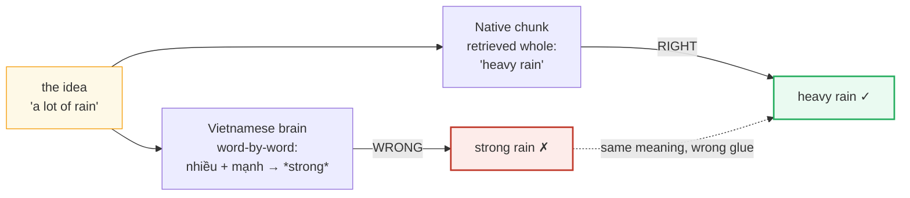
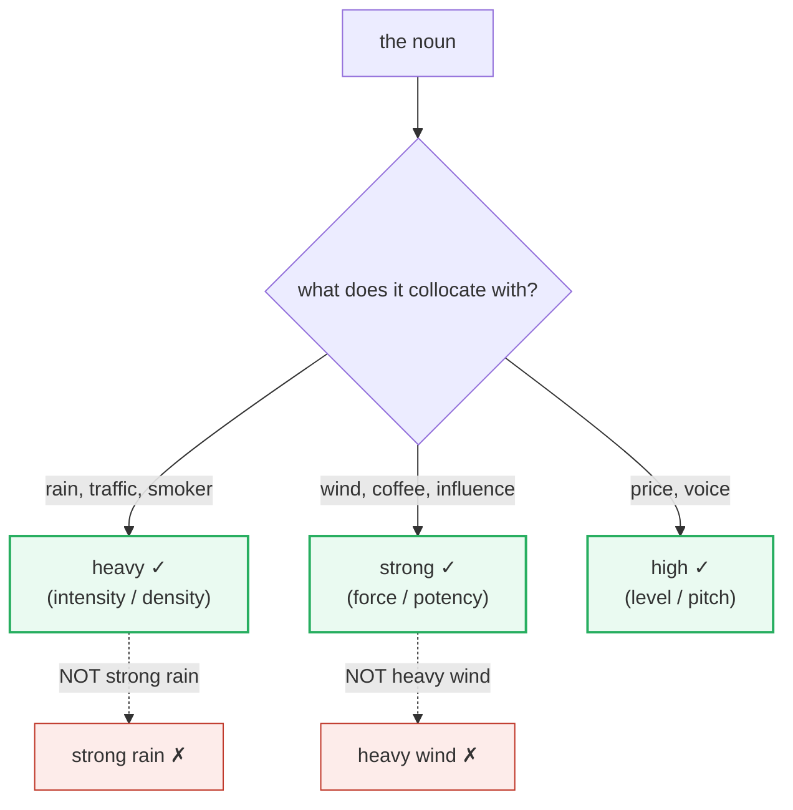

# Collocations

> **Phase 4 · discourse · bundle #72 · Days 143–144.**
> *make/do, strong/heavy, take/bring — what sounds right.*
>
> 🔗 This bundle sits in the Phase 4 "native-like flow" arc. It leans on
> [PHRASAL VERBS: WORK](./PHRASAL_VERBS_WORK.md) (a phrasal verb is just a
> collocation with a particle), and it is the foundation for
> [REGISTER SWITCHING](./REGISTER_SWITCHING.md) — you cannot switch register
> fluidly if your chunks are word-by-word translations. Back in Phase 0,
> [FINAL CONSONANTS](../pronunciation/FINAL_CONSONANTS.md) taught the same
> lesson at the sound level: the **chunk** is the unit, not the word.

---

## Why this is bundle #72 (read this first)

A Vietnamese learner with good grammar and a big vocabulary can still sound
*wrong* in a way they cannot diagnose. The cause is almost always a
**collocation**: two words that a native speaker glues together automatically
but that the learner assembled from a dictionary. *"I made my homework."*
*"There was strong rain."* *"Let's do a meeting."* Every word is a real English
word; every sentence is perfectly ungrammatical-feeling to a native ear —
because the **pairing** is wrong.

This is the deepest form of the "chunks, not words" principle. You do **not**
choose *make* or *do* by logic, and you do **not** choose *heavy* or *strong*
by looking up synonyms. You learn the **whole chunk** as a single unit, the way
a native speaker retrieved it as a child. That is what "sounds right" *means* —
and it is exactly the instinct that word-by-word translation destroys.

---

## 1. The principle: collocations are fixed, not logical

A collocation is a pairing of words that **habitually occur together**. They are
**not** freely interchangeable:

- *heavy* and *strong* are near-synonyms, but **rain** takes **heavy** and
  **wind** takes **strong**. You cannot swap them. There is no rule — only the
  chunk.
- *make* and *do* both mean "perform," but **decision** takes **make** and
  **homework** takes **do**. A dictionary will not tell you which.

The chunk is the unit of storage in a fluent speaker's mind. Learn it whole, or
sound like a translation forever.

---

## 2. make vs do — the verb + noun fault line

The #1 collocation error. **make = create/produce** (something new appears);
**do = perform/complete** (an activity, a duty, a task). The fault line is real
but leaky — every case is learned as a chunk.

| make + noun (create) | do + noun (perform) |
|---|---|
| **make** a decision | **do** homework |
| **make** progress | **do** business |
| **make** a mistake | **do** a favor |
| **make** money | **do** research |
| **make** an effort | **do** the dishes |

> From `collocations_corpus.md`:
>
> - **make a decision** /ˌmeɪk ə dɪˈsɪʒ.ən/ — Cambridge Dictionary dedicated
>   entry: https://dictionary.cambridge.org/dictionary/english/make-a-decision
> - **do business** /ˌduː ˈbɪz.nɪs/ — Oxford Learner's, *business* collocations:
>   https://www.oxfordlearnersdictionaries.com/definition/english/business
>
> Same verb-family, opposite glue. *Decision* is *produced*; *business* is
> *transacted*. The native does not reason about it — the chunk is stored whole.

**The Vietnamese trap:** Vietnamese uses one verb ("làm") for both *make* and
*do*. Word-by-word, *"làm bài tập"* → "make homework", *"làm quyết định"* → "do
a decision". Both are wrong. The fix is to store the English **noun already
welded to its verb**: not "decision + which verb?" but **make-a-decision** as
one lexical item.

---

## 3. heavy vs strong — the adjective + noun fault line

The #2 collocation error. The learner looks up "mạnh" / "nặng" and grabs the
first synonym — but each noun accepts only **one** of the near-synonyms.

> From `collocations_corpus.md`:
>
> - **heavy rain** /ˌhev.i ˈreɪn/ (NOT *strong rain*) — Oxford Collocations:
>   https://www.oxfordlearnersdictionaries.com/definition/english/rain_1
> - **strong wind** /ˌstrɒŋ ˈwɪnd/ UK · /ˌstrɔːŋ ˈwɪnd/ US (NOT *heavy wind*) —
>   Oxford Collocations:
>   https://www.oxfordlearnersdictionaries.com/definition/english/wind_1
> - **heavy smoker** /ˌhev.i ˈsməʊ.kər/ UK · /ˌhev.i ˈsmoʊ.kɚ/ US — has its own
>   dedicated Cambridge entry:
>   https://dictionary.cambridge.org/dictionary/english/heavy-smoker
>
> The Cambridge Collocation Dictionary states the principle verbatim: *"we say
> 'strong coffee' rather than 'powerful coffee.'"*

**The Vietnamese trap:** Vietnamese has no such restriction — "mưa to" (big
rain), "gió mạnh" (strong wind) — so the learner maps *mạnh* → *strong* and
attaches it to *rain* → "strong rain". Wrong. The noun *owns* its adjective;
learn the pair welded.

---

## 4. take / have / pay / catch — four more locked verbs

Four verbs that each claim their own nouns. Translate word-by-word and you
produce the classic errors:

| Right chunk | Wrong (word-by-word) | Why it locks |
|---|---|---|
| **take** a photo | *make/do a photo* | *take* = capture an image |
| **take** a break | *do/make a break* | fixed chunk |
| **take** a risk | *do/make a risk* | fixed chunk |
| **have** a meeting | *do/make a meeting* | *have* = hold/attend |
| **have** a look | *do/make a look* | fixed chunk |
| **pay** attention | *give/make attention* | *pay* = direct (fixed) |
| **catch** a cold | *get/take a cold* | fixed chunk |

> From `collocations_corpus.md` (all have dedicated Cambridge multi-word
> entries — they are listed chunks, not assembled):
>
> - **take a break** /ˌteɪk ə ˈbreɪk/ —
>   https://dictionary.cambridge.org/dictionary/english/take-a-break
> - **pay attention** /ˌpeɪ əˈten.ʃən/ —
>   https://dictionary.cambridge.org/dictionary/english/pay-attention
> - **catch a cold** /ˌkætʃ ə ˈkəʊld/ UK · /ˌkætʃ ə ˈkoʊld/ US —
>   https://dictionary.cambridge.org/dictionary/english/catch-a-cold

**The Vietnamese trap:** Vietnamese often uses "chụp" (take/capture) for photos
so *take a photo* sometimes survives — but "có cuộc họp" → "have a meeting" gets
mapped to *"make/do a meeting"*, and "chú ý" → "pay attention" becomes
*"give/make attention"*. The verb in the English chunk is **not translatable**;
it is part of the unit.

---

## 5. Cheat sheet — the ≤8 survival chunks

The Pareto set. Drill these eight aloud until each is retrieved **as one unit**,
never assembled. (Every row is a corpus attestation above.)

| # | Chunk | IPA | Why it's here |
|---|---|---|---|
| 1 | **make a decision** | /ˌmeɪk ə dɪˈsɪʒ.ən/ | *make* not *do* — the flagship make/do split |
| 2 | **do business** | /ˌduː ˈbɪz.nɪs/ | *do* not *make* — the performative side |
| 3 | **heavy rain** | /ˌhev.i ˈreɪn/ | *heavy* not *strong* — the flagship adj+noun split |
| 4 | **strong wind** | /ˌstrɒŋ ˈwɪnd/ UK · /ˌstrɔːŋ ˈwɪnd/ US | *strong* not *heavy* — the opposite glue |
| 5 | **make progress** | /ˌmeɪk ˈprəʊ.ɡres/ UK · /ˌmeɪk ˈprɑː.ɡres/ US | *make* not *do* — high-frequency work chunk |
| 6 | **take a break** | /ˌteɪk ə ˈbreɪk/ | *take* not *do/make* — the take/have/pay family |
| 7 | **pay attention** | /ˌpeɪ əˈten.ʃən/ | *pay* not *give* — the locked verb |
| 8 | **catch a cold** | /ˌkætʃ ə ˈkəʊld/ UK · /ˌkætʃ ə ˈkoʊld/ US | *catch* not *get* — fixed illness chunk |

> Open [`collocations.html`](./collocations.html) to drill these as flip cards,
> hear native clips, play the role-play (with the wrong-version contrast),
> shadow, and write.

---

## 6. Vietnamese → English L1 pitfalls table

The "expert payoff." These are the specific interference traps a Vietnamese
speaker hits on collocations — extend, don't replace, the seed rows from the
spec.

| Vietnamese trap (what you do) | English fix (what to do instead) |
|---|---|
| **One verb "làm" maps to both *make* and *do*** → "make homework", "do a decision" | Store the **noun already welded to its verb**: learn *make-a-decision*, *do-homework* as single units. Never ask "which verb for this noun?" in real time. |
| **Synonym substitution** — "mạnh" → *strong* attached to any noun → "strong rain", "strong traffic" | Learn the **adjective+noun pair** whole: *heavy-rain*, *heavy-traffic*, *strong-wind*. The noun owns one adjective; the pairing is arbitrary. |
| **Word-by-word translation** rebuilds every phrase → "make a meeting", "give attention", "make a photo" | Memorize the **fixed chunk** (*have a meeting*, *pay attention*, *take a photo*). If you can translate the verb out of the chunk, you've already broken it. |
| **Dictionary-synonym reflex** — looks up a near-synonym and assumes interchangeability ("strong = heavy = powerful") | Use a **collocation dictionary** (Oxford Collocations, BBI, Macmillan Collocations), not a thesaurus, when choosing which word glues to a noun. |
| **No "sounds right" instinct** — cannot self-monitor because the chunk was never stored whole | Re-read your own writing asking only: *"does this pairing sound right?"* If you're not sure, you don't know the chunk — look it up in a collocation dictionary and re-store it whole. |
| **L1 has no fixed verb-noun glue** ("có/họp", "làm/quyết định") → treats English verb choice as free | Drill the **collocation family** as a set: *make* {decision, progress, mistake, money}; *do* {homework, business, favor, research}. Retrieve the family, not the individual words. |
| **Over-generalizes one learned chunk** ("I know *make a decision*, so I'll say *make a choice*… then *make a photo*") | Each noun is a **separate** chunk — *make a choice* ✓ but *take a photo* ✓. Do not project. Learn each pairing on its own merits from a collocation dictionary. |
| **Translates the verb literally** ("chụp ảnh" = "take picture" survives, but "chú ý" = "pay attention" becomes "give attention") | Accept that the English verb is **idiomatic, not logical**. *pay* attention has nothing to do with money — it's the chunk. |

---

## How to practise this bundle (the daily 20 min)

1. **READ** (5 min) — this guide, §1–§4.
2. **SHADOW** (7 min) — open `collocations.html`, drill the 8 flip cards + the
   role-play **aloud**. Crucially: when you see the wrong-version contrast
   ("strong rain ✗"), say the **right** version ("heavy rain ✓") out loud.
3. **PRODUCE** (8 min) — the writing task: **fix 3 wrong collocations** (one
   make/do, one heavy/strong, one take/have). Write the corrected sentence,
   then read it aloud, retrieving the chunk as one unit.

---

## Sources

- Cambridge Advanced Learner's Dictionary — https://dictionary.cambridge.org/dictionary/english/{word}
  Dedicated multi-word entries: *make-a-decision, make-a-mistake, take-a-break,
  have-a-look, pay-attention, catch-a-cold, heavy-smoker*.
- Oxford Advanced Learner's Dictionary (collocation panels) — https://www.oxfordlearnersdictionaries.com/definition/english/{word}
- *Cambridge Collocation Dictionary* (Cambridge UP) —
  https://ftp.arcchurches.com/Download_PDFS/mL2EGC/601463/Cambridge%20Collocation%20Dictionary.pdf
- *Oxford Collocations Dictionary for Students of English* (OUP) — the noun→verb
  and noun→adjective reference (rain→heavy, wind→strong, decision→make,
  homework→do, photo→take, attention→pay).
- *BBI Dictionary of English Word Combinations* (Benson, Benson & Ilson) — the
  make/do fault-line reference.
- *Macmillan Collocations Dictionary* (Macmillan Education).
- Cambridge UP social post (canonical Verb+Noun collocation list) —
  https://www.facebook.com/CUPCambridgeDictionary/posts/collocation-is-when-two-or-more-words-are-often-used-together-and-sound-natural-/995758295918030/
- Boers et al., "Comparing the effectiveness of phrase-focused exercises" —
  https://www.lextutor.ca/cloze/n/boers_etal_2016.pdf
- "Do English language learners know collocations" (AMU Press) —
  https://pressto.amu.edu.pl/index.php/il/article/download/9049/8808/17555
- "Why Collocations Matter and How to Teach Them Effectively" —
  https://grade-university.com/blog/english-collocations-guide
- "Common Collocations in English" (Yak Yacker) —
  https://yakyacker.com/learn-english/common-collocations-in-english/
- Native audio: YouGlish — https://youglish.com/pronounce/{chunk}/english/us?
- Frequency methodology: wordfrequency.info (spoken sub-corpus) — https://www.wordfrequency.info/
