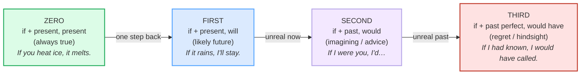

# Conditionals in Spoken English

> **Phase 4 · discourse · bundle #79 · Days 157–158.**
> *Real/unreal; "If I were you…", "I'd have…".*
>
> 🔗 This bundle sits late in the discourse arc. It leans on
> [NARRATIVE TENSES](./NARRATIVE_TENSES.md) (the past + past perfect that the
> third conditional is built from), and the advice pattern
> **"If I were you, I'd…"** is the grammatical core of
> [ADVISING](../speech_acts/ADVISING.md) (Phase 1) — here we explain *why* that
> chunk is shaped the way it is.

---

## Why conditionals break for Vietnamese learners (read this first)

Vietnamese has one word for *if* — **nếu** — and one for *then* — **thì** — and
it marks unreality **lexically, not grammatically**. "Nếu tôi có thời gian, tôi
sẽ giúp" keeps the verb in the **same tense** whether the condition is real or
unreal. English, by contrast, **backshifts the whole verb** to mark that a
situation is imaginary: "If I **had** time, I **would** help" means *I do NOT
have time now*. There is no tense change in Vietnamese, so learners either (a)
keep the present and say **"If I will have time, I go"**, or (b) over-apply the
rule and put `would` in the `if`-clause itself (**"If I would have time…"**).

This bundle is the **speech-first** map of conditionals: not the grammar-book
taxonomy for its own sake, but the handful of spoken chunks that cover ~85% of
real conditional use — advice, regret, and imagining — plus the contractions
(`I'd`, `I'd've`) that make spoken conditionals sound native.

---

## 1. The four-zone map (reality → remoteness)

Conditionals line up on a **reality ladder**: the further from real, the more
the verb **recedes** into the past. One diagram holds the whole system:

The single rule beneath the diagram: **each step away from reality pushes the
verb one tense further into the past.** Real = present. Unreal-now = past. Unreal-
past = past perfect. That is the whole engine.

---

## 2. The real zone — zero + first (easy for L1, drill the contraction)

Zero and first conditionals describe things that **are** or **will be** true.
Vietnamese *nếu…thì* maps onto them almost directly, so the trap here is not the
structure but the **first-conditional contraction**: "If it rains, **I'll** go"
is almost never said with a full "I will."

> From `conditionals_spoken_corpus.md`:
>
> - **Zero:** "Ice melts if you heat it." / "If I drink too much coffee, I can't
>   sleep at night." — structure: `if`/`when` + present → present.
> - **First:** "If it rains tomorrow, **I'll** take the car." — structure:
>   `if` + present → `will` + infinitive.

🔗 The weak form of the grammar words here (*it'll*, *I'll*) connects to
[LINKING](../pronunciation/LINKING.md) — "if-it-rains" links consonant-to-vowel
across the clause boundary.

---

## 3. The unreal-now zone — second (the advice engine)

This is the **highest-value** zone for spoken fluency, because it powers the
single most useful advice chunk in English:

> From `conditionals_spoken_corpus.md`:
>
> | If I were you, I'd call him. | I wouldn't worry if I were you. |
> |---|---|
> | /ˌɪf aɪ wə(r) ˈjuː, aɪd ˈkɔːl hɪm/ | /ˌaɪ ˈwʊdnt ˈwʌri ɪf aɪ wə(r) ˈjuː/ |
>
> Collins: *"You say 'if I were you' to someone when you are giving them
> advice."*

**Two things to notice, both L1 traps:**

1. **The verb is past (`were`/`had`), but the meaning is NOW.** "If I **had**
   time, I'd help" = I don't have time *right now*. Vietnamese has no such tense
   shift for unreality, so this feels wrong to the learner.
2. **"were", not "was."** The irrealis/subjunctive form is *if I were, if he
   were, if she were*. British Council: "it is grammatically correct to say *if
   I were* … however, it is also common to hear these structures with *was*." In
   the fixed advice chunk **"if I were you,"** `were` is near-mandatory —
   "if I was you" sounds non-native.

🔗 This is the grammatical spine of [ADVISING](../speech_acts/ADVISING.md) —
that bundle teaches *when* to give advice; this one teaches *why the verb looks
like that*.

---

## 4. The unreal-past zone — third (regret, hindsight, the hardest)

The third conditional is where learners **give up**: it stacks past + perfect +
irrealis, and it expresses something that **cannot be changed** — regret or
relief about the past.

> From `conditionals_spoken_corpus.md`:
>
> - **If I had known, I would have called.** — I didn't know, so I didn't call.
> - **If I had known about the meeting, I would have attended.** — a missed event.
>
> British Council: *"In third conditional sentences, use the past perfect
> (had known) in the if-clause and would have + past participle in the main
> clause."*

### The spoken collapse: "would have" → "would've" → "I'd've"

Nobody says "I would have called" with four full words. In real speech it
compresses, and the compression is where the **"would of"** error is born —
learners hear /ˈwʊdəv/ and back-spell it:

> From `conditionals_spoken_corpus.md`:
>
> | I'd've /ˈaɪdəv/ | would've /ˈwʊdəv/ |
> |---|---|
> | double contraction of *I would have* | contraction of *would have* |
>
> Collins: "**I'd've** (ˈaɪdəv) — contraction of, informal, *I would have*."
> Wiktionary: *"If I knew you were coming, I'd've baked a cake."*

The fix: learn the **sound** /ˈwʊdəv/ and the **spelling** `would've` together,
so the ear stops pulling you toward "would of."

---

## 5. Cheat sheet — the ≤8 survival chunks

The Pareto set. These eight cover advice, real futures, regret, and imagining.
(Every row is a corpus attestation above.)

| # | Chunk | IPA | Why it's here |
|---|---|---|---|
| 1 | **If I were you, I'd…** | /ˌɪf aɪ wə(r) ˈjuː, aɪd/ | the #1 advice pattern (2nd) |
| 2 | **If it rains, I'll stay.** | /ˌɪf ɪt ˈreɪnz, aɪl steɪ/ | real, likely future (1st) |
| 3 | **If I had time, I'd help.** | /ˌɪf aɪ həd ˈtaɪm, aɪd ˈhelp/ | unreal now — past verb, present meaning (2nd) |
| 4 | **If I had known, I would have called.** | /ˌɪf aɪ həd ˈnəʊn, aɪ wəd əv ˈkɔːld/ | unreal past — regret (3rd) |
| 5 | **I'd've gone if I'd known.** | /ˈaɪdəv ɡɒn ɪf aɪd ˈnəʊn/ | spoken double contraction |
| 6 | **If you heat ice, it melts.** | /ˌɪf juː ˈhiːt ˈaɪs, ɪt ˈmelts/ | general truth (zero) |
| 7 | **I wouldn't worry if I were you.** | /ˌaɪ ˈwʊdnt ˈwʌri ɪf aɪ wə(r) ˈjuː/ | reassurance (2nd) |
| 8 | **If I had the money, I'd start a business.** | /ˌɪf aɪ həd ðə ˈmʌni, aɪd stɑːt/ | imagining (2nd) |

> Open [`conditionals_spoken.html`](./conditionals_spoken.html) to drill these as
> flip cards, hear native clips, play the advice-and-regret role-play, shadow,
> and write one of each conditional.

---

## 6. Vietnamese → English L1 pitfalls table

The "expert payoff." These are the specific interference traps a Vietnamese
speaker hits on conditionals — extend, don't replace, the seed rows from the
spec.

| Vietnamese trap (what you do) | English fix (what to do instead) |
|---|---|
| **No tense backshift for unreality** — Vietnamese *nếu…thì* keeps the same tense whether real or unreal, so you say **"If I will have time, I go."** | Drop `will` from the `if`-clause. Real → "If I **have** time, I'll go." Unreal → "If I **had** time, I'd go." The past verb **marks the unreality**, not the time. |
| **Puts `would` in both clauses** — "If I would have time, I would go." | `would` lives only in the **result** clause, never in the `if`-clause: "If I **had** time, I **would** go." |
| **"If I was you" instead of "If I were you"** — Vietnamese has no subjunctive/irrealis form | Use the irrealis **`were`** in the fixed advice chunk: **"If I were you, I'd…"** Reserve `was` for casual/informal second conditionals, never for this chunk. |
| **Avoids the third conditional entirely** — it's the hardest, so learners switch to the past simple ("I didn't know so I didn't call") | Learn one **third-conditional frame** cold: "If I **had known**, I **would have** + past participle." It expresses regret/hindsight that the plain past cannot. |
| **"would of" for "would have"** — hears /ˈwʊdəv/ and back-spells it | The sound is /ˈwʊdəv/ but the spelling is **`would've`** (= would have). Drill the sound + spelling as one unit; say "would **have**," never "would **of**." |
| **Over-pronounces contractions** — says "I would have" with four full words, sounding stiff/bookish | Use the spoken contractions: **"I'd"** /aɪd/, **"I'll"** /aɪl/, **"would've"** /ˈwʊdəv/. Native speech contracts the grammar words; full forms sound formal. |
| **Confuses the time meaning** — thinks "If I had time" means the past | "If I **had** time, I'd help" = **now** (I don't have time now). The past verb is the unreality marker, not a time marker. Time meaning = present/future. |
| **Misses the `had` in the if-clause** — "If I knew, I would have called" (mixing 2nd and 3rd) | Third conditional needs **past perfect** in the `if`-clause: "If I **had known**, I would have called." Mixing the tenses scrambles the reality level. |

---

## How to practise this bundle (the daily 20 min)

1. **READ** (5 min) — this guide, §1–§4. Trace the reality ladder once.
2. **SHADOW** (7 min) — open `conditionals_spoken.html`, drill the 8 flip cards
   + the advice-and-regret role-play **aloud**, exaggerating the contractions
   (`I'd`, `would've`), then relaxing.
3. **PRODUCE** (8 min) — the writing task: **write one of each** — a real (1st),
   an unreal (2nd), and an unreal-past (3rd) conditional — about your own day.
   Read them aloud; check the `if`-clause has no `would` and the unreal ones use
   the past/past-perfect shift.

---

## Sources

- Cambridge Advanced Learner's Dictionary — *would* (/wʊd/ strong · /wəd/ weak, the `I'd` contraction note): https://dictionary.cambridge.org/us/pronunciation/english/would ; *I'll*: https://dictionary.cambridge.org/dictionary/english/i-ll ; *if I were you* idiom (under *instead*): https://dictionary.cambridge.org/dictionary/english/instead
- Collins Dictionary — *if I were you* (advice idiom): https://www.collinsdictionary.com/us/dictionary/english/if-i-were-you ; *I'd've* /ˈaɪdəv/: https://www.collinsdictionary.com/us/dictionary/english/id-give-anything
- Wiktionary — *would* (strong/weak forms): https://en.wiktionary.org/wiki/would ; *would've* /ˈwʊdəv/: https://en.wiktionary.org/wiki/would%27ve ; *I'd've* /ˈaɪdəv/: https://en.wiktionary.org/wiki/I%27d%27ve
- British Council LearnEnglish — "Conditionals: zero, first and second": https://learnenglish.britishcouncil.org/free-resources/grammar/b1-b2/conditionals-zero-first-second ; "Verbs in time clauses and 'if' clauses": https://learnenglish.britishcouncil.org/free-resources/grammar/english-grammar-reference/verbs-time-clauses-if-clauses
- British Council — *Reflection Tasks for Pre-Service Teacher Education* (third-conditional rule): https://www.britishcouncil.uz/sites/default/files/aellca-presett-reflection-tasks.pdf
- The London School of English — "The truth about conditionals": https://www.londonschool.com/blog/the-truth-about-conditionals/
- Carter, R. & McCarthy, M. *Cambridge Grammar of English* (CUP, 2006) — spoken conditionals.
- Huddleston, R. & Pullum, G. *The Cambridge Grammar of the English Language* (CGEL, CUP, 2002) — conditionals and the irrealis *were*.
- Native audio: YouGlish — https://youglish.com/pronounce/{chunk}/english/us?
- Frequency methodology: wordfrequency.info (spoken sub-corpus) — https://www.wordfrequency.info/
