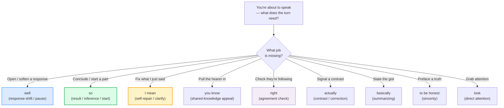

# Discourse Markers

> **Phase 4 · discourse · bundle #75 · Days 149–150.**
> *`well`, `so`, `I mean`, `you know`, `right`.*
>
> 🔗 This bundle is the connective tissue between earlier phases:
> [TOPIC TRANSITIONS](../speech_acts/TOPIC_TRANSITIONS.md) (Phase 1) drills the
> *topic-level* shifts ("Speaking of…", "Anyway") — this bundle drills the
> *turn-level* glue that makes speech flow. [FLUENCY FILLERS](./FLUENCY_FILLERS.md)
> (Phase 4 #76) drills the *buying-time* fillers ("Let me think…") — this bundle
> drills the *meaning-shaping* markers. Read them as a set.

---

## Why this is bundle #75 (read this first)

A Vietnamese learner who has reached Phase 4 is intelligible and can handle the
speech acts. What still makes them sound **textbook** — even **abrupt** — is
that their speech has no **glue**. "I am tired. I will go home. It is late."
Three correct, perfectly translated sentences. A native speaker in the same spot
says "Well, I'm **kind of** tired, so I think I'll head home, **you know**? It's
getting late." The vocabulary is almost identical. The difference is a handful
of tiny words — **well, so, you know, I mean, right** — that carry **no
translatable meaning** but do all the interactional work.

These are **discourse markers**. They are the #1 thing a listener uses to decide
"this person sounds natural" vs "this person sounds like a phrasebook." The trap
for a Vietnamese learner is double: **(1)** drop them entirely and sound robotic
/ abrupt (the L1 default — Vietnamese marks turn structure with particles like
*thì, mà, ấy, này*, not these English words); **(2)** over-use **one** marker —
almost always *so* — in every slot, which sounds equally foreign. The fix is
counter-intuitive: do **not** learn the word. Learn the **FUNCTION**, then map a
word onto it.

This bundle is spoken-first: the role-play is primary, the writing task is an
"insert the markers into a flat transcript" drill.

---

## 1. The mechanism: function, not word

A discourse marker does not add content. It tells the hearer **how to take** the
next chunk of talk. Schiffrin (1987) and Fraser (1999) call this **procedural**
meaning — an instruction for processing, not a piece of information. So the
question is never "what does *well* mean?" The question is **what job is *well*
doing in this turn?**

| Family | Job | Markers | Example |
|---|---|---|---|
| **Turn / response shift** | opens a response; buys a beat | well · (oh) | "**Well**, I'm not sure." |
| **Result / inference / start** | "therefore"; opens a new part | so · (then) | "**So**, what have you been doing?" |
| **Self-repair / clarification** | fixes or re-expands your own words | I mean · (or rather) | "…as a friend, **I mean**." |
| **Shared-knowledge appeal** | assumes the hearer follows; filler | you know | "It's difficult, **you know**?" |
| **Agreement check** | checks the hearer is with you | right · (okay) | "Twenty of each, **right**?" |
| **Contrast / correction** | signals a contrast with expectation | actually | "We're Canadian, **actually**." |
| **Summarizing / bottom-line** | states the gist | basically | "**Basically**, it's a good system." |
| **Sincerity preface** | "here's what I really think" | to be honest | "**To be honest**, I didn't like it." |
| **Direct attention** | "listen to this next bit" | look | "**Look**, that's not fair." |
| **Acknowledge understanding** | "I've got you" | I see (what you mean) | "**I see what you mean**." |

> From `discourse_markers_corpus.md` (the ten families, verbatim):
>
> - Turn/response-shift → **well** /wel/, **so** /səʊ/–/soʊ/
> - Self-repair → **I mean** /aɪ ˈmiːn/
> - Shared-knowledge appeal → **you know** /juː ˈnəʊ/–/juː ˈnoʊ/
> - Agreement check → **right** /raɪt/
> - Contrast/correction → **actually** /ˈæktʃuəli/
> - Summarizing → **basically** /ˈbeɪsɪkli/
> - Sincerity → **to be honest** /tə biː ˈɒnɪst/–/tə biː ˈɑːnɪst/
> - Direct attention → **look** /lʊk/
> - Acknowledge understanding → **I see what you mean** /aɪ ˈsiː wɒt juː ˈmiːn/

---

## 2. The PINNED anchors — "well" and "I mean"

These two are the most frequent and most mis-used markers; both **must** be in
the corpus with IPA + source, so the attestation is sanity-checkable.

> From `discourse_markers_corpus.md` (PINNED — the two anchors):
>
> - **well** /wel/ — Oxford *well* exclamation (well_3). Six+ pragmatic senses;
>   the core job for a learner is opening a response when a blunt yes/no would
>   be too direct. Verbatim attestations:
>   - (continuing after a break) "**Well**, as I was saying…"
>   - (uncertainty) "'Do you want to come?' '**Well**, I'm not sure.'"
>   - (pausing to consider) "I think it happened, **well**, towards the end of
>     last summer."
>   - (self-correction) "There were thousands of people there — **well**,
>     hundreds, anyway."
> - **I mean** /aɪ ˈmiːn/ — Cambridge Dictionary *I mean* ("used to correct what
>   you have just said"). Verbatim attestation (cited via Gobbato, *Formulaic
>   Language in Spoken English*, Unipd 2023, which quotes the Cambridge gloss):
>   - "I really do love him, as a friend, **I mean**."

**Why these two?** Schiffrin (1987) opens *Discourse Markers* with **well** (the
response marker) and devotes a chapter to **I mean** (the repair marker). They
are the two highest-frequency, highest-payoff markers in spoken English. Drill
them first; the rest slot into the function map around them.

---

## 3. "so" — the marker learners over-use

`so` is the one marker a Vietnamese learner already uses — and **over-uses**.
Because it most closely maps to Vietnamese *nên* / *vậy* / *thì*, learners reach
for it in every slot: opening, result, transition, filler. The fix is to learn
its **distinct** jobs and rotate in the right competitor (well, then, anyway):

> From `discourse_markers_corpus.md`:
>
> - (introduce a comment / question) "**So**, let's see. What do we need to
>   take?" / "**So**, what have you been doing today?" (Oxford, *so*
>   conjunction, sense 4 — conversation-starter)
> - (introduce the next part of a story) "So after shouting and screaming for an
>   hour she walked out in tears." (Oxford, *so* conjunction, sense 5 —
>   narrative step)
> - (final statement / summary) "**So**, that's it for today." (Oxford, *so*
>   conjunction, sense 7 — closing)

> **Caution:** if every turn you open starts with *So*, swap half of them for
> *Well* (softer / more reflective) or *Anyway* (topic reset). 🔗 See
> [TOPIC TRANSITIONS](../speech_acts/TOPIC_TRANSITIONS.md) for the *anyway /
> speaking of / that reminds me* family.

---

## 4. "you know" — the shared-knowledge appeal (NOT a literal question)

`you know` is the marker Vietnamese learners most often **misread literally** —
"do you know?" It is **not** a question. It is an appeal to shared knowledge
(assume the hearer follows) or a filler while thinking. Oxford (*know*, idioms)
gives three senses; the third (emphasis) is the one learners drop most.

> From `discourse_markers_corpus.md`:
>
> - (thinking / filler) "Well, **you know**, it's difficult to explain." (Oxford,
>   *know* → "you know" sense 1)
> - (shared-knowledge appeal) "Guess who I've just seen? Maggie! **You know** —
>   Jim's wife." / "**You know** that restaurant round the corner? It's closed
>   down." (sense 2)
> - (emphasis) "I'm not stupid, **you know**." (sense 3)

**The Vietnamese trap:** Vietnamese has *biết không* / *em biết không* which IS
a real question — so a Vietnamese learner either reads "you know?" as a question
the hearer must answer (awkward) or avoids it entirely (sounds cold). Treat
`you know` as **rhetorical glue**, not an information request.

---

## 5. "right" · "actually" · "basically" — check, contrast, summarize

These three each do one clear job:

| Marker | Job | Don't confuse it with |
|---|---|---|
| **right** | check the hearer agrees / has understood | a real "correct" (adj) |
| **actually** | signal a contrast / correct politely | "really?" (surprise question) |
| **basically** | state the gist / summarize | "essentially" is the formal twin |

> From `discourse_markers_corpus.md`:
>
> - `right` (check agreement): "So that's twenty of each sort, **right**?" /
>   "And I didn't think any more of it, **right**, but Mum says I should see a
>   doctor." (Oxford, *right* exclamation, sense 3)
> - `right` (get attention): "**Right!** Let's get going." (sense 2)
> - `actually` (polite correction): "We're not American, **actually**. We're
>   Canadian." / "They're not married, **actually**." (Oxford, *actually*,
>   sense 3)
> - `actually` (contrast / surprise): "It was **actually** kind of fun after
>   all." / "Our turnover **actually** increased last year." (sense 2)
> - `basically` (summarize): "There have been some problems but **basically**
>   it's a good system." / "**Basically**, there's not a lot we can do about
>   it." (Oxford, *basically*, senses 1 & 2)

> **Politeness tip:** *actually* is the **polite-correction** marker — it's how
> you disagree without sounding harsh ("We're not American, actually." is far
> softer than "We're not American."). 🔗 See
> [DIPLOMATIC DISAGREEMENT](../workplace/DIPLOMATIC_DISAGREEMENT.md) (Phase 2)
> for the workplace-grade version of this softening.

---

## 6. "to be honest" · "look" · "I see what you mean"

The last three each handle a specific move:

| Marker | Job |
|---|---|
| **to be honest** | preface a sincere / mildly critical opinion (TBH in text) |
| **look** | grab attention for the point you're about to make (often mild annoyance) |
| **I see what you mean** | tell the hearer you've understood them |

> From `discourse_markers_corpus.md`:
>
> - `to be honest`: "To be honest (= what I really think is), it was one of the
>   worst books I've ever read." / "To be perfectly honest, this was the worst
>   film I've ever seen." (Oxford, *honest*, sense 2) — and *TBH*: "I don't know
>   anything about it, **TBH**." (Oxford, *TBH* abbreviation)
> - `look`: "**Look**, I think we should go now." / "**Look**, that's not fair."
>   (Oxford, *look* exclamation)
> - `I see what you mean`: "Oh yes, **I see what you mean**." (Oxford, *see*,
>   "understand" sense)

> **Register note:** *look* and *to be honest* both flag directness — fine in
> casual speech, but in a formal email swap *Look,…* → *Please note,…* and
> *To be honest,…* → *Frankly,…* / *In my view,…*. 🔗 See
> [REGISTER SWITCHING](./REGISTER_SWITCHING.md) (Phase 4 #73).

---

## 7. Cheat sheet — the ≤8 survival chunks

The Pareto set. Drill these eight aloud until each one rolls out at the right
moment — by **function**, not by word. (Every row is a corpus attestation above.)

| # | Chunk | IPA | Why it's here |
|---|---|---|---|
| 1 | **well** | /wel/ | opens a response; buys a beat — "Well, I'm not sure." |
| 2 | **so** | /səʊ/ UK · /soʊ/ US | result / inference / conversation-starter — "So, what next?" |
| 3 | **I mean** | /aɪ ˈmiːn/ | self-repair / clarification — "…as a friend, I mean." |
| 4 | **you know** | /juː ˈnəʊ/–/juː ˈnoʊ/ | shared-knowledge appeal / filler — "…it's hard, you know?" |
| 5 | **right** | /raɪt/ | checks agreement — "Twenty of each, right?" |
| 6 | **actually** | /ˈæktʃuəli/ | contrast / polite correction — "We're Canadian, actually." |
| 7 | **basically** | /ˈbeɪsɪkli/ | summarizes / bottom-line — "Basically, it's a good system." |
| 8 | **look** | /lʊk/ | directs attention — "Look, that's not fair." |

> Open [`discourse_markers.html`](./discourse_markers.html) to drill these as
> flip cards, hear native clips, play the marker-rich role-play, shadow, and
> insert markers into a flat transcript.

---

## 8. Vietnamese → English L1 pitfalls table

The "expert payoff." These are the specific interference traps a Vietnamese
speaker hits on discourse markers — extend, don't replace, the seed rows from
the spec.

| Vietnamese trap (what you do) | English fix (what to do instead) |
|---|---|
| **Drops markers entirely** — "I am tired. I will go home." (correct, translated, robotic — because Vietnamese marks turn structure with particles *thì, mà, ấy*, not English exclamation words) | Add the glue: "Well, I'm kind of tired, so I think I'll head home, you know?" Aim for **one** marker per turn, in the right slot. |
| **Over-uses "so"** in every slot — opening, result, transition, filler — because *so* maps closely to Vietnamese *nên / vậy / thì* | Learn the **distinct jobs**: result → *so*; opening a reflective reply → *well*; topic reset → *anyway*; summary → *so, that's it*. Rotate; don't stack. |
| **Reads "you know?" as a literal question** the hearer must answer — because Vietnamese *biết không* IS a real question | Treat **you know** as **rhetorical glue** (shared-knowledge appeal) or a filler. Do NOT pause for an answer; keep talking through it. |
| **Translates "well" → "tốt"** and refuses to use it, because the dictionary meaning ("in a good way") doesn't fit | Learn **well** as a function word, not a translation: it opens a response when a blunt yes/no is too direct. Drill "Well, I'm not sure." / "Well, as I was saying…" |
| **Never self-repairs** — restarts the whole sentence from scratch (the Vietnamese *à, ý tôi là…* doesn't transfer automatically) | Use **I mean** to fix in-flight: "He's really… I mean, he's pretty talented." One marker, keep going — don't restart the turn. |
| **Mistakes "right?" for the adjective "correct"** — so it feels redundant ("It is correct, right?") | Use **right?** as a **standalone agreement-check** at the end: "So that's twenty of each, right?" No "it is" needed. |
| **Uses "actually" only as "in fact"** (the literal translation *thực ra*) and misses the **polite-correction** job | Use **actually** to soften corrections: "We're not American, actually. We're Canadian." — far gentler than the bare denial. |
| **Says "I understand"** in every slot (textbook over-formal) where a native says **"I see (what you mean)"** | Swap: when you've just followed someone, say "**I see what you mean**" / "**Right, I see.**" Save *I understand* for comprehension of a topic/skill. |
| **Confuses "to be honest" (sincerity preface) with "honestly" (can sound accusatory)** — "Honestly, I don't know" can read as defensive | Use **to be honest** (or **TBH** in text) for the warm, confessional move: "To be honest, I didn't love it." Reserve *honestly?* for a real question. |
| **Stresses every marker equally** — "**WELL.** **SO.** **I MEAN.**" (clipped, because Vietnamese is syllable-timed) | De-stress the marker: it's a **weak beat**. *well* → /wel/ (low, short); *I mean* → /aɪ mən/ (the *mean* reduces to /mən/ in fast speech). 🔗 See [SENTENCE STRESS](../pronunciation/SENTENCE_STRESS.md) + [REDUCTIONS](../pronunciation/REDUCTIONS.md). |
| **Inserts markers in writing as in speech** — opens a formal email with "Well, …" (because the chunk was drilled aloud) | Discourse markers are **spoken-first**. In writing, drop most of them; keep *however, therefore, in fact* (formal twins). 🔗 See [FORMAL VS CASUAL REGISTER](../writing/FORMAL_CASUAL_REGISTER.md). |

---

## How to practise this bundle (the daily 20 min)

1. **READ** (5 min) — this guide, §1–§6.
2. **SHADOW** (7 min) — open `discourse_markers.html`, drill the 8 flip cards +
   the role-play **aloud**, leaning into the **function** of each marker (pause
   on *well*, de-stress *I mean*, check upward on *right?*).
3. **PRODUCE** (8 min) — the writing task: take the flat transcript shown in the
   player and **insert** the right markers (one per slot — don't over-stack).
   Read it aloud; check each marker is the **right function** for its slot.

---

## Sources

- Oxford Advanced Learner's Dictionary —
  https://www.oxfordlearnersdictionaries.com/definition/english/{word}
  (entries for *well [exclamation, well_3]*, *so [conjunction, so_3]*, *know
  [verb, know_1] — the "you know" idioms block*, *right [exclamation, right_5]*,
  *actually*, *basically*, *honest* — the "To be honest (= what I really think
  is)" gloss*, *TBH*, *look [exclamation, look_3]*, *see_1*).
- Cambridge Advanced Learner's Dictionary —
  https://dictionary.cambridge.org/dictionary/english/i-mean
  (entry for *I mean*: "used to correct what you have just said" — the PINNED
  anchor; cited via Gobbato, *Formulaic Language in Spoken English*, Unipd 2023,
  which quotes the same Cambridge gloss verbatim).
- Cambridge Grammar —
  https://dictionary.cambridge.org/us/grammar/british-grammar/discourse-markers-so-right-okay
  (the canonical reference grouping *so, right, okay* as discourse markers).
- Merriam-Webster — https://www.merriam-webster.com/dictionary/see
  (*see* "to understand the meaning or importance of": "I see what you mean").
- Dictionary.com — https://www.dictionary.com/browse/i-see
  (*I see* / "I see what you mean" etymology note).
- Schiffrin, D. (1987). *Discourse Markers* (CUP) — the founding study;
  chapters on *well*, *so*, *I mean*, *you know*. https://www.cambridge.org/core/books/discourse-markers/
- Fraser, B. (1999). "What are discourse markers?" *Journal of Pragmatics* 31 —
  the "sequentially dependent elements that bracket units of talk" definition.
- Aijmer, K. (2002). *English Discourse Particles* (Benjamins).
- Müller, S. (2005). *Discourse Markers in Native and Non-native English
  Discourse* (Benjamins) — the learner / cross-linguistic perspective.
- Fung, L. & Carter, R. (2007). "Discourse markers and spoken English: native
  and learner use in pedagogic settings." *Applied Linguistics* 28.
- Frequency methodology: wordfrequency.info (spoken sub-corpus) —
  https://www.wordfrequency.info/ (ranks marked `≈`).
- Native audio: YouGlish — https://youglish.com/pronounce/{chunk}/english/us?
  (all 9 focus clips verified to resolve on 2026-06-24.)
