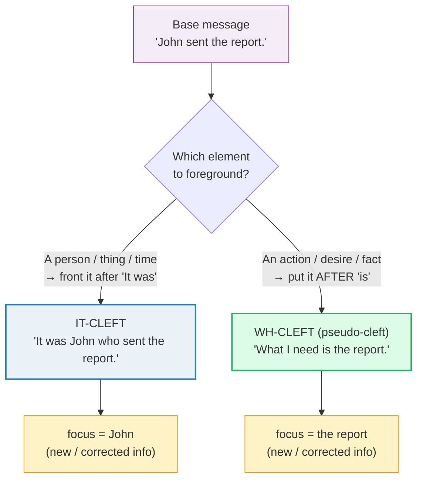

# Emphasis & Cleft Sentences

> **Phase 4 · discourse · bundle #78 · Days 155–156.**
> *"It was X that…", "What I mean is…"*
>
> 🔗 This bundle is the **emphasis layer** of Phase 4. It builds on
> [DISCOURSE MARKERS](./DISCOURSE_MARKERS.md) (#75 — the turn-glue *well, so, I
> mean*), [STORYTELLING STRUCTURES](./STORYTELLING_STRUCTURE.md) (#74 — where a
> cleft lands the "turn" of a story), and
> [SELF-CORRECTION STRATEGIES](../capstone/SELF_CORRECTION.md) (#87 — "What I
> *meant* was…" is a wh-cleft doing repair). It also leans on
> [SENTENCE STRESS](../pronunciation/SENTENCE_STRESS.md) (#06): a cleft only
> works if the focus element is **stressed** — otherwise it collapses back into
> a flat sentence.

---

## Why this is bundle #78 (read this first)

A Vietnamese learner at Phase 4 can say a correct sentence. What they usually
**cannot** do is make **one part** of it pop. Vietnamese marks emphasis with
word order, topic-comment structure, and particles (*chính…là* = "it is exactly…
that…", *phải…chứ* = "must be…", a rising *à/ơ* for contrast). There is **no
syntactic split** — no equivalent of taking *John called* and re-cutting it into
*It was **John** who called*. So when a learner wants to correct or foreground
something, two things go wrong:

1. **They sound flat.** Every element gets equal weight — "*John called
   yesterday.*" The listener cannot tell which part is the *new* or *corrected*
   information, so the emphasis is lost. The fix the learner reaches for —
   saying it louder — just sounds aggressive, not native.
2. **They mangle the construction.** When they try a cleft, they produce
   "It was **happened** that…" (inserting an extra verb), or "It was John
   **that** he called" (doubling the subject), or they drop *that/who*
   mid-sentence and lose the thread.

Cleft sentences are **the** native tool for *foregrounding one element* — for
emphasis, contrast, and correction. They are the difference between "I sent the
report" and "**It was me who sent the report** — not Mai." Two correct
sentences; only the second one lands the correction.

---

## 1. The mechanism: cleft = "split" the sentence to focus one part

The word *cleft* means **split in two**. A cleft takes a single message and
re-cuts it across **two clauses** so that one element is pushed to the front and
stressed. Cambridge's *English Grammar Today* defines it plainly:

> We use cleft sentences, especially in speaking, to connect what is already
> understood to what is new to the listener. In a cleft sentence, a single
> message is divided (cleft) into two clauses. This allows us to focus on the
> new information.

There are two families, and a learner who masters both controls English
emphasis:

The **focus** element is always the one that carries **stress** and the **new or
contrasted** information. Everything else is "old news" the listener already
has. That new/old split is what makes a cleft sound native.

---

## 2. It-clefts: "It was X that…" / "It was X who…"

The **it-cleft** is `It + be + [focus] + that/who + [rest]`. The element right
after *It was…* is the focus. Use **who** for a personal subject, **that** for
anything else (people included — *that* is always safe).

> From `emphasis_cleft_corpus.md`:
>
> - **It was Nina's car that got broken into!** — contrasts *Nina's* car, not
>   someone else's.
> - **It was my husband who (or that) you spoke to on the phone.** — *who* marks
>   the personal focus.
> - **It was you who invited me to the party yesterday.** — corrects who invited
>   whom.
> - **It was yesterday that you invited me to the party.** — foregrounds the
>   **time** *yesterday* (same base sentence, different focus!).
> - **It wasn't the Greek student who phoned.** — a **negative** cleft rules a
>   person *out*.

Notice the British Council pair: the *same* base sentence (*you invited me to
the party yesterday*) becomes **three different clefts** depending on which
element you foreground:

| Cleft | What's foregrounded |
|---|---|
| It was **you** who invited me… | the *person* (not someone else) |
| It was **yesterday** that you invited me… | the *time* (not another day) |
| It was **the party** that you invited me to… | the *event* (not another occasion) |

**The contrast function.** A cleft is the natural home for *"X, not Y"*:
"It was **John**, not Mary, who called." The *It was…* frame makes the
correction unmissable — far stronger than flat "John called, not Mary."

🔗 This is why it-clefts appear constantly in
[STORYTELLING STRUCTURES](./STORYTELLING_STRUCTURE.md): the "turn" of a story
("…and what happened next was…") is a cleft landing the punchline.

---

## 3. Wh-clefts (pseudo-clefts): "What I want is…" / "What happened was…"

The **wh-cleft** is `What-clause + be + [focus]`. Here the *what*-clause carries
the **background** (old info), and the element **after** *is* is the foregrounded
**new** info. It is extremely common in spoken English.

> From `emphasis_cleft_corpus.md`:
>
> - **What they like is smoked salmon.** — foregrounds the food.
> - **What we need to do is get new batteries for it.** — foregrounds the action.
> - **What I like best about going to the cinema is talking about the film
>   afterwards.** — foregrounds the activity.
> - **All I need is a roof over my head and a decent meal.** — *all* = "the only
>   thing" (Cambridge *all* entry, verbatim).
> - **What I found was that the films my friends liked were very different from
>   the ones I liked.** — foregrounds the discovery.

Three frames to retrieve as **chunks** (not to build word-by-word):

| Frame | Function | Example focus |
|---|---|---|
| **What I want is …** | foreground a desire/need | …*a clear answer.* |
| **What happened was …** | foreground the outcome of an event | …*the deadline moved.* |
| **All I need is …** | foreground "the only thing" | …*your signature.* |

> The Cambridge *all* entry glosses this frame explicitly: *all* meaning
> **"the only thing"** → "All I need is a roof over my head and a decent meal."
> That gloss is the whole pragmatic point — *All I need is…* shrinks the focus
> to one thing.

---

## 4. Discourse clefts: "What I mean is…" / "The thing is…"

These are the **interactive, spoken** wh-clefts. They are so frequent in
conversation that Cambridge files them under **discourse markers**, not just
grammar. Their job is **repair and point-setting**:

> From `emphasis_cleft_corpus.md` (Cambridge *discourse* entry):
>
> "We use words and phrases such as *well, I mean, in other words, the thing is,
> you know, you know what I mean, you see, what I mean is*."

- **"What I mean is…"** = re-explain / clarify after a misunderstanding. This is
  the cleft doing **self-repair** — the focus after *is* is the *corrected*
  meaning.
- **"The thing is…"** = introduce the key point, the catch, or the problem.
  Foregrounds the one fact that matters.

🔗 These overlap with
[DISCOURSE MARKERS](./DISCOURSE_MARKERS.md) (#75, "I mean") and
[SELF-CORRECTION STRATEGIES](../capstone/SELF_CORRECTION.md) (#87, "What I
*meant* was…"). The difference: #75 drills the **turn-glue** (*I mean* as a
filler); this bundle drills the **grammatical split** that makes the
clarification land.

---

## 5. Cheat sheet — the ≤8 survival chunks

The Pareto set. Drill these eight aloud until the focus element is **stressed**
and the frame rolls off automatically. (Every row is a corpus attestation above.)

| # | Chunk | IPA | Why it's here |
|---|---|---|---|
| 1 | **It was … that** | /ɪt wɒz … ðæt/ | the it-cleft frame — foreground a thing/time |
| 2 | **It was … who** | /ɪt wɒz … huː/ | it-cleft — foreground a **person** |
| 3 | **What I want is …** | /wɒt aɪ ˈwɒnt ɪz/ UK · /wɑːt aɪ ˈwɑːnt ɪz/ US | wh-cleft — foreground a desire |
| 4 | **What I mean is …** | /wɒt aɪ ˈmiːn ɪz/ | wh-cleft — clarify / self-repair |
| 5 | **What happened was …** | /wɒt ˈhæpənd wəz/ | wh-cleft — foreground the outcome |
| 6 | **All I need is …** | /ɔːl aɪ ˈniːd ɪz/ UK · /ɑːl aɪ ˈniːd ɪz/ US | wh-cleft — "the only thing" |
| 7 | **The thing is …** | /ðə ˈθɪŋ ɪz/ | discourse cleft — land the key point |
| 8 | **It was in … that** | /ɪt wɒz ɪn … ðæt/ | it-cleft — foreground a time/place (*in 2010*) |

> Open [`emphasis_cleft.html`](./emphasis_cleft.html) to drill these as flip
> cards, hear native clips, play the correction role-play, shadow, and write.

---

## 6. Vietnamese → English L1 pitfalls table

The "expert payoff." Vietnamese has **no cleft construction** — emphasis is
carried by word order, topic-comment, and particles (*chính…là*, *là…chứ*,
*phải*). That absence produces the traps below.

| Vietnamese trap (what you do) | English fix (what to do instead) |
|---|---|
| **No cleft construction** → everything has flat, equal emphasis: "John called yesterday." (no element pops) | Use an **it-cleft** to foreground the new/corrected part: "It was **John** who called yesterday." Stress the focus element. |
| **Emphasis = louder/longer only** → you shout the whole sentence; listener can't tell which part matters | Emphasis in English is **structural**, not just volume. A cleft moves the focus to a dedicated slot; only **that** element gets stress, the rest de-stresses. |
| **Topic-comment default** (Vietnamese: "John thì, gọi hôm qua" — "as for John, called yesterday") → transferred as flat English word order | Map the *thì/chính* emphasis onto an English cleft: "chính John gọi" → "**It was John who** called." |
| **Inserts an extra verb** → "It was **happened** that…" / "It is **John is** the one who…" | Drop the second copula/verb. Frame = `It + be + [focus] + that/who…` — **one** *be*, then the relative clause: "It **was** John who called." |
| **Drops *that/who* and loses the thread** → "It was John called" (sounds like two run-on sentences) | Keep *that* (or *who* for people) until the frame is automatic. *"It was John who called"* — the *who* is the hinge that marks the split. |
| **Can't choose who/that** → "It was John **that** he called" (doubled subject) or wrong relative | For a **person** focus use *who* (always safe); *that* works for anything. Never insert a second subject: "It was John who called," NOT "It was John who **he** called." |
| **No stress contrast** → says the cleft but stresses *It was* instead of the focus → the point vanishes | The **focus** element (right after *It was…* / before *is…*) takes the **primary stress**. "It was **JOHN** who called" — hit *John*, glide through *It was who*. 🔗 [SENTENCE STRESS](../pronunciation/SENTENCE_STRESS.md). |
| **Translates *là* as a flat copula everywhere** → "The problem is we are late" loses the foregrounding punch | Upgrade to a **wh-cleft** when you want the *second* part to pop: "What I **mean** is we're late" / "The **thing** is, we're late." |
| **Avoids clefts entirely** (sounds too "advanced") → stays at "I think… / I want…" and never foregrounds | Clefts are **spoken**, not formal. Cambridge stresses they're used *especially in speaking*. Retrieve them as chunks and deploy them for emphasis/correction, not just in writing. |

---

## How to practise this bundle (the daily 20 min)

1. **READ** (5 min) — this guide, §1–§4.
2. **SHADOW** (7 min) — open `emphasis_cleft.html`, drill the 8 flip cards +
   the correction role-play **aloud**, **stressing the focus element** every
   time (the part right after *It was…* / before *is…*).
3. **PRODUCE** (8 min) — the writing task: take a flat sentence and **rewrite
   it as a cleft** for emphasis. Try both families: an it-cleft
   ("It was … that…") and a wh-cleft ("What I want is…"). Read it aloud and
   confirm the focus word carries the stress.

---

## Sources

- *English Grammar Today* (Cambridge) — "Cleft sentences (It was in June we got
  married.)" — https://dictionary.cambridge.org/grammar/british-grammar/cleft-sentences-it-was-in-june-we-got-married
- British Council LearnEnglish — "Emphasis: cleft sentences, inversion and
  auxiliaries" (C1 grammar) — https://learnenglish.britishcouncil.org/free-resources/grammar/c1/emphasis-cleft-sentences-inversion-auxiliaries
- Cambridge Advanced Learner's Dictionary — *all* (UK /ɔːl/, US /ɑːl/; verbatim
  example "All I need is a roof over my head and a decent meal.") —
  https://dictionary.cambridge.org/dictionary/english/all
- Cambridge Advanced Learner's Dictionary — *happen* (UK/US /ˈhæp.ən/) —
  https://dictionary.cambridge.org/dictionary/english/happen
- Cambridge Advanced Learner's Dictionary — *discourse* (lists "what I mean is",
  "the thing is" as discourse markers) —
  https://dictionary.cambridge.org/dictionary/english/discourse
- Cambridge Advanced Learner's Dictionary — entries for *mean* /miːn/, *thing*
  /θɪŋ/, *want* /wɒnt/–/wɑːnt/, *need* /niːd/, *send* /send/, *matter*
  /ˈmætə/, *promise* /ˈprɒmɪs/–/ˈprɑːmɪs/, *John* /dʒɒn/–/dʒɑːn/.
- Nguyen, "The systematic reduction of English syllable-final consonants" (GMU
  Linguistics Club) — https://orgs.gmu.edu/lingclub/WP/texts/6_Nguyen.pdf
- "Vietnamese Phonology: A Complete Guide" (Remitly) —
  https://www.remitly.com/blog/education/vietnamese-phonology-guide/
- Frequency methodology: wordfrequency.info (spoken sub-corpus) —
  https://www.wordfrequency.info/
- Native audio: YouGlish — https://youglish.com/pronounce/{phrase}/english/us?
