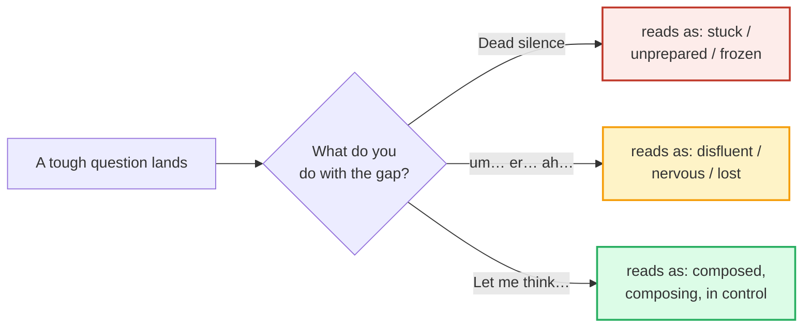

# Fluency Fillers / Buying Time

> **Phase 4 · discourse · bundle #76 · Days 151–152.**
> *"Let me think", "How should I put it".*
>
> 🔗 This bundle sits between [DISCOURSE MARKERS](./DISCOURSE_MARKERS.md) (the
> broader *well / so / I mean / you know* family — Day 149–150) and
> [VAGUE LANGUAGE](./VAGUE_LANGUAGE.md) (Day 153–154). Where discourse markers
> *connect* ideas, fluency fillers **buy time** and **hold the floor** while you
> compose the next idea. Down the road it feeds
> 🔗 [SPEAKING UNDER PRESSURE](../capstone/SPEAKING_UNDER_PRESSURE.md) — the
> interview/panel scenario where buying-time fluency is tested hardest.

---

## Why this bundle exists (read this first)

The fear: *"if I pause, I sound like I don't know the answer."* So a Vietnamese
learner does one of two things in English when a tough question lands —

1. **Freezes in silence** — stares, says nothing, looks stuck and unprepared.
2. **Floods the gap with** `um… er… ah…` — sounds disfluent and nervous.

Both are worse than the cure, and the cure is counter-intuitive: **say
something.** A short, lexicalized phrase — *"Let me think"*, *"How should I put
it"* — buys the *same* 1–3 seconds of planning time, but it makes you sound
**composed and in control of the floor**, not stuck. This is the central
**paradox** of the bundle:

> **A well-placed filler sounds MORE fluent than dead silence.**

Silence reads as "I have nothing." A phrase filler reads as "I'm composing
something good — wait for it." That perception gap is the whole point. Native
speakers stall constantly; they just do it with *words*, so you don't notice the
stall.

---

## 1. The mechanism: buying time = holding the floor

In conversation, silence is *ambiguous*. A pause after a question can mean *I'm
thinking*, *I didn't hear*, *I disagree*, or *I have no idea*. A **fluency
filler** removes the ambiguity: it tells the listener exactly which one it is,
and signals **"the floor is still mine — I'm coming back."*

Cambridge documents this function explicitly. The *let's see* entry (which lists
"also *let me see/think*") defines it as *"used when you want to think carefully
about something or are trying to remember."* The *well* grammar section states
that as a discourse marker *"its main function is to show that we are thinking
about the question that we have been asked."* That is the buying-time function,
named by the dictionary itself.

---

## 2. The four filler jobs (not all fillers are equal)

Fluency fillers split by **what they buy time FOR**. Knowing the job lets you
pick the right one instead of repeating *"Let me think"* on every question
(which itself starts to sound stuck).

| Job | When | The chunk |
|---|---|---|
| **Stall to think** | you need 1–3 seconds to form the answer | *Let me think…* · *Let me see…* · *Well…* |
| **Soften & frame** | the answer needs tact / the right wording | *How should I put it…* · *That's a good question.* |
| **Word-search** | you know the concept but not the English term | *What's the word I'm looking for?* · *It's on the tip of my tongue.* |
| **Resume** | you paused/interrupted and need to restart | *Where was I?* · *As I was saying,…* |

> From `fluency_fillers_corpus.md` (§A — stall to think, verbatim):
>
> - **Let me think** /ˌlet mi ˈθɪŋk/ — "The last time I spoke to her was, now
>   **let me think**, three weeks ago." (Cambridge, *let's see*.)
> - **Let me see** /ˌlet miː ˈsiː/ — "How many people will be there?" "Well,
>   **let's see** – I think it's about 20." (Cambridge, *let's see*, AmE.)
> - **Well…** /wel/ — "Well, what should we do now?" (Cambridge, *well*,
>   discourse marker.)

---

## 3. The pinned chunks (drill these two until automatic)

These two cover ~80% of real buying-time moments. If you can deploy them
reflexively, you never freeze and you never need `um`.

> From `fluency_fillers_corpus.md`:
>
> | Let me think | How should I put it |
> |---|---|
> | /ˌlet mi ˈθɪŋk/ | /ˈhaʊ ʃʊd aɪ ˈpʊt ɪt/ |
> | "used when you want to think carefully about something" (Cambridge, *let's see*) | buying time to find the right / tactful wording (Cambridge, *put* EXPRESS) |
> | *"The last time I spoke to her was, now **let me think**, three weeks ago."* | *"\\"What's her new boyfriend like?\\" \\"Well, **how shall I put it?** He's unusual.\\""* |

**Why these two:** *Let me think* is the pure stall (no content, just time).
*How should I put it* is the stall **plus** a promise of care — it tells the
listener the upcoming answer is worth the wait, which is why it's the gold
standard in interviews and delicate topics. Cambridge's own *put* example is the
attestation: *"how shall I put it?"* is in the dictionary.

---

## 4. Delivery: the fillers must *sound* fluent

A filler said wrong sounds worse than none. Three delivery rules:

1. **Hold the floor, don't trail off.** *Let me think…* is said with a **level or
   slightly rising** tone — you're still in the conversation. A falling,
   fading *"let me think..."* sounds like you're giving up. 🔗 See
   [INTONATION](../pronunciation/INTONATION.md).
2. **Stretch the vowel, don't clip it.** *We**ee**ll…* /weːl/ buys more time than
   a fast *well*. The lengthened vowel **is** the stalling mechanism.
3. **Follow through.** A filler is a *bridge*, not an ending. Always have your
   answer ready on the other side: *"Let me think… I'd say the main reason is…"*
   A filler with no answer after it confirms you were stuck.

> From `fluency_fillers_corpus.md` (the disfluency contrast, §D):
>
> The paradox in one line: a **lexicalized filler** (*Let me think*) is rated as
> **more fluent** than a **filled pause** (*um / uh*), and both beat **dead
> silence**. So the order of preference is: **phrase filler > um/uh > silence.**
> `um/er/ah` aren't banned — just minimized, because the phrase version does the
> same job and sounds composed.

---

## 5. Cheat sheet — the ≤8 survival chunks

The Pareto set. Drill these aloud until each fires reflexively the moment a
question lands. (Every row is a corpus attestation above.)

| # | Chunk | IPA | Why it's here |
|---|---|---|---|
| 1 | **Let me think** | /ˌlet mi ˈθɪŋk/ | the pure stall — buys time, holds the floor |
| 2 | **How should I put it** | /ˈhaʊ ʃʊd aɪ ˈpʊt ɪt/ | stall + promises a careful/tactful answer |
| 3 | **That's a good question** | /ˌðæts ə ˌɡʊd ˈkwestʃən/ | stalling compliment — flatters + buys time (interviews) |
| 4 | **Let me see** | /ˌlet miː ˈsiː/ | stall to remember/recall a fact |
| 5 | **Give me a second** | /ˌɡɪv miː ə ˈsekənd/ | overt, friendly request for a moment |
| 6 | **Well…** | /wel/ | the discourse-marker opener for a considered reply |
| 7 | **What's the word I'm looking for?** | /ˌwɒts ðə ˈwɜːd aɪm ˈlʊkɪŋ fɔː(r)/ | overt word-search (vs freezing on a missing term) |
| 8 | **Where was I?** | /ˌweə(r) wəz ˈaɪ/ | resume the thread after a pause/interruption |

> Open [`fluency_fillers.html`](./fluency_fillers.html) to drill these as flip
> cards, hear native clips, play the interview role-play, shadow, and write.

---

## 6. Vietnamese → English L1 pitfalls table

The "expert payoff." These are the specific interference traps a Vietnamese
speaker hits on buying-time fluency — extend, don't replace, the seed rows from
the spec.

| Vietnamese trap (what you do) | English fix (what to do instead) |
|---|---|
| **Freezes in dead silence when thinking** — stares, says nothing, looks stuck/unprepared | Deploy a **buying-time phrase** reflexively: *"Let me think…"* / *"That's a good question."* A phrase filler sounds composed where silence sounds frozen. |
| **Overuses** `um… ơ… à…` **(Vietnamese ơ/à/à-nee)** carried into English | Replace with the **lexicalized** versions: *"Let me see…"*, *"Well…"*. Phrase fillers are rated more fluent than `um/uh`; minimize the bare filled pauses. |
| **No filler reflex at all** — Vietnamese often signals thinking with a flat silence or a nod, not a lexical marker | Pre-load **2–3 fillers** so they fire automatically. The goal is reflex, not recall: drill them until they precede conscious thought. |
| **Trailed-off, falling-tone filler** — *"let me think..."* said like a sigh, sounds like giving up | Say it with **level/rising tone** + a **stretched vowel** (*We**ee**ll…*). The filler must signal "I'm holding the floor," not "I surrender." |
| **Filler with no follow-through** — *"Let me think…"* then another long silence | A filler is a **bridge**, not an ending. Always have the answer queued: *"Let me think… I'd say…"*. Bridge → answer, never bridge → more silence. |
| **Direct-translates a Vietnamese hedge** ("à để tôi xem" → "ah let me see") keeping the Vietnamese **"à/ờ"** particle | Drop the L1 particle; lead with the **English** lexical filler. *"À, để xem"* → *"Let me see…"* (no leading *à*). |
| **Apologizes for thinking** — *"Sorry, I need to think"* (over-polite, sounds insecure) | Don't apologize for a normal cognitive act. *"That's a good question. Let me think…"* is confident; *"Sorry"* is not needed and undercuts you. |
| **Uses** `How to say…` **(Chinglish/calque)** — a common Vietnamese-learner calque | Use the native chunk: *"How should I put it…"* (Cambridge-attested), never the calqued *"How to say."* |
| **Confuses stall and resume** — uses *"Let me think"* when they actually lost their place | Match the job: lost your place → *"Where was I?"* / *"As I was saying…"*; need time → *"Let me think."* (See §2's four jobs.) |

---

## How to practise this bundle (the daily 20 min)

1. **READ** (5 min) — this guide, §1–§4.
2. **SHADOW** (7 min) — open `fluency_fillers.html`, drill the 8 flip cards +
   the interview role-play **aloud**, stretching the filler vowels and holding a
   level tone.
3. **PRODUCE** (8 min) — the writing task: respond to a tough question with a
   **buying-time filler + your answer**. Then say your response aloud,
   recording yourself; check the filler sounds composed, not apologetic.

---

## Sources

- Cambridge Advanced Learner's Dictionary —
  - *let's see* (also *let me see/think*): https://dictionary.cambridge.org/us/dictionary/english/let-s-see
  - *put* (EXPRESS sense — attests "how shall I put it?"): https://dictionary.cambridge.org/us/dictionary/english/put
  - *well* (discourse-marker grammar — "showing we are thinking about the question"): https://dictionary.cambridge.org/us/dictionary/english/well_1
  - *on the tip of your tongue* (word-search idiom): https://dictionary.cambridge.org/us/dictionary/english/on-the-tip-of-tongue
  - *now* (attests "Now where was I before you interrupted me?"): https://dictionary.cambridge.org/us/dictionary/english/now
  - *question* /ˈkwestʃən/, *second* /ˈsekənd/, *say* /seɪ/, *think* /θɪŋk/, *see* /siː/, *um* /ʌm/: https://dictionary.cambridge.org/dictionary/english/{word}
- Schiffrin, D. *Discourse Markers* (CUP, 1987) — *well* as a response marker.
- Fraser, B. (1990), "An approach to discourse markers," *Journal of Pragmatics* 14.
- Müller, S. (2005), *Discourse Markers in Native and Non-native English Discourse* (Palgrave).
- "The role of pragmatic markers in perceptions of L2 fluency in dialogue" (*Journal of Pragmatics*) — https://www.sciencedirect.com/science/article/abs/pii/S0346251X23001793
- "Investigating the effects of fillers in spontaneous speech" (VNU ULIS) — https://jfs.ulis.vnu.edu.vn/index.php/fs/article/view/5428
- "Expanding to the peripheries" (*Journal of Pragmatics*) — attests "how should I put it?": https://www.sciencedirect.com/science/article/pii/S2215039016300753
- Native audio: YouGlish — https://youglish.com/pronounce/{chunk}/english/us?
- Frequency methodology: wordfrequency.info (spoken sub-corpus) — https://www.wordfrequency.info/
